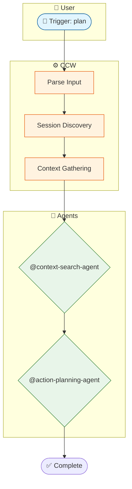

# Workflow Visualize Command

Generate comprehensive Mermaid flowcharts for any workflow command or skill.

## Usage

```bash
/workflow:visualize <workflow-path> [--output <path>] [--detail <level>]
```

### Parameters

| Parameter       | Description                                      | Default                                           |
| --------------- | ------------------------------------------------ | ------------------------------------------------- |
| `workflow-path` | Path to workflow command file or skill directory | Required                                          |
| `--output`      | Output path for the generated diagram            | `.workflow/.scratchpad/workflow-visual-{name}.md` |
| `--detail`      | Detail level: `simple` \| `standard` \| `full`   | `standard`                                        |

### Examples

```bash
# Visualize a workflow command
/workflow:visualize .claude/commands/workflow/plan.md

# Visualize a skill with full detail
/workflow:visualize .claude/skills/review-code --detail full

# Custom output path
/workflow:visualize .claude/commands/ccw.md --output ./ccw-diagram.md
```

## What It Generates

A **comprehensive flowchart** containing:

1. **👤 User Interaction Layer**
   - Entry points and triggers
   - User decision points
   - Confirmation flows

2. **⚙️ CCW Orchestration Layer**
   - Command parsing and routing
   - Phase transitions
   - TodoWrite tracking

3. **🤖 Agent Execution Layer**
   - Agent types and assignments
   - Task delegation patterns
   - Context passing

4. **🛠️ Tool Integration Layer**
   - CLI tool invocations
   - MCP tool usage
   - File operations

## Output Structure

````markdown
# Workflow Visualization: [Name]

## Overview

- Type: command|skill
- Phases: N
- Agents: N

## Execution Flow

```mermaid
flowchart TD
    %% Complete workflow diagram
```
````

## Phase Details

| Phase | Agent | Description |

## Agent Usage

| Agent | Purpose |

```

## Large Diagram Handling

When diagrams exceed comfortable viewing size, the visualizer:

1. **Uses subgraphs** to group related components
2. **Adds styling classes** for visual clarity
3. **Suggests ccw mcp** for editing very large diagrams

### For Very Large Workflows

The output includes:
- **Overview diagram** - High-level flow only
- **Per-phase deep dives** - Detailed subgraphs

## Implementation

### Execution Flow

```

Phase 1: Parse Workflow
└─ Read source file(s)
└─ Extract phases, agents, tools

Phase 2: Analyze Flow
└─ Build node-edge graph
└─ Map dependencies

Phase 3: Generate Diagram
└─ Create Mermaid flowchart TD
└─ Apply styling

Phase 4: Validate & Output
└─ Check syntax
└─ Write to file

````

## Example Output

For `/workflow:visualize .claude/commands/workflow/plan.md`:

```markdown
# Workflow Visualization: plan

## Overview
| Attribute | Value |
|-----------|-------|
| **Type** | command |
| **Phases** | 4 |
| **Agents** | 3 |

## Execution Flow


## Technical Details

### Parsing Strategy

1. **Command Files (.md)**
   - Parse YAML frontmatter
   - Extract execution phases
   - Find Task() agent calls
   - Identify tool usage

2. **Skill Directories**
   - Read SKILL.md metadata
   - Parse phase files
   - Extract action definitions
   - Map orchestrator flow

### Diagram Layout

The generated Mermaid uses:
- **flowchart TD** (top-down) for clear hierarchy
- **Subgraphs** to organize layers
- **Class definitions** for consistent styling
- **Direction hints** for complex layouts

### Validation

Before output, validates:
- Node ID syntax
- Edge connections
- Subgraph balance
- Label escaping

## Troubleshooting

### "File not found"
- Check the path is relative to project root
- Verify file exists

### "Invalid workflow format"
- File may not be a valid command/skill
- Check frontmatter format

### "Diagram too large"
- Use `--detail simple` for compact view
- Consider splitting visualization
- Use `ccw mcp` to edit the output
```
