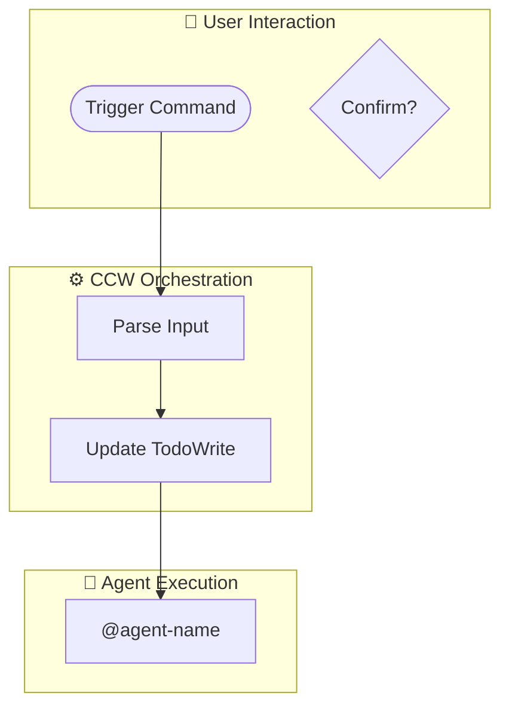

# Workflow Visualizer Skill

Generate comprehensive Mermaid flowcharts visualizing workflow execution flow, CCW interactions, and Agent orchestration.

## Trigger

- `workflow-visualizer`
- `flowchart`
- `workflow diagram`
- `mermaid flow`
- `visualize workflow`

## Syntax

```bash
/workflow:visualize <workflow-path> [--output <path>] [--detail <level>]
```

### Parameters

| Parameter | Description | Default |
|-----------|-------------|---------|
| `workflow-path` | Path to workflow command file or skill directory | Required |
| `--output` | Output path for the generated diagram | `.workflow/.scratchpad/workflow-visualization.md` |
| `--detail` | Detail level: `simple` \| `standard` \| `full` | `standard` |

### Examples

```bash
# Visualize a workflow command
/workflow:visualize .claude/commands/workflow/plan.md

# Visualize a skill
/workflow:visualize .claude/skills/review-code

# Full detail with custom output
/workflow:visualize .claude/commands/ccw.md --detail full --output ./ccw-flow.md
```

## Architecture

```
┌─────────────────────────────────────────────────────────────┐
│                    Workflow Visualizer                      │
├─────────────────────────────────────────────────────────────┤
│                                                             │
│  ┌──────────────┐    ┌──────────────┐    ┌──────────────┐  │
│  │   Parser     │───▶│  Analyzer    │───▶│  Generator   │  │
│  └──────────────┘    └──────────────┘    └──────────────┘  │
│         │                   │                   │           │
│         ▼                   ▼                   ▼           │
│  • Extract phases    • Build flow graph    • Mermaid TD    │
│  • Find agents       • Map dependencies    • Subgraphs     │
│  • Parse tools       • Identify loops      • Styling       │
│                                                             │
└─────────────────────────────────────────────────────────────┘
```

## Generated Diagram Structure

The visualizer produces a **comprehensive flowchart** containing:

### 1. User Interaction Layer
- Entry points (commands, triggers)
- User decision points
- Confirmation flows

### 2. CCW Orchestration Layer
- Command sequence
- Phase transitions
- TodoWrite tracking

### 3. Agent Execution Layer
- Agent types and assignments
- Task delegation patterns
- Context passing

### 4. Tool Integration Layer
- CLI tool invocations
- MCP tool usage
- File operations

## Output Format

```markdown
# Workflow Visualization: [Name]

## Overview
- **Type**: [command|skill]
- **Complexity**: [simple|medium|complex]
- **Phases**: [N]
- **Agents**: [N]

## Flowchart



## Phase Details

| Phase | Action | Agent | Output |
|-------|--------|-------|--------|
| 1 | Discovery | - | Session ID |
| 2 | Context | @context-agent | Package |
```

## Large Diagram Handling

When diagrams exceed comfortable viewing size:

1. **Use subgraphs** to group related components
2. **Add click handlers** for interactive navigation
3. **Generate summary view** with detail expansion
4. **Export to file** for external Mermaid editors

For very large workflows, the diagram is split into:
- **Overview diagram** - High-level flow only
- **Detailed diagrams** - Per-phase deep dives

## Implementation

### Phase 1: Parse Workflow
Extract structure from source files

### Phase 2: Analyze Flow
Build execution graph with dependencies

### Phase 3: Generate Diagram
Create Mermaid flowchart with proper layout

### Phase 4: Output & Validate
Save to file with syntax validation

## Agent Assignment

| Task | Agent |
|------|-------|
| Parse workflow files | @universal-executor |
| Generate Mermaid | @universal-executor |
| Validate syntax | @universal-executor |
