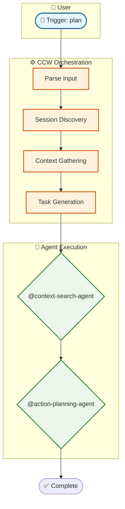

# Action: Complete Visualization

Finalize and output the workflow visualization.

## Input

```json
{
  "mermaid_code": "string - Validated Mermaid diagram",
  "parsed_data": {
    "name": "workflow-name",
    "description": "...",
    "type": "command|skill",
    "phases": [...],
    "agents": [...]
  },
  "output_path": "string - Where to save"
}
```

## Task

1. **Generate Output Document**
   - Header with workflow info
   - Overview statistics
   - The Mermaid diagram
   - Phase details table
   - Agent usage summary

2. **Write to File**
   - Save to specified output path
   - Create directories if needed

3. **Return Summary**
   - Output file path
   - Diagram statistics
   - Next steps

## Output Format

```json
{
  "status": "completed",
  "output": {
    "file_path": "/path/to/output.md",
    "file_size": 2048,
    "lines": 150
  },
  "summary": {
    "workflow_name": "plan",
    "workflow_type": "command",
    "phases": 4,
    "agents": 3,
    "nodes": 25,
    "edges": 30
  }
}
```

## Document Template

```markdown
# Workflow Visualization: {{name}}

## Overview

| Attribute | Value |
|-----------|-------|
| **Type** | {{type}} |
| **Source** | {{source_path}} |
| **Complexity** | {{complexity}} |
| **Phases** | {{phase_count}} |
| **Agents** | {{agent_count}} |

## Execution Flow

\`\`\`mermaid
{{mermaid_code}}
\`\`\`

## Phase Details

| Phase | Description | Agent | Key Actions |
|-------|-------------|-------|-------------|
| {{phases}} |

## Agent Usage

| Agent | Used In | Purpose |
|-------|---------|---------|
| {{agents}} |

## Tool Integration

| Tool | Usage Count |
|------|-------------|
| {{tools}} |

## Notes

- Generated at: {{timestamp}}
- Detail level: {{detail_level}}
- For large diagrams, use `ccw mcp` to edit

---

*Generated by workflow-visualizer skill*
```

## Example Output

```markdown
# Workflow Visualization: plan

## Overview

| Attribute | Value |
|-----------|-------|
| **Type** | command |
| **Source** | .claude/commands/workflow/plan.md |
| **Complexity** | medium |
| **Phases** | 4 |
| **Agents** | 3 |

## Execution Flow



## Phase Details

| Phase | Description | Agent | Key Actions |
|-------|-------------|-------|-------------|
| 1 | Session Discovery | - | Create session |
| 2 | Context Gathering | @context-search-agent | Analyze codebase |
| 3 | Conflict Resolution | - | Detect conflicts |
| 4 | Task Generation | @action-planning-agent | Create IMPL JSONs |

## Agent Usage

| Agent | Used In | Purpose |
|-------|---------|---------|
| @context-search-agent | Phase 2 | Gather codebase context |
| @action-planning-agent | Phase 4 | Generate implementation tasks |

---

*Generated by workflow-visualizer skill*
```

## File Path Resolution

1. **If output_path provided**: Use as-is
2. **If not provided**: `.workflow/.scratchpad/workflow-visual-{name}-{timestamp}.md`
3. **Ensure directory exists**: Create parent directories

## Post-Completion

After output file is written:

1. Display summary to user
2. Provide file path for reference
3. Suggest next steps:
   - View diagram in Mermaid Live Editor
   - Edit with `ccw mcp`
   - Generate different detail level
