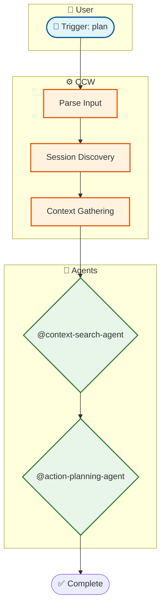
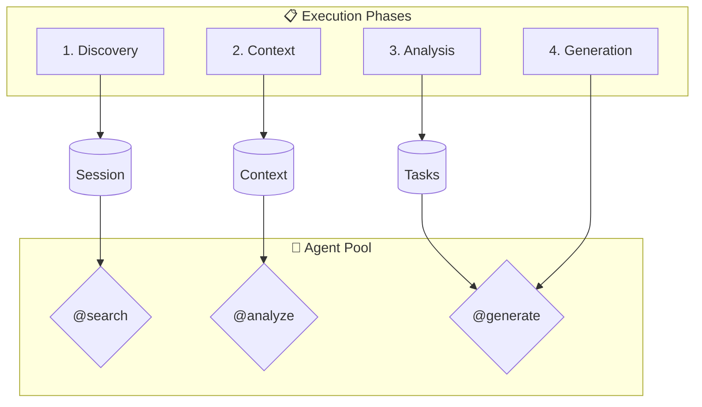

# Action: Generate Mermaid Diagram

Convert flow graph to Mermaid flowchart TD syntax.

## Input

```json
{
  "flow_graph": {
    "nodes": [...],
    "edges": [...],
    "subgraphs": [...]
  },
  "detail_level": "simple|standard|full"
}
```

## Task

1. **Generate Mermaid Header**
   - Diagram type: `flowchart TD`
   - Direction: Top-down

2. **Generate Node Definitions**
   - Apply appropriate shapes based on node type
   - Escape special characters in labels
   - Sanitize node IDs

3. **Generate Subgraphs**
   - Wrap related nodes in subgraph blocks
   - Apply styling classes

4. **Generate Edges**
   - Connect nodes with appropriate arrow styles
   - Add labels for conditional flows

5. **Apply Styling**
   - classDef for each node type
   - Optional: linkStyle for edge styling

## Node Shapes

```javascript
const shapes = {
  user: (id, label) => `${id}(["${label}"])`,        // Stadium
  ccw: (id, label) => `${id}["${label}"]`,           // Rectangle
  phase: (id, label) => `${id}[["${label}"]]`,       // Subroutine
  agent: (id, label) => `${id}{"${label}"}`,         // Diamond (decision-like)
  tool: (id, label) => `${id}[("${label}")]`,        // Cylinder
  decision: (id, label) => `${id}{"${label}"}`,      // Diamond
  terminal: (id, label) => `${id}(["${label}"])`     // Stadium
};
```

## Output Format

```json
{
  "status": "generating|completed|error",
  "mermaid_code": "string - Complete Mermaid diagram code",
  "metadata": {
    "node_count": 15,
    "edge_count": 20,
    "subgraph_count": 4,
    "estimated_complexity": "low|medium|high"
  }
}
```

## Mermaid Template

```mermaid
flowchart TD
    %% ==========================================
    %% Styling Classes
    %% ==========================================
    classDef user fill:#e1f5fe,stroke:#01579b,stroke-width:2px
    classDef ccw fill:#fff3e0,stroke:#e65100,stroke-width:2px
    classDef phase fill:#e3f2fd,stroke:#1565c0,stroke-width:2px
    classDef agent fill:#e8f5e9,stroke:#2e7d32,stroke-width:2px
    classDef tool fill:#f3e5f5,stroke:#6a1b9a,stroke-width:2px
    classDef decision fill:#fff8e1,stroke:#ff6f00,stroke-width:2px
    classDef terminal fill:#ffebee,stroke:#c62828,stroke-width:2px

    %% ==========================================
    %% Subgraph: User Layer
    %% ==========================================
    subgraph USER["👤 User Interaction"]
        direction LR
        START(["🚀 Trigger: {name}"])
        INPUT[{"📥 Parse Input"}]
    end

    %% ==========================================
    %% Subgraph: CCW Layer
    %% ==========================================
    subgraph CCW["⚙️ CCW Orchestration"]
        direction TB
        TODO["📝 Update TodoWrite"]

        subgraph PHASES["📋 Phases"]
            direction TB
            P1[["Phase 1: Name"]]
            P2[["Phase 2: Name"]]
        end
    end

    %% ==========================================
    %% Subgraph: Agent Layer
    %% ==========================================
    subgraph AGENTS["🤖 Agent Execution"]
        direction TB
        A1{"👤 @agent-name"}
        A2{"👤 @agent-name"}
    end

    %% ==========================================
    %% Subgraph: Tool Layer
    %% ==========================================
    subgraph TOOLS["🛠️ Tool Integration"]
        direction LR
        T1[("Tool 1")]
        T2[("Tool 2")]
    end

    %% ==========================================
    %% Terminal
    %% ==========================================
    END_SUCCESS(["✅ Complete"])
    END_ERROR(["❌ Error"])

    %% ==========================================
    %% Connections
    %% ==========================================
    START --> INPUT
    INPUT --> TODO
    TODO --> P1
    P1 --> P2
    P2 -->|"delegate"| A1
    A1 -->|"use"| T1
    A1 --> A2
    A2 -->|"use"| T2
    A2 --> END_SUCCESS
    P1 -.->|"fail"| END_ERROR

    %% ==========================================
    %% Apply Classes
    %% ==========================================
    class START,INPUT user
    class TODO,P1,P2 ccw
    class A1,A2 agent
    class T1,T2 tool
    class END_SUCCESS,END_ERROR terminal
```

## Generation Rules

### Node ID Sanitization

```javascript
function sanitizeId(text) {
  if (!text) return '_empty';
  return text
    .replace(/[^a-zA-Z0-9_\u4e00-\u9fa5]/g, '_')
    .replace(/^[0-9]/, '_$&')
    .replace(/_+/g, '_')
    .substring(0, 50);
}
```

### Label Escaping

```javascript
function escapeLabel(text) {
  if (!text) return '';
  return text
    .replace(/"/g, "'")
    .replace(/[(){}[\]<>|]/g, c => `&#${c.charCodeAt(0)};`)
    .substring(0, 80);
}
```

### Large Diagram Handling

If diagram exceeds 50 nodes or 30 edges:

1. **Add direction hints**
   - Use `direction TB` or `direction LR` in subgraphs

2. **Simplify labels**
   - Truncate long descriptions
   - Use abbreviations

3. **Consider splitting**
   - Generate overview diagram
   - Generate detail diagrams per phase

## Example Output



## Complex Workflow Layout

For workflows with many phases:


