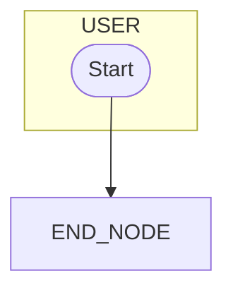

# Action: Validate Mermaid Syntax

Validate generated Mermaid diagram for syntax correctness.

## Input

```json
{
  "mermaid_code": "string - Mermaid diagram to validate"
}
```

## Task

1. **Parse Mermaid Structure**
   - Check diagram type declaration (flowchart TD)
   - Validate subgraph syntax
   - Check node definitions
   - Validate edge syntax

2. **Check Node IDs**
   - No reserved keywords (end, graph, subgraph)
   - No starting with numbers
   - No special characters

3. **Check Labels**
   - Properly quoted
   - No unescaped special chars
   - Length limits

4. **Validate Connections**
   - All edge targets exist
   - No dangling references
   - Valid arrow syntax

5. **Check Styling**
   - Valid classDef syntax
   - Class references exist

## Validation Rules

### 1. Diagram Declaration
```javascript
const hasDeclaration = mermaid.match(/^flowchart\s+TD/m);
```

### 2. Reserved Keywords
```javascript
const reserved = ['end', 'graph', 'subgraph', 'direction', 'class', 'click', 'style'];
// Node IDs cannot be these words
```

### 3. Node ID Pattern
```javascript
const validId = /^[a-zA-Z_][a-zA-Z0-9_]*$/;
```

### 4. Arrow Syntax
```javascript
const validArrow = /(-->|-.->|==>|--x|--o)/;
```

### 5. Subgraph Balance
```javascript
const subgraphCount = (mermaid.match(/subgraph\s/g) || []).length;
const endCount = (mermaid.match(/\bend\b/g) || []).length;
// Should be balanced
```

## Output Format

```json
{
  "status": "validating|valid|invalid|error",
  "validation": {
    "valid": true|false,
    "issues": [
      {
        "type": "error|warning",
        "line": 42,
        "message": "Description of issue",
        "suggestion": "How to fix"
      }
    ],
    "stats": {
      "nodes": 15,
      "edges": 20,
      "subgraphs": 4,
      "classes": 5
    }
  },
  "fixed_code": "string - Auto-fixed mermaid code (if applicable)"
}
```

## Common Issues & Fixes

### Issue: Reserved keyword as node ID
```
error: Node ID "end" is a reserved keyword
fix: Rename to "END_NODE" or "terminal"
```

### Issue: Unescaped special chars
```
error: Unescaped ( in label
fix: Replace ( with &#40; or use single quotes
```

### Issue: Node ID starts with number
```
error: Node ID "1st" starts with number
fix: Rename to "_1st" or "FIRST"
```

### Issue: Unbalanced subgraphs
```
error: 3 subgraph starts but 2 end statements
fix: Add missing 'end' statements
```

### Issue: Undefined node reference
```
error: Edge references undefined node "XYZ"
fix: Define node XYZ or remove edge
```

## Auto-Fix Rules

1. **Number prefix**: Add underscore prefix
2. **Reserved words**: Append `_NODE`
3. **Long labels**: Truncate with ellipsis
4. **Unescaped quotes**: Replace with single quotes
5. **Missing ends**: Add end statements

## Validation Example

**Input:**
```mermaid
flowchart TD
    subgraph USER
        1start(["Start"])
    end
    1start --> end
```

**Issues Found:**
```json
[
  {
    "type": "error",
    "line": 3,
    "message": "Node ID '1start' starts with number",
    "suggestion": "Change to '_1start' or 'START'"
  },
  {
    "type": "error",
    "line": 5,
    "message": "Node ID 'end' is reserved keyword",
    "suggestion": "Change to 'END' or 'END_NODE'"
  }
]
```

**Fixed Code:**


## Performance Considerations

For large diagrams (>100 nodes):
- Validation may take longer
- Consider splitting into multiple diagrams
- Use `ccw mcp` for editing large files
