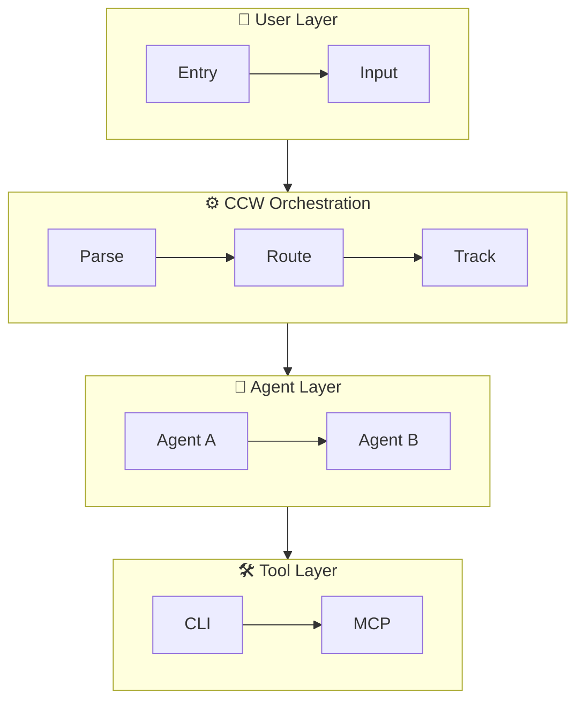

# Workflow Visualizer Orchestrator

State-driven orchestration for workflow visualization generation.

## State Schema

```typescript
interface VisualizerState {
  status: 'parsing' | 'analyzing' | 'generating' | 'validating' | 'completed' | 'error';
  input_path: string;
  output_path: string;
  detail_level: 'simple' | 'standard' | 'full';
  parsed_data?: {
    type: 'command' | 'skill';
    name: string;
    description: string;
    phases: Phase[];
    agents: string[];
    tools: string[];
  };
  flow_graph?: {
    nodes: Node[];
    edges: Edge[];
  };
  mermaid_code?: string;
  error?: string;
}

interface Phase {
  id: string;
  name: string;
  actions: Action[];
  agent?: string;
}

interface Action {
  id: string;
  description: string;
  tools: string[];
  next_actions: string[];
}

interface Node {
  id: string;
  type: 'user' | 'ccw' | 'agent' | 'tool' | 'decision' | 'terminal';
  label: string;
  subgraph?: string;
}

interface Edge {
  from: string;
  to: string;
  label?: string;
  style?: 'solid' | 'dashed' | 'thick';
}
```

## Decision Logic

```javascript
function selectNextAction(state) {
  // Terminal states
  if (state.status === 'completed') return null;
  if (state.status === 'error') return 'action-error-handler';

  // State-driven progression
  switch (state.status) {
    case 'parsing':
      return state.parsed_data ? 'action-analyze' : 'action-parse';
    case 'analyzing':
      return state.flow_graph ? 'action-generate' : 'action-analyze';
    case 'generating':
      return state.mermaid_code ? 'action-validate' : 'action-generate';
    case 'validating':
      return 'action-complete';
    default:
      return 'action-parse';
  }
}
```

## Execution Loop

```javascript
async function runOrchestrator() {
  const MAX_ITERATIONS = 20;
  let iteration = 0;

  while (iteration < MAX_ITERATIONS) {
    iteration++;

    // Read current state
    const state = JSON.parse(Read(`${workDir}/visualizer-state.json`));

    // Select and execute next action
    const actionId = selectNextAction(state);
    if (!actionId) break;

    console.log(`[${iteration}] Executing: ${actionId}`);

    try {
      const result = await Task({
        subagent_type: 'universal-executor',
        run_in_background: false,
        prompt: generateActionPrompt(actionId, state)
      });

      // Parse result and update state
      const updates = parseActionResult(result, actionId);
      updateState({ ...updates, current_action: null });

    } catch (error) {
      updateState({
        status: 'error',
        error: error.message,
        current_action: null
      });
    }
  }
}
```

## Action Catalog

| Action | Purpose | Input | Output |
|--------|---------|-------|--------|
| `action-parse` | Parse workflow source | File path | Parsed structure |
| `action-analyze` | Build flow graph | Parsed data | Node/edge graph |
| `action-generate` | Create Mermaid code | Flow graph | Mermaid diagram |
| `action-validate` | Check syntax | Mermaid code | Validation result |
| `action-complete` | Finalize output | Validated code | Output file |
| `action-error-handler` | Handle errors | Error state | Recovery or abort |

## Subgraph Organization

Generated diagrams use these subgraph layers:



## Styling Guide

```mermaid
flowchart TD
    classDef user fill:#e1f5fe,stroke:#01579b,stroke-width:2px
    classDef ccw fill:#fff3e0,stroke:#e65100,stroke-width:2px
    classDef agent fill:#e8f5e9,stroke:#2e7d32,stroke-width:2px
    classDef tool fill:#f3e5f5,stroke:#6a1b9a,stroke-width:2px
    classDef decision fill:#fff8e1,stroke:#ff6f00,stroke-width:2px,shape:diamond
```
