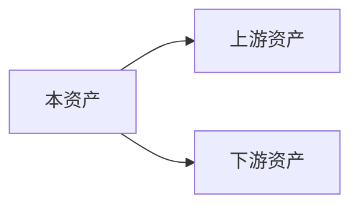

# 资产深度探索补充方案

> **问题**: 当前大纲按生命周期流组织，但缺乏每个 Skill/Command/Agent 的独立深度探索
> **解决方案**: 新增 Part XI "资产深度探索库" - 为每个核心资产提供独立章节

---

## 当前大纲结构 (架构导向)

```
Part I-X: 按生命周期流组织
├── Part I: 入口层
├── Part II: 调度层
├── Part III: 传输层
├── Part IV: 编排层
├── Part V: 执行层
├── Part VI: 集成层
├── Part VII: 存储层
├── Part VIII: 前端系统
├── Part IX: 测试与质量
├── Part X: 扩展与贡献
```

**优点**: 理解系统整体架构和协作关系
**缺点**: 每个具体资产的深度探索分散在各章节

---

## 补充方案: Part XI 资产深度探索库

### 设计理念

为每个核心资产提供**独立的深度探索章节**，包含：
1. **设计意图**: 为什么需要这个资产？
2. **实现细节**: 具体代码/配置如何工作？
3. **工作流图谱**: 与其他资产的协作关系
4. **扩展指南**: 如何基于此资产扩展？

### 章节组织

```
Part XI: 资产深度探索库
│
├── Section A: Commands 深度探索 (51 个)
│   ├── Ch A.1: 主协调器 Commands (5 个)
│   │   ├── A.1.1: /ccw - 主工作流入口
│   │   ├── A.1.2: /ccw-coordinator - 命令编排
│   │   ├── A.1.3: /ccw-plan - 规划模式
│   │   ├── A.1.4: /ccw-debug - 调试模式
│   │   └── A.1.5: /ccw-test - 测试模式
│   │
│   ├── Ch A.2: Issue Commands (9 个)
│   │   ├── A.2.1: /issue:new
│   │   ├── A.2.2: /issue:discover
│   │   ├── A.2.3: /issue:plan
│   │   ├── A.2.4: /issue:execute
│   │   └── ... (其他 5 个)
│   │
│   ├── Ch A.3: Workflow Commands (28 个)
│   │   ├── A.3.1: /workflow:init
│   │   ├── A.3.2: /workflow:session:start
│   │   ├── A.3.3: /workflow:brainstorm-with-file
│   │   └── ... (其他 25 个)
│   │
│   └── Ch A.4: 其他 Commands (9 个)
│
├── Section B: Skills 深度探索 (27 个)
│   ├── Ch B.1: 核心 Skills (8 个)
│   │   ├── B.1.1: workflow-plan
│   │   ├── B.1.2: workflow-execute
│   │   ├── B.1.3: brainstorm
│   │   ├── B.1.4: issue-resolve
│   │   └── ... (其他 4 个)
│   │
│   ├── Ch B.2: 团队 Skills (4 个)
│   │   ├── B.2.1: team-lifecycle
│   │   ├── B.2.2: team-issue
│   │   └── ... (其他 2 个)
│   │
│   └── Ch B.3: 工具 Skills (15 个)
│
├── Section C: Agents 深度探索 (21 个)
│   ├── Ch C.1: 执行类 Agents (8 个)
│   │   ├── C.1.1: cli-execution-agent
│   │   ├── C.1.2: code-developer
│   │   ├── C.1.3: universal-executor
│   │   └── ... (其他 5 个)
│   │
│   ├── Ch C.2: 规划类 Agents (6 个)
│   │   ├── C.2.1: action-planning-agent
│   │   ├── C.2.2: cli-planning-agent
│   │   └── ... (其他 4 个)
│   │
│   └── Ch C.3: 探索类 Agents (7 个)
│       ├── C.3.1: cli-explore-agent
│       ├── C.3.2: debug-explore-agent
│       └── ... (其他 5 个)
│
└── Section D: 其他资产深度探索
    ├── Ch D.1: Express 路由 (36 个)
    ├── Ch D.2: CLI 工具模块 (47 个)
    └── Ch D.3: Python 模块 (80+ 个)
```

---

## 单个资产深度探索模板

每个资产章节包含以下结构：

```markdown
# [资产名称] 深度探索

## 1. 设计意图
- 解决什么问题？
- 为什么这样设计？
- 设计权衡是什么？

## 2. 实现细节
### 2.1 文件结构
### 2.2 核心代码解析
### 2.3 配置项说明

## 3. 工作流图谱


## 4. 协作关系
- 与哪些资产协作？
- 数据如何流动？
- 状态如何同步？

## 5. 扩展指南
- 如何基于此资产扩展？
- 扩展点在哪里？
- 注意事项

## 6. 相关资产
- 上游: [列表]
- 下游: [列表]
- 同级: [列表]
```

---

## 统计

| 类别 | 数量 | 章节数 |
|------|------|--------|
| Commands | 51 | ~10 章 (分组) |
| Skills | 27 | ~8 章 (分组) |
| Agents | 21 | ~6 章 (分组) |
| 其他 | 100+ | ~5 章 (索引) |
| **总计** | **~200** | **~30 章** |

---

## 实施建议

### 阶段 1: 核心资产优先
先为以下核心资产生成深度探索：
- Commands: ccw, ccw-plan, workflow:session:start
- Skills: workflow-plan, brainstorm, issue-resolve
- Agents: cli-execution-agent, code-developer

### 阶段 2: 按需补充
根据用户需求，逐步补充其他资产的深度探索

### 阶段 3: 自动化生成
基于 SKILL.md / agent.md 的 frontmatter 自动生成基础章节

---

## 与现有大纲的关系

```
Part I-X: 架构导向 (生命周期流)
    ↓ 提供上下文
Part XI: 资产导向 (深度探索)
    ↓ 提供细节
Appendix: 参考资料
```

**双向链接**:
- Part I-X 章节中引用 Part XI 的相关资产章节
- Part XI 章节中引用 Part I-X 的架构上下文

---

*版本: 1.0.0*
*会话: ANL-ccw-architecture-audit-2025-02-17*
