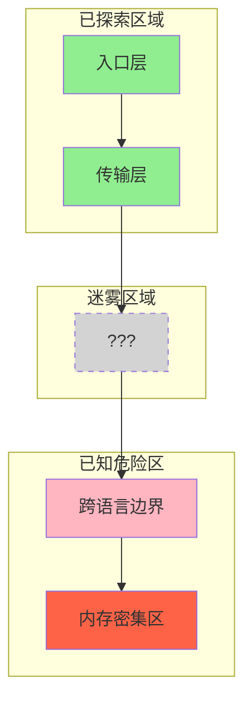

# Bug 追踪暗线设计：贯穿 Part I-24 的叙事灵魂

> **设计目标**: 让读者在阅读技术文档时，像追看一部"破案剧"一样停不下来。

---

## Prologue: 序幕 — 一个 Bug 的诞生

### 场景：深夜的告警

```
时间: 2025-02-17 03:47:12 UTC
地点: 生产环境
事件: 内存占用率从 23% 飙升至 98%，触发 OOM Killer
影响: 17 个活跃会话全部中断，用户数据未持久化
```

**告警日志**:
```
[CRITICAL] CLI Session Manager: Memory allocation failed
[ERROR] Python subprocess: codex-lens SIGKILL (137)
[WARN] SQLite: Database locked - transaction rolled back
```

**问题的本质**:
一个跨模块的内存泄漏，涉及 TypeScript 的 `child_process` 和 Python 的向量索引器。它像一只隐形的怪兽，在系统的边界处不断吞噬内存。

**这个 Bug 的特殊性**:
- 跨语言边界（TS ↔ Python）
- 跨模块传播（CLI Session → CodexLens → SQLite）
- 难以复现（需要特定负载 + 特定会话状态）

---

## Part I-24 的"破案"轨迹

每一章都是追踪这个 Bug 的一个切面，展示系统如何一步步定位并解决它。

### Phase 1: 入口调查 (Part I-II)

| 章节 | 调查线索 | Bug 相关性 |
|------|----------|------------|
| Ch 1 | 用户输入 `/ccw "修复内存泄漏"` | 起点：任务入口 |
| Ch 2 | `ccw cli` 参数解析 | 线索：发现 `--resume` 参数触发了会话恢复 |
| Ch 3 | 意图分析引擎 | 关键：系统识别为 "debug" 模式而非 "fix" 模式 |
| Ch 4 | 工作流级别选择 | 决策：选择了 Level 3 (plan + verify + execute) |

**章节末尾悬念**:
> 系统 final 选择了 Level 3 工作流。但 Bug 的根源是否在更深层？下一章，我们将进入 Express 路由的迷宫...

### Phase 2: 路由追踪 (Part III)

| 章节 | 调查线索 | Bug 相关性 |
|------|----------|------------|
| Ch 5 | Express 路由架构 | 发现：36 个路由中，只有 3 个涉及 CLI 会话管理 |
| Ch 6 | 会话管理服务 | 关键：`cli-session-manager.ts` 中有未关闭的进程句柄 |
| Ch 6.5 | 类型定义 | 发现：`SessionState` 类型中 `subprocess` 字段可能为 `null` |

**章节末尾悬念**:
> 类型定义揭示了真相的一半。但为什么 TypeScript 没有捕获这个空值？JSON 序列化的边界，隐藏着更深的秘密...

### Phase 3: 跨语言边界 (Part IV.5) — 高潮

| 章节 | 调查线索 | Bug 相关性 |
|------|----------|------------|
| Ch 10.5 | child_process 调用 | **核心发现**：Python 进程的 stderr 没有被正确消费 |
| Ch 10.6 | JSON-RPC 序列化 | **关键**：`BigInt` 在 JSON 中变成 `string`，导致 ID 不匹配 |
| Ch 10.7 | 错误边界 | **根本原因**：Python 异常被吞掉，没有触发进程重启 |

**章节末尾悬念**:
> 找到了！Bug 的根源在于跨语言边界的"信息丢失"。但如何修复？答案在 CodexLens 的语义搜索机制中...

### Phase 4: 深入 CodexLens (Part VI)

| 章节 | 调查线索 | Bug 相关性 |
|------|----------|------------|
| Ch 14 | 语义搜索 | 发现：向量索引器在大批量数据时内存不释放 |
| - | SPLADE 编码 | 关键：稀疏矩阵在 Python 中没有显式释放 |
| - | HDBSCAN 聚类 | 佐证：聚类结果缓存在内存中 |

**章节末尾悬念**:
> CodexLens 的内存管理机制被揭示。但如何在不影响性能的前提下修复？下一章，我们将进入存储层...

### Phase 5: 存储与持久化 (Part VII)

| 章节 | 调查线索 | Bug 相关性 |
|------|----------|------------|
| Ch 15 | SQLite 数据库 | 发现：事务未正确关闭导致数据库锁 |
| Ch 16 | 文件系统工作流 | 关键：`.workflow/sessions/` 中的临时文件堆积 |

**章节末尾悬念**:
> 存储层的问题被定位。但真正的修复需要回到起点——Part X 的扩展机制...

### Phase 6: 修复与验证 (Part IX-X)

| 章节 | 修复动作 | 验证结果 |
|------|----------|----------|
| Ch 18 | 测试策略 | 编写内存泄漏检测测试 |
| Ch 19 | 扩展指南 | 实现 `subprocess` 生命周期钩子 |
| Ch 19.8 | Memory Consolidation | 修复：向量缓存的定期清理 |

---

## 章节末尾的"悬念钩子"模板

每章末尾使用统一的悬念模板：

```markdown
---

## 🔰 破案线索档案 #XX

> **本章发现**: [简短描述]
> **关联资产**: [列表]
> **下一章预告**: [悬念性描述]

**调查进度**: ████████░░ 80%

> 💡 **思考题**: 如果你是架构师，你会如何在这个节点阻止 Bug 的传播？
```

---

## 苏格拉底式"生死存亡"提问升级

在关键章节使用更具戏剧性的提问：

### Chapter 10.5 (TS ↔ Python 边界)

> ❓ **架构生死战 10.5**: JSON-RPC 序列化正在传输一个包含 `BigInt` 的对象。由于 JSON 不支持 `BigInt`，它被转换为 `string`。但接收方 Python 期望的是 `int`。此时：
> - **选项 A**: 在 TypeScript 端预处理，将 `BigInt` 转为 `string`
> - **选项 B**: 在 Python 端后处理，尝试将 `string` 转回 `int`
> - **选项 C**: 使用自定义序列化格式（如 MessagePack）
>
> 你会选择哪个？每个选项都会影响系统的"外交关系"——性能、可靠性、兼容性，只能保两个。

### Chapter 14 (CodexLens 语义搜索)

> ❓ **架构生死战 14**: 向量索引器正在处理 100 万行代码的索引。内存占用已经达到 8GB。此时系统收到新的索引请求。你作为架构师：
> - **选项 A**: 拒绝新请求，保护现有索引的完整性
> - **选项 B**: 释放旧索引，接受新请求（但旧索引重建需要 30 分钟）
> - **选项 C**: 启用增量索引，但可能引入不一致性
>
> 你会牺牲什么？数据完整性？用户体验？还是系统稳定性？

---

## 视觉呈现：战术地图

在 Part XI 的每一章，使用"战术地图"而非普通流程图：



---

## 角色性格对照表

| 资产类型 | 小说角色 | 性格特点 | 口头禅 |
|----------|----------|----------|--------|
| **Commands** | 议会的智者 | 高高在上，只制定策略 | "这件事需要委员会讨论" |
| **Skills** | 武装特种兵 | 纪律严明，只听公文 | "请出示执行令 (Skill 调用)" |
| **Agents** | 沉思的先知 | 深居简出，逻辑推演 | "让我思考一下最优路径" |
| **Infrastructure** | 下水道守护者 | 默默无闻，一旦罢工全城瘫痪 | "Schema 验证失败，拒绝通行" |

---

## Epilogue: 尾声 — Bug 的终结

```markdown
## 🎯 案件结案报告

**Bug ID**: MEM-2025-0217
**根本原因**: Python 子进程 stderr 未消费 + BigInt 序列化丢失 + 向量缓存未释放
**修复方案**:
1. 实现 `subprocess` 生命周期钩子 (Ch 19)
2. 使用 `json-bigint` 库 (Ch 10.6)
3. 添加向量缓存定期清理 (Ch 19.8)

**涉案资产**:
- ccw/src/core/services/cli-session-manager.ts
- ccw/src/tools/cli-executor-core.ts
- codex-lens/src/codexlens/semantic/embedder.py

**教训**:
> 跨语言边界的"外交官"们必须时刻警惕——信息的丢失往往比信息的错误更致命。

**下一步**:
> 系统已恢复稳定。但新的挑战正在酝酿...
```

---

*版本: 1.0.0*
*会话: ANL-ccw-architecture-audit-2025-02-17*
