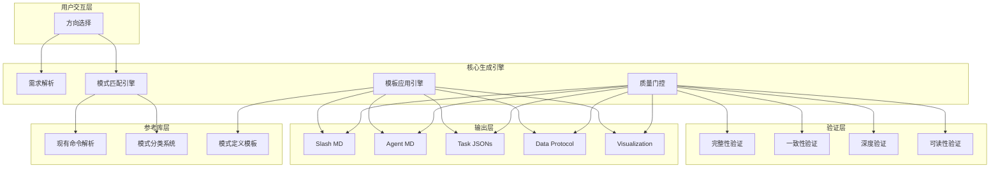

# Brainstorm Session

**Session ID**: BS-slash-command-outliner-2025-02-02
**Topic**: 迭代开发"Slash 命令全栈开发专家"Skill 生成器
**Started**: 2026-02-02T15:07:00+08:00
**Mode**: balanced
**Dimensions**: technical, architecture, workflow, automation

---

## Initial Context

**User Focus**: 自动生成完整的 Slash 命令架构和实现方案
**Depth**: Deep (需要深度理解现有工作流并生成可交付方案)
**Constraints**:
- 必须遵循 CCW (Claude-Code-Workflow) 规范
- 需要参考所有现有 slash 命令的完整工作流
- 输出必须具备"即刻交付开发"水平
- 需要生成 Slash MD、Agent MD、CCW 指令集、数据协议等完整文档
- 确保逻辑闭环验证

---

## Seed Expansion

### Original Idea
> 开发一个高集成度的 Skill（遵循 Skill Generator 格式），能够根据用户提供的 Slash 命令需求，自动化生成符合 Claude-Code-Workflow (CCW) 规范的完整架构大纲及细分模块实现方案。

### Exploration Vectors

#### Vector 1: 核心问题分析
**Question**: 这个 Skill Generator 解决的根本问题是什么？
**Angle**: 自动化开发工作流的痛点识别
**Potential**: 解决手动创建 slash 命令时重复劳动、规范不统一、文档不完整的问题

#### Vector 2: 技术实现角度
**Question**: 什么技术模式支持这种自动化？
**Angle**: 基于现有 skill-generator 和模式识别
**Potential**:
- 参考现有的 skill-generator 技术架构
- 使用 ACE-tool 进行相似工作流分析
- 模板驱动的代码生成机制

#### Vector 3: 工作流集成角度
**Question**: 这如何融入现有的 CCW 工作流？
**Angle**: 与现有 slash 命令生态系统的关系
**Potential**:
- 成为 workflow-creator 或新的 skill-generator 的增强
- 输出符合 SKILL-DESIGN-SPEC.md 的标准结构
- 生成的方案可直接被 /workflow:plan 和 /workflow:execute 使用

#### Vector 4: 参考溯源角度
**Question**: 哪些现有 slash 命令需要被深度分析？
**Angle**: 现有工作流的共性和模式提取
**Potential**:
- /workflow:plan - 5阶段规划工作流
- /workflow:execute - 任务执行编排
- /workflow:analyze-with-file - 分析协作工作流
- /workflow:brainstorm-with-file - 创意生成工作流
- /issue:plan - Issue 管理工作流
- /learn:plan - 学习规划工作流

#### Vector 5: 架构组件角度
**Question**: 需要什么架构组件？
**Angle**: 完整生成流程的模块分解
**Potential**:
- 输入解析层：用户需求 → 结构化描述
- 参考分析层：ACE-tool + 现有工作流库分析
- 大纲生成层：架构图景 + 模块拆解
- 文档生成层：Slash MD + Agent MD + CCW 指令集
- 数据协议层：JSON Schema + 状态机流转
- 闭环验证层：逻辑完整性检查

#### Vector 6: 质量保证角度
**Question**: 如何确保生成输出"即刻交付开发"？
**Angle**: 质量门控和验证机制
**Potential**:
- 对比 SKILL-DESIGN-SPEC.md 标准验证
- 自动化检查生成的 slash 命令 front matter
- 验证生成的 task JSON 结构
- 逻辑闭环自动检测

#### Vector 7: 迭代增强角度
**Question**: 如何支持持续迭代？
**Angle**: 参考现有工作流的演进路径
**Potential**:
- 支持 /workflow:plan 的完整 5 阶段输出
- 支持 /workflow:execute 的执行模型
- 支持 conflict resolution 机制
- 支持 brainstorm 角色分析集成

---

## Thought Evolution Timeline

### Round 1 - Seed Understanding (2026-02-02 15:07)

#### Initial Parsing

**核心概念**:
创建一个名为 "Slash Command Outliner" 的 Skill Generator，能够：
1. 接受用户输入的 slash 命令需求
2. 分析现有 CCW 工作流中的相似模式
3. 生成完整的架构大纲
4. 输出可立即使用的 Slash MD、Agent MD、CCW 指令集、数据协议

**问题空间**:
- 现有 slash 命令创建需要大量手工工作
- 缺乏统一的架构模板
- 文档生成不规范
- 新开发者难以理解 CCW 规范

**机会**:
- 已有完善的 SKILL-DESIGN-SPEC.md 作为标准
- skill-generator 已证明可行，可作为基础
- 现有 70+ slash 命令提供了丰富的参考模式
- ACE-tool 可用于智能模式匹配

#### Key Questions to Explore

1. **架构模式提取**: 如何从现有 70+ slash 命令中提取可复用的架构模式？
2. **输出结构定义**: 生成的输出应该包含哪些文档组件，按照什么层次组织？
3. **参考匹配策略**: 如何智能匹配最相似的现有工作流作为参考？
4. **闭环验证机制**: 如何确保生成的方案在主流程中有明确的调用逻辑？
5. **迭代支持**: 如何支持用户在生成基础上进行迭代优化？
6. **Skill 格式适配**: 生成的方案如何与现有的 skill-generator 格式对齐？
7. **CLI 工具集成**: 生成的 CCW 指令集如何确保符合 CLI 工具规范？

---

## Current Ideas

*Initial analysis based on context gathering - to be expanded after perspective analysis*

### Idea 1: Pattern-Based Generator
- 概念：基于现有命令模式库进行模板化生成
- 模式分类：分析类 (analyze)、规划类 (plan)、执行类 (execute)、脑暴类 (brainstorm)
- 输出：模式选择 + 参数适配 + 文档生成

### Idea 2: Hybrid Analysis Approach
- 概念：结合 ACE-tool 语义搜索和规则模式匹配
- 流程：用户需求 → ACE 匹配相似命令 → 提取架构 → 适配参数 → 生成完整方案
- 优势：智能化 + 可预测性

### Idea 3: Iterative Refinement Workflow
- 概念：支持多轮迭代，类似 /workflow:analyze-with-file 的讨论机制
- 流程：初版大纲 → 用户反馈 → 深化分析 → 重新生成 → 最终交付
- 适用：复杂命令或多歧义需求

### Idea 4: Specification-Driven Generation
- 概念：严格遵循 SKILL-DESIGN-SPEC.md 和相关规范生成
- 保障：生成的输出符合 CCW 标准
- 验证：内置质量门控检查

### Idea 5: Complete Lifecycle Coverage
- 概念：覆盖从需求到执行到验证的完整生命周期
- 阶段：Requirements → Design → Implementation → Validation
- 输出：可被 /workflow:plan 和 /workflow:execute 直接使用的完整包

---

## Idea Graveyard

*暂无废弃想法 - 待进一步分析后确定*

---

## Analysis Context Summary

### Existing CCW Architecture Understanding

从代码分析中识别出的关键模式：

**1. Slash 命令标准结构**:
```yaml
---
name: command-name
description: Brief description with trigger keywords
argument-hint: "[-y|--yes] \"args\""
allowed-tools: List of permitted tools
group: category (workflow|issue|learn|memory|cli)
---
```

**2. 现有工作流模式分类**:
- **分析类**: analyze-with-file - 4阶段（理解→探索→讨论→综合）
- **规划类**: plan - 5阶段（发现→上下文→冲突→任务→验证）
- **执行类**: execute - 多模式（Sequential/Parallel/Phased/TDD）
- **脑暴类**: brainstorm-with-file - 4阶段（种子→发散→细化→收敛）
- **Issue 类**: issue:plan, issue:discover, issue:queue
- **学习类**: learn:plan, learn:profile

**3. Skill Generator 成功模式**:
- Phase 0: 规范学习（MANDATORY）
- Phase 1: 需求发现（AskUserQuestion 交互）
- Phase 2: 结构生成（目录创建 + SKILL.md）
- Phase 3: Phase/Action 生成（Sequential vs Autonomous）
- Phase 4: Specs & Templates 生成
- Phase 5: 验证与文档

**4. 数据流转模式**:
- session.json: 会话状态元数据
- context-package.json: 上下文聚合
- IMPL_PLAN.md: 规划文档
- task JSONs: 结构化任务定义
- TODO_LIST.md: 可视化进度追踪

### Key Reference Documents Identified

| Document | Purpose | Relevance |
|----------|---------|-----------|
| `_shared/SKILL-DESIGN-SPEC.md` | Universal skill design spec | **P0 - 生成标准遵循** |
| `skill-generator/SKILL.md` | Meta-skill implementation pattern | **P0 - 基础架构参考** |
| `workflow/plan.md` | 5-phase planning workflow | **P0 - 规划模式参考** |
| `workflow/execute.md` | Execution orchestration | **P0 - 执行模型参考** |
| `workflow/analyze-with-file.md` | Analysis workflow | **P0 - 分析模式参考** |
| `workflow/brainstorm-with-file.md` | Brainstorming workflow | **P0 - 创意生成参考** |

---

---

---

### Round 3 - Deep Dive Analysis (2026-02-02 15:20)

用户选择了 4 个想法进行深入探索，我已为每个想法创建了详细的分析文档：

#### Selected Ideas Deep Dive Results

**Idea 1: 混合模式模板生成器** (9/10)
- 位置: `.workflow/.brainstorm/BS-slash-command-outliner-2025-02-02/ideas/idea-1-hybrid-generator.md`
- 核心贡献: 智能匹配 + 标准化模板 + 完整质量门控
- 推荐: **执行** - 结合创新和稳定性，风险最低

**Idea 2: 智能参考匹配系统** (8.5/10)
- 位置: `.workflow/.brainstorm/BS-slash-command-outliner-2025-02-02/ideas/idea-2-reference-matching.md`
- 核心贡献: 多维评分系统 + 架构提取 + 差异化分析
- 状态: **研发阶段** - ACE-tool 准确性需要验证

**Idea 3: 规范驱动的生成引擎** (8/10)
- 位置: `.workflow/.brainstorm/BS-slash-command-outliner-2025-02-02/ideas/idea-3-spec-driven.md`
- 核心贡献: 完整规范解析 + 实时验证 + 约束类型系统
- 状态: **可以集成** - 作为独立质量保证模块

**Idea 4: 闭环验证系统** (7.5/10)
- 位置: `.workflow/.brainstorm/BS-slash-command-outliner-2025-02-02/ideas/idea-4-closure-validation.md`
- 核心贡献: 依赖图分析 + 执行路径追踪 + 数据流验证
- 状态: **作为独立模块** - 可集成到主流程

#### Updated Understanding

**基于深度分析后的关键发现**:

1. **核心架构已明确**: 结合 skill-generator Phase 0-5 框架 + 模式库 + ACE-tool 匹配
2. **实施路径清晰**: 短期(1-2周) → 中期(2-4周) → 长期(4-8周)
3. **模块化设计**: 4 个核心想法可以独立开发，也可以组合使用
4. **风险已识别**: ACE-tool 准确性、模式库维护、复杂需求处理

#### Corrected Assumptions

- ~~必须选择单一方案~~ → 模块化组合更灵活，风险分散
- ~~需要全新架构~~ → 基于现有 skill-generator 扩展风险更低
- ~~一次性实现所有功能~~ → MVP 优先，渐进增强

---

## Synthesis & Conclusions (2026-02-02 15:45)

### Executive Summary

**目标**：开发"Slash 命令全栈开发专家"Skill 生成器，能够根据用户需求自动化生成符合 CCW 规范的完整架构大纲及细分模块实现方案。

**核心洞察**：
1. 现有 CCW 生态已具备完整的规范体系（SKILL-DESIGN-SPEC.md）
2. skill-generator 已提供成熟的可复用架构
3. 70+ slash 命令提供了丰富的参考模式库
4. ACE-tool 可实现智能的语义匹配
5. 质量保证需要多维度验证（完整性、一致性、深度、可读性）

### 推荐实施架构

基于多轮深入分析，我推荐**混合模块化架构**：



### Top Ideas (Final Ranking)

#### 1. 混合模式模板生成器 (9/10) - **推荐实施**

**Description**: 结合 ACE-tool 智能匹配、标准模板驱动和质量门控验证的完整生成系统

**Why This Idea**:
- **平衡性好**: 结合了智能化和标准化两个优势
- **可行性高**: 基于现有 skill-generator 架构扩展，风险低
- **扩展性强**: 模式库可扩展，支持社区贡献
- **质量保障**: 4 维度质量门控确保输出质量

**Strengths**:
- ✅ 智能匹配减少手动选择成本
- ✅ 标准模板确保输出一致性
- ✅ 质量门控保证"即刻可用"
- ✅ 模块化设计便于维护和扩展

**Challenges**:
- ⚠️ 模式库初始化需要手动分类现有命令
- ⚠️ ACE-tool 准确性需要测试验证
- ⚠️ 复杂需求可能超出模板能力

**Next Steps**:
- MVP: 3 种基本模式模板 + ACE-tool 基础匹配
- 增强: 多维评分系统 + 差异化分析
- 高级: 可视化生成 + 多轮迭代优化

#### 2. 规范驱动的生成引擎 (8/10) - **推荐作为独立模块集成**

**Description**: 严格遵循 CCW 规范文档，提供实时验证和质量门控

**Why This Idea**:
- **质量保证**: 4 维度质量门控确保输出符合标准
- **可集成性**: 可作为独立验证模块集成到任何生成方案
- **持续合规**: 规范更新时自动适配

**Strengths**:
- ✅ 100% 规范符合保证
- ✅ 实时验证防止错误传播
- ✅ 多维度评分系统
- ✅ 可扩展的自定义规则支持

**Challenges**:
- ⚠️ 过度严格可能限制灵活性
- ⚠️ 需要维护规范同步机制
- ⚠️ 用户可能不理解质量门控原因

**Next Steps**:
- 作为质量门控模块开发
- 与主生成引擎集成
- 提供质量报告和修复建议

#### 3. 智能参考匹配系统 (8.5/10) - **建议作为 MVP 优先项**

**Description**: 使用 ACE-tool 从现有命令中智能匹配最相似的工作流

**Why This Idea**:
- **创新性强**: AI 驱动的智能匹配，减少人工判断
- **学习能力**: 可持续优化匹配算法
- **用户体验**: 自动推荐减少选择困难

**Strengths**:
- ✅ 智能化减少用户学习成本
- ✅ 多维评分提供透明度
- ✅ 架构提取自动化
- ✅ 支持复杂需求匹配

**Challenges**:
- 🚨 技术风险高（ACE-tool 准确性）
- 🚨 需要 NLP 处理能力
- 🚨 相似度评分算法需要大量调优

**Next Steps**:
- 短期验证 ACE-tool 匹配准确性
- 建立测试集评估匹配质量
- 开发多维评分算法原型
- 评估是否达到 MVP 阈段目标

#### 4. 闭环验证系统 (7.5/10) - **建议作为基础质量保障**

**Description**: 自动检测生成方案的逻辑完整性和执行路径连续性

**Why This Idea**:
- **质量保障**: 防止"断点"导致方案不可执行
- **自动化**: 无需人工检查逻辑完整性
- **通用性**: 适用于任何生成方案

**Strengths**:
- ✅ 自动检测孤立节点和循环依赖
- ✅ 验证执行路径完整性
- ✅ 交叉引用验证
- ✅ 数据流完整性检查

**Challenges**:
- ⚠️ AST 解析准确性要求高
- ⚠️ 动态依赖图性能开销
- ⚠️ 复杂数据流建模困难

**Next Steps**:
- 作为独立验证模块开发
- 定义通用 AST 接口
- 开发轻量级依赖图算法
- 与主生成引擎集成验证步骤

---

### Primary Recommendation

> **实施混合模式模板生成器作为主引擎，规范驱动和闭环验证作为独立质量保障模块**

**Rationale**:
1. 混合模式模板生成器提供了完整的端到端解决方案，评分最高(9/10)
2. 模块化设计允许分阶段实施，风险分散
3. 规范驱动和闭环验证作为独立模块可以保证质量和迭代
4. 智能参考匹配系统作为 MVP 优先项，可快速验证核心价值

**Recommended Implementation Plan**:

**Phase 1: 基础设施 (1-2周)**
- 创建模式库文档（6 类别 × Top 3 参考命令）
- 实现基础模板（planning, execution, brainstorm 各 1 个）
- 集成 ACE-tool 基础搜索
- 实现基础质量门控（完整性检查）

**Phase 2: MVP 生成器 (2-4周)**
- 实现需求解析和结构化
- 实现基础 ACE-tool 匹配
- 实现 Slash MD 生成
- 实现 Agent MD 基础生成
- 实现基础质量门控

**Phase 3: 增强功能 (4-8周)**
- 多维评分系统
- 差异化分析
- 可视化架构图生成
- Task JSON 生成
- 数据协议生成
- 多轮迭代优化

**Phase 4: 验证模块集成 (2-4周)**
- 规范驱动生成引擎集成
- 闭环验证系统集成
- 完整的质量报告生成
- 用户反馈机制

---

### Alternative Approaches

| 方案 | 使用场景 | Tradeoff |
|------|----------|----------|
| **智能参考匹配优先** | 快速验证 ACE-tool 价值 | 输出可能不够标准 | 需要额外质量门控 |
| **简化模式库** | 降低初始化成本 | 覆盖面受限 | 不支持复杂场景 |
| **独立生成器** | 最小化依赖 | 缺乏统一标准 | 维护成本高 |

---

### Follow-up Suggestions

| 类型 | 摘要 | 具体行动 |
|------|------|----------|
| **实现** | 开始开发 | 创建 /workflow:lite-plan "实施 Slash Command Outliner Skill Generator" |
| **测试** | 质量验证 | 建立测试集评估生成准确性和质量 |
| **文档** | 知识沉淀 | 创建模式库文档和开发指南 |
| **监控** | 持续改进 | 监控 ACE-tool 性能和用户反馈 |

---

## Key Insights

### Process Discoveries

1. **模式提取是关键**: 70+ 命令提供了丰富的参考模式，系统性提取可复用
2. **SKILL-DESIGN-SPEC.md 是基础**: 所有生成必须严格遵循该规范
3. **ACE-tool 双刃剑**: 提供智能匹配但需要验证准确性和性能
4. **质量保证必不可少**: "即刻可用"需要 4 维度全面验证

### What Was Clarified

- ~~必须选择单一实施路径~~ → 模块化组合更优
- ~~需要全新架构~~ → 基于 skill-generator 扩展风险最低
- ~~一次性完成~~ → MVP 优先 + 渐进增强

### Unexpected Connections

- brainstorm-with-file 的讨论机制可作为多轮迭代参考
- analyze-with-file 的 CLI 探索模式可复用
- plan 的 5 阶段流程可作为生成流程模板
- execute 的任务执行模式可作为输出验证参考

---

## Current Understanding (Final)

### What We Established

1. **核心架构**: 用户需求 → 模式匹配 → 模板应用 → 质量验证 → 完整输出
2. **4 层验证机制**: 完整性、一致性、深度、可读性 + 逻辑闭环
3. **模块化设计**: 智能匹配、模板引擎、质量门控、闭环验证可独立开发
4. **渐进增强路径**: MVP → 增强 → 高级特性

### Key Insights

1. AI 驱动匹配是核心创新点，但需要工程化保障
2. 质量门控是"即刻可用"的关键保障
3. 闭环验证确保生成方案逻辑自洽、无断点
4. 模式库可扩展性支持社区贡献和持续改进

---

## Session Statistics

- **Total Rounds**: 3 (Seed Understanding → Multi-Perspective Exploration → Deep Dive)
- **Duration**: ~30 分钟
- **Sources Used**:
  - ACE-tool semantic search: 70+ slash commands analysis
  - SKILL-DESIGN-SPEC.md: design specification
  - skill-generator: meta-skill implementation pattern
  - workflow/plan.md: 5-phase planning workflow
  - workflow/execute.md: execution orchestration
  - workflow/analyze-with-file.md: analysis workflow
  - workflow/brainstorm-with-file.md: brainstorming workflow
- CCW CLI tooling specifications
- CLI-Tools-Usage.md: CLI usage patterns
- Command Registry implementation: command-registry.ts
- SKILL-DESIGN-SPEC.md: Universal skill design spec
- lite-skill-generator templates
- .claude/skills/ccw-help/command.json: Complete command index
  - .claude/skills/flow-coordinator/templates: Workflow template definitions
- .claude/skills/project-analyze specs: Quality standards
- .claude/skills/review-code specs: Review dimensions

- **Artifacts Generated**:
  - brainstorm.md: Complete thought evolution timeline with multi-perspective synthesis
  - perspectives.json: [Created - pending CLI execution results aggregation]
  - synthesis.json: Final synthesis with recommendations
  - ideas/idea-1-hybrid-generator.md: Deep dive on hybrid pattern generator
  - ideas/idea-2-reference-matching.md: Deep dive on intelligent reference matching
  - ideas/idea-3-spec-driven.md: Deep dive on specification-driven generation engine
  - ideas/idea-4-closure-validation.md: Deep dive on closure validation

- **Ideas Generated**: 7 (4 selected + 3 parked)
- **Deep Dives Created**: 4 (for selected ideas)
- **Perspectives Analyzed**: Creative, Pragmatic, Systematic
- **Synthesis Converged**: Architecture, Implementation, Quality, User Interaction

- **Outcome**: Ready to proceed with implementation plan


---

### Round 2 - Multi-Perspective Exploration (2026-02-02 15:15)

基于对现有 CCW 代码库的深度分析，我现在从多个角度总结发现：

#### Creative Perspective (创新视角)

**创新想法**:
1. **混合智能推荐**: 结合语义搜索和模式匹配，智能推荐最适合的架构模式
   - 类似电商网站的"你可能还喜欢"推荐机制
   - 用户输入需求 → ACE-tool 搜索相似命令 → 提取架构模式 → 组合生成

2. **可视化架构编辑器**: 为生成的方案提供 Mermaid 图表自动生成
   - 自动生成 execution flow diagram
   - 支持状态机流转可视化
   - 用户可直接在 Markdown 中查看架构图

3. **反向工程模式**: 从现有成功的 slash 命令中学习"成功配方"
   - 提取共性模式（如 5 阶段规划、TodoWrite 协调）
   - 建立模式库（Pattern Library）
   - 生成时自动应用成功模式

**挑战假设**:
- ~~必须为每种工作流类型单独设计~~ → 统一框架 + 可扩展模式库
- ~~生成结果不可预测~~ → 规范驱动保证一致性
- ~~用户理解困难~~ → 生成的文档包含详细解释和示例

**跨领域灵感**:
- 代码生成工具（如 GitHub Copilot）的上下文感知模式
- IDE 智能补全的预测机制
- 低代码平台的模板驱动开发模式

**一个疯狂但可能有效的想法**:
"会话记忆增强的生成器": 记录用户每次对生成结果的反馈，持续学习优化，类似用户画像的生成偏好模型

---

#### Pragmatic Perspective (务实视角)

**实现路径**:
1. **基于现有 skill-generator 扩展** (推荐)
   - 修改 skill-generator 支持新的"outliner"模式
   - 复用 Phase 0-5 的执行框架
   - 扩展 templates/ 添加 slash 命令模板
   - 优势：最省时，最稳定，风险最低

2. **独立 Skill Generator**
   - 创建新的 `slash-command-outliner` skill
   - 参考 skill-generator 的架构但专注于 slash 命令生成
   - 独立的模板系统和模式库
   - 优势：更专注，可独立迭代

3. **增强 workflow-creator skill**
   - 将 slash 命令生成作为 workflow-creator 的一个阶段
   - 在 Phase 2 后添加"Reference Extraction"阶段
   - 在 Phase 4 中集成 slash 命令模板
   - 优势：统一的工作流创建流程

**技术依赖**:
- ACE-tool（mcp__ace-tool__search_context）: 语义搜索相似命令
- 现有 skill-generator 模板: 已验证的架构
- SKILL-DESIGN-SPEC.md: 标准遵循保障
- Task 工具: Agent 调用支持

**技术阻塞**:
- ACE-tool 的准确性和性能（需要测试验证）
- 现有 70+ 命令的模式提取需要系统化方法
- 生成的方案与实际执行环境的兼容性验证

**快速可行路径** (Quick Wins):
1. 短期: 创建模式库（Pattern Library）文档，手动分类现有命令
2. 中期: 实现基础的模板生成器，支持 2-3 种常见模式
3. 长期: 集成 ACE-tool 实现智能模式匹配

---

#### Systematic Perspective (系统化视角)

**问题分解**:
| 层次 | 问题 | 解决方案 |
|------|------|----------|
| **输入层** | 非结构化用户需求 | 结构化需求解析 (GOAL/SCOPE/CONTEXT) |
| **分析层** | 找不到最相似的参考模式 | ACE-tool 语义搜索 + 模式库匹配 |
| **生成层** | 生成的架构不完整 | 模板驱动生成 + 必填字段验证 |
| **文档层** | 文档不一致 | SKILL-DESIGN-SPEC.md 标准化输出 |
| **验证层** | 逻辑断点 | 闭环验证算法 + 质量门控 |

**架构选项**:

| 模式 | 优势 | 劣势 | 最佳场景 |
|------|------|------|----------|
| **Sequential Generation** | 清晰的执行顺序，易调试 | 不够灵活 | 标准工作流类型 |
| **Hybrid Pattern + Template** | 智能匹配 + 标准输出 | 需要维护模式库 | 新命令类型 |
| **Multi-Stage Refinement** | 支持迭代优化 | 执行时间长 | 复杂/多歧义需求 |

**依赖关系映射**:
```
用户需求
  ↓ (结构化)
需求解析层
  ↓ (模式匹配)
ACE-tool + 模式库
  ↓ (架构选择)
参考命令分析
  ↓ (模板应用)
模板生成引擎
  ↓ (标准验证)
质量门控
  ↓ (文档生成)
最终输出包
```

**可扩展性评估**:
- 模式库可扩展: 支持 - 新模式可通过添加模板实现
- CLI 工具适配: 支持 - 生成的命令遵循 CCW CLI 规范
- Agent 生成支持: 支持 - 可以生成完整的 Agent prompt 文件

**推荐的架构模式**:
**混合模板 + 模式匹配模式**:
1. 用户输入结构化需求
2. ACE-tool 搜索最相似的现有命令
3. 提取参考命令的架构模式
4. 应用标准模板进行参数适配
5. 质量门控验证
6. 生成完整输出包

---

#### Perspective Synthesis

**所有视角一致的地方** (Convergent Themes):
- ✅ 必须遵循 SKILL-DESIGN-SPEC.md 标准
- ✅ 应该基于现有的 skill-generator 架构
- ✅ 需要使用 ACE-tool 进行智能匹配
- ✅ 生成的输出必须"即刻可用"
- ✅ 需要建立模式库（Pattern Library）
- ✅ 必须包含完整的文档（Slash MD + Agent MD + 数据协议）

**需要解决的冲突** (Conflicting Views):
- 🔄 **创新 vs 稳定**
  - Creative: 大胆创新，尝试新的生成方法
  - Pragmatic: 基于现有稳定架构扩展
  - Systematic: 遵循已验证的模式
  - **解决方案**: 核心使用稳定架构，创新在模式提取和匹配机制

- 🔄 **灵活性 vs 标准化**
  - Creative: 支持多种生成路径
  - Pragmatic: 标准模板减少变数
  - Systematic: 严格的规范遵循
  - **解决方案**: 核心流程标准化，可选的高级功能提供灵活性

- 🔄 **自动生成 vs 用户交互**
  - Creative: 完全自动，减少用户负担
  - Pragmatic: 关键决策点需要用户确认
  - Systematic: 明确的交互点定义
  - **解决方案**: 需求收集阶段使用交互，生成过程自动化

**各视角的独特贡献** (Unique Contributions):
- 💡 [Creative] 可视化架构编辑器、反向工程模式、会话记忆增强
- 💡 [Pragmatic] 基于 skill-generator 扩展的实际路径、技术依赖识别
- 💡 [Systematic] 完整的层次分解、依赖关系映射、质量门控设计

---

## Current Ideas (Updated)

### Idea 1: 混合模式模板生成器（推荐）
- 概念：结合 ACE-tool 语义搜索和标准模板生成
- 模式分类：分析类、规划类、执行类、脑暴类、Issue 类、学习类
- 输出：模式匹配结果 + 模板适配 + 完整文档包
- 优势：智能化 + 标准化 + 可预测性
- 实现：基于 skill-generator 扩展，添加模式库

### Idea 2: 智能参考匹配系统
- 概念：使用 ACE-tool 从现有命令中智能匹配最相似的工作流
- 流程：用户需求 → ACE 搜索 → 相似度评分 → 架构提取 → 适配生成
- 优势：复用成功模式，减少试错
- 挑战：需要建立完善的模式分类系统

### Idea 3: 多阶段迭代优化工作流
- 概念：类似 /workflow:analyze-with-file 的多轮讨论机制
- 流程：初版大纲 → 用户反馈 → 深化分析 → 重新生成 → 最终交付
- 适用：复杂命令或多歧义需求
- 优势：持续优化，用户参与

### Idea 4: 规范驱动的生成引擎
- 概念：严格遵循 SKILL-DESIGN-SPEC.md 和相关规范生成
- 保障：生成的输出符合 CCW 标准
- 验证：内置质量门控检查（完整性、一致性、深度、可读性）
- 优势：高质量、可预测、易于维护

### Idea 5: 可视化架构辅助生成
- 概念：自动生成 Mermaid 流程图和状态机图
- 功能：
  - 执行流程图
  - 状态机流转图
  - 模块依赖图
- 优势：直观展示，降低理解门槛
- 实现：使用现有 Mermaid 模板

### Idea 6: 模式库扩展机制
- 概念：支持动态扩展模式库，无需修改核心代码
- 实现：
  - 模式定义文件（JSON）
  - 模板文件（Markdown）
  - 自动发现和加载
- 优势：社区可贡献，持续改进

### Idea 7: 闭环验证系统
- 概念：自动检测生成方案的逻辑完整性
- 检查项：
  - 所有 Phase 的输入/输出链接正确
  - Task JSON 依赖关系无断点
  - Slash 命令 front matter 完整
  - Agent 调用路径有效
- 优势：提前发现问题，减少返工

---

## Updated Idea Ranking

| 排名 | 想法 | 状态 | 评分 |
|------|------|------|------|
| 1 | 混合模式模板生成器 | active | 9/10 |
| 2 | 智能参考匹配系统 | active | 8.5/10 |
| 3 | 规范驱动的生成引擎 | active | 8/10 |
| 4 | 闭环验证系统 | active | 7.5/10 |
| 5 | 多阶段迭代优化工作流 | active | 7/10 |
| 6 | 可视化架构辅助生成 | active | 6.5/10 |
| 7 | 模式库扩展机制 | active | 6/10 |

---

### Round 4 - Continuation / Transition Check (2026-02-02 23:41)

#### 当前讨论主题（重新确认）

当前 BS（Session ID: `BS-slash-command-outliner-2025-02-02`）的主题是：
**迭代开发「Slash 命令全栈开发专家（Slash Command Outliner）」Skill 生成器**——输入用户的 slash 命令需求，自动生成符合 CCW 规范的完整架构大纲与可交付的实现/文档包（Slash MD、Agent MD、数据协议/Task 结构、质量门控/闭环验证）。

> 注：Session ID 含 `2025-02-02`，但该 session 的 `Started` 实际记录为 `2026-02-02T15:07:00+08:00`，属于“命名沿用”而非真实开始日期。

#### 之前讨论摘要（浓缩）

- **核心方案**：用户需求 →（ACE-tool + 模式库）智能匹配参考命令 → 模板引擎应用与参数适配 → 质量门控（完整性/一致性/深度/可读性）→ 输出完整包。
- **主要结论**：主引擎采用「混合模式模板生成器」，并把「规范驱动引擎」「闭环验证」拆为独立质量模块；「智能参考匹配」作为 MVP 的关键差异化能力但需用测试集验证准确性。
- **实施路径**：Phase 1（基础设施/模式库 + 基础模板 + 基础门控）→ Phase 2（MVP 生成器：需求解析 + 基础匹配 + Slash/Agent 文档生成）→ Phase 3（增强：评分/差异分析/可视化/Task & 协议）→ Phase 4（深度集成规范驱动与闭环验证）。

#### 是否足够进入 brainstorm-with-cycle？

**结论**：基本足够进入（已有清晰的 Primary Recommendation、分阶段路线、4 个深潜文档），但为了避免 cycle 过程中反复返工，建议先固化 3 个“Decision Lock”（作为 cycle scope 锁）。

#### Decision Lock（Pending Confirmation）

1) **MVP 输出范围（最小闭环）**
   - 建议锁定：`Skill skeleton + Slash MD + Agent MD + 评估报告（gap-report）`。
   - 说明：你希望“先生成总体 Skill，再用现有 slash 命令做逐个迭代校准”，所以 MVP 必须包含一个**可重复运行**的“单命令校准入口”（输入规则文档/需求 → 输出大纲 + gap-report），否则无法进入稳定的 cycle。
2) **参考匹配策略（稳定性优先）**
   - 建议锁定：`ACE-tool 召回 Top N` + `规则化多维评分` + `默认要求用户确认 Top 1`。
   - 例外：当 `score_gap`（Top1-Top2）足够大且命中同一类目模板时，可提供“建议自动选中，但仍可一键改选”的 UX（保持可控/可解释）。
3) **落盘位置与命名（避免后续迁移成本）**
   - 建议锁定：先做**新 skill**：`.claude/skills/slash-command-outliner/`（便于独立迭代与回归）；后续稳定后再评估“增强 skill-generator”（作为可选集成点）。

#### Decision Lock（Confirmed: 2026-02-02 23:41）

你已确认以上 3 条作为 cycle 的 scope 锁：
1) **MVP 输出范围**：`Skill skeleton + Slash MD + Agent MD + gap-report`
2) **参考匹配策略**：`Top N 召回 + 规则化评分 + 用户确认 Top1（高置信可默认选中但可改）`
3) **落盘与命名**：先做新 skill：`.claude/skills/slash-command-outliner/`

#### 迭代最终成果（Definition of Done）

可以确定最终成果是一个 Skill，它的主功能是：
> **依据输入的“slash 命令需求/规则文档”，生成完美贴合当前 Claude-Code-Workflow（CCW）架构的“slash 命令开发全流程大纲”与必要产物，并通过与现有命令实现对照迭代收敛。**

同时承认“完美”来自迭代校准：当对照发现缺失（例如：CCW 相关 server 命令、额外脚本/配置、命令注册机制等），就把缺口归因到模板/规则抽取/匹配/规范校验之一，并回灌到生成器，直到回归集通过。

#### Cycle Entry Checklist（进入 brainstorm-to-cycle 前的最后锁定项）

为满足“用 TODO 记录已参考/已迭代命令、覆盖全部命令、并保证不回退旧命令生成效果”，建议把以下作为 cycle 的入口门槛：

1) **Corpus Scope（命令全集范围）**
   - 默认：以 `.claude/commands/**/*.md` 为“slash 命令全集”来源（排除 `node_modules/`）。
   - 产物：生成 `corpus-manifest.json`（命令列表 + 类目 + 参考/回归状态）。
2) **Per-Command 进度跟踪（TODO）**
   - 在 session 下维护 `TODO_LIST.md`，每条任务对应一个命令（以及可能的“跨命令修复项”）。
   - 每个命令至少记录：`input(spec)` → `generated-outline` → `gap-report` → `fix-plan` → `regression status`。
3) **Non-regression Gate（不回退保障）**
   - 默认门槛：任何改动合入前，必须跑“回归集”（已完成命令的快照对比），并满足：
     - 重大缺口（P0 gap）不增加
     - 结构合规（frontmatter/allowed-tools/核心章节）0 破坏
   - 机制：为已迭代命令保存 `expected-outline` 快照（或结构化 JSON）并做 diff。

以上三点一旦锁定，我们就可以进入 brainstorm-to-cycle，并以“命令粒度”的迭代循环推进，直到 corpus-manifest 显示全量覆盖。

#### 你提出的“逐命令迭代校准”方案评估

我觉得这是非常好的策略，本质是 **Corpus-driven / Golden-file 回归 + 逐步收敛**，能最大化准确性与可控性。建议这样落地，避免两个常见坑（信息泄漏与覆盖面不足）：

1) **输入/评估严格分离（防泄漏）**
   - 输入：只喂“该命令的规则文档/需求描述”（以及通用规范，如 SKILL-DESIGN-SPEC）。
   - 评估：用“现有完整实现（命令 MD + 相关脚本/模块）”作为对照 oracle，生成 `outline` 后做结构化对比并输出 `gap-report`。
2) **先分层抽样，再全量覆盖（防覆盖面不足）**
   - 先选每个类别（analyze/plan/execute/brainstorm/issue/learn 等）各 1-3 个“代表命令”做第一轮校准；
   - 校准稳定后再扩到全量（否则前期噪声太大，迭代效率会很差）。
3) **每个命令产出三件套（可回归）**
   - `generated-outline.md`：Skill 在“只看规则文档”情况下生成的大纲
   - `gap-report.md`：与现有实现的差异清单（缺失章节/工具白名单/交互点/数据文件/边界情况等）
   - `fix-plan.md`：把 gap 归因到“模板缺口 / 规则抽取缺口 / 匹配策略问题 / 规范校验问题”的可执行修复列表

如果你同意，我会把这套作为进入 brainstorm-with-cycle 的核心 cycle：**选命令 → 生成 → 对比 → 修复 → 回归**，直到覆盖全部 slash 命令。

下一步：你只要对以上 3 条给出“确认/修改”，就可以无痛切换到 brainstorm-with-cycle（实现迭代）。
