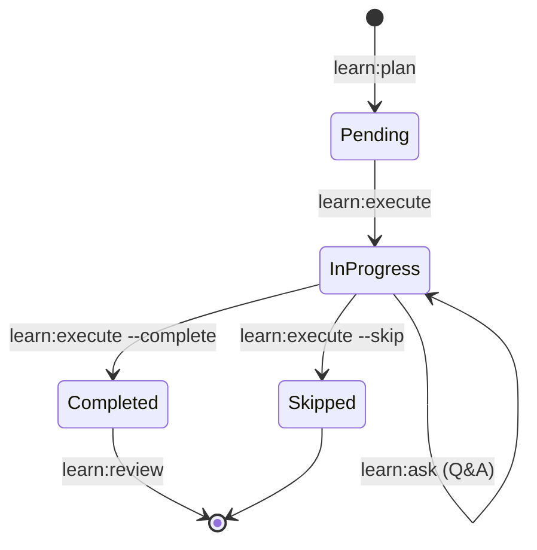

# Learn Workflow - 完整架构设计

> 基于3轮多CLI协作分析（Gemini + Codex + Gemini）的最终设计方案
> **设计原则**: 完全隔离（Isolated Strategy）、Fork友好、零核心代码修改

## 一、核心设计理念

### 1.1 架构原则

**Isolated Strategy（隔离策略）**
- 独立存储：`.workflow/learn/` 完全独立于 `.workflow/active/`
- 零依赖：不使用 `session-manager` 或其他核心内部模块
- 松耦合：通过 CLI 接口与现有系统集成（issue/workflow）
- Fork 友好：所有新增功能，可安全合并上游更新

**自包含应用模式**
```
learn workflow = 独立应用 + CLI调用入口
  ├─ 独立状态管理（文件系统作为数据库）
  ├─ 独立命令实现（.claude/commands/learn/）
  └─ 外部集成（通过 ccw CLI 命令）
```

### 1.2 与现有系统的关系

| 系统 | 集成方式 | 说明 |
|------|----------|------|
| **workflow 系统** | CLI 调用 | `learn:review` → `ccw workflow:lite-plan` |
| **issue 系统** | CLI 调用 | `learn:next` → `ccw issue create` |
| **session-manager** | 无依赖 | 完全独立的状态管理 |
| **核心代码** | 无修改 | 纯新增功能 |

## 二、目录结构与数据模型

### 2.1 目录结构

```
C:\Project\Claude-Code-Workflow\
├── .workflow/
│   ├── learn/                              # ROOT: learn 工作流所有数据
│   │   ├── state.json                      # 全局状态：当前激活的 profile 和 session
│   │   ├── profiles/                       # 用户学习档案
│   │   │   └── {profile-id}.json          # 单个档案：技能水平、学习偏好
│   │   └── sessions/                       # 学习会话
│   │       ├── index.json                  # 会话索引（所有历史会话）
│   │       └── {session-id}/              # 单个会话目录
│   │           ├── manifest.json           # 会话元数据（目标、使用的 profile、时间）
│   │           ├── plan.json               # 学习计划（知识点 DAG）
│   │           ├── progress.json           # 进度跟踪（完成状态、用户反馈）
│   │           └── interactions/           # 交互记录
│   │               ├── ask-{timestamp}.md  # learn:ask 的 Q&A 记录
│   │               └── notes/              # 用户笔记/代码片段
│   │
│   ├── active/                             # UNTOUCHED: learn 不修改
│   └── issues/                             # UNTOUCHED: 通过 CLI 集成
│
└── .claude/
    └── commands/
        └── learn/                          # 新增：learn 命令集
            ├── profile.md                  # 个人档案管理
            ├── plan.md                     # 学习计划生成
            ├── execute.md                  # 知识点执行
            ├── ask.md                      # 导师问答
            └── review.md                   # 学习回顾与知识沉淀
```

### 2.2 数据 Schema

#### a. `state.json` - 全局状态

```json
{
  "$schema": "./schemas/learn-state.schema.json",
  "active_profile_id": "profile-default",
  "active_session_id": "LS-20250124-001",
  "version": "1.0.0",
  "_metadata": {
    "last_updated": "2025-01-24T10:30:00Z",
    "total_sessions_completed": 5
  }
}
```

#### b. `profiles/{id}.json` - 个人学习档案

```json
{
  "$schema": "./schemas/learn-profile.schema.json",
  "profile_id": "profile-default",
  "user_id": "user-001",
  "experience_level": "intermediate",
  "known_topics": [
    {
      "topic_id": "typescript",
      "proficiency": 0.7,
      "last_updated": "2025-01-20T10:00:00Z",
      "evidence": ["Completed type system module", "Built generic utility library"]
    },
    {
      "topic_id": "react",
      "proficiency": 0.5,
      "last_updated": "2025-01-15T08:30:00Z",
      "evidence": ["Basic component creation", "Hooks usage"]
    }
  ],
  "learning_preferences": {
    "style": "practical",
    "preferred_sources": ["official-docs", "interactive-tutorials", "video-courses"],
    "daily_time_budget_minutes": 120
  },
  "feedback_journal": [
    {
      "date": "2025-01-20",
      "session_id": "LS-20250120-001",
      "topic": "TypeScript generics",
      "rating": 4,
      "notes": "Hands-on exercises were very effective",
      "suggested_improvements": ["More real-world examples"]
    }
  ],
  "_metadata": {
    "created_at": "2025-01-01T00:00:00Z",
    "updated_at": "2025-01-24T10:30:00Z"
  }
}
```

#### c. `sessions/{id}/plan.json` - 学习计划

```json
{
  "$schema": "../../schemas/learn-plan.schema.json",
  "session_id": "LS-20250124-001",
  "learning_goal": "Master advanced TypeScript patterns",
  "profile_id": "profile-default",
  "knowledge_points": [
    {
      "id": "KP-1",
      "title": "TypeScript Utility Types",
      "description": "Deep dive into built-in utility types (Partial, Required, Pick, Omit, Record, etc.)",
      "prerequisites": [],
      "resources": [
        {
          "type": "documentation",
          "url": "https://www.typescriptlang.org/docs/handbook/utility-types.html",
          "summary": "Official TypeScript documentation on utility types",
          "quality": "gold"
        },
        {
          "type": "article",
          "url": "https://totaltypescript.com/books/total-typescript",
          "summary": "Comprehensive guide with practical examples",
          "quality": "gold"
        }
      ],
      "assessment": {
        "type": "practical_task",
        "description": "Create a utility type library with 5 custom utility types",
        "acceptance_criteria": ["All types compile without errors", "Usage examples provided"]
      },
      "estimated_effort": "medium",
      "status": "pending"
    },
    {
      "id": "KP-2",
      "title": "Generic Type Constraints",
      "description": "Learn to constrain generics with extends and conditional types",
      "prerequisites": ["KP-1"],
      "resources": [
        {
          "type": "tutorial",
          "url": "https://www.typescriptlang.org/docs/handbook/2/generics.html",
          "summary": "Official guide on generics and constraints",
          "quality": "gold"
        }
      ],
      "assessment": {
        "type": "code_challenge",
        "description": "Implement a generic deep merge function with type constraints",
        "acceptance_criteria": ["Type-safe for all input types", "Handles nested objects correctly"]
      },
      "estimated_effort": "hard",
      "status": "pending"
    }
  ],
  "dependency_graph": {
    "nodes": ["KP-1", "KP-2"],
    "edges": [
      {"from": "KP-1", "to": "KP-2"}
    ]
  },
  "_metadata": {
    "created_at": "2025-01-24T10:00:00Z",
    "updated_at": "2025-01-24T10:00:00Z",
    "total_knowledge_points": 2,
    "estimated_total_effort": "medium-hard"
  }
}
```

#### d. `sessions/{id}/progress.json` - 进度跟踪

```json
{
  "session_id": "LS-20250124-001",
  "current_knowledge_point_id": "KP-1",
  "completed_knowledge_points": [],
  "in_progress_knowledge_points": ["KP-1"],
  "knowledge_point_progress": {
    "KP-1": {
      "status": "in_progress",
      "started_at": "2025-01-24T10:30:00Z",
      "resources_completed": ["documentation"],
      "assessment_attempts": 0,
      "user_notes": "Official docs are clear, need more practice",
      "interactions": [
        {
          "type": "ask",
          "timestamp": "2025-01-24T11:00:00Z",
          "file": "interactions/ask-20250124-110000.md"
        }
      ]
    }
  },
  "overall_metrics": {
    "total_time_spent_minutes": 45,
    "resources_consumed": 1,
    "questions_asked": 1
  },
  "_metadata": {
    "last_updated": "2025-01-24T11:00:00Z"
  }
}
```

## 三、命令架构与执行流程

### 3.1 命令概览

| 命令 | 职责 | 输入 | 输出 | Agent 使用 |
|------|------|------|------|------------|
| **learn:profile** | 个人档案管理 | create/update/select | profile.json | learn-profiling-agent |
| **learn:plan** | 学习计划生成 | 学习目标 | plan.json | learn-planning-agent |
| **learn:execute** | 知识点执行 | [kp-id] | 进度更新 | - |
| **learn:ask** | 导师问答 | 问题 | Q&A 记录 | learn-mentor-agent |
| **learn:review** | 学习回顾 | [session-id] | 知识沉淀 + issue 创建 | - |

### 3.2 命令详细设计

#### 命令 1: `/learn:profile` - 个人档案管理

**功能**：
- 创建/更新个人学习档案
- 知识技能水平评估
- 设置学习偏好
- 选择激活档案

**使用示例**：
```bash
/learn:profile create                    # 创建新档案（交互式评估）
/learn:profile update                    # 更新当前档案
/learn:profile select profile-advanced   # 选择激活档案
/learn:profile show                      # 显示当前档案
```

**执行流程**：
```
Phase 1: 档案发现
   └─ 检查 state.json → 加载 active_profile_id

Phase 2: 操作路由
   ├─ create → 调用 learn-profiling-agent 评估当前技能水平
   ├─ update → AskUserQuestion 收集更新内容
   ├─ select → 更新 state.json
   └─ show → 显示 profile 内容

Phase 3: 持久化
   └─ 写入 profiles/{id}.json + 更新 state.json
```

**Agent 使用：learn-profiling-agent**
```markdown
## 评估任务
评估用户在 {topic} 领域的技能水平

## 评估维度
1. 基础知识：概念理解程度
2. 实践经验：项目经验年限
3. 深入程度：源码阅读、架构设计
4. 应用场景：使用复杂度

## 输出格式
- known_topics: {topic_id, proficiency (0-1), evidence[]}
- 学习建议：后续学习路径
```

#### 命令 2: `/learn:plan` - 学习计划生成

**功能**：
- 根据学习目标生成结构化计划
- 知识差距分析（profile vs 目标）
- 知识点依赖图构建
- 高质量学习资源推荐

**使用示例**：
```bash
/learn:plan "Master React Server Components"           # 基本用法
/learn:plan "Learn Rust for systems programming" --profile profile-dev
```

**执行流程**：
```
Phase 1: 目标解析
   └─ 提取学习目标 + 加载 active profile

Phase 2: 知识差距分析
   └─ 目标所需技能 vs profile.known_topics

Phase 3: 计划生成（Agent）
   ├─ 调用 learn-planning-agent
   │  ├─ 输入：目标 + profile + 差距分析
   │  ├─ 输出：知识点 DAG + 资源推荐
   │  └─ 验证：无循环依赖、前置条件满足

Phase 4: 会话创建
   ├─ 生成 session_id (LS-YYYYMMDD-NNN)
   ├─ 创建 sessions/{id}/ 目录
   ├─ 写入 manifest.json, plan.json, progress.json
   └─ 更新 state.json (active_session_id)

Phase 5: 确认
   └─ 显示计划摘要，等待用户确认
```

**Agent 使用：learn-planning-agent**
```markdown
## 规划任务
为以下学习目标生成结构化计划

## 输入
- 学习目标：{goal}
- 用户档案：{profile.known_topics}
- 知识差距：{gap_analysis}

## 规则
1. 知识点分解：
   - 每个知识点：独立、可验证、可完成
   - 前置依赖：清晰、无循环
   - 估算难度：easy/medium/hard

2. 资源推荐（优先级）：
   - Gold: 官方文档、权威书籍
   - Silver: 高质量博客、教程
   - Bronze: 社区资源、视频

3. 评估方式：
   - practical_task: 实际任务
   - code_challenge: 代码挑战
   - multiple_choice: 知识测试

## 输出
完整的 plan.json（符合 schema）
```

#### 命令 3: `/learn:execute` - 知识点执行

**功能**：
- 执行当前知识点
- 显示学习资源和评估任务
- 更新进度状态
- 支持完成/跳过/创建 issue

**使用示例**：
```bash
/learn:execute                    # 执行下一个待完成的知识点
/learn:execute KP-2               # 执行指定知识点
/learn:execute --complete         # 标记当前知识点为完成
/learn:execute --skip             # 跳过当前知识点
/learn:execute --create-issue     # 将当前知识点转为 issue
```

**执行流程**：
```
Phase 1: 状态加载
   └─ 加载 plan.json + progress.json

Phase 2: 知识点选择
   ├─ 无参数 → 找下一个 pending + 前置条件满足
   ├─ 有参数 → 验证参数有效性
   └─ 验证前置依赖：所有 prerequisites 已完成

Phase 3: 内容展示
   ├─ 知识点标题 + 描述
   ├─ 学习资源（按质量分级）
   ├─ 评估任务
   └─ 当前进度（已完成的资源）

Phase 4: 用户交互
   ├─ AskUserQuestion: 选择操作
   │  ├─ Complete: 标记完成，更新 progress.json
   │  ├─ Skip: 跳过，记录原因
   │  ├─ Ask: 调用 /learn:ask 询问问题
   │  └─ Create Issue: 转为 issue（通过 CLI）
   │     └─ Bash(`ccw issue create --title "..." --body "..."`)

Phase 5: 状态更新
   └─ 更新 progress.json + plan.json (status)
```

#### 命令 4: `/learn:ask` - 导师问答

**功能**：
- 基于当前知识点的上下文问答
- 导师级解释和指导
- 记录交互历史

**使用示例**：
```bash
/learn:ask "What is the difference between Pick and Omit?"
/learn:ask "Can you explain conditional types with an example?"
```

**执行流程**：
```
Phase 1: 上下文收集
   ├─ 当前知识点（KP-id, title, description, resources）
   ├─ 用户档案（known_topics, learning_preferences）
   └─ 相关历史交互（progress.json.interactions）

Phase 2: Agent 调用
   ├─ 调用 learn-mentor-agent
   │  ├─ 输入：问题 + 上下文
   │  ├─ 约束：基于当前知识点 + 用户水平调整解释深度
   │  └─ 输出：个性化回答

Phase 3: 记录保存
   ├─ 保存 Q&A 到 interactions/ask-{timestamp}.md
   └─ 更新 progress.json.knowledge_point_progress[].interactions
```

**Agent 使用：learn-mentor-agent**
```markdown
## 导师任务
回答用户关于当前知识点的问题

## 上下文
- 当前知识点：{kp.title, kp.description, kp.resources}
- 用户水平：{profile.experience_level, profile.known_topics}
- 学习偏好：{profile.learning_preferences.style}
- 相关历史：{recent_interactions}

## 回答原则
1. 个性化：根据用户水平调整解释深度
2. 实践导向：提供可执行的代码示例
3. 渐进式：从简单到复杂，建立直觉
4. 关联性：联系用户已知的知识点

## 输出
- 直接回答
- 代码示例（如适用）
- 延伸学习建议
```

#### 命令 5: `/learn:review` - 学习回顾与知识沉淀

**功能**：
- 回顾整个学习会话
- 生成知识总结
- 更新个人档案（技能水平）
- 可选：创建实践 issue

**使用示例**：
```bash
/learn:review                     # 回顾当前会话
/learn:review LS-20250124-001     # 回顾指定会话
```

**执行流程**：
```
Phase 1: 会话加载
   └─ 加载 plan.json + progress.json + manifest.json

Phase 2: 完成筛选
   └─ 筛选 status = "completed" 的知识点

Phase 3: 知识总结生成
   ├─ 提取关键概念
   ├─ 生成学习路径图
   └─ 生成技能掌握矩阵

Phase 4: 档案更新
   ├─ 更新 profile.known_topics（proficiency 提升）
   ├─ 添加 feedback_journal 条目
   └─ 保存 profiles/{id}.json

Phase 5: 实践建议（可选）
   ├─ 生成实践项目 idea
   └─ 询问：是否创建 issue？
      └─ Yes → Bash(`ccw issue create ...`)
```

### 3.3 状态转换图



## 四、与现有系统的松耦合集成

### 4.1 集成点设计

**1. Issue 系统集成**
- **触发时机**: `learn:execute --create-issue`
- **集成方式**: CLI 调用
- **实现**:
  ```javascript
  Bash(`ccw issue create \
    --title "Learn: ${kp.title}" \
    --body "${kp.description}\\n\\nResources:\\n${kp.resources.map(r => r.url).join('\\n')}" \
    --label learning-task,${session.learning_goal}`)
  ```

**2. Workflow 系统集成**
- **触发时机**: `learn:review` 生成实践项目后
- **集成方式**: CLI 调用
- **实现**:
  ```javascript
  Bash(`ccw workflow:lite-plan "Implement ${projectName} based on learned skills from ${session_id}"`)
  ```

### 4.2 隔离性保证

| 隔离维度 | 实现方式 | 验证 |
|----------|----------|------|
| **存储隔离** | `.workflow/learn/` 独立目录 | 不读取/写入 `.workflow/active/` |
| **代码隔离** | 独立命令文件 `.claude/commands/learn/` | 不修改 `workflow/` 或 `issue/` 命令 |
| **依赖隔离** | 不使用 `session-manager` | 所有状态管理在 `.workflow/learn/state.json` |
| **集成隔离** | 仅通过 CLI 接口 | `Bash('ccw ...')` 调用，无内部 API |

## 五、实现路线图

### Phase 1: 数据基础（Week 1）
- [ ] 定义 JSON schema（4 个 schema 文件）
- [ ] 实现状态管理函数（读/写 `.workflow/learn/`）
- [ ] 创建目录结构初始化逻辑
- [ ] 编写 schema 验证测试

### Phase 2: 核心命令（Week 2）
- [ ] 实现 `/learn:profile`（无 agent 版本）
- [ ] 实现 `/learn:plan`（静态模板版本）
- [ ] 实现 `/learn:execute`（基本执行循环）
- [ ] 实现状态持久化和恢复

### Phase 3: Agent 智能化（Week 3）
- [ ] 开发 `learn-profiling-agent`
- [ ] 开发 `learn-planning-agent`
- [ ] 集成 agent 到 `/learn:plan`
- [ ] 实现资源推荐逻辑

### Phase 4: 交互增强（Week 4）
- [ ] 实现 `/learn:ask` + `learn-mentor-agent`
- [ ] 实现 `/learn:review`
- [ ] 添加用户笔记功能
- [ ] 实现 CLI 集成（issue 创建）

### Phase 5: 优化与完善（Week 5）
- [ ] 错误处理与恢复
- [ ] 进度可视化（进度条、统计）
- [ ] 性能优化（资源缓存）
- [ ] 文档完善

## 六、关键设计决策记录

| 决策点 | 选择 | 理由 | 权衡 |
|--------|------|------|------|
| **存储策略** | Isolated (`.workflow/learn/`) | Fork 友好，零合并冲突 | 需要自建状态管理 |
| **Session 管理** | 不使用 `session-manager` | 避免修改核心代码 | 需要实现会话生命周期 |
| **数据库** | 文件系统（JSON） | 简单，无外部依赖 | 并发性能有限 |
| **集成方式** | CLI 调用 | 松耦合，API 稳定 | 性能略低于内部调用 |
| **资源推荐** | Agent 驱动 | 灵活，可迭代 | 依赖模型质量 |
| **时间估算** | 不包含 | 用户明确要求无时间压力 | 失去进度估算能力 |

## 七、风险与缓解

| 风险 | 级别 | 缓解措施 |
|------|------|----------|
| **状态管理复杂度** | Medium | 参照 `issue:queue` 模式，保持简单 |
| **Agent 质量不稳定** | High | 分阶段实现，先模板后 agent |
| **资源推荐失效** | Medium | 用户可手动添加资源 |
| **并发问题** | Low | 单用户场景，文件锁足够 |

## 八、成功标准

### 功能完整性
- [ ] 4 个核心命令全部实现
- [ ] Agent 智能化程度达到实用水平
- [ ] 与 issue/workflow 系统集成成功

### 用户体验
- [ ] 新手可以 5 分钟内创建学习计划
- [ ] 学习进度清晰可见
- [ ] 导师问答响应及时准确

### 技术质量
- [ ] 零核心代码修改
- [ ] 所有 JSON 数据符合 schema
- [ ] 错误处理完善，不会卡死

## 九、参考资料

**内部文档**：
- `.workflow/.scratchpad/WORKFLOW_IMPLEMENTATION_PATTERNS.md`
- `.workflow/.scratchpad/T1-workflow-plan.md`
- `.workflow/.scratchpad/T2-workflow-lite-plan.md`
- `.workflow/.scratchpad/T3-issue-plan.md`

**CLI 讨论记录**：
- learn-arch-001: 初始架构设计（Gemini）
- learn-arch-002: 交叉验证与风险评估（Codex）
- learn-arch-003: Isolated 策略重新设计（Gemini）

**相关命令参考**：
- `.claude/commands/workflow/plan.md`
- `.claude/commands/workflow/lite-plan.md`
- `.claude/commands/workflow/execute.md`
- `.claude/commands/issue/plan.md`
- `.claude/commands/issue/queue.md`

---

**版本**: v1.0.0
**最后更新**: 2025-01-24
**状态**: Final Design - Ready for Implementation


---

## v2.0 增强版架构 (Enhanced Architecture)

基于两轮多CLI协作分析（Gemini + Codex）的增强方案

### 用户画像三层架构

**问题**：当前只有 experience_level + known_topics + learning_preferences，缺少角色/目标/演进机制

**解决方案**：三层模型（向后兼容）

```
1. Global Persona（跨会话长期资产）
   - 人格类型：The Pragmatist / The Architect / The Explorer
   - 价值体系：Speed of Delivery / Functionality First / Elegance
   - 元能力：debugging_confidence / search_efficiency / docs_reading
   - 跨会话稳定，渐进演进

2. Profiles（可继承/特化）
   - inherits_from: 从父profile继承基础配置
   - persona_id: 关联到全局persona
   - goals{primary, goal_type, success_definition}
   - overrides{constraints, pedagogy}
   - 面向领域/目标类型（Rust系统编程 / React前端 / LeetCode）

3. Session Context（一次性）
   - 本次学习的具体目标
   - 时间碎片、动机、临时约束
   - 会话结束后可归档
```

**新增字段示例**：
```json
{
  "profile_id": "profile-rust-systems",
  "inherits_from": "profile-default",
  "persona_id": "persona-default",
  "goals": {
    "primary": "Build a high-performance CLI encryption tool",
    "goal_type": "project",
    "success_definition": ["CLI works", "handles large files", "safe defaults"]
  },
  "overrides": {
    "constraints": { "time_fragmentation": "High" },
    "pedagogy": { "modality": "Pragmatic" }
  }
}
```

### 跨会话知识图谱

**问题**：只有session内DAG，无全局知识管理，无法跨会话关联

**解决方案**：新增 `.workflow/learn/knowledge/` 目录

```
.workflow/learn/knowledge/
├── topics.json          # Topic注册表（canonical + aliases）
├── graph.json           # 边关系（prerequisite/related/same_as）
└── observations.jsonl   # 学习证据（追加式日志）
```

**topics.json 结构**：
```json
{
  "topics": [
    {
      "topic_id": "ts.utility-types",
      "name": "TypeScript Utility Types",
      "aliases": ["Utility Types", "TS Utility Types"],
      "tags": ["typescript", "types"],
      "level": "intermediate",
      "canonical": true
    }
  ]
}
```

**graph.json 结构**：
```json
{
  "edges": [
    { "from": "ts.generics", "to": "ts.utility-types", "type": "prerequisite", "strength": 0.9 },
    { "from": "ts.conditional-types", "to": "ts.utility-types", "type": "related", "strength": 0.6 }
  ],
  "_metadata": { "version": "1.0.0", "updated_at": "2026-01-24" }
}
```

**plan.json 增强**（预留跨会话关联）：
```json
{
  "id": "KP-1",
  "title": "TypeScript Utility Types",
  "topic_refs": ["ts.utility-types"],  // NEW: 指向全局topic
  "prerequisites": [],
  "resources": [...]
}
```

### MCP工具集成策略

**问题**：资源推荐依赖agent预训练知识，质量无保证

**解决方案**：按学习目标类型使用MCP工具链

**A) 项目/代码相关学习**：
```javascript
// learn-planning-agent内部流程：
1. ACE: mcp__ace-tool__search_context(query="auth patterns")
2. smart_search: 精确匹配代码实现
3. Exa: mcp__exa__get_code_context_exa(query="best practices")
4. Normalize: 统一topic_id + 去重
5. Score: 质量分级（gold/silver/bronze）
6. Emit: plan.json
```

**B) 通用知识学习**：
```javascript
1. Exa: 获取官方文档/权威教程
2. 本地缓存：检查 .workflow/learn/sessions/**/plan.json
3. 历史会话：从 observations.jsonl 查同topic记录
```

**Fallback链**：
```
Gemini → Qwen → Codex → degraded (只产出结构，不产出资源)
```

### 质量保证分层（QA Layers）

**Layer 0: Schema Validation（阻断型）**
- 必须补齐 learn-plan-schema.json（当前缺失）
- 每个输出必须先读schema再生成

**Layer 1: Graph Validity（阻断型）**
- 检查 prerequisites 无环
- 验证所有引用存在
- 生成 topological order

**Layer 2: Profile→Plan Matching（阻断/告警）**
- 高熟练topic (>=0.8) → 降级为可选
- 缺少prerequisites → 必须补基础KP或clarification
- 生成 profile_fingerprint 防止不匹配

**Layer 3: Resource Quality Scoring（阻断/降级）**
- Gold: 官方文档/标准/权威
- Silver: 优质博客/可靠来源
- Bronze: 社区资源（仅补充）
- 字段：quality_score(0-1) + reasons[] + retrieved_at

**Layer 4: 反馈闭环（非阻断）**
- session完成情况写回 persona/profile/knowledge graph
- feedback_journal 记录体验评分
- 知识技能渐进提升

### 与workflow/issue的一致性对齐

**引入的Gold Patterns**：

1. **纯编排器边界** - 命令只负责phase串联，不执行分析
2. **TodoWrite自动续跑** - multi-phase进度协议
3. **Clarification阻塞** - 高风险冲突必须用户决策
4. **Schema-first** - 所有输出必须符合schema定义
5. **CLI数据访问** - 通过`ccw learn`子命令而非直接Read

**交互模式对齐**：
```
workflow:plan → Phase串联 → TodoWrite → auto-continue
issue:plan → 批处理 → agent执行 → 绑定闭环
learn:plan → 6-phase → TodoWrite → MCP集成 → Validation Gate
```

---

## 实现优先级（基于两轮分析）

### P0（阻断性）- 立即实施
1. ✅ 补齐6个JSON schema文件
2. ✅ MCP工具集成到learn-planning-agent
3. ✅ 引入Validation Gate（4-layer QA）

### P1（质量保证）- 第二阶段
4. ✅ 画像三层拆分（persona/profile/session）
5. ✅ 跨会话知识图谱（topics + graph + observations）
6. ✅ Clarification阻塞机制

### P2（优化增强）- 第三阶段
7. ✅ Profile继承合并规则
8. ✅ 资源质量自动评分
9. ✅ 知识图谱可视化


