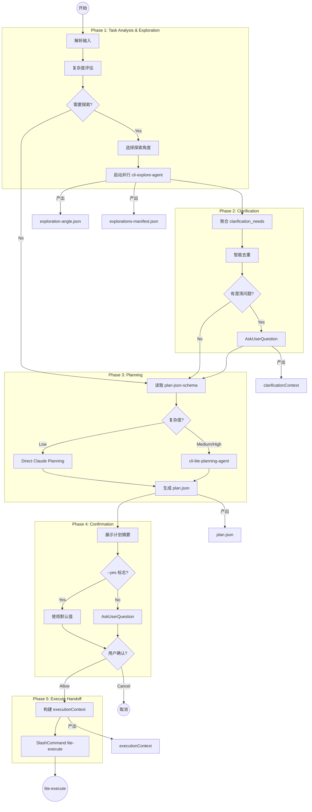

# lite-plan 执行流程图

```mermaid
flowchart TD
    START(("开始"))

    subgraph P1["Phase 1: Task Analysis & Exploration"]
        direction TB
        P1_PARSE["解析输入"]
        P1_ASSESS["复杂度评估"]
        P1_DECIDE{"需要探索?"}
        P1_ANGLES["选择探索角度"]
        P1_LAUNCH["启动并行 cli-explore-agent"]
    end

    subgraph P2["Phase 2: Clarification"]
        direction TB
        P2_AGGREGATE["聚合 clarification_needs"]
        P2_DEDUP["智能去重"]
        P2_HAS{"有澄清问题?"}
        P2_ASK["AskUserQuestion"]
    end

    subgraph P3["Phase 3: Planning"]
        direction TB
        P3_SCHEMA["读取 plan-json-schema"]
        P3_ROUTE{"复杂度?"}
        P3_DIRECT["Direct Claude Planning"]
        P3_AGENT["cli-lite-planning-agent"]
        P3_OUTPUT["生成 plan.json"]
    end

    subgraph P4["Phase 4: Confirmation"]
        direction TB
        P4_DISPLAY["展示计划摘要"]
        P4_AUTO{"--yes 标志?"}
        P4_ASK["AskUserQuestion"]
        P4_DEFAULT["使用默认值"]
        P4_CONFIRM{"用户确认?"}
    end

    subgraph P5["Phase 5: Execute Handoff"]
        direction TB
        P5_BUILD["构建 executionContext"]
        P5_HANDOFF["SlashCommand lite-execute"]
    end

    A1["exploration-angle.json"]
    A2["explorations-manifest.json"]
    A3["clarificationContext"]
    A4["plan.json"]
    A5["executionContext"]

    LITE_EXECUTE(("lite-execute"))
    END_CANCEL(("取消"))

    START --> P1_PARSE
    P1_PARSE --> P1_ASSESS
    P1_ASSESS --> P1_DECIDE
    P1_DECIDE -->|Yes| P1_ANGLES
    P1_DECIDE -->|No| P3_SCHEMA
    P1_ANGLES --> P1_LAUNCH
    P1_LAUNCH -->|产出| A1
    P1_LAUNCH -->|产出| A2
    P1_LAUNCH --> P2_AGGREGATE

    P2_AGGREGATE --> P2_DEDUP
    P2_DEDUP --> P2_HAS
    P2_HAS -->|Yes| P2_ASK
    P2_HAS -->|No| P3_SCHEMA
    P2_ASK -->|产出| A3
    P2_ASK --> P3_SCHEMA

    P3_SCHEMA --> P3_ROUTE
    P3_ROUTE -->|Low| P3_DIRECT
    P3_ROUTE -->|Medium/High| P3_AGENT
    P3_DIRECT --> P3_OUTPUT
    P3_AGENT --> P3_OUTPUT
    P3_OUTPUT -->|产出| A4
    P3_OUTPUT --> P4_DISPLAY

    P4_DISPLAY --> P4_AUTO
    P4_AUTO -->|Yes| P4_DEFAULT
    P4_AUTO -->|No| P4_ASK
    P4_DEFAULT --> P4_CONFIRM
    P4_ASK --> P4_CONFIRM
    P4_CONFIRM -->|Allow| P5_BUILD
    P4_CONFIRM -->|Cancel| END_CANCEL

    P5_BUILD -->|产出| A5
    P5_BUILD --> P5_HANDOFF
    P5_HANDOFF --> LITE_EXECUTE
```

---

_飞书兼容 Mermaid 图，可直接复制到飞书文本绘图_
