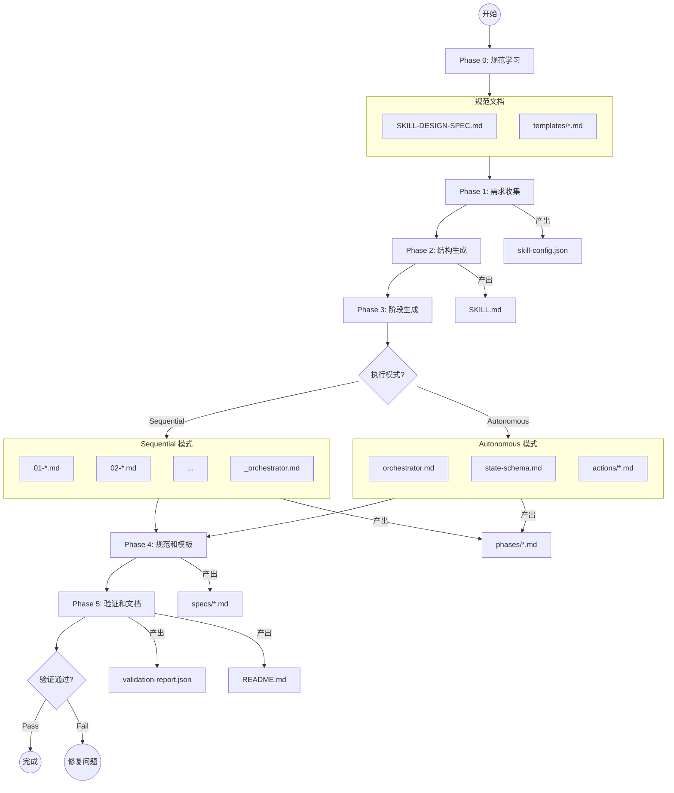

# skill-generator 执行流程图

```mermaid
flowchart TD
    START(("开始"))

    P0["Phase 0: 规范学习"]
    P1["Phase 1: 需求收集"]
    P2["Phase 2: 结构生成"]
    P3["Phase 3: 阶段生成"]
    P4["Phase 4: 规范和模板"]
    P5["Phase 5: 验证和文档"]

    D1{"执行模式?"}
    D2{"验证通过?"}

    subgraph SPECS["规范文档"]
        direction TB
        S1["SKILL-DESIGN-SPEC.md"]
        S2["templates/*.md"]
    end

    subgraph SEQ["Sequential 模式"]
        direction TB
        SEQ1["01-*.md"]
        SEQ2["02-*.md"]
        SEQ3["..."]
        SEQ4["_orchestrator.md"]
    end

    subgraph AUTO["Autonomous 模式"]
        direction TB
        AUTO1["orchestrator.md"]
        AUTO2["state-schema.md"]
        AUTO3["actions/*.md"]
    end

    A1["skill-config.json"]
    A2["SKILL.md"]
    A3["phases/*.md"]
    A4["specs/*.md"]
    A5["validation-report.json"]
    A6["README.md"]

    END_OK(("完成"))
    END_FIX(("修复问题"))

    START --> P0
    P0 --> SPECS
    SPECS --> P1
    P1 -->|产出| A1
    P1 --> P2
    P2 -->|产出| A2
    P2 --> P3
    P3 --> D1
    D1 -->|Sequential| SEQ
    D1 -->|Autonomous| AUTO
    SEQ -->|产出| A3
    AUTO -->|产出| A3
    SEQ --> P4
    AUTO --> P4
    P4 -->|产出| A4
    P4 --> P5
    P5 -->|产出| A5
    P5 -->|产出| A6
    P5 --> D2
    D2 -->|Pass| END_OK
    D2 -->|Fail| END_FIX
```

---

*飞书兼容 Mermaid 图，可直接复制到飞书文本绘图*
