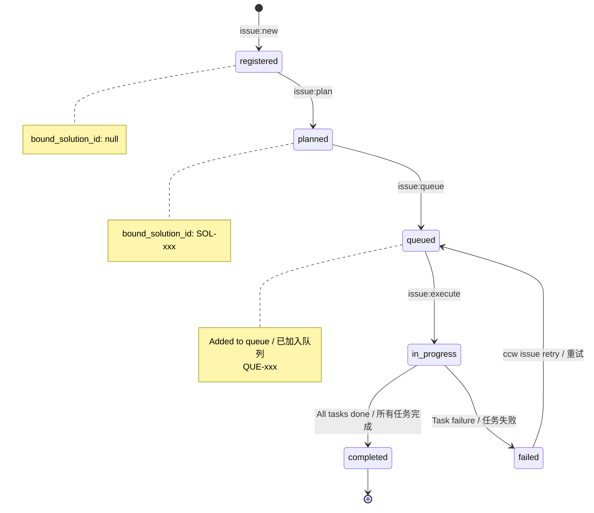

# Issue Lifecycle Workflow Visualization / Issue 生命周期工作流可视化

## Overview / 概述

Complete visualization of the issue management workflow: `issue:new` → `issue:plan` → `issue:queue` → `issue:execute`

Issue 管理工作流完整可视化

| Attribute / 属性        | Value / 值                                          |
| ----------------------- | --------------------------------------------------- |
| **Type / 类型**         | Command Chain / 命令链                              |
| **Commands / 命令**     | 4                                                   |
| **Agents / 代理**       | issue-plan-agent, issue-queue-agent, code-developer |
| **CLI Tools / CLI工具** | gh, ccw issue, ccw cli                              |

---

## Complete Execution Flow / 完整执行流程

```mermaid
flowchart TD
    %% ==================== STYLE DEFINITIONS / 样式定义 ====================
    classDef user fill:#e3f2fd,stroke:#1565c0,stroke-width:2px
    classDef ccw fill:#fff8e1,stroke:#f57c00,stroke-width:2px
    classDef agent fill:#e8f5e9,stroke:#388e3c,stroke-width:2px
    classDef data fill:#f3e5f5,stroke:#7b1fa2,stroke-width:2px
    classDef cli fill:#fce4ec,stroke:#c2185b,stroke-width:2px
    classDef decision fill:#fff3e0,stroke:#e65100,stroke-width:2px,shape:rhombus
    classDef endpoint fill:#e0f7fa,stroke:#00838f,stroke-width:2px

    %% ==================== ENTRY POINT / 入口点 ====================
    START(["🚀 用户输入<br/>User Input"]):::user

    %% ==================== ISSUE:NEW SUBGRAPH ====================
    subgraph NEW["📋 issue:new - 创建 Issue / Create Issue"]
        direction TB

        NEW_P1["Phase 1: 输入分析<br/>Input Analysis<br/>检测清晰度 / Detect clarity"]:::ccw
        NEW_DEC1{"清晰度评分?<br/>Clarity Score?"}:::decision

        subgraph NEW_BRANCH1["Score 3: GitHub URL"]
            NEW_GH1["gh issue view"]:::cli
            NEW_GH2["解析 Markdown<br/>Parse markdown body"]:::ccw
        end

        subgraph NEW_BRANCH2["Score 1-2: 结构化文本 / Structured Text"]
            NEW_TXT1["解析文本<br/>Parse text description"]:::ccw
            NEW_ACE["ACE 快速搜索<br/>ACE search (quick hint)"]:::cli
        end

        subgraph NEW_BRANCH3["Score 0: 模糊 / Vague"]
            NEW_ASK1["AskUserQuestion<br/>澄清详情 / Clarify details"]:::user
            NEW_FEED["添加到 feedback[]<br/>Add to feedback[]"]:::data
        end

        NEW_P2["Phase 2: 数据提取<br/>Data Extraction"]:::ccw
        NEW_DEC2{"来源=GitHub?<br/>Source = GitHub?"}:::decision
        NEW_ASK2["AskUserQuestion<br/>发布到 GitHub?"]:::user
        NEW_PUB["gh issue create"]:::cli
        NEW_P3["Phase 3: 创建本地 Issue<br/>Create Local Issue<br/>ccw issue create"]:::endpoint
        NEW_BIND["更新 github_url<br/>Update with github_url<br/>ccw issue update"]:::endpoint
        NEW_END1(["✓ Issue 已创建<br/>Issue Created<br/>ID: ISS-xxx or GH-xxx"]):::data
    end

    %% ==================== ISSUE:PLAN SUBGRAPH ====================
    subgraph PLAN["📐 issue:plan - 规划方案 / Plan Solutions"]
        direction TB

        PLAN_P1["Phase 1: 加载 Issue<br/>Load Issues<br/>ccw issue list --brief"]:::endpoint
        PLAN_DEC1{"输入类型?<br/>Input type?"}:::decision

        subgraph PLAN_INPUT1["--all-pending"]
            PLAN_ALL["获取 pending Issues<br/>Get pending issues<br/>status=pending,registered"]:::endpoint
        end

        subgraph PLAN_INPUT2["指定 IDs / Specific IDs"]
            PLAN_IDS["解析逗号分隔 ID<br/>Parse comma-separated IDs"]:::ccw
            PLAN_INIT["ccw issue init<br/>(自动创建 / auto-create)"]:::endpoint
        end

        PLAN_P2["Phase 2: 智能分组<br/>Intelligent Grouping<br/>Gemini 语义相似性"]:::ccw
        PLAN_TODO["TodoWrite: 规划批次<br/>Plan batches"]:::ccw

        subgraph PLAN_AGENT["🤖 issue-plan-agent (并行 / Parallel)"]
            PLAN_ACE["ACE 语义搜索<br/>ACE semantic search"]:::cli
            PLAN_EXP["探索代码库<br/>Explore codebase"]:::agent
            PLAN_FAIL["分析失败历史<br/>Analyze failure history<br/>(if feedback exists)"]:::agent
            PLAN_SOL["生成解决方案<br/>Generate solution(s)<br/>with task breakdown"]:::agent
            PLAN_WRITE["写入 solutions/<br/>Write to solutions/{id}.jsonl"]:::data
            PLAN_BIND["自动绑定单方案<br/>Auto-bind if single solution<br/>ccw issue bind"]:::endpoint
        end

        PLAN_P3["Phase 3: 方案选择<br/>Solution Selection<br/>(多方案时)"]:::ccw
        PLAN_ASK["AskUserQuestion<br/>选择方案 / Select solution"]:::user
        PLAN_MANUAL_BIND["ccw issue bind"]:::endpoint
        PLAN_P4["Phase 4: 完成汇总<br/>Summary<br/>显示规划数量"]:::ccw
        PLAN_END(["✓ Issue 已规划<br/>Issues Planned<br/>Status: planned"]):::data
    end

    %% ==================== ISSUE:QUEUE SUBGRAPH ====================
    subgraph QUEUE["📊 issue:queue - 编排队列 / Form Queue"]
        direction TB

        QUEUE_P1["Phase 1: 加载 Solutions<br/>Load Solutions<br/>ccw issue solutions --brief"]:::endpoint
        QUEUE_DEC1{"--queues > 1?"}:::decision

        subgraph QUEUE_MULTI["多队列分发 / Multi-Queue Distribution"]
            QUEUE_PART["按 files_touched 分区<br/>Partition by files_touched<br/>最小化组间冲突"]:::ccw
        end

        QUEUE_P2["Phase 2-4: 生成队列 ID<br/>Generate Queue IDs<br/>QUE-{timestamp}"]:::ccw

        subgraph QUEUE_AGENT["🤖 issue-queue-agent"]
            QUEUE_DAG["构建依赖 DAG<br/>Build dependency DAG<br/>from file conflicts"]:::agent
            QUEUE_GEMINI["Gemini CLI 冲突分析<br/>Conflict analysis<br/>5 types: file/API/data/dep/arch"]:::cli
            QUEUE_PRIO["计算语义优先级<br/>Calculate semantic priority"]:::agent
            QUEUE_GRP["分配执行组<br/>Assign execution groups<br/>P* (并行) / S* (顺序)"]:::agent
            QUEUE_WRITE1["写入队列 JSON<br/>Write queue JSON<br/>queues/{id}.json"]:::data
            QUEUE_WRITE2["更新 index.json<br/>Update index.json<br/>active_queue_id"]:::data
        end

        QUEUE_P5["Phase 5: 冲突澄清<br/>Conflict Clarification"]:::ccw
        QUEUE_DEC2{"存在澄清项?<br/>Clarifications exist?"}:::decision
        QUEUE_ASK["AskUserQuestion<br/>解决冲突 / Resolve conflicts"]:::user
        QUEUE_RESUME["恢复 Agent<br/>Resume agent with decision"]:::agent

        QUEUE_P6["Phase 6: 状态更新<br/>Status Update<br/>ccw issue update --from-queue"]:::endpoint
        QUEUE_P7["Phase 7: 活动队列检查<br/>Active Queue Check"]:::ccw
        QUEUE_DEC3{"存在活动队列?<br/>Active queue exists?"}:::decision
        QUEUE_ASK2["AskUserQuestion<br/>合并/切换/取消<br/>Merge/Switch/Cancel"]:::user
        QUEUE_MERGE["ccw issue queue merge"]:::endpoint
        QUEUE_SWITCH["ccw issue queue switch"]:::endpoint
        QUEUE_DEL["ccw issue queue delete"]:::endpoint
        QUEUE_END(["✓ 队列已形成<br/>Queue Formed<br/>Status: queued"]):::data
    end

    %% ==================== ISSUE:EXECUTE SUBGRAPH ====================
    subgraph EXECUTE["⚡ issue:execute - 执行队列 / Execute Queue"]
        direction TB

        EXEC_P0["Phase 0: 验证队列 ID<br/>Validate Queue ID<br/>(必填 / REQUIRED)"]:::ccw
        EXEC_DEC0{"提供了 --queue?<br/>--queue provided?"}:::decision
        EXEC_LIST["ccw issue queue list --brief"]:::endpoint
        EXEC_ASK0["AskUserQuestion<br/>选择队列 / Select queue"]:::user

        EXEC_P05["Phase 0.5: 设置 Worktree<br/>Setup Worktree<br/>(if --worktree)"]:::ccw
        EXEC_WT1["创建 worktree<br/>Create worktree<br/>.ccw/worktrees/queue-{id}"]:::cli
        EXEC_WT2["或恢复现有<br/>OR resume existing"]:::cli

        EXEC_P1["Phase 1: 获取 DAG<br/>Get DAG<br/>ccw issue queue dag --queue ${QUEUE_ID}"]:::endpoint
        EXEC_ASK1["AskUserQuestion<br/>执行器 + 模式 + Worktree<br/>Executor + Mode + Worktree"]:::user
        EXEC_DEC1{"模式?<br/>Mode?"}:::decision
        EXEC_DRY["Dry-run: 显示批次<br/>Show batches"]:::ccw

        EXEC_P2["Phase 2: 分发并行批次<br/>Dispatch Parallel Batch"]:::ccw
        EXEC_TODO["TodoWrite: 执行 Solutions<br/>Execute solutions"]:::ccw

        subgraph EXEC_BATCH["并行批次执行 / Parallel Batch Execution"]
            direction TB
            EXEC_DETAIL["ccw issue detail {id}<br/>只读获取完整方案<br/>READ-ONLY fetch full solution"]:::endpoint

            subgraph EXEC_TYPE["执行器类型 / Executor Types"]
                EXEC_CODEX["Codex<br/>ccw cli --tool codex --mode write"]:::cli
                EXEC_GEMINI["Gemini<br/>ccw cli --tool gemini --mode write"]:::cli
                EXEC_AGENT["Agent<br/>Task subagent_type=code-developer"]:::agent
            end

            EXEC_TASKS["顺序执行任务<br/>Execute tasks sequentially<br/>T1 → T2 → T3"]:::agent
            EXEC_COMMIT["git commit<br/>(每 Solution 一次 / once per solution)"]:::cli
            EXEC_DONE["ccw issue done {id}<br/>报告完成/失败<br/>Report completion/failure"]:::endpoint
        end

        EXEC_P3["Phase 3: 检查下一批次<br/>Check Next Batch<br/>刷新 DAG / Refresh DAG"]:::ccw
        EXEC_DEC2{"更多批次?<br/>More batches?"}:::decision

        EXEC_P4["Phase 4: Worktree 完成<br/>Worktree Completion"]:::ccw
        EXEC_ASK2["AskUserQuestion<br/>创建 PR / 合并 / 保留<br/>Create PR / Merge / Keep"]:::user
        EXEC_PR["gh pr create"]:::cli
        EXEC_MERGE["git merge --no-ff"]:::cli
        EXEC_CLEAN["git worktree remove"]:::cli
        EXEC_END(["✓ 队列已执行<br/>Queue Executed<br/>Status: completed/failed"]):::data
    end

    %% ==================== DATA STORAGE / 数据存储 ====================
    subgraph STORAGE["💾 数据存储 / Data Storage"]
        direction TB
        S1["issues.jsonl<br/>所有 Issue 及状态<br/>All issues with status"]:::data
        S2["solutions/{issue-id}.jsonl<br/>方案定义<br/>Solution definitions"]:::data
        S3["queues/{queue-id}.json<br/>队列定义<br/>Queue definitions"]:::data
        S4["queues/index.json<br/>活动队列 + 历史<br/>Active queue + history"]:::data
    end

    %% ==================== FLOW CONNECTIONS / 流程连接 ====================
    START --> NEW

    %% issue:new flow
    NEW_P1 --> NEW_DEC1
    NEW_DEC1 -->|Score 3| NEW_BRANCH1
    NEW_DEC1 -->|Score 1-2| NEW_BRANCH2
    NEW_DEC1 -->|Score 0| NEW_BRANCH3
    NEW_BRANCH1 --> NEW_P2
    NEW_BRANCH2 --> NEW_P2
    NEW_BRANCH3 --> NEW_FEED --> NEW_P2
    NEW_P2 --> NEW_DEC2
    NEW_DEC2 -->|No| NEW_P3
    NEW_DEC2 -->|Yes| NEW_ASK2
    NEW_ASK2 -->|Yes| NEW_PUB --> NEW_BIND
    NEW_ASK2 -->|No| NEW_P3
    NEW_P3 --> NEW_END1
    NEW_BIND --> NEW_END1

    %% new -> plan
    NEW_END1 -->|下一步: /issue:plan| PLAN

    %% issue:plan flow
    PLAN_P1 --> PLAN_DEC1
    PLAN_DEC1 -->|--all-pending| PLAN_INPUT1
    PLAN_DEC1 -->|Specific IDs| PLAN_INPUT2
    PLAN_INPUT1 --> PLAN_P2
    PLAN_INPUT2 --> PLAN_P2
    PLAN_P2 --> PLAN_TODO --> PLAN_AGENT
    PLAN_AGENT --> PLAN_P3
    PLAN_P3 --> PLAN_ASK --> PLAN_MANUAL_BIND --> PLAN_P4
    PLAN_AGENT -->|Single solution| PLAN_P4
    PLAN_P4 --> PLAN_END

    %% plan -> queue
    PLAN_END -->|下一步: /issue:queue| QUEUE

    %% issue:queue flow
    QUEUE_P1 --> QUEUE_DEC1
    QUEUE_DEC1 -->|No| QUEUE_P2
    QUEUE_DEC1 -->|Yes| QUEUE_MULTI --> QUEUE_P2
    QUEUE_P2 --> QUEUE_AGENT
    QUEUE_AGENT --> QUEUE_P5
    QUEUE_P5 --> QUEUE_DEC2
    QUEUE_DEC2 -->|Yes| QUEUE_ASK --> QUEUE_RESUME --> QUEUE_P6
    QUEUE_DEC2 -->|No| QUEUE_P6
    QUEUE_P6 --> QUEUE_P7
    QUEUE_P7 --> QUEUE_DEC3
    QUEUE_DEC3 -->|No| QUEUE_END
    QUEUE_DEC3 -->|Yes| QUEUE_ASK2
    QUEUE_ASK2 -->|Merge| QUEUE_MERGE --> QUEUE_END
    QUEUE_ASK2 -->|Switch| QUEUE_SWITCH --> QUEUE_END
    QUEUE_ASK2 -->|Cancel| QUEUE_DEL --> QUEUE_END

    %% queue -> execute
    QUEUE_END -->|下一步: /issue:execute| EXECUTE

    %% issue:execute flow
    EXEC_P0 --> EXEC_DEC0
    EXEC_DEC0 -->|Yes| EXEC_P05
    EXEC_DEC0 -->|No| EXEC_LIST --> EXEC_ASK0 --> EXEC_P05
    EXEC_P05 --> EXEC_P1
    EXEC_P1 --> EXEC_ASK1 --> EXEC_DEC1
    EXEC_DEC1 -->|Dry-run| EXEC_DRY
    EXEC_DEC1 -->|Execute| EXEC_P2
    EXEC_P2 --> EXEC_TODO --> EXEC_BATCH
    EXEC_BATCH --> EXEC_P3
    EXEC_P3 --> EXEC_DEC2
    EXEC_DEC2 -->|Yes| EXEC_P2
    EXEC_DEC2 -->|No| EXEC_P4
    EXEC_P4 --> EXEC_ASK2
    EXEC_ASK2 -->|Create PR| EXEC_PR --> EXEC_CLEAN --> EXEC_END
    EXEC_ASK2 -->|Merge| EXEC_MERGE --> EXEC_CLEAN --> EXEC_END
    EXEC_ASK2 -->|Keep| EXEC_CLEAN --> EXEC_END

    %% Storage connections
    NEW_P3 -.->|写入 / Write| S1
    NEW_BIND -.->|更新 / Update| S1
    PLAN_AGENT -.->|读/写 / Read/Write| S1
    PLAN_AGENT -.->|写入 / Write| S2
    PLAN_MANUAL_BIND -.->|更新 / Update| S1
    QUEUE_AGENT -.->|读取 / Read| S2
    QUEUE_AGENT -.->|写入 / Write| S3
    QUEUE_AGENT -.->|更新 / Update| S4
    QUEUE_MERGE -.->|更新 / Update| S4
    QUEUE_SWITCH -.->|更新 / Update| S4
    QUEUE_DEL -.->|删除 / Delete| S3
    QUEUE_P6 -.->|更新 / Update| S1
    EXEC_P1 -.->|读取 / Read| S4
    EXEC_DETAIL -.->|读取 / Read| S2
    EXEC_DONE -.->|更新 / Update| S1
    EXEC_DONE -.->|更新 / Update| S4
```



---

## Status Flow / 状态流转



---

## Command Quick Reference / 命令速查

| Command         | Purpose / 用途                                                        | Key CLI Calls / 关键 CLI 调用                                               |
| --------------- | --------------------------------------------------------------------- | --------------------------------------------------------------------------- |
| `issue:new`     | 从 GitHub URL 或文本创建 Issue / Create issue from GitHub URL or text | `gh issue view`, `ccw issue create`, `ccw issue update`                     |
| `issue:plan`    | 为 Issue 规划方案 / Plan solutions for issues                         | `ccw issue list`, `ccw issue status`, `ccw issue bind`                      |
| `issue:queue`   | 形成执行队列 / Form execution queue                                   | `ccw issue solutions`, `ccw issue update --from-queue`, `ccw issue queue *` |
| `issue:execute` | 执行队列方案 / Execute queue solutions                                | `ccw issue queue dag`, `ccw issue detail`, `ccw issue done`                 |

---

## Agent Responsibilities / Agent 职责

| Agent / 代理        | Used By / 使用者 | Responsibilities / 职责                                                                                            |
| ------------------- | ---------------- | ------------------------------------------------------------------------------------------------------------------ |
| `issue-plan-agent`  | `issue:plan`     | ACE 搜索、代码库探索、失败分析、方案生成 / ACE search, codebase exploration, failure analysis, solution generation |
| `issue-queue-agent` | `issue:queue`    | 冲突分析、DAG 构建、优先级计算、组分配 / Conflict analysis, DAG building, priority calculation, group assignment   |
| `code-developer`    | `issue:execute`  | 任务执行 (Codex/Gemini 的替代) / Task execution (alternative to Codex/Gemini)                                      |

---

## Data Flow Summary / 数据流摘要

```
用户输入 / User Input
    ↓
issues.jsonl (registered / 已注册)
    ↓
solutions/{id}.jsonl (planned / 已规划) + issues.jsonl update (bound_solution_id)
    ↓
queues/{id}.json (queued / 已排队) + queues/index.json (active_queue_id)
    ↓
Worktree 执行 / Execution in worktree → git commits → issues.jsonl (completed/failed / 完成/失败)
```

---

## Legend / 图例

| Color / 颜色     | Meaning / 含义                       |
| ---------------- | ------------------------------------ |
| 🔵 Blue / 蓝色   | 用户交互层 / User Interaction Layer  |
| 🟠 Orange / 橙色 | CCW 命令层 / CCW Command Layer       |
| 🟢 Green / 绿色  | Agent 执行层 / Agent Execution Layer |
| 🟣 Purple / 紫色 | 数据存储层 / Data Storage Layer      |
| 🔴 Pink / 粉色   | CLI 工具调用 / CLI Tool Calls        |
| 🟡 Yellow / 黄色 | 决策点 / Decision Points             |
| ⚪ Cyan / 青色   | CLI 端点 / CLI Endpoints             |
