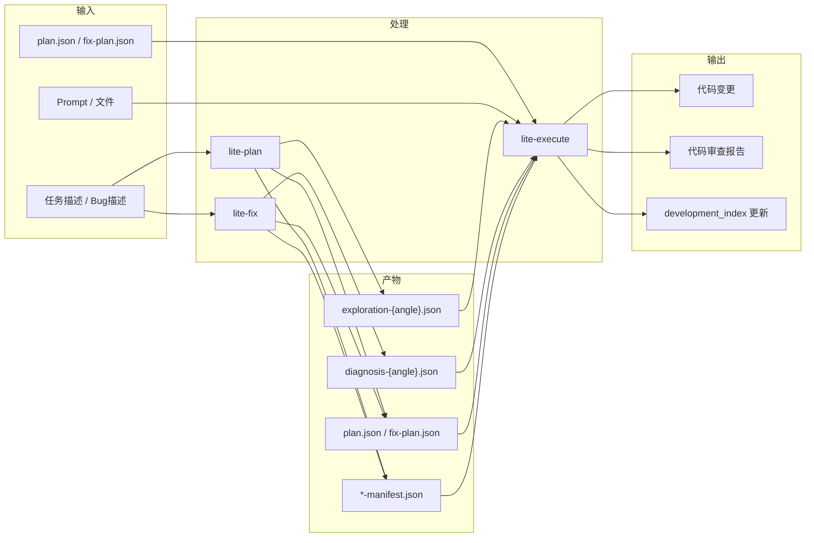
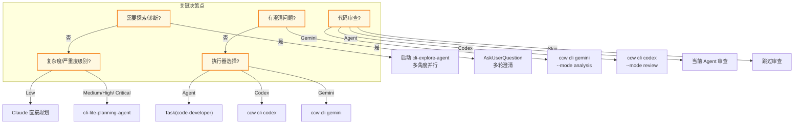
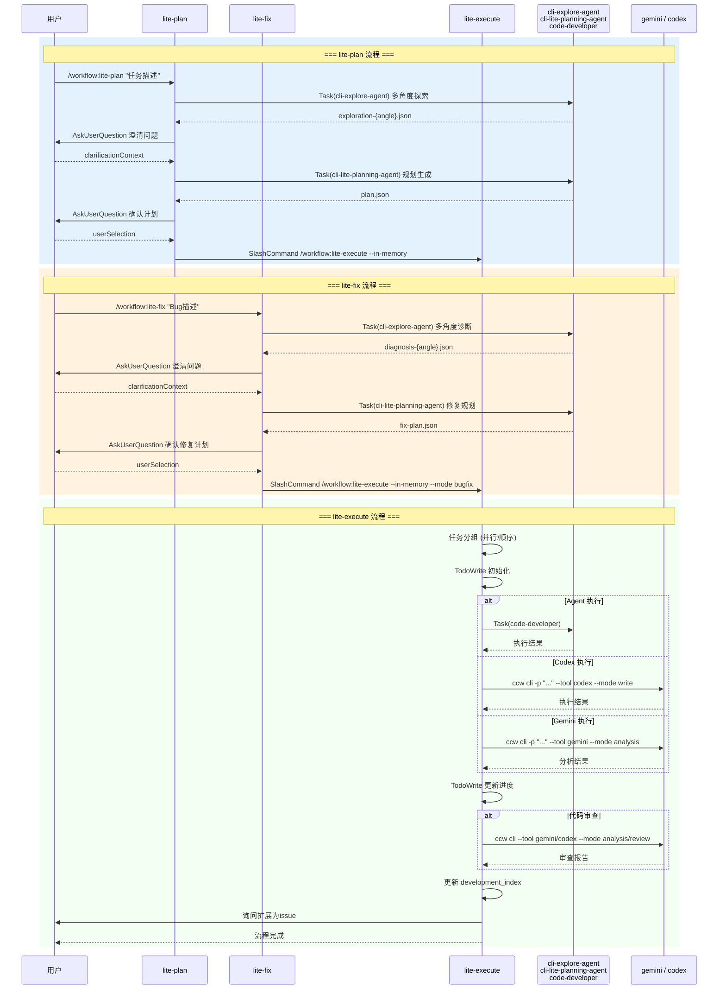
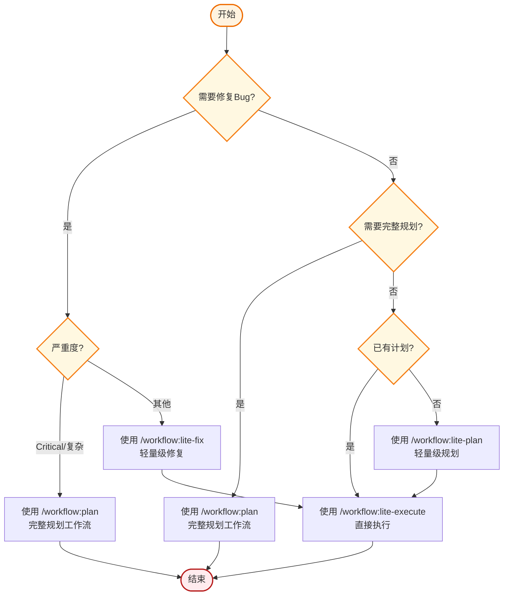

# Workflow 综合流程图: lite-plan + lite-execute + lite-fix

## 概述

| 属性           | 值                                                         |
| -------------- | ---------------------------------------------------------- |
| **类型**       | 综合 workflow 命令                                         |
| **命令数**     | 3                                                          |
| **总阶段数**   | 15 (5+6+5)                                                 |
| **Agent 类型** | cli-explore-agent, cli-lite-planning-agent, code-developer |
| **CLI 工具**   | gemini, codex, qwen                                        |

---

## 完整执行流程大图

```mermaid
flowchart TB
    %% ==================== 样式定义 ====================
    classDef user fill:#e3f2fd,stroke:#1565c0,stroke-width:2px
    classDef entry fill:#fff3e0,stroke:#ef6c00,stroke-width:2px
    classDef phase fill:#f3e5f5,stroke:#6a1b9a,stroke-width:2px
    classDef decision fill:#fff8e1,stroke:#f57f17,stroke-width:2px,shape:diamond
    classDef agent fill:#e8f5e9,stroke:#2e7d32,stroke-width:2px
    classDef cli fill:#fce4ec,stroke:#c2185b,stroke-width:2px
    classDef data fill:#e0f7fa,stroke:#00838f,stroke-width:2px
    classDef endNode fill:#ffebee,stroke:#b71c1c,stroke-width:2px
    classDef subflow fill:#f5f5f5,stroke:#616161,stroke-width:2px,stroke-dasharray: 5 5

    %% ==================== 用户入口层 ====================
    subgraph USER["👤 用户入口层"]
        direction TB
        START1(["🚀 /workflow:lite-plan<br/>任务规划"]):::entry
        START2(["🚀 /workflow:lite-execute<br/>任务执行"]):::entry
        START3(["🚀 /workflow:lite-fix<br/>Bug修复"]):::entry
    end

    %% ==================== LITE-PLAN 流程 ====================
    subgraph LITE_PLAN["📋 lite-plan: 轻量级任务规划"]
        direction TB

        subgraph LP_PHASE1["Phase 1: 任务分析与探索"]
            LP_P1_1["解析输入<br/>检测复杂度"]:::phase
            LP_P1_DEC1{"需要探索?"}:::decision
            LP_P1_2["启动 cli-explore-agent<br/>多角度并行探索<br/>(1-4个角度)"]:::agent
            LP_P1_3["生成 exploration-{angle}.json<br/>explorations-manifest.json"]:::data
        end

        subgraph LP_PHASE2["Phase 2: 澄清问题 (可选)"]
            LP_P2_1["聚合 clarification_needs"]:::phase
            LP_P2_DEC1{"有澄清问题?"}:::decision
            LP_P2_2["AskUserQuestion<br/>多轮澄清"]:::user
            LP_P2_3["生成 clarificationContext"]:::data
        end

        subgraph LP_PHASE3["Phase 3: 规划生成"]
            LP_P3_DEC1{"复杂度?"}:::decision
            LP_P3_1["Claude 直接规划<br/>(Low复杂度)"]:::phase
            LP_P3_2["cli-lite-planning-agent<br/>(Medium/High复杂度)"]:::agent
            LP_P3_3["生成 plan.json"]:::data
        end

        subgraph LP_PHASE4["Phase 4: 确认与选择"]
            LP_P4_1["显示计划摘要"]:::phase
            LP_P4_2["AskUserQuestion<br/>确认/执行方式/代码审查"]:::user
            LP_P4_3["生成 userSelection"]:::data
        end

        subgraph LP_PHASE5["Phase 5: 执行移交"]
            LP_P5_1["构建 executionContext"]:::phase
            LP_P5_2["调用 /workflow:lite-execute --in-memory"]:::subflow
        end
    end

    %% ==================== LITE-EXECUTE 流程 ====================
    subgraph LITE_EXECUTE["⚡ lite-execute: 任务执行引擎"]
        direction TB

        subgraph LE_INPUT["输入模式检测"]
            LE_IN_DEC{"输入模式?"}:::decision
            LE_IN_1["--in-memory 模式<br/>(来自lite-plan/fix)"]:::data
            LE_IN_2["Prompt 描述模式"]:::user
            LE_IN_3["文件路径模式<br/>(检测plan.json格式)"]:::data
        end

        subgraph LE_STEP1["Step 1: 初始化"]
            LE_S1_1["初始化 previousExecutionResults"]:::phase
            LE_S1_2["显示执行策略"]:::phase
        end

        subgraph LE_STEP2["Step 2: 任务分组"]
            LE_S2_1["提取显式 depends_on"]:::phase
            LE_S2_2["创建执行批次<br/>独立任务→并行批次<br/>依赖任务→顺序批次"]:::phase
            LE_S2_3["TodoWrite 跟踪进度"]:::phase
        end

        subgraph LE_STEP3["Step 3: 启动执行"]
            LE_S3_DEC{"执行器?"}:::decision
            LE_S3_1["Task(code-developer)<br/>Agent执行"]:::agent
            LE_S3_2["ccw cli --tool codex<br/>Codex执行"]:::cli
            LE_S3_3["ccw cli --tool gemini<br/>Gemini分析"]:::cli
        end

        subgraph LE_STEP4["Step 4: 代码审查 (可选)"]
            LE_S4_DEC{"审查工具?"}:::decision
            LE_S4_1["Gemini Review"]:::cli
            LE_S4_2["Codex Review<br/>--mode review"]:::cli
            LE_S4_3["Agent Review"]:::agent
            LE_S4_4["Skip"]:::phase
        end

        subgraph LE_STEP5["Step 5: 更新索引"]
            LE_S5_1["检测任务类别"]:::phase
            LE_S5_2["更新 development_index"]:::data
        end

        subgraph LE_STEP6["Step 6: 完成扩展"]
            LE_S6_1["询问是否扩展为issue"]:::user
        end
    end

    %% ==================== LITE-FIX 流程 ====================
    subgraph LITE_FIX["🔧 lite-fix: 轻量级Bug修复"]
        direction TB

        subgraph LF_PHASE1["Phase 1: Bug分析与诊断"]
            LF_P1_1["解析输入<br/>检测严重度<br/>(Low/Medium/High/Critical)"]:::phase
            LF_P1_DEC1{"Hotfix模式?"}:::decision
            LF_P1_DEC2{"需要诊断?"}:::decision
            LF_P1_2["启动 cli-explore-agent<br/>多角度并行诊断<br/>(1-4个角度)"]:::agent
            LF_P1_3["生成 diagnosis-{angle}.json<br/>diagnoses-manifest.json"]:::data
        end

        subgraph LF_PHASE2["Phase 2: 澄清问题 (可选)"]
            LF_P2_1["聚合 clarification_needs"]:::phase
            LF_P2_DEC1{"有澄清问题?"}:::decision
            LF_P2_2["AskUserQuestion<br/>多轮澄清"]:::user
            LF_P2_3["生成 clarificationContext"]:::data
        end

        subgraph LF_PHASE3["Phase 3: 修复规划"]
            LF_P3_DEC1{"严重度?"}:::decision
            LF_P3_1["Claude 直接规划<br/>(Low/Medium)"]:::phase
            LF_P3_2["cli-lite-planning-agent<br/>(High/Critical)"]:::agent
            LF_P3_3["生成 fix-plan.json"]:::data
        end

        subgraph LF_PHASE4["Phase 4: 确认与选择"]
            LF_P4_1["显示修复计划摘要"]:::phase
            LF_P4_2["AskUserQuestion<br/>确认/执行方式/代码审查"]:::user
            LF_P4_3["生成 userSelection"]:::data
        end

        subgraph LF_PHASE5["Phase 5: 执行移交"]
            LF_P5_1["构建 executionContext<br/>(mode=bugfix)"]:::phase
            LF_P5_2["调用 /workflow:lite-execute --in-memory --mode bugfix"]:::subflow
        end
    end

    %% ==================== 结束节点 ====================
    subgraph END["✅ 完成"]
        END_NODE(["流程完成"]):::endNode
    end

    %% ==================== 连接: LITE-PLAN ====================
    START1 --> LP_P1_1
    LP_P1_1 --> LP_P1_DEC1
    LP_P1_DEC1 -->|是| LP_P1_2
    LP_P1_DEC1 -->|否| LP_P2_1
    LP_P1_2 --> LP_P1_3
    LP_P1_3 --> LP_P2_1

    LP_P2_1 --> LP_P2_DEC1
    LP_P2_DEC1 -->|是| LP_P2_2
    LP_P2_DEC1 -->|否| LP_P3_DEC1
    LP_P2_2 --> LP_P2_3
    LP_P2_3 --> LP_P3_DEC1

    LP_P3_DEC1 -->|Low| LP_P3_1
    LP_P3_DEC1 -->|Medium/High| LP_P3_2
    LP_P3_1 --> LP_P3_3
    LP_P3_2 --> LP_P3_3
    LP_P3_3 --> LP_P4_1

    LP_P4_1 --> LP_P4_2
    LP_P4_2 --> LP_P4_3
    LP_P4_3 --> LP_P5_1
    LP_P5_1 --> LP_P5_2

    %% ==================== 连接: LITE-EXECUTE ====================
    START2 --> LE_IN_DEC
    LP_P5_2 --> LE_IN_1
    LF_P5_2 --> LE_IN_1

    LE_IN_DEC -->|--in-memory| LE_IN_1
    LE_IN_DEC -->|Prompt| LE_IN_2
    LE_IN_DEC -->|文件| LE_IN_3

    LE_IN_1 --> LE_S1_1
    LE_IN_2 --> LE_S1_1
    LE_IN_3 --> LE_S1_1

    LE_S1_1 --> LE_S1_2
    LE_S1_2 --> LE_S2_1
    LE_S2_1 --> LE_S2_2
    LE_S2_2 --> LE_S2_3
    LE_S2_3 --> LE_S3_DEC

    LE_S3_DEC -->|agent| LE_S3_1
    LE_S3_DEC -->|codex| LE_S3_2
    LE_S3_DEC -->|gemini| LE_S3_3

    LE_S3_1 --> LE_S4_DEC
    LE_S3_2 --> LE_S4_DEC
    LE_S3_3 --> LE_S4_DEC

    LE_S4_DEC -->|Gemini| LE_S4_1
    LE_S4_DEC -->|Codex| LE_S4_2
    LE_S4_DEC -->|Agent| LE_S4_3
    LE_S4_DEC -->|Skip| LE_S5_1

    LE_S4_1 --> LE_S5_1
    LE_S4_2 --> LE_S5_1
    LE_S4_3 --> LE_S5_1

    LE_S5_1 --> LE_S5_2
    LE_S5_2 --> LE_S6_1
    LE_S6_1 --> END_NODE

    %% ==================== 连接: LITE-FIX ====================
    START3 --> LF_P1_1
    LF_P1_1 --> LF_P1_DEC1
    LF_P1_DEC1 -->|是| LF_P3_DEC1
    LF_P1_DEC1 -->|否| LF_P1_DEC2
    LF_P1_DEC2 -->|是| LF_P1_2
    LF_P1_DEC2 -->|否| LF_P2_1
    LF_P1_2 --> LF_P1_3
    LF_P1_3 --> LF_P2_1

    LF_P2_1 --> LF_P2_DEC1
    LF_P2_DEC1 -->|是| LF_P2_2
    LF_P2_DEC1 -->|否| LF_P3_DEC1
    LF_P2_2 --> LF_P2_3
    LF_P2_3 --> LF_P3_DEC1

    LF_P3_DEC1 -->|Low/Medium| LF_P3_1
    LF_P3_DEC1 -->|High/Critical| LF_P3_2
    LF_P3_1 --> LF_P3_3
    LF_P3_2 --> LF_P3_3
    LF_P3_3 --> LF_P4_1

    LF_P4_1 --> LF_P4_2
    LF_P4_2 --> LF_P4_3
    LF_P4_3 --> LF_P5_1
    LF_P5_1 --> LF_P5_2

    %% ==================== 样式应用 ====================
    class START1,START2,START3 entry
    class END_NODE endNode
```



---

## 流程对比表

| 特性           | lite-plan                                  | lite-execute   | lite-fix                                   |
| -------------- | ------------------------------------------ | -------------- | ------------------------------------------ |
| **核心目的**   | 任务规划                                   | 任务执行       | Bug修复                                    |
| **输入**       | 任务描述                                   | Plan/描述/文件 | Bug描述                                    |
| **复杂度评估** | Low/Medium/High                            | -              | Low/Medium/High/Critical                   |
| **探索/诊断**  | 多角度探索 (exploration)                   | -              | 多角度诊断 (diagnosis)                     |
| **输出文件**   | plan.json                                  | -              | fix-plan.json                              |
| **Agent 调用** | cli-explore-agent, cli-lite-planning-agent | code-developer | cli-explore-agent, cli-lite-planning-agent |
| **CLI 调用**   | -                                          | codex, gemini  | -                                          |
| **移交目标**   | lite-execute                               | -              | lite-execute                               |

---

## 数据流图



---

## Agent 使用矩阵

| Agent                       | lite-plan  | lite-execute | lite-fix   | 用途          |
| --------------------------- | ---------- | ------------ | ---------- | ------------- |
| **cli-explore-agent**       | ✅ Phase 1 | -            | ✅ Phase 1 | 代码探索/诊断 |
| **cli-lite-planning-agent** | ✅ Phase 3 | -            | ✅ Phase 3 | 规划生成      |
| **code-developer**          | -          | ✅ Step 3    | -          | 代码实现      |

---

## CLI 工具使用矩阵

| CLI 工具   | lite-plan | lite-execute | lite-fix | 用途          |
| ---------- | --------- | ------------ | -------- | ------------- |
| **gemini** | -         | ✅ 执行/审查 | -        | 分析/执行     |
| **codex**  | -         | ✅ 执行/审查 | -        | 代码执行/审查 |
| **qwen**   | -         | ✅ 备选审查  | -        | 代码审查      |

---

## 文件结构对比

### lite-plan 输出

```
.workflow/.lite-plan/{task-slug}-{YYYY-MM-DD}/
├── exploration-{angle1}.json      # 探索结果
├── exploration-{angle2}.json
├── explorations-manifest.json     # 探索索引
└── plan.json                      # 实施计划
```

### lite-fix 输出

```
.workflow/.lite-fix/{bug-slug}-{YYYY-MM-DD}/
├── diagnosis-{angle1}.json        # 诊断结果
├── diagnosis-{angle2}.json
├── diagnoses-manifest.json        # 诊断索引
├── planning-context.md            # 证据+理解
└── fix-plan.json                  # 修复计划
```

---

## 关键决策点



---

## 执行时序图



---

## 使用场景决策树



---

_生成时间: 2026-02-01_
_命令版本: lite-plan, lite-execute, lite-fix_
