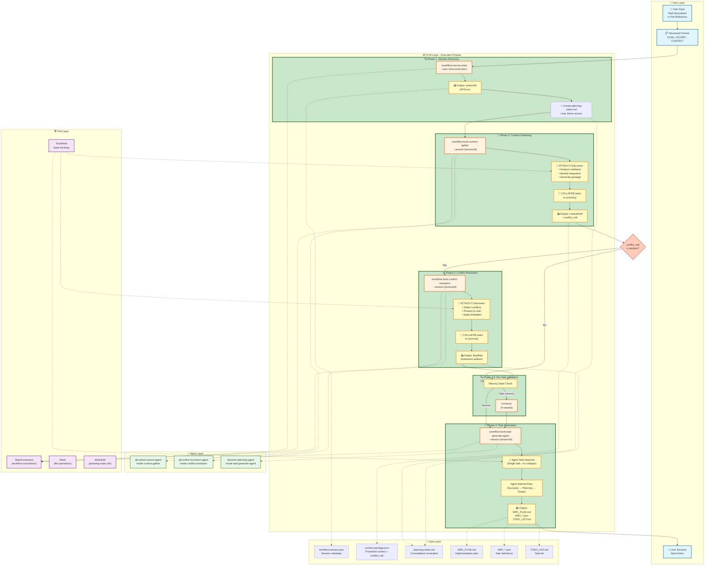
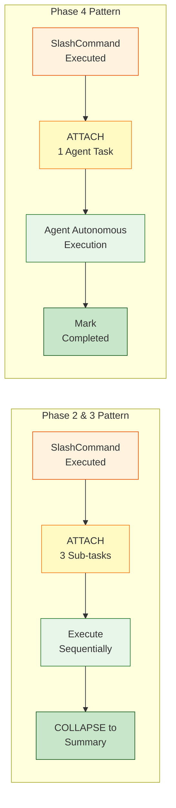
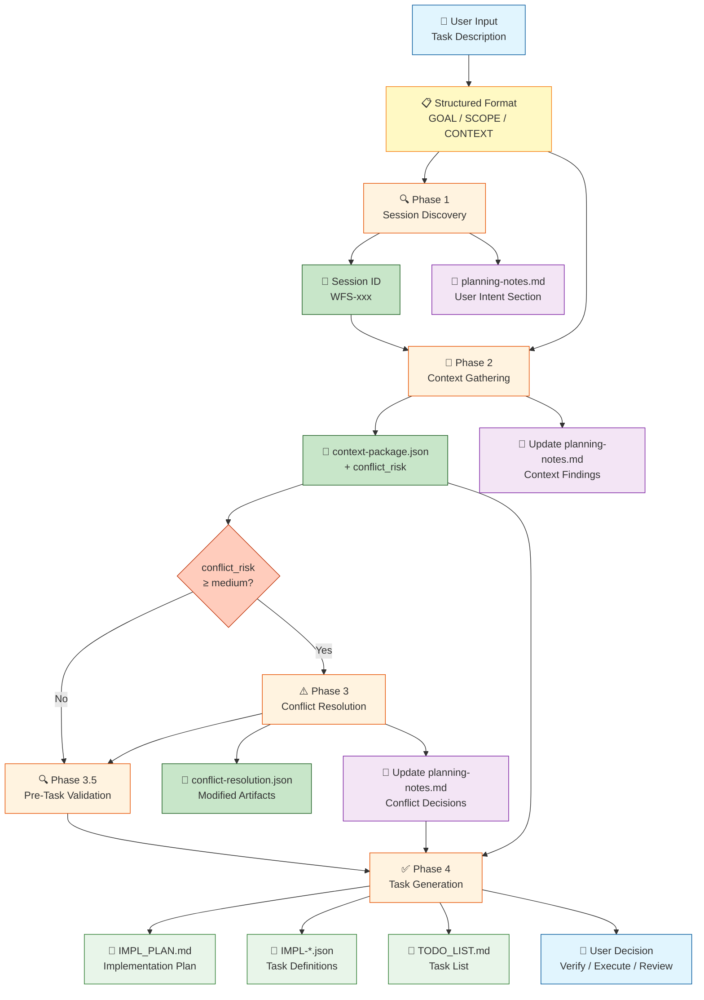

# Workflow Visualization: plan

## Overview
| Attribute | Value |
|-----------|-------|
| **Type** | command |
| **Phases** | 4 (5 with optional quality gate) |
| **Agents** | 2 (task-generate-agent, plus embedded agents in context-gather/conflict-resolution) |
| **Entry Point** | `/workflow:plan "[task description]"` |
| **Auto Mode** | `--yes` or `-y` to skip confirmations |

## Execution Flow



## Phase Details

| Phase | Description | Agent/Tool | Output |
|-------|-------------|------------|--------|
| **Phase 1** | Session Discovery | `/workflow:session:start` | sessionId (WFS-xxx) |
| **Phase 2** | Context Gathering | `/workflow:tools:context-gather` | context-package.json + conflict_risk |
| **Phase 3** | Conflict Resolution (Conditional) | `/workflow:tools:conflict-resolution` | Modified brainstorm artifacts |
| **Phase 3.5** | Pre-Task Validation (Optional) | `/compact` (if needed) | Memory optimization |
| **Phase 4** | Task Generation | `/workflow:tools:task-generate-agent` | IMPL_PLAN.md, task JSONs, TODO_LIST.md |

## Task Attachment Pattern



## Data Flow



## TodoWrite State Transitions

| Stage | Phase 1 | Phase 2 | Phase 3 | Phase 4 |
|-------|---------|---------|---------|---------|
| **Initial** | pending | pending | pending | pending |
| **After Phase 1** | completed | in_progress | pending | pending |
| **Phase 2 Attached** | completed | in_progress | - | pending |
| | | → Analyze (in_progress) | | |
| | | → Identify (pending) | | |
| | | → Generate (pending) | | |
| **Phase 2 Collapsed** | completed | completed | pending | pending |
| **After Phase 3 (if executed)** | completed | completed | completed | pending |
| **Phase 4 Attached** | completed | completed | completed* | in_progress |
| **Final** | completed | completed | completed* | completed |

*Phase 3 only appears if conflict_risk ≥ medium

## Agent Hierarchy

```
/workflow:plan (Orchestrator)
├── /workflow:session:start
│   └── (internal session management)
├── /workflow:tools:context-gather
│   └── @context-search-agent
│       ├── Analyze codebase structure
│       ├── Identify integration points
│       └── Generate context package
├── /workflow:tools:conflict-resolution (conditional)
│   └── @conflict-resolution-agent
│       ├── Detect conflicts with CLI analysis
│       ├── Present conflicts to user
│       └── Apply resolution strategies
└── /workflow:tools:task-generate-agent
    └── @action-planning-agent
        ├── Discovery phase
        ├── Planning phase
        └── Output generation
            ├── IMPL_PLAN.md
            ├── IMPL-*.json files
        └── TODO_LIST.md
```

## Related Commands

### Prerequisite Commands
- `/workflow:brainstorm:artifacts` - Optional: Generate role-based analyses before planning
- `/workflow:brainstorm:synthesis` - Optional: Refine brainstorm analyses with clarifications

### Called by This Command
| Command | Phase | Purpose |
|---------|-------|---------|
| `/workflow:session:start` | 1 | Create or discover workflow session |
| `/workflow:tools:context-gather` | 2 | Gather project context and analyze codebase |
| `/workflow:tools:conflict-resolution` | 3 | Detect and resolve conflicts (auto-triggered) |
| `/compact` | 3.5 | Memory optimization (if context approaching limits) |
| `/workflow:tools:task-generate-agent` | 4 | Generate task JSON files with agent-driven approach |

### Follow-up Commands
- `/workflow:plan-verify` - Recommended: Verify plan quality before execution
- `/workflow:status` - Review task breakdown and current progress
- `/workflow:execute` - Begin implementation of generated tasks
