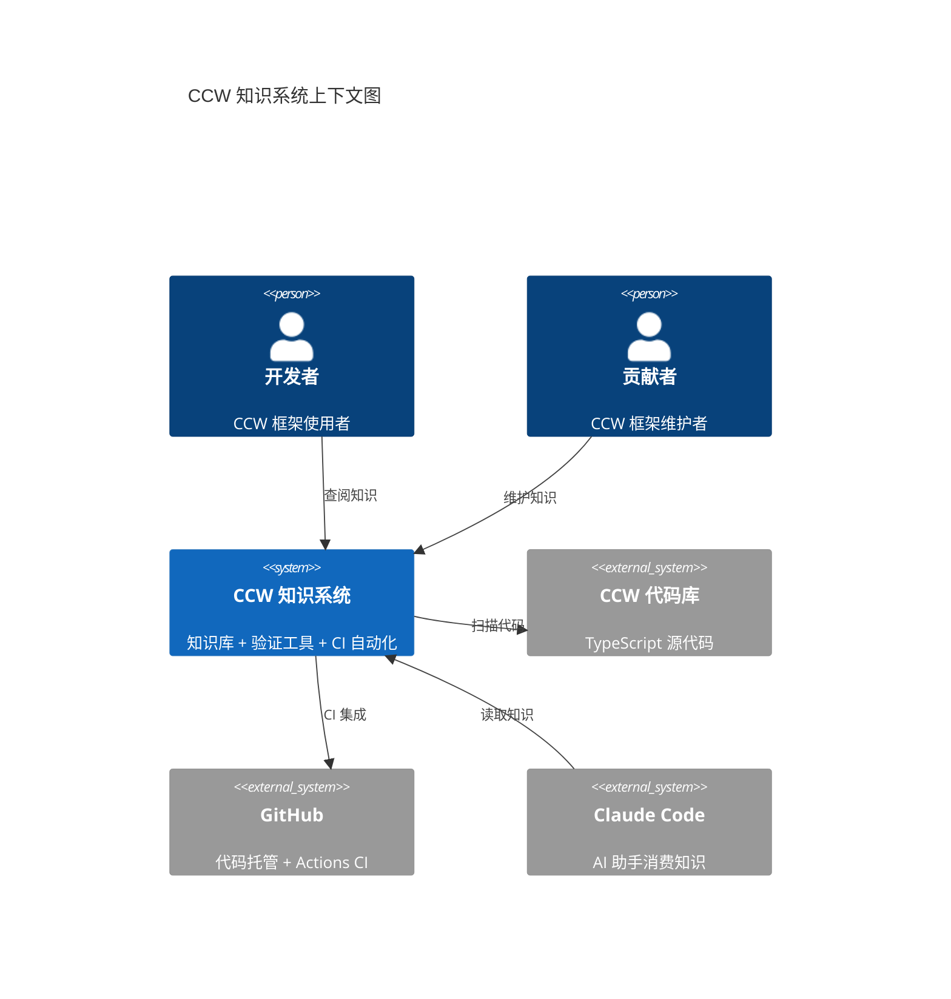
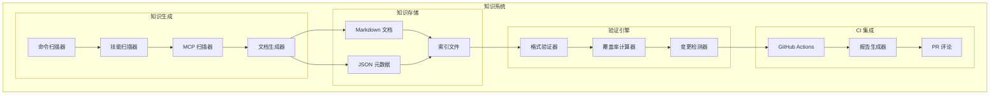
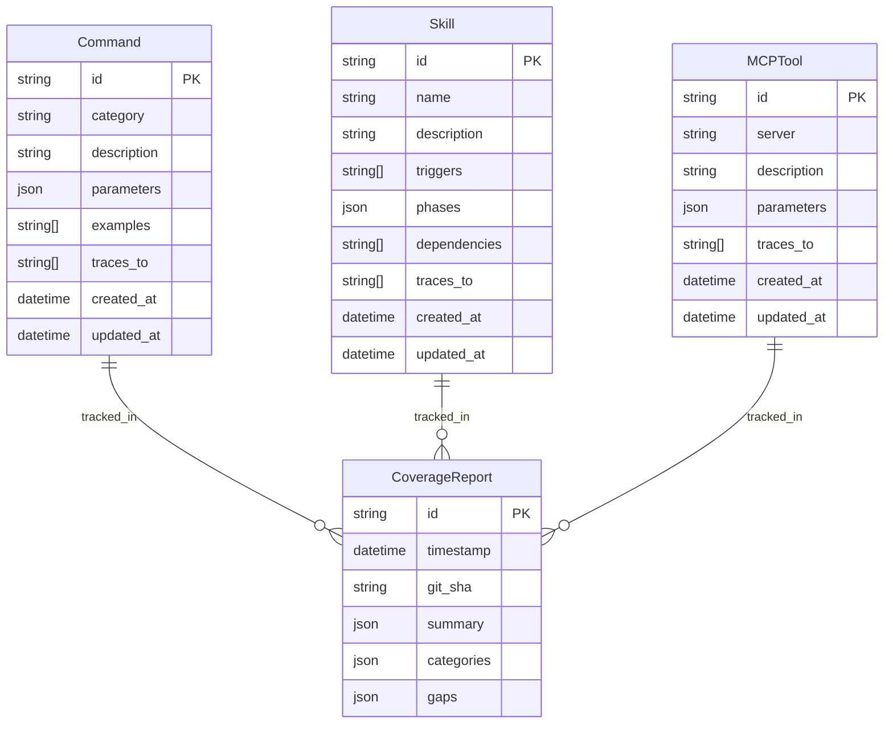

# Architecture: CCW 知识系统

本架构文档定义了 Claude-Code-Workflow 知识系统的技术架构，包括知识库结构、验证工具设计和 CI 自动化流程。

## System Overview

### Architecture Style

**混合架构**: 知识库采用静态文件系统 + 元数据索引，验证工具采用 CLI 脚本 + GitHub Actions 集成。

```
┌─────────────────────────────────────────────────────────────────┐
│                    CCW 知识系统架构                               │
├─────────────────────────────────────────────────────────────────┤
│                                                                 │
│  ┌─────────────┐     ┌─────────────┐     ┌─────────────┐       │
│  │  知识生成层  │────▶│  知识存储层  │────▶│  验证层     │       │
│  │             │     │             │     │             │       │
│  │ - 代码扫描   │     │ - Markdown  │     │ - 格式验证  │       │
│  │ - 元数据提取 │     │ - JSON 元数据│     │ - 覆盖率检测│       │
│  │ - 文档生成   │     │ - 索引文件   │     │ - CI 集成   │       │
│  └─────────────┘     └─────────────┘     └─────────────┘       │
│         │                   │                   │               │
│         └───────────────────┴───────────────────┘               │
│                           │                                     │
│                    ┌──────▼──────┐                             │
│                    │   报告层    │                             │
│                    │             │                             │
│                    │ - JSON 报告 │                             │
│                    │ - MD 摘要   │                             │
│                    │ - PR 评论   │                             │
│                    └─────────────┘                             │
│                                                                 │
└─────────────────────────────────────────────────────────────────┘
```

### System Context Diagram



## Component Architecture

### Component Diagram



### Component Descriptions

| Component | Responsibility | Technology | Dependencies |
|-----------|---------------|------------|--------------|
| 命令扫描器 | 扫描 ccw/src/commands/ 提取命令元数据 | TypeScript | glob, ts-morph |
| 技能扫描器 | 扫描 .claude/skills/ 提取技能定义 | TypeScript | glob, yaml-parser |
| MCP 扫描器 | 扫描 ccw/src/core/routes/ 提取工具定义 | TypeScript | glob |
| 文档生成器 | 根据模板生成 Markdown 文档 | TypeScript | mustache |
| 格式验证器 | 验证 YAML frontmatter 和内容完整性 | TypeScript | ajv, gray-matter |
| 覆盖率计算器 | 计算知识库覆盖率百分比 | TypeScript | - |
| 变更检测器 | 基于 Git diff 检测新增项 | TypeScript | simple-git |
| GitHub Actions | CI 工作流编排 | YAML | actions/checkout |
| 报告生成器 | 生成 JSON 和 Markdown 报告 | TypeScript | - |

## Technology Stack

### Core Technologies

| Layer | Technology | Version | Rationale |
|-------|-----------|---------|-----------|
| 运行时 | Node.js | 18+ | 与 CCW 主项目一致 |
| 语言 | TypeScript | 5.x | 类型安全，与 CCW 一致 |
| 文档格式 | Markdown | - | 人类可读，AI 友好 |
| 元数据格式 | JSON/YAML | - | 机器可解析 |
| CI 平台 | GitHub Actions | - | 与 CCW 托管平台一致 |

### Key Libraries & Frameworks

| Library | Purpose | License |
|---------|---------|---------|
| glob | 文件模式匹配 | ISC |
| gray-matter | YAML frontmatter 解析 | MIT |
| ajv | JSON Schema 验证 | MIT |
| simple-git | Git 操作 | MIT |
| mustache | 模板引擎 | MIT |
| chalk | 终端颜色输出 | MIT |
| commander | CLI 参数解析 | MIT |

## Architecture Decision Records

| ADR | Title | Status | Key Choice |
|-----|-------|--------|------------|
| [ADR-001](ADR-001-knowledge-format.md) | 知识库格式选择 | Accepted | Markdown + JSON 元数据 |
| [ADR-002](ADR-002-coverage-detection.md) | 覆盖率检测方案 | Accepted | 文件扫描 + 元数据比对 |
| [ADR-003](ADR-003-ci-strategy.md) | CI 触发策略 | Accepted | PR + 每日 schedule |
| [ADR-004](ADR-004-script-language.md) | 脚本语言选择 | Accepted | TypeScript（与主项目一致） |

## Data Architecture

### Data Model



### Data Storage Strategy

| Data Type | Storage | Retention | Backup |
|-----------|---------|-----------|--------|
| 知识文档 | Git 仓库 (Markdown) | 永久 | Git 历史 |
| 元数据索引 | Git 仓库 (JSON) | 永久 | Git 历史 |
| 覆盖率报告 | CI Artifacts + Git | 30 天 | CI 缓存 |

## API Design

### CLI API

| Command | Purpose | Output |
|---------|---------|--------|
| `npm run coverage:check` | 执行覆盖率检测 | JSON 报告 |
| `npm run coverage:report` | 生成覆盖率摘要 | Markdown |
| `npm run knowledge:validate` | 验证知识文档格式 | 验证结果 |
| `npm run knowledge:sync` | 同步知识库与代码 | 更新的文档 |

### GitHub Actions Outputs

| Output | Type | Purpose |
|--------|------|---------|
| coverage-percentage | number | 覆盖率百分比 |
| coverage-report | artifact | 完整 JSON 报告 |
| gaps-list | string | 遗漏项列表 |

## Security Architecture

### Security Controls

| Control | Implementation | Requirement |
|---------|---------------|-------------|
| 代码扫描安全 | 只读访问代码库 | 最小权限原则 |
| CI 安全 | GitHub Actions 内置隔离 | 平台保障 |
| 报告安全 | 不包含敏感信息 | 数据分类 |

## Infrastructure & Deployment

### Deployment Architecture

**静态部署**: 知识库作为 Git 仓库的一部分，无需额外部署基础设施。

```
┌─────────────────┐
│  开发者本地      │
│  npm run sync   │
└────────┬────────┘
         │ git push
         ▼
┌─────────────────┐     ┌─────────────────┐
│   GitHub Repo   │────▶│  GitHub Actions │
│                 │     │  (自动触发)      │
└─────────────────┘     └─────────────────┘
         │                      │
         │                      ▼
         │              ┌─────────────────┐
         │              │  覆盖率报告      │
         │              │  PR 评论        │
         │              └─────────────────┘
         │
         ▼
┌─────────────────┐
│  知识库消费      │
│  (Claude Code)  │
└─────────────────┘
```

### Environment Strategy

| Environment | Purpose | Configuration |
|-------------|---------|---------------|
| Development | 本地开发测试 | `npm run dev` |
| CI | 自动验证 | GitHub Actions |
| Production | 知识库消费 | Git main 分支 |

## Quality Attributes

| Attribute | Target | Measurement | ADR Reference |
|-----------|--------|-------------|---------------|
| 覆盖率 | 100% | 覆盖率脚本计算 | [ADR-002](ADR-002-coverage-detection.md) |
| 检测延迟 | ≤5 分钟 | CI 执行时间 | [ADR-003](ADR-003-ci-strategy.md) |
| 准确性 | 0% 误报 | 人工审核验证 | [ADR-002](ADR-002-coverage-detection.md) |
| 性能 | ≤60 秒扫描 | 本地执行时间 | - |

## Risks & Mitigations

| Risk | Impact | Probability | Mitigation |
|------|--------|-------------|------------|
| 代码重构导致知识过时 | High | Medium | CI 自动检测 + PR 门禁 |
| 新增命令遗漏文档 | Medium | Medium | 变更检测器 + 报告提醒 |
| CI 执行时间过长 | Low | Low | 增量检测 + 并行执行 |
| 知识库体积过大 | Low | Low | 按需生成 + 索引优化 |

## References

- [Product Brief](../product-brief.md)
- [Requirements](../requirements/_index.md)
- [CCW 代码库](../../../)
