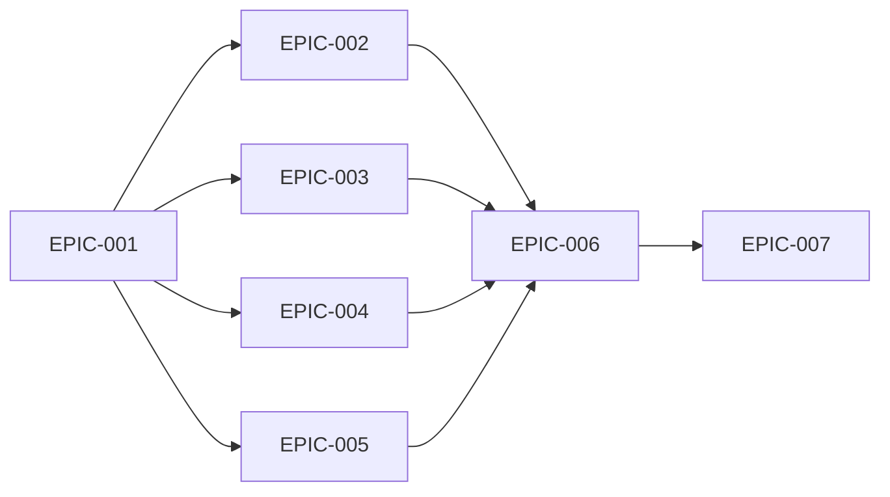

# Epics & Stories: CCW Knowledge System

## Epic Overview

| Epic | Title | Priority | MVP | Size |
|------|-------|----------|-----|------|
| [EPIC-001](EPIC-001-architecture-doc.md) | Architecture Documentation | Must | ✅ | M |
| [EPIC-002](EPIC-002-commands-doc.md) | Commands Documentation | Must | ✅ | L |
| [EPIC-003](EPIC-003-skills-doc.md) | Skills Documentation | Must | ✅ | L |
| [EPIC-004](EPIC-004-agents-doc.md) | Agents Documentation | Must | ✅ | M |
| [EPIC-005](EPIC-005-mcp-cli-doc.md) | MCP & CLI Documentation | Must | ✅ | M |
| [EPIC-006](EPIC-006-coverage-verification.md) | Coverage Verification System | Must | ✅ | L |
| [EPIC-007](EPIC-007-ci-integration.md) | CI Integration | Must | ✅ | M |

## Dependency Graph

## Execution Order

1. **EPIC-001**: Architecture Documentation (无依赖)
2. **EPIC-002..005**: Documentation (并行，依赖 EPIC-001)
3. **EPIC-006**: Coverage Verification (依赖 EPIC-002..005)
4. **EPIC-007**: CI Integration (依赖 EPIC-006)

## MVP Definition

**MVP Scope**: EPIC-001 ~ EPIC-007 (全部)

**Definition of Done**:
1. 所有 27 Skills 有文档
2. 所有 48 Commands 有文档
3. 所有 21 Agents 有文档
4. 覆盖率脚本通过
5. CI 门禁生效
6. 覆盖率 = 100%

**Deferred Post-MVP**:
- 交互式学习路径
- 搜索索引
- 多语言支持

## Traceability Matrix

| Requirement | Epic |
|-------------|------|
| REQ-001 | EPIC-001 |
| REQ-002 | EPIC-002 |
| REQ-003 | EPIC-003 |
| REQ-004 | EPIC-004 |
| REQ-005, REQ-006, REQ-007 | EPIC-005 |
| REQ-008, REQ-010, REQ-011 | EPIC-006 |
| REQ-009 | EPIC-007 |
| REQ-012, REQ-013, REQ-014 | Post-MVP |

---

*Generated by writer @ TLS-ccw-deep-learn-2025-02-15*
