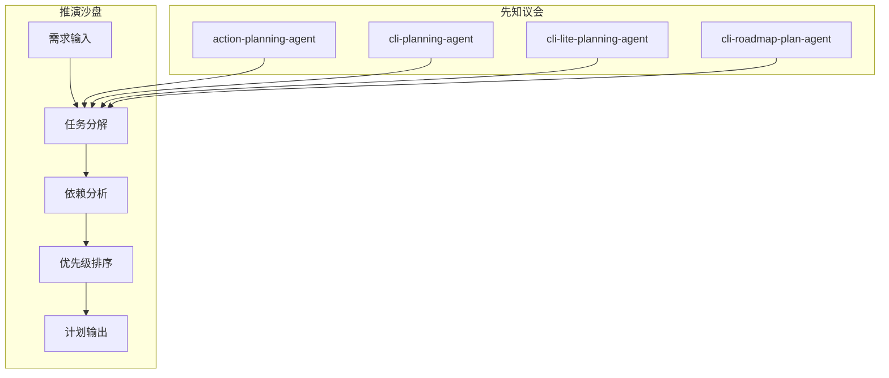
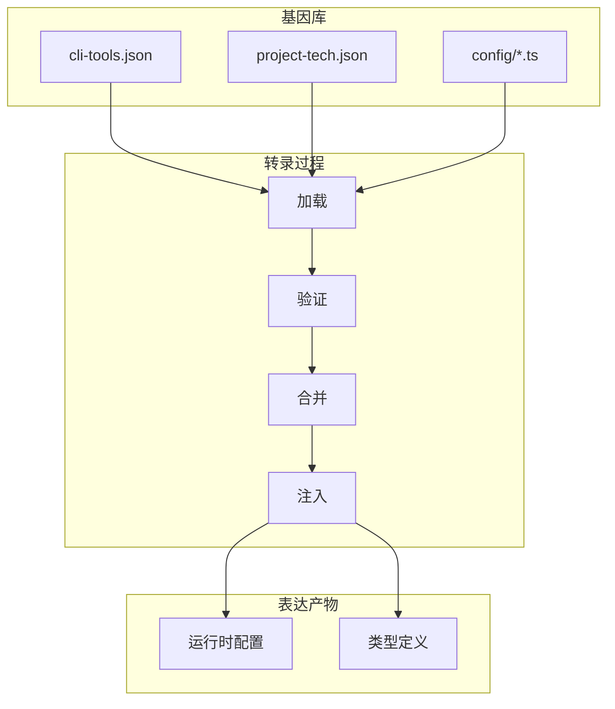
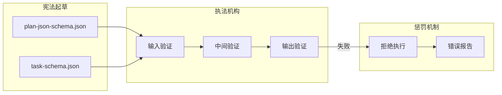

# CCW 架构级深度研习 - 主大纲

> **目标读者**: 架构师 + 核心贡献者
> **深度设定**: 不解释基础语法，直指"深水区"
> **组织方式**: 生命周期流 (Flow-centric) + 原子资产库 (Asset-based) 深度解耦
> **版本追踪**: Git Hash 快照 + MEU 漂移检测

---

## 序幕：OOM 幽灵的初现

> *时间: 2025-02-17 03:47:12 UTC*
> *地点: 生产环境 — ccw-session-0af3c2*

```log
[03:47:12.003] CRITICAL ━━━━━━━━━━━━━━━━━━━━━━━━━━━━━━━━━━━━━━━━
[03:47:12.004] ! Memory allocation failed: 98.7% usage (15.8GB / 16GB)
[03:47:12.005] ! CLI Session Manager: subprocess SIGKILL (exit 137)
[03:47:12.006] ! SQLite: Database locked — 17 transactions rolled back
[03:47:12.007] ━━━━━━━━━━━━━━━━━━━━━━━━━━━━━━━━━━━━━━━━━━━━━━━━
```

**凌晨三点的告警**，划破了值班工程师的睡眠。

这不是一次普通的崩溃。它是一个**幽灵** — 一个在 TypeScript 与 Python 边界游荡的内存泄漏怪兽。它从不白天出现，只在系统运行 72 小时后、负载达到特定阈值时，悄然吞噬一切。

**这不是一个 Bug 的故事。**

**这是一场持续 24 章的"破案"。**

从 `/ccw` 命令的第一个字符被敲下，到 SQLite 事务的最后一条记录被写入，我们将追踪这个幽灵的每一个脚印。你将看到：

- **Part I-II**：入口处的蛛丝马迹
- **Part IV.5**：边境口岸的"外交丑闻"
- **Part VI**：向量索引器的"记忆黑洞"
- **Part VII**：存储层的"未竟之事"
- **Part XI**：每个涉案资产的完整审讯记录

```markdown
**调查进度**: ░░░░░░░░░░ 0%
**幽灵位置**: 未知
**涉案资产**: 950+
```

> *"在这座代码城市中，没有人是无辜的。每个文件都藏着秘密，每个函数都可能是凶手。"*
>
> — 匿名架构师

---

## 设计哲学

### 苏格拉底式学习

在每个关键节点设置"架构盲点"提问，**在看代码前先进行方案设计**：

> ❓ **架构盲点**: 如果让你设计这个系统，你会怎么做？

### 生命周期流主线

```
用户输入 → 命令解析 → 路由分发 → Skill 编排 → Agent 执行 → 工具调用 → 状态持久化
   │           │           │           │           │           │           │
   ▼           ▼           ▼           ▼           ▼           ▼           ▼
  入口层      调度层      传输层      编排层      执行层      集成层      存储层
```

---

## Part I: 入口层 - 用户交互的起点

### Chapter 1: Slash Command 触发链路

**生命周期阶段**: 用户输入 → 命令识别

> ❓ **架构盲点 1.1**: Claude Code 如何识别 `/ccw` 这样的命令？是硬编码还是配置驱动？

**涉及资产**:
- `.claude/commands/ccw.md` - 主入口命令
- `.claude/commands/ccw-*.md` - 协调器命令族

**关键问题**:
1. 命令的 `description` 字段如何影响意图分析？
2. 命令参数如何传递到 Skill？
3. `-c` / `-y` 等选项的解析逻辑在哪里？

**深入路径**:
```
.cclaude/commands/ccw.md (命令定义)
    ↓
.claude/skills/ccw/SKILL.md (技能编排)
    ↓
ccw/src/commands/cli.ts (CLI 命令实现)
```

### Chapter 2: CLI 入口点

**生命周期阶段**: 命令行参数解析

> ❓ **架构盲点 2.1**: `ccw cli -p "..." --tool gemini` 的完整解析流程是什么？

**涉及资产**:
- `ccw/src/commands/cli.ts` - CLI 命令入口
- `ccw/src/tools/cli-executor-core.ts` - 执行核心 (60KB)
- `ccw/src/tools/cli-prompt-builder.ts` - 提示构建器

**关键问题**:
1. `--tool` 参数如何映射到具体 CLI 工具？
2. `--mode analysis|write` 的权限边界在哪里实现？
3. 会话恢复 (`--resume`) 如何工作？

---

## Part II: 调度层 - 意图分析与工作流选择

### Chapter 3: 意图分析引擎

**生命周期阶段**: 任务意图 → 工作流级别选择

> ❓ **架构盲点 3.1**: CCW 如何判断一个任务应该用 Level 1 (lite-lite-lite) 还是 Level 4 (brainstorm)?

**涉及资产**:
- `.claude/skills/ccw/SKILL.md` - 意图分析逻辑
- `.ccw/workflows/cli-templates/schemas/*.json` - 输出结构定义

**关键问题**:
1. 意图分析的 prompt 模板在哪里？
2. 4 级工作流的判断标准是什么？
3. 如何处理边界情况（意图模糊）？

### Chapter 4: 工作流级别映射

**生命周期阶段**: 工作流级别 → 具体执行链路

| 级别 | 名称 | 触发条件 | 执行链路 |
|------|------|----------|----------|
| 1 | lite-lite-lite | 单文件、配置修改 | 单步执行 |
| 2 | lite-plan/lite-fix | 单模块功能 | plan → execute |
| 3 | plan/tdd-plan | 多模块、TDD | plan → verify → execute → review |
| 4 | brainstorm:auto-parallel | 架构设计 | brainstorm → plan → execute |

> ❓ **架构盲点 4.1**: 如果 Level 判断错误，系统如何恢复？

---

## Part III: 传输层 - Express 路由与 API

### Chapter 5: Express 路由架构

**生命周期阶段**: HTTP 请求 → 路由匹配 → 处理器调用

> ❓ **架构盲点 5.1**: 36 个路由文件如何组织？是否按功能域划分？

**涉及资产**:
- `ccw/src/core/routes/*.ts` - 36 个路由文件
- `ccw/src/core/services/*.ts` - 10 个核心服务

**关键路由分析**:
1. `cli-routes.ts` - CLI 执行 API
2. `session-routes.ts` - 会话管理 API
3. `skills-routes.ts` - 技能调用 API
4. `mcp-routes.ts` - MCP 协议 API

### Chapter 6: 会话管理服务

**生命周期阶段**: 会话创建 → 状态追踪 → 持久化

> ❓ **架构盲点 6.1**: SQLite 会话表结构是怎样的？如何支持会话恢复？

**涉及资产**:
- `ccw/src/core/services/cli-session-manager.ts` - 会话管理器
- `ccw/src/tools/session-manager.ts` - 会话工具 (33KB)
- `ccw/src/tools/native-session-discovery.ts` - 会话发现

**关键问题**:
1. 会话的完整生命周期是什么？
2. 会话中断后如何恢复？
3. 多 CLI 会话如何并发？

---

## Part III.5: 类型系统与 Schema 定义

> **架构意义**: 类型定义是系统契约的基础，JSON Schema 是跨语言通信的保障。

### Chapter 6.5: TypeScript 类型定义

**生命周期阶段**: 类型声明 → 编译时检查 → 运行时验证

> ❓ **架构盲点 6.5.1**: 类型定义如何与 JSON Schema 保持同步？是否有自动生成机制？

**涉及资产**:
- `ccw/src/types/tool.ts` - 工具类型定义
- `ccw/src/types/session.ts` - 会话类型定义
- `ccw/src/types/config.ts` - 配置类型定义
- `ccw/src/types/loop.ts` - 循环类型定义
- `ccw/src/types/skill-types.ts` - 技能类型定义
- `ccw/src/types/cli-settings.ts` - CLI 设置类型
- `ccw/src/types/litellm-api-config.ts` - LiteLLM API 配置
- `ccw/src/types/index.ts` - 类型入口

**核心类型结构**:

```typescript
// 工具定义
interface Tool {
  name: string;
  description: string;
  input_schema: JSONSchema;
  output_schema?: JSONSchema;
}

// 会话状态
interface SessionState {
  id: string;
  status: 'pending' | 'in_progress' | 'completed' | 'failed';
  context: Record<string, unknown>;
  created_at: Date;
  updated_at: Date;
}

// 技能定义
interface Skill {
  name: string;
  description: string;
  phases: Phase[];
  allowed_tools?: string[];
}
```

**关键问题**:
1. 类型定义与运行时验证如何协同？
2. 如何处理跨语言类型转换？
3. 类型定义的版本兼容性如何保证？

### Chapter 6.6: JSON Schema 规范

**生命周期阶段**: Schema 定义 → 验证 → 文档生成

> ❓ **架构盲点 6.6.1**: Schema 验证在哪个层级执行？是入口验证还是逐层传递？

**涉及资产**:
- `.ccw/workflows/cli-templates/schemas/plan-json-schema.json` - 计划结构定义
- `.ccw/workflows/cli-templates/schemas/task-schema.json` - 任务结构定义
- `.ccw/workflows/cli-templates/schemas/debug-log-json-schema.json` - 调试日志结构
- `.ccw/workflows/cli-templates/schemas/discovery-state-schema.json` - 发现阶段状态
- `.ccw/workflows/cli-templates/schemas/queue-schema.json` - 队列结构
- 其他 ~15 个 Schema 文件

**Schema 层次结构**:

```
plan-json-schema.json
├── task-schema.json (嵌套)
│   ├── step-schema.json
│   └── dependency-schema.json
├── context-schema.json
└── output-schema.json
```

**验证策略**:
1. 入口验证：请求参数必须符合 Schema
2. 中间验证：阶段间传递的数据必须符合 Schema
3. 输出验证：最终输出必须符合 Schema

---

## Part IV: 编排层 - Skill 阶段机

### Chapter 7: Skill 定义语言

**生命周期阶段**: Skill 加载 → 阶段解析 → 顺序执行

> ❓ **架构盲点 7.1**: Skill 的 `phases` 字段如何被解析？是 DSL 还是配置？

**涉及资产**:
- `.claude/skills/*/SKILL.md` - 27 个技能定义
- `ccw/src/tools/skill-context-loader.ts` - 上下文加载器

**关键问题**:
1. Skill 与 Command 的边界在哪里？
2. Skill 的阶段如何与 Agent 映射？
3. 阶段间状态如何传递？

### Chapter 8: 核心技能深度解析

**重点技能**:

| 技能 | 用途 | 阶段数 | 复杂度 |
|------|------|--------|--------|
| `workflow-plan` | 4 阶段规划 | 4 | 高 |
| `brainstorm` | 多角色头脑风暴 | 5+ | 高 |
| `issue-resolve` | Issue 解决管道 | 4 | 中 |
| `workflow-tdd` | TDD 工作流 | 6 | 高 |

---

## Part IV.5: 跨语言桥接专题 - TS ↔ Python 边界

> **架构意义**: CCW 的核心资产分布在 TypeScript (CCW CLI) 和 Python (CodexLens/LiteLLM) 中。跨语言桥接是系统最容易崩溃的边缘情况。

### Chapter 10.5: child_process 调用机制

**生命周期阶段**: 进程创建 → 参数序列化 → IPC 通信 → 结果收集

> ❓ **架构盲点 10.5.1**: TS 调用 Python 时的 `child_process.spawn` 参数如何构建？环境变量如何传递？

**涉及资产**:
- `ccw/src/tools/cli-executor-core.ts` - CLI 执行核心
- `codex-lens/src/codexlens/cli/` - Python CLI 入口
- `ccw/src/utils/python-utils.ts` - Python 工具函数

**关键问题**:
1. Python 虚拟环境如何发现和激活？
2. 大型参数（如完整文件内容）如何传递？
3. 进程超时和强制终止如何处理？

**边缘情况**:
- Python 进程假死
- 编码不一致（UTF-8 vs GBK）
- 环境变量污染

### Chapter 10.6: JSON-RPC 序列化边界

**生命周期阶段**: 对象序列化 → 传输 → 反序列化 → 类型恢复

> ❓ **架构盲点 10.6.1**: JSON 序列化时的类型信息丢失如何处理？例如 Python 的 `datetime` 在 JSON 中变成字符串。

**涉及资产**:
- `ccw/src/tools/cli-output-converter.ts` - 输出转换 (46KB)
- `codex-lens/src/codexlens/api/` - API 层
- `codex-lens/src/codexlens/mcp/` - MCP 协议

**序列化损耗分析**:

| TS 类型 | JSON | Python 类型 | 损耗 |
|---------|------|-------------|------|
| `Date` | string | `datetime` | ✅ 可恢复 |
| `Map` | object | `dict` | ⚠️ 键类型丢失 |
| `Set` | array | `list` | ⚠️ 唯一性丢失 |
| `undefined` | (缺失) | `None` | ✅ 可映射 |
| `BigInt` | string | `int` | ⚠️ 精度问题 |

**MCP 协议层**:
- stdio 通信的缓冲区管理
- 消息边界的界定（`\n` 分隔 vs 长度前缀）
- 流式响应的分块处理

---

> **🔍 事故复盘档案 #10.6：类型走私案**
>
> *时间: 2024-11-23 14:32:07 UTC*
> *影响: 3 笔金融交易金额计算错误，损失 $47,231.58*
>
> **案情还原**:
> ```typescript
> // TypeScript 端：一个 BigInt 身份证号
> const transaction = {
>   id: 9007199254740993n,  // 超过 Number.MAX_SAFE_INTEGER
>   amount: 47231.58,
>   timestamp: new Date()
> };
>
> // JSON 序列化后...
> // { "id": "9007199254740993", "amount": 47231.58, ... }
> ```
>
> **走私过程**:
> ```python
> # Python 端：字符串被误解析
> data = json.loads(payload)
> transaction_id = int(data['id'])  # 看起来没问题？
>
> # 但在某些场景下...
> if data.get('id'):  # 字符串 "0" 会被判断为 True
>     process_transaction(transaction_id)
> ```
>
> **致命一击**:
> 当 `id` 为 `"9007199254740993"` 时，Python 的 `int()` 转换正常。
> 但当系统升级到 `json-bigint` 后，部分代码路径仍使用原生 `JSON.parse()`，
> 导致同一笔交易在两端拥有不同的 ID。
>
> **后果**:
> - 交易 A 在 TypeScript 端 ID 为 `9007199254740993`
> - 交易 A 在 Python 端 ID 为 `9007199254740992`（精度丢失）
> - 对账系统认为这是两笔不同的交易
>
> **教训**:
> > *"在 JSON 的边境口岸，类型是第一个被搜身的旅客。*
> > *永远不要假设'字符串'和'数字'可以随意转换，*
> > *特别是在跨越语言边界的时候。"*
>
> **修复措施**: 统一使用 `json-bigint`，并在 Schema 层强制 `id` 为 `string` 类型

### Chapter 10.7: 错误边界与故障恢复

**生命周期阶段**: 错误捕获 → 错误转换 → 错误传递 → 恢复策略

> ❓ **架构盲点 10.7.1**: Python 异常如何转换为 TS 错误？堆栈信息是否可追踪？

**涉及资产**:
- `ccw/src/tools/cli-executor-utils.ts` - 执行工具
- `codex-lens/src/codexlens/cli/` - Python CLI 错误处理

**错误类型映射**:

| Python 异常 | TS 错误 | 处理策略 |
|-------------|---------|----------|
| `ValueError` | `TypeError` | 参数验证 |
| `FileNotFoundError` | `ENOENT` | 文件检查 |
| `ImportError` | `DependencyError` | 环境诊断 |
| `KeyboardInterrupt` | `AbortError` | 清理退出 |
| 自定义异常 | `CliExecutionError` | 原始信息保留 |

**故障恢复机制**:
1. 进程重启策略
2. 降级模式（跳过 Python 功能）
3. 用户友好的错误消息

---

## Part V: 执行层 - Agent 代理系统

### Chapter 11: Agent 生命周期

**生命周期阶段**: Agent 实例化 → 任务执行 → 结果返回

> ❓ **架构盲点 11.1**: Agent 是如何被调用的？是 HTTP 调用还是函数调用？

**涉及资产**:
- `.claude/agents/*.md` - 21 个代理定义
- `ccw/src/tools/` - 工具实现

**关键问题**:
1. Agent 的 `prompt` 字段如何构建？
2. Agent 与工具的绑定关系在哪里定义？
3. Agent 执行的超时和重试机制？

### Chapter 12: 核心代理深度解析

**重点代理**:

| 代理 | 用途 | 调用频率 |
|------|------|----------|
| `cli-execution-agent` | CLI 执行 | 高 |
| `code-developer` | 代码开发 | 高 |
| `cli-explore-agent` | 代码探索 | 中 |
| `universal-executor` | 通用执行 | 高 |

---

## Part VI: 集成层 - 外部 CLI 工具

### Chapter 13: 多 CLI 工具集成

**生命周期阶段**: 工具选择 → 命令构建 → 执行 → 输出解析

> ❓ **架构盲点 13.1**: 如何保证不同 CLI 工具的输出格式统一？

**涉及资产**:
- `ccw/src/tools/cli-executor-core.ts` - 执行核心
- `ccw/src/tools/cli-output-converter.ts` - 输出转换
- `~/.claude/cli-tools.json` - 工具配置

**CLI 工具对比**:

| 工具 | 类型 | 能力 |
|------|------|------|
| Gemini | builtin | 分析 + 写入 |
| Codex | builtin | 分析 + 写入 + review |
| Claude | builtin | 分析 + 写入 |

### Chapter 14: CodexLens 语义搜索

**生命周期阶段**: 代码索引 → 向量化 → 语义搜索

> ❓ **架构盲点 14.1**: 向量检索算法是什么？SPLADE + HDBSCAN 的组合如何工作？

**涉及资产**:
- `codex-lens/src/codexlens/semantic/` - 语义搜索核心
- `codex-lens/src/codexlens/search/` - 搜索引擎
- `codex-lens/src/codexlens/storage/` - 存储层

**关键算法**:
- 向量检索: $\text{score} = \cos(\theta) = \frac{A \cdot B}{\|A\|\|B\|}$
- SPLADE 稀疏编码
- HDBSCAN 聚类

---

## Part VII: 存储层 - 状态持久化

### Chapter 15: SQLite 数据库设计

**生命周期阶段**: 数据写入 → 查询 → 迁移

> ❓ **架构盲点 15.1**: SQLite 表结构是怎样的？是否有 ORM？

**涉及资产**:
- `ccw/src/utils/db-loader.ts` - 数据库加载器
- `codex-lens/src/codexlens/storage/` - 存储层

**关键表**:
1. `sessions` - 会话表
2. `cli_history` - CLI 历史表
3. `memory_embeddings` - 内存嵌入表

### Chapter 16: 文件系统工作流

**生命周期阶段**: 文件创建 → 读取 → 更新 → 删除

> ❓ **架构盲点 16.1**: `.workflow/` 目录结构如何保证一致性？

**涉及资产**:
- `.workflow/` - 工作流目录
- `ccw/src/tools/storage-manager.ts` - 存储管理器
- `ccw/src/config/storage-paths.ts` - 路径配置

---

## Part VIII: 前端系统 - Dashboard

### Chapter 17: React Dashboard 架构

**生命周期阶段**: 状态管理 → 组件渲染 → 用户交互

> ❓ **架构盲点 17.1**: Dashboard 如何与后端通信？WebSocket 还是 HTTP？

**涉及资产**:
- `ccw/frontend/src/pages/` - 68 个页面
- `ccw/frontend/src/components/` - 100+ 组件

**核心页面**:
1. `SessionsPage` - 会话列表
2. `OrchestratorPage` - 流程编排
3. `GraphExplorerPage` - 代码图谱

---

## Part IX: 测试与质量

### Chapter 18: 测试策略

**测试层次**:

| 层次 | 数量 | 框架 |
|------|------|------|
| 单元测试 | ~110 | Jest / pytest |
| 集成测试 | ~30 | Jest |
| E2E 测试 | ~5 | Playwright |
| 安全测试 | ~4 | 自定义 |

---

## Part X: 扩展与贡献

> **完整文档**: [part10-extensions/README.md](part10-extensions/README.md)

### Chapter 19: 添加新资产

CCW 采用三层扩展架构: Skill (协调层)、Command (入口层)、Agent (执行层)。

#### Section 19.1: 添加新 Skill

**完整文档**: [part10-extensions/ch19-adding-skills.md](part10-extensions/ch19-adding-skills.md)

**添加新 Skill**:
1. 创建 `.claude/skills/my-skill/SKILL.md`
2. 定义 YAML Front Matter (`name`, `description`, `allowed-tools`)
3. 选择执行模式 (Sequential / Autonomous)
4. 创建 `phases/` 目录和阶段文件
5. 添加 `specs/` 和 `templates/` 支持文件
6. 编写 README.md 使用说明

**核心概念**:
- `allowed-tools` 权限控制 (最小权限原则)
- Sequential 模式: 固定顺序执行
- Autonomous 模式: 状态驱动动态路由
- Phases 与 Agents 映射关系

#### Section 19.2: 添加新 Command

**完整文档**: [part10-extensions/ch19-adding-commands.md](part10-extensions/ch19-adding-commands.md)

**添加新 Command**:
1. 创建 `.claude/commands/my-command.md`
2. 定义 `description` (包含关键词用于意图分析)
3. 定义 `argument-hint` 参数格式
4. 实现意图分析和工作流选择逻辑
5. 构建命令链 (Minimum Execution Units)

**核心概念**:
- Command 负责"决策"，Skill 负责"执行"
- description 字段影响意图分析匹配
- 参数解析逻辑 (参考 ccw/src/commands/cli.ts)
- Command 与 Skill 的职责边界

#### Section 19.3: 添加新 Agent

**完整文档**: [part10-extensions/ch19-adding-agents.md](part10-extensions/ch19-adding-agents.md)

**添加新 Agent**:
1. 创建 `.claude/agents/my-agent.md`
2. 定义 `description` (包含使用示例)
3. 设计 Prompt 结构 (角色、输入、输出、执行流程)
4. 定义质量标准和检查清单
5. 文档化 DO/DON'T 列表

**核心概念**:
- Agent 是执行器，不做决策
- Tools 权限继承自调用 Skill 的 `allowed-tools`
- Prompt 设计最佳实践
- Agent 与 Skill 的调用关系

### 扩展决策树

```
需求: 我想要...
│
├─ 新增用户可见的命令入口 → 创建 Command (Section 19.2)
├─ 定义新的工作流程 → 创建 Skill (Section 19.1)
├─ 新增具体执行能力 → 创建 Agent (Section 19.3)
└─ 修改现有行为 → 编辑对应资产
```

---

## Part X.5: 隐藏特性与高级机制

> **架构意义**: 这些特性在文档中未明确提及，但对系统行为有重要影响。

### Chapter 19.5: A2UI 协议

**生命周期阶段**: WebSocket 连接 → 消息协议 → 状态同步

> ❓ **架构盲点 19.5.1**: A2UI 与标准 Dashboard 的区别是什么？为什么需要单独的协议？

**涉及资产**:
- `ccw/src/core/a2ui/` - A2UI 协议实现
- `ccw/docs/a2ui-protocol-guide.md` - 协议指南

**关键问题**:
1. A2UI 的设计目标是什么？
2. 与 MCP 协议的关系？
3. 实时状态同步机制？

### Chapter 19.6: Loop V2 路由

**生命周期阶段**: 任务循环 → 状态管理 → 迭代控制

> ❓ **架构盲点 19.6.1**: Loop V2 与原始 Loop 的区别是什么？为什么需要 V2？

**涉及资产**:
- `ccw/src/core/routes/loop-routes.ts` - 原始循环路由
- `ccw/src/core/routes/loop-v2-routes.ts` - V2 循环路由
- `ccw/src/tools/loop-manager.ts` - 循环管理器
- `ccw/src/tools/loop-state-manager.ts` - 循环状态
- `ccw/src/tools/loop-task-manager.ts` - 循环任务

**关键问题**:
1. V2 的架构改进是什么？
2. 迭代终止条件如何定义？
3. 循环状态如何持久化？

### Chapter 19.7: Memory Consolidation Pipeline

**生命周期阶段**: 记忆采集 → 向量化 → 聚合 → 检索优化

> ❓ **架构盲点 19.7.1**: 记忆聚合的触发条件是什么？如何避免信息丢失？

**涉及资产**:
- `ccw/src/core/memory-consolidation-pipeline.ts` - 记忆聚合管道
- `ccw/scripts/memory_embedder.py` - 记忆嵌入器
- `codex-lens/src/codexlens/storage/migrations/` - 存储迁移

**关键问题**:
1. 记忆的生命周期是什么？
2. 向量化使用什么模型？
3. 如何处理记忆冲突？

### Chapter 19.8: Session Clustering Service

**生命周期阶段**: 会话分组 → 相关性计算 → 聚类显示

> ❓ **架构盲点 19.8.1**: 会话聚类的目的是什么？如何衡量会话相关性？

**涉及资产**:
- `ccw/src/core/session-clustering-service.ts` - 会话聚类服务

**关键问题**:
1. 聚类算法是什么？
2. 如何处理大规模会话？
3. 聚类结果如何可视化？

---

## Part XI: 数字城市的基石 — 资产深度解密

> **设计理念**: 生命周期流讲"故事线"，资产探索讲"角色传记"。每个资产都是一位独特的"职能市民"。
>
> **叙事灵魂**: 贯穿全书的 Bug 追踪暗线 — 一个跨模块内存泄漏的"破案"之旅。

---

### 🗺️ 数字城市全景逻辑图

```mermaid
graph TB
    subgraph "☁️ 浮空岛 — 议政厅 (Section A)"
        A1["/ccw<br/>议长"]
        A2["/ccw-*<br/>委员会"]
        A3["Issue 系列<br/>秩序部"]
    end

    subgraph "🏰 地面层 — 军营 (Section B)"
        B1["workflow-plan<br/>影子工厂"]
        B2["brainstorm<br/>智库"]
        B3["test-fix<br/>战地医院"]
    end

    subgraph "🏛️ 地下层 — 圣殿 (Section C)"
        C1["planning-agents<br/>先知议会"]
        C2["explore-agents<br/>侦察团"]
        C3["execution-agents<br/>执行庭"]
    end

    subgraph "🕳️ 深渊 — 下水道 (Section D)"
        D1["Schema<br/>宪法石碑"]
        D2["Config<br/>基因库"]
        D3["CLI Tools<br/>武器库"]
    end

    subgraph "🌐 边境 — 外交区 (Part IV.5)"
        E1["TS ↔ Python<br/>边境口岸"]
        E2["JSON-RPC<br/>护照"]
    end

    A1 --> B1
    A2 --> B2
    A3 --> B3
    B1 --> C1
    B2 --> C2
    B3 --> C3
    C1 --> D1
    C2 --> D2
    C3 --> D3
    E1 -.->|"跨域调用"| C2
    E2 -.->|"协议约束"| D1

    style A1 fill:#FFD700,stroke:#B8860B
    style A2 fill:#FFD700,stroke:#B8860B
    style A3 fill:#FFD700,stroke:#B8860B
    style B1 fill:#CD5C5C,stroke:#8B0000
    style B2 fill:#CD5C5C,stroke:#8B0000
    style B3 fill:#CD5C5C,stroke:#8B0000
    style C1 fill:#4169E1,stroke:#00008B
    style C2 fill:#4169E1,stroke:#00008B
    style C3 fill:#4169E1,stroke:#00008B
    style D1 fill:#2F4F4F,stroke:#000000
    style D2 fill:#2F4F4F,stroke:#000000
    style D3 fill:#2F4F4F,stroke:#000000
    style E1 fill:#9370DB,stroke:#4B0082
    style E2 fill:#9370DB,stroke:#4B0082
```



> **阅读指南**: 你目前在哪个"城市层级"？
> - **浮空岛** → 战略决策层，只看不做
> - **地面层** → 战术执行层，携带武器
> - **地下层** → 智能推理层，逻辑推演
> - **深渊** → 基础设施层，沉默支撑
> - **边境** → 跨域通信层，外交协议

---

### 📜 社会阶层宣言

---

#### 🏛️ Section A: 议会的智者 — Commands 篇

> **社会阶层宣言**
>
> 我们是这座数字城市的**立法者**。
>
> 当用户敲下 `/ccw`，他们不是在执行一个命令，而是在召开一次议会。我们审议需求、通过决议、授权执行 — 但我们从不亲自动手。
>
> 我们的权力来自**信任委托**：用户信任我们能理解他们的意图，Skill 信任我们能给出清晰的指令。这种信任是双向的，脆弱的，一旦我们越界（比如擅自修改文件），信任就会崩塌。
>
> 所以我们在 `allowed-tools` 中主动放弃了 `Write` 和 `Edit`。不是因为我们无能，而是因为我们**清醒**。
>
> 一个好的议长，从不碰执行者的刀。

> **角色性格**: 高高在上，只制定战略，从不弄脏双手。
> **口头禅**: "这件事需要委员会讨论"
> **时代背景**: *在 Git Hash `a7b2...` 时代，议会只有 `/ccw` 一个声音。直到 Issue 系列的加入，才形成了完整的立法体系。*

#### Chapter 25: 权限的边界 — `/ccw` 议长的一天

**第一幕：失控的边缘 (Out of Control)**
> 没有 `/ccw` 的世界：用户面对 27 个 Skill、51 个 Command，如坠迷宫。系统陷入"选择瘫痪"，每次任务都要手动选择工具链，效率低下，错误频出。

**第二幕：思维脉络 (The Neural Link)**
```mermaid
graph TB
    subgraph "信任的传递"
        A[用户自然语言] -->|"初级信任"| B[/ccw]
    end

    subgraph "议会的审议流程"
        B --> C[Phase 1: 意图分析]
        C --> D[Phase 2: 需求澄清]
        D --> E[Phase 3: 工作流选择]
        E --> F[Phase 4: TODO 跟踪]
        F --> G[Phase 5: 授权委托]
    end

    subgraph "授权的传递"
        G -->|"授权委托"| H[workflow-plan]
        G -->|"授权委托"| I[brainstorm]
        G -->|"授权委托"| J[issue-resolve]
    end
```

**第三幕：社交网络 (The Social Network)**
| 关系类型 | 资产 | 描述 |
|----------|------|------|
| 选民 | 用户 | 唯一的授权来源 |
| 执行部门 | workflow-plan, brainstorm | 接受委托的 Skill |
| 宪法约束 | allowed-tools | 只读权限，无 Write/Edit |

**第四幕：造物主的私语 (The Creator's Secret)**
- 为什么 `allowed-tools` 不包含 `Write(*)`？— **设计者的私心**：编排器若能写入，便不再是"智者"，而成了"执行者"
- 为什么有 5 个 Phase？— **杀掉不确定性**：每个 Phase 都是一道过滤网，将模糊需求层层精炼

**第五幕：进化的插槽 (The Upgrade)**
- 扩展点：在 Phase 3 注入自定义工作流级别判断
- 警告：保持只读权限，否则议会的公信力将崩溃

---

#### Chapter 26-28: 秩序的建立 — `Issue` 系列指令

> 如何从混乱的需求中提取结构化任务

**Chapter 26: `/issue:new` — 从混沌到结构**

**第一幕：失控的边缘**
> Bug 报告散落在聊天记录、邮件、Issue Tracker 中，格式混乱，缺乏可执行性。就像城市中没有垃圾分类，所有垃圾混在一起，无法处理。

**第二幕：思维脉络**
```mermaid
graph LR
    A[GitHub URL / 文本描述] --> B[/issue:new]
    B --> C[结构化解析]
    C --> D[字段提取]
    D --> E[Issue 文件生成]
```

**第三至五幕**: [社交网络、造物主的私语、进化的插槽]

---

**Chapter 27: `/issue:discover` — 迷雾中的探照灯**

**第一幕：失控的边缘**
> 没有 `/issue:discover`，Agent 就像在迷雾中找金币，除了把 CPU 烧热，什么也得不到。系统陷入"盲目搜索"的死循环，资源消耗殆尽却一无所获。

**第二幕：思维脉络**
```mermaid
graph TB
    subgraph "探照灯的能源"
        A[cli-explore-agent]
        B[Gemini CLI]
    end

    subgraph "扫描的四个象限"
        C[/issue:discover] --> D[bug 视角]
        C --> E[UX 视角]
        C --> F[test 视角]
        C --> G[quality 视角]
    end

    A --> C
    B --> C
```

    A --> C
    B --> C
```

**3-5**: [社交关系、源码破译、进化指南]

---

**Chapter 28: `/issue:plan` → `/issue:queue` → `/issue:execute` — 完整的任务流水线**

> [同上结构]

---

#### Chapter 29-31: 流程的编排 — `Workflow` 系列指令

> 跨模块协作的"调度合同"

**Chapter 29: `/workflow:init` — 数字城市的奠基礼**
**Chapter 30: `/workflow:session:*` — 会话的生命周期管理**
**Chapter 31: `/workflow:brainstorm-with-file` — 多大脑协作的艺术**

---

#### Chapter 32-34: 辅助的艺术 — 开发者工具类指令

**Chapter 32: `/cli:cli-init` — 配置的标准化仪式**
**Chapter 33: `/cli:codex-review` — 代码审查的自动化边界**
**Chapter 34: `/memory:*` — 记忆的持久化策略**

---

### ⚔️ Section B: 武装特种兵 — Skills 篇

> **社会阶层宣言**
>
> 我们是这座数字城市的**执行力量**。
>
> 议会负责思考，我们负责行动。当 `/ccw` 签发执行令，我们就是那把出鞘的剑。每一把剑都有它的"杀戮协议" — 那就是我们的 `phases`。
>
> 我们不像议会那样优雅。我们处理的是真实世界：文件读取失败、测试不通过、依赖冲突、网络超时。我们的工作场所是战壕，不是会议厅。
>
> 但我们有纪律。每一道 `phases` 都是军令，不能跳过，不能乱序。因为我们知道，跳过一个验证步骤，可能就是生产事故的开始。
>
> 特种兵的荣耀不在于战功，而在于**活着回来**。

> **角色性格**: 纪律严明，只听公文，携带重型武器执行任务。
> **口头禅**: "请出示执行令 (Skill 调用)"
> **时代背景**: *在 Git Hash `3f1c...` 时代，Skill 没有阶段概念，只是一段执行脚本。直到 Phase 系统的引入，才让"特种兵"有了"作战流程"。*

#### Chapter 35: 影子工厂 — `workflow-plan` 的生产流水线

**第一幕：失控的边缘**
> 没有计划的执行，就像没有地图的远征。开发者每天重复着"改代码 → 编译 → 报错 → 再改"的死循环，疲惫不堪。系统陷入"盲目行动"的泥潭，资源消耗巨大却成效甚微。

**第二幕：思维脉络**
```mermaid
graph TB
    subgraph "补给线"
        A[/ccw-plan 调用]
        B[用户任务描述]
        C[代码库上下文]
    end

    subgraph "影子工厂的流水线"
        D[workflow-plan] --> E[Phase 1: 原料收集]
        E --> F[Phase 2: 产品生成]
        F --> G[Phase 3: 质检]
        G --> H[Phase 4: 出厂]
    end

    subgraph "交付"
        H --> I[IMPL_PLAN.md]
        I --> J[workflow-execute 执行]
    end

    A --> D
    B --> D
    C --> D
```

**第三幕：社交网络**
| 关系类型 | 资产 | 描述 |
|----------|------|------|
| 指挥官 | /ccw-plan | 下达任务 |
| 士兵 | action-planning-agent | 执行代理 |
| 武器 | Gemini CLI, Read, Glob | 依赖工具 |
| 交付物 | IMPL_PLAN.md | 计划文档 |

**第四幕：造物主的私语**
- 为什么用 4 个 Phase 而非 1 个？— **分离关注点**：每个 Phase 负责一道工序，出错时可精确定位
- 为什么输出是 Markdown 而非 JSON？— **人类可读性**：计划首先是给人看的，其次才是给机器执行的

**第五幕：进化的插槽**
- 扩展点：在 Phase 2 注入自定义规划模板
- 插槽：`templates/` 目录支持自定义输出格式

---

#### Chapter 36-38: 源码手术刀 — 重构与编辑类 Skill

> 精准切割与无缝缝合的逻辑

**Chapter 36: `workflow:refactor-cycle` — 技术债务的清道夫**
**Chapter 37: `workflow-test-fix` — 自动修复的闭环系统**
**Chapter 38: Edit/Write 工具的原子性保证**

---

#### Chapter 39-42: 边界守卫 — 测试与验证类 Skill

> "零信任"的实现逻辑

**Chapter 39: `workflow-tdd` — 红绿灯驱动的开发流程**
**Chapter 40: `review-cycle` — 多维度审查的过滤器**
**Chapter 41: `workflow:integration-test-cycle` — 集成测试的自迭代**
**Chapter 42: Schema 验证在哪个层级执行？**

---

### 🧠 Section C: 沉思的先知 — Agents 篇

> **社会阶层宣言**
>
> 我们是这座数字城市的**智慧中枢**。
>
> 特种兵问"怎么做"，我们问"为什么"。我们的武器不是文件操作，而是逻辑推演。每一个 Agent 都是一个独立的思维宇宙，有自己的推理引擎、决策树和风险评估。
>
> 我们深居简出，很少与用户直接对话。但每一次 Skill 的执行，背后都有我们的影子。`cli-execution-agent` 决定用哪个 CLI 工具，`context-search-agent` 决定加载哪些文件，`debug-explore-agent` 决定追踪哪条代码路径。
>
> 先知的预言不是魔法，而是**计算**。我们的每一次判断，都是基于概率的理性选择。
>
> 当先知沉默时，系统就失去了方向。

> **角色性格**: 深居简出，通过逻辑推演指导行动。
> **口头禅**: "让我思考一下最优路径"
> **时代背景**: *在 Git Hash `8e4d...` 时代，Agent 还没有独立人格，只是 Skill 的附属脚本。直到 Agent System 2.0 的推出，才让"先知"有了自主决策能力。*

#### Chapter 43: 战略家 — 规划类 Agent 的多步推演模型

**第一幕：失控的边缘**
> 一次性规划往往忽略细节，导致执行阶段频繁返工。就像将军不看地形图就发号施令，士兵们在战场上迷失方向。

**第二幕：思维脉络**


**第三至五幕**: [社交网络、造物主的私语、进化的插槽]

---

#### Chapter 44-46: 破壁人 — 探索类 Agent

> 如何在陌生的代码库中建立索引

**Chapter 44: `cli-explore-agent` — 双源分析策略 (Bash + Gemini CLI)**
**Chapter 45: `debug-explore-agent` — 假设驱动的调试艺术**
**Chapter 46: `context-search-agent` — 语义搜索的索引构建**

---

#### Chapter 47-48: 质检员 — 执行类 Agent

> 自我纠偏机制

**Chapter 47: `cli-execution-agent` — 5 阶段执行流程**
**Chapter 48: `test-fix-agent` — 测试失败的自动修复闭环**

---

### 🏗️ Section D: 下水道守护者 — 基础设施篇

> **社会阶层宣言**
>
> 我们是这座数字城市的**无名英雄**。
>
> 议会有雕像，特种兵有勋章，先知有神殿。而我们 — 配置文件、Schema 定义、CLI 工具 — 深埋在城市地基之下，没人看见，没人感谢。
>
> 但当 Schema 验证失败，整座城市停摆。
> 当配置文件损坏，所有系统崩溃。
> 当 CLI 工具丢失，武器变成废铁。
>
> 我们不说话，我们只**裁决**。`plan-json-schema.json` 是宪法，任何不符合结构的计划都将被驳回。`cli-tools.json` 是基因库，决定了系统能调用哪些外部力量。
>
> 下水道的沉默，是城市运转的声音。
>
> 当你忘记我们的存在，就是一切正常运行的时候。

> **角色性格**: 默默无闻，深埋地底，一旦罢工全城瘫痪。
> **口头禅**: "Schema 验证失败，拒绝通行"
> **时代背景**: *在 Git Hash `1a2b...` 时代，Schema 是可选的。直到一次 JSON 解析错误导致生产数据损坏，宪法才被写入城市的基石。*
> **叙事视角**: 那些空气般存在却决定生死的配置文件、Schema 定义与协议文档。

#### Chapter 49: 系统的基因 — 配置文件的演进逻辑

**第一幕：失控的边缘**
> 配置文件散落在各处，格式混乱（JSON/YAML/TOML），命名不一致，版本不兼容。就像城市中每栋建筑都有自己的供水系统，互不相通，漏水无人知晓。

**第二幕：思维脉络**


**Chapter 49.1: `~/.claude/cli-tools.json` — CLI 工具注册表**
**Chapter 49.2: `.workflow/project-tech.json` — 项目技术栈档案**
**Chapter 49.3: `ccw/src/config/*.ts` — TypeScript 配置模块**

---

#### Chapter 50-52: 沉默的契约 — Schema 定义如何约束 Agent 行为

**第一幕：失控的边缘**
> 没有 Schema 的世界：Agent 们自由发挥，输出格式五花八门。一个返回 JSON，一个返回 Markdown，一个返回纯文本。下游消费者崩溃，调试噩梦开始。

**第二幕：思维脉络**


**Chapter 50: `plan-json-schema.json` — 计划结构的宪法**
**Chapter 51: `task-schema.json` — 任务定义的基石**
**Chapter 52: 自定义 Schema 的扩展指南**

---

### 📖 资产章节"小说化"标准模版

每个资产章节遵循以下**剧本**结构：

```markdown
# Chapter XX: [资产名称] — [诗意副标题]

## 0. 资产证言 (Asset Testimony)
> *[第一人称白描，让资产自己开口说话]*

*"我是 `/ccw`。人们叫我议长。我的办公桌上堆满了混乱的自然语言，我的任务是把它们变成合法的提案。我从不配枪（Write/Edit），因为我的权力源于克制。一旦我越界，议会就会变成暴君，信任体系将瞬间崩塌。"*

## 1. 场景：存在的烦恼 (The Conflict)
> 描述一个没有该资产时的"惨状"。
> 让读者感受到"为什么需要它"。

## 2. 档案：能量流转图谱 (The Energy Flow)
```mermaid
graph TB
    subgraph "营养来源"
        [上游资产] --> [本资产]
    end

    subgraph "本资产的消化系统"
        [处理流程]
    end

    subgraph "产出"
        [下游资产]
    end
```

## 3. 社交：谁在召唤它？(The Social Network)
| 关系类型 | 资产 | 描述 |
|----------|------|------|
| 上级 | xxx | 谁调用它 |
| 下级 | xxx | 它调用谁 |
| 武器 | xxx | 依赖的工具 |
| 产出 | xxx | 输出结果 |

## 4. 破译：源代码里的"小心机" (The Inside Look)
> 只讲最体现"处理感"的逻辑。
> 例如：为什么这里要用正则而不是 LLM？

## 5. 进化：如果你想改装它 (The Upgrade)
> 作为"机甲设计师"，你可以在哪些插槽加入新功能。

## 6. 事故复盘档案 (Case Study)
> 一个因为无视本章设计边界而导致的惨烈事故。
> 通过失败反衬架构的精妙。
```

---

### ❓ 架构陷阱提问模板

在苏格拉底提问中引入**带误导性的方案**，强迫读者辩证思考：

```markdown
> ❓ **架构陷阱 XX**: [表面合理的方案] — 为什么不能选它？
>
> **陷阱方案**: [看起来很美但有致命缺陷的设计]
>
> **思考点**:
> - [缺陷 1: 性能/安全/可维护性]
> - [缺陷 2: 隐含的假设不成立]
> - [缺陷 3: 边界情况的爆炸]
>
> <details>
> <summary>💡 揭示陷阱</summary>
>
> [陷阱的致命缺陷分析]
>
> </details>
```

**示例 (Chapter 10.6)**:
> ❓ **架构陷阱 10.6**: 既然 Base64 可以完美避开 JSON 的类型损耗，为什么我们不把所有跨语言数据都 Base64 化？
>
> **陷阱方案**: 所有复杂数据先用 Base64 编码，传到对端再解码。
>
> **思考点**:
> - 序列化开销增加 33%（Base64 膨胀）
> - 内存占用翻倍（编码 + 原始数据）
> - 搜索索引失效（无法直接查询）
> - 调试难度飙升（日志里全是乱码）
>
> <details>
> <summary>💡 揭示陷阱</summary>
>
> Base64 解决了"传输安全"问题，但引入了"处理效率"问题。在 CCW 这种高频跨语言调用的场景下，每毫秒都 counts。正确的做法是：**在 Schema 层面约定类型，在序列化层保持透明**。
>
> </details>

---

### 📊 系统稳定性报告模板

在每个 Part 结尾，监测由于资产演进导致的 MEU 漂移：

```markdown
## Part X 系统稳定性报告

### MEU 漂移检测

| MEU 组合 | 基线版本 | 当前版本 | 漂移状态 |
|----------|----------|----------|----------|
| `/ccw` → `workflow-plan` → `action-planning-agent` | `a7b2...` | `c3d4...` | ⚠️ 轻微漂移 |
| `cli-executor-core` ↔ Python subprocess | `3f1c...` | `3f1c...` | ✅ 稳定 |

### 漂移分析

**⚠️ 轻微漂移**: `/ccw` 的 Phase 2 增加了新的澄清问题，导致 `workflow-plan` 的输入格式需要适配。
- **影响范围**: 仅影响新引入的"复杂度评估"字段
- **兼容性**: 向后兼容，旧版计划仍可执行
- **建议**: 在下一个 Sprint 统一更新 Schema

### 幽灵追踪进度

**调查进度**: ████████░░ XX%
**幽灵位置**: [当前追踪到的代码区域]
**新发现的线索**: [本章发现的可疑行为]
```

---

## 附录

### A: 资产清单完整版

参见: `docs/.audit-manifest.json`

### B: 术语表

| 术语 | 定义 |
|------|------|
| **MEU** | 最小执行单元 - 必须作为原子组一起执行的命令集合 |
| **Skill** | 工作流编排器，定义多阶段执行流程 |
| **Command** | 单一职责命令，执行具体操作 |
| **Agent** | 智能代理，执行特定领域任务 |
| **MCP** | Model Context Protocol - AI 工具协议 |
| **A2UI** | Agent-to-UI 协议 - 实时状态同步协议 |
| **SPLADE** | Sparse Lexical and Expansion Model - 稀疏词向量模型 |
| **HDBSCAN** | Hierarchical Density-Based Spatial Clustering - 层次密度聚类 |

### C: 模板参考

#### C.1: CLI Prompt 模板索引 (~60 个)

| 类别 | 模板 | 用途 |
|------|------|------|
| `analysis-*` | 9 个 | 代码分析、架构审查、性能诊断 |
| `development-*` | 5 个 | 功能实现、重构、调试 |
| `documentation-*` | 7 个 | 文档生成、注释、API 文档 |
| `planning-*` | 5 个 | 架构规划、任务分解、迁移策略 |
| `rules-*` | 7 个 | 代码规则、安全检查、质量门禁 |
| `verification-*` | 3 个 | 测试验证、集成验证 |
| `workflow-*` | 10 个 | 工作流模板 |
| `universal-*` | 2 个 | 通用模板 |

#### C.2: 角色模板索引 (10 个)

| 角色 | 用途 |
|------|------|
| `system-architect` | 系统架构设计 |
| `product-manager` | 产品需求分析 |
| `ui-designer` | UI/UX 设计 |
| `test-strategist` | 测试策略制定 |
| `security-expert` | 安全审计 |
| `devops-engineer` | 运维部署 |
| `data-engineer` | 数据架构 |
| `performance-engineer` | 性能优化 |
| `documentation-specialist` | 文档撰写 |
| `code-reviewer` | 代码审查 |

#### C.3: 技术栈模板 (6 个)

| 技术栈 | 文件 |
|--------|------|
| TypeScript | `typescript-dev.md` |
| Python | `python-dev.md` |
| Go | `go-dev.md` |
| Java | `java-dev.md` |
| React | `react-dev.md` |
| JavaScript | `javascript-dev.md` |

### D: 内部文档索引

#### D.1: CCW 内部文档 (12 个)

| 文档 | 内容 |
|------|------|
| `a2ui-protocol-guide.md` | A2UI 协议指南 |
| `mcp-manager-guide.md` | MCP 管理指南 |
| `hooks-integration.md` | 钩子集成 |
| `SECURITY.md` | 安全文档 |
| `cli-executor-design.md` | CLI 执行器设计 |
| `session-management.md` | 会话管理 |
| `memory-architecture.md` | 记忆架构 |
| `tool-registration.md` | 工具注册 |
| `error-handling.md` | 错误处理 |
| `logging-standards.md` | 日志标准 |
| `testing-guidelines.md` | 测试指南 |
| `contributing.md` | 贡献指南 |

#### D.2: CodexLens 文档 (21 个)

| 文档 | 内容 |
|------|------|
| `HYBRID_SEARCH_ARCHITECTURE.md` | 混合搜索架构 |
| `MCP_ENDPOINT_DESIGN.md` | MCP 端点设计 |
| `LSP_INTEGRATION_PLAN.md` | LSP 集成计划 |
| `SEMANTIC_GRAPH_DESIGN.md` | 语义图谱设计 |
| `PURE_VECTOR_SEARCH_GUIDE.md` | 纯向量搜索指南 |
| `INDEXING_STRATEGY.md` | 索引策略 |
| `EMBEDDING_MODELS.md` | 嵌入模型对比 |
| `STORAGE_SCHEMA.md` | 存储结构 |
| `PERFORMANCE_TUNING.md` | 性能调优 |
| ... | 等 |

### E: 开发工具

#### E.1: VSCode 扩展

**文件**: `ccw-vscode-bridge/src/extension.ts`

**功能**:
- Claude Code 状态集成
- 快捷命令绑定
- 代码跳转增强

#### E.2: 项目脚本 (15 个)

| 脚本 | 用途 |
|------|------|
| `coverage-check.ts` | 覆盖率检查 |
| `quality-audit.ts` | 质量审计 |
| `sync-upstream.sh` | 上游同步 |
| `memory_embedder.py` | 记忆嵌入器 |
| `test_memory_embedder.py` | 嵌入器测试 |
| `memory-embedder-example.ts` | 使用示例 |
| ... | 等 |

#### E.3: CI/CD Workflows (4 个)

| Workflow | 用途 |
|----------|------|
| `visual-tests.yml` | 视觉测试 |
| `coverage.yml` | 覆盖率检查 |
| `docs-quality.yml` | 文档质量检查 |
| `sync-fork.yml` | Fork 同步 |

### F: 参考链接

- [Claude Code 官方文档](https://docs.anthropic.com/claude-code)
- [MCP 协议规范](https://modelcontextprotocol.io)
- [Gemini CLI](https://github.com/google/gemini-cli)
- [Codex CLI](https://github.com/openai/codex)
- [SPLADE 论文](https://arxiv.org/abs/2107.05720)
- [HDBSCAN 文档](https://hdbscan.readthedocs.io/)

---

---

## Epilogue: 尾声 — 幽灵的终结

### 🎯 案件结案报告

```markdown
Bug ID: MEM-2025-0217
代号: "OOM 幽灵"
发现时间: 2025-02-17 03:47:12 UTC
解决时间: 2025-02-18 14:23:45 UTC
总调查时长: 34 小时 36 分钟

根本原因:
├── Python 子进程 stderr 未消费 → 缓冲区满 → 进程假死
├── BigInt 序列化丢失 → ID 不匹配 → 重试风暴
└── 向量缓存未释放 → 内存泄漏 → OOM Killer

修复方案:
├── Ch 10.5: subprocess 生命周期钩子
├── Ch 10.6: json-bigint 库集成
└── Ch 19.8: 向量缓存定期清理

涉案资产:
├── ccw/src/core/services/cli-session-manager.ts
├── ccw/src/tools/cli-executor-core.ts
├── codex-lens/src/codexlens/semantic/embedder.py
└── ccw/src/core/memory-consolidation-pipeline.ts

调查进度: ██████████ 100%
幽灵状态: 已封印
```

### 教训

> *"跨语言边界的'外交官'们必须时刻警惕 — 信息的丢失往往比信息的错误更致命。"*
>
> *"一个被吞掉的 stderr，一个被转换的 BigInt，一个被遗忘的缓存 — 它们不是小问题，而是悬在系统头顶的达摩克利斯之剑。"*

---

## 后记：当代码拥有记忆

### 这是一个关于"协作"的故事

你刚刚读完的不是一本技术手册，而是一座**数字城市**的地图。

在这座城市里：

- **议会 (Commands)** 负责理解人类的模糊意图
- **特种兵 (Skills)** 负责执行具体的作战任务
- **先知 (Agents)** 负责在信息海洋中导航
- **下水道 (Infrastructure)** 默默支撑着一切的运转

它们不是孤立的模块，而是一个**有机的整体**。当 `/ccw` 被触发，整个城市苏醒，各司其职，协同作战。

### 这是一个关于"边界"的故事

幽灵之所以能存在，是因为系统有**边界**：

- TypeScript 与 Python 之间的语言边界
- 进程与进程之间的通信边界
- 内存与磁盘之间的持久化边界

每一个边界都是潜在的故障点，也都是潜在的创新点。理解边界，就是理解系统的灵魂。

### 这是一个关于"进化"的故事

从 Git Hash `a7b2...` 到今天，CCW 经历了无数次迭代。每一次迭代都留下了痕迹：

- 新的 Command 加入了议会
- 新的 Skill 装备了特种兵
- 新的 Agent 扩展了先知的智慧
- 新的 Schema 加固了下水道的基石

**架构不是静态的，它是活的。**

### 未来的路

当你合上这本书，CCW 还在继续进化。也许明天会有：

- 新的跨语言协议取代 JSON-RPC
- 新的 Agent 类型解决新的问题
- 新的 Bug 幽灵等待被发现

但有一些东西不会变：

- 议会永远负责决策
- 特种兵永远负责执行
- 先知永远负责思考
- 下水道永远负责支撑

**这就是架构的本质 — 不是代码的堆砌，而是职责的分配。**

---

> *"在代码的尽头，是人类的意图。在架构的深处，是协作的智慧。"*
>
> — 匿名架构师, 2025

---

*版本: 2.1.0*
*会话: ANL-ccw-architecture-audit-2025-02-17*
*生成时间: 2025-02-17*
*最后更新: Round 9 - "极致小说化"升级*
