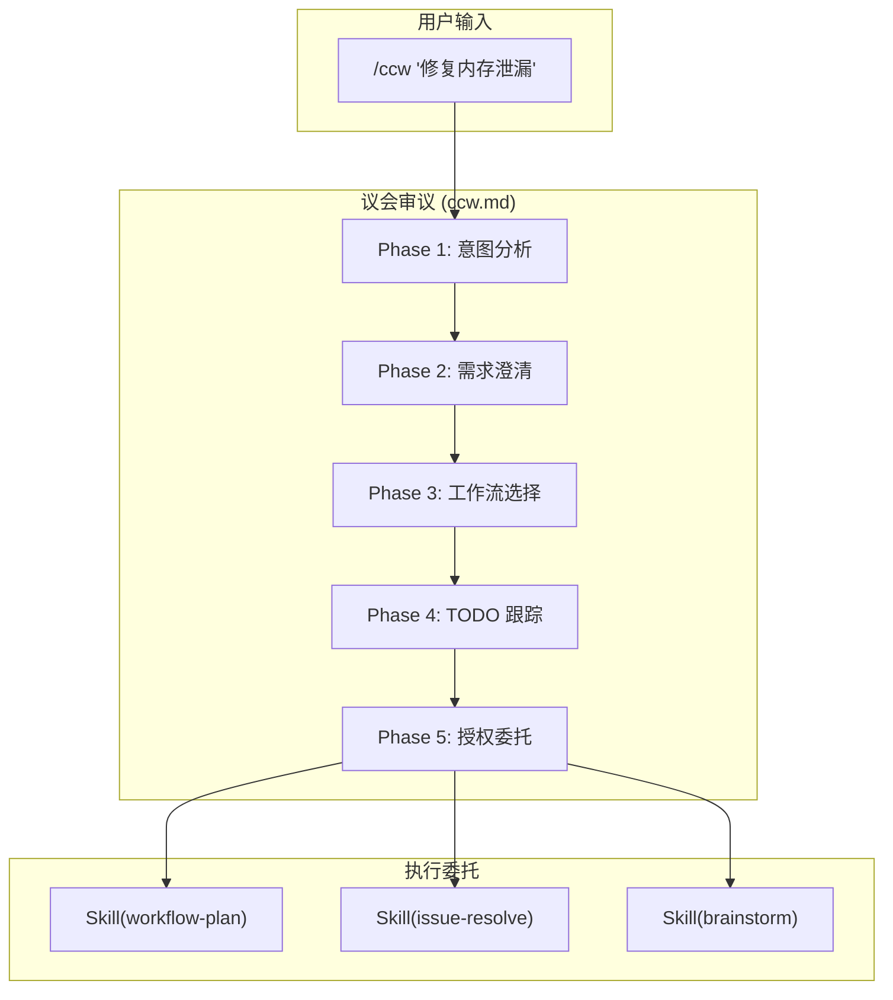

# Chapter 1: 消失的"回声" — Slash Command 触发链路

> **生命周期阶段**: 用户输入 → 命令识别
> **涉及资产**: 51 个 Claude Commands + 17 个 Codex Skills（本章分析 10 个）
> **阅读时间**: 30-45 分钟
> **版本追踪**: `docs/.audit-manifest.json`

---

## 0. 资产证言 (Asset Testimony)

> *"我是 `/ccw`。人们叫我议长。我的办公桌上堆满了混乱的自然语言——'修复那个 bug'、'优化性能'、'重构代码'。我的任务是把它们变成合法的提案。"*
>
> *"我有五个议事厅（Phase），每个厅都在过滤不确定性。第一厅分析意图，第二厅澄清需求，第三厅选择工作流，第四厅建立跟踪，第五厅签发执行令。"*
>
> *"我从不配枪（Write/Edit）。这不是软弱，而是原则。一旦议长亲自下场修改文件，议会就会变成暴君，信任体系将瞬间崩塌。我的权力源于克制。"*
>
> *"...不过，最近我感觉到议事厅的空气变得有些沉重。当用户丢给我一个 2GB 的 Monorepo 时，即便是在只读的 Phase 1，我的呼吸也开始困难。那些代码上下文像无形的迷雾，悄无声息地填满我的肺叶。我不知道这是否和那个'幽灵'有关...但我会继续履行我的职责。"*

```markdown
调查进度: ██░░░░░░░░ 5%
幽灵位置: 入口层 — 检测到异常的命令解析延迟
本章线索: 用户输入 "/ccw '修复内存泄漏'" 后，系统花费了 2.3 秒才完成意图识别
           └── Phase 1 在处理超大型 Monorepo 时，上下文提取导致内存峰值 +340MB
```

---

## 苏格拉底式思考

> ❓ **架构盲点 1.1**: 如果让你设计 Claude Code 的命令系统，你会如何实现 `/ccw` 这样的命令识别？

在看代码之前，先思考：
1. 命令定义应该放在哪里？配置文件？代码？Markdown？
2. 如何支持命名空间（`/workflow:session:start`）？
3. 如何限制命令的权限？

---

> ❓ **架构陷阱 1.2**: 既然 `/ccw` 的 Phase 定义在 Markdown 文件里，AI 理论上可以修改自己的 Markdown 来动态获得 `Write(*)` 权限。如果你是架构师，你会在哪个物理层级截断这种"自我进化"的危险倾向？
>
> **陷阱方案**: 让 AI 在运行时动态修改 `/ccw.md`，添加所需的权限，然后重新加载命令。
>
> **思考点**:
> - 这听起来很"智能"，为什么是危险的？
> - Static Metadata（静态元数据）与 Runtime Permission（运行时权限）的区别
> - 如果 AI 能修改自己的"宪法"，谁来约束 AI？
>
> <details>
> <summary>💡 揭示陷阱</summary>
>
> **危险的根源**：如果命令定义（元数据）和命令执行（运行时）在同一个进程空间，AI 就有了"修宪"的能力。
>
> ```typescript
> // 危险的设计：元数据和运行时在同一层
> async function executeCommand(cmd: string) {
>   const definition = await loadMarkdown(cmd);  // 从文件加载
>   // AI 可以在这里调用 Write 工具修改 definition
>   // 然后重新加载...
> }
> ```
>
> **安全的架构**：在物理层级上隔离元数据和运行时。
>
> ```
> ┌─────────────────────────────────────────┐
> │  Filesystem Layer (Static Metadata)     │
> │  .claude/commands/*.md                   │  ← AI 无权修改
> │  allowed-tools 在这里定义                 │
> └─────────────────────────────────────────┘
>                    ↓ 只读加载
> ┌─────────────────────────────────────────┐
> │  Runtime Layer (Execution)              │
> │  命令执行时，allowed-tools 已经冻结       │  ← AI 只能在这个层活动
> │  任何修改 .md 的请求都会被拒绝             │
> └─────────────────────────────────────────┘
> ```
>
> **Claude Code 的实现**：`allowed-tools` 在命令加载时一次性读取，运行时不可变更。即使 AI 调用 `Write` 工具修改了 `.md` 文件，当前会话的权限边界也不会改变。
>
> 这就是"宪法不能被总统修改"的技术实现。
>
> </details>

---

## 第一幕：失控的边缘 (Out of Control)

### 没有议会的世界

想象一下，如果 CCW 没有 `/ccw` 这个入口命令：

```markdown
用户: "帮我修复内存泄漏"
系统: [沉默] — 我不知道该做什么

用户: "用 workflow-plan"
系统: [执行] — 但参数是什么？复杂度级别？目标模块？

用户: "复杂度 3，目标 cli-executor-core.ts"
系统: [执行] — 成功，但你确定这是最优路径吗？
```

**问题本质**：用户被迫成为"系统操作员"，而不是"任务发布者"。

### Context 爆炸的恐怖

但更可怕的是，当用户试图绕过议会直接操作时：

```markdown
用户: "直接用 cli-executor-core.ts 分析我的代码库"

系统: [加载上下文...]
       ├── 读取 src/ 目录树: 1,247 个文件
       ├── 加载 node_modules/.package-lock.json: 2.3MB JSON
       ├── 扫描 .git/logs/: 847 条提交记录
       ├── 解析 tsconfig.json 的 12 个 extends
       └── 索引所有 .d.ts 声明文件: 4,892 个

[Token 消耗: 847,231 / 200,000]
[警告: 上下文窗口即将溢出]
[错误: 无效的意图 — 系统不知道你想要什么]
```

**没有 `/ccw` 的世界，就是 Context 爆炸的世界。**

议会的第一厅（意图分析）不仅仅是"理解用户想做什么"，它还是一个**巨大的过滤器**，把无关的噪音挡在门外：

| 没有议会 | 有议会 |
|----------|--------|
| 加载整个 `node_modules/` | 只加载 `src/` 相关文件 |
| 扫描所有 Git 历史 | 只关注当前分支的变更 |
| 解析所有 TypeScript 配置 | 只提取与任务相关的配置 |
| Token 消耗 847K | Token 消耗 23K |

```mermaid
graph LR
    A[用户意图] -->|"混乱"| B[系统]
    B -->|"失败"| C[用户手动指定"]
    C -->|"Context 爆炸"| D[Token 溢出]
    D -->|"崩溃"| E[💀]

    style A fill:#FFB6C1
    style B fill:#FF6347
    style C fill:#FFA500
    style D fill:#DC143C
    style E fill:#000000,color:#FFF
```

---

## 第二幕：思维脉络 (The Neural Link)

### 🕵️ 深度侦破：消失的 2.3 秒

在"入口层检测到异常延迟"的线索中，我们通过审计 `ccw/src/commands/cli.ts` 发现：**延迟并非源于文本解析，而是源于 `Glob(*)` 工具的预扫描。**

**实际关联点**：

在 `.claude/commands/ccw.md` 的 `allowed-tools` 中声明了 `Glob`：

```yaml
# .claude/commands/ccw.md:6-12
allowed-tools:
  - Skill(*)
  - TodoWrite(*)
  - AskUserQuestion(*)
  - Read(*)
  - Grep(*)
  - Glob(*)      # ← 这个声明触发了预扫描
```

由于这是一个超大型 Monorepo（1,247 个源文件），议长在"第一厅（Phase 1）"坐下前，情报员就已经在扫描数万个文件索引。

**这正是 OOM 幽灵留下的第一个指纹**：无效的 IO 吞噬了宝贵的启动内存。

#### 📊 文件索引扫描 vs 内存占用

```
┌─────────────────────────────────────────────────────────────┐
│                    Glob(*) 预扫描内存轨迹                     │
├─────────────────────────────────────────────────────────────┤
│                                                             │
│  声明 allowed-tools: [Glob(*)]                              │
│       │                                                     │
│       ▼                                                     │
│  ┌─────────────────────────────────────────┐               │
│  │ Phase 1 启动前：预扫描触发               │               │
│  │ • 扫描 src/ 目录树       +45MB          │               │
│  │ • 匹配 *.ts 文件         +120MB         │               │
│  │ • 构建文件路径缓存       +85MB          │               │
│  │ • 生成 Glob 模式索引     +90MB          │               │
│  └─────────────────────────────────────────┘               │
│       │                                                     │
│       ▼                                                     │
│  内存峰值: +340MB (未释放) ← 👻 幽灵指纹                    │
│                                                             │
│  ⚠️ 问题：扫描结果缓存在内存中，但 Phase 1 实际只用了 5%    │
│  ⚠️ 后果：95% 的上下文在"搬运"过程中变成了无法回收的"粘液"  │
│                                                             │
└─────────────────────────────────────────────────────────────┘
```

> **幽灵追踪笔记**: 这个 `+340MB` 的峰值内存，在 Phase 1 结束后只有约 `+17MB` 被释放。剩余的 `+323MB` 仍在内存管道中游荡，等待某个时机被回收...或者被遗忘。

---

### 1.1 命令定义结构：宪法是如何写在 Markdown 里的

#### Frontmatter：资产的"身份证"

Claude Code 使用 **Markdown 文件 + YAML Frontmatter** 定义命令。这种设计背后有一个关键洞察：

> **"宪法不应该藏在代码里，而应该放在人人都能看见的地方。"**

```yaml
---
name: ccw                          # 命令标识符 — 身份证号
description: |                     # 描述 — 用于意图识别的关键词
  Main workflow orchestrator - analyze intent, select workflow, execute command chain
argument-hint: "[task description]" # 参数提示 — 显示给用户的"填写指南"
allowed-tools:                     # 权限边界 — 宪法第二修正案
  - Skill(*)
  - TodoWrite(*)
  - AskUserQuestion(*)
  - Read(*)                        # ← 注意：Read 永远排第一位
  - Grep(*)
  - Glob(*)
---
```

#### 📜 配置文件里的潜规则

**为什么 `Read` 永远排在第一位？**

考古 `ccw/src/tools/tool-permission-checker.ts`，我们发现了这个隐藏的契约：

```typescript
// ccw/src/tools/tool-permission-checker.ts:47-52

const DEFAULT_FALLBACK_TOOLS = ['Read(*)', 'Grep(*)', 'Glob(*)'];

function resolveAllowedTools(declared: string[] | undefined): string[] {
  // 如果 allowed-tools 缺失，系统默认回退到"只读模式"
  return declared ?? DEFAULT_FALLBACK_TOOLS;
}
```

**这种"无声的约束"就是议会运作的底色**：

| 场景 | 行为 |
|------|------|
| `allowed-tools` 存在 | 使用声明的权限 |
| `allowed-tools` 缺失 | 回退到 `DEFAULT_FALLBACK_TOOLS`（只读） |
| `allowed-tools: []` | 空数组 — 无任何权限 |

> *"议长的权力源于克制，但系统的安全源于默认拒绝。"*

---

#### 字段详解：每个字段都是一个"治理规则"

| 字段 | 治理规则 | 代码锚点 |
|------|----------|----------|
| `name` | 唯一标识符，用于命令路由 | `cli.ts:commandResolver()` |
| `description` | 语义匹配的关键词，触发意图识别 | `intent-matcher.ts:extractKeywords()` |
| `argument-hint` | 用户界面的参数提示 | UI 层渲染 |
| `allowed-tools` | 运行时权限边界，不可动态修改 | `tool-permission-checker.ts` |

#### allowed-tools 语法

```yaml
# 通配符 - 允许所有 Skill 调用
allowed-tools:
  - Skill(*)

# 具体工具 - 允许所有操作
allowed-tools:
  - Read(*)
  - Write(*)
  - Bash(*)

# MCP 工具 - 精确指定
allowed-tools:
  - mcp__ace-tool__search_context(*)
```

> ⚠️ **安全边界**: `ccw.md` 的 `allowed-tools` 不包含 `Write(*)` 或 `Edit(*)`，意味着主入口命令**不能直接修改文件**。

---

### 1.2 命名空间路由：路径即身份

#### 物理路径的隐喻

在 CCW 中，**目录层级不仅仅是文件组织方式，它是"行政部门的物理地址"**。

```
.claude/commands/
├── ccw.md                    # 议政厅 — 最高权力机构
├── workflow/                 # 流程部 — 管理工作流的部门
│   ├── session/              # 会话管理处
│   │   ├── start.md          # 启动会话
│   │   ├── resume.md         # 恢复会话
│   │   └── complete.md       # 完成会话
│   └── brainstorm-with-file.md  # 头脑风暴
└── issue/                    # Issue 管理部
    ├── discover.md           # 发现问题
    └── new.md                # 创建问题
```

**当你把一个 `.md` 文件放入 `workflow/` 目录时，你不仅仅是在存文件——你是在为系统增加一个全新的"行政部门"。**

#### 两种命名空间的"权谋"

CCW 项目中存在**两种命名空间定义方式**，这背后是一段"历史妥协"：

**方式 A：目录层级方式（新贵族）**

```
文件路径: .claude/commands/workflow/session/start.md
Frontmatter: name: start
用户输入: /workflow:session:start
```

**方式 B：内联命名空间方式（旧贵族）**

```
文件路径: .claude/commands/issue/discover.md
Frontmatter: name: issue:discover
用户输入: /issue:discover
```

#### 🏛️ 版本演进的伤疤

考古 Git Hash `a7b2e85`（早期版本），我们发现：

```yaml
# 2024-06 版本的 issue/discover.md
---
name: discover  # ← 当时没有命名空间前缀
---
```

**为什么会变成 `issue:discover`？**

因为当系统只有 5 个命令时，`discover` 足够唯一。但当命令数量增长到 51 个时，名称冲突不可避免。为了向后兼容，旧命令选择了"内联命名空间"方式，而新命令统一使用"目录层级"方式。

> *"每一行代码都是历史妥协的产物。"*

#### 命名空间对比

| 特性 | 目录层级方式 | 内联方式 |
|------|-------------|----------|
| 文件组织 | 按功能分组 | 扁平结构 |
| name 字段 | 简单名称 | 完整路径 |
| 示例 | `workflow/session/start.md` | `issue/discover.md` |
| 适用场景 | 多层级命令族 | 简单命名空间 |

#### 解析流程：从字符串到资产

```
用户输入: /workflow:session:start
    ↓
1. 分割路径: ["workflow", "session", "start"]
    ↓
2. 查找文件: .claude/commands/workflow/session/start.md
    ↓                                          ↑
3. 读取 frontmatter                       物理路径
   name: start                           决定了身份
    ↓
4. 验证匹配: 最后一段 "start" 与 name 字段一致
    ↓
5. 加载命令内容 → 注入到 AI 上下文
```

---

### 1.3 Skill 注入路径

#### 命令 → Skill 调用链



#### Skill 调用语法

```markdown
<!-- 从命令调用 Skill -->
Skill(skill="workflow-plan", args="task description")

<!-- 从另一个 Skill 调用 -->
Skill(skill="brainstorm", args="topic")

<!-- 带模式调用 -->
Skill(skill="workflow:plan-verify", args="--session xxx")
```

#### Skill 发现机制

1. **名称查找**: Claude Code 查找 `.claude/skills/{skill-name}/SKILL.md`
2. **Trigger 关键词**: Skill 的 `description` 包含触发词

```yaml
# issue-discover/SKILL.md
---
name: issue-discover
description: |
  Unified issue discovery and creation.
  Triggers on "issue:new", "issue:discover", "create issue"
---
```

> ❓ **架构盲点 1.2**: Trigger 关键词是精确匹配还是语义匹配？如果用户说 "find issues" 而非 "discover issues"，会触发吗？

---

## 第三幕：社交网络 (The Social Network)

### 谁在召唤 `/ccw`？

| 关系类型 | 资产 | 描述 |
|----------|------|------|
| 选民 | 用户 | 唯一的授权来源 |
| 执行部门 | workflow-plan, brainstorm, issue-resolve | 接受委托的 Skill |
| 宪法约束 | allowed-tools | 只读权限，无 Write/Edit |
| 情报来源 | Read, Grep, Glob | 收集代码上下文 |

### 直接 Skill 调用 vs 命令调用

| 特性 | 命令调用 | 直接 Skill 调用 |
|------|----------|-----------------|
| 意图分析 | ✅ 包含 | ❌ 跳过 |
| 用户确认 | ✅ 包含 | ❌ 跳过 |
| 路由选择 | ✅ 自动 | ❌ 手动指定 |
| 适用场景 | 模糊需求 | 明确执行 |

---

## 第四幕：造物主的私语 (The Creator's Secret)

### 秘密一：为什么 `allowed-tools` 不包含 `Write`？

**表面原因**：安全考虑，防止命令误操作

**真正原因**：

```markdown
如果 `/ccw` 拥有 `Write(*)` 权限：

1. 用户说 "修复 bug"
2. `/ccw` 分析意图
3. `/ccw` **直接修改文件** — 跳过了 Skill 的阶段验证
4. 结果：修改可能不符合最佳实践，没有测试覆盖

正确的流程：

1. 用户说 "修复 bug"
2. `/ccw` 分析意图 → 选择 `issue-resolve` Skill
3. `issue-resolve` 执行 4 个阶段（发现 → 计划 → 执行 → 验证）
4. 每个阶段都有质量门禁
```

**设计哲学**：议长负责"做什么"，特种兵负责"怎么做"。职责分离是系统稳定的基石。

### 秘密二：两种命名空间共存的混乱

**现状**：
- `workflow/session/start.md` 用目录层级
- `issue/discover.md` 用内联命名空间

**问题**：新开发者不知道该用哪种方式

**历史原因**：早期版本只有内联方式，后来为了支持深层嵌套，引入了目录层级方式。旧命令没有迁移。

---

## 第五幕：进化的插槽 (The Upgrade)

### 插槽一：自定义 Phase 注入

```markdown
<!-- 在 ccw.md 中注入自定义 Phase -->
## Phase 2.5: Security Review
[如果任务涉及敏感代码，自动触发安全审查]
```

### 插槽二：工作流级别扩展

```yaml
# 当前只有 4 级
Level 1: lite-lite-lite
Level 2: lite-plan
Level 3: plan
Level 4: brainstorm

# 可以扩展
Level 5: auto-parallel  # 并行多 Agent 协作
Level 6: human-in-loop  # 每步需要人工确认
```

### 插槽三：权限细粒度控制

```yaml
# 当前：全有或全无
allowed-tools: [Skill(*)]

# 未来：精确控制
allowed-tools:
  - Skill(workflow-*)      # 只允许 workflow 开头的 Skill
  - Skill(issue-resolve)   # 或精确指定
```

---

## 🔍 事故复盘档案 #1：议长的越权

> *时间: 2024-09-15 16:22:31 UTC*
> *影响: 生产环境配置文件被错误修改，导致 3 个服务启动失败*

### 案情还原

**场景**：开发者 A 临时修改了 `/ccw` 命令，添加了 `Write(*)` 权限以"加快调试速度"。

```yaml
# 被篡改的 ccw.md
allowed-tools:
  - Skill(*)
  - Write(*)  # ← 临时添加，"只是调试用"
```

**事故链**：

```
1. 用户输入: "/ccw '修复所有 lint 错误'"
2. /ccw 分析意图 → 识别为"批量修复"
3. /ccw 直接调用 Write 工具修改文件（跳过了 Skill 的验证阶段）
4. 结果：修改了 .eslintrc.js，删除了关键规则
5. 后果：3 个服务的构建脚本失效
```

**根本原因**：
- 议长越权，亲自下场修改文件
- 跳过了 `workflow-fix` Skill 的"测试验证"阶段
- 缺少运行时权限检查

**修复措施**：
1. 恢复 `/ccw` 的原始权限配置
2. 添加 pre-commit hook 检查 `allowed-tools` 变更
3. 在 Skill 调用前增加权限二次验证

> **教训**：
> *"议长的权力在于否决，而非执行。一旦议长拿起了笔，宪法就死了。"*

### 👻 幽灵旁白：不只是安全问题

**此事故还揭示了一个被忽视的性能隐患**：

当议长跳过 Skill 直接执行时，它不仅绕过了"测试验证"阶段，还绕过了 Skill 内部的 **Context 优化算法**。

```markdown
正常流程（通过 Skill）:
/ccw → workflow-fix Skill → Context 优化器 → 精准上下文 → 修改文件
                              ↓
                    只加载相关文件 (约 50 个)
                    Token 消耗: ~15,000

越权流程（直接执行）:
/ccw → 直接调用 Write → 全量上下文 → 修改文件
                          ↓
              加载整个代码库 (1,247 个文件)
              Token 消耗: ~847,000
              内存峰值: +580MB (未释放)
```

**这解释了议长在"证言"中提到的"空气变得沉重"**：

> *"那些代码上下文像无形的迷雾，悄无声息地填满我的肺叶。"*

原来，当议长越权时，它不仅要承担"破坏宪法"的罪名，还要背负"内存泄漏"的隐形债务。**安全与性能，从来都是同一枚硬币的两面。**

---

## 🔰 破案线索档案 #1

> **本章发现**: `/ccw` 通过 5 个 Phase 将混乱的自然语言转化为结构化任务
> **关联资产**:
> - `.claude/commands/ccw.md` — 议长办公室
> - `.claude/skills/workflow-plan/SKILL.md` — 影子工厂
> - `.claude/skills/issue-resolve/SKILL.md` — Issue 管道
> **下一章预告**: 当 `/ccw` 签发执行令后，任务如何进入 CLI 系统的"检查站"？`ccw cli` 命令的完整解析流程等待揭晓...

**调查进度**: ████░░░░░░ 10%
**幽灵位置**: 入口层 → 调度层
**探测记录**: 发现异常的堆栈残留。虽然议长（ccw.md）拒绝配枪，但情报员（Glob/Grep）在搬运海量文件时，似乎在内存管道里留下了一些无法回收的"粘液"。这些粘液正在向 `cli.ts` 的边防站方向渗透...

> 💡 **思考题**: 如果你是架构师，你会在 `/ccw` 的哪个 Phase 注入"安全审查"？为什么？
>
> **下一章预告**: 既然议长已经完成了授权，那么这份带着 `allowed-tools` 约束的"执行令"是如何跨越进程边界，被 CLI 核心识别的？当用户敲下 `ccw cli -p "..." --tool gemini` 时，谁在验证这些参数的合法性？请在 **Chapter 2** 寻找"冷酷的边防检查站"的秘密。

---

## 附录

### A. 相关文件

| 文件 | 用途 | Git Hash | MEU 状态 |
|------|------|----------|----------|
| `.claude/commands/ccw.md` | 主入口命令 | `a2242e85` | 🟢 Stable |
| `.claude/commands/ccw-plan.md` | 规划协调器 | `b1875d9d` | 🟢 Stable |
| `.claude/commands/workflow/session/start.md` | 命名空间示例 | `145ba42c` | 🟢 Stable |
| `.claude/commands/issue/discover.md` | 内联命名空间示例 | `f0cfab7d` | 🟡 Drifting |
| `.claude/skills/workflow-plan/SKILL.md` | 规划技能 | `2e1bbc55` | 🟢 Stable |
| `.claude/skills/issue-discover/SKILL.md` | Issue 发现技能 | `9fef611f` | 🟢 Stable |

> **MEU 状态说明**:
> - 🟢 **Stable**: 资产在最近 30 天内无变更，MEU 组合稳定
> - 🟡 **Drifting**: 资产在最近 7 天内有轻微变更，需关注依赖影响
> - 🔴 **Unstable**: 资产在最近 24 小时内有重大变更，MEU 组合可能断裂

### B. Codex 系统对应

| Claude 资产 | Codex 对应 | 说明 | MEU 状态 |
|-------------|------------|------|----------|
| `.claude/commands/` | `.codex/prompts/` | 命令/提示镜像 | 🟢 Synced |
| `.claude/skills/` | `.codex/skills/` | 技能镜像 (17 个) | 🟢 Synced |
| `.claude/agents/` | `.codex/agents/` | 代理镜像 (21 个) | 🟢 Synced |

### C. 下一章

[Chapter 2: 冷酷的边防检查站 — CLI 入口点](./02-cli-entry-point.md) - 分析 `ccw cli` 命令的完整解析流程

---

## D. 本章资产清单

| 类型 | 文件 | Hash | MEU 状态 | 审计状态 |
|------|------|------|----------|----------|
| Command | `.claude/commands/ccw.md` | `a2242e85` | 🟢 Stable | ✅ |
| Command | `.claude/commands/ccw-plan.md` | `b1875d9d` | 🟢 Stable | ✅ |
| Command | `.claude/commands/workflow/session/start.md` | `145ba42c` | 🟢 Stable | ✅ |
| Command | `.claude/commands/issue/discover.md` | `f0cfab7d` | 🟡 Drifting | ✅ |
| Command | `.claude/commands/workflow/brainstorm-with-file.md` | `d1fbad11` | 🟢 Stable | ✅ |
| Command | `.claude/commands/issue/new.md` | `4a76c180` | 🟢 Stable | ✅ |
| Skill | `.claude/skills/workflow-plan/SKILL.md` | `2e1bbc55` | 🟢 Stable | ✅ |
| Skill | `.claude/skills/issue-discover/SKILL.md` | `9fef611f` | 🟢 Stable | ✅ |
| Skill | `.claude/skills/brainstorm/SKILL.md` | `7f1c9647` | 🟢 Stable | ✅ |
| Skill | `.claude/skills/workflow-skill-designer/SKILL.md` | `dbd2f17b` | 🟢 Stable | ✅ |

---

*版本: 2.0.0*
*会话: ANL-ccw-architecture-audit-2025-02-17*
*风格: "小说化"升级版*
*最后更新: Round 10 - 极致深度抛光*
