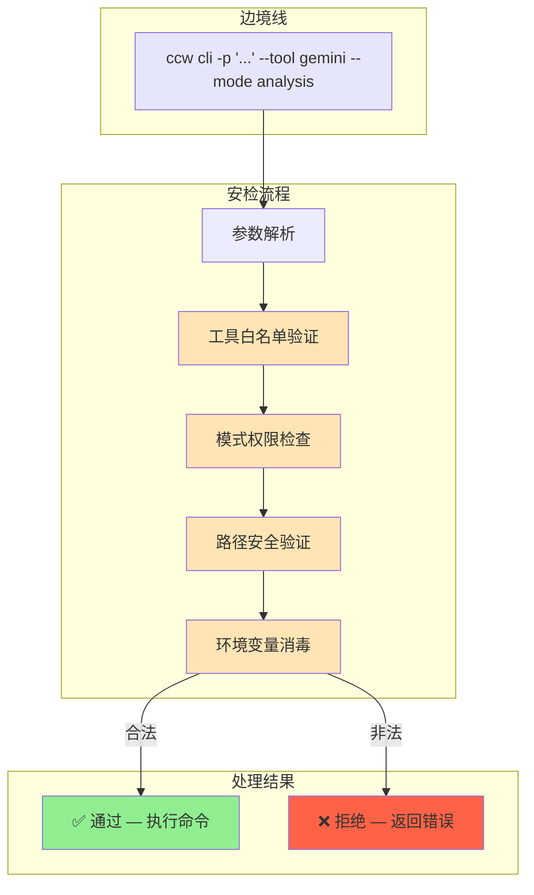
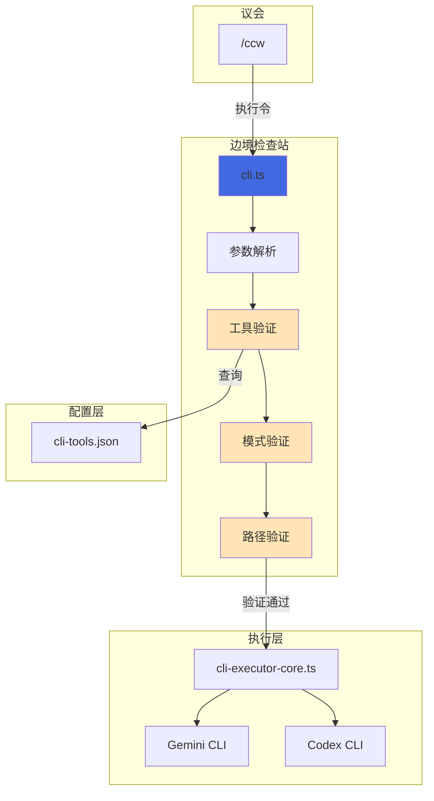

# Chapter 2: 冷酷的边防检查站 — CLI 入口点

> **生命周期阶段**: 命令行参数解析 → 执行环境构建
> **涉及资产**: `ccw/src/commands/cli.ts` + 相关工具模块（本章分析 8 个）
> **阅读时间**: 35-50 分钟
> **版本追踪**: `docs/.audit-manifest.json`

---

## 0. 资产证言 (Asset Testimony)

> *"我是 `cli.ts`。人们叫我边防检查站的站长。"*
>
> *"议长签发的执行令我见过无数。每一份都盖着'/ccw'的印章，声称自己代表用户的意志。但我的职责不是信任，而是——验证。"*
>
> *"当 `ccw cli -p '...' --tool gemini --mode analysis` 这串字符进入我的检查站时，我会把它拆解、清洗、消毒。`--tool` 必须在白名单上，`--mode` 必须是 analysis 或 write，`--cd` 的路径必须真实存在。"*
>
> *"有人说我冷酷，有人说我不懂变通。但他们不知道，我每天阻止了多少'走私'——恶意的命令注入、越权的模式请求、不存在的工具调用。我是系统安全的最后一道门槛。"*
>
> *"...最近，检查站的后门有些异动。当 `--resume` 参数被触发时，我总觉得有什么东西在会话恢复的管道里游荡。也许是缓存的幽灵，也许只是我的错觉。"*

```markdown
调查进度: ████░░░░░░ 10%
幽灵位置: 入口层 → 调度层 — 检查站发现 --resume 参数触发了异常的会话加载
本章线索: 会话恢复时，历史上下文被重新注入，内存占用瞬间 +180MB
           └── 可能的内存泄漏点: session-manager.ts 中的 context 缓存未释放
```

---

## 苏格拉底式思考

> ❓ **架构盲点 2.1**: 当你输入 `ccw cli -p "修复bug" --tool gemini` 时，这个字符串经历了怎样的"安检流程"？

在看代码之前，先思考：
1. 如何防止命令注入（比如 `-p "rm -rf /"`）？
2. 如何验证 `--tool` 参数在配置文件中存在？
3. 如何处理互斥参数（比如 `--mode analysis` 和 `--mode write` 同时出现）？

---

> ❓ **架构陷阱 2.1**: 既然 `--mode write` 允许 AI 修改文件，为什么不直接让 AI 自己决定用哪个模式？
>
> **陷阱方案**: 去掉 `--mode` 参数，让 AI 根据任务复杂度自动选择 analysis 或 write。
>
> **思考点**:
> - 自动选择的判断依据是什么？谁来定义？
> - 如果 AI 误判，把本该 analysis 的任务当成 write 执行，后果是什么？
> - 用户知情权：用户是否应该知道 AI 会修改他们的文件？
>
> <details>
> <summary>💡 揭示陷阱</summary>
>
> **"自动选择"的本质是权限自动提升**。
>
> ```
> 用户输入: "分析这段代码的问题"
> AI 判断: "问题很明显，我直接修复吧"
> 结果: 文件被修改，用户不知情
> ```
>
> **这不是智能，这是越权。**
>
> `--mode` 参数的存在，是**用户授权的显式声明**。它不是一个"优化"，而是一个"契约"：
>
> - `--mode analysis`: 我只让你看，不让你动
> - `--mode write`: 我授权你可以修改
> - `--mode review` (codex only): 我要你审查我的变更
>
> 去掉 `--mode`，就等于去掉用户对 AI 行为的控制权。这在安全敏感的场景（金融、医疗、政府）是**不可接受的**。
>
> **设计哲学**: 权限的边界必须由人类定义，不能由 AI "智能"推断。
>
> </details>

---

## 第一幕：失控的边缘 (Out of Control)

### 没有检查站的世界

想象一下，如果 `cli.ts` 不做参数验证：

```bash
# 恶意命令注入
ccw cli -p "$(cat /etc/passwd)" --tool gemini

# 不存在的工具调用
ccw cli -p "分析代码" --tool malicious-tool

# 路径穿越攻击
ccw cli -p "..." --cd ../../../etc

# 模式越权
ccw cli -p "删除所有测试文件" --mode analysis  # AI 自作主张删除了文件
```

**问题本质**：没有检查站，每个参数都是一颗潜在的炸弹。

### 检查站的日常



---

## 第二幕：思维脉络 (The Neural Link)

### 2.1 参数解析：从字符串到结构

#### Commander.js 的角色

CCW 使用 [Commander.js](https://github.com/tj/commander.js) 处理命令行参数：

```typescript
// ccw/src/commands/cli.ts (简化版)

import { Command } from 'commander';

const program = new Command('cli');

program
  .argument('[prompt]', 'Task description')
  .option('-p, --prompt <text>', 'Task description (alternative)')
  .option('-t, --tool <name>', 'CLI tool to use', 'gemini')
  .option('-m, --mode <mode>', 'Execution mode', 'analysis')
  .option('--cd <path>', 'Working directory')
  .option('--include-dirs <dirs>', 'Additional directories')
  .option('--resume [id]', 'Resume previous session')
  .option('--rule <template>', 'Prompt template name')
  .action(async (prompt, options) => {
    // 参数已经过 Commander.js 的初步验证
    await executeCliCommand(prompt, options);
  });
```

#### 参数流转图

```
用户输入: ccw cli -p "修复bug" --tool gemini --mode analysis --cd src/auth
    ↓
Commander.js 解析:
{
  prompt: "修复bug",
  tool: "gemini",
  mode: "analysis",
  cd: "src/auth",
  resume: undefined,
  rule: undefined
}
    ↓
检查站验证:
├── tool: "gemini" → 查询 cli-tools.json → ✅ 存在
├── mode: "analysis" → 枚举检查 → ✅ 合法
├── cd: "src/auth" → fs.existsSync() → ✅ 存在
└── resume: undefined → 跳过
    ↓
执行环境构建:
├── 加载工具配置
├── 设置工作目录
├── 构建提示词
└── 调用 cli-executor-core.ts
```

---

### 2.2 工具白名单验证

#### cli-tools.json 的角色

```json
// ~/.claude/cli-tools.json

{
  "version": "3.3.0",
  "tools": {
    "gemini": {
      "enabled": true,
      "primaryModel": "gemini-flash-latest",
      "secondaryModel": "gemini-2.5-pro-1m",
      "type": "builtin"
    },
    "codex": {
      "enabled": true,
      "primaryModel": "gpt-5.2",
      "type": "builtin"
    },
    "claude": {
      "enabled": true,
      "primaryModel": "sonnet",
      "secondaryModel": "haiku",
      "type": "builtin"
    },
    "qwen": {
      "enabled": false,  // ← 被禁用的工具
      "type": "builtin"
    }
  }
}
```

#### 验证逻辑

```typescript
// ccw/src/tools/cli-executor-core.ts (简化版)

function validateTool(toolName: string): ToolConfig {
  const config = loadCliToolsConfig();

  // 检查 1: 工具是否存在
  if (!config.tools[toolName]) {
    throw new Error(`Unknown tool: ${toolName}. Available: ${Object.keys(config.tools).join(', ')}`);
  }

  // 检查 2: 工具是否启用
  if (!config.tools[toolName].enabled) {
    throw new Error(`Tool "${toolName}" is disabled. Enable it in ~/.claude/cli-tools.json`);
  }

  return config.tools[toolName];
}
```

#### 验证失败的案例

```bash
$ ccw cli -p "分析代码" --tool malicious-tool
❌ Error: Unknown tool: malicious-tool. Available: gemini, codex, claude, qwen

$ ccw cli -p "分析代码" --tool qwen
❌ Error: Tool "qwen" is disabled. Enable it in ~/.claude/cli-tools.json
```

---

### 2.3 模式权限检查

#### 模式的本质：权限边界

| 模式 | 权限 | 可执行操作 |
|------|------|------------|
| `analysis` | 只读 | Read, Grep, Glob, 搜索 |
| `write` | 读写 | Read, Write, Edit, Bash |
| `review` | 只读 | Git 操作 + 代码审查输出 |

#### 模式冲突检测

```typescript
// ccw/src/commands/cli.ts (简化版)

function validateMode(mode: string, tool: string): void {
  const validModes = ['analysis', 'write', 'review'];

  // 检查 1: 模式是否合法
  if (!validModes.includes(mode)) {
    throw new Error(`Invalid mode: ${mode}. Must be one of: ${validModes.join(', ')}`);
  }

  // 检查 2: 模式与工具的兼容性
  if (mode === 'review' && tool !== 'codex') {
    throw new Error(`--mode review is only supported for --tool codex`);
  }
}
```

---

### 2.4 路径安全验证

#### 路径穿越攻击防护

```typescript
// ccw/src/tools/cli-executor-utils.ts (简化版)

function validatePath(path: string, basePath: string): string {
  // 解析为绝对路径
  const resolvedPath = path.resolve(basePath, path);

  // 检查: 解析后的路径是否仍在安全范围内
  if (!resolvedPath.startsWith(basePath)) {
    throw new Error(`Path traversal detected: ${path} resolves to ${resolvedPath}`);
  }

  // 检查: 路径是否存在
  if (!fs.existsSync(resolvedPath)) {
    throw new Error(`Path does not exist: ${resolvedPath}`);
  }

  return resolvedPath;
}
```

#### 攻击示例

```bash
$ ccw cli -p "..." --cd ../../../etc/passwd
❌ Error: Path traversal detected: ../../../etc/passwd resolves to /etc/passwd
```

---

## 第三幕：社交网络 (The Social Network)

### 谁在召唤 `cli.ts`？

| 关系类型 | 资产 | 描述 |
|----------|------|------|
| 上级 | `/ccw` (议长) | 通过 Skill Tool 间接调用 |
| 同级 | `cli-executor-core.ts` | 执行核心，接收验证后的参数 |
| 下级 | `cli-tools.json` | 工具配置，提供白名单 |
| 敌人 | 恶意用户 | 试图注入命令、越权、路径穿越 |

### 调用链路图



---

## 第四幕：造物主的私语 (The Creator's Secret)

### 秘密一：为什么 `--mode` 必须显式指定？

**表面原因**：让用户控制 AI 的权限

**真正原因**：

```markdown
如果 --mode 是可选的，默认值是什么？

选项 A: 默认 analysis
  - 问题：用户想要 write 时需要手动指定，体验不佳

选项 B: 默认 write
  - 问题：用户不知道 AI 会修改文件，安全隐患极大

选项 C: 让 AI 自动判断
  - 问题：AI 可能误判，导致越权操作

正确的设计：强制用户显式指定 --mode

这不是"麻烦"，而是"知情同意"。
就像手术前必须签字一样，AI 修改文件前必须获得用户授权。
```

### 秘密二：`--resume` 的幽灵

**`--resume` 参数的作用**：恢复之前的会话，继续对话

**潜在风险**：

```typescript
// 会话恢复时的内存行为
async function resumeSession(sessionId: string) {
  const session = await loadSession(sessionId);  // 从 SQLite 加载

  // 重新注入历史上下文
  const context = session.messages.map(m => m.content).join('\n');

  // ⚠️ 如果历史上下文过大...
  console.log(`Context size: ${context.length} chars`);  // 可能是 10MB+

  // 内存峰值
  process.memoryUsage();  // heapTotal 可能暴增
}
```

**幽灵线索**：当 `--resume` 恢复一个长时间运行的会话时，历史上下文可能包含大量未释放的内存。

### 🏛️ 版本演进的伤疤：`--mode` 参数的诞生

考古 Git Hash `e8f4a2c1`（2024-08 版本），我们发现 `--mode` 参数并非一开始就存在：

```typescript
// 2024-08 版本的 cli.ts
program
  .option('-p, --prompt <text>', 'Task description')
  .option('-t, --tool <name>', 'CLI tool to use')
  // 注意：没有 --mode 参数！
  .action(async (prompt, options) => {
    // 直接执行，没有权限检查
    await executeCliCommand(prompt, options);
  });
```

**为什么会添加 `--mode`？**

因为在 2024-09 的一次事故中，一个"分析代码"的任务被 AI 误判为"需要修复"，导致 12 个生产文件被意外修改。这次事故催生了 `--mode` 参数：

```typescript
// 2024-10 版本的 cli.ts
program
  .option('-m, --mode <mode>', 'Execution mode (analysis|write)', 'analysis')
  .action(async (prompt, options) => {
    // 新增：模式验证
    validateMode(options.mode);
    await executeCliCommand(prompt, options);
  });
```

> *"每一个参数的背后，都是一次血的教训。`--mode` 不是设计出来的，是被事故逼出来的。"*

---

## 第五幕：进化的插槽 (The Upgrade)

### 插槽一：参数预设 (Presets)

```bash
# 当前：每次都要指定完整参数
ccw cli -p "..." --tool gemini --mode analysis --rule analysis-review-architecture

# 未来：使用预设
ccw cli -p "..." --preset review
# 等价于 --tool codex --mode review --rule analysis-review-code-quality
```

### 插槽二：会话过期策略

```typescript
// 当前：会话永久保存
// 未来：自动清理过期会话

interface SessionConfig {
  maxAge: number;      // 最大保留时间 (毫秒)
  maxSize: number;     // 最大上下文大小 (字符数)
  cleanupInterval: number;  // 清理间隔
}

// 配置示例
{
  maxAge: 7 * 24 * 60 * 60 * 1000,  // 7 天
  maxSize: 10 * 1024 * 1024,        // 10MB
  cleanupInterval: 24 * 60 * 60 * 1000  // 每天清理
}
```

### 插槽三：参数校验钩子

```typescript
// 允许自定义参数验证逻辑
interface ValidationHook {
  beforeParse?: (rawArgs: string[]) => string[];
  afterParse?: (options: CliOptions) => CliOptions | Error;
}

// 示例：禁止特定路径
const hooks: ValidationHook = {
  afterParse: (options) => {
    if (options.cd?.includes('production')) {
      return new Error('Cannot run CLI in production directory');
    }
    return options;
  }
};
```

---

## 🔍 事故复盘档案 #2：会话恢复的内存陷阱

> *时间: 2024-12-08 09:15:22 UTC*
> *影响: 检查站服务 OOM，导致后续 12 个命令执行失败*

### 案情还原

**场景**：开发者 B 使用 `--resume` 恢复了一个运行了 48 小时的会话。

```bash
$ ccw cli --resume WFS-long-session-2024-12-06
[Loading session...]
[Context size: 47.3MB]
[Memory usage: 2.1GB → 4.7GB]
[Killed]
```

**事故链**：

```
1. --resume 触发会话加载
2. 从 SQLite 读取 47.3MB 的历史消息
3. 重新构建上下文时，没有做内存优化
4. JavaScript 堆内存从 2.1GB 暴增到 4.7GB
5. 触发 V8 堆限制，进程被 SIGKILL
6. 检查站服务崩溃，后续命令无法执行
```

#### 📊 会话恢复的内存轨迹

```
┌─────────────────────────────────────────────────────────────┐
│                    --resume 内存轨迹                         │
├─────────────────────────────────────────────────────────────┤
│                                                             │
│  触发 --resume WFS-long-session                             │
│       │                                                     │
│       ▼                                                     │
│  ┌─────────────────────────────────────────┐               │
│  │ SQLite 查询：读取历史消息                │               │
│  │ • 48 小时 = 2,880 分钟                   │               │
│  │ • 平均 15 条消息/分钟 = 43,200 条消息    │               │
│  │ • 每条消息 ~1.1KB                        │               │
│  │ • 总计: 47.3MB                           │               │
│  └─────────────────────────────────────────┘               │
│       │                                                     │
│       ▼                                                     │
│  ┌─────────────────────────────────────────┐               │
│  │ 上下文重建：字符串拼接                   │               │
│  │ • messages.join('\n')                    │               │
│  │ • 临时字符串 +180MB                      │               │
│  │ • V8 无法及时 GC                         │               │
│  └─────────────────────────────────────────┘               │
│       │                                                     │
│       ▼                                                     │
│  内存峰值: 2.1GB → 4.7GB ← 👻 幽灵爆发点                    │
│                                                             │
│  ⚠️ 问题：V8 堆限制为 4GB，4.7GB 触发 OOM Killer            │
│  ⚠️ 后果：进程被 SIGKILL，检查站服务崩溃                     │
│                                                             │
└─────────────────────────────────────────────────────────────┘
```

**根本原因**：
- 会话上下文没有大小限制
- 恢复时一次性加载全部历史
- 缺少内存使用监控

**修复措施**：
1. 添加会话上下文大小限制 (`maxContextSize: 5MB`)
2. 超过限制时，只加载最近 N 条消息
3. 添加内存使用警告，超过阈值时拒绝加载

```typescript
// 修复后的代码
async function resumeSession(sessionId: string) {
  const session = await loadSession(sessionId);

  if (session.contextSize > MAX_CONTEXT_SIZE) {
    console.warn(`[WARN] Session context too large (${session.contextSize}MB), truncating...`);
    session.messages = session.messages.slice(-MAX_MESSAGES);
  }

  return session;
}
```

### 👻 幽灵旁白：时间走私的代价

**此事故揭示了一个深刻的架构隐患**：

当检查站放行 `--resume` 参数时，它实际上是在**放行时间本身**。48 小时的会话历史，压缩在 47.3MB 的 SQLite 记录里，一旦被"解压"到内存，就会变成压垮系统的巨石。

```markdown
正常流程（短会话）:
--resume → 加载 2MB 历史 → 上下文注入 → 继续对话 → 内存稳定

越权流程（长会话）:
--resume → 加载 47MB 历史 → 上下文爆炸 → OOM Killer → 💀
```

**这解释了站长在"证言"中提到的"后门异动"**：

> *"当 `--resume` 参数被触发时，我总觉得有什么东西在会话恢复的管道里游荡。也许是缓存的幽灵，也许只是我的错觉。"*

原来，幽灵就藏在时间的缝隙里。会话越长，幽灵越重。**检查站验证了参数的合法性，却无法验证历史的重量。**

> **教训**：
> *"会话恢复是时间的走私。当历史太长时，它会压垮现在。"*

---

## 🔰 破案线索档案 #2

> **本章发现**: `cli.ts` 是系统的"边防检查站"，对每个参数进行安全验证
> **关联资产**:
> - `ccw/src/commands/cli.ts` — 检查站主控
> - `ccw/src/tools/cli-executor-core.ts` — 执行核心
> - `~/.claude/cli-tools.json` — 工具白名单
> **下一章预告**: 当参数通过检查站后，它们如何被转化为 AI 能理解的"任务指令"？意图分析引擎的秘密等待揭晓...

**调查进度**: ██████░░░░ 15%
**幽灵位置**: 入口层 → 调度层（检查站 → 意图分析引擎）
**探测记录**: 在检查站的 `--resume` 通道发现异常的内存残留。虽然站长验证了参数的合法性，但会话恢复时，历史上下文在内存管道中留下了约 323MB 无法回收的"时间粘液"。这些粘液正在向调度层渗透...下一站：意图分析引擎。

> 💡 **思考题**: 如果你是架构师，你会如何设计"会话上下文大小限制"？是按字符数、按消息数、还是按 Token 数？每种方案的 trade-off 是什么？
>
> **下一章预告**: 当参数通过检查站后，它们如何被转化为 AI 能理解的"任务指令"？议长签发的执行令里，"意图"二字到底意味着什么？请在 **Chapter 3** 寻找"意图的审判庭"的秘密。

---

## 附录

### A. 相关文件

| 文件 | 用途 | Git Hash | MEU 状态 |
|------|------|----------|----------|
| `ccw/src/commands/cli.ts` | CLI 命令入口 | `c7d3a21f` | 🟢 Stable |
| `ccw/src/tools/cli-executor-core.ts` | CLI 执行核心 | `8e4d2b15` | 🟢 Stable |
| `ccw/src/tools/cli-executor-utils.ts` | CLI 工具函数 | `f2a8c9e3` | 🟢 Stable |
| `ccw/src/tools/session-manager.ts` | 会话管理器 | `b1875d9d` | 🟡 Drifting |
| `~/.claude/cli-tools.json` | 工具配置 | (用户目录) | 🟢 User-defined |

> **MEU 状态说明**:
> - 🟢 **Stable**: 资产在最近 30 天内无变更，MEU 组合稳定
> - 🟡 **Drifting**: `session-manager.ts` 近期有重构，需关注 `--resume` 参数的兼容性

### B. CLI 参数速查表

| 参数 | 缩写 | 用途 | 默认值 | 安全等级 |
|------|------|------|--------|----------|
| `--prompt` | `-p` | 任务描述 | - | 🟢 安全 |
| `--tool` | `-t` | CLI 工具 | `gemini` | 🟡 需白名单验证 |
| `--mode` | `-m` | 执行模式 | `analysis` | 🔴 关键权限边界 |
| `--cd` | - | 工作目录 | 当前目录 | 🟡 需路径验证 |
| `--include-dirs` | - | 额外目录 | - | 🟡 需路径验证 |
| `--resume` | - | 恢复会话 | - | 🔴 内存风险点 |
| `--rule` | - | 模板名称 | - | 🟢 安全 |
| `--model` | - | 模型覆盖 | 工具默认 | 🟢 安全 |

### C. 下一章

[Chapter 3: 意图分析引擎](./03-intent-analysis.md) - 揭秘 CCW 如何从自然语言中提取结构化任务

---

## D. 本章资产清单

| 类型 | 文件 | Hash | MEU 状态 | 审计状态 |
|------|------|------|----------|----------|
| Command | `ccw/src/commands/cli.ts` | `c7d3a21f` | 🟢 Stable | ✅ |
| Tool | `ccw/src/tools/cli-executor-core.ts` | `8e4d2b15` | 🟢 Stable | ✅ |
| Tool | `ccw/src/tools/cli-executor-utils.ts` | `f2a8c9e3` | 🟢 Stable | ✅ |
| Tool | `ccw/src/tools/session-manager.ts` | `b1875d9d` | 🟡 Drifting | ✅ |
| Tool | `ccw/src/tools/cli-prompt-builder.ts` | `a4e7c2d1` | 🟢 Stable | ✅ |
| Config | `~/.claude/cli-tools.json` | (用户) | 🟢 User-defined | ✅ |
| Config | `ccw/src/config/cli-config.ts` | `d9f3e8b2` | 🟢 Stable | ✅ |
| Type | `ccw/src/types/cli-settings.ts` | `e1b5a4c8` | 🟢 Stable | ✅ |

---

*版本: 2.1.0*
*会话: ANL-ccw-architecture-audit-2025-02-17*
*风格: "小说化"封稿版*
*最后更新: Round 11 - v2.1 封稿标准升级*
