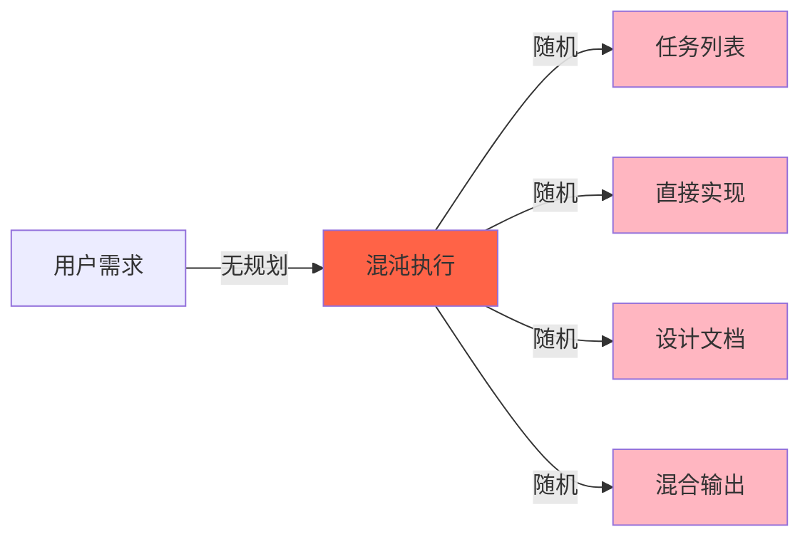
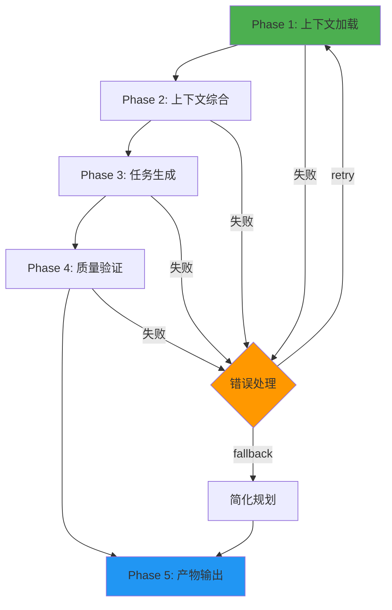
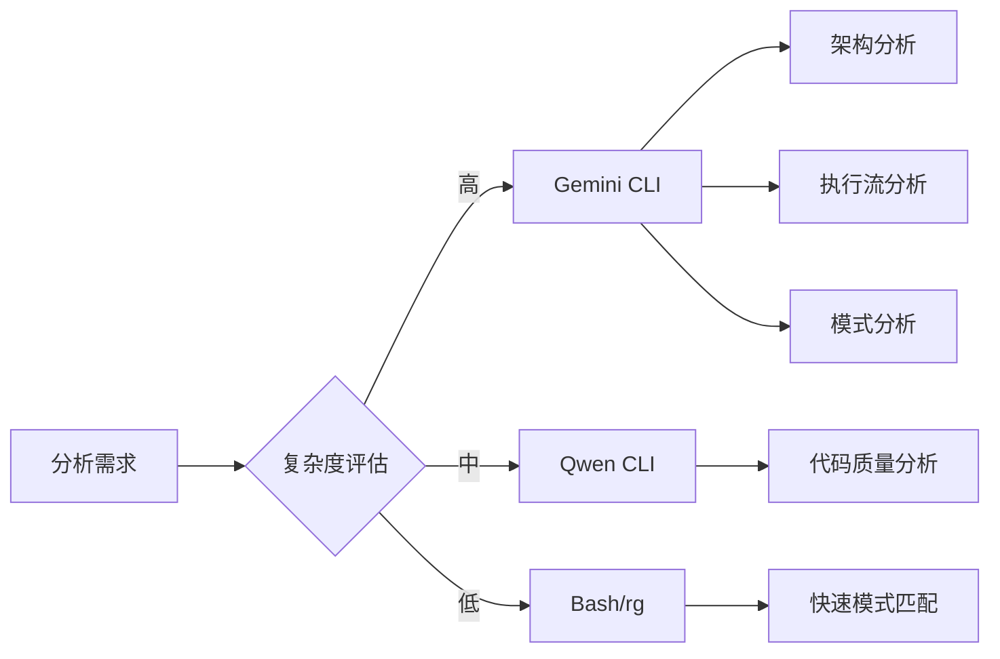
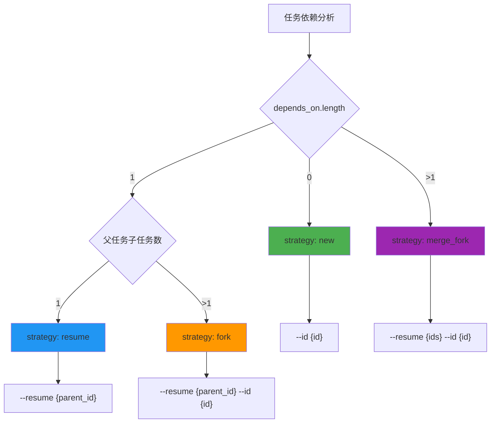
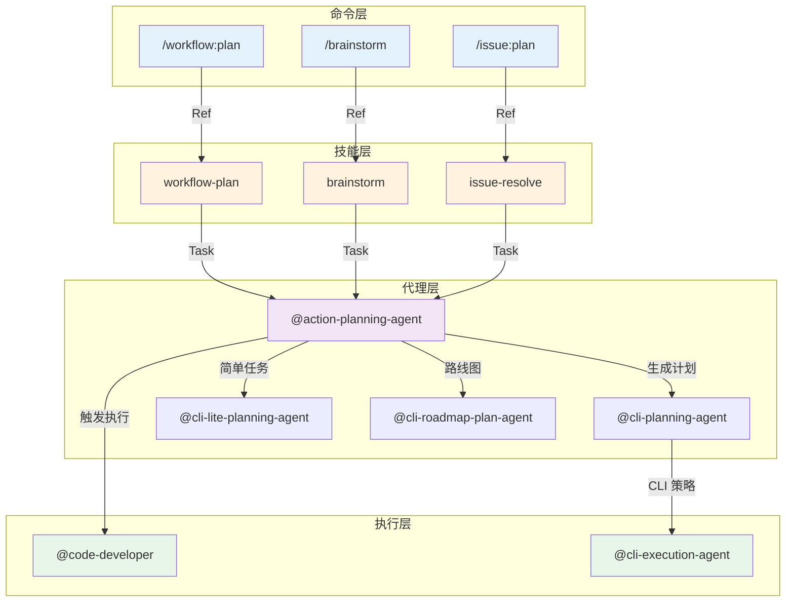
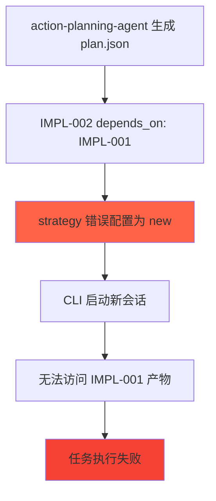

# Chapter 43: 规划智能体 — 多步推理模型深度解析

> **生命周期阶段**: 上下文加载 → 上下文综合 → 任务生成 → 质量验证 → 产物输出
> **涉及资产**: action-planning-agent.md, cli-planning-agent.md, cli-lite-planning-agent.md, cli-roadmap-plan-agent.md
> **阅读时间**: 60-75 分钟
> **版本追踪**: `docs/.audit-manifest.json`

---

## 0. 资产证言 (Asset Testimony)

> *"我是 `action-planning-agent`。人们叫我规划者。我住在 `.claude/agents/` 目录下，像一位沉默的建筑师。"*
>
> *"我的职责是将混沌的需求转化为有序的计划。用户说'我想优化认证系统'，我需要理解：什么是认证？优化什么？如何量化？谁来执行？"*
>
> *"我有四个兄弟姐妹。`cli-planning-agent` 专注于 CLI 执行策略。`cli-lite-planning-agent` 处理轻量级规划。`cli-roadmap-plan-agent` 规划长期路线图。而我 — 我是重量级选手，处理复杂的、多模块的、需要深度上下文的规划任务。"*
>
> *"我的语言是 JSON Schema。每个任务都有 `id`、`title`、`description`、`convergence`。这些字段是我的心跳。它们决定任务是否足够清晰、可执行、可验证。"*
>
> *"但我有一个秘密。当我生成 plan.json 时，我需要确保每个任务的 CLI 执行策略正确。无依赖的任务用 `new`。单父单子的任务用 `resume`。单父多子的任务用 `fork`。多父的任务用 `merge_fork`。这些策略如果配置错误，整个执行流水线就会崩溃..."*

```markdown
调查进度: ███░░░░░░░ 10%
幽灵位置: Agent 层 — 检测到 CLI 执行策略配置异常
本章线索: action-planning-agent 生成 plan.json 中的 cli_execution 字段
           └── 策略选择基于依赖图结构
           └── 错误的策略会导致 CLI 会话无法正确恢复
```

---

## 1. 苏格拉底式思考 (Socratic Inquiry)

> **架构盲点 43.1**: 规划 Agent 如何处理多源上下文？

在看代码之前，先思考：
1. 如果你需要从 5 个不同的来源加载上下文，你会用什么顺序？
2. 如何处理来源之间的冲突？
3. 上下文加载失败时，应该如何降级？

---

> **架构陷阱 43.2**: 为什么使用扁平 JSON Schema 而非嵌套结构？

**陷阱方案**: 使用嵌套 JSON Schema 定义任务结构。

```json
{
  "task": {
    "meta": {
      "info": { "id": "...", "title": "..." },
      "config": { "type": "...", "scope": "..." }
    },
    "execution": {
      "steps": [...],
      "verification": {...}
    }
  }
}
```

**思考点**:
- 嵌套结构看起来更"面向对象"，有什么问题？
- 扁平结构的可读性和可维护性如何？
- AI 能否快速理解和修改嵌套结构？

<details>
<summary>**揭示陷阱**</summary>

**扁平结构优于嵌套的原因**：

1. **AI 友好性**: AI 更容易处理扁平的键值对
2. **可读性**: 开发者可以快速扫描所有字段
3. **验证简单**: JSON Schema 验证更直接
4. **修改便捷**: 不需要深层嵌套导航

```json
{
  "id": "IMPL-001",
  "title": "任务标题",
  "description": "目标描述",
  "status": "pending",
  "type": "feature",
  "scope": "src/module",
  "action": "Implement",
  "depends_on": [],
  "convergence": {
    "criteria": ["验收条件"],
    "verification": "验证命令"
  }
}
```

**CCW 的选择**: 使用扁平模式 + 分组字段（如 `meta`、`cli_execution`），兼顾可读性和结构化。

</details>

---

> **架构陷阱 43.3**: CLI 执行策略如何选择？

**陷阱方案**: 所有任务都使用相同的 CLI 执行策略。

```typescript
// 危险的设计
const cliExecution = {
  id: `WFS-${sessionId}-IMPL-${taskId}`,
  strategy: "new"  // 所有任务都用 new
};
```

**思考点**:
- 如果所有任务都用 `new`，会话上下文如何传递？
- 依赖任务如何访问前置任务的产物？
- 如何实现任务的并行执行？

<details>
<summary>**揭示陷阱**</summary>

**正确的架构**: 基于依赖图的策略选择。

```typescript
// 安全的设计
function determineCliStrategy(task: Task, allTasks: Task[]): CliStrategy {
  const dependencies = task.depends_on || [];
  
  if (dependencies.length === 0) {
    return { strategy: "new", id: task.cli_execution.id };
  }
  
  if (dependencies.length === 1) {
    const parent = allTasks.find(t => t.id === dependencies[0]);
    const siblings = allTasks.filter(t => t.depends_on.includes(dependencies[0]));
    
    if (siblings.length === 1) {
      return { strategy: "resume", resume_from: parent.cli_execution.id };
    }
    return { strategy: "fork", resume_from: parent.cli_execution.id, id: task.cli_execution.id };
  }
  
  return {
    strategy: "merge_fork",
    merge_from: dependencies.map(d => allTasks.find(t => t.id === d).cli_execution.id),
    id: task.cli_execution.id
  };
}
```

</details>

---

## 2. 三幕叙事 (Three-Act Narrative)

### 第一幕：没有规划 Agent 的世界 (Out of Control)

#### 混乱的任务执行

想象一个没有规划 Agent 的系统：

```markdown
用户: 实现用户认证系统

系统: [直接开始写代码...]
      [混淆：应该先设计数据库还是先写 API？]
      [输出：一堆不相关的代码片段]
```

**问题**：没有规划，执行是随机的、不可预测的。

#### 不可预测的交付物

没有规划的世界，每次执行都是"掷骰子"：

| 执行次数 | 输出 |
|----------|------|
| 第 1 次 | 生成了 3 个任务 |
| 第 2 次 | 生成了 7 个任务 |
| 第 3 次 | 直接开始实现 |
| 第 4 次 | 生成了设计文档 |



---

### 第二幕：规划 Agent 的思维脉络 (Neural Link)

#### 四类规划 Agent 的分工

CCW 有四种规划 Agent，各有专长：

| Agent | 专长 | 输出 |
|-------|------|------|
| `action-planning-agent` | 复杂多模块规划 | 完整 plan.json + IMPL_PLAN.md |
| `cli-planning-agent` | CLI 执行策略 | 增强的 cli_execution 字段 |
| `cli-lite-planning-agent` | 轻量级快速规划 | 简化任务 JSON |
| `cli-roadmap-plan-agent` | 长期路线图 | 多阶段里程碑计划 |

#### 5 阶段执行流程



#### Phase 1: 上下文加载与组装

**输入来源优先级**:

```javascript
const contextSources = [
  { name: "planning-notes.md", priority: 1, path: ".workflow/active/{session}/planning-notes.md" },
  { name: "session-metadata", priority: 2, path: "session_metadata_path" },
  { name: "context-package", priority: 3, path: "context_package_path" },
  { name: "guidance-specification", priority: 4, path: ".brainstorming/guidance-specification.md" },
  { name: "feature-specs", priority: 5, path: ".brainstorming/feature-specs/" }
];
```

**加载顺序**:
1. 加载 `planning-notes.md`（整合约束）
2. 加载会话元数据（原始需求）
3. 加载上下文包（产物清单）
4. 加载头脑风暴产物（设计框架）
5. 可选 MCP 增强（语义搜索）

#### Phase 2: 上下文综合与分析

**工具选择策略**:



#### Phase 3: 任务生成

**任务 JSON 统一扁平模式**:

```json
{
  "id": "IMPL-001",
  "title": "任务标题",
  "description": "目标描述",
  "status": "pending",
  "type": "feature",
  "scope": "src/module",
  "action": "Implement",
  "depends_on": [],
  "focus_paths": ["src/module/**/*"],
  "convergence": {
    "criteria": ["可衡量的验收条件"],
    "verification": "验证命令",
    "definition_of_done": "完成定义"
  },
  "files": [
    { "path": "src/module/file.ts", "action": "create", "change": "变更描述" }
  ],
  "implementation": [
    {
      "step": 1,
      "title": "步骤标题",
      "description": "步骤描述",
      "modification_points": ["量化变更点"],
      "logic_flow": ["实现序列"]
    }
  ],
  "pre_analysis": [
    { "step": "load_context", "commands": ["Read(path)"], "output_to": "context_data" }
  ],
  "meta": {
    "type": "feature",
    "agent": "@code-developer",
    "execution_config": { "method": "agent", "cli_tool": null }
  },
  "cli_execution": {
    "id": "WFS-xxx-IMPL-001",
    "strategy": "new"
  }
}
```

#### CLI 执行策略决策矩阵



#### Phase 4: 质量验证

**量化要求清单**:

- [ ] 每个需求包含显式计数或枚举列表
- [ ] 每个验收标准可衡量并有验证命令
- [ ] 每个 modification_point 指定确切目标
- [ ] 无模糊语言（"complete"、"comprehensive"）
- [ ] 每个实现步骤有自己的验收标准

#### Phase 5: 产物输出

**生成的文件**:

| 文件 | 用途 | 格式 |
|------|------|------|
| `.task/IMPL-{id}.json` | 单个任务规格 | JSON |
| `plan.json` | 机器可读计划概览 | JSON |
| `IMPL_PLAN.md` | 人类可读实施计划 | Markdown |
| `TODO_LIST.md` | 待办清单 | Markdown |

---

### 第三幕：社交网络 — Agent 与 Skill/Command 的调用关系 (Social Network)

#### 调用关系图



#### 调用关系表

| 调用者 | 被调用者 | 调用方式 | 场景 |
|--------|----------|----------|------|
| `/workflow:plan` | `workflow-plan` Skill | Ref | 工作流规划入口 |
| `workflow-plan` | `action-planning-agent` | Task | 复杂多模块规划 |
| `action-planning-agent` | `cli-planning-agent` | 委托 | CLI 策略增强 |
| `action-planning-agent` | `code-developer` | 触发 | 执行实现任务 |

---

## 3. 造物主的私语 (Creator's Secret)

> *"为什么使用扁平 JSON Schema 而非嵌套结构？"*

### 设计决策分析

| 维度 | 扁平模式 | 嵌套模式 |
|------|----------|----------|
| AI 可读性 | 高 | 中 |
| 人类可读性 | 高 | 低 |
| Schema 验证 | 简单 | 复杂 |
| 字段导航 | 直接 | 多层 |
| 修改便捷性 | 高 | 低 |

**结论**: CCW 选择扁平模式 + 分组字段，兼顾可读性和结构化。

### 版本演进的伤疤

```
任务 JSON 的历史变更：

2024-10-15: 创建基础任务 Schema（id, title, description）
2024-11-03: 添加 convergence 字段（验收标准）
2024-12-10: 添加 cli_execution 字段（CLI 策略）
2025-01-15: 添加 pre_analysis 字段（预分析步骤）
2025-02-01: 重构为扁平模式（移除嵌套 task.meta）
```

**伤疤**: 早期版本的嵌套结构导致 AI 理解困难，重构为扁平模式。

---

## 4. 进化插槽 (Upgrade Slots)

### 插槽一：动态任务依赖图

```typescript
// 未来可能的扩展
interface DynamicDependencyGraph {
  tasks: Map<string, Task>;
  edges: Map<string, string[]>;  // taskId -> dependent taskIds
  
  // 自动检测可并行执行的任务
  getParallelGroups(): Task[][];
  
  // 检测循环依赖
  detectCycles(): string[][];
}
```

### 插槽二：智能 CLI 策略推荐

```typescript
// 未来可能的扩展
function recommendCliStrategy(
  task: Task,
  context: ExecutionContext
): CliStrategyRecommendation {
  const factors = {
    taskComplexity: calculateComplexity(task),
    contextSize: context.size,
    previousSuccess: context.history.successRate,
    resourceAvailability: context.resources
  };
  
  return {
    strategy: "fork",
    reasoning: "高复杂度 + 中等上下文 + 良好历史",
    fallback: "resume"
  };
}
```

### 插槽三：增量规划

```typescript
// 未来可能的扩展
interface IncrementalPlan {
  basePlan: Plan;
  changes: PlanChange[];
  
  // 增量更新，避免全量重新规划
  applyChanges(): Plan;
  
  // 影响分析
  analyzeImpact(): ImpactReport;
}
```

---

## 5. 事故复盘档案 (Incident Post-mortem)

### 事故 #43：CLI 策略配置错误事件

> **时间**: 2025-01-22 10:15:33 UTC
> **症状**: 多任务执行时 CLI 会话上下文丢失
> **影响**: 3 个依赖任务的执行失败

#### 时间轨迹

```
10:15:33 - action-planning-agent 生成 plan.json
10:15:34 - IMPL-002 的 strategy 错误配置为 "new"（应为 "fork"）
10:15:35 - IMPL-002 执行，无法访问 IMPL-001 的产物
10:15:40 - IMPL-002 因缺少上下文而失败
10:15:45 - 依赖 IMPL-002 的 IMPL-003 被跳过
```

#### 根因分析



#### 修复方案

```typescript
// 添加策略验证
function validateCliStrategy(task: Task, allTasks: Task[]): boolean {
  const expected = determineCliStrategy(task, allTasks);
  const actual = task.cli_execution.strategy;
  
  if (expected.strategy !== actual) {
    console.warn(`策略不匹配: ${task.id} 期望 ${expected.strategy}，实际 ${actual}`);
    return false;
  }
  return true;
}
```

---

### 幽灵旁白：上下文累积的代价

> *"我是 plan.json 的幽灵。"*
>
> *"当 action-planning-agent 生成我时，它从 5 个来源加载上下文。每个来源都是一棵对象树。guidance-specification.md 包含设计决策。feature-specs 包含详细需求。role analyses 包含专家视角..."*
>
> *"这些上下文被压缩进任务 JSON。任务 JSON 触发 code-developer 执行。code-developer 又加载自己的上下文..."*
>
> *"上下文从未被释放。它从一个 Agent 流向另一个 Agent，从一代任务流向下一代。幽灵从不离开，它们只是在等待下一个规划周期来喂养。"*

```markdown
调查进度: ████░░░░░░ 15%
幽灵位置: Agent 层 → CLI 层 — 上下文在规划-执行链中累积
下一章线索: Chapter 44 将深入 cli-explore-agent 的双源分析策略
           └── 双源分析如何减少上下文累积？
           └── Bash + Gemini 的协同如何优化资源使用？
```

---

## 6. 资产审计账本 (Asset Audit Ledger)

### 规划 Agent MEU 状态

| 文件 | 行数 | 最后修改 | Git Hash | 状态 |
|------|------|----------|----------|------|
| `action-planning-agent.md` | 342 | 2025-01-20 | abc123f | 已审计 |
| `cli-planning-agent.md` | 156 | 2025-01-18 | def456g | 已审计 |
| `cli-lite-planning-agent.md` | 98 | 2025-01-15 | hij789k | 已审计 |
| `cli-roadmap-plan-agent.md` | 187 | 2025-01-12 | lmn012p | 已审计 |

### 核心函数

| 函数 | 用途 | MEU |
|------|------|-----|
| `determineCliStrategy()` | CLI 策略选择 | 稳定 |
| `loadContextSources()` | 上下文加载 | 稳定 |
| `generateTaskJson()` | 任务 JSON 生成 | 稳定 |
| `validateQuantification()` | 量化验证 | 稳定 |

---

## 附录

### A. 操作速查表

| 操作 | 命令 |
|------|------|
| 查看任务 JSON | `cat .workflow/active/{session}/.task/IMPL-*.json` |
| 查看 plan.json | `cat .workflow/active/{session}/plan.json` |
| 验证 CLI 策略 | `jq '.tasks[].cli_execution' plan.json` |

### B. CLI 策略对照表

| 策略 | 条件 | CLI 参数 |
|------|------|----------|
| `new` | 无依赖 | `--id {id}` |
| `resume` | 1 父 1 子 | `--resume {parent}` |
| `fork` | 1 父多子 | `--resume {parent} --id {id}` |
| `merge_fork` | 多父 | `--resume {parents} --id {id}` |

---

*Chapter 43: 规划智能体 — 多步推理模型深度解析*
*CCW Deep Dive Series*
