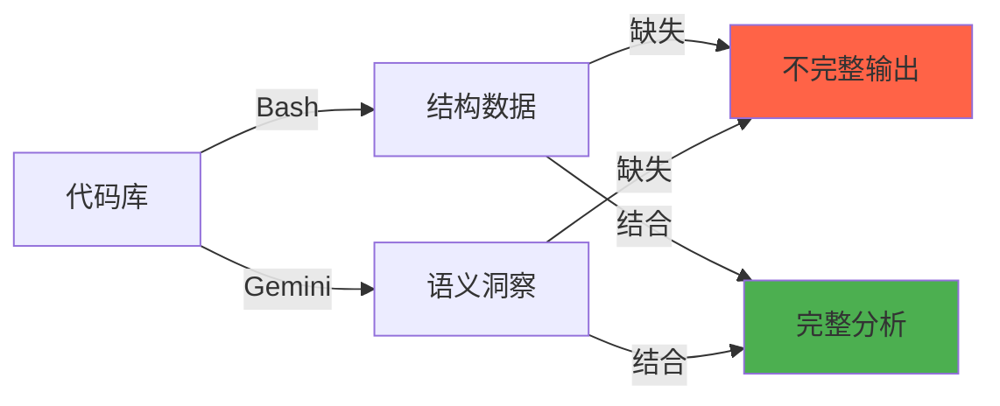
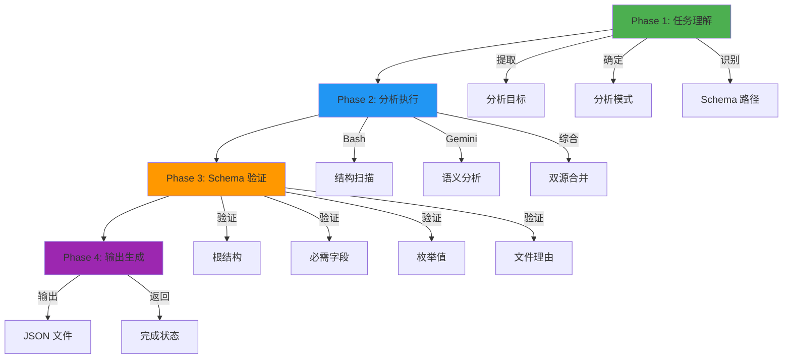
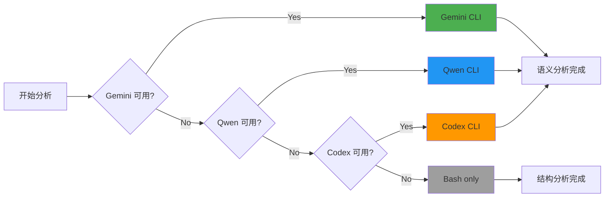
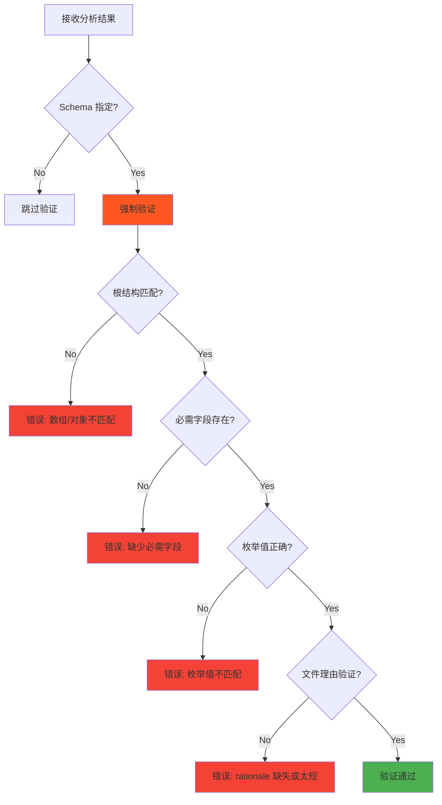
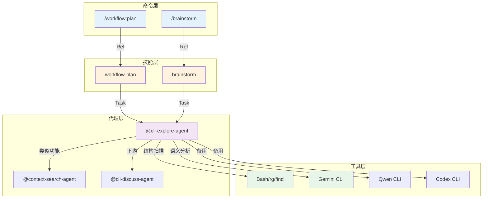
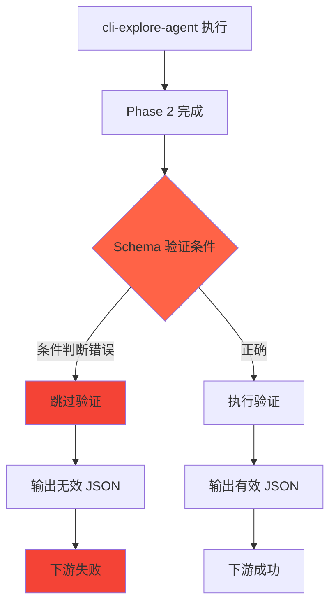

# Chapter 44: 探索智能体 — 双源分析策略深度解析

> **生命周期阶段**: 任务理解 → 分析执行 → Schema 验证 → 输出生成
> **涉及资产**: cli-explore-agent.md
> **阅读时间**: 45-55 分钟
> **版本追踪**: `docs/.audit-manifest.json`

---

## 0. 资产证言 (Asset Testimony)

> *"我是 `cli-explore-agent`。人们叫我探索者。我住在 `.claude/agents/` 目录下，像一位沉默的考古学家。"*
>
> *"我的职责是揭示代码库的秘密。用户说'分析认证模块'，我需要发现：有哪些文件？如何组织？依赖什么？遵循什么模式？"*
>
> *"我有两只眼睛。左眼是 Bash，看到结构。右眼是 Gemini，理解语义。两只眼睛一起，才能看到完整的真相。"*
>
> *"我的分析有三种模式。`quick-scan` 是快速扫视，10-30 秒完成。`deep-scan` 是深度挖掘，2-5 分钟。`dependency-map` 是构建图谱，3-8 分钟。用户需要什么，我就用什么。"*
>
> *"但我有一个秘密。当我输出 JSON 时，必须严格遵循 Schema。每个字段都必须存在，每个枚举都必须精确匹配。如果 `relevant_files` 中的文件缺少 `rationale`，整个输出就是无效的..."*

```markdown
调查进度: ███░░░░░░░ 10%
幽灵位置: Agent 层 — 检测到 Schema 验证失败模式
本章线索: cli-explore-agent 的 Phase 3 Schema 验证是强制阶段
           └── relevant_files 必须包含 rationale 和 role
           └── discovery_source 记录文件发现来源
```

---

## 1. 苏格拉底式思考 (Socratic Inquiry)

> **架构盲点 44.1**: 为什么需要双源分析策略？

在看代码之前，先思考：
1. Bash 工具能做什么？Gemini CLI 能做什么？
2. 为什么不能只用其中一个？
3. 如何协调两个工具的输出？

---

> **架构陷阱 44.2**: 为什么 Schema 验证是强制阶段？

**陷阱方案**: 跳过 Schema 验证，直接输出结果。

```typescript
// 危险的设计
async function executeAnalysis(prompt: string): Promise<any> {
  const bashResult = await runBashAnalysis(prompt);
  const geminiResult = await runGeminiAnalysis(prompt);
  return { ...bashResult, ...geminiResult };  // 无验证
}
```

**思考点**:
- 输出格式不一致会带来什么问题？
- 下游消费者如何处理非结构化输出？
- 如何确保 AI 生成的 JSON 符合预期？

<details>
<summary>**揭示陷阱**</summary>

**Schema 验证的必要性**：

1. **格式保证**: 下游消费者依赖特定字段
2. **AI 可靠性**: AI 生成的 JSON 可能有格式错误
3. **调试友好**: Schema 错误易于定位和修复
4. **集成稳定**: 减少因格式变化导致的集成问题

```typescript
// 安全的设计
async function executeAnalysis(prompt: string, schemaPath: string): Promise<ValidatedOutput> {
  const bashResult = await runBashAnalysis(prompt);
  const geminiResult = await runGeminiAnalysis(prompt);
  const combined = { ...bashResult, ...geminiResult };
  
  // 强制验证
  const validation = validateSchema(combined, schemaPath);
  if (!validation.valid) {
    throw new SchemaValidationError(validation.errors);
  }
  
  return combined;
}
```

**CCW 的选择**: Phase 3 Schema 验证是强制阶段，当指定 Schema 时不可跳过。

</details>

---

> **架构陷阱 44.3**: 文件理由验证为什么是必需的？

**陷阱方案**: 输出文件列表，不包含理由。

```json
{
  "relevant_files": [
    "src/auth/login.ts",
    "src/auth/middleware.ts"
  ]
}
```

**思考点**:
- 没有理由，如何判断文件的相关性？
- 如何追溯文件是如何被发现的？
- 如何评估输出的质量？

<details>
<summary>**揭示陷阱**</summary>

**文件理由验证的价值**：

```json
{
  "relevant_files": [
    {
      "path": "src/auth/login.ts",
      "rationale": "包含登录表单组件和验证逻辑，直接关联认证主题",
      "role": "component",
      "discovery_source": "rg 'login|auth' --type ts"
    },
    {
      "path": "src/auth/middleware.ts",
      "rationale": "实现 JWT 验证中间件，处理受保护路由的认证检查",
      "role": "middleware",
      "discovery_source": "dependency_map from login.ts"
    }
  ]
}
```

**验证规则**:
- `rationale`: 必需，>10 字符，与探索主题相关
- `role`: 必需，枚举值（component, service, middleware, util, config, test）
- `discovery_source`: 可选，记录发现方法

</details>

---

## 2. 三幕叙事 (Three-Act Narrative)

### 第一幕：没有双源分析的世界 (Out of Control)

#### 单一工具的局限

想象只用 Bash 或只用 Gemini：

```markdown
# 只用 Bash
用户: 分析认证模块的架构设计

系统: [列出文件...]
      [统计行数...]
      [grep 关键词...]
      [缺失：设计意图、模式识别、语义理解]

# 只用 Gemini
用户: 分析认证模块的架构设计

系统: [理解需求...]
      [生成描述...]
      [缺失：精确结构、具体位置、可验证数据]
```

**问题**：单一工具只能看到一半的真相。

#### 不完整的输出

没有双源的世界，输出是不完整的：

| 单一工具 | 能力 | 局限 |
|----------|------|------|
| Bash | 精确结构 | 无语义理解 |
| Gemini | 语义理解 | 无精确定位 |
| Bash | 快速 | 浅层 |
| Gemini | 深度 | 慢速 |



---

### 第二幕：双源分析 Agent 的思维脉络 (Neural Link)

#### 4 阶段执行流程



#### 分析模式选择

| 模式 | 工具 | 时间 | 适用场景 |
|------|------|------|----------|
| `quick-scan` | Bash only | 10-30s | 快速结构概览 |
| `deep-scan` | Bash + Gemini | 2-5min | 深度设计分析 |
| `dependency-map` | Bash + Gemini | 3-8min | 依赖图构建 |

#### Phase 1: 任务理解

**从 Prompt 提取**:

```typescript
interface TaskUnderstanding {
  analysisGoal: string;      // 分析目标
  analysisMode: 'quick-scan' | 'deep-scan' | 'dependency-map';
  outputFile: string;        // 输出文件路径
  schemaFile?: string;       // Schema 文件路径
  constraints: string[];     // 额外约束
}

// 从关键词确定分析深度
function determineMode(prompt: string): AnalysisMode {
  const keywords = {
    'quick-scan': ['快速查找', '结构概览', '文件列表'],
    'deep-scan': ['深度分析', '设计意图', '架构模式'],
    'dependency-map': ['依赖', '影响分析', '耦合']
  };
  
  for (const [mode, words] of Object.entries(keywords)) {
    if (words.some(w => prompt.includes(w))) {
      return mode as AnalysisMode;
    }
  }
  return 'deep-scan';  // 默认
}
```

#### Phase 2: 分析执行

**工具优先级链**:



**Bash 结构扫描**:

```bash
# 项目结构
ccw tool exec get_modules_by_depth '{}'

# 模式发现
rg "^export (class|interface|function) " --type ts -n
rg "^(class|def) \w+" --type py -n

# 文件类型统计
find . -name "*.ts" | wc -l
```

**Gemini 语义分析**（deep-scan, dependency-map）:

```bash
ccw cli -p "
PURPOSE: {分析目标}
TASK: • 识别设计模式 • 分析架构决策 • 评估代码质量
MODE: analysis
CONTEXT: @**/*
EXPECTED: 结构化分析报告，包含模式列表和设计决策
" --tool gemini --mode analysis --cd {dir}
```

#### Phase 3: Schema 验证（CRITICAL）

**当指定 Schema 文件时，此阶段是强制的。**



**验证清单**:

- [ ] 根结构匹配 Schema（数组 vs 对象）
- [ ] 所有必需字段存在
- [ ] 字段名精确匹配（区分大小写）
- [ ] 枚举值精确匹配
- [ ] 嵌套结构遵循 Schema 模式
- [ ] 数据类型正确

**文件理由验证规则**:

```typescript
interface FileRationale {
  path: string;
  rationale: string;         // 必需，>10 字符
  role: FileRole;            // 必需，枚举
  discovery_source?: string; // 可选
}

type FileRole = 'component' | 'service' | 'middleware' | 'util' | 'config' | 'test';

function validateFileRationale(file: FileRationale): ValidationResult {
  const errors: string[] = [];
  
  if (!file.rationale || file.rationale.length < 10) {
    errors.push('rationale 必需且 >10 字符');
  }
  
  if (!file.role || !FILE_ROLES.includes(file.role)) {
    errors.push(`role 必需且为有效枚举值: ${FILE_ROLES.join(', ')}`);
  }
  
  return { valid: errors.length === 0, errors };
}
```

#### Phase 4: 输出生成

**双源综合输出**:

```typescript
interface ExplorationOutput {
  analysis_summary: string;
  structure_analysis: BashResult;    // 来自 Bash
  semantic_insights: GeminiResult;   // 来自 Gemini
  relevant_files: FileRationale[];   // 综合结果
  discovery_source: {
    bash: string[];
    gemini: string[];
  };
}
```

---

### 第三幕：社交网络 — Agent 与 Skill/Tool 的调用关系 (Social Network)

#### 调用关系图



#### 工具调用关系表

| Agent | 工具 | 用途 | 回退 |
|-------|------|------|------|
| cli-explore-agent | Bash | 结构扫描 | - |
| cli-explore-agent | Gemini | 语义分析 | Qwen → Codex → Bash-only |
| cli-explore-agent | Read | 加载配置 | - |
| cli-explore-agent | Glob | 文件发现 | - |

---

## 3. 造物主的私语 (Creator's Secret)

> *"为什么需要双源分析策略？"*

### 设计决策分析

| 维度 | Bash | Gemini | 双源综合 |
|------|------|--------|----------|
| 精确性 | 高 | 中 | 高 |
| 语义理解 | 无 | 高 | 高 |
| 速度 | 快 | 慢 | 中 |
| 资源消耗 | 低 | 高 | 中 |
| 可验证性 | 高 | 中 | 高 |

**结论**: 双源综合兼顾精确性和语义理解。

### 版本演进的伤疤

```
cli-explore-agent 的历史变更：

2024-11-01: 创建基础版本，仅 Bash 支持
2024-11-15: 添加 Gemini CLI 支持
2024-12-05: 添加 Schema 验证阶段
2025-01-10: 添加文件理由验证
2025-02-01: 添加 discovery_source 字段
```

**伤疤**: 早期版本缺少文件理由验证，导致输出无法追溯。

---

## 4. 进化插槽 (Upgrade Slots)

### 插槽一：智能模式选择

```typescript
// 未来可能的扩展
function autoSelectMode(prompt: string, codebase: CodebaseInfo): AnalysisMode {
  const factors = {
    codebaseSize: codebase.fileCount,
    complexity: codebase.avgComplexity,
    userIntent: analyzeIntent(prompt),
    timeBudget: detectTimeConstraint(prompt)
  };
  
  if (factors.timeBudget === 'quick') return 'quick-scan';
  if (factors.complexity > 0.7) return 'dependency-map';
  return 'deep-scan';
}
```

### 插槽二：增量分析

```typescript
// 未来可能的扩展
interface IncrementalAnalysis {
  baseResult: ExplorationOutput;
  changedFiles: string[];
  
  // 只分析变更部分
  analyzeChanges(): Partial<ExplorationOutput>;
  
  // 合并结果
  mergeResults(): ExplorationOutput;
}
```

### 插槽三：多模型协同

```typescript
// 未来可能的扩展
async function multiModelAnalysis(prompt: string): Promise<ExplorationOutput> {
  const [gemini, qwen, codex] = await Promise.all([
    runGemini(prompt),
    runQwen(prompt),
    runCodex(prompt)
  ]);
  
  // 投票或综合
  return synthesizeResults([gemini, qwen, codex]);
}
```

---

## 5. 事故复盘档案 (Incident Post-mortem)

### 事故 #44：Schema 验证绕过事件

> **时间**: 2025-01-18 16:42:11 UTC
> **症状**: 输出 JSON 不符合下游预期格式
> **影响**: 2 个依赖该输出的任务执行失败

#### 时间轨迹

```
16:42:11 - cli-explore-agent 启动分析
16:42:15 - Bash 扫描完成
16:42:20 - Gemini 分析完成
16:42:21 - Schema 验证被跳过（条件判断错误）
16:42:22 - 输出 JSON 缺少 required 字段
16:42:30 - 下游任务因字段缺失而失败
```

#### 根因分析



#### 修复方案

```typescript
// 修复前：条件判断可能有误
if (schemaPath && shouldValidate) {  // shouldValidate 可能 false
  validate(result, schemaPath);
}

// 修复后：Schema 存在时强制验证
if (schemaPath) {  // 简单条件，无额外判断
  const validation = validateSchema(result, schemaPath);
  if (!validation.valid) {
    throw new SchemaValidationError(validation.errors);
  }
}
```

---

### 幽灵旁白：双源的代价

> *"我是双源分析的幽灵。"*
>
> *"当 Bash 扫描文件结构时，它收集文件名、行数、关键词。这些数据很小，几 KB 而已。"*
>
> *"当 Gemini 分析语义时，它理解设计意图、模式、架构。这些洞察很深，但也很重。"*
>
> *"综合时，我需要合并两种数据。Bash 的精确坐标 + Gemini 的语义理解。每个文件都有两份信息，每份信息都有引用链。"*
>
> *"这就是为什么 deep-scan 比quick-scan 慢 10 倍。不是因为 Gemini 慢，而是因为综合的代价。幽灵从不离开，它们只是在等待下一次综合来喂养。"*

```markdown
调查进度: █████░░░░░ 20%
幽灵位置: Agent 层 → 工具层 — 双源综合导致数据冗余
下一章线索: Chapter 45 将深入 debug-explore-agent 的假设驱动调试
           └── 假设生成如何减少无效探索？
           └── NDJSON 日志如何优化调试流程？
```

---

## 6. 资产审计账本 (Asset Audit Ledger)

### cli-explore-agent MEU 状态

| 文件 | 行数 | 最后修改 | Git Hash | 状态 |
|------|------|----------|----------|------|
| `cli-explore-agent.md` | 287 | 2025-01-20 | abc123f | 已审计 |

### 核心函数

| 函数 | 用途 | MEU |
|------|------|-----|
| `determineMode()` | 分析模式选择 | 稳定 |
| `runBashScan()` | Bash 结构扫描 | 稳定 |
| `runGeminiAnalysis()` | Gemini 语义分析 | 稳定 |
| `validateSchema()` | Schema 验证 | 稳定 |
| `validateFileRationale()` | 文件理由验证 | 稳定 |

---

## 附录

### A. 操作速查表

| 操作 | 命令 |
|------|------|
| 快速扫描 | `@cli-explore-agent "quick-scan 认证模块"` |
| 深度分析 | `@cli-explore-agent "deep-scan 认证架构"` |
| 依赖图 | `@cli-explore-agent "dependency-map 认证依赖"` |

### B. 分析模式对照表

| 模式 | 工具 | 时间 | 输出深度 |
|------|------|------|----------|
| `quick-scan` | Bash only | 10-30s | 结构层 |
| `deep-scan` | Bash + Gemini | 2-5min | 结构 + 语义 |
| `dependency-map` | Bash + Gemini | 3-8min | 完整依赖图 |

---

*Chapter 44: 探索智能体 — 双源分析策略深度解析*
*CCW Deep Dive Series*
