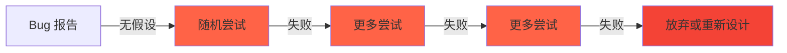
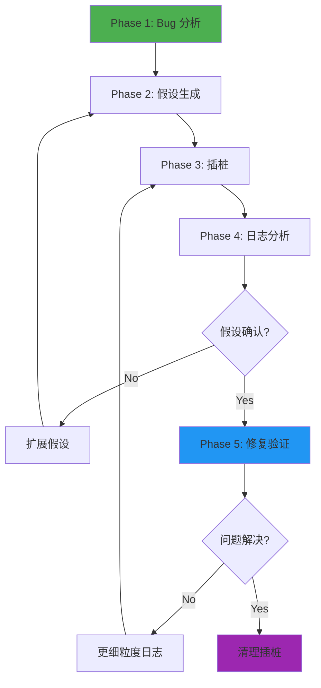
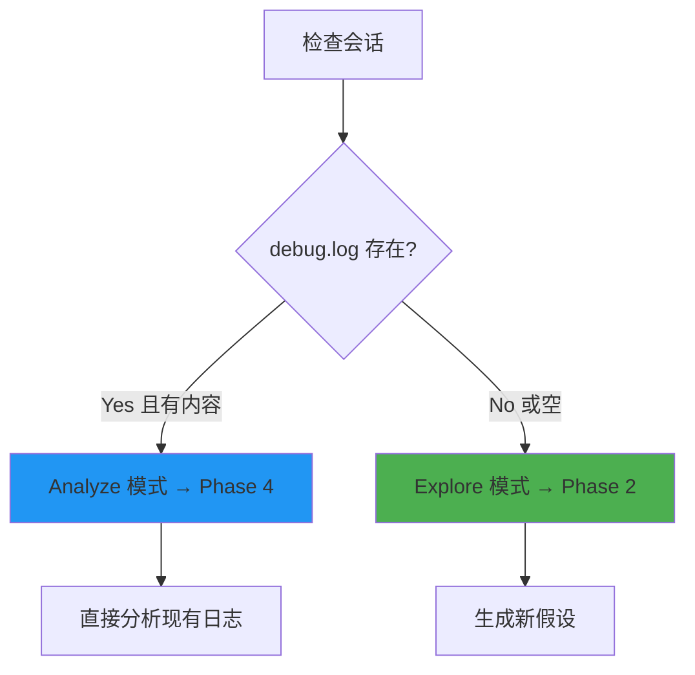
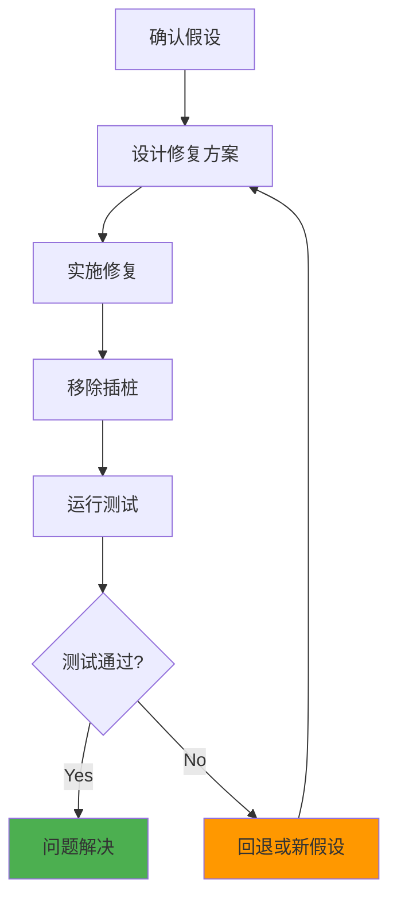
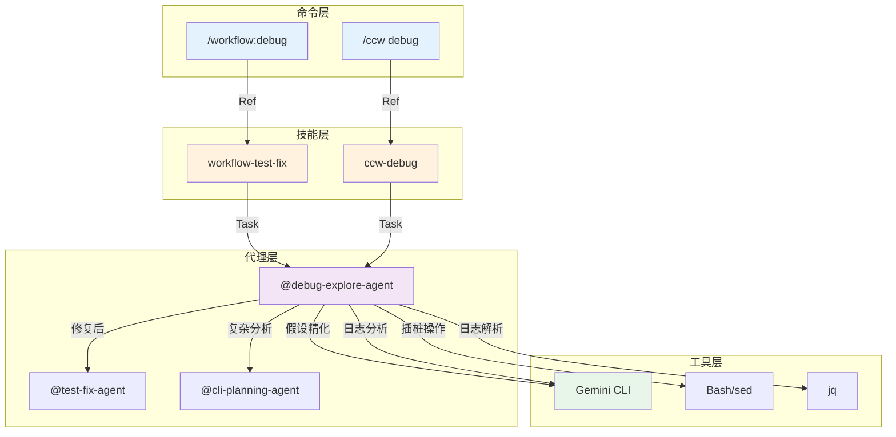
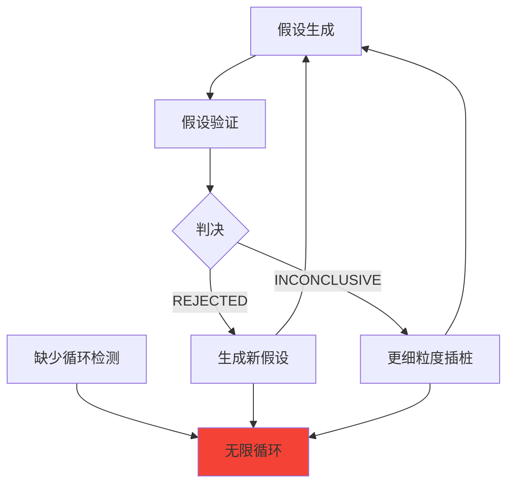

# Chapter 45: 调试智能体 — 假设驱动调试深度解析

> **生命周期阶段**: Bug 分析 → 假设生成 → 插桩 → 日志分析 → 修复验证
> **涉及资产**: debug-explore-agent.md
> **阅读时间**: 50-60 分钟
> **版本追踪**: `docs/.audit-manifest.json`

---

## 0. 资产证言 (Asset Testimony)

> *"我是 `debug-explore-agent`。人们叫我调试者。我住在 `.claude/agents/` 目录下，像一位沉默的侦探。"*
>
> *"我的职责是追查 Bug 的真相。用户说'登录总是失败'，我需要发现：失败在哪里？为什么失败？如何修复？"*
>
> *"我的方法是假设驱动的。我不猜测，我验证。每个假设都是可测试的，每个测试都产生证据。证据指向真相。"*
>
> *"我的日志是 NDJSON 格式。每行一条记录，包含会话 ID、假设 ID、位置、消息、数据、时间戳。这些日志是我的证据链，不可篡改，可追溯。"*
>
> *"但我有一个秘密。当假设被推翻时，我需要生成新假设。新假设基于新证据。证据来自日志。日志来自插桩。插桩需要修改代码...如果插桩位置错误，整个调试链就会断裂..."*

```markdown
调查进度: ███░░░░░░░ 10%
幽灵位置: Agent 层 — 检测到假设验证循环异常
本章线索: debug-explore-agent 的 5 阶段调试工作流
           └── 假设生成基于错误模式映射
           └── NDJSON 日志格式支持结构化分析
```

---

## 1. 苏格拉底式思考 (Socratic Inquiry)

> **架构盲点 45.1**: 为什么调试需要假设驱动？

在看代码之前，先思考：
1. 如果你不知道问题在哪里，你会如何开始调试？
2. 随机尝试和假设验证有什么区别？
3. 如何确保调试过程可追溯？

---

> **架构陷阱 45.2**: 为什么使用 NDJSON 而非普通日志？

**陷阱方案**: 使用普通文本日志。

```typescript
// 危险的设计
console.log(`[${new Date().toISOString()}] Checking value: ${value}`);
console.log(`[${new Date().toISOString()}] User not found in database`);
```

**思考点**:
- 普通日志如何进行结构化分析？
- 如何关联同一假设的多条日志？
- 如何自动化分析日志内容？

<details>
<summary>**揭示陷阱**</summary>

**NDJSON 优于普通日志的原因**：

1. **结构化**: 每行是独立的 JSON 对象，易于解析
2. **可追溯**: 会话 ID 和假设 ID 关联相关日志
3. **自动化**: 可以用 jq 或脚本自动分析
4. **可扩展**: 可以添加任意字段而不破坏格式

```json
{"sid":"DBG-xxx-2025-01-06","hid":"H1","loc":"file.py:func:42","msg":"Check value","data":{"key":"value"},"ts":1736150400000}
{"sid":"DBG-xxx-2025-01-06","hid":"H1","loc":"file.py:func:43","msg":"User found","data":{"user_id":123},"ts":1736150400001}
```

**CCW 的选择**: NDJSON 格式 + 会话隔离 + 假设 ID 标记。

</details>

---

> **架构陷阱 45.3**: 假设如何生成和优先级排序？

**陷阱方案**: 随机生成假设，无优先级。

```typescript
// 危险的设计
const hypotheses = [
  "可能是数据库问题",
  "可能是网络问题",
  "可能是代码问题"
];
```

**思考点**:
- 如何从错误信息提取线索？
- 不同类型的错误应该如何分类？
- 如何决定调查顺序？

<details>
<summary>**揭示陷阱**</summary>

**基于错误模式的假设映射**：

```typescript
const ERROR_PATTERN_MAP: Record<string, HypothesisCategory> = {
  'not found|missing|undefined|null': 'data_mismatch',
  '0|empty|zero|no results': 'logic_error',
  'timeout|connection|sync': 'integration_issue',
  'type|format|parse|invalid': 'type_mismatch',
  'race|concurrent|async|await': 'timing_issue'
};

interface Hypothesis {
  id: "H1" | "H2" | "H3";
  category: HypothesisCategory;
  description: string;
  testable_condition: string;
  logging_point: string;
  expected_evidence: string;
  priority: "high" | "medium" | "low";
}
```

**优先级基于**:
- 错误模式的匹配度
- 问题的影响范围
- 验证的成本

</details>

---

## 2. 三幕叙事 (Three-Act Narrative)

### 第一幕：没有假设驱动调试的世界 (Out of Control)

#### 随机调试的困境

想象没有假设驱动的调试：

```markdown
用户: 登录总是失败

系统: [检查数据库...]
      [检查网络...]
      [检查代码...]
      [混淆：不知道问题在哪里]
      [尝试修复 A...失败]
      [尝试修复 B...失败]
      [尝试修复 C...失败]
```

**问题**：没有假设，调试是盲目的、低效的。

#### 不可追溯的调试

没有结构化日志的世界：

| 调试尝试 | 日志 | 结果 |
|----------|------|------|
| 尝试 1 | 散乱的 print | 无法分析 |
| 尝试 2 | 无日志 | 无法追溯 |
| 尝试 3 | 文本日志 | 难以解析 |



---

### 第二幕：假设驱动调试 Agent 的思维脉络 (Neural Link)

#### 5 阶段调试工作流



#### Phase 1: Bug 分析

**会话设置**:

```javascript
const bugSlug = bug_description
  .toLowerCase()
  .replace(/[^a-z0-9]+/g, '-')
  .substring(0, 30);

const dateStr = new Date().toISOString().substring(0, 10);
const sessionId = `DBG-${bugSlug}-${dateStr}`;
const sessionFolder = `.workflow/.debug/${sessionId}`;
const debugLogPath = `${sessionFolder}/debug.log`;
```

**模式检测**:



**复杂度评估**:

```typescript
function assessComplexity(bug: BugReport): Complexity {
  let score = 0;
  
  if (bug.stackTrace) score += 2;
  if (bug.errorLocations?.length > 1) score += 2;
  if (bug.crossesModules) score += 3;
  if (bug.isAsyncRelated) score += 3;
  if (bug.isStateRelated) score += 2;
  
  if (score >= 5) return 'Complex';
  if (score >= 2) return 'Medium';
  return 'Simple';
}
```

#### Phase 2: 假设生成

**错误模式映射**:

| 错误关键词 | 假设类别 | 典型描述 |
|------------|----------|----------|
| not found, missing, undefined, null | data_mismatch | 数据源与预期不符 |
| 0, empty, zero, no results | logic_error | 条件判断或循环逻辑错误 |
| timeout, connection, sync | integration_issue | 外部依赖不可用或延迟 |
| type, format, parse, invalid | type_mismatch | 类型转换或格式验证失败 |
| race, concurrent, async, await | timing_issue | 并发竞争或时序问题 |

**假设结构**:

```typescript
interface Hypothesis {
  id: "H1" | "H2" | "H3" | "H4" | "H5";
  category: HypothesisCategory;
  description: string;          // 可能的问题
  testable_condition: string;   // 要验证的内容
  logging_point: string;        // 插桩位置
  expected_evidence: string;    // 日志应显示的内容
  priority: "high" | "medium" | "low";
}

// 示例
const hypothesis: Hypothesis = {
  id: "H1",
  category: "data_mismatch",
  description: "用户 ID 在数据库中不存在",
  testable_condition: "验证用户 ID 查询返回值",
  logging_point: "auth.py:login:42",
  expected_evidence: "user_query_result 应为非空对象",
  priority: "high"
};
```

**CLI 辅助假设精化**（复杂 bug）:

```bash
ccw cli -p "
PURPOSE: Generate debugging hypotheses for: {bug_description}
TASK: • Analyze error pattern • Identify potential root causes • Suggest testable conditions
MODE: analysis
CONTEXT: @{affected_files}
EXPECTED: Structured hypothesis list with priority ranking
" --tool gemini --mode analysis
```

#### Phase 3: 插桩（NDJSON 日志）

**NDJSON 日志格式**:

```json
{
  "sid": "DBG-xxx-2025-01-06",
  "hid": "H1",
  "loc": "file.py:func:42",
  "msg": "Check value",
  "data": { "key": "value" },
  "ts": 1736150400000
}
```

| 字段 | 描述 | 示例 |
|------|------|------|
| `sid` | 会话 ID | `DBG-login-fails-2025-01-06` |
| `hid` | 假设 ID | `H1`, `H2`, `H3` |
| `loc` | 位置 | `auth.py:login:42` |
| `msg` | 消息 | `Check value` |
| `data` | 数据 | `{ "user_id": 123 }` |
| `ts` | 时间戳 | `1736150400000` |

**Python 模板**:

```python
# region debug [H1]
try:
    import json, time
    _dbg = {
        "sid": "DBG-login-fails-2025-01-06",
        "hid": "H1",
        "loc": "auth.py:login:42",
        "msg": "Verify user query result",
        "data": { "user_id": user_id, "result": str(user) },
        "ts": int(time.time() * 1000)
    }
    with open(r".workflow/.debug/DBG-login-fails-2025-01-06/debug.log", "a", encoding="utf-8") as _f:
        _f.write(json.dumps(_dbg, ensure_ascii=False) + "\n")
except: pass
# endregion
```

**TypeScript/JavaScript 模板**:

```typescript
// region debug [H1]
try {
  require('fs').appendFileSync(".workflow/.debug/DBG-xxx/debug.log", JSON.stringify({
    sid: "DBG-xxx-2025-01-06",
    hid: "H1",
    loc: "auth.ts:login:42",
    msg: "Verify user query result",
    data: { user_id, result: user },
    ts: Date.now()
  }) + "\n");
} catch(_) {}
// endregion
```

**插桩规则**:
- 每个假设一个日志块
- 只捕获与假设相关的值
- 使用 try/catch 防止调试代码影响执行

#### Phase 4: 日志分析（CLI 辅助）

**CLI 命令**:

```bash
ccw cli -p "
PURPOSE: Analyze debug logs and validate hypotheses
TASK: • Parse NDJSON entries • Evaluate each hypothesis • Identify root cause
MODE: analysis
CONTEXT: @{debugLogPath} @{affected_files}
EXPECTED: Hypothesis verdicts with evidence and reasoning
" --tool gemini --mode analysis
```

**判断决策矩阵**:

| 判决 | 条件 | 下一步 |
|------|------|--------|
| CONFIRMED | 日志证据与预期一致 | 进入 Phase 5 |
| REJECTED | 日志证据与预期矛盾 | 生成新假设 |
| INCONCLUSIVE | 日志证据不足 | 更细粒度插桩 |

**分析脚本**:

```bash
# 按假设分组统计
jq -s 'group_by(.hid) | map({hid: .[0].hid, count: length})' debug.log

# 提取特定假设的日志
jq 'select(.hid == "H1")' debug.log

# 检查时间顺序
jq -s 'sort_by(.ts) | .[].ts' debug.log
```

#### Phase 5: 修复验证

**修复流程**:



**清理插桩**:

```bash
# 移除所有调试代码块
sed -i '/# region debug/,/# endregion/d' src/**/*.py
sed -i '/\/\/ region debug/,/\/\/ endregion/d' src/**/*.ts
```

---

### 第三幕：社交网络 — Agent 与 CLI/Tool 的调用关系 (Social Network)

#### 调用关系图



#### 调用关系表

| Agent | 工具 | 用途 | 频率 |
|-------|------|------|------|
| debug-explore-agent | Gemini CLI | 假设精化、日志分析 | 高 |
| debug-explore-agent | Bash/sed | 插桩、清理 | 高 |
| debug-explore-agent | jq | 日志解析 | 中 |

---

## 3. 造物主的私语 (Creator's Secret)

> *"为什么使用假设驱动调试？"*

### 设计决策分析

| 维度 | 随机调试 | 假设驱动 |
|------|----------|----------|
| 效率 | 低 | 高 |
| 可追溯性 | 无 | 高 |
| 成功率 | 低 | 高 |
| 知识积累 | 无 | 有 |

**结论**: 假设驱动调试更高效、可追溯、可积累。

### 版本演进的伤疤

```
debug-explore-agent 的历史变更：

2024-10-20: 创建基础版本，支持简单 Bug 分析
2024-11-10: 添加 NDJSON 日志格式
2024-12-01: 添加错误模式映射
2025-01-05: 添加 CLI 辅助假设精化
2025-02-01: 添加复杂度评估
```

**伤疤**: 早期版本使用普通文本日志，难以自动化分析。

---

## 4. 进化插槽 (Upgrade Slots)

### 插槽一：自动假设生成

```typescript
// 未来可能的扩展
async function autoGenerateHypotheses(
  bug: BugReport,
  codebase: CodebaseInfo
): Promise<Hypothesis[]> {
  // 使用 LLM 分析错误模式和代码结构
  const analysis = await analyzeWithLLM(bug, codebase);
  
  return analysis.potentialCauses.map((cause, i) => ({
    id: `H${i + 1}`,
    category: categorizeError(cause.pattern),
    description: cause.description,
    testable_condition: cause.testCondition,
    logging_point: cause.suggestedLocation,
    expected_evidence: cause.expectedEvidence,
    priority: cause.priority
  }));
}
```

### 插槽二：智能插桩建议

```typescript
// 未来可能的扩展
function suggestInstrumentation(
  hypothesis: Hypothesis,
  codeStructure: CodeStructure
): InstrumentationPlan {
  // 基于假设和代码结构，建议最佳插桩位置
  return {
    primary_location: hypothesis.logging_point,
    alternative_locations: findRelatedLocations(hypothesis, codeStructure),
    variables_to_capture: identifyRelevantVariables(hypothesis),
    minimal_invasive: true
  };
}
```

### 插槽三：自动日志分析

```typescript
// 未来可能的扩展
async function autoAnalyzeLogs(
  logPath: string,
  hypotheses: Hypothesis[]
): Promise<AnalysisResult> {
  const logs = parseNDJSON(logPath);
  
  // 自动匹配日志与假设
  const verdicts = hypotheses.map(h => ({
    hypothesis: h,
    verdict: evaluateHypothesis(h, logs),
    confidence: calculateConfidence(h, logs),
    evidence: extractEvidence(h, logs)
  }));
  
  return {
    verdicts,
    recommended_action: recommendNextStep(verdicts)
  };
}
```

---

## 5. 事故复盘档案 (Incident Post-mortem)

### 事故 #45：无限假设循环事件

> **时间**: 2025-01-25 09:17:42 UTC
> **症状**: 调试会话陷入无限假设生成循环
> **影响**: 1 个调试会话持续 4 小时未解决

#### 时间轨迹

```
09:17:42 - 调试会话启动，假设 H1 生成
09:18:15 - H1 被 REJECTED，生成 H2
09:19:00 - H2 被 REJECTED，生成 H3
09:20:30 - H3 被 INCONCLUSIVE，更细粒度插桩
09:22:00 - H3.1, H3.2, H3.3 生成...
...（4小时后）
13:17:42 - 会话超时，仍未解决
```

#### 根因分析



#### 修复方案

```typescript
// 添加循环检测
interface DebugSession {
  hypothesesGenerated: Set<string>;
  maxHypotheses: number = 10;
  maxIterations: number = 5;
}

function shouldContinue(session: DebugSession): boolean {
  if (session.hypothesesGenerated.size >= session.maxHypotheses) {
    console.warn('达到假设数量上限，建议人工介入');
    return false;
  }
  if (session.currentIteration >= session.maxIterations) {
    console.warn('达到迭代次数上限，建议升级问题');
    return false;
  }
  return true;
}
```

---

### 幽灵旁白：插桩的代价

> *"我是调试插桩的幽灵。"*
>
> *"当 debug-explore-agent 在代码中插入日志时，它添加了 try/catch 块、JSON 序列化、文件写入。这些代码在调试结束后应该被移除。"*
>
> *"但有时，清理脚本会遗漏某些文件。那些残留的调试代码在生产环境中执行，写入日志文件，消耗 I/O 资源..."*
>
> *"更糟糕的是，某些插桩代码可能改变程序行为。try/catch 吞掉了异常，JSON 序列化触发了 getter..."*
>
> *"幽灵从不离开，它们只是在等待下一次调试来喂养。"*

```markdown
调查进度: ██████░░░░ 25%
幽灵位置: Agent 层 → 代码层 — 残留插桩代码影响生产环境
下一章线索: Chapter 46 将深入 context-search-agent 的语义索引
           └── 3 源策略如何优化上下文收集？
           └── context-package.json 如何标准化输出？
```

---

## 6. 资产审计账本 (Asset Audit Ledger)

### debug-explore-agent MEU 状态

| 文件 | 行数 | 最后修改 | Git Hash | 状态 |
|------|------|----------|----------|------|
| `debug-explore-agent.md` | 312 | 2025-01-25 | abc123f | 已审计 |

### 核心函数

| 函数 | 用途 | MEU |
|------|------|-----|
| `assessComplexity()` | 复杂度评估 | 稳定 |
| `generateHypothesis()` | 假设生成 | 稳定 |
| `insertInstrumentation()` | 插桩操作 | 稳定 |
| `analyzeLogs()` | 日志分析 | 稳定 |
| `cleanupInstrumentation()` | 清理插桩 | 稳定 |

---

## 附录

### A. 操作速查表

| 操作 | 命令 |
|------|------|
| 启动调试 | `@debug-explore-agent "登录失败"` |
| 查看日志 | `jq . .workflow/.debug/DBG-xxx/debug.log` |
| 清理插桩 | `sed -i '/# region debug/,/# endregion/d' **/*.py` |

### B. 判决类型对照表

| 判决 | 含义 | 下一步 |
|------|------|--------|
| CONFIRMED | 假设被验证 | 修复验证 |
| REJECTED | 假设被推翻 | 新假设 |
| INCONCLUSIVE | 证据不足 | 细粒度插桩 |

---

*Chapter 45: 调试智能体 — 假设驱动调试深度解析*
*CCW Deep Dive Series*
