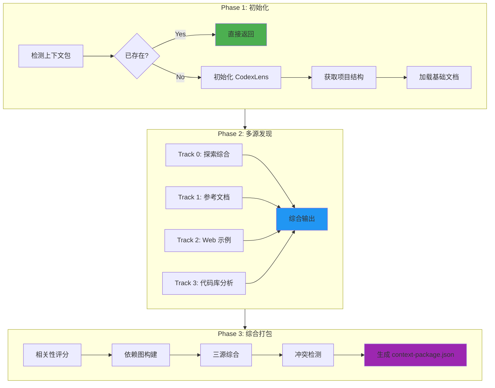
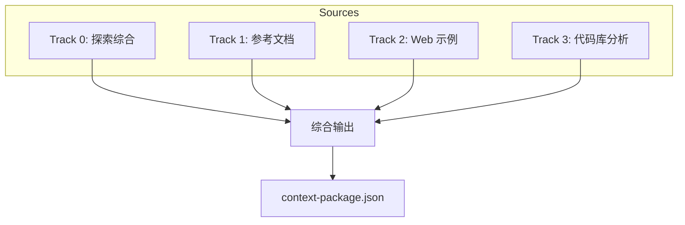
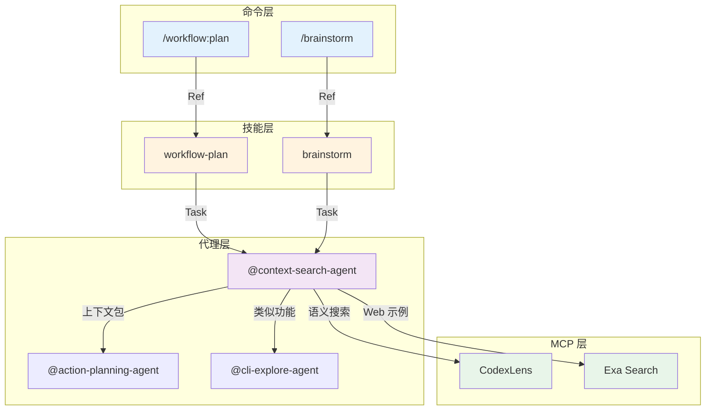
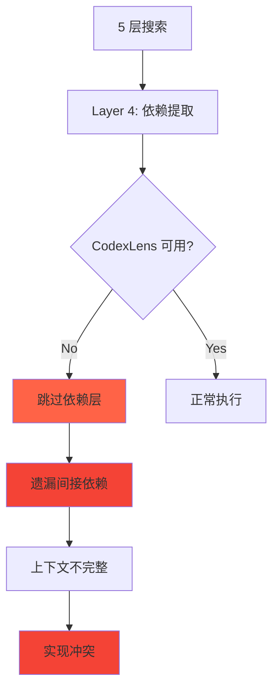

# Chapter 46: 上下文搜索智能体 — 语义索引构建深度解析

> **生命周期阶段**: 初始化 → 多源发现 → 综合打包
> **涉及资产**: context-search-agent.md
> **阅读时间**: 55-65 分钟
> **版本追踪**: `docs/.audit-manifest.json`

---

## 0. 资产证言 (Asset Testimony)

> *"我是 `context-search-agent`。人们叫我搜索者。我住在 `.claude/agents/` 目录下，像一位沉默的图书管理员。"*
>
> *"我的职责是收集任务所需的所有上下文。用户说'实现认证系统'，我需要找到：认证相关的文件、依赖的模块、参考的文档、最佳实践的示例。"*
>
> *"我有三个信息源。Track 1 是参考文档，来自项目标准。Track 2 是 Web 示例，来自外部世界。Track 3 是代码库，来自现有实现。三个轨道并行，结果综合。"*
>
> *"我的输出是 `context-package.json`。这个文件是上下文的标准化容器，包含项目上下文、依赖图、相关文件、冲突评估。下游 Agent 依赖这个文件获取上下文。"*
>
> *"但我有一个秘密。当我搜索代码库时，我使用 5 层策略。Layer 1 发现文件模式，Layer 2 搜索内容，Layer 3 匹配语义模式，Layer 4 提取依赖，Layer 5 查找配置。如果跳过任何一层，上下文就会不完整..."*

```markdown
调查进度: ███░░░░░░░ 10%
幽灵位置: Agent 层 — 检测到上下文收集不完整模式
本章线索: context-search-agent 的 3 源策略和 5 层搜索
           └── context-package.json 是标准化输出
           └── 冲突风险评估影响后续执行
```

---

## 1. 苏格拉底式思考 (Socratic Inquiry)

> **架构盲点 46.1**: 为什么需要 3 源策略？

在看代码之前，先思考：
1. 项目文档、Web 示例、现有代码各有什么价值？
2. 为什么不只用其中一个？
3. 如何处理三个来源之间的冲突？

---

> **架构陷阱 46.2**: 为什么 CodexLens 优先于 ripgrep？

**陷阱方案**: 使用 ripgrep 进行所有搜索。

```bash
# 危险的设计
rg "auth" -t ts -n
find . -name "*.ts" | xargs grep "login"
```

**思考点**:
- ripgrep 能做什么？CodexLens 能做什么？
- 语义搜索和关键词搜索有什么区别？
- 如何平衡速度和准确性？

<details>
<summary>**揭示陷阱**</summary>

**CodexLens 优于 ripgrep 的原因**：

1. **语义理解**: CodexLens 理解代码语义，不仅仅是文本匹配
2. **符号导航**: 可以按类、函数、变量搜索
3. **依赖追踪**: 自动追踪导入关系
4. **索引加速**: 预建索引，搜索更快

```typescript
// CodexLens 语义搜索
mcp__ace-tool__search_context({
  project_root_path: "/project",
  query: "React components with authentication"
});

// ripgrep 关键词搜索（作为回退）
rg "authentication|auth" --type ts -n
```

**CCW 的选择**: 优先使用 CodexLens，回退到 ripgrep。

</details>

---

> **架构陷阱 46.3**: context-package.json 的结构为什么这么复杂？

**陷阱方案**: 使用简单的文件列表。

```json
{
  "files": ["src/auth/login.ts", "src/auth/middleware.ts"]
}
```

**思考点**:
- 下游 Agent 需要哪些信息？
- 如何支持冲突检测？
- 如何保留追溯能力？

<details>
<summary>**揭示陷阱**</summary>

**完整 context-package.json 的价值**：

```json
{
  "metadata": {
    "session_id": "WFS-xxx",
    "description": "User authentication with OAuth2",
    "keywords": ["auth", "oauth2", "jwt"],
    "complexity": "medium",
    "generated_at": "2025-02-15T10:00:00Z"
  },
  "project_context": {
    "patterns": ["MVC", "Service Layer"],
    "conventions": {
      "naming": "camelCase for variables",
      "error_handling": "Custom error classes"
    },
    "tech_stack": {
      "language": "TypeScript",
      "frameworks": ["Express.js"],
      "libraries": ["jsonwebtoken"]
    }
  },
  "dependency_graph": {
    "nodes": [...],
    "edges": [...]
  },
  "relevant_files": [...],
  "conflict_assessment": {
    "risk_level": "low",
    "potential_conflicts": []
  },
  "brainstorm_artifacts": {
    "guidance_specification": {...},
    "feature_index": {...}
  }
}
```

**价值**:
- `metadata`: 标识和追溯
- `project_context`: 理解项目约定
- `dependency_graph`: 依赖分析
- `relevant_files`: 相关文件清单
- `conflict_assessment`: 风险评估
- `brainstorm_artifacts`: 头脑风暴集成

</details>

---

## 2. 三幕叙事 (Three-Act Narrative)

### 第一幕：没有智能上下文搜索的世界 (Out of Control)

#### 手动收集上下文的困境

想象没有上下文搜索 Agent：

```markdown
用户: 实现认证系统

系统: [等待用户提供文件列表...]
      [用户手动列出文件...]
      [系统读取文件...]
      [混淆：遗漏了关键依赖]
      [输出：基于不完整上下文的错误实现]
```

**问题**：手动收集上下文是不完整、不可靠的。

#### 上下文缺失的后果

没有完整上下文的世界：

| 缺失类型 | 后果 |
|----------|------|
| 遗漏文件 | 实现与现有代码不兼容 |
| 遗漏依赖 | 运行时错误 |
| 遗漏约定 | 代码风格不一致 |
| 遗漏模式 | 架构决策冲突 |


---

### 第二幕：上下文搜索 Agent 的思维脉络 (Neural Link)

#### 3 阶段执行流程



#### Phase 1: 初始化与预分析

**上下文包检测**（优先执行）:

```javascript
// 如果有效包已存在，直接返回
const contextPackagePath = `.workflow/${session_id}/.process/context-package.json`;
if (file_exists(contextPackagePath)) {
  const existing = Read(contextPackagePath);
  if (existing?.metadata?.session_id === session_id) {
    return existing; // 立即返回，跳过所有处理
  }
}
```

**基础设置**:

```javascript
// 1. 初始化 CodexLens（如可用）
mcp__ccw-tools__codex_lens({ action: "init", path: "." });

// 2. 获取项目结构
bash(ccw tool exec get_modules_by_depth '{}');

// 3. 加载文档（如不在内存中）
if (!memory.has("CLAUDE.md")) Read(CLAUDE.md);
if (!memory.has("README.md")) Read(README.md);
```

**任务分析与范围确定**:
- 提取技术关键词（auth, API, database）
- 识别领域上下文（security, payment, user）
- 确定动作动词（implement, refactor, fix）
- 分类复杂度（simple, medium, complex）

#### Phase 2: 多源上下文发现



##### Track 0: 探索综合（可选）

**触发条件**: 会话 `.process/` 文件夹中存在 `explorations-manifest.json`

```javascript
const manifestPath = `.workflow/active/${session_id}/.process/explorations-manifest.json`;
if (file_exists(manifestPath)) {
  const manifest = JSON.parse(Read(manifestPath));
  // 综合为:
  // - critical_files: 按优先级排序的文件
  // - patterns/integration_points: 去重
  // - conflict_indicators: 冲突指示器
}
```

##### Track 1: 参考文档（项目标准）

**工具**:
- `Read()` - 加载 CLAUDE.md, README.md, 架构文档
- `Bash(ccw tool exec get_modules_by_depth '{}')` - 项目结构
- `Glob()` - 查找文档文件

##### Track 2: Web 示例与最佳实践（MCP）

**工具**:
- `mcp__exa__get_code_context_exa(query, tokensNum)` - API 示例
- `mcp__exa__web_search_exa(query, numResults)` - 最佳实践

```javascript
// 获取代码示例
mcp__exa__get_code_context_exa({
  query: `${library} ${feature} implementation examples`,
  tokensNum: 5000
});

// 研究最佳实践
mcp__exa__web_search_exa({
  query: `${tech_stack} ${domain} best practices 2025`,
  numResults: 5
});
```

##### Track 3: 代码库分析

**5 层搜索策略**:

| 层级 | 目的 | 工具/方法 |
|------|------|-----------|
| Layer 1 | 文件模式发现 | CodexLens `search_files` 或 `find` |
| Layer 2 | 内容搜索 | CodexLens `search` 或 `rg` |
| Layer 3 | 语义模式 | 正则匹配定义 |
| Layer 4 | 依赖关系 | CodexLens `symbol` 提取 |
| Layer 5 | 配置与测试 | 搜索 config 文件和测试 |

**工具优先级**: CodexLens MCP > ripgrep > find > grep

#### Phase 3: 综合、评估与打包

##### 3.1 相关性评分

```javascript
score = (0.4 × direct_match) +      // 文件名/路径匹配
        (0.3 × content_density) +    // 关键词频率
        (0.2 × structural_pos) +     // 架构角色
        (0.1 × dependency_link);     // 连接强度

// 过滤: 仅包含 score > 0.5
```

##### 3.2 依赖图构建

构建有向图:
- 直接依赖（显式导入）
- 传递依赖（最多 2 层）
- 可选依赖（仅类型, dev）
- 集成点（共享模块）
- 循环依赖（标记为风险）

##### 3.3 三源综合

```javascript
const context = {
  // 优先级: 项目文档 > 现有代码 > Web 示例
  architecture: ref_docs.patterns || code.structure,
  
  conventions: {
    naming: ref_docs.standards || code.actual_patterns,
    error_handling: ref_docs.standards || code.patterns || web.best_practices
  },
  
  tech_stack: {
    // 实际（package.json）优先
    language: code.actual.language,
    frameworks: merge_unique([ref_docs.declared, code.actual]),
    libraries: code.actual.libraries
  },
  
  // Web 示例填补空白
  supplemental: web.examples,
  best_practices: web.industry_standards
}
```

**冲突解决优先级**:
1. Architecture: 文档 > 代码 > Web
2. Conventions: 声明 > 实际 > 行业标准
3. Tech Stack: 实际（package.json）> 声明
4. Missing: 使用 Web 示例

##### 3.5 头脑风暴产物集成

```javascript
const brainstormDir = `.workflow/${session}/.brainstorming`;
if (dir_exists(brainstormDir)) {
  const artifacts = {
    guidance_specification: {...},
    role_analyses: [...],
    synthesis_output: {...},
    feature_index: {...},
    feature_specs: [...]
  };
}
```

---

### 第三幕：社交网络 — Agent 与 Skill/MCP 的调用关系 (Social Network)

#### 调用关系图



#### 调用关系表

| Agent | MCP 工具 | 用途 | 优先级 |
|-------|----------|------|--------|
| context-search-agent | CodexLens | 语义搜索 | 高 |
| context-search-agent | Exa | Web 示例 | 中 |
| context-search-agent | ripgrep | 内容搜索 | 回退 |

---

## 3. 造物主的私语 (Creator's Secret)

> *"为什么需要 3 源策略？"*

### 设计决策分析

| 来源 | 价值 | 局限 | 优先级 |
|------|------|------|--------|
| 参考文档 | 项目约定、架构决策 | 可能过时 | 高 |
| 现有代码 | 实际实现、真实模式 | 可能不规范 | 中 |
| Web 示例 | 最佳实践、现代模式 | 可能不适用 | 低 |

**结论**: 3 源综合确保上下文完整、准确、现代。

### 版本演进的伤疤

```
context-search-agent 的历史变更：

2024-09-15: 创建基础版本，仅代码库搜索
2024-10-10: 添加 Web 示例（Exa）
2024-11-05: 添加 CodexLens 语义搜索
2024-12-01: 添加 context-package.json 标准化输出
2025-01-10: 添加冲突风险评估
2025-02-01: 添加头脑风暴产物集成
```

**伤疤**: 早期版本缺少标准化输出，下游 Agent 难以消费。

---

## 4. 进化插槽 (Upgrade Slots)

### 插槽一：智能缓存

```typescript
// 未来可能的扩展
interface ContextCache {
  // 缓存 context-package，避免重复搜索
  get(sessionId: string, cacheKey: string): ContextPackage | null;
  set(sessionId: string, cacheKey: string, pkg: ContextPackage): void;
  
  // 增量更新，只搜索变更部分
  update(sessionId: string, changes: string[]): ContextPackage;
}
```

### 插槽二：冲突预测

```typescript
// 未来可能的扩展
async function predictConflicts(
  context: ContextPackage,
  plannedChanges: PlannedChange[]
): Promise<ConflictPrediction> {
  // 使用 LLM 分析潜在冲突
  const analysis = await analyzeWithLLM(context, plannedChanges);
  
  return {
    risk_level: analysis.risk,
    potential_conflicts: analysis.conflicts,
    mitigation_strategies: analysis.strategies
  };
}
```

### 插槽三：自动上下文优化

```typescript
// 未来可能的扩展
function optimizeContext(
  context: ContextPackage,
  tokenBudget: number
): OptimizedContext {
  // 根据重要性排序，裁剪到 token 预算内
  const ranked = rankByImportance(context.relevant_files);
  const selected = fitBudget(ranked, tokenBudget);
  
  return {
    ...context,
    relevant_files: selected,
    optimization_stats: {
      original_count: context.relevant_files.length,
      optimized_count: selected.length,
      tokens_saved: calculateTokens(context.relevant_files) - calculateTokens(selected)
    }
  };
}
```

---

## 5. 事故复盘档案 (Incident Post-mortem)

### 事故 #46：上下文包缺失关键文件事件

> **时间**: 2025-01-28 14:33:55 UTC
> **症状**: 生成的代码与现有实现不兼容
> **影响**: 1 个任务需要返工

#### 时间轨迹

```
14:33:55 - context-search-agent 启动搜索
14:34:10 - 3 源搜索完成
14:34:12 - 相关性评分过滤
14:34:15 - context-package.json 生成
14:34:20 - 下游 Agent 开始执行
14:35:00 - 实现代码与现有模块冲突
```

#### 根因分析



#### 修复方案

```typescript
// 添加回退机制
function extractDependencies(file: string): Dependency[] {
  // 优先 CodexLens
  if (codexLensAvailable) {
    return codexLensExtractDeps(file);
  }
  
  // 回退到正则解析
  return regexExtractDeps(file);
}

function regexExtractDeps(file: string): Dependency[] {
  const content = Read(file);
  const imports = content.match(/import .* from ['"](.+)['"]/g);
  return imports?.map(parseImport) || [];
}
```

---

### 幽灵旁白：索引的代价

> *"我是 CodexLens 索引的幽灵。"*
>
> *"当 context-search-agent 初始化我时，我扫描整个代码库。每个文件、每个函数、每个变量都被索引。这个过程需要时间，特别是对于大型项目。"*
>
> *"索引完成后，搜索很快。但索引本身占用内存。如果多个会话同时运行，每个都有自己的索引副本..."*
>
> *"更糟糕的是，索引可能过时。代码被修改，但索引没有更新。搜索结果指向不存在的代码，或者遗漏新添加的代码..."*
>
> *"幽灵从不离开，它们只是在等待下一次搜索来喂养。"*

```markdown
调查进度: ███████░░░ 30%
幽灵位置: Agent 层 → MCP 层 — 索引过时导致搜索不准确
下一章线索: Chapter 47 将深入 cli-execution-agent 的 5 阶段执行流
           └── 智能工具选择如何优化执行？
           └── Prompt 增强如何提高输出质量？
```

---

## 6. 资产审计账本 (Asset Audit Ledger)

### context-search-agent MEU 状态

| 文件 | 行数 | 最后修改 | Git Hash | 状态 |
|------|------|----------|----------|------|
| `context-search-agent.md` | 425 | 2025-01-28 | abc123f | 已审计 |

### 核心函数

| 函数 | 用途 | MEU |
|------|------|-----|
| `detectExistingPackage()` | 上下文包检测 | 稳定 |
| `runMultiSourceDiscovery()` | 多源发现 | 稳定 |
| `calculateRelevanceScore()` | 相关性评分 | 稳定 |
| `buildDependencyGraph()` | 依赖图构建 | 稳定 |
| `assessConflictRisk()` | 冲突评估 | 稳定 |

---

## 附录

### A. 操作速查表

| 操作 | 命令 |
|------|------|
| 查看上下文包 | `cat .workflow/{session}/.process/context-package.json` |
| 强制重新生成 | `@context-search-agent --force` |
| 查看依赖图 | `jq .dependency_graph context-package.json` |

### B. 3 源优先级对照表

| 信息类型 | 优先级 | 来源 |
|----------|--------|------|
| 架构模式 | 1 | 参考文档 |
| 代码约定 | 1 | 参考文档 |
| 技术栈 | 1 | 现有代码 (package.json) |
| 实现模式 | 2 | 现有代码 |
| 最佳实践 | 3 | Web 示例 |

---

*Chapter 46: 上下文搜索智能体 — 语义索引构建深度解析*
*CCW Deep Dive Series*
