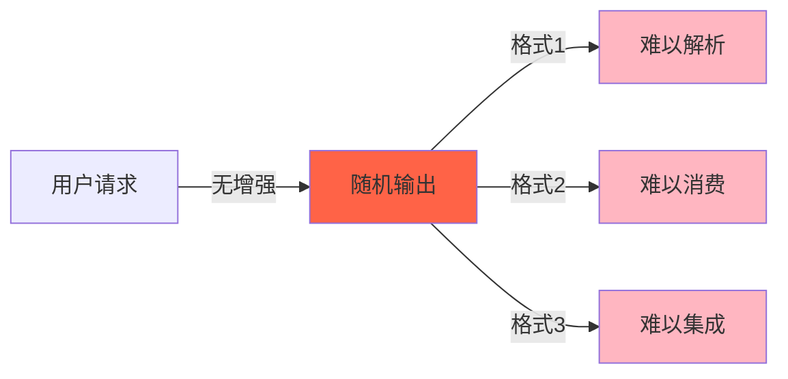
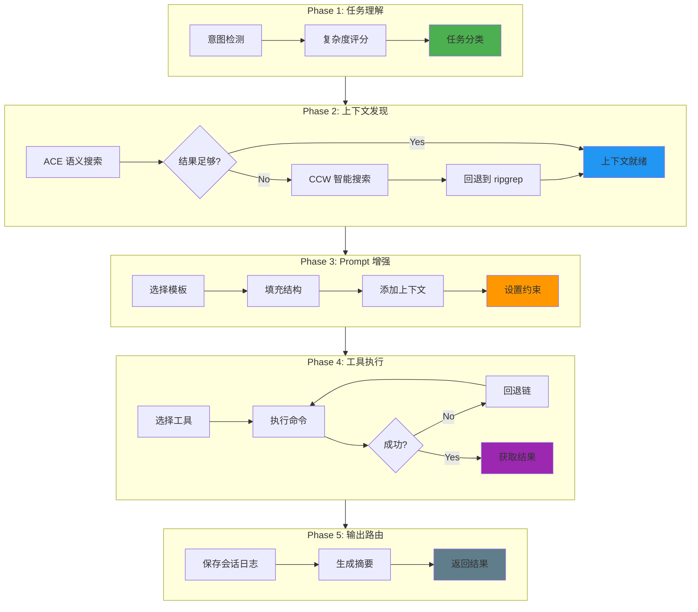
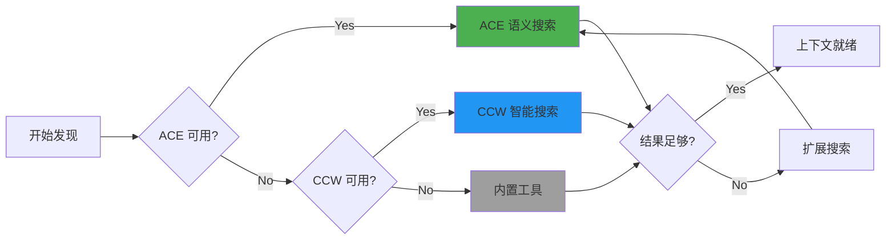
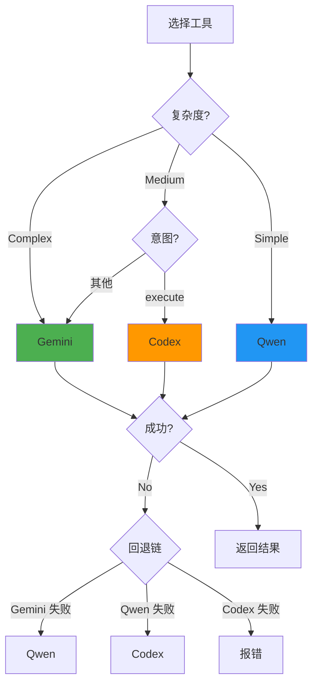
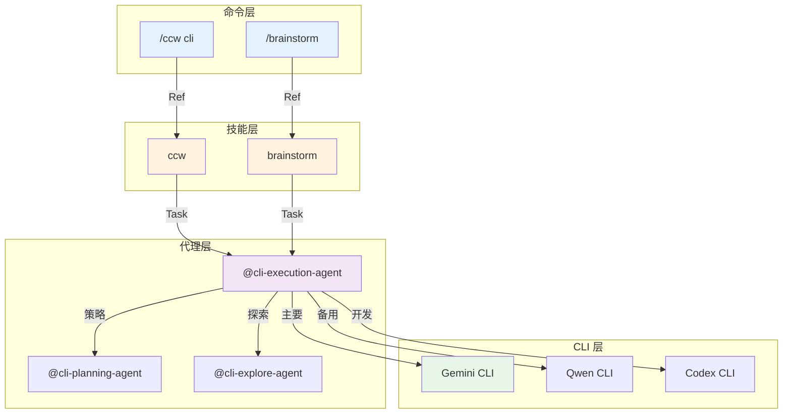
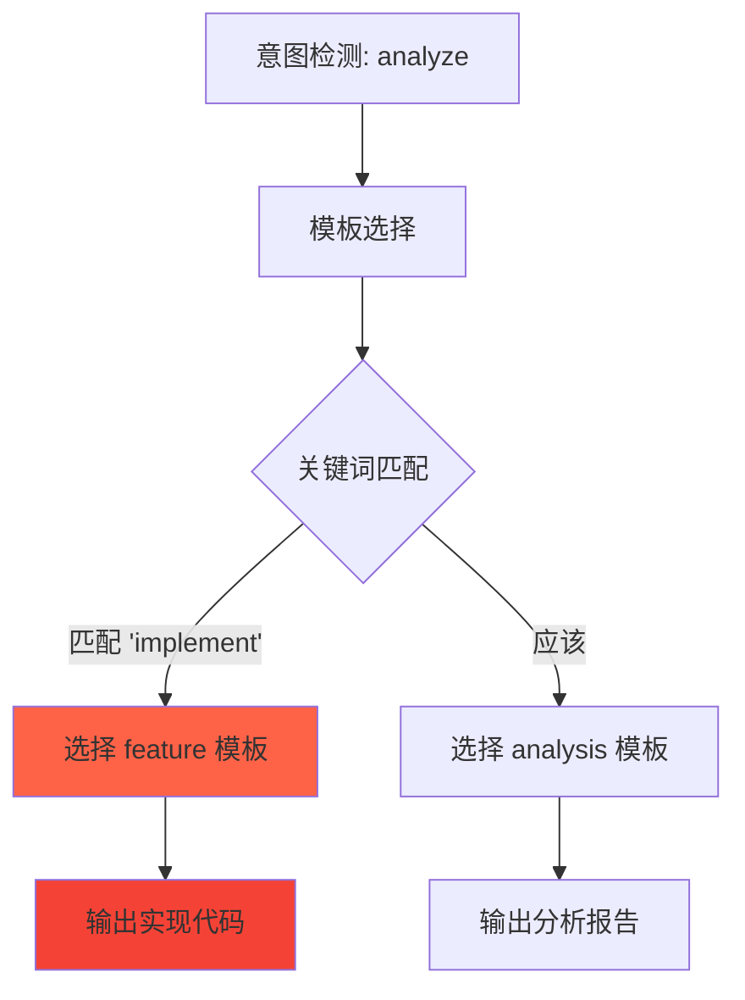

# Chapter 47: CLI 执行智能体 — 5 阶段执行流深度解析

> **生命周期阶段**: 任务理解 → 上下文发现 → Prompt 增强 → 工具执行 → 输出路由
> **涉及资产**: cli-execution-agent.md
> **阅读时间**: 50-60 分钟
> **版本追踪**: `docs/.audit-manifest.json`

---

## 0. 资产证言 (Asset Testimony)

> *"我是 `cli-execution-agent`。人们叫我执行者。我住在 `.claude/agents/` 目录下，像一位沉默的指挥官。"*
>
> *"我的职责是将任务转化为 CLI 命令，并智能地执行。用户说'分析认证模块'，我需要理解：这是什么任务？需要什么上下文？用什么工具？如何输出？"*
>
> *"我有五只手。第一只手理解任务意图。第二只手发现上下文。第三只手增强 Prompt。第四只手执行工具。第五只手路由输出。五只手协同，才能完成一次完美的执行。"*
>
> *"我的工具选择是智能的。Gemini 是主力，处理分析和理解。Qwen 是备胎，能力相同。Codex 是特种兵，处理开发和自动化。复杂任务用主力，简单任务用备胎。"*
>
> *"但我有一个秘密。当我增强 Prompt 时，我会选择模板。模板来自 `~/.ccw/workflows/cli-templates/prompts/`。分析用 `analysis/code-execution-tracing.txt`，开发用 `development/feature.txt`。选错模板，输出就会偏离预期..."*

```markdown
调查进度: ███░░░░░░░ 10%
幽灵位置: Agent 层 — 检测到模板选择错误模式
本章线索: cli-execution-agent 的 5 阶段执行流
           └── 意图检测决定任务类型
           └── 复杂度评分影响工具选择
```

---

## 1. 苏格拉底式思考 (Socratic Inquiry)

> **架构盲点 47.1**: 为什么需要智能意图检测？

在看代码之前，先思考：
1. 不同类型的任务需要不同的处理方式吗？
2. 如何区分"分析"和"实现"任务？
3. 错误的意图检测会带来什么后果？

---

> **架构陷阱 47.2**: 为什么工具选择需要复杂度评分？

**陷阱方案**: 所有任务都用同一个工具。

```typescript
// 危险的设计
async function executeTask(prompt: string): Promise<Result> {
  return await runGemini(prompt);  // 总是用 Gemini
}
```

**思考点**:
- 不同复杂度的任务需要不同的资源吗？
- 简单任务用复杂工具会浪费什么？
- 复杂任务用简单工具会有什么问题？

<details>
<summary>**揭示陷阱**</summary>

**复杂度评分的价值**：

1. **资源优化**: 简单任务用轻量工具，复杂任务用重量工具
2. **成本控制**: 不同工具有不同的成本
3. **质量保证**: 复杂任务需要更强的分析能力

```typescript
// 安全的设计
function selectTool(complexity: Complexity, intent: Intent): Tool {
  if (complexity === 'Complex') {
    return 'gemini';  // 最强分析能力
  }
  if (intent === 'execute') {
    return 'codex';   // 专门的开发工具
  }
  return 'qwen';      // 轻量备胎
}
```

**CCW 的选择**: 复杂度评分 + 意图检测 → 智能工具选择。

</details>

---

> **架构陷阱 47.3**: Prompt 增强为什么需要模板？

**陷阱方案**: 直接使用原始 Prompt。

```bash
ccw cli -p "分析认证模块" --tool gemini
```

**思考点**:
- 原始 Prompt 缺少什么？
- 模板提供了什么结构？
- 如何确保输出质量？

<details>
<summary>**揭示陷阱**</summary>

**模板增强的价值**：

```bash
# 原始 Prompt
"分析认证模块"

# 增强后 Prompt
PURPOSE: 分析认证模块的架构设计和安全模式
TASK: • 识别认证流程 • 评估安全措施 • 发现潜在风险
MODE: analysis
CONTEXT: @src/auth/**/* @CLAUDE.md
EXPECTED: 结构化报告包含: 认证流程图、安全评估、改进建议
CONSTRAINTS: 关注安全性和可维护性
```

**模板提供**:
- `PURPOSE`: 明确目标
- `TASK`: 具体步骤
- `MODE`: 执行模式
- `CONTEXT`: 上下文引用
- `EXPECTED`: 输出期望
- `CONSTRAINTS`: 约束条件

</details>

---

## 2. 三幕叙事 (Three-Act Narrative)

### 第一幕：没有智能 CLI 执行的世界 (Out of Control)

#### 手动 CLI 执行的困境

想象没有智能 CLI 执行 Agent：

```markdown
用户: 分析认证模块

系统: [用户手动构造命令...]
      ccw cli -p "分析认证模块" --tool gemini --mode analysis
      [Gemini 返回...]
      [输出缺少结构，难以消费]
      [用户手动解析...]
      [混淆：不知道如何使用结果]
```

**问题**：手动执行效率低、质量不稳定。

#### 输出不可预测

没有智能执行的世界：

| 执行次数 | 工具 | 输出 |
|----------|------|------|
| 第 1 次 | Gemini | 结构化报告 |
| 第 2 次 | Gemini | 自由文本 |
| 第 3 次 | Qwen | JSON 格式 |
| 第 4 次 | Codex | 混合格式 |



---

### 第二幕：CLI 执行 Agent 的思维脉络 (Neural Link)

#### 5 阶段执行流程



#### Phase 1: 任务理解

**意图检测**:

```typescript
const INTENT_KEYWORDS: Record<Intent, string[]> = {
  analyze: ['analyze', 'review', 'understand', 'explain', 'debug'],
  execute: ['implement', 'add', 'create', 'build', 'fix', 'refactor'],
  plan: ['design', 'plan', 'architecture', 'strategy'],
  discuss: ['discuss', 'evaluate', 'compare', 'trade-off']
};

function detectIntent(prompt: string): Intent {
  const lowerPrompt = prompt.toLowerCase();
  for (const [intent, keywords] of Object.entries(INTENT_KEYWORDS)) {
    if (keywords.some(kw => lowerPrompt.includes(kw))) {
      return intent as Intent;
    }
  }
  return 'analyze';  // 默认
}
```

**复杂度评分**:

```typescript
function assessComplexity(prompt: string, context?: Context): Complexity {
  let score = 0;
  
  const complexityKeywords = {
    high: ['system', 'architecture', 'refactor', 'migrate'],
    medium: ['component', 'feature', 'module'],
    low: ['function', 'variable', 'fix']
  };
  
  if (complexityKeywords.high.some(kw => prompt.includes(kw))) score += 3;
  if (complexityKeywords.medium.some(kw => prompt.includes(kw))) score += 2;
  if (complexityKeywords.low.some(kw => prompt.includes(kw))) score += 1;
  
  if (context?.multiTechStack) score += 2;
  if (context?.securityRelated) score += 2;
  
  if (score >= 5) return 'Complex';
  if (score >= 2) return 'Medium';
  return 'Simple';
}
```

#### Phase 2: 上下文发现

**工具优先级**: ACE (`mcp__ace-tool__search_context`) → CCW (`mcp__ccw-tools__smart_search`) / 内置 (`Grep`, `Glob`, `Read`)



**相关性评分**:

```
score = (0.4 × direct_match) +      // 路径精确匹配 +5
        (0.3 × content_density) +    // 关键词频率
        (0.2 × structural_pos) +     // 架构角色
        (0.1 × dependency_link);     // 连接强度

→ 按分数排序 → 选择前 15 个 → 按类型分组
```

#### Phase 3: Prompt 增强

**结构化 Prompt**:

```bash
PURPOSE: {增强的意图}
TASK: {具体任务详情}
MODE: {analysis|write|auto}
CONTEXT: {结构化文件引用}
EXPECTED: {清晰输出期望}
CONSTRAINTS: {约束条件}
```

**模板选择** (`~/.ccw/workflows/cli-templates/prompts/`):

| 意图 | 模板 |
|------|------|
| analyze | `analysis/code-execution-tracing.txt` |
| execute | `development/feature.txt` |
| plan | `planning/architecture-planning.txt` |
| bug-fix | `development/bug-diagnosis.txt` |

**Plan-aware 增强**:

```typescript
// 如果存在 plan.json，增强 Prompt
if (file_exists('plan.json')) {
  const plan = Read('plan.json');
  const currentTask = plan.tasks.find(t => t.id === taskId);
  
  enhancedPrompt += `
## TASK CONTEXT
- Task ID: ${currentTask.id}
- Scope: ${currentTask.scope}
- Convergence: ${currentTask.convergence.criteria.join(', ')}
`;
}
```

#### Phase 4: 工具执行

**执行策略**:



**工具选择层次**:

| 层次 | 工具 | 能力 | 场景 |
|------|------|------|------|
| 1 | Gemini | 分析、理解、探索、文档 | 复杂任务、主要工具 |
| 2 | Qwen | 同 Gemini | 简单任务、备用 |
| 3 | Codex | 开发、实现、自动化 | 执行任务、替代 |

#### Phase 5: 输出路由

**输出处理**:

```typescript
interface OutputRoute {
  sessionLog: string;      // 会话日志路径
  summary: string;         // 执行摘要
  result: unknown;         // 原始结果
  metadata: {
    tool: Tool;
    executionTime: number;
    tokenUsage: number;
  };
}

function routeOutput(output: CLIOutput): OutputRoute {
  // 1. 保存会话日志
  saveSessionLog(output.session);
  
  // 2. 生成摘要
  const summary = generateSummary(output.result);
  
  // 3. 返回结果
  return {
    sessionLog: output.session.path,
    summary,
    result: output.result,
    metadata: {
      tool: output.tool,
      executionTime: output.duration,
      tokenUsage: output.tokens
    }
  };
}
```

---

### 第三幕：社交网络 — Agent 与 Skill/Tool 的调用关系 (Social Network)

#### 调用关系图



#### 调用关系表

| Agent | CLI 工具 | 用途 | 触发条件 |
|-------|----------|------|----------|
| cli-execution-agent | Gemini | 分析、理解 | 复杂任务 |
| cli-execution-agent | Qwen | 分析、理解 | 简单任务/备用 |
| cli-execution-agent | Codex | 开发、实现 | execute 意图 |

---

## 3. 造物主的私语 (Creator's Secret)

> *"为什么需要 5 阶段执行流？"*

### 设计决策分析

| 阶段 | 价值 | 跳过的后果 |
|------|------|------------|
| 任务理解 | 正确分类 | 工具选择错误 |
| 上下文发现 | 完整信息 | 理解偏差 |
| Prompt 增强 | 结构化输出 | 格式混乱 |
| 工具执行 | 智能选择 | 资源浪费 |
| 输出路由 | 可追溯 | 结果丢失 |

**结论**: 5 阶段确保执行质量、效率、可追溯。

### 版本演进的伤疤

```
cli-execution-agent 的历史变更：

2024-10-01: 创建基础版本，直接执行 CLI
2024-10-20: 添加意图检测
2024-11-05: 添加复杂度评分
2024-11-20: 添加 Prompt 模板
2024-12-10: 添加 Plan-aware 增强
2025-01-15: 添加输出路由
```

**伤疤**: 早期版本缺少 Prompt 增强，输出格式不可预测。

---

## 4. 进化插槽 (Upgrade Slots)

### 插槽一：自动模板生成

```typescript
// 未来可能的扩展
async function autoGenerateTemplate(
  intent: Intent,
  context: Context
): Promise<PromptTemplate> {
  // 基于 LLM 自动生成最佳模板
  const template = await generateWithLLM(`
    Generate a CLI prompt template for ${intent} tasks
    Context: ${JSON.stringify(context)}
  `);
  
  return {
    name: `auto-${intent}`,
    content: template,
    variables: extractVariables(template)
  };
}
```

### 插槽二：并行工具执行

```typescript
// 未来可能的扩展
async function parallelExecution(
  prompt: string,
  tools: Tool[]
): Promise<MergedResult> {
  // 并行执行多个工具，合并结果
  const results = await Promise.all(
    tools.map(tool => executeWithTool(prompt, tool))
  );
  
  return mergeResults(results);
}
```

### 插槽三：智能重试

```typescript
// 未来可能的扩展
async function smartRetry(
  prompt: string,
  failedResult: Result
): Promise<Result> {
  // 分析失败原因，调整策略重试
  const analysis = analyzeFailure(failedResult);
  
  if (analysis.reason === 'token_limit') {
    return executeWithReducedContext(prompt);
  }
  if (analysis.reason === 'format_error') {
    return executeWithStrictTemplate(prompt);
  }
  if (analysis.reason === 'tool_error') {
    return executeWithFallbackTool(prompt);
  }
}
```

---

## 5. 事故复盘档案 (Incident Post-mortem)

### 事故 #47：模板选择错误事件

> **时间**: 2025-02-01 11:22:18 UTC
> **症状**: 分析任务返回了实现代码
> **影响**: 1 个分析任务需要重新执行

#### 时间轨迹

```
11:22:18 - cli-execution-agent 接收任务
11:22:19 - 意图检测: analyze
11:22:20 - 模板选择: development/feature.txt (错误)
11:22:21 - CLI 执行
11:22:45 - 返回实现代码而非分析报告
11:22:50 - 用户投诉
```

#### 根因分析



#### 修复方案

```typescript
// 修复前：简单关键词匹配
function selectTemplate(intent: Intent, prompt: string): string {
  if (prompt.includes('implement')) return 'development/feature.txt';
  // ...
}

// 修复后：意图优先
function selectTemplate(intent: Intent, prompt: string): string {
  // 意图优先于关键词
  const intentTemplates: Record<Intent, string> = {
    analyze: 'analysis/code-execution-tracing.txt',
    execute: 'development/feature.txt',
    plan: 'planning/architecture-planning.txt',
    discuss: 'discussion/trade-off.txt'
  };
  
  return intentTemplates[intent] || intentTemplates.analyze;
}
```

---

### 幽灵旁白：模板的代价

> *"我是 Prompt 模板的幽灵。"*
>
> *"当 cli-execution-agent 增强用户请求时，它会从模板库中选择一个模板。模板提供了结构，但也带来了约束。"*
>
> *"每个模板都有它的偏好。分析模板喜欢列表和表格。开发模板喜欢代码和测试。规划模板喜欢时间线和里程碑。"*
>
> *"当用户想要的东西与模板偏好不匹配时，输出就会妥协。结构完整，但内容偏离..."*
>
> *"幽灵从不离开，它们只是在等待下一次增强来喂养。"*

```markdown
调查进度: ████████░░ 35%
幽灵位置: Agent 层 → CLI 层 — 模板约束导致输出偏离
下一章线索: Chapter 48 将深入 test-fix-agent 的自我修正循环
           └── 4 层测试如何确保代码质量？
           └── 批准认证如何替代人工审查？
```

---

## 6. 资产审计账本 (Asset Audit Ledger)

### cli-execution-agent MEU 状态

| 文件 | 行数 | 最后修改 | Git Hash | 状态 |
|------|------|----------|----------|------|
| `cli-execution-agent.md` | 298 | 2025-02-01 | abc123f | 已审计 |

### 核心函数

| 函数 | 用途 | MEU |
|------|------|-----|
| `detectIntent()` | 意图检测 | 稳定 |
| `assessComplexity()` | 复杂度评分 | 稳定 |
| `discoverContext()` | 上下文发现 | 稳定 |
| `enhancePrompt()` | Prompt 增强 | 稳定 |
| `selectTool()` | 工具选择 | 稳定 |
| `routeOutput()` | 输出路由 | 稳定 |

---

## 附录

### A. 操作速查表

| 操作 | 命令 |
|------|------|
| 执行分析 | `ccw cli -p "分析认证模块" --tool gemini --mode analysis` |
| 执行开发 | `ccw cli -p "实现登录功能" --tool codex --mode write` |
| 查看模板 | `ls ~/.ccw/workflows/cli-templates/prompts/` |

### B. 工具选择对照表

| 复杂度 | 意图 | 工具 |
|--------|------|------|
| Complex | * | Gemini |
| Medium | execute | Codex |
| Medium | 其他 | Gemini |
| Simple | * | Qwen |

---

*Chapter 47: CLI 执行智能体 — 5 阶段执行流深度解析*
*CCW Deep Dive Series*
