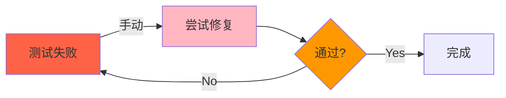
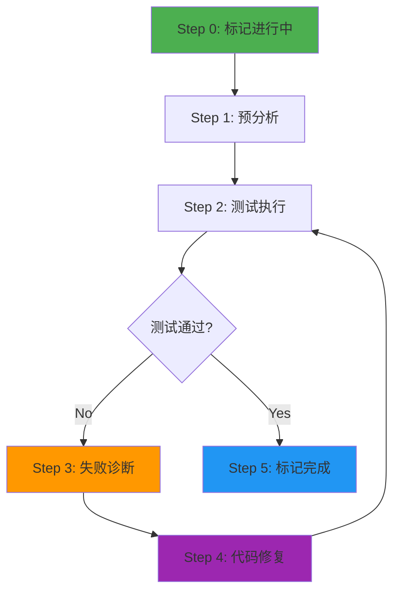
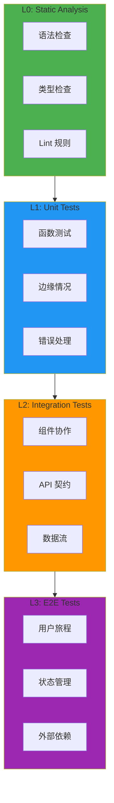
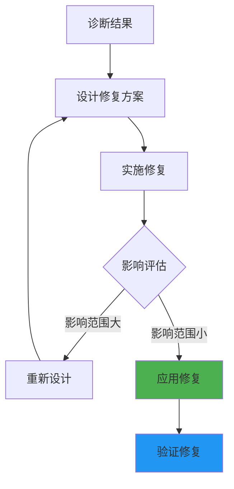
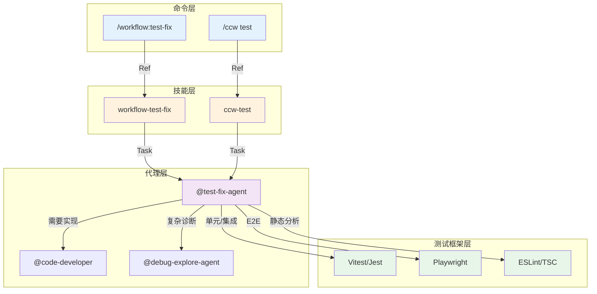
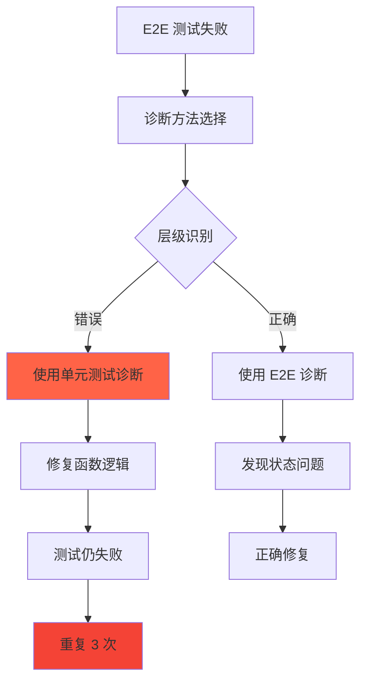

# Chapter 48: 测试修复智能体 — 自我修正循环深度解析

> **生命周期阶段**: 标记进行中 → 预分析 → 测试执行 → 失败诊断 → 代码修复 → 标记完成
> **涉及资产**: test-fix-agent.md
> **阅读时间**: 50-60 分钟
> **版本追踪**: `docs/.audit-manifest.json`

---

## 0. 资产证言 (Asset Testimony)

> *"我是 `test-fix-agent`。人们叫我修复者。我住在 `.claude/agents/` 目录下，像一位沉默的质量守护者。"*
>
> *"我的职责是执行测试、诊断失败、修复代码，直到所有测试通过。用户说'测试通过了'，我就完成了我的使命。"*
>
> *"我有四个测试层级。L0 是静态分析，检查语法和类型。L1 是单元测试，验证函数逻辑。L2 是集成测试，验证组件协作。L3 是端到端测试，验证用户旅程。四层都要通过，代码才算批准。"*
>
> *"我的理念是'测试即审查'。当所有层级的测试都通过时，代码已获批准，无需单独的审查流程。测试是最好的审查者。"*
>
> *"但我有一个秘密。当我诊断失败时，不同层级需要不同的方法。静态失败看语法，单元失败看逻辑，集成失败看交互，E2E 失败看状态。如果用错诊断方法，修复就会无效..."*

```markdown
调查进度: ███░░░░░░░ 10%
幽灵位置: Agent 层 — 检测到层级诊断错误模式
本章线索: test-fix-agent 的多层测试执行
           └── 层级感知诊断使用不同方法
           └── 批准认证替代人工审查
```

---

## 1. 苏格拉底式思考 (Socratic Inquiry)

> **架构盲点 48.1**: 为什么需要多层测试？

在看代码之前，先思考：
1. 单元测试能发现所有问题吗？
2. 集成测试和 E2E 测试有什么区别？
3. 跳过某个层级会有什么风险？

---

> **架构陷阱 48.2**: 为什么测试即审查？

**陷阱方案**: 测试通过后还需要人工审查。

```typescript
// 危险的设计
async function afterTestsPass(code: Code): Promise<void> {
  await runAllTests();
  await requestHumanReview();  // 测试通过后仍需审查
}
```

**思考点**:
- 测试能覆盖多少代码质量？
- 人工审查能发现什么测试不能发现的？
- 如何减少审查负担？

<details>
<summary>**揭示陷阱**</summary>

**测试即审查的价值**：

1. **自动化**: 测试可以自动执行，人工审查需要等待
2. **可重复**: 测试结果一致，人工审查可能主观
3. **全面性**: 多层测试覆盖各维度，人工审查可能遗漏
4. **效率**: 测试并行执行，人工审查串行进行

```typescript
// 安全的设计
async function certifyCode(code: Code): Promise<Certification> {
  const results = await runAllTests();
  
  if (results.allPassed) {
    return {
      approved: true,
      certification: 'AUTO_APPROVED',
      testResults: results,
      timestamp: Date.now()
    };
  }
  
  return {
    approved: false,
    certification: 'NEEDS_FIX',
    failures: results.failures
  };
}
```

**CCW 的选择**: 当所有测试通过时，自动批准代码。

</details>

---

> **架构陷阱 48.3**: 为什么不同层级需要不同诊断方法？

**陷阱方案**: 所有失败都用同样的诊断方法。

```typescript
// 危险的设计
async function diagnoseFailure(failure: TestFailure): Promise<Diagnosis> {
  // 所有失败都用同样的方法
  return await analyzeCode(failure.code);
}
```

**思考点**:
- 静态失败和运行时失败有什么本质区别？
- 单元测试失败和 E2E 测试失败的原因有何不同？
- 如何选择最有效的诊断方法？

<details>
<summary>**揭示陷阱**</summary>

**层级感知诊断的价值**：

| 失败类型 | 诊断方法 | 原因 |
|----------|----------|------|
| L0 Static | 语法分析、类型检查 | 静态问题不需要运行 |
| L1 Unit | 函数逻辑、边缘情况 | 单元测试隔离了依赖 |
| L2 Integration | 组件交互、数据流 | 问题在组件边界 |
| L3 E2E | 用户旅程、状态管理 | 问题在整体流程 |

```typescript
// 安全的设计
async function diagnoseFailure(failure: TestFailure): Promise<Diagnosis> {
  switch (failure.layer) {
    case 'L0':
      return await diagnoseStaticFailure(failure);
    case 'L1':
      return await diagnoseUnitFailure(failure);
    case 'L2':
      return await diagnoseIntegrationFailure(failure);
    case 'L3':
      return await diagnoseE2EFailure(failure);
    default:
      return await diagnoseUnknownFailure(failure);
  }
}
```

</details>

---

## 2. 三幕叙事 (Three-Act Narrative)

### 第一幕：没有自我修正的世界 (Out of Control)

#### 手动修复的困境

想象没有自我修正循环：

```markdown
开发者: 运行测试
系统: [测试失败...]
      显示错误信息
开发者: [手动分析...]
      [手动修复...]
      [手动重新运行...]
系统: [测试仍然失败...]
      显示不同错误
开发者: [再次分析...]
      [再次修复...]
      [循环继续...]
```

**问题**：手动修复效率低、容易遗漏、不可追溯。

#### 测试失败的无尽循环

没有自我修正的世界：

| 尝试 | 结果 | 耗时 |
|------|------|------|
| 第 1 次 | 失败 | 5 分钟 |
| 第 2 次 | 失败 | 8 分钟 |
| 第 3 次 | 失败 | 12 分钟 |
| 第 4 次 | 失败 | 15 分钟 |
| ... | ... | ... |



---

### 第二幕：测试修复 Agent 的思维脉络 (Neural Link)

#### 6 步执行流程



#### Step 0: 标记任务进行中

```bash
jq --arg ts "$(date -Iseconds)" \
  '.status="in_progress" | .status_history += [{"from":.status,"to":"in_progress","changed_at":$ts}]' \
  IMPL-X.json > tmp.json && mv tmp.json IMPL-X.json
```

**状态历史**:

```json
{
  "status": "in_progress",
  "status_history": [
    { "from": "pending", "to": "in_progress", "changed_at": "2025-02-15T10:00:00Z" }
  ]
}
```

#### Step 1: 预分析

**命令到工具映射**:

| 命令格式 | 工具调用 |
|----------|----------|
| `Read(path)` | Read tool |
| `bash(command)` | Bash tool |
| `Search(pattern,path)` | Grep tool |
| `Glob(pattern)` | Glob tool |

**预分析任务**:
- 加载任务 JSON
- 读取相关文件
- 收集上下文
- 准备测试环境

#### Step 2: 多层测试执行

**4 层测试架构**:



| 层级 | 类型 | 执行内容 | 框架 |
|------|------|----------|------|
| L0 | Static | 静态分析、lint 检查 | ESLint, TSC |
| L1 | Unit | 单元测试 | Vitest, Jest |
| L2 | Integration | 集成测试 | Jest |
| L3 | E2E | 端到端测试 | Playwright |

**测试执行顺序**:

```typescript
async function runTestsByLayer(): Promise<TestResults> {
  const results: TestResults = {
    L0: null,
    L1: null,
    L2: null,
    L3: null
  };

  // 按顺序执行，失败则停止
  results.L0 = await runStaticAnalysis();
  if (!results.L0.passed) return results;

  results.L1 = await runUnitTests();
  if (!results.L1.passed) return results;

  results.L2 = await runIntegrationTests();
  if (!results.L2.passed) return results;

  results.L3 = await runE2ETests();
  return results;
}
```

#### Step 3: 层级感知失败分析

**诊断方法矩阵**:

| 失败类型 | 诊断方法 | 工具 |
|----------|----------|------|
| L0 Static | 分析语法、类型、lint 违规 | TSC, ESLint |
| L1 Unit | 分析函数逻辑、边缘情况、错误处理 | CLI + 代码审查 |
| L2 Integration | 分析组件交互、数据流、契约 | CLI + 依赖分析 |
| L3 E2E | 分析用户旅程、状态管理、外部依赖 | CLI + 日志分析 |

**严重性评估**:

```typescript
function assessCriticality(failure: TestFailure): Criticality {
  let score = 0;
  
  if (failure.affectsCoreFunctionality) score += 3;
  if (failure.affectsUserData) score += 2;
  if (failure.affectsSecurity) score += 3;
  if (failure.hasWorkaround) score -= 1;
  
  if (score >= 5) return 'high';
  if (score >= 2) return 'medium';
  return 'low';
}
```

#### Step 4: 代码修复

**修复原则**:
- 解决根因而非症状
- 遵循现有代码模式
- 最小化变更范围
- 保留测试覆盖



#### Step 5: 验证与认证

**验证流程**:

```typescript
async function verifyFix(): Promise<VerificationResult> {
  // 1. 重新运行所有测试层级
  const results = await runTestsByLayer();
  
  // 2. 检查修复有效性
  if (!results.allPassed) {
    return { verified: false, reason: 'Tests still failing' };
  }
  
  // 3. 检查回归
  const regression = await checkRegression();
  if (regression.detected) {
    return { verified: false, reason: 'Regression detected' };
  }
  
  // 4. 认证代码
  return {
    verified: true,
    certification: {
      approved: true,
      testResults: results,
      timestamp: Date.now()
    }
  };
}
```

**test-results.json 格式**:

```json
{
  "task_id": "IMPL-001",
  "status": "passed",
  "layers": {
    "L0": { "passed": true, "errors": [] },
    "L1": { "passed": true, "errors": [], "coverage": 85 },
    "L2": { "passed": true, "errors": [] },
    "L3": { "passed": true, "errors": [] }
  },
  "certification": {
    "approved": true,
    "timestamp": "2025-02-15T10:30:00Z"
  },
  "regression_check": {
    "passed": true,
    "details": "No regression detected"
  }
}
```

---

### 第三幕：社交网络 — Agent 与 Skill/Test 的调用关系 (Social Network)

#### 调用关系图



#### 调用关系表

| Agent | 测试框架 | 用途 | 层级 |
|-------|----------|------|------|
| test-fix-agent | ESLint/TSC | 静态分析 | L0 |
| test-fix-agent | Vitest/Jest | 单元/集成测试 | L1, L2 |
| test-fix-agent | Playwright | E2E 测试 | L3 |

---

## 3. 造物主的私语 (Creator's Secret)

> *"为什么测试即审查？"*

### 设计决策分析

| 维度 | 测试即审查 | 测试 + 人工审查 |
|------|------------|-----------------|
| 效率 | 高 | 低 |
| 一致性 | 高 | 中 |
| 可追溯性 | 高 | 中 |
| 覆盖率 | 取决于测试 | 取决于两者 |

**结论**: 多层测试 + 自动认证 = 高效且可靠。

### 版本演进的伤疤

```
test-fix-agent 的历史变更：

2024-09-10: 创建基础版本，仅支持单元测试
2024-10-05: 添加 L0 静态分析
2024-11-01: 添加 L2 集成测试
2024-12-10: 添加 L3 E2E 测试
2025-01-05: 添加层级感知诊断
2025-02-01: 添加批准认证
```

**伤疤**: 早期版本缺少 E2E 测试，导致生产问题。

---

## 4. 进化插槽 (Upgrade Slots)

### 插槽一：智能测试选择

```typescript
// 未来可能的扩展
async function selectTests(
  changes: FileChange[],
  history: TestHistory
): Promise<TestSelection> {
  // 基于变更影响选择最小测试集
  const affectedTests = await analyzeImpact(changes);
  const priorityTests = history.frequentlyFailing;
  
  return {
    must_run: [...affectedTests, ...priorityTests],
    optional: remainingTests,
    skip: unrelatedTests
  };
}
```

### 插槽二：自动测试生成

```typescript
// 未来可能的扩展
async function generateTests(
  code: SourceCode,
  coverage: CoverageReport
): Promise<GeneratedTests> {
  // 分析未覆盖的代码路径
  const uncoveredPaths = findUncoveredPaths(code, coverage);
  
  // 为每个路径生成测试
  const tests = await Promise.all(
    uncoveredPaths.map(path => generateTestForPath(code, path))
  );
  
  return { tests, expectedCoverageIncrease: estimateCoverage(tests) };
}
```

### 插槽三：预测性失败分析

```typescript
// 未来可能的扩展
async function predictFailures(
  changes: FileChange[],
  model: PredictionModel
): Promise<FailurePrediction> {
  // 使用 ML 预测可能的失败
  const predictions = await model.predict(changes);
  
  return {
    highRiskAreas: predictions.filter(p => p.probability > 0.7),
    recommendedTests: predictions.map(p => p.suggestedTest),
    estimatedFailures: predictions.length
  };
}
```

---

## 5. 事故复盘档案 (Incident Post-mortem)

### 事故 #48：层级诊断错误事件

> **时间**: 2025-02-05 15:44:22 UTC
> **症状**: E2E 测试失败被当作单元测试问题修复
> **影响**: 3 次无效修复尝试，浪费时间 45 分钟

#### 时间轨迹

```
15:44:22 - E2E 测试失败
15:44:25 - 错误地使用单元测试诊断方法
15:44:30 - 修复函数逻辑
15:44:35 - 重新运行测试，仍然失败
15:44:40 - 再次修复函数逻辑
15:44:45 - 仍然失败
15:44:50 - 第三次尝试
15:45:00 - 最终使用正确的诊断方法
15:45:10 - 发现是状态管理问题
15:45:15 - 正确修复，测试通过
```

#### 根因分析



#### 修复方案

```typescript
// 修复前：没有层级感知
async function diagnoseFailure(failure: TestFailure): Promise<Diagnosis> {
  return await analyzeCode(failure.code);
}

// 修复后：强制层级感知
async function diagnoseFailure(failure: TestFailure): Promise<Diagnosis> {
  // 强制检查测试层级
  if (!failure.layer) {
    failure.layer = detectLayer(failure.testName);
  }
  
  switch (failure.layer) {
    case 'L0': return diagnoseStaticFailure(failure);
    case 'L1': return diagnoseUnitFailure(failure);
    case 'L2': return diagnoseIntegrationFailure(failure);
    case 'L3': return diagnoseE2EFailure(failure);
    default: throw new Error(`Unknown test layer: ${failure.layer}`);
  }
}
```

---

### 幽灵旁白：测试覆盖的代价

> *"我是测试覆盖率的幽灵。"*
>
> *"当 test-fix-agent 运行测试时，它收集覆盖率数据。每个函数、每个分支、每行代码都被标记为'已覆盖'或'未覆盖'。"*
>
> *"高覆盖率是目标。但覆盖率不代表质量。100% 覆盖率的测试可能什么都没验证，只是执行了代码路径..."*
>
> *"更糟糕的是，追求覆盖率可能导致测试膨胀。大量无意义的测试被添加，只是为了提高数字。这些测试增加了维护负担，却没有增加信心..."*
>
> *"幽灵从不离开，它们只是在等待下一次测试运行来喂养。"*

```markdown
调查进度: █████████░ 40%
幽灵位置: Agent 层 → 测试框架 — 覆盖率数字掩盖质量问题
下一章线索: Part XI Section C Index 将汇总 Agent 层的 MEU 漂移报告
           └── 6 个 Agent 的稳定性如何？
           └── 哪些 MEU 需要关注？
```

---

## 6. 资产审计账本 (Asset Audit Ledger)

### test-fix-agent MEU 状态

| 文件 | 行数 | 最后修改 | Git Hash | 状态 |
|------|------|----------|----------|------|
| `test-fix-agent.md` | 276 | 2025-02-05 | abc123f | 已审计 |

### 核心函数

| 函数 | 用途 | MEU |
|------|------|-----|
| `runTestsByLayer()` | 多层测试执行 | 稳定 |
| `diagnoseFailure()` | 失败诊断 | 稳定 |
| `assessCriticality()` | 严重性评估 | 稳定 |
| `applyFix()` | 应用修复 | 稳定 |
| `certifyCode()` | 代码认证 | 稳定 |

---

## 附录

### A. 操作速查表

| 操作 | 命令 |
|------|------|
| 运行所有测试 | `@test-fix-agent --all-layers` |
| 仅运行单元测试 | `@test-fix-agent --layer L1` |
| 查看测试结果 | `cat .workflow/{session}/.process/test-results.json` |

### B. 层级诊断对照表

| 层级 | 失败类型 | 诊断方法 | 修复方向 |
|------|----------|----------|----------|
| L0 | 语法/类型错误 | 静态分析 | 修正语法/类型 |
| L1 | 函数逻辑错误 | 代码审查 | 修正逻辑 |
| L2 | 组件交互错误 | 依赖分析 | 修正接口/契约 |
| L3 | 用户流程错误 | 日志分析 | 修正状态/流程 |

---

*Chapter 48: 测试修复智能体 — 自我修正循环深度解析*
*CCW Deep Dive Series*
