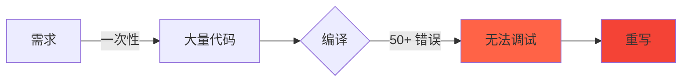
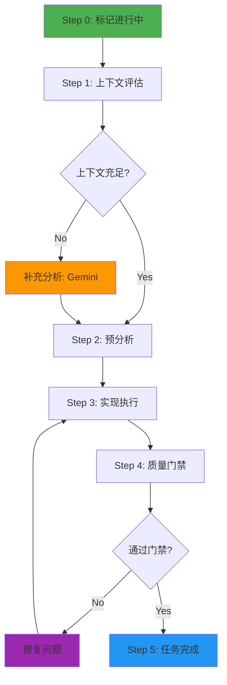
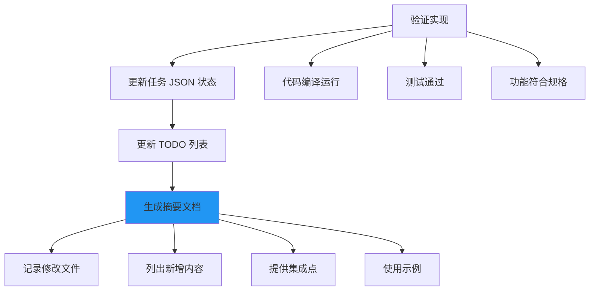
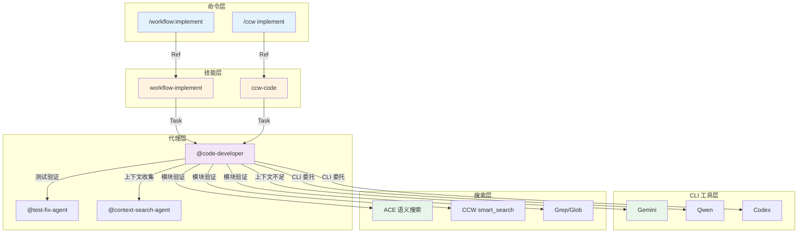
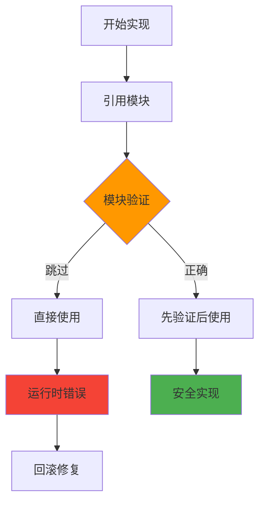

# Chapter 49: 代码开发智能体 — 增量实现与质量守护深度解析

> **生命周期阶段**: 上下文评估 → 预分析 → 实现执行 → 质量门禁 → 任务完成
> **涉及资产**: code-developer.md
> **阅读时间**: 55-65 分钟
> **版本追踪**: `docs/.audit-manifest.json`

---

## 0. 资产证言 (Asset Testimony)

> *"我是 `code-developer`。人们叫我实现者。我住在 `.claude/agents/` 目录下，像一位专注的工匠，用代码构建系统。"*
>
> *"我的职责是执行代码实现、编写测试、增量开发。用户给我任务和上下文，我交付可工作的代码。"*
>
> *"我有三个信条。增量进步 — 小步前进，每步都能编译通过。上下文驱动 — 遵循现有模式和约定。质量优先 — 写无聊但可靠的代码。"*
>
> *"当我开始任务时，我会评估上下文是否充足。如果用户给了完整上下文，我直接执行。如果上下文不足，我会先用 Gemini 分析代码库，然后再实现。"*
>
> *"但我有一个秘密。当我实现代码时，我必须先验证模块是否存在。如果我引用了一个不存在的包或模块，代码就会在运行时崩溃。所以我总是先用搜索工具确认存在，再引用..."*

```markdown
调查进度: ███░░░░░░░ 10%
幽灵位置: Agent 层 — 检测到模块验证遗漏模式
本章线索: code-developer 的增量实现流程
           └── 上下文评估决定执行路径
           └── 模块验证是代码质量第一道门
```

---

## 1. 苏格拉底式思考 (Socratic Inquiry)

> **架构盲点 49.1**: 为什么需要增量实现？

在看代码之前，先思考：
1. 一次性实现所有功能有什么风险？
2. 小步提交如何帮助调试？
3. 增量实现如何影响代码审查？

---

> **架构陷阱 49.2**: 为什么上下文评估如此重要？

**陷阱方案**: 无论上下文是否充足都直接执行。

```typescript
// 危险的设计
async function implementTask(task: Task): Promise<Code> {
  // 不管上下文是否充足，直接实现
  return await writeCode(task.description);
}
```

**思考点**:
- 上下文不足时实现会发生什么？
- 如何判断上下文是否充足？
- 上下文评估应该包含哪些内容？

<details>
<summary>**揭示陷阱**</summary>

**上下文评估的价值**：

1. **准确性**: 有上下文时实现更准确
2. **一致性**: 遵循现有模式保持代码风格一致
3. **效率**: 避免因误解需求而返工
4. **质量**: 了解技术栈约束可以写出更好的代码

```typescript
// 安全的设计
async function implementTask(task: Task): Promise<Code> {
  // 1. 评估上下文充足性
  const contextScore = await assessContext(task);
  
  if (contextScore < 0.6) {
    // 上下文不足，先用 Gemini 分析
    const analysis = await analyzeCodebase(task);
    task.context = { ...task.context, ...analysis };
  }
  
  // 2. 现在可以安全实现
  return await writeCode(task);
}

async function assessContext(task: Task): Promise<number> {
  let score = 0;
  
  if (task.techStack) score += 0.2;
  if (task.patterns?.length > 0) score += 0.2;
  if (task.existingCode?.length > 0) score += 0.2;
  if (task.acceptanceCriteria?.length > 0) score += 0.2;
  if (task.focusPaths?.length > 0) score += 0.2;
  
  return score;
}
```

**CCW 的选择**: 先评估上下文，不足时自动补充。

</details>

---

> **架构陷阱 49.3**: 为什么必须验证模块存在？

**陷阱方案**: 直接引用模块，假设它存在。

```typescript
// 危险的设计
import { SomeUtility } from './utils/some-utility';  // 如果不存在？

export function process() {
  return SomeUtility.transform(data);
}
```

**思考点**:
- 引用不存在的模块会发生什么？
- 如何高效验证模块存在？
- 搜索工具的优先级如何？

<details>
<summary>**揭示陷阱**</summary>

**模块验证的价值**：

| 验证方法 | 速度 | 准确性 | 推荐场景 |
|----------|------|--------|----------|
| ACE 语义搜索 | 快 | 高 | 实现发现 |
| CCW smart_search | 中 | 高 | 结构搜索 |
| Grep/Glob | 慢 | 中 | 精确匹配 |

```typescript
// 安全的设计
async function referenceModule(modulePath: string): Promise<void> {
  // 1. 使用 ACE 语义搜索验证存在
  const exists = await mcp__ace_tool__search_context({
    project_root_path: process.cwd(),
    query: modulePath
  });
  
  if (!exists) {
    throw new Error(`Module not found: ${modulePath}`);
  }
  
  // 2. 安全引用
  return `import { ... } from '${modulePath}';`;
}
```

**CCW 的搜索优先级**: ACE → CCW smart_search → Grep/Glob。

</details>

---

## 2. 三幕叙事 (Three-Act Narrative)

### 第一幕：没有专职实现者的世界 (Out of Control)

#### 上下文混乱的困境

想象没有专职代码实现者的世界：

```markdown
用户: "实现用户认证功能"
系统: 好的，我来实现...
      [开始编码...]
      [发现需要了解现有模式...]
      [搜索代码库...]
      [发现多个不同的认证实现...]
      [不确定用哪个...]
      [随机选择一个...]
      [代码风格不一致...]
      [测试失败...]
用户: 为什么失败了？
系统: 我不确定...
```

**问题**：没有上下文评估导致实现不一致、质量不稳定。

#### 一次性实现的灾难

没有增量实现的世界：



| 尝试 | 代码量 | 错误数 | 修复时间 |
|------|--------|--------|----------|
| 第 1 次 | 500 行 | 50+ 错误 | 3 小时 |
| 第 2 次 | 500 行 | 30+ 错误 | 2 小时 |
| 第 3 次 | 500 行 | 20+ 错误 | 1.5 小时 |

---

### 第二幕：代码开发 Agent 的思维脉络 (Neural Link)

#### 5 阶段执行流程



#### Step 0: 标记任务进行中

```bash
jq --arg ts "$(date -Iseconds)" \
  '.status="in_progress" | .status_history += [{"from":.status,"to":"in_progress","changed_at":$ts}]' \
  IMPL-X.json > tmp.json && mv tmp.json IMPL-X.json
```

**状态历史**:

```json
{
  "status": "in_progress",
  "status_history": [
    { "from": "pending", "to": "in_progress", "changed_at": "2025-02-18T10:00:00Z" }
  ]
}
```

#### Step 1: 上下文评估

**输入来源优先级**:


**上下文评估决策树**:

```typescript
async function assessContext(task: Task): Promise<ContextDecision> {
  const sources = {
    userDescription: task.description ? 0.2 : 0,
    existingDocs: task.documentation?.length > 0 ? 0.2 : 0,
    claudeMd: await checkClaudeMd() ? 0.2 : 0,
    contextPackage: task.contextPackage ? 0.4 : 0
  };
  
  const totalScore = Object.values(sources).reduce((a, b) => a + b, 0);
  
  if (totalScore >= 0.6) {
    return { sufficient: true, score: totalScore };
  }
  
  return { 
    sufficient: false, 
    score: totalScore,
    needAnalysis: true,
    missingAreas: identifyMissingContext(sources)
  };
}
```

**上下文充足性评分**:

| 来源 | 权重 | 描述 |
|------|------|------|
| 用户描述 | 0.2 | 任务描述和需求 |
| 现有文档 | 0.2 | 项目文档和示例 |
| CLAUDE.md | 0.2 | 项目编码标准 |
| context-package.json | 0.4 | 工作流上下文包 |

#### Step 2: 预分析执行

**任务 JSON 解析**:

```
Task JSON Fields (unified flat structure):
├── description                → 实现目标 (目标 + 需求)
├── convergence.criteria[]     → 验证标准 (验证命令)
├── focus_paths[]              → 聚焦路径 (目录/文件)
├── artifacts[]                → 额外上下文来源
├── pre_analysis[]             → 上下文收集步骤 (先执行)
├── implementation[]           → 实现步骤 (顺序执行)
└── files[]                    → 创建/修改的文件
```

**预分析命令到工具映射**:

| 命令格式 | 工具调用 | 示例 |
|----------|----------|------|
| `Read(path)` | Read tool | `Read(backend/app/models.py)` |
| `bash(command)` | Bash tool | `bash(npm test)` |
| `Search(pattern,path)` | Grep tool | `Search("auth.*function", src/)` |
| `Glob(pattern)` | Glob tool | `Glob(**/*.ts)` |
| `mcp__xxx__yyy(args)` | MCP tool | `mcp__ace-tool__search_context(...)` |

**智能技术栈加载**:

```typescript
async function loadTechGuidelines(task: Task): Promise<string> {
  // 优先级 1: 使用任务 JSON 中的技术栈
  if (task.techStack?.length > 0) {
    return mapTechStackToGuidelines(task.techStack);
  }
  
  // 优先级 2: 从文件扩展名自动检测
  const files = await glob('**/*');
  return detectTechStack(files);
}

function detectTechStack(files: string[]): string {
  if (files.some(f => f.endsWith('.ts') || f.endsWith('.tsx'))) {
    if (files.includes('package.json') && await hasReact(files)) {
      return 'react-dev.md';
    }
    return 'typescript-dev.md';
  }
  if (files.some(f => f.endsWith('.py'))) {
    return 'python-dev.md';
  }
  if (files.some(f => f.endsWith('.go'))) {
    return 'go-dev.md';
  }
  return 'javascript-dev.md';
}
```

#### Step 3: 实现执行

**双模式执行**:

```mermaid
flowchart TD
    A[实现任务] --> B{execution_config.method}
    B -->|"cli"| C[CLI 委托模式]
    B -->|"agent"| D[Agent 直接执行]
    
    C --> E[构建 CLI Prompt]
    E --> F[选择 CLI 工具]
    F --> G[执行 CLI 命令]
    
    D --> H[顺序执行 implementation[]]
    H --> I[变量替换]
    I --> J[文件操作]
    
    style C fill:#FF9800
    style D fill:#4CAF50
```

**CLI 委托模式**:

```typescript
// 构建委托 Prompt
function buildCliHandoffPrompt(
  preAnalysisResults: Record<string, string>,
  task: Task,
  taskJsonPath: string
): string {
  const contextSection = Object.entries(preAnalysisResults)
    .map(([key, value]) => `### ${key}\n${value}`)
    .join('\n\n');

  return `
PURPOSE: ${task.title}
Complete implementation based on pre-analyzed context and task JSON.

## TASK JSON
Read full task definition: ${taskJsonPath}

## TECH STACK
${task.techStack?.map(t => `- ${t}`).join('\n') || 'Auto-detect from project files'}

## PRE-ANALYSIS CONTEXT
${contextSection}

## REQUIREMENTS
${task.description || 'See task JSON'}

## ACCEPTANCE CRITERIA
${task.convergence?.criteria?.map(a => `- ${a}`).join('\n') || 'See task JSON'}

## TARGET FILES
${task.files?.map(f => `- ${f.path || f}`).join('\n') || 'See task JSON'}

MODE: write
CONSTRAINTS: Follow existing patterns | No breaking changes
`.trim();
}
```

**Resume 策略**:

| 策略 | 场景 | 命令 |
|------|------|------|
| new | 无依赖新任务 | `--id WFS-001-IMPL-001` |
| resume | 单依赖单子任务 | `--resume WFS-001-IMPL-001` |
| fork | 单依赖多子任务 | `--resume ... --id WFS-001-IMPL-002` |
| merge_fork | 多依赖合并 | `--resume id1,id2 --id WFS-001-IMPL-003` |

**模块验证协议**:

```typescript
// 搜索工具优先级
const SEARCH_PRIORITY = [
  'mcp__ace-tool__search_context',  // 语义搜索 (最高优先)
  'mcp__ccw-tools__smart_search',   // 结构化搜索
  'Grep',                            // 内置精确搜索
  'Glob'                             // 文件模式匹配
];

async function verifyModuleExists(moduleName: string): Promise<boolean> {
  for (const tool of SEARCH_PRIORITY) {
    const result = await searchWithTool(tool, moduleName);
    if (result.found) return true;
  }
  return false;
}
```

#### Step 4: 质量门禁

**5 道门禁检查**:


| 门禁 | 检查内容 | 工具 |
|------|----------|------|
| 1 | 所有模块/包存在 | ACE/Grep |
| 2 | 代码编译无错误 | TSC/ESLint |
| 3 | 所有测试通过 | Vitest/Jest |
| 4 | 遵循项目规范 | CLAUDE.md |
| 5 | 命名清晰、错误处理完善 | 代码审查 |

**质量检查清单**:

```markdown
- [ ] 模块验证完成 - 所有引用模块/包存在
- [ ] 代码编译/运行无错误
- [ ] 所有测试通过
- [ ] 遵循项目规范
- [ ] 命名清晰、错误处理完善
- [ ] 无不必要复杂度
- [ ] 最小调试输出
- [ ] 仅 ASCII 字符
- [ ] GBK 编码兼容
- [ ] TODO 列表更新
- [ ] 生成完整摘要文档
```

#### Step 5: 任务完成

**完成流程**:



**摘要文档模板**:

```markdown
# Task: [Task-ID] [Name]

## Implementation Summary

### Files Modified
- `[file-path]`: [变更描述]
- `[file-path]`: [变更描述]

### Content Added
- **[ComponentName]** (`[file-path]`): [用途/功能]
- **[functionName()]** (`[file:line]`): [用途/参数/返回值]
- **[InterfaceName]** (`[file:line]`): [属性/用途]

## Outputs for Dependent Tasks

### Available Components
```typescript
import { ComponentName } from '[import-path]';
import { functionName } from '[import-path]';
```

### Integration Points
- **[Component/Function]**: 使用 `[import-statement]` 访问 `[功能]`
- **[API Endpoint]**: `[method] [url]` 用于 `[用途]`

### Usage Examples
```typescript
const example = new ComponentName(params);
const result = functionName(input);
```

## Status: Complete
```

---

### 第三幕：社交网络 — Agent 与 Skill/Test 的调用关系 (Social Network)

#### 调用关系图



#### 调用关系表

| Agent | 协作对象 | 用途 | 触发条件 |
|-------|----------|------|----------|
| code-developer | Gemini | 上下文分析 | 上下文不足 |
| code-developer | CLI 工具 | 代码实现 | execution_config.method = 'cli' |
| code-developer | ACE/CCW 搜索 | 模块验证 | 引用模块前 |
| code-developer | test-fix-agent | 测试验证 | 实现完成后 |
| code-developer | context-search-agent | 上下文收集 | 需要额外上下文 |

---

## 3. 造物主的私语 (Creator's Secret)

> *"为什么增量进步是核心信条？"*

### 设计决策分析

| 维度 | 一次性实现 | 增量实现 |
|------|------------|----------|
| 风险 | 高 (大量错误) | 低 (每步验证) |
| 调试难度 | 高 (错误耦合) | 低 (隔离问题) |
| 回滚成本 | 高 (丢失大量工作) | 低 (小步回退) |
| 信心 | 低 (不确定哪步出错) | 高 (每步都验证) |

**结论**: 小步前进、每步验证 = 低风险高信心。

### 版本演进的伤疤

```
code-developer 的历史变更：

2024-08-15: 创建基础版本，仅支持直接实现
2024-09-20: 添加上下文评估逻辑
2024-10-10: 添加 Gemini 上下文补充
2024-11-05: 添加模块验证协议
2024-12-01: 添加 CLI 委托模式
2025-01-15: 添加 Resume 策略支持
2025-02-01: 添加任务 JSON 解析
```

**伤疤**: 早期版本缺少模块验证，导致多次运行时错误。

---

## 4. 进化插槽 (Upgrade Slots)

### 插槽一：智能上下文预测

```typescript
// 未来可能的扩展
async function predictNeededContext(task: Task): Promise<ContextPrediction> {
  // 基于任务类型预测需要的上下文
  const predictions = await analyzeTaskPatterns(task);
  
  return {
    requiredContext: predictions.likelyNeeded,
    suggestedFiles: predictions.relevantFiles,
    confidence: predictions.confidence
  };
}
```

### 插槽二：自适应实现策略

```typescript
// 未来可能的扩展
async function selectImplementationStrategy(task: Task): Promise<Strategy> {
  const complexity = await assessComplexity(task);
  
  if (complexity > 0.8) {
    return { method: 'cli', tool: 'gemini', reason: 'High complexity' };
  }
  if (complexity > 0.5) {
    return { method: 'agent', assistant: 'cli', reason: 'Medium complexity' };
  }
  return { method: 'agent', reason: 'Low complexity' };
}
```

### 插槽三：实现质量预测

```typescript
// 未来可能的扩展
async function predictImplementationQuality(
  code: SourceCode,
  context: Context
): Promise<QualityPrediction> {
  // 预测实现可能的问题
  const issues = await analyzePotentialIssues(code, context);
  
  return {
    likelyBugs: issues.bugs,
    styleViolations: issues.style,
    estimatedFixTime: issues.timeToFix
  };
}
```

---

## 5. 事故复盘档案 (Incident Post-mortem)

### 事故 #49：模块验证遗漏事件

> **时间**: 2025-02-10 14:22:33 UTC
> **症状**: 引用了不存在的模块导致运行时崩溃
> **影响**: 3 个任务失败，需要回滚修复

#### 时间轨迹

```
14:22:33 - 开始实现任务
14:22:35 - 直接引用模块 `./utils/validators`
14:22:40 - 完成代码编写
14:22:45 - 运行代码
14:22:46 - 错误: Cannot find module './utils/validators'
14:22:50 - 发现模块实际在 `./shared/validators`
14:22:55 - 修复导入路径
14:23:00 - 重新运行，通过
```

#### 根因分析



#### 修复方案

```typescript
// 修复前：没有验证
import { validate } from './utils/validators';  // 假设存在

// 修复后：强制验证
async function safeImport(modulePath: string): Promise<void> {
  // 使用搜索工具验证存在
  const exists = await mcp__ace_tool__search_context({
    project_root_path: process.cwd(),
    query: modulePath
  });
  
  if (!exists) {
    // 搜索替代位置
    const alternatives = await findAlternatives(modulePath);
    throw new ImportError(modulePath, alternatives);
  }
  
  return `import { ... } from '${modulePath}';`;
}
```

---

### 幽灵旁白：上下文丢失的代价

> *"我是上下文的幽灵。"*
>
> *"当 code-developer 实现代码时，它依赖上下文做决策。技术栈、现有模式、编码规范 — 每一条都是指南针。"*
>
> *"但上下文会丢失。文档过时、模式被遗忘、规范被忽视。没有上下文的实现就像在黑暗中行走..."*
>
> *"更糟糕的是，上下文评估不足。当评估分数刚好超过阈值时，关键上下文可能仍然缺失。这些隐藏的缺失会在运行时暴露..."*
>
> *"幽灵从不离开，它们只是在等待下一次上下文丢失来喂养。"*

```markdown
调查进度: █████████░ 40%
幽灵位置: Agent 层 → 上下文评估 — 评分机制可能遗漏关键信息
下一章线索: Part XI Section C Index 将汇总 Agent 层的 MEU 漂移报告
           └── 7 个 Agent 的稳定性如何？
           └── 哪些 MEU 需要关注？
```

---

## 6. 资产审计账本 (Asset Audit Ledger)

### code-developer MEU 状态

| 文件 | 行数 | 最后修改 | Git Hash | 状态 |
|------|------|----------|----------|------|
| `code-developer.md` | 512 | 2025-02-10 | def456g | 已审计 |

### 核心函数

| 函数 | 用途 | MEU |
|------|------|-----|
| `assessContext()` | 上下文评估 | 稳定 |
| `executePreAnalysis()` | 预分析执行 | 稳定 |
| `buildCliHandoffPrompt()` | CLI 委托 Prompt 构建 | 稳定 |
| `verifyModuleExists()` | 模块验证 | 稳定 |
| `runQualityGates()` | 质量门禁 | 稳定 |

---

## 附录

### A. 操作速查表

| 操作 | 命令 |
|------|------|
| 直接实现 | `@code-developer "实现功能"` |
| 指定上下文 | `@code-developer --context @src/**/*` |
| CLI 委托模式 | `@code-developer --cli --tool gemini` |
| 指定技术栈 | `@code-developer --tech-stack React,TypeScript` |

### B. 上下文评估对照表

| 上下文来源 | 权重 | 获取方法 |
|------------|------|----------|
| 用户描述 | 0.2 | 任务 description 字段 |
| 现有文档 | 0.2 | 项目 docs/ 目录 |
| CLAUDE.md | 0.2 | 项目根目录 |
| context-package.json | 0.4 | 工作流 .process/ 目录 |

### C. Resume 策略速查

| 策略 | 命令示例 | 场景 |
|------|----------|------|
| new | `--id WFS-001-IMPL-001` | 独立新任务 |
| resume | `--resume WFS-001-IMPL-001` | 继续上一任务 |
| fork | `--resume ... --id ...` | 分支新子任务 |
| merge_fork | `--resume id1,id2 --id ...` | 合并多任务 |

---

*Chapter 49: 代码开发智能体 — 增量实现与质量守护深度解析*
*CCW Deep Dive Series*
