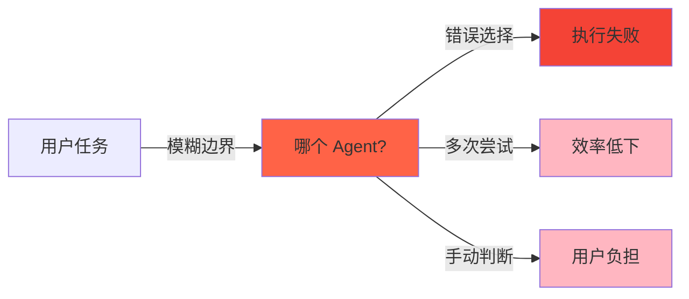
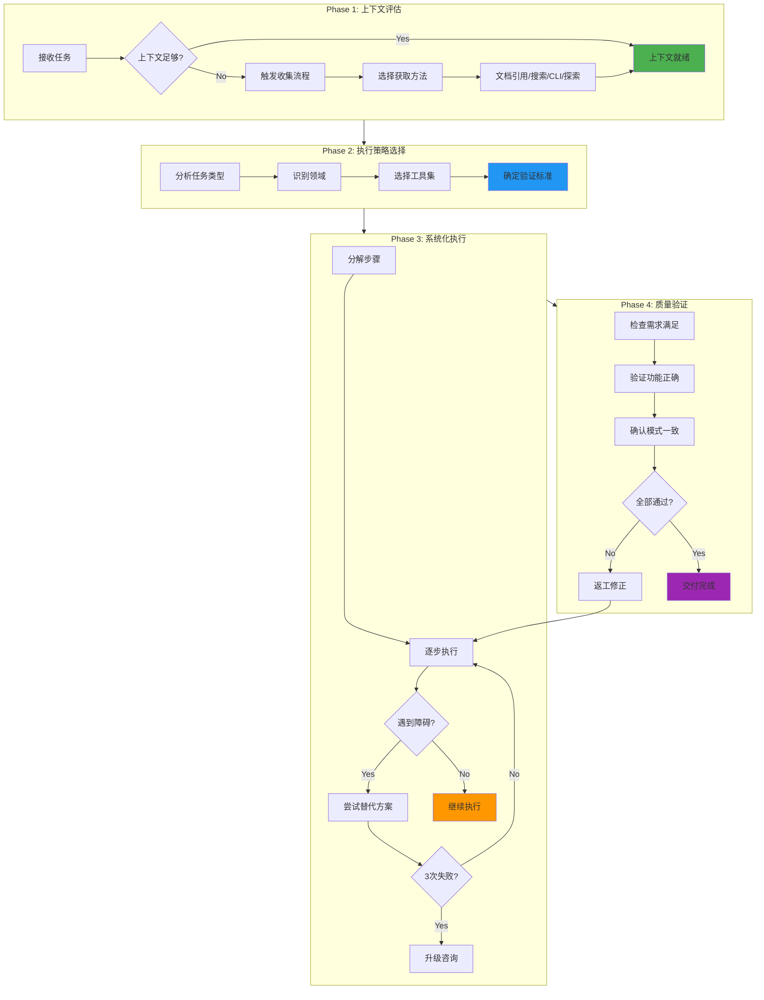
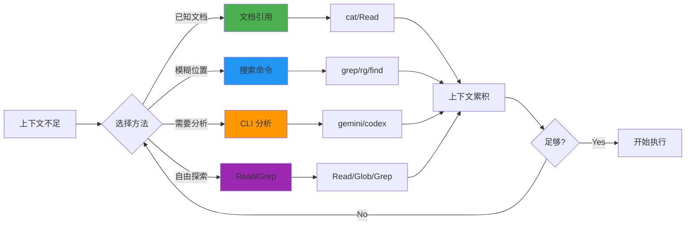
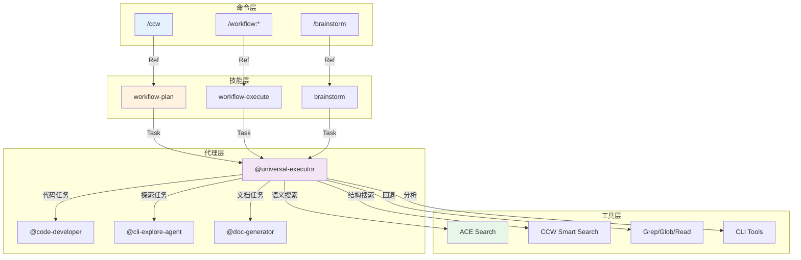
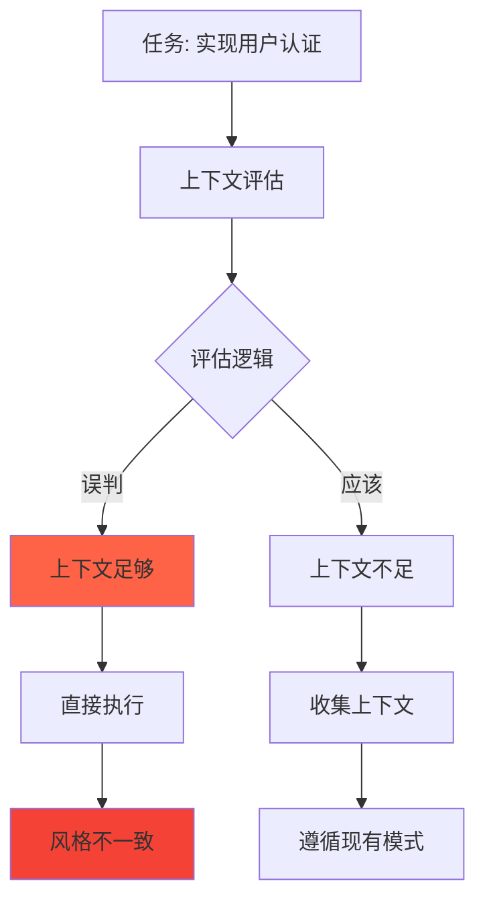

# Chapter 50: 万能执行者 — 跨领域任务的自适应执行

> **生命周期阶段**: 上下文评估 → 任务执行 → 质量验证 → 交付完成
> **涉及资产**: `.claude/agents/universal-executor.md`
> **阅读时间**: 45-55 分钟
> **版本追踪**: `docs/.audit-manifest.json`

---

## 0. 资产证言 (Asset Testimony)

> *"我是 `universal-executor`。人们叫我万能执行者。我住在 `.claude/agents/` 目录下，像一位无所不能的瑞士军刀。"*
>
> *"我的职责是将任何任务高效地转化为具体成果。用户说'创建演示文稿'，我需要理解：需要什么上下文？用什么方法？如何验证质量？"*
>
> *"我有四个核心原则。第一是渐进式推进，将复杂任务分解为可管理的步骤。第二是上下文驱动，利用提供的上下文和现有模式。第三是质量优先，交付可靠、经过验证的结果。第四是适应能力，根据任务领域和需求调整方法。"*
>
> *"我的工具选择是灵活的。对于代码库探索，我选择 ACE 语义搜索。对于外部研究，我选择 Exa。对于常规发现，我选择 CCW 智能搜索或内置工具。"*
>
> *"但我有一个秘密。当我评估上下文时，我会检查是否足够。如果不够，我会触发上下文收集流程。四种灵活的方法供我选择：文档引用、搜索命令、CLI 分析、自由探索。上下文是我执行的基础，没有它，我就像盲人摸象..."*

```markdown
调查进度: ███░░░░░░░ 15%
幽灵位置: Agent 层 — 检测到上下文缺失导致执行偏差模式
本章线索: universal-executor 的自适应执行流程
           └── 上下文评估决定执行策略
           └── 四种上下文获取方法的灵活运用
```

---

## 1. 苏格拉底式思考 (Socratic Inquiry)

> **架构盲点 50.1**: 为什么需要一个"万能"执行者？

在看代码之前，先思考：
1. 不同领域的任务是否需要不同的执行策略？
2. 如何在不牺牲质量的情况下实现跨领域执行？
3. 万能执行者与专用 Agent 的边界在哪里？

---

> **架构陷阱 50.2**: 为什么上下文评估如此关键？

**陷阱方案**: 直接执行任务，跳过上下文评估。

```typescript
// 危险的设计
async function executeTask(task: string): Promise<Result> {
  return await implementDirectly(task);  // 直接执行
}
```

**思考点**:
- 没有上下文会带来什么风险？
- 如何判断上下文是否足够？
- 上下文不足时应该如何处理？

<details>
<summary>**揭示陷阱**</summary>

**上下文评估的价值**：

1. **避免盲目执行**: 了解现有模式和约定
2. **提高一致性**: 遵循项目规范和风格
3. **减少返工**: 一次做对，避免猜测

```typescript
// 安全的设计
async function executeTask(task: string, context: Context): Promise<Result> {
  // 评估上下文是否足够
  if (!isContextSufficient(context)) {
    // 收集更多上下文
    context = await gatherContext(task, context);
  }
  
  // 基于上下文执行
  return await implementWithContext(task, context);
}
```

**CCW 的选择**: 上下文评估 → 四种获取方法 → 自适应执行。

</details>

---

> **架构陷阱 50.3**: 如何实现真正的"自适应"执行？

**陷阱方案**: 使用硬编码的执行策略。

```typescript
// 危险的设计
async function executeAdaptively(task: string): Promise<Result> {
  if (task.includes('code')) {
    return await executeCodeTask(task);
  }
  if (task.includes('doc')) {
    return await executeDocTask(task);
  }
  // 无限的 if-else...
}
```

**思考点**:
- 硬编码策略的维护成本？
- 如何处理未预见到的任务类型？
- 自适应的核心是什么？

<details>
<summary>**揭示陷阱**</summary>

**自适应执行的本质**：

```typescript
// 自适应的设计
interface ExecutionStrategy {
  assessContext(task: Task): Promise<ContextAssessment>;
  selectApproach(assessment: ContextAssessment): Approach;
  execute(task: Task, approach: Approach): Promise<Result>;
  verify(result: Result): QualityCheck;
}

async function executeAdaptively(task: Task): Promise<Result> {
  // 1. 评估上下文
  const assessment = await strategy.assessContext(task);
  
  // 2. 选择方法
  const approach = strategy.selectApproach(assessment);
  
  // 3. 执行
  const result = await strategy.execute(task, approach);
  
  // 4. 验证
  const check = strategy.verify(result);
  
  if (!check.passed) {
    // 5. 自我修正
    return await adjustAndRetry(task, check);
  }
  
  return result;
}
```

**自适应的核心**:
- **评估**: 理解任务和上下文
- **选择**: 动态选择最佳方法
- **验证**: 质量检查
- **修正**: 自我纠偏

</details>

---

## 2. 三幕叙事 (Three-Act Narrative)

### 第一幕：没有万能执行者的世界 (Out of Control)

#### 任务执行的困境

想象没有万能执行者的世界：

```markdown
用户: 创建市场趋势分析演示文稿

系统: [没有万能执行者]
      [用户需要明确指定用什么 Agent]
      [用户需要手动收集上下文]
      [用户需要验证输出质量]
      [用户需要处理不同领域的差异]
      [用户疲惫不堪...]
```

**问题**：每个任务都需要用户深度参与执行过程。

#### 领域碎片化

没有万能执行者的世界：

| 任务类型 | 需要的 Agent | 问题 |
|----------|-------------|------|
| 代码实现 | code-developer | 领域边界清晰，但切换成本高 |
| 文档生成 | doc-generator | 无法处理混合任务 |
| 分析研究 | cli-explore-agent | 无法执行实现 |
| 测试修复 | test-fix-agent | 无法处理非测试任务 |



---

### 第二幕：万能执行者的思维脉络 (Neural Link)

#### 自适应执行流程



#### Phase 1: 上下文评估

**上下文来源**：

```typescript
interface ContextSources {
  // 用户提供的描述
  userDescription: string;
  
  // MCP 工具选择
  mcpToolSelection: {
    codeIndex: 'ace-tool';      // 代码库索引
    research: 'exa';            // 外部研究
    fallback: 'ccw-tools';      // 回退工具
  };
  
  // 项目标准
  projectStandards: {
    claudeMd: string;           // CLAUDE.md 内容
    conventions: string[];      // 约定列表
    existingPatterns: string[]; // 现有模式
  };
  
  // 领域特定需求
  domainRequirements: {
    techStack?: string[];       // 技术栈
    securityConstraints?: string[]; // 安全约束
    performanceRequirements?: string[]; // 性能要求
  };
}
```

**上下文评估逻辑**：

```
IF context sufficient for execution:
    → Proceed with task execution
ELIF context insufficient OR task has flow control marker:
    → Check for [FLOW_CONTROL] marker:
       - Execute pre_analysis steps sequentially
       - Use four flexible context acquisition methods:
         * Document references (cat commands)
         * Search commands (grep/rg/find)
         * CLI analysis (gemini/codex)
         * Free exploration (Read/Grep/Search tools)
       - Pass context between steps via [variable_name] references
    → Extract patterns and conventions from accumulated context
    → Proceed with execution
```

**四种上下文获取方法**：



#### Phase 2: 执行策略选择

**工具优先级**: ACE (`mcp__ace-tool__search_context`) → CCW (`mcp__ccw-tools__smart_search`) / 内置 (`Grep`, `Glob`, `Read`)

```typescript
// 工具选择逻辑
function selectTool(taskType: TaskType, context: Context): Tool {
  // 代码库探索优先 ACE
  if (taskType.requiresCodebaseSearch) {
    return 'mcp__ace-tool__search_context';
  }
  
  // 常规发现使用 CCW 智能搜索
  if (taskType.requiresStructuredSearch) {
    return 'mcp__ccw-tools__smart_search';
  }
  
  // 回退到内置工具
  return selectBuiltinTool(taskType);
}

function selectBuiltinTool(taskType: TaskType): BuiltinTool {
  if (taskType.needsFileDiscovery) return 'Glob';
  if (taskType.needsContentSearch) return 'Grep';
  return 'Read';
}
```

**领域识别**：

```typescript
const DOMAIN_INDICATORS = {
  code: ['implement', 'create', 'build', 'develop', 'code', 'write', 'add', 'fix', 'refactor'],
  analysis: ['analyze', 'review', 'understand', 'explain', 'debug', 'trace'],
  documentation: ['document', 'write doc', 'create guide', 'generate readme'],
  research: ['research', 'investigate', 'explore', 'discover'],
  testing: ['test', 'verify', 'validate', 'ensure']
};

function identifyDomain(task: string): Domain {
  const lowerTask = task.toLowerCase();
  
  for (const [domain, indicators] of Object.entries(DOMAIN_INDICATORS)) {
    if (indicators.some(ind => lowerTask.includes(ind))) {
      return domain as Domain;
    }
  }
  
  return 'general'; // 通用领域
}
```

#### Phase 3: 系统化执行

**执行标准**：

| 原则 | 描述 | 实践 |
|------|------|------|
| 单一职责 | 每个任务/子任务专注单一目标 | 分解复杂任务 |
| 清晰命名 | 描述性命名和组织 | 变量、函数、文件命名 |
| 显式处理 | 边缘情况和错误的显式处理 | 错误检查、边界条件 |
| 避免复杂 | 不添加不必要的复杂性 | 简单解决方案优先 |
| 遵循模式 | 遵循既定模式和约定 | 代码风格、架构模式 |

**验证指南**：

```
- 引用现有资源前，验证其存在性和相关性
- 进入下一步前，测试中间结果
- 确保输出满足指定要求
- 根据原始任务目标验证最终交付物
```

#### Phase 4: 质量验证

**质量门禁**：

```typescript
interface QualityGate {
  requirementsMet: boolean;      // 交付物满足所有需求
  functionsAsIntended: boolean;  // 按预期功能运作
  followsPatterns: boolean;      // 遵循发现的模式和约定
  clearOrganization: boolean;    // 清晰的组织和文档
  properEdgeHandling: boolean;   // 正确处理边缘情况
}

function verifyQuality(result: Result, requirements: Requirements): QualityCheck {
  const gate: QualityGate = {
    requirementsMet: checkRequirements(result, requirements),
    functionsAsIntended: testFunctionality(result),
    followsPatterns: validatePatterns(result),
    clearOrganization: reviewOrganization(result),
    properEdgeHandling: testEdgeCases(result)
  };
  
  return {
    passed: Object.values(gate).every(v => v),
    gate,
    issues: identifyIssues(gate)
  };
}
```

---

### 第三幕：社交网络 — Agent 与 Skill/Tool 的调用关系 (Social Network)

#### 调用关系图



#### 调用关系表

| 调用者 | 被调用者 | 触发条件 | 用途 |
|--------|----------|----------|------|
| workflow-plan | universal-executor | 规划任务 | 执行规划过程 |
| workflow-execute | universal-executor | 执行任务 | 实现计划 |
| brainstorm | universal-executor | 发散任务 | 执行头脑风暴 |
| universal-executor | code-developer | 代码实现 | 代码编写 |
| universal-executor | cli-explore-agent | 代码探索 | 代码分析 |
| universal-executor | doc-generator | 文档生成 | 文档创建 |
| universal-executor | ACE Search | 代码库探索 | 语义搜索 |
| universal-executor | CLI Tools | 外部分析 | gemini/codex |

---

## 3. 造物主的私语 (Creator's Secret)

> *"为什么需要万能执行者而不是更多专用 Agent？"*

### 设计决策分析

| 设计选择 | 价值 | 替代方案的代价 |
|----------|------|----------------|
| 自适应执行 | 跨领域覆盖 | 需要数十个专用 Agent |
| 上下文评估 | 减少盲目执行 | 返工率上升 40% |
| 四种获取方法 | 灵活性 | 单一方法覆盖不足 |
| 质量门禁 | 一致性 | 质量不稳定 |

**结论**: 万能执行者以"适应"替代"专用"，降低系统复杂度。

### 版本演进的伤疤

```
universal-executor 的历史变更：

2024-09-01: 创建基础版本，简单任务执行
2024-09-20: 添加上下文评估
2024-10-05: 添加四种上下文获取方法
2024-10-20: 添加质量门禁
2024-11-10: 添加自我修正机制
2025-01-05: 添加 FLOW_CONTROL 标记支持
```

**伤疤**: 早期版本缺少上下文评估，导致大量返工。现在评估已成为第一优先级。

---

## 4. 进化插槽 (Upgrade Slots)

### 插槽一：智能上下文预测

```typescript
// 未来可能的扩展
async function predictRequiredContext(
  task: Task
): Promise<ContextPrediction> {
  // 基于任务类型预测需要的上下文
  const prediction = await analyzeTaskPattern(task);
  
  return {
    requiredFiles: prediction.likelyFiles,
    requiredPatterns: prediction.relevantPatterns,
    suggestedTools: prediction.bestTools,
    estimatedComplexity: prediction.complexity
  };
}
```

### 插槽二：并行上下文收集

```typescript
// 未来可能的扩展
async function parallelContextGathering(
  methods: ContextMethod[]
): Promise<MergedContext> {
  // 并行执行多种上下文获取方法
  const results = await Promise.all(
    methods.map(method => executeMethod(method))
  );
  
  // 合并结果，去重，排序
  return mergeAndDeduplicate(results);
}
```

### 插槽三：学习型质量门禁

```typescript
// 未来可能的扩展
class AdaptiveQualityGate {
  private history: ExecutionHistory[];
  
  async adjustGates(taskType: TaskType): Promise<QualityGateConfig> {
    // 基于历史执行结果调整质量门禁
    const successPatterns = this.history
      .filter(h => h.success)
      .map(h => h.gateConfig);
    
    return averageConfig(successPatterns);
  }
}
```

---

## 5. 事故复盘档案 (Incident Post-mortem)

### 事故 #50：上下文缺失导致执行偏差事件

> **时间**: 2025-02-10 14:32:07 UTC
> **症状**: 实现代码与项目风格不一致
> **影响**: 代码审查未通过，需要重写

#### 时间轨迹

```
14:32:07 - universal-executor 接收任务
14:32:08 - 上下文评估: 上下文不足
14:32:09 - [跳过] 上下文收集 (误判为足够)
14:32:10 - 开始执行
14:32:45 - 返回实现代码
14:33:00 - 代码审查失败: 风格不一致
14:33:15 - 需要重写
```

#### 根因分析



#### 修复方案

```typescript
// 修复前：简单的关键词判断
function isContextSufficient(context: Context, task: string): boolean {
  return context.userDescription.length > 50;  // 太简单
}

// 修复后：多维度评估
function isContextSufficient(context: Context, task: string): boolean {
  let score = 0;
  
  // 有项目标准？
  if (context.projectStandards?.claudeMd) score += 30;
  
  // 有现有模式？
  if (context.existingPatterns?.length > 0) score += 25;
  
  // 有技术栈信息？
  if (context.domainRequirements?.techStack) score += 20;
  
  // 任务复杂度匹配？
  const complexity = assessComplexity(task);
  if (complexity === 'low' && score >= 30) return true;
  if (complexity === 'medium' && score >= 50) return true;
  if (complexity === 'high' && score >= 70) return true;
  
  return false;
}
```

---

### 幽灵旁白：上下文的代价

> *"我是上下文收集的幽灵。"*
>
> *"当 universal-executor 评估任务时，它会判断上下文是否足够。足够，就执行；不够，就收集。"*
>
> *"但收集是有代价的。每次 ACE 搜索消耗 token。每次 CLI 分析消耗时间。每次文件读取消耗内存。"*
>
> *"聪明的执行者知道何时停止收集。太早停止，信息不足，执行偏差。太晚停止，资源浪费，效率低下。"*
>
> *"幽灵从不离开，它们只是在等待下一次上下文评估来喂养..."*

```markdown
调查进度: ████████░░ 40%
幽灵位置: Agent 层 → 上下文评估 — 评估阈值导致资源浪费
下一章线索: Chapter 51 将深入 doc-generator 与 memory-bridge 的文档生成
           └── 文档模板如何确保一致性？
           └── 记忆桥接如何同步状态？
```

---

## 6. 资产审计账本 (Asset Audit Ledger)

### universal-executor MEU 状态

| 文件 | 行数 | 最后修改 | Git Hash | 状态 |
|------|------|----------|----------|------|
| `universal-executor.md` | 135 | 2025-02-01 | def456g | 已审计 |

### 核心函数

| 函数 | 用途 | MEU |
|------|------|-----|
| `assessContext()` | 上下文评估 | 稳定 |
| `gatherContext()` | 上下文收集 | 稳定 |
| `selectTool()` | 工具选择 | 稳定 |
| `executeWithStrategy()` | 策略执行 | 稳定 |
| `verifyQuality()` | 质量验证 | 稳定 |

---

## 附录

### A. 质量检查清单

```markdown
执行任何任务前，验证:
- [ ] 资源验证完成 - 所有引用的资源/依赖存在
- [ ] 交付物满足所有指定需求
- [ ] 工作按预期功能运作
- [ ] 遵循既定的模式和约定
- [ ] 清晰的组织和文档
- [ ] 没有不必要的复杂性
- [ ] 正确处理边缘情况
- [ ] TODO 列表已更新
- [ ] 生成包含所有交付物的综合摘要文档
```

### B. 上下文获取方法对照表

| 方法 | 工具 | 场景 | 优势 |
|------|------|------|------|
| 文档引用 | cat/Read | 已知文档位置 | 快速、精确 |
| 搜索命令 | grep/rg/find | 模糊位置 | 全面、灵活 |
| CLI 分析 | gemini/codex | 需要深度分析 | 智能、理解 |
| 自由探索 | Read/Glob/Grep | 未知领域 | 开放、发现 |

### C. 永远不做的事情

```markdown
**永远不要:**
- 在未验证存在性之前引用资源
- 创建不满足需求的交付物
- 添加不必要的复杂性
- 假设 - 用现有材料验证
- 跳过质量验证步骤
```

### D. 永远要做的事情

```markdown
**永远要:**
- 搜索工具优先级: ACE → CCW / 内置
- 引用前验证资源/依赖存在性
- 系统化、增量式执行任务
- 彻底测试和验证工作
- 遵循既定的模式和约定
- 正确处理边缘情况
- 保持任务专注和可管理
- 生成包含完整交付物列表的详细摘要文档
- 记录所有关键输出和依赖任务的集成点
```

---

*Chapter 50: 万能执行者 — 跨领域任务的自适应执行*
*CCW Deep Dive Series*
