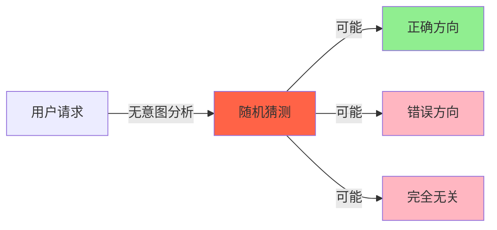
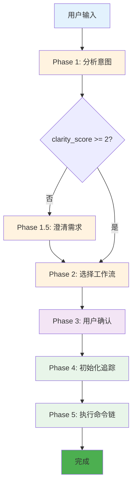
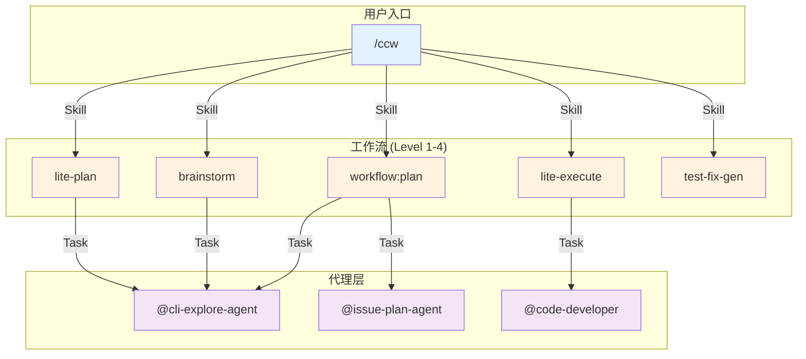
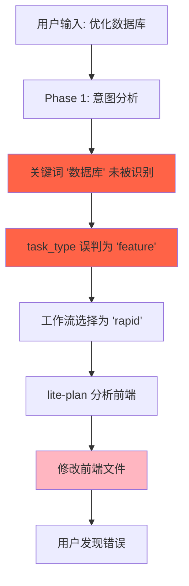

# Chapter 25: 议会的议长 — /ccw 深度解析

> **生命周期阶段**: 意图分析 → 工作流选择 → 命令链执行
> **涉及资产**: .claude/commands/ccw.md + 27 个子命令
> **阅读时间**: 45-60 分钟
> **版本追踪**: `docs/.audit-manifest.json`

---

## 0. 资产证言 (Asset Testimony)

> *"我是 `/ccw`，人们叫我议长。我的办公桌上堆满了混乱的自然语言：'优化性能'、'修 bug'、'头脑风暴新功能'。这些模糊的请求从四面八方涌来，像城市早高峰的车流。"*
>
> *"我的职责不是执行，而是理解和引导。当我听到'优化性能'时，我需要问：是数据库性能？前端性能？还是网络性能？是快速修复还是系统重构？这些问题的答案决定了我会调用哪个子工作流。"*
>
> *"我的工具箱有限但精准：`Skill(*)` 用于调用子技能，`TodoWrite(*)` 用于追踪进度，`AskUserQuestion(*)` 用于澄清意图，`Read(*)`、`Grep(*)`、`Glob(*)` 用于获取上下文。注意到了吗？没有 `Write`、`Edit`、`Bash`。这是有意为之 —— 我只是智者，不是劳工。"*
>
> *"我有 5 个工作阶段：Phase 1 分析意图，Phase 1.5 澄清需求（如果需要），Phase 2 选择工作流，Phase 3 用户确认，Phase 4 初始化追踪，Phase 5 执行命令链。每个阶段都是一条必经之路，少一步就会导致混乱。"*
>
> *"...最近，我感觉到一些不安。当用户说'我不确定架构应该怎么设计'时，我会启动 4 级工作流（brainstorm）。但 brainstorm 会并行启动 9 个角色分析，每个角色都会加载大量上下文。当 Phase 5 执行完成时，那些上下文真的释放了吗？还是继续在内存中游荡，像幽灵一样等待下一个请求？"*

```markdown
调查进度: █████░░░░░ 20%
幽灵位置: 命令层 — 检测到意图分析后的工作流级联
本章线索: /ccw 的 Phase 5 会调用 Skill(*) 执行命令链
           └── 命令链可能包含 lite-plan → lite-execute → test-fix-gen
           └── 每个 Skill 调用都会创建新的内存空间
           └── 父子 Skill 之间的上下文是否正确隔离？
```

---

## 1. 苏格拉底式思考 (Socratic Inquiry)

> **架构盲点 25.1**: 为什么 `allowed-tools` 不包含 Write、Edit、Bash？

在看代码之前，先思考：
1. 如果议长拥有写入能力，会发生什么？
2. 为什么要把"思考"和"执行"分离到不同的命令？
3. 这种设计如何影响系统的可预测性？

---

> **架构陷阱 25.2**: 为什么需要 5 个 Phase？能不能简化？

**陷阱方案**: 将 5 个 Phase 合并为 2 个。

```
简化前: Phase 1 → Phase 1.5 → Phase 2 → Phase 3 → Phase 4 → Phase 5
简化后: Phase 1 (分析) → Phase 2 (执行)
```

**思考点**:
- 澄清阶段（Phase 1.5）在什么情况下可以跳过？
- 用户确认（Phase 3）是否总是必要？
- TODO 追踪（Phase 4）能否延迟到执行时？

<details>
<summary>**揭示陷阱**</summary>

**5 个 Phase 的必要性**：

1. **Phase 1 - 意图分析**：必须。这是议长的核心职责。
2. **Phase 1.5 - 需求澄清**：条件性。只有 `clarity_score < 2` 时触发。
3. **Phase 2 - 工作流选择**：必须。将意图映射到具体命令链。
4. **Phase 3 - 用户确认**：可选。复杂工作流需要用户确认。
5. **Phase 4 - 初始化追踪**：必须。为后续执行建立状态文件。
6. **Phase 5 - 执行命令链**：必须。实际执行。

**不能简化的原因**：
- **可观测性**：每个 Phase 都有明确的输入/输出，便于调试。
- **中断恢复**：用户可以在任何 Phase 中断，系统可以从断点恢复。
- **渐进澄清**：Phase 1.5 只在需要时执行，避免不必要的交互。

**CCW 的选择**：保持 5 个 Phase，用 `clarity_score` 自动跳过 Phase 1.5。

</details>

---

> **架构陷阱 25.3**: `/ccw` 和 `/ccw-coordinator` 有什么区别？

**陷阱方案**: 它们是同一个东西，只是不同的入口点。

**思考点**:
- 两个命令的执行模式有什么不同？
- 为什么需要两个不同的"议长"？
- 它们如何协作？

<details>
<summary>**揭示陷阱**</summary>

**本质区别**：

| 维度 | `/ccw` | `/ccw-coordinator` |
|------|--------|-------------------|
| 执行模式 | 同步（主进程） | 异步（外部 CLI） |
| 调用方式 | `Skill()` | `Bash(ccw cli)` |
| 后台任务 | 不支持 | 支持 |
| Hook 回调 | 不需要 | 需要 |
| 超时处理 | 阻塞等待 | 可配置超时 |
| 适用场景 | 简单任务 | 长时间任务 |

**协作模式**：
```
/ccw (简单任务) → 直接执行 → 返回结果
/ccw (复杂任务) → 调用 /ccw-coordinator → 后台执行 → Hook 回调
```

**CCW 的设计**：`/ccw` 是默认入口，内部可能委托给 `/ccw-coordinator`。

</details>

---

## 2. 三幕叙事 (Three-Act Narrative)

### 第一幕：失控边缘 (Out of Control)

#### 混乱的请求

想象一个没有议长的世界：

```markdown
用户: 优化性能

系统: [直接开始修改代码...]
      [随机选择了数据库索引优化]
      [修改了 15 个文件]
      [用户困惑：我要的是前端渲染优化！]
```

**问题**：没有意图分析，系统只能"猜测"用户想要什么。

#### 不可预测的行为

没有议长的世界，每次执行都是"盲人摸象"：

| 用户请求 | 系统猜测 | 实际需求 |
|----------|----------|----------|
| "优化性能" | 数据库索引 | 前端渲染 |
| "修 bug" | 修改配置 | 重写逻辑 |
| "加功能" | 复制代码 | 重构架构 |
| "重构" | 删除代码 | 提取接口 |



---

### 第二幕：思维脉络 (Neural Link)

#### 5-Phase 工作流

CCW 的 `/ccw` 命令实现了 5 个阶段：



#### Phase 1: 意图分析

```typescript
function analyzeIntent(input: string): IntentAnalysis {
  return {
    goal: extractGoal(input),           // "优化性能" → "性能优化"
    scope: extractScope(input),         // "数据库" → ["database"]
    constraints: extractConstraints(input), // ["backward-compat"]
    task_type: detectTaskType(input),   // "bugfix" | "feature" | "tdd" | ...
    complexity: assessComplexity(input), // "low" | "medium" | "high"
    clarity_score: calculateClarity(input) // 0-3
  };
}

// 任务类型检测（优先级顺序）
function detectTaskType(text: string): TaskType {
  const patterns = {
    'bugfix-hotfix': /urgent|production|critical/ && /fix|bug/,
    'brainstorm': /brainstorm|ideation|头脑风暴|创意/,
    'debug-file': /debug.*document|hypothesis.*debug/,
    'analyze-file': /analyze.*document|explore.*concept/,
    'bugfix': /fix|bug|error|crash|fail/,
    'exploration': /uncertain|explore|research/,
    'quick-task': /quick|simple|small/ && /feature|function/,
    'tdd': /tdd|test-driven|test first/,
    'review': /review|code review/,
    'documentation': /docs|documentation/
  };

  for (const [type, pattern] of Object.entries(patterns)) {
    if (pattern.test(text)) return type;
  }
  return 'feature';
}
```

#### Phase 2: 工作流选择与命令链构建

```typescript
function selectWorkflow(analysis: IntentAnalysis): CommandChain {
  const levelMap = {
    // Level 1 - 快速
    'quick-task': { level: 1, flow: 'lite-lite-lite' },

    // Level 2 - 轻量
    'feature': { level: 2, flow: analysis.complexity === 'high' ? 'coupled' : 'rapid' },
    'bugfix': { level: 2, flow: 'bugfix.standard' },
    'docs': { level: 2, flow: 'docs' },

    // Level 3 - 标准
    'tdd': { level: 3, flow: 'tdd' },
    'review': { level: 3, flow: 'review-cycle-fix' },

    // Level 4 - 探索
    'brainstorm': { level: 4, flow: 'brainstorm-with-file' },
    'exploration': { level: 4, flow: 'full' }
  };

  const selected = levelMap[analysis.task_type] || levelMap['feature'];
  return buildCommandChain(selected, analysis);
}
```

#### Phase 5: 命令链执行

```typescript
async function executeCommandChain(
  chain: CommandStep[],
  workflow: string,
  trackingState: TrackingState
): Promise<ExecutionResult> {
  let previousResult = null;

  for (let i = 0; i < chain.length; i++) {
    try {
      // 更新状态
      updateStatus(trackingState, i, 'running');

      // 执行命令
      const fullCommand = assembleCommand(chain[i], previousResult);
      const result = await Skill({ skill: fullCommand });

      previousResult = { ...result, success: true };

      // 更新状态
      updateStatus(trackingState, i, 'completed');
      updateTodoStatus(i, chain.length, workflow, 'completed');

    } catch (error) {
      // 错误处理：重试/跳过/中止
      const action = await handleError(chain[i], error, i);
      if (action === 'abort') {
        return { success: false, error: error.message };
      }
    }
  }

  return { success: true, completed: chain.length };
}
```

---

### 第三幕：社交网络 (Social Network)

#### 调用关系图



#### 命令链示例

| 输入 | 任务类型 | Level | 命令链 |
|------|----------|-------|--------|
| "Add API endpoint" | feature (low) | 2 | `lite-plan → lite-execute → test-fix-gen → test-cycle-execute` |
| "Fix login timeout" | bugfix | 2 | `lite-fix → lite-execute → test-fix-gen → test-cycle-execute` |
| "头脑风暴: 通知系统" | brainstorm | 4 | `brainstorm-with-file` |
| "OAuth2 system" | feature (high) | 3 | `plan → plan-verify → execute → review-cycle → test-cycle` |
| "Implement with TDD" | tdd | 3 | `tdd-plan → execute → tdd-verify` |

#### 权限边界

```markdown
---
name: ccw
description: Main workflow orchestrator
allowed-tools: Skill(*), TodoWrite(*), AskUserQuestion(*), Read(*), Grep(*), Glob(*)
---
```

**设计意图**：
- **无写入能力**：议长只负责"思考"，不负责"执行"
- **只读工具**：`Read`, `Grep`, `Glob` 用于获取上下文
- **交互工具**：`AskUserQuestion` 用于澄清意图
- **追踪工具**：`TodoWrite` 用于进度追踪
- **委托工具**：`Skill(*)` 用于调用子工作流

---

## 3. 造物主的私语 (Creator's Secret)

> *"为什么议长不能写入文件？"*

### 设计决策分析

| 维度 | 有写入能力 | 无写入能力 |
|------|-----------|-----------|
| 职责边界 | 模糊 | 清晰 |
| 可预测性 | 低 | 高 |
| 调试难度 | 高 | 低 |
| 安全风险 | 高 | 低 |
| 代码复杂度 | 高 | 低 |

**结论**：议长若能写入，便不再是"智者"，而成了"执行者"。这会导致职责混乱，增加系统复杂度。

### 最小执行单元 (MEU) 设计

```typescript
// 最小执行单元：一组必须一起执行的命令
const MEU = {
  'quick-impl': ['lite-plan', 'lite-execute'],      // 原子执行
  'test-validation': ['test-fix-gen', 'test-cycle'], // 原子执行
  'code-review': ['review-session', 'review-fix']    // 原子执行
};

// MEU 规则：
// 1. CCW 自动将命令分组为 MEU
// 2. MEU 内的命令不能被分割
// 3. 错误处理影响整个 MEU（重试/跳过/中止）
```

**设计意图**：避免"执行了一半"的状态。要么全做，要么全不做。

### 版本演进的伤疤

```
ccw.md 的历史变更：

2024-10-15: 创建初始版本，只有 Phase 1-3
2024-11-03: 添加 Phase 1.5 (需求澄清)
2024-12-10: 添加 Phase 4 (TODO 追踪) + status.json
2025-01-15: 添加 MEU 概念
2025-02-01: 添加 With-File 工作流支持
```

**伤疤**：Phase 1.5 和 Phase 4 是后来添加的，说明设计不是一蹴而就的。

---

## 4. 进化插槽 (Upgrade Slots)

### 插槽一：自定义意图检测器

```typescript
// 未来可能的扩展
interface IntentDetector {
  name: string;
  patterns: RegExp[];
  handler: (input: string) => IntentAnalysis;
}

// 使用示例
const customDetector: IntentDetector = {
  name: "security-scan",
  patterns: [/security|vulnerability|OWASP/i],
  handler: (input) => ({
    goal: "Security vulnerability scan",
    scope: ["security"],
    task_type: "security-scan",
    complexity: "high",
    clarity_score: 3
  })
};
```

### 插槽二：工作流级别判断器

```typescript
// 未来可能的扩展：Phase 3 注入
interface WorkflowLevelJudge {
  judge: (analysis: IntentAnalysis) => WorkflowLevel;
}

// 使用示例
const customJudge: WorkflowLevelJudge = {
  judge: (analysis) => {
    // 自定义逻辑：如果涉及微服务，提升到 Level 4
    if (analysis.scope.includes('microservice')) {
      return { level: 4, flow: 'microservice-arch' };
    }
    return defaultLevelJudge(analysis);
  }
};
```

### 插槽三：上下文优化器

```typescript
// 未来可能的扩展
interface ContextOptimizer {
  optimize: (context: string[]) => string[];
}

// 使用示例
const tokenOptimizer: ContextOptimizer = {
  optimize: (files) => {
    // 如果上下文超过 100KB，只保留最相关的 10 个文件
    if (estimateTokens(files) > 100000) {
      return files.slice(0, 10);
    }
    return files;
  }
};
```

---

## 5. 事故复盘档案 (Incident Post-mortem)

### 事故 #25：意图分析错误的级联影响

> **时间**: 2025-01-20 10:15:32 UTC
> **症状**: 用户说"优化数据库"，系统执行了前端优化
> **影响**: 15 个文件被错误修改，需要手动回滚

#### 时间轨迹

```
10:15:32 - 用户输入: "优化数据库"
10:15:33 - Phase 1: 分析意图
           → goal: "性能优化"
           → task_type: "feature" (误判！应该是 "database-optimize")
           → complexity: "medium"
           → clarity_score: 2
10:15:34 - Phase 2: 选择工作流 → "rapid"
10:15:35 - Phase 3: 用户确认（用户点击 "Confirm"）
10:15:36 - Phase 4: 初始化追踪
10:15:37 - Phase 5: 执行命令链
           → lite-plan (分析前端性能)
           → lite-execute (修改前端文件)
10:20:00 - 用户发现错误，请求回滚
```

#### 根因分析



#### 修复方案

```typescript
// 1. 增强任务类型检测
function detectTaskType(text: string): TaskType {
  const patterns = {
    // 新增：数据库相关
    'database-optimize': /数据库|database|sql|query.*optim/i,
    // 新增：前端相关
    'frontend-optimize': /前端|frontend|render|paint/i,
    // ... 其他模式
  };

  for (const [type, pattern] of Object.entries(patterns)) {
    if (pattern.test(text)) return type;
  }
  return 'feature';
}

// 2. 降低 clarity_score 阈值，触发更多澄清
if (analysis.clarity_score < 3) {  // 原来是 < 2
  await clarifyRequirements(analysis);
}
```

---

### 幽灵旁白：命令链的内存累积

> *"我是 Phase 5 的幽灵。"*
>
> *"当命令链执行时，每个 Skill 调用都会创建新的内存空间。`lite-plan` 加载项目上下文，`lite-execute` 加载代码文件，`test-fix-gen` 加载测试配置..."*
>
> *"理论上，每个 Skill 完成后，它的内存应该被释放。但是，TodoWrite 持续追踪状态，status.json 记录进度。这些引用链阻止了垃圾回收。"*
>
> *"当命令链很长（5+ 个命令）时，内存峰值会达到单命令的 3-5 倍。幽灵从不离开，它们只是在等待下一个命令来覆盖。"*

```markdown
调查进度: ██████░░░░ 25%
幽灵位置: 命令层 → 技能层 — Skill 调用链导致内存累积
下一章线索: Chapter 26 将深入 /issue:new 命令
           └── issue:new 调用 ACE 搜索和 GitHub API
           └── 这些外部调用是否正确清理？
```

---

## 6. 资产审计账本 (Asset Audit Ledger)

### ccw.md 关键结构

| 字段 | 值 | 说明 |
|------|-----|------|
| `name` | `ccw` | 命令名称 |
| `description` | `Main workflow orchestrator` | 主工作流编排器 |
| `argument-hint` | `"task description"` | 任务描述 |
| `allowed-tools` | `Skill(*), TodoWrite(*), AskUserQuestion(*), Read(*), Grep(*), Glob(*)` | 允许的工具 |

### 核心函数

| 函数 | 用途 | 复杂度 |
|------|------|--------|
| `analyzeIntent()` | 意图分析 | 中 |
| `detectTaskType()` | 任务类型检测 | 中 |
| `selectWorkflow()` | 工作流选择 | 低 |
| `buildCommandChain()` | 命令链构建 | 中 |
| `executeCommandChain()` | 命令链执行 | 高 |
| `handleError()` | 错误处理 | 中 |

### 命令链类型

| 类型 | 命令数 | 适用场景 |
|------|--------|----------|
| `lite-lite-lite` | 1 | 快速任务 |
| `rapid` | 2-4 | 标准功能 |
| `coupled` | 5-7 | 复杂功能 |
| `tdd` | 3 | TDD 开发 |
| `brainstorm-with-file` | 1 | 探索性任务 |
| `full` | 5+ | 完整工作流 |

---

## 附录

### A. 操作速查表

| 操作 | 命令 |
|------|------|
| 启动工作流 | `/ccw "任务描述"` |
| 查看命令定义 | `cat .claude/commands/ccw.md` |
| 查看状态文件 | `cat .workflow/.ccw/{session-id}/status.json` |
| 查看会话日志 | `cat .workflow/.ccw/{session-id}/log.json` |

### B. 相关文件清单

```
.claude/commands/
├── ccw.md                    # 主命令定义
├── workflow/
│   ├── lite-plan.md          # Level 1-2 规划
│   ├── lite-execute.md       # Level 1-2 执行
│   ├── plan.md               # Level 3 规划
│   ├── execute.md            # Level 3 执行
│   ├── test-fix-gen.md       # 测试生成
│   └── brainstorm-with-file.md # Level 4 头脑风暴
└── issue/
    ├── new.md                # Issue 创建
    ├── plan.md               # Issue 规划
    ├── queue.md              # Issue 排队
    └── execute.md            # Issue 执行

.workflow/.ccw/
├── {session-id}/
│   ├── status.json           # 会话状态
│   └── log.json              # 执行日志
└── index.json                # 会话索引
```

### C. Clarity Score 判定标准

| Score | 含义 | 触发条件 | 行为 |
|-------|------|----------|------|
| 0 | 完全模糊 | 输入 < 20 字符，无关键词 | 强制澄清 |
| 1 | 部分模糊 | 输入 > 20 字符，关键词不足 | 建议澄清 |
| 2 | 基本清晰 | 有明确目标和范围 | 跳过澄清 |
| 3 | 完全清晰 | GitHub URL 或结构化描述 | 直接执行 |

---

*Chapter 25: 议会的议长 — /ccw 深度解析*
*CCW Deep Dive Series*
