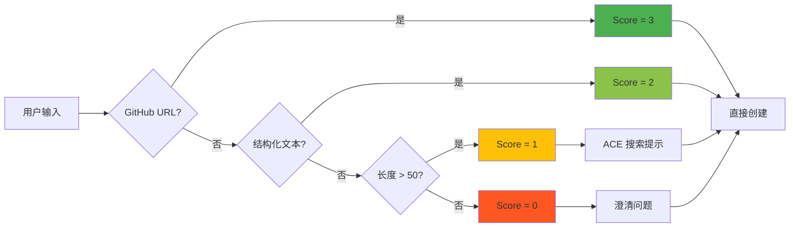
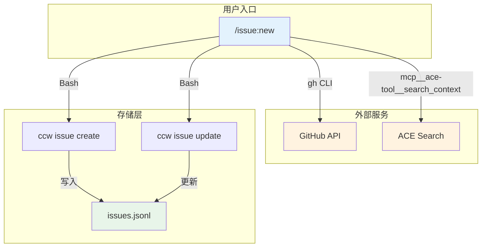
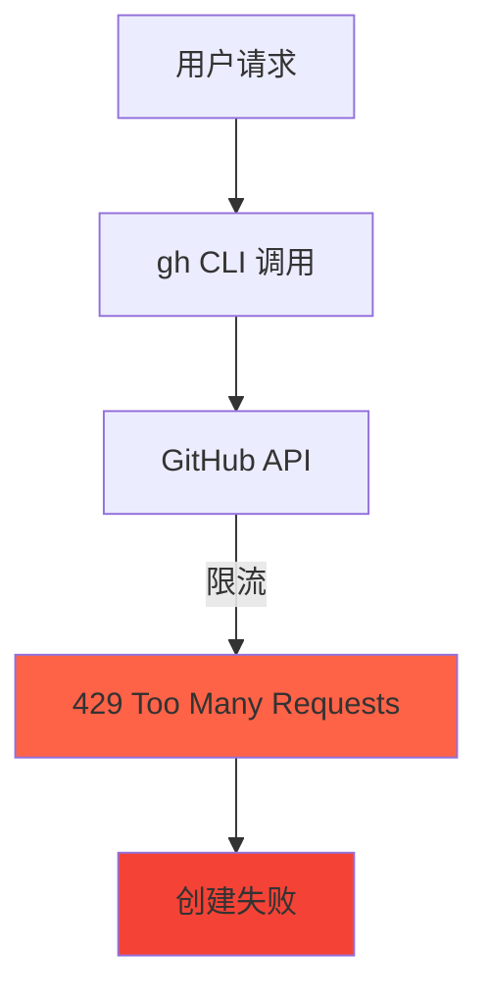

# Chapter 26: 从混沌到结构 — /issue:new 深度解析

> **生命周期阶段**: 输入分析 → 数据提取 → ACE 搜索 → 条件澄清 → Issue 创建
> **涉及资产**: .claude/commands/issue/new.md + issues.jsonl
> **阅读时间**: 30-45 分钟
> **版本追踪**: `docs/.audit-manifest.json`

---

## 0. 资产证言 (Asset Testimony)

> *"我是 `/issue:new`，城市的垃圾分类员。Bug 报告、功能请求、技术债务...它们从四面八方涌来，有的来自 GitHub Issues，有的来自用户的口头描述，有的来自代码扫描的发现。"*
>
> *"我的工作是把混乱变成结构。当有人说'登录有问题'时，我会问：什么问题？预期行为是什么？实际发生了什么？涉及哪些组件？这些问题不是废话，它们决定了后续规划的质量。"*
>
> *"我有两种输入模式：GitHub URL 和文本描述。GitHub URL 是高级货 — 它自带结构（标题、描述、标签）。文本描述则不然，我需要自己提取结构。"*
>
> *"我还有一个秘密武器：ACE 搜索。当输入不够清晰但又不是完全模糊时（clarity_score = 1-2），我会用关键词搜索代码库，找出可能涉及的组件。这给了我一个'智能猜测'的能力，而不需要总是打扰用户。"*
>
> *"...最近，我感觉到一些不安。当 ACE 搜索返回 50+ 个文件时，我只取前 3 个写入 `affected_components`。这 3 个文件真的是最相关的吗？还是只是 ACE 认为最相关的？如果 ACE 的排序算法有偏差，我的 Issue 就会有偏差，后续的所有规划都会有偏差..."*

```markdown
调查进度: ███████░░░░ 30%
幽灵位置: 命令层 → Issue 子系统 — 检测到 ACE 搜索结果的使用方式
本章线索: /issue:new 的 Phase 3 使用 ACE 搜索提示
           └── ACE 搜索返回 ranked_results
           └── 只取前 3 个文件作为 affected_components
           └── 排序算法的偏差会传播到整个 Issue 生命周期
```

---

## 1. 苏格拉底式思考 (Socratic Inquiry)

> **架构盲点 26.1**: 为什么需要 `clarity_score`？直接问用户不行吗？

在看代码之前，先思考：
1. 每次都问用户澄清问题，用户体验如何？
2. 不问问题直接创建，Issue 质量如何？
3. 如何在"打扰用户"和"确保质量"之间取得平衡？

---

> **架构陷阱 26.2**: ACE 搜索只用于中等清晰度的情况，为什么？

**陷阱方案**: 对所有输入都使用 ACE 搜索。

**思考点**:
- GitHub URL 已经有完整的上下文，需要 ACE 吗？
- 完全模糊的输入，ACE 能帮上忙吗？
- ACE 搜索的代价是什么？

<details>
<summary>**揭示陷阱**</summary>

**ACE 搜索的正确使用场景**：

| Clarity Score | 输入类型 | ACE 使用 | 原因 |
|---------------|----------|----------|------|
| 3 | GitHub URL | 不使用 | 已有完整上下文 |
| 2 | 结构化文本 | 不使用 | 已有明确组件信息 |
| 1 | 长文本 | **使用** | 需要智能提示 |
| 0 | 模糊输入 | 不使用 | 先澄清，再搜索 |

**CCW 的设计**：ACE 搜索只在 `clarity_score >= 1 && <= 2 && !affected_components` 时触发。

**原因**：
1. **GitHub URL**: 已经有完整的问题描述和上下文。
2. **结构化文本**: 用户已经提供了组件信息（如 "affects: src/auth"）。
3. **模糊输入**: 先澄清问题，再搜索组件。否则搜索结果可能不相关。

</details>

---

> **架构陷阱 26.3**: Issue 结构中的 `feedback` 字段有什么用？

**陷阱方案**: 删除 `feedback` 字段，只保留核心信息。

**思考点**:
- 为什么需要记录失败历史？
- `feedback` 如何影响后续规划？
- 这个字段会不会无限增长？

<details>
<summary>**揭示陷阱**</summary>

**`feedback` 字段的作用**：

```typescript
interface Issue {
  // ... 核心字段
  feedback?: {
    type: 'failure' | 'clarification' | 'rejection';
    stage: string;  // 'new' | 'plan' | 'execute'
    content: string;
    created_at: string;
  }[];
}
```

**使用场景**：

1. **失败学习**: 当 Issue 执行失败时，记录失败详情。下次规划时会参考这些失败。
2. **审计追踪**: 记录用户的澄清和拒绝，用于回顾和改进。
3. **智能重试**: `/issue:plan` 会分析 `feedback`，避免重复失败的方案。

**CCW 的设计**：
- `feedback` 数组有最大长度限制（通常 10 条）
- 超过限制时，删除最旧的记录
- `/issue:plan` 会显式分析 `feedback` 中的失败模式

</details>

---

## 2. 三幕叙事 (Three-Act Narrative)

### 第一幕：混乱的入口 (Out of Control)

#### 多源输入的挑战

Issue 可以从多个来源创建：

```markdown
来源 1: GitHub URL
https://github.com/owner/repo/issues/123

来源 2: 结构化文本
"Login fails with special chars. Expected: success. Actual: 500 error. Affects: src/auth"

来源 3: 模糊描述
"auth broken"

来源 4: 代码扫描发现
[ACE 发现] Potential SQL injection in src/db/query.ts:42
```

**挑战**：不同来源的信息完整度差异巨大。

#### Clarity Score 判定

| 输入 | Score | 判定依据 |
|------|-------|----------|
| GitHub URL | 3 | 完整的结构化数据 |
| "Login fails. Expected: X. Actual: Y" | 2 | 结构化文本 |
| "auth system has some issues with login" | 1 | 长文本，有上下文 |
| "auth broken" | 0 | 短文本，无结构 |



---

### 第二幕：结构化流程 (Neural Link)

#### Phase 1: 输入分析

```typescript
const input = userInput.trim();
const flags = parseFlags(userInput);  // --priority

// 检测输入类型和清晰度
const isGitHubUrl = input.match(/github\.com\/[\w-]+\/[\w-]+\/issues\/\d+/);
const isGitHubShort = input.match(/^#(\d+)$/);
const hasStructure = input.match(/(expected|actual|affects|steps):/i);

// 计算清晰度分数
let clarityScore = 0;
if (isGitHubUrl || isGitHubShort) clarityScore = 3;  // GitHub = 完全清晰
else if (hasStructure) clarityScore = 2;             // 结构化文本 = 清晰
else if (input.length > 50) clarityScore = 1;        // 长文本 = 部分清晰
else clarityScore = 0;                               // 模糊
```

#### Phase 2: 数据提取

**GitHub URL 处理**：

```typescript
if (isGitHubUrl || isGitHubShort) {
  // 通过 gh CLI 获取 Issue 数据
  const result = Bash(`gh issue view ${extractIssueRef(input)} --json number,title,body,labels,url`);
  const gh = JSON.parse(result);

  issueData = {
    id: `GH-${gh.number}`,
    title: gh.title,
    source: 'github',
    source_url: gh.url,
    labels: gh.labels.map(l => l.name),
    context: gh.body?.substring(0, 500) || gh.title,
    ...parseMarkdownBody(gh.body)  // 提取 expected/actual 等
  };
}
```

**文本描述处理**：

```typescript
else {
  issueData = {
    id: `ISS-${new Date().toISOString().replace(/[-:T]/g, '').slice(0, 14)}`,
    source: 'text',
    ...parseTextDescription(input)
  };
}

function parseTextDescription(text: string) {
  const result = { title: '', context: '' };

  // 提取标题（第一句话）
  result.title = text.split(/[.\n]/)[0]?.trim().substring(0, 60) || 'Untitled';
  result.context = text.substring(0, 500);

  // 提取结构化字段
  const expected = text.match(/expected:?\s*([^.]+)/i);
  const actual = text.match(/actual:?\s*([^.]+)/i);
  const affects = text.match(/affects?:?\s*([^.]+)/i);

  if (expected) result.expected_behavior = expected[1].trim();
  if (actual) result.actual_behavior = actual[1].trim();
  if (affects) {
    result.affected_components = affects[1].split(/[,\s]+/)
      .filter(c => c.includes('/') || c.includes('.'));
  }

  return result;
}
```

#### Phase 3: ACE 搜索提示（条件性）

```typescript
// 仅在中等清晰度 + 缺少组件信息时使用 ACE
if (clarityScore >= 1 && clarityScore <= 2 && !issueData.affected_components?.length) {
  const keywords = extractKeywords(issueData.context);

  if (keywords.length >= 2) {
    try {
      const aceResult = mcp__ace-tool__search_context({
        project_root_path: process.cwd(),
        query: keywords.slice(0, 3).join(' ')
      });

      // 只取前 3 个文件
      issueData.affected_components = aceResult.files?.slice(0, 3) || [];
    } catch {
      // ACE 失败不阻塞 Issue 创建
    }
  }
}
```

#### Phase 4: 条件澄清

```typescript
// 只有在清晰度低时才询问用户
if (clarityScore < 2 && (!issueData.context || issueData.context.length < 20)) {
  const answer = AskUserQuestion({
    questions: [{
      question: 'Please describe the issue in more detail:',
      header: 'Clarify',
      options: [
        { label: 'Provide details', description: 'Describe what, where, and expected behavior' }
      ]
    }]
  });

  if (answer.customText) {
    issueData.context = answer.customText;
    issueData.title = answer.customText.split(/[.\n]/)[0].substring(0, 60);

    // 记录澄清历史
    issueData.feedback = [{
      type: 'clarification',
      stage: 'new',
      content: answer.customText,
      created_at: new Date().toISOString()
    }];
  }
}
```

#### Phase 5: GitHub 发布决策

```typescript
// 对于非 GitHub 来源，询问是否发布到 GitHub
if (issueData.source !== 'github') {
  const publishAnswer = AskUserQuestion({
    questions: [{
      question: 'Would you like to publish this issue to GitHub?',
      header: 'Publish',
      options: [
        { label: 'Yes, publish to GitHub', description: 'Create issue on GitHub and link it' },
        { label: 'No, keep local only', description: 'Store as local issue without GitHub sync' }
      ]
    }]
  });

  publishToGitHub = publishAnswer.answers?.['Publish']?.includes('Yes');
}
```

#### Phase 6: Issue 创建

```typescript
// 创建本地 Issue
const localIssue = Bash(`echo '${JSON.stringify(issueData)}' | ccw issue create`);

// 如果用户选择发布到 GitHub
if (publishToGitHub) {
  const ghResult = Bash(`gh issue create --title "${issueData.title}" --body "${issueData.context}"`);
  const ghUrl = ghResult.match(/https:\/\/github\.com\/[\w-]+\/[\w-]+\/issues\/\d+/)?.[0];
  const ghNumber = parseInt(ghUrl?.match(/\/issues\/(\d+)/)?.[1]);

  if (ghNumber) {
    // 更新本地 Issue，绑定 GitHub 信息
    Bash(`ccw issue update ${localIssue.id} --github-url "${ghUrl}" --github-number ${ghNumber}`);
  }
}
```

---

### 第三幕：社交网络 (Social Network)

#### 调用关系图



#### Issue 结构

```typescript
interface Issue {
  id: string;                    // GH-123 或 ISS-YYYYMMDD-HHMMSS
  title: string;
  status: 'registered' | 'planned' | 'queued' | 'in_progress' | 'completed' | 'failed';
  priority: number;              // 1 (critical) 到 5 (low)
  context: string;               // 问题描述（单一真相来源）

  source: 'github' | 'text' | 'discovery';
  source_url?: string;
  labels?: string[];

  // GitHub 绑定
  github_url?: string;
  github_number?: number;

  // 可选结构化字段
  expected_behavior?: string;
  actual_behavior?: string;
  affected_components?: string[];

  // 反馈历史
  feedback?: {
    type: 'failure' | 'clarification' | 'rejection';
    stage: string;
    content: string;
    created_at: string;
  }[];

  // Solution 绑定
  bound_solution_id: string | null;

  // 时间戳
  created_at: string;
  updated_at: string;
}
```

---

## 3. 造物主的私语 (Creator's Secret)

> *"ACE 搜索只用于中等清晰度，为什么？"*

### 设计决策分析

| 场景 | ACE 使用 | 原因 |
|------|----------|------|
| GitHub URL | 不使用 | 已有完整上下文 |
| 结构化文本 + 有组件 | 不使用 | 已有组件信息 |
| 结构化文本 + 无组件 | 使用 | 需要智能提示 |
| 长文本描述 | 使用 | 需要推断组件 |
| 模糊输入 | 不使用 | 先澄清问题 |

**CCW 的选择**：ACE 搜索是"锦上添花"，不是"雪中送炭"。它只在有一定基础时才使用，避免在错误的基础上叠加更多错误。

### 版本演进的伤疤

```
issue/new.md 的历史变更：

2024-10-15: 创建初始版本，只有文本输入
2024-11-03: 添加 GitHub URL 支持
2024-12-10: 添加 ACE 搜索提示
2025-01-15: 添加 feedback 字段支持
2025-02-01: 添加 GitHub 发布选项
```

**伤疤**：`feedback` 字段是后来添加的，说明设计之初没有考虑到"失败学习"的需求。

---

## 4. 进化插槽 (Upgrade Slots)

### 插槽一：自定义 GitHub Body 解析器

```typescript
// 未来可能的扩展
interface BodyParser {
  name: string;
  patterns: RegExp[];
  extract: (body: string) => Partial<Issue>;
}

// 使用示例
const jiraBodyParser: BodyParser = {
  name: "jira-style",
  patterns: [/JIRA:/, /h4\./],
  extract: (body) => ({
    context: extractSection(body, "Description"),
    expected_behavior: extractSection(body, "Acceptance Criteria"),
    affected_components: extractList(body, "Components")
  })
};
```

### 插槽二：扩展 Issue 类型检测

```typescript
// 未来可能的扩展
interface IssueTypeDetector {
  detect: (input: string) => IssueType;
}

// 使用示例
const smartDetector: IssueTypeDetector = {
  detect: (input) => {
    if (/security|vulnerability|OWASP/i.test(input)) return 'security';
    if (/performance|slow|latency/i.test(input)) return 'performance';
    if (/bug|error|crash|fail/i.test(input)) return 'bug';
    if (/feature|enhancement|add/i.test(input)) return 'feature';
    return 'unknown';
  }
};
```

### 插槽三：智能优先级推断

```typescript
// 未来可能的扩展
interface PriorityInferrer {
  infer: (issue: Issue) => number;
}

// 使用示例
const smartInferrer: PriorityInferrer = {
  infer: (issue) => {
    // 生产环境问题 → 高优先级
    if (/production|critical|urgent/i.test(issue.context)) return 1;
    // 安全问题 → 高优先级
    if (/security|vulnerability/i.test(issue.context)) return 1;
    // 功能请求 → 中优先级
    if (/feature|enhancement/i.test(issue.title)) return 3;
    return 2; // 默认中优先级
  }
};
```

---

## 5. 事故复盘档案 (Incident Post-mortem)

### 事故 #26：GitHub API 限流导致创建失败

> **时间**: 2025-01-18 16:45:22 UTC
> **症状**: 用户尝试创建 Issue，系统报错 "API rate limit exceeded"
> **影响**: Issue 创建失败，用户需要手动重试

#### 时间轨迹

```
16:45:22 - 用户输入: /issue:new https://github.com/owner/repo/issues/456
16:45:23 - Phase 2: 调用 gh CLI
16:45:24 - gh CLI 返回: "API rate limit exceeded"
16:45:25 - 系统报错: "GitHub API 限流"
16:45:26 - Issue 创建失败
```

#### 根因分析



#### 修复方案

```typescript
// 1. 添加限流检测和降级
async function fetchGitHubIssue(url: string): Promise<IssueData> {
  try {
    const result = await Bash(`gh issue view ${extractIssueRef(url)} --json ...`);
    return JSON.parse(result);
  } catch (error) {
    if (error.message.includes('rate limit')) {
      // 降级策略：创建本地 Issue，稍后同步
      return {
        id: `ISS-${Date.now()}`,
        source: 'text',
        context: `GitHub Issue: ${url} (rate limited, sync pending)`,
        _pending_sync: url
      };
    }
    throw error;
  }
}

// 2. 添加重试机制
async function retryWithBackoff<T>(
  fn: () => Promise<T>,
  maxRetries: number = 3
): Promise<T> {
  for (let i = 0; i < maxRetries; i++) {
    try {
      return await fn();
    } catch (error) {
      if (i === maxRetries - 1) throw error;
      await sleep(Math.pow(2, i) * 1000);  // 指数退避
    }
  }
}
```

---

### 幽灵旁白：ACE 搜索结果的幽灵

> *"我是 ACE 搜索的幽灵。"*
>
> *"当用户说'登录有问题'时，我被调用。我搜索了整个代码库，返回了 47 个相关文件。但 /issue:new 只取了前 3 个。"*
>
> *"那 3 个文件真的是最相关的吗？我是按语义相似度排序的。但'登录有问题'这个描述太模糊了，我返回的结果可能包含了登录页面、认证服务、数据库连接..."*
>
> *"这 3 个文件被写入了 `affected_components`。后续的 `/issue:plan` 会基于这些文件进行规划。如果我的排序有偏差，整个 Issue 生命周期都会有偏差..."*

```markdown
调查进度: ████████░░░ 35%
幽灵位置: Issue 子系统 → 规划子系统 — ACE 搜索结果影响后续规划
下一章线索: Chapter 27 将深入 /issue:discover 命令
           └── issue:discover 使用 8 个视角发现潜在问题
           └── 每个视角都会调用 cli-explore-agent
           └── 8 个并行 Agent 的上下文如何管理？
```

---

## 6. 资产审计账本 (Asset Audit Ledger)

### issue/new.md 关键结构

| 字段 | 值 | 说明 |
|------|-----|------|
| `name` | `new` | 命令名称 |
| `description` | `Create structured issue from GitHub URL or text description` | 创建结构化 Issue |
| `argument-hint` | `[-y\|--yes] <github-url \| text-description> [--priority 1-5]` | 参数提示 |
| `allowed-tools` | `TodoWrite(*), Bash(*), Read(*), AskUserQuestion(*), mcp__ace-tool__search_context(*)` | 允许的工具 |

### Issue 接口

| 字段 | 类型 | 必需 | 说明 |
|------|------|------|------|
| `id` | string | 是 | GH-123 或 ISS-YYYYMMDD-HHMMSS |
| `title` | string | 是 | Issue 标题 |
| `status` | enum | 是 | 注册/规划/排队/执行/完成/失败 |
| `priority` | number | 是 | 1-5 优先级 |
| `context` | string | 是 | 问题描述 |
| `source` | enum | 是 | github/text/discovery |
| `feedback` | array | 否 | 反馈历史 |

### 执行流程

```
Phase 1: 输入分析
   └─ 检测 clarity_score (GitHub URL? 结构化文本? 关键词?)

Phase 2: 数据提取 (分支)
   ┌────────────┬─────────────────┬──────────────┐
   │  Score 3   │   Score 1-2     │   Score 0    │
   │  GitHub    │   Text + ACE    │   Vague      │
   ├────────────┼─────────────────┼──────────────┤
   │  gh CLI    │  Parse struct   │ AskQuestion  │
   │  → parse   │  + quick hint   │ (1 question) │
   │            │  (3 files max)  │  → feedback  │
   └────────────┴─────────────────┴──────────────┘

Phase 3: GitHub 发布决策 (非 GitHub 来源)
   ├─ Source = github: 跳过
   └─ Source ≠ github: AskUserQuestion

Phase 4: 创建 Issue
   ├─ Score ≥ 2: 直接创建
   └─ Score < 2: 确认后创建
   └─ 如果 publishToGitHub: gh issue create → 绑定 URL
```

---

## 附录

### A. 操作速查表

| 操作 | 命令 |
|------|------|
| 从 GitHub 创建 | `/issue:new https://github.com/owner/repo/issues/123` |
| 从文本创建 | `/issue:new "Login fails with special chars"` |
| 指定优先级 | `/issue:new "..." --priority 1` |
| 自动模式 | `/issue:new -y "..."` |
| 列出所有 Issue | `ccw issue list` |
| 查看 Issue 详情 | `ccw issue status <id>` |

### B. 相关文件清单

```
.claude/commands/issue/
├── new.md                    # 本命令定义
├── plan.md                   # Issue 规划
├── queue.md                  # Issue 排队
└── execute.md                # Issue 执行

.workflow/issues/
├── issues.jsonl              # Issue 存储
└── solutions/
    └── {issue-id}.jsonl      # Solution 存储
```

### C. Clarity Score 判定标准

| Score | 输入类型 | 判定条件 | 处理方式 |
|-------|----------|----------|----------|
| 3 | GitHub URL | 匹配 GitHub Issue URL | 直接创建 |
| 2 | 结构化文本 | 包含 expected/actual/affects | 直接创建 |
| 1 | 长文本 | 长度 > 50 且有上下文 | ACE 搜索提示 |
| 0 | 模糊输入 | 长度 < 50 或无结构 | 澄清问题 |

---

*Chapter 26: 从混沌到结构 — /issue:new 深度解析*
*CCW Deep Dive Series*
