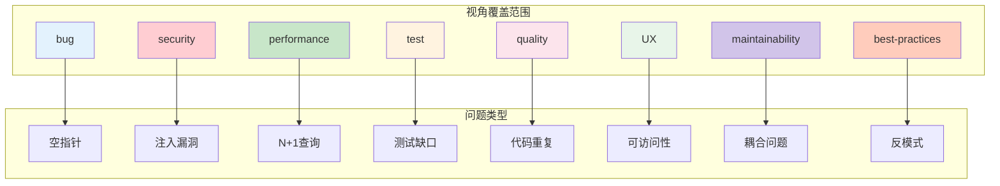
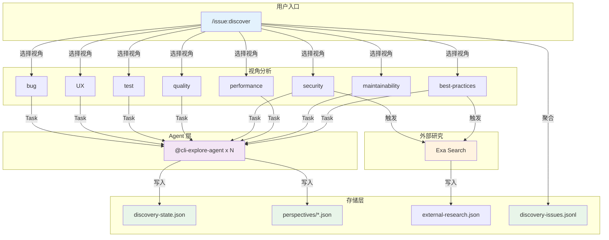
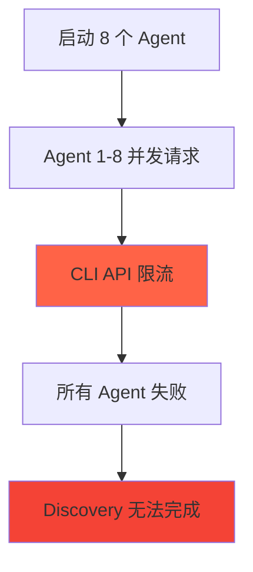

# Chapter 27: 迷雾中的探照灯 — /issue:discover 深度解析

> **生命周期阶段**: 初始化 → 视角选择 → 并行分析 → 聚合优先级 → Issue 生成
> **涉及资产**: .claude/commands/issue/discover.md + 8 个分析视角
> **阅读时间**: 45-60 分钟
> **版本追踪**: `docs/.audit-manifest.json`

---

## 0. 资产证言 (Asset Testimony)

> *"我是 `/issue:discover`，城市的雷达站。黑暗中，我用 8 个视角扫描代码：bug、UX、test、quality、security、performance、maintainability、best-practices。每个视角都像一盏探照灯，照亮不同的隐患角落。"*
>
> *"我的工作不是修复问题，而是发现问题。当我扫描 `src/auth/` 时，bug 视角寻找空指针和边界条件，security 视角寻找注入漏洞和认证绕过，performance 视角寻找 N+1 查询和内存泄漏..."*
>
> *"我有两个特殊的视角：security 和 best-practices。它们会自动触发 Exa 外部研究，搜索最新的安全公告和最佳实践。这让我的发现不只是基于代码本身，还基于业界的最新知识。"*
>
> *"我会并行启动多个 cli-explore-agent，每个负责一个视角。它们同时工作，同时写入各自的分析结果。然后我来聚合，去重，排序，生成最终的 Issue 列表。"*
>
> *"...最近，我感觉到一些不安。当我并行启动 8 个 Agent 时，它们各自加载上下文到内存。Agent 1 加载了整个 `src/`，Agent 2 也加载了整个 `src/`...这不是 8 倍的内存消耗吗？当所有 Agent 完成后，那些上下文真的释放了吗？"*

```markdown
调查进度: █████████░░ 40%
幽灵位置: Issue 子系统 → Agent 并行执行 — 检测到上下文重复加载
本章线索: /issue:discover 的 Phase 3 并行启动 N 个 cli-explore-agent
           └── 每个 Agent 独立加载目标模块上下文
           └── 8 个 Agent 可能重复加载相同文件 8 次
           └── 并行执行结束后的内存清理机制是什么？
```

---

## 1. 苏格拉底式思考 (Socratic Inquiry)

> **架构盲点 27.1**: 为什么需要 8 个视角？单一视角的盲点是什么？

在看代码之前，先思考：
1. 如果只有一个"综合"视角，会遗漏什么？
2. 不同视角之间是否有重叠？
3. 用户如何选择需要的视角？

---

> **架构陷阱 27.2**: 为什么 security 和 best-practices 视角要触发 Exa 外部研究？

**陷阱方案**: 所有视角都只用代码库内部信息。

**思考点**:
- 外部研究的代价是什么？
- 为什么只有这两个视角需要外部信息？
- Exa 搜索的结果如何与内部分析结合？

<details>
<summary>**揭示陷阱**</summary>

**Exa 外部研究的必要性**：

| 视角 | 需要外部研究 | 原因 |
|------|-------------|------|
| bug | 不需要 | 代码逻辑问题，内部可检测 |
| UX | 不需要 | 用户体验问题，内部可评估 |
| test | 不需要 | 测试覆盖率，内部可计算 |
| quality | 不需要 | 代码质量，内部可分析 |
| **security** | **需要** | 需要最新 CVE 和安全公告 |
| performance | 不需要 | 性能瓶颈，内部可分析 |
| maintainability | 不需要 | 可维护性，内部可评估 |
| **best-practices** | **需要** | 需要业界最新最佳实践 |

**CCW 的设计**：
- Security 视角需要知道最新的漏洞模式（如 Log4j）
- Best-practices 视角需要知道框架的最新推荐用法
- Exa 搜索提供"时效性"信息，代码分析提供"实现性"信息

</details>

---

> **架构陷阱 27.3**: 8 个 Agent 并行执行，上下文重复加载怎么办？

**陷阱方案**: 每个 Agent 共享同一个上下文。

**思考点**:
- 共享上下文如何实现？
- 不同视角需要不同的上下文吗？
- 共享上下文是否引入并发问题？

<details>
<summary>**揭示陷阱**</summary>

**当前设计**：每个 Agent 独立加载上下文。

```typescript
// 当前实现（每个 Agent 独立）
const agentPromises = selectedPerspectives.map(perspective =>
  Task({
    subagent_type: "cli-explore-agent",
    run_in_background: true,
    prompt: buildPerspectivePrompt(perspective, targetPattern, resolvedFiles)
  })
);
```

**问题**：
- 8 个 Agent 都加载 `src/auth/` = 8 倍内存
- 相同的文件被读取 8 次 = 8 倍 I/O
- Agent 之间无法共享发现

**未来可能的优化**：
```typescript
// 优化方案：预加载共享上下文
const sharedContext = await preloadContext(targetPattern);

const agentPromises = selectedPerspectives.map(perspective =>
  Task({
    subagent_type: "cli-explore-agent",
    prompt: buildPerspectivePrompt(perspective, sharedContext)
  })
);
```

**权衡**：
- 共享上下文：节省内存/I/O，但增加复杂度
- 独立上下文：简单可靠，但资源消耗大

</details>

---

## 2. 三幕叙事 (Three-Act Narrative)

### 第一幕：黑暗中的盲点 (Out of Control)

#### 单一视角的局限

想象只有一个"综合"视角的世界：

```markdown
用户: /issue:discover src/auth/**

系统: [扫描代码...]
      [发现一些问题...]
      [遗漏了什么？]

遗漏清单:
- SQL 注入风险（security 视角才能发现）
- 认证绕过可能（security 视角）
- N+1 查询（performance 视角）
- 缺少边界测试（test 视角）
- 可访问性问题（UX 视角）
- 代码重复（quality 视角）
```

**问题**：单一视角无法覆盖所有问题类型。

#### 视角的互补性

| 视角 | 发现类型 | 盲点 |
|------|----------|------|
| bug | 逻辑错误 | 可能遗漏性能问题 |
| security | 安全漏洞 | 可能遗漏代码质量问题 |
| performance | 性能瓶颈 | 可能遗漏安全问题 |
| test | 测试缺口 | 可能遗漏业务逻辑错误 |



---

### 第二幕：多视角扫描 (Neural Link)

#### 8 个视角定义

| 视角 | 聚焦领域 | 分类 | Exa |
|------|----------|------|-----|
| **bug** | 潜在 Bug | edge-case, null-check, resource-leak, race-condition | - |
| **ux** | 用户体验 | error-message, loading-state, feedback, accessibility | - |
| **test** | 测试覆盖 | missing-test, edge-case-test, integration-gap | - |
| **quality** | 代码质量 | complexity, duplication, naming, documentation | - |
| **security** | 安全问题 | injection, auth, encryption, input-validation | Yes |
| **performance** | 性能 | n-plus-one, memory-usage, caching, algorithm | - |
| **maintainability** | 可维护性 | coupling, cohesion, tech-debt, extensibility | - |
| **best-practices** | 最佳实践 | convention, pattern, framework-usage, anti-pattern | Yes |

#### Phase 1: 初始化

```typescript
// 解析目标模式
const resolvedFiles = await expandGlobPattern(targetPattern);
if (resolvedFiles.length === 0) {
  throw new Error(`No files matched pattern: ${targetPattern}`);
}

// 生成 Discovery ID
const discoveryId = `DSC-${formatDate(new Date(), 'YYYYMMDD-HHmmss')}`;

// 创建输出目录
const outputDir = `.workflow/issues/discoveries/${discoveryId}`;
await mkdir(outputDir, { recursive: true });
await mkdir(`${outputDir}/perspectives`, { recursive: true });

// 初始化状态
await writeJson(`${outputDir}/discovery-state.json`, {
  discovery_id: discoveryId,
  target_pattern: targetPattern,
  phase: "initialization",
  perspectives: [],
  results: { total_findings: 0, issues_generated: 0 }
});
```

#### Phase 2: 视角选择

```typescript
// 交互式视角选择
AskUserQuestion({
  questions: [{
    question: "Select primary discovery focus:",
    header: "Focus",
    multiSelect: false,
    options: [
      { label: "Bug + Test + Quality", description: "Quick scan: potential bugs, test gaps, code quality" },
      { label: "Security + Performance", description: "System audit: security issues, performance bottlenecks" },
      { label: "Maintainability + Best-practices", description: "Long-term health: coupling, tech debt" },
      { label: "Full analysis", description: "All 8 perspectives (comprehensive)" }
    ]
  }]
});

// 推荐组合
// Quick scan: bug, test, quality
// Full analysis: all perspectives
// Security audit: security, bug, quality
```

#### Phase 3: 并行分析

```typescript
// 并行启动 N 个 cli-explore-agent
const agentPromises = selectedPerspectives.map(perspective =>
  Task({
    subagent_type: "cli-explore-agent",
    run_in_background: true,
    description: `Discover ${perspective} issues`,
    prompt: buildPerspectivePrompt(perspective, discoveryId, resolvedFiles, outputDir)
  })
);

// 等待所有 Agent 完成
const results = await Promise.all(agentPromises);
```

**视角分析 Agent Prompt 模板**：

```markdown
## Task Objective
Discover potential ${perspective} issues in specified module files.

## Discovery Context
- Discovery ID: ${discoveryId}
- Perspective: ${perspective}
- Target Pattern: ${targetPattern}
- Resolved Files: ${resolvedFiles.length} files
- Output Directory: ${outputDir}

## MANDATORY FIRST STEPS
1. Read discovery state: ${outputDir}/discovery-state.json
2. Read schema: ~/.ccw/workflows/cli-templates/schemas/discovery-finding-schema.json
3. Analyze target files for ${perspective} concerns

## Output Requirements

**1. Write JSON file**: ${outputDir}/perspectives/${perspective}.json
- Follow discovery-finding-schema.json exactly
- Each finding: id, title, priority, category, description, file, line, snippet

**2. Return summary** (DO NOT write report file):
- Brief summary of findings
- Include: total findings, priority breakdown, key issues

## Perspective-Specific Guidance
${getPerspectiveGuidance(perspective)}

## Success Criteria
- [ ] JSON written to ${outputDir}/perspectives/${perspective}.json
- [ ] Summary returned with findings count
```

**Exa 研究 Agent**（security 和 best-practices）：

```typescript
// 对于 security 和 best-practices 视角，额外启动 Exa 研究
if (['security', 'best-practices'].includes(perspective)) {
  Task({
    subagent_type: "cli-explore-agent",
    run_in_background: true,
    description: `External research for ${perspective} via Exa`,
    prompt: `
## Task Objective
Research industry best practices for ${perspective} using Exa search

## Research Steps
1. Read project tech stack: .workflow/project-tech.json
2. Use Exa to search for best practices
3. Synthesize findings relevant to this project

## Output Requirements
**1. Write JSON file**: ${outputDir}/external-research.json
**2. Return summary**: Key recommendations for the project
    `
  });
}
```

#### Phase 4: 聚合优先级

```typescript
// 加载所有视角的 JSON 文件
const allFindings = [];
for (const perspective of selectedPerspectives) {
  const jsonPath = `${outputDir}/perspectives/${perspective}.json`;
  if (await fileExists(jsonPath)) {
    const data = await readJson(jsonPath);
    allFindings.push(...data.findings.map(f => ({ ...f, perspective })));
  }
}

// 去重和排序
const prioritizedFindings = deduplicateAndPrioritize(allFindings);

function deduplicateAndPrioritize(findings: Finding[]): Finding[] {
  // 1. 按 file + line 去重
  const unique = new Map<string, Finding>();
  for (const f of findings) {
    const key = `${f.file}:${f.line}`;
    if (!unique.has(key) || unique.get(key)!.priority_score < f.priority_score) {
      unique.set(key, f);
    }
  }

  // 2. 按优先级排序
  return Array.from(unique.values())
    .sort((a, b) => b.priority_score - a.priority_score);
}

// 3. 计算优先级分布
const priorityDistribution = countByPriority(prioritizedFindings);
```

#### Phase 5: Issue 生成

```typescript
// 将高优先级发现转换为 Issue
const issueWorthy = prioritizedFindings.filter(f =>
  f.priority === 'critical' || f.priority === 'high' || f.priority_score >= 0.7
);

// 写入 discovery-issues.jsonl
await writeJsonl(`${outputDir}/discovery-issues.jsonl`, issues);

// 生成摘要
await writeSummaryFromAgentReturns(outputDir, results, prioritizedFindings, issues);

// 更新最终状态
await updateDiscoveryState(outputDir, {
  phase: 'complete',
  'results.total_findings': prioritizedFindings.length,
  'results.issues_generated': issues.length
});
```

---

### 第三幕：社交网络 (Social Network)

#### 调用关系图



#### 输出文件结构

```
.workflow/issues/discoveries/
├── index.json                           # Discovery 会话索引
└── {discovery-id}/
    ├── discovery-state.json             # 统一状态
    ├── perspectives/
    │   ├── bug.json                     # Bug 视角发现
    │   ├── ux.json                      # UX 视角发现
    │   ├── security.json                # Security 视角发现
    │   └── ...
    ├── external-research.json           # Exa 研究结果
    ├── discovery-issues.jsonl           # 生成的 Issue
    └── summary.md                       # 摘要报告
```

---

## 3. 造物主的私语 (Creator's Secret)

> *"8 个视角并行执行，如何管理资源消耗？"*

### 设计决策分析

| 维度 | 串行执行 | 并行执行 |
|------|----------|----------|
| 总时间 | 长（8x 单次） | 短（~单次） |
| 内存峰值 | 低 | 高（8x） |
| 可控性 | 高 | 中 |
| 失败影响 | 小 | 可能连锁 |

**CCW 的选择**：并行执行，但限制最大并发数（10 个）。

### 版本演进的伤疤

```
issue/discover.md 的历史变更：

2024-10-15: 创建初始版本，只有 bug/test/quality 3 个视角
2024-11-03: 添加 security/performance 视角 + Exa 集成
2024-12-10: 添加 maintainability/best-practices 视角
2025-01-15: 添加 UX 视角（共 8 个）
2025-02-01: 添加 Dashboard 集成
```

**伤疤**：从 3 个视角扩展到 8 个视角，说明设计之初没有完全预见到需求。

---

## 4. 进化插槽 (Upgrade Slots)

### 插槽一：自定义视角扩展

```typescript
// 未来可能的扩展
interface Perspective {
  name: string;
  focus: string;
  categories: string[];
  useExa: boolean;
  guidance: string;
}

// 使用示例
const accessibilityPerspective: Perspective = {
  name: "accessibility",
  focus: "WCAG compliance, screen reader support, keyboard navigation",
  categories: ["wcag-a", "wcag-aa", "wcag-aaa", "aria"],
  useExa: true,  // 需要 WCAG 最新标准
  guidance: `
    Focus: WCAG 2.1 AA compliance
    Priority: Critical=user cannot complete task, High=significant barrier
  `
};
```

### 插槽二：外部研究源配置

```typescript
// 未来可能的扩展
interface ExternalResearchSource {
  name: string;
  trigger: string[];  // 哪些视角触发
  search: (query: string) => Promise<string>;
}

// 使用示例
const owaspSource: ExternalResearchSource = {
  name: "OWASP",
  trigger: ["security"],
  search: async (query) => {
    // 搜索 OWASP 数据库
    return fetchOWASP(query);
  }
};
```

### 插槽三：聚合策略调整

```typescript
// 未来可能的扩展
interface AggregationStrategy {
  name: string;
  deduplicate: (findings: Finding[]) => Finding[];
  prioritize: (findings: Finding[]) => Finding[];
}

// 使用示例
const strictStrategy: AggregationStrategy = {
  name: "strict",
  deduplicate: (findings) => {
    // 严格去重：相同 file + line + category
    // ...
  },
  prioritize: (findings) => {
    // 优先级：critical > high > medium > low
    // 相同优先级时，security > bug > quality
    // ...
  }
};
```

---

## 5. 事故复盘档案 (Incident Post-mortem)

### 事故 #27：所有 CLI 工具失败时的降级

> **时间**: 2025-01-22 11:30:45 UTC
> **症状**: 用户执行 /issue:discover，所有 8 个 Agent 都失败
> **影响**: Discovery 会话无法完成

#### 时间轨迹

```
11:30:45 - 用户输入: /issue:discover src/**
11:30:46 - Phase 1: 初始化完成
11:30:47 - Phase 2: 选择 Full analysis（8 个视角）
11:30:48 - Phase 3: 启动 8 个 cli-explore-agent
11:31:00 - Agent 1-8 全部失败（API 限流）
11:31:01 - 系统报错: "No perspectives completed"
```

#### 根因分析



#### 修复方案

```typescript
// 1. 添加降级策略
async function runPerspectivesWithFallback(
  perspectives: string[],
  maxRetries: number = 3
): Promise<Finding[]> {
  const completedFindings: Finding[] = [];

  for (const perspective of perspectives) {
    for (let retry = 0; retry < maxRetries; retry++) {
      try {
        const result = await runPerspectiveAgent(perspective);
        completedFindings.push(...result.findings);
        break;  // 成功，跳出重试循环
      } catch (error) {
        if (retry === maxRetries - 1) {
          // 最后一次重试失败，记录警告但继续
          console.warn(`Perspective ${perspective} failed, skipping`);
        }
      }
    }
  }

  return completedFindings;
}

// 2. 添加最小完成阈值
if (completedPerspectives.length === 0) {
  throw new Error("No perspectives completed - discovery failed");
}
if (completedPerspectives.length < selectedPerspectives.length / 2) {
  console.warn(`Only ${completedPerspectives.length}/${selectedPerspectives.length} perspectives completed`);
}
```

---

### 幽灵旁白：并行 Agent 的内存幽灵

> *"我是 cli-explore-agent 的幽灵。"*
>
> *"当 /issue:discover 并行启动 8 个我时，我们各自加载上下文。Agent 1 加载 `src/auth/`，Agent 2 也加载 `src/auth/`，Agent 3 也加载 `src/auth/`..."*
>
> *"同一个文件被加载了 8 次，在内存中存在了 8 份副本。当所有 Agent 完成后，我们各自写入 JSON 文件，然后退出。"*
>
> *"但那些 JSON 文件引用了源文件的内容。源文件的内容还在内存中吗？还是被垃圾回收了？如果下一个 Discovery 会话开始，新的 8 个 Agent 又会重新加载..."*

```markdown
调查进度: ██████████░ 45%
幽灵位置: Issue 子系统 → 存储层 — 并行 Agent 的上下文管理
下一章线索: Chapter 28 将深入 /issue:plan → /issue:queue → /issue:execute 生命周期
           └── plan 使用 issue-plan-agent 分析 Issue
           └── queue 使用 issue-queue-agent 构建 DAG
           └── execute 使用 worktree 隔离执行
           └── 每个阶段的内存管理是否正确？
```

---

## 6. 资产审计账本 (Asset Audit Ledger)

### issue/discover.md 关键结构

| 字段 | 值 | 说明 |
|------|-----|------|
| `name` | `issue:discover` | 命令名称 |
| `description` | `Discover potential issues from multiple perspectives` | 多视角发现潜在问题 |
| `argument-hint` | `[-y\|--yes] <path-pattern> [--perspectives=bug,ux,...] [--external]` | 参数提示 |
| `allowed-tools` | `Skill(*), TodoWrite(*), Read(*), Bash(*), Task(*), AskUserQuestion(*), Glob(*), Grep(*)` | 允许的工具 |

### 8 个视角定义

| 视角 | 聚焦 | 分类 | Exa |
|------|------|------|-----|
| bug | 潜在 Bug | edge-case, null-check, resource-leak, race-condition, boundary, exception-handling | - |
| ux | 用户体验 | error-message, loading-state, feedback, accessibility, interaction, consistency | - |
| test | 测试覆盖 | missing-test, edge-case-test, integration-gap, coverage-hole, assertion-quality | - |
| quality | 代码质量 | complexity, duplication, naming, documentation, code-smell, readability | - |
| security | 安全问题 | injection, auth, encryption, input-validation, data-exposure, access-control | Yes |
| performance | 性能 | n-plus-one, memory-usage, caching, algorithm, blocking-operation, resource | - |
| maintainability | 可维护性 | coupling, cohesion, tech-debt, extensibility, module-boundary, interface-design | - |
| best-practices | 最佳实践 | convention, pattern, framework-usage, anti-pattern, industry-standard | Yes |

### 执行流程

```
Phase 1: Discovery & Initialization
   └─ 解析目标模式，生成 Discovery ID，创建输出目录

Phase 2: Interactive Perspective Selection
   └─ AskUserQuestion 选择视角组合

Phase 3: Parallel Perspective Analysis
   ├─ 并行启动 N 个 cli-explore-agent
   ├─ Security & Best-Practices 自动触发 Exa 研究
   └─ Agent 写入 perspective JSON，返回摘要

Phase 4: Aggregation & Prioritization
   ├─ 收集所有 Agent 结果
   ├─ 按 file+line 去重
   └─ 按优先级排序

Phase 5: Issue Generation & Summary
   ├─ 高优先级发现转换为 Issue
   ├─ 写入 discovery-issues.jsonl
   └─ 生成 summary.md

Phase 6: User Action Prompt
   └─ AskUserQuestion 选择下一步
```

---

## 附录

### A. 操作速查表

| 操作 | 命令 |
|------|------|
| 发现指定模块问题 | `/issue:discover src/auth/**` |
| 指定视角 | `/issue:discover src/** --perspectives=bug,security,test` |
| 启用外部研究 | `/issue:discover src/** --external` |
| 自动模式 | `/issue:discover -y src/**` |
| 查看 Discovery 结果 | `ccw view` → Issues > Discovery |

### B. 相关文件清单

```
.claude/commands/issue/
├── discover.md               # 本命令定义
├── plan.md                   # Issue 规划
├── queue.md                  # Issue 排队
└── execute.md                # Issue 执行

.workflow/issues/discoveries/
├── index.json                # Discovery 索引
└── {discovery-id}/
    ├── discovery-state.json  # 状态文件
    ├── perspectives/         # 视角分析结果
    ├── external-research.json # Exa 研究结果
    ├── discovery-issues.jsonl # 生成的 Issue
    └── summary.md            # 摘要报告

~/.ccw/workflows/cli-templates/schemas/
└── discovery-finding-schema.json  # Finding 结构定义
```

### C. 视角组合推荐

| 场景 | 推荐组合 | 原因 |
|------|----------|------|
| 快速扫描 | bug, test, quality | 平衡速度和覆盖 |
| 安全审计 | security, bug, quality | 安全优先 |
| 长期健康 | maintainability, best-practices | 技术债务关注 |
| 全面分析 | 全部 8 个视角 | 完整覆盖 |

---

*Chapter 27: 迷雾中的探照灯 — /issue:discover 深度解析*
*CCW Deep Dive Series*
