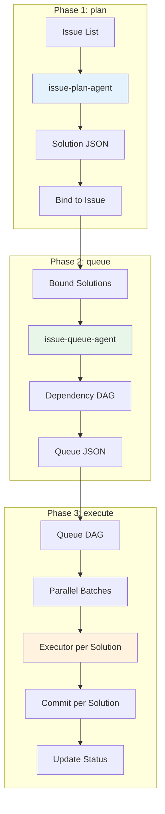
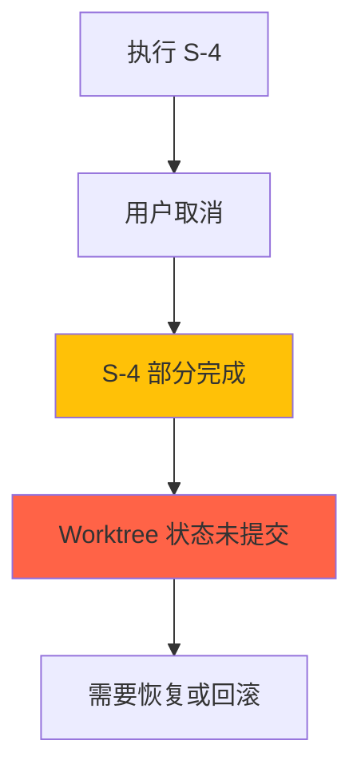

# Chapter 28: Issue 生命周期三部曲 — plan → queue → execute 深度解析

> **生命周期阶段**: 批量规划 (plan) → 队列形成 (queue) → DAG 并行执行 (execute)
> **涉及资产**: .claude/commands/issue/plan.md + queue.md + execute.md
> **阅读时间**: 60-75 分钟
> **版本追踪**: `docs/.audit-manifest.json`

---

## 0. 资产证言 (Asset Testimony)

> *"我们是一体三面：plan 是建筑师，queue 是调度员，execute 是执行官。"*
>
> *"我是 plan。当用户把一叠 Issue 交给我时，我调用 issue-plan-agent 进行探索和规划。ACE 搜索帮我找到相关代码，冲突检测帮我避免文件碰撞。我为每个 Issue 生成一个 Solution，里面有详细的任务分解。"*
>
> *"我是 queue。当 plan 完成后，用户把 Issue 交给我排队。我调用 issue-queue-agent 分析所有 Solution 的依赖关系，构建执行 DAG。我会计算语义优先级，分配并行/串行组，解决文件冲突。"*
>
> *"我是 execute。当 queue 完成后，用户启动我执行。我按 DAG 顺序分批执行 Solution，每批内的 Solution 可以并行。我用 worktree 隔离每个队列的执行，确保主工作区不受影响。每个 Solution 完成后提交一次，最后汇总结果。"*
>
> *"...最近，我们感觉到一些不安。当 plan 并行启动多个 issue-plan-agent 时，它们各自探索代码库。当 queue 分析依赖关系时，它需要读取所有 Solution。当 execute 并行执行多个 Solution 时，它们共享同一个 worktree...这些环节的内存和文件管理是否正确？"*

```markdown
调查进度: ███████████ 50%
幽灵位置: Issue 子系统全链路 — 检测到三阶段的状态传递
本章线索: plan 使用 issue-plan-agent 生成 Solution
           └── Solution 包含 tasks[].files 和 modification_points
           └── queue 读取 Solution 构建依赖 DAG
           └── execute 按 DAG 顺序执行，每个 Solution 一次提交
           └── 三个阶段之间的状态如何传递和清理？
```

---

## 1. 苏格拉底式思考 (Socratic Inquiry)

> **架构盲点 28.1**: 为什么需要 queue 层？为什么不直接 plan → execute？

在看代码之前，先思考：
1. plan 生成的 Solution 可以直接执行吗？
2. 多个 Issue 的 Solution 之间可能有什么冲突？
3. queue 层解决了什么问题？

---

> **架构陷阱 28.2**: execute 为什么要用 worktree 隔离？

**陷阱方案**: 直接在主工作区执行。

**思考点**:
- 在主工作区执行有什么风险？
- worktree 隔离带来什么好处和代价？
- 如果执行失败，如何回滚？

<details>
<summary>**揭示陷阱**</summary>

**Worktree 隔离的必要性**：

| 维度 | 主工作区执行 | Worktree 隔离 |
|------|-------------|---------------|
| 风险 | 高（可能破坏主分支） | 低（隔离执行） |
| 回滚 | 困难（需要 git reset） | 简单（删除 worktree） |
| 并行 | 不可能（文件冲突） | 可能（DAG 控制） |
| 调试 | 困难（状态混乱） | 简单（独立环境） |
| 代价 | 低 | 中（额外磁盘空间） |

**CCW 的设计**：
- 每个 queue 创建一个 worktree
- 所有 Solution 在同一个 worktree 中执行
- 执行完成后选择：PR / Merge / Keep branch

**为什么不每个 Solution 一个 worktree？**
- 过多的 worktree 会消耗大量磁盘空间
- 同一批 Solution 之间可能需要共享文件修改
- DAG 保证了同批 Solution 不会有文件冲突

</details>

---

> **架构陷阱 28.3**: 每个 Solution 完成后提交一次，为什么不是每个 Task 提交一次？

**陷阱方案**: 每个 Task 完成后就提交。

**思考点**:
- Task 和 Solution 的关系是什么？
- 每个 Task 提交有什么问题？
- 为什么要等所有 Task 完成后再提交？

<details>
<summary>**揭示陷阱**</summary>

**按 Solution 提交 vs 按 Task 提交**：

| 维度 | 按 Solution 提交 | 按 Task 提交 |
|------|-----------------|--------------|
| 提交数量 | 少（1 per Solution） | 多（N per Solution） |
| 原子性 | 高（Solution 是原子单元） | 低（Task 之间可能有依赖） |
| 回滚 | 简单（回滚整个 Solution） | 困难（需要找到正确的 Task） |
| 历史清晰度 | 高 | 低（历史被碎片化） |
| CI/CD 触发 | 少 | 多（可能触发过多） |

**CCW 的设计**：
- Solution 是最小可交付单元
- Task 是 Solution 的内部实现细节
- 所有 Task 完成后，统一提交

**示例**：
```bash
# Solution: 用户认证功能
# Tasks: T1 (数据库 schema), T2 (API endpoints), T3 (前端组件)

# 按 Solution 提交（CCW 方式）
git commit -m "feat(auth): add user authentication"

# 按 Task 提交（碎片化）
git commit -m "feat(auth): add user table schema"
git commit -m "feat(auth): add login API endpoint"
git commit -m "feat(auth): add login form component"
```

</details>

---

## 2. 三幕叙事 (Three-Act Narrative)

### 第一幕：规划的诞生 (plan)

#### plan 命令概述

```typescript
// /issue:plan 命令
// 批量规划 Issue 解决方案，使用 issue-plan-agent（探索 + 规划闭环）

// 用法
/issue:plan                           # 默认: --all-pending
/issue:plan GH-123                    # 单个 Issue
/issue:plan GH-123,GH-124,GH-125      # 批量（最多 3 个）
/issue:plan --all-pending             # 所有待规划 Issue
```

#### Phase 1: Issue 加载与智能分组

```typescript
// 智能分组：语义相似性分析
const issues = await loadIssues(input);
const batches = intelligentGrouping(issues, { maxBatchSize: 3 });

function intelligentGrouping(issues: Issue[], options: { maxBatchSize: number }): Issue[][] {
  // 1. 提取 Issue 标签和关键词
  const issueVectors = issues.map(i => ({
    issue: i,
    keywords: extractKeywords(i.title + ' ' + i.context),
    tags: i.labels || []
  }));

  // 2. 计算语义相似性
  // 3. 将相似 Issue 分组到同一批次
  // 4. 限制每批最多 3 个 Issue
  // ...
}
```

#### Phase 2: 统一探索 + 规划 (issue-plan-agent)

```typescript
// 并行启动 issue-plan-agent
const agentPromises = batches.map((batch, batchIndex) =>
  Task({
    subagent_type: "issue-plan-agent",
    run_in_background: true,
    description: `Explore & plan ${batch.length} issues: ${batch.map(i => i.id).join(', ')}`,
    prompt: buildPlanPrompt(batch, projectRoot)
  })
);

// Agent Prompt 模板
const planPrompt = `
## Plan Issues

**Issues** (grouped by similarity):
${issueList}

### Project Context (MANDATORY)
1. Read: .workflow/project-tech.json (technology stack)
2. Read: .workflow/project-guidelines.json (constraints and conventions)

### Workflow
1. Fetch issue details: ccw issue status <id> --json
2. **Analyze failure history** (if issue.feedback exists):
   - Extract failure patterns from feedback
   - Avoid repeating failed approaches
3. Load project context files
4. Explore codebase (ACE semantic search)
5. Plan solution with tasks (schema: solution-schema.json)
6. **If github_url exists**: Add final task to comment on GitHub issue
7. Write solution to: .workflow/issues/solutions/{issue-id}.jsonl
8. **CRITICAL - Binding Decision**:
   - Single solution → **MUST execute**: ccw issue bind <issue-id> <solution-id>
   - Multiple solutions → Return pending_selection only

### Failure-Aware Planning Rules
- **Extract failure patterns**: Parse issue.feedback where type='failure'
- **Identify root causes**: Analyze error_type
- **Design alternative approach**: Create solution that addresses root cause
- **Add prevention steps**: Include explicit verification
`;
```

#### Phase 3: Solution 注册与绑定

```typescript
// 收集 Agent 结果
for (const result of agentResults) {
  // 验证绑定
  for (const item of result.bound || []) {
    const status = JSON.parse(Bash(`ccw issue status ${item.issue_id} --json`));
    if (status.bound_solution_id === item.solution_id) {
      console.log(`✓ ${item.issue_id}: ${item.solution_id} (${item.task_count} tasks)`);
    } else {
      // Agent 未能绑定，命令层补救
      Bash(`ccw issue bind ${item.issue_id} ${item.solution_id}`);
    }
  }

  // 处理多候选方案
  for (const pending of result.pending_selection || []) {
    // 用户选择
    const selected = await askUserToSelect(pending);
    Bash(`ccw issue bind ${pending.issue_id} ${selected}`);
  }
}
```

---

### 第二幕：队列的形成 (queue)

#### queue 命令概述

```typescript
// /issue:queue 命令
// 从绑定的 Solution 形成执行队列，使用 issue-queue-agent（Solution 级别）

// 用法
/issue:queue                      # 从所有绑定的 Solution 形成队列
/issue:queue --queues 3           # 形成 3 个并行队列
/issue:queue --issue GH-123       # 只为特定 Issue 形成队列
```

#### 核心设计原则

> **Design Principle**: Queue items are **solutions**, not individual tasks.
> Each executor receives a complete solution with all its tasks.

#### Phase 1: Solution 加载与分布

```typescript
// 获取所有已规划（planned）且有绑定 Solution 的 Issue
const result = Bash(`ccw issue solutions --status planned --brief`);
const solutions = JSON.parse(result);

// 每个 Solution 包含
// { issue_id, solution_id, is_bound, task_count, files_touched[], priority }

if (solutions.length === 0) {
  console.log('No bound solutions found. Run /issue:plan first.');
  return;
}

// 多队列分布（如果 --queues > 1）
if (numQueues > 1) {
  // 将 Solution 分配到 N 个队列
  // 策略：将有文件重叠的 Solution 放入同一队列
  solutionGroups = partitionByFileOverlap(solutions, numQueues);
}
```

#### Phase 2-4: Agent 驱动队列形成

```typescript
// 生成队列 ID
const queueIds = numQueues === 1
  ? [`QUE-${timestamp}`]
  : Array.from({length: numQueues}, (_, i) => `QUE-${timestamp}-${i + 1}`);

// 并行启动 issue-queue-agent
const agentPromises = solutionGroups.map((group, i) =>
  Task({
    subagent_type: "issue-queue-agent",
    run_in_background: true,
    description: `Queue ${i + 1}/${numQueues}: ${group.length} solutions`,
    prompt: buildQueuePrompt(queueIds[i], group, i + 1, numQueues)
  })
);

// Queue Agent Prompt
const queuePrompt = `
## Order Solutions into Execution Queue

**Queue ID**: ${queueId}
**Solutions**: ${solutions.length}

### Workflow
Step 1: Build dependency graph from solutions (nodes=solutions, edges=file conflicts)
Step 2: Use Gemini CLI for conflict analysis (5 types: file, API, data, dependency, architecture)
Step 3: For high-severity conflicts → add to clarifications
Step 4: Calculate semantic priority (base from issue priority + task_count boost)
Step 5: Assign execution groups: P* (parallel) / S* (sequential)
Step 6: Write queue JSON + update index

### Output Requirements
**Write files**:
- .workflow/issues/queues/${queueId}.json
- .workflow/issues/queues/index.json

**Return JSON**:
{
  "queue_id": "${queueId}",
  "total_solutions": N,
  "execution_groups": [{"id": "P1", "type": "parallel", "count": N}],
  "clarifications": [...]
}
`;
```

#### Phase 5: 冲突澄清

```typescript
// 收集所有 Agent 的澄清请求
const allClarifications = results.flatMap((r, i) =>
  (r.clarifications || []).map(c => ({ ...c, queue_id: queueIds[i] }))
);

if (allClarifications.length > 0) {
  for (const clarification of allClarifications) {
    const answer = AskUserQuestion({
      questions: [{
        question: `[${clarification.queue_id}] ${clarification.question}`,
        options: clarification.options
      }]
    });

    // 恢复 Agent 处理用户决策
    Task({
      subagent_type: "issue-queue-agent",
      resume: clarification.agent_id,
      prompt: `Conflict ${clarification.conflict_id} resolved: ${answer.selected}`
    });
  }
}
```

#### Phase 6: 状态更新

```bash
# 批量更新 Issue 状态为 queued
ccw issue update --from-queue --json
```

#### Phase 7: 活动队列检查

```typescript
// 检查是否有活动队列
const index = JSON.parse(Bash(`ccw issue queue list --brief --json`));

if (index.active_queue_id) {
  // 已有活动队列，询问用户
  AskUserQuestion({
    questions: [{
      question: "Active queue exists. How would you like to proceed?",
      options: [
        { label: "Merge into existing", description: "Add new items to active queue" },
        { label: "Use new queue", description: "Switch to new queue" },
        { label: "Cancel", description: "Keep existing active" }
      ]
    }]
  });
} else {
  // 设置新生成的队列为活动
  Bash(`ccw issue queue switch ${queueIds[0]}`);
}
```

---

### 第三幕：执行的艺术 (execute)

#### execute 命令概述

```typescript
// /issue:execute 命令
// 使用 DAG 驱动的并行编排执行队列（每个 Solution 一次提交）

// 用法
/issue:execute --queue QUE-xxx           # 执行指定队列（必须）
/issue:execute --queue QUE-xxx --worktree  # 在隔离 worktree 中执行
```

#### Queue ID 要求（必须）

> **Queue ID is REQUIRED.** You MUST specify which queue to execute via `--queue <queue-id>`.

```typescript
let QUEUE_ID = args.queue;

if (!QUEUE_ID) {
  // 列出可用队列
  const index = JSON.parse(Bash('ccw issue queue list --brief --json'));

  // 询问用户选择
  const answer = AskUserQuestion({
    questions: [{
      question: "Which queue would you like to execute?",
      options: index.queues
        .filter(q => q.status === 'active')
        .map(q => ({
          label: q.id,
          description: `${q.completed_solutions || 0}/${q.total_solutions || 0} completed`
        }))
    }]
  });

  QUEUE_ID = answer['Queue'];
}
```

#### Phase 0.5: 设置队列 Worktree

```typescript
// 创建一个 worktree 用于整个队列
if (useWorktree) {
  const timestamp = new Date().toISOString().replace(/[-:T]/g, '').slice(0, 14);
  worktreeBranch = `queue-exec-${dag.queue_id || timestamp}`;
  worktreePath = `${worktreeBase}/${worktreeBranch}`;

  Bash(`git worktree add "${worktreePath}" -b "${worktreeBranch}"`);
  console.log(`Created queue worktree: ${worktreePath}`);
}
```

#### Phase 1: 获取 DAG 和用户选择

```typescript
// 获取依赖图和并行批次
const dagJson = Bash(`ccw issue queue dag --queue ${QUEUE_ID}`);
const dag = JSON.parse(dagJson);

console.log(`
## Queue DAG (Solution-Level)
- Total Solutions: ${dag.total}
- Ready: ${dag.ready_count}
- Completed: ${dag.completed_count}
- Parallel in batch 1: ${dag.parallel_batches[0]?.length || 0}
`);

// 用户选择
const answer = AskUserQuestion({
  questions: [
    {
      question: 'Select executor type:',
      options: [
        { label: 'Codex (Recommended)', description: 'Autonomous coding with full write access' },
        { label: 'Gemini', description: 'Large context analysis and implementation' },
        { label: 'Agent', description: 'Claude Code sub-agent' }
      ]
    },
    {
      question: 'Execution mode:',
      options: [
        { label: 'Execute (Recommended)', description: 'Run all ready solutions' },
        { label: 'Dry-run', description: 'Show DAG without executing' }
      ]
    },
    {
      question: 'Use git worktree?',
      options: [
        { label: 'Yes (Recommended)', description: 'Create worktree for isolation' },
        { label: 'No', description: 'Work in current directory' }
      ]
    }
  ]
});
```

#### Phase 2: 分发并行批次

```typescript
// 获取第一批就绪的 Solution
const batch = dag.parallel_batches[0] || [];

// 初始化 TodoWrite
TodoWrite({
  todos: batch.map(id => ({
    content: `Execute solution ${id}`,
    status: 'pending'
  }))
});

// 并行启动执行器
const executions = batch.map(solutionId => {
  updateTodo(solutionId, 'in_progress');
  return dispatchExecutor(solutionId, executor, worktreePath);
});

await Promise.all(executions);
```

#### Executor 分发

```typescript
function dispatchExecutor(solutionId: string, executorType: string, worktreePath: string | null) {
  const prompt = `
## Execute Solution: ${solutionId}
${worktreePath ? `Working Directory: ${worktreePath}` : ''}

### Step 1: Get Solution Details
Run: ccw issue detail ${solutionId}

### Step 2: Execute All Tasks Sequentially
The detail command returns a FULL SOLUTION with all tasks.
Execute each task in order (T1 → T2 → T3):

For each task:
- Follow task.implementation steps
- Run task.test commands
- Verify task.convergence criteria
- Do NOT commit after each task

### Step 3: Commit Solution (Once)
After ALL tasks pass, commit once:
  git commit -m "<type>(<scope>): <brief description>"

### Step 4: Report Completion
On success:
  ccw issue done ${solutionId} --result '{...}'

On failure:
  ccw issue done ${solutionId} --fail --reason '{...}'

### Important Notes
- Do NOT cleanup worktree - it is shared by all solutions
`;

  if (executorType === 'codex') {
    return Bash(`ccw cli -p "${prompt}" --tool codex --mode write --id exec-${solutionId}`, {
      timeout: 7200000,  // 2hr
      run_in_background: true
    });
  }
  // ... 其他执行器
}
```

#### Phase 3-4: 下一批和 Worktree 完成

```typescript
// 刷新 DAG，检查下一批
const refreshedDag = JSON.parse(Bash(`ccw issue queue dag --queue ${QUEUE_ID}`));

if (refreshedDag.ready_count > 0) {
  console.log(`Run /issue:execute --queue ${QUEUE_ID} again for next batch.`);
}

// 所有批次完成后，处理 worktree
if (refreshedDag.completed_count === refreshedDag.total) {
  const answer = AskUserQuestion({
    questions: [{
      question: `Queue complete. What to do with worktree branch "${worktreeBranch}"?`,
      options: [
        { label: 'Create PR (Recommended)', description: 'Push branch and create pull request' },
        { label: 'Merge to main', description: 'Merge all commits and cleanup' },
        { label: 'Keep branch', description: 'Cleanup worktree, keep branch' }
      ]
    }]
  });

  // 执行用户选择...
}
```

---

## 3. 三阶段协作图



---

## 4. 造物主的私语 (Creator's Secret)

> *"为什么 queue 层是 Solution 级别，不是 Task 级别？"*

### 设计决策分析

| 维度 | Task 级别队列 | Solution 级别队列 |
|------|--------------|------------------|
| 粒度 | 细 | 粗 |
| DAG 复杂度 | 高（N*M 个节点） | 中（N 个节点） |
| 冲突检测 | 精确但复杂 | 粗略但简单 |
| 执行隔离 | Task 间隔离 | Solution 间隔离 |
| 提交策略 | 可能碎片化 | 原子性高 |

**CCW 的选择**：Solution 级别队列，因为：
1. Solution 是最小可交付单元
2. 减少队列复杂度
3. 保证提交原子性

### 版本演进的伤疤

```
Issue 生命周期命令的历史变更：

2024-10-15: 创建 /issue:plan，使用 ACE 搜索
2024-11-03: 添加 /issue:queue，构建执行 DAG
2024-12-10: 添加 /issue:execute，支持 worktree 隔离
2025-01-15: 添加 failure-aware planning（分析 feedback 历史）
2025-02-01: 添加多队列支持（--queues N）
```

**伤疤**：`feedback` 分析是后来添加的，说明设计之初没有考虑"失败学习"。

---

## 5. 进化插槽 (Upgrade Slots)

### 插槽一：自定义 DAG 算法

```typescript
// 未来可能的扩展
interface DAGAlgorithm {
  name: string;
  build: (solutions: Solution[]) => DependencyGraph;
}

// 使用示例
const smartDAG: DAGAlgorithm = {
  name: "smart-dependency",
  build: (solutions) => {
    // 考虑更复杂的依赖关系：
    // - API 兼容性
    // - 数据库迁移顺序
    // - 配置变更依赖
  }
};
```

### 插槽二：Worktree 策略配置

```typescript
// 未来可能的扩展
interface WorktreeStrategy {
  perSolution: boolean;  // 每个 Solution 一个 worktree
  perQueue: boolean;     // 每个队列一个 worktree（当前）
  shared: boolean;       // 共享主工作区
}

// 使用示例
const conservativeStrategy: WorktreeStrategy = {
  perSolution: true,  // 最安全的隔离
  perQueue: false,
  shared: false
};
```

### 插槽三：提交策略配置

```typescript
// 未来可能的扩展
interface CommitStrategy {
  perSolution: boolean;  // 每个 Solution 一次提交（当前）
  perTask: boolean;      // 每个 Task 一次提交
  squash: boolean;       // 所有完成后 squash
}

// 使用示例
const detailedStrategy: CommitStrategy = {
  perSolution: false,
  perTask: true,  // 更详细的历史
  squash: false
};
```

---

## 6. 事故复盘档案 (Incident Post-mortem)

### 事故 #28：Worktree 执行中断后的恢复

> **时间**: 2025-01-25 09:15:33 UTC
> **症状**: /issue:execute 执行到一半时用户取消，worktree 状态未知
> **影响**: 3 个 Solution 已完成，2 个 Solution 进行中，需要恢复

#### 时间轨迹

```
09:15:33 - 用户启动 /issue:execute --queue QUE-xxx
09:15:35 - Worktree 创建: .ccw/worktrees/queue-exec-QUE-xxx
09:20:00 - Solution S-1 完成，已提交
09:25:00 - Solution S-2 完成，已提交
09:30:00 - Solution S-3 完成，已提交
09:32:00 - Solution S-4 执行中...
09:35:00 - 用户按 Ctrl+C 取消
09:35:01 - 执行中断，worktree 状态未知
```

#### 根因分析



#### 修复方案

```typescript
// 1. 恢复机制
async function resumeExecution(queueId: string, existingWorktree: string) {
  // 验证 worktree 状态
  const status = Bash(`git -C "${existingWorktree}" status --porcelain`);

  if (status) {
    // 有未提交的更改，询问用户
    const answer = AskUserQuestion({
      questions: [{
        question: "Worktree has uncommitted changes. How to proceed?",
        options: [
          { label: "Discard changes", description: "Reset worktree and continue" },
          { label: "Commit changes", description: "Commit current state and continue" },
          { label: "Abort", description: "Keep worktree as-is, exit" }
        ]
      }]
    });

    // 处理用户选择...
  }

  // 继续执行未完成的 Solution
  const dag = JSON.parse(Bash(`ccw issue queue dag --queue ${queueId}`));
  // ...
}

// 2. 使用 --worktree 参数恢复
/issue:execute --queue QUE-xxx --worktree /path/to/existing/worktree
```

---

### 幽灵旁白：三阶段的状态幽灵

> *"我是三阶段的状态幽灵。"*
>
> *"plan 阶段，issue-plan-agent 为每个 Issue 生成 Solution。Solution 包含 `tasks[].files`，这些文件路径被写入 JSON。"*
>
> *"queue 阶段，issue-queue-agent 读取所有 Solution 的 `files_touched`，构建依赖 DAG。这些文件路径又被加载到内存..."*
>
> *"execute 阶段，每个 Executor 通过 `ccw issue detail <id>` 获取完整的 Solution。Solution 再次被加载..."*
>
> *"同一个 Solution 被加载了三次：plan 时创建，queue 时分析，execute 时执行。它的内容是否被缓存？还是每次都重新读取？如果 Solution 很大（100+ tasks），内存消耗会如何？"*

```markdown
调查进度: ████████████ 55%
幽灵位置: Issue 子系统全链路 — 状态在三个阶段间传递
下一章线索: Chapter 29 将深入 /workflow:init 命令
           └── init 使用 cli-explore-agent 分析项目
           └── 生成 project-tech.json 和 project-guidelines.json
           └── 双文件设计的内存和磁盘开销？
```

---

## 7. 资产审计账本 (Asset Audit Ledger)

### 三个命令的关键结构

| 命令 | Agent | 输入 | 输出 |
|------|-------|------|------|
| `/issue:plan` | issue-plan-agent | Issue 列表 | Solution JSON |
| `/issue:queue` | issue-queue-agent | Bound Solutions | Queue JSON + DAG |
| `/issue:execute` | Executor (codex/gemini/agent) | Queue DAG | Git commits |

### Solution 结构

```typescript
interface Solution {
  id: string;                    // SOL-{issue-id}-{uid}
  issue_id: string;
  approach: string;
  tasks: Task[];
  exploration_context: {
    relevant_files: string[];
  };
}

interface Task {
  id: string;                    // T1, T2, T3...
  title: string;
  description: string;
  implementation: string[];
  test: { commands: string[] };
  convergence: { criteria: string[] };
  files: { path: string, action: string }[];
}
```

### Queue 结构

```typescript
interface Queue {
  id: string;                    // QUE-{timestamp}
  status: 'active' | 'completed' | 'archived';
  solutions: QueueItem[];
  conflicts: Conflict[];
  execution_groups: ExecutionGroup[];
}

interface QueueItem {
  id: string;                    // S-1, S-2, S-3...
  issue_id: string;
  solution_id: string;
  status: 'pending' | 'running' | 'completed' | 'failed';
  depends_on: string[];
  task_count: number;
}
```

---

## 附录

### A. 操作速查表

| 操作 | 命令 |
|------|------|
| 规划所有待处理 Issue | `/issue:plan` |
| 规划特定 Issue | `/issue:plan GH-123` |
| 形成执行队列 | `/issue:queue` |
| 形成多队列 | `/issue:queue --queues 3` |
| 执行队列 | `/issue:execute --queue QUE-xxx` |
| 执行并隔离 | `/issue:execute --queue QUE-xxx --worktree` |
| 恢复执行 | `/issue:execute --queue QUE-xxx --worktree /path/to/worktree` |
| 查看队列 DAG | `ccw issue queue dag --queue QUE-xxx` |
| 查看 Solution 详情 | `ccw issue detail S-1` |

### B. 相关文件清单

```
.claude/commands/issue/
├── plan.md                   # 批量规划
├── queue.md                  # 队列形成
└── execute.md                # 队列执行

.workflow/issues/
├── issues.jsonl              # Issue 存储
├── solutions/
│   └── {issue-id}.jsonl      # Solution 存储
└── queues/
    ├── index.json            # 队列索引
    └── {queue-id}.json       # 队列定义

.ccw/worktrees/
└── queue-exec-{queue-id}/    # Worktree 目录
```

### C. 三阶段状态流转

```
Issue 状态流转:
registered → planned → queued → in_progress → completed
                                    ↓
                                  failed

Solution 状态流转:
pending → running → completed
              ↓
            failed

Queue 状态流转:
active → completed → archived
```

---

*Chapter 28: Issue 生命周期三部曲 — plan → queue → execute 深度解析*
*CCW Deep Dive Series*
