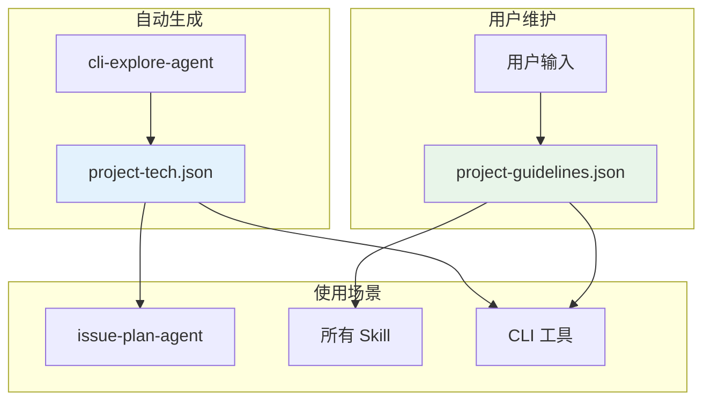
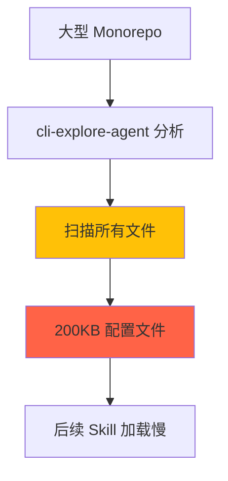

# Chapter 29: 项目的第一次心跳 — /workflow:init 深度解析

> **生命周期阶段**: 检查现有状态 → 调用 cli-explore-agent → 生成配置文件 → 询问用户
> **涉及资产**: .claude/commands/workflow/init.md + project-tech.json + project-guidelines.json
> **阅读时间**: 30-45 分钟
> **版本追踪**: `docs/.audit-manifest.json`

---

## 0. 资产证言 (Asset Testimony)

> *"我是 `/workflow:init`，项目的接生婆。当一个新项目第一次使用 CCW 时，我会给它做一次全面的体检，生成两份档案：`project-tech.json` 记录技术栈和架构，`project-guidelines.json` 记录开发规范和约束。"*
>
> *"我的工作分为两部分：自动分析和用户交互。自动分析由 cli-explore-agent 完成，它会扫描项目结构、检测技术栈、识别关键组件。用户交互则是询问是否需要配置 guidelines。"*
>
> *"我生成的两份档案是 CCW 后续所有操作的基础。`project-tech.json` 被 issue-plan-agent 用来理解项目上下文，`project-guidelines.json` 被所有 Skill 用来遵循开发规范。"*
>
> *"...最近，我感觉到一些不安。当 cli-explore-agent 扫描大型 Monorepo 时，它会加载大量的项目结构信息。这些信息被写入 `project-tech.json`，有时会达到 50KB+。当后续 Skill 读取这个文件时，会消耗多少 token？"*

```markdown
调查进度: ████████████░ 60%
幽灵位置: Workflow 子系统 — 检测到项目配置文件的大小增长
本章线索: /workflow:init 生成 project-tech.json 和 project-guidelines.json
           └── project-tech.json 包含完整的技术栈分析
           └── 大型项目可能导致配置文件过大
           └── 后续 Skill 每次都要读取完整配置
           └── 配置文件的加载策略是否需要优化？
```

---

## 1. 苏格拉底式思考 (Socratic Inquiry)

> **架构盲点 29.1**: 为什么需要两份文件？为什么不合并为一个？

在看代码之前，先思考：
1. `project-tech.json` 和 `project-guidelines.json` 的职责有什么不同？
2. 合并它们会有什么问题？
3. 分离带来的好处是什么？

---

> **架构陷阱 29.2**: cli-explore-agent 分析的完整性和性能如何平衡？

**陷阱方案**: 扫描所有文件，获取最完整的项目信息。

**思考点**:
- 完整扫描的代价是什么？
- 不完整扫描会遗漏什么？
- 如何在完整性和性能之间取得平衡？

<details>
<summary>**揭示陷阱**</summary>

**完整扫描 vs 快速扫描**：

| 维度 | 完整扫描 | 快速扫描 |
|------|----------|----------|
| 时间 | 长（分钟级） | 短（秒级） |
| 信息完整性 | 高 | 中 |
| 内存消耗 | 高 | 低 |
| 输出文件大小 | 大（50KB+） | 小（10KB） |

**CCW 的设计**：
- 使用 `get_modules_by_depth.sh` 获取结构化项目数据
- 限制分析的文件数量（最多 1000 个）
- 对大型目录进行抽样分析
- 用户可以通过 `--regenerate` 重新生成

**权衡**：
- 大型 Monorepo：快速扫描 + 按需深入
- 小型项目：可以完整扫描
- 首次运行：快速扫描
- 后续更新：`--regenerate` 重新扫描

</details>

---

> **架构陷阱 29.3**: `project-guidelines.json` 为什么初始为空？

**陷阱方案**: 自动生成所有 guidelines。

**思考点**:
- 自动生成的 guidelines 可靠吗？
- 为什么需要用户手动配置？
- 空的 guidelines 会导致什么问题？

<details>
<summary>**揭示陷阱**</summary>

**自动生成 vs 手动配置**：

| 维度 | 自动生成 | 手动配置 |
|------|----------|----------|
| 准确性 | 低（可能错误） | 高（用户最了解） |
| 覆盖度 | 高（覆盖常见规范） | 取决于用户 |
| 维护成本 | 低 | 高 |
| 学习曲线 | 低 | 中 |

**CCW 的设计**：
- `project-guidelines.json` 初始为空结构
- 用户可以选择：
  1. 立即配置（通过 `/workflow:init-guidelines`）
  2. 稍后配置（通过 `/workflow:session:solidify` 逐步添加）
  3. 永不配置（让 Skill 自行推断）

**原因**：
- Guidelines 是项目特定的，自动推断容易出错
- 用户最了解自己的项目规范
- 渐进式配置比一次性配置更容易

</details>

---

## 2. 三幕叙事 (Three-Act Narrative)

### 第一幕：首次运行 (First Run)

#### 检查现有状态

```typescript
// 检查是否已初始化
const techExists = Bash(`test -f .workflow/project-tech.json && echo "TECH_EXISTS" || echo "TECH_NOT_FOUND"`);
const guidelinesExists = Bash(`test -f .workflow/project-guidelines.json && echo "GUIDELINES_EXISTS" || echo "GUIDELINES_NOT_FOUND"`);

// 如果两者都存在且没有 --regenerate，直接退出
if (techExists === "TECH_EXISTS" && guidelinesExists === "GUIDELINES_EXISTS" && !regenerate) {
  console.log(`
Project already initialized:
- Tech analysis: .workflow/project-tech.json
- Guidelines: .workflow/project-guidelines.json

Use /workflow:init --regenerate to rebuild tech analysis
Use /workflow:session:solidify to add guidelines
  `);
  return;
}
```

#### 获取项目元数据

```typescript
// 获取项目名称和根路径
const projectName = Bash(`basename "$(git rev-parse --show-toplevel 2>/dev/null || pwd)"`);
const projectRoot = Bash(`git rev-parse --show-toplevel 2>/dev/null || pwd`);

// 创建 .workflow 目录
Bash(`mkdir -p .workflow`);
```

---

### 第二幕：深度分析 (Deep Analysis)

#### 调用 cli-explore-agent

```typescript
// 如果是重新生成，先备份
if (regenerate && techExists === "TECH_EXISTS") {
  Bash(`cp .workflow/project-tech.json .workflow/project-tech.json.backup`);
}

// 委托给 cli-explore-agent
Task({
  subagent_type: "cli-explore-agent",
  run_in_background: false,
  description: "Deep project analysis",
  prompt: `
Analyze project for workflow initialization and generate .workflow/project-tech.json.

## MANDATORY FIRST STEPS
1. Execute: cat ~/.ccw/workflows/cli-templates/schemas/project-tech-schema.json (get schema reference)
2. Execute: ccw tool exec get_modules_by_depth '{}' (get project structure)

## Task
Generate complete project-tech.json following the schema structure:
- project_name: "${projectName}"
- initialized_at: ISO 8601 timestamp
- overview: {
    description: "Brief project description",
    technology_stack: {
      languages: [{name, file_count, primary}],
      frameworks: ["string"],
      build_tools: ["string"],
      test_frameworks: ["string"]
    },
    architecture: {style, layers: [], patterns: []},
    key_components: [{name, path, description, importance}]
  }
- features: []
- development_index: ${regenerate ? 'preserve from backup' : '{feature: [], enhancement: [], ...}'}
- statistics: ${regenerate ? 'preserve from backup' : '{total_features: 0, ...}'}
- _metadata: {initialized_by: "cli-explore-agent", analysis_timestamp: ISO timestamp, analysis_mode: "deep-scan"}

## Analysis Requirements

**Technology Stack**:
- Languages: File counts, mark primary
- Frameworks: From package.json, requirements.txt, go.mod, etc.
- Build tools: npm, cargo, maven, webpack, vite
- Test frameworks: jest, pytest, go test, junit

**Architecture**:
- Style: MVC, microservices, layered (from structure & imports)
- Layers: presentation, business-logic, data-access
- Patterns: singleton, factory, repository
- Key components: 5-10 modules {name, path, description, importance}

## Execution
1. Structural scan: get_modules_by_depth.sh, find, wc -l
2. Semantic analysis: Gemini for patterns/architecture
3. Synthesis: Merge findings
4. ${regenerate ? 'Merge with preserved development_index and statistics from .workflow/project-tech.json.backup' : ''}
5. Write JSON: Write('.workflow/project-tech.json', jsonContent)
6. Report: Return brief completion summary

Project root: ${projectRoot}
`
});
```

#### project-tech.json 结构

```json
{
  "project_name": "my-project",
  "initialized_at": "2025-02-18T10:00:00Z",
  "overview": {
    "description": "A web application built with React and Node.js",
    "technology_stack": {
      "languages": [
        { "name": "TypeScript", "file_count": 150, "primary": true },
        { "name": "JavaScript", "file_count": 30, "primary": false }
      ],
      "frameworks": ["React", "Express", "TailwindCSS"],
      "build_tools": ["Vite", "npm"],
      "test_frameworks": ["Vitest", "Playwright"]
    },
    "architecture": {
      "style": "layered",
      "layers": ["presentation", "business-logic", "data-access"],
      "patterns": ["repository", "factory", "dependency-injection"]
    },
    "key_components": [
      { "name": "Auth Module", "path": "src/auth/", "description": "User authentication", "importance": "high" },
      { "name": "API Layer", "path": "src/api/", "description": "REST API endpoints", "importance": "high" }
    ]
  },
  "features": [],
  "development_index": {
    "feature": [],
    "enhancement": [],
    "bugfix": [],
    "refactor": [],
    "docs": []
  },
  "statistics": {
    "total_features": 0,
    "total_sessions": 0,
    "last_updated": "2025-02-18T10:00:00Z"
  },
  "_metadata": {
    "initialized_by": "cli-explore-agent",
    "analysis_timestamp": "2025-02-18T10:00:00Z",
    "analysis_mode": "deep-scan"
  }
}
```

---

### 第三幕：用户引导 (User Guidance)

#### 创建 Guidelines Scaffold

```typescript
// 只在不存在时创建
if (guidelinesExists === "GUIDELINES_NOT_FOUND") {
  const guidelinesScaffold = {
    conventions: {
      coding_style: [],
      naming_patterns: [],
      file_structure: [],
      documentation: []
    },
    constraints: {
      architecture: [],
      tech_stack: [],
      performance: [],
      security: []
    },
    quality_rules: [],
    learnings: [],
    _metadata: {
      created_at: new Date().toISOString(),
      version: "1.0.0"
    }
  };

  Write('.workflow/project-guidelines.json', JSON.stringify(guidelinesScaffold, null, 2));
}
```

#### 询问用户配置

```typescript
// 检查 guidelines 是否为空
const guidelines = JSON.parse(Read('.workflow/project-guidelines.json'));
const isGuidelinesPopulated =
  guidelines.conventions.coding_style.length > 0 ||
  guidelines.conventions.naming_patterns.length > 0 ||
  guidelines.constraints.architecture.length > 0 ||
  guidelines.constraints.security.length > 0;

if (!isGuidelinesPopulated) {
  const userChoice = AskUserQuestion({
    questions: [{
      question: "Would you like to configure project guidelines now?",
      header: "Guidelines",
      multiSelect: false,
      options: [
        {
          label: "Configure now (Recommended)",
          description: "Interactive wizard to set up coding conventions, constraints, and quality rules"
        },
        {
          label: "Skip for now",
          description: "You can run /workflow:init-guidelines later"
        }
      ]
    }]
  });

  if (userChoice.answers["Guidelines"] === "Configure now (Recommended)") {
    Skill({ skill: "workflow:init-guidelines" });
  }
}
```

---

## 3. 双文件系统设计



### 职责分离

| 文件 | 职责 | 维护者 | 更新频率 |
|------|------|--------|----------|
| `project-tech.json` | 技术栈、架构、组件 | cli-explore-agent | 低（手动 regenerate） |
| `project-guidelines.json` | 规范、约束、学习 | 用户 | 高（持续添加） |

---

## 4. 造物主的私语 (Creator's Secret)

> *"双文件设计的考量"*

### 设计决策分析

| 维度 | 单文件 | 双文件 |
|------|--------|--------|
| 职责清晰度 | 低（混合） | 高（分离） |
| 更新频率冲突 | 高（自动覆盖用户输入） | 低（互不干扰） |
| 版本控制友好度 | 低 | 高 |
| 加载复杂度 | 低 | 中 |

**CCW 的选择**：双文件设计，因为：
1. 自动生成的内容不应该覆盖用户输入
2. 版本控制中可以清晰看到用户添加了什么
3. 可以独立重新生成 tech 而不影响 guidelines

### 版本演进的伤疤

```
workflow/init.md 的历史变更：

2024-10-15: 创建初始版本，只有 project-tech.json
2024-11-03: 添加 project-guidelines.json（双文件设计）
2024-12-10: 添加 --regenerate 选项
2025-01-15: 添加 guidelines 配置向导
2025-02-01: 添加 init-guidelines Skill 分离
```

**伤疤**：init-guidelines 被分离为独立 Skill，说明 init 命令变得太复杂。

---

## 5. 进化插槽 (Upgrade Slots)

### 插槽一：增量更新模式

```typescript
// 未来可能的扩展
interface IncrementalUpdate {
  mode: 'full' | 'incremental';
  focus_areas?: string[];  // 只更新特定区域
}

// 使用示例
/workflow:init --mode incremental --focus tech_stack,architecture
```

### 插槽二：多环境配置

```typescript
// 未来可能的扩展
interface MultiEnvConfig {
  environments: {
    [key: string]: {
      tech: ProjectTech;
      guidelines: ProjectGuidelines;
    };
  };
}

// 使用示例
/workflow:init --env production  // 为生产环境生成配置
/workflow:init --env development // 为开发环境生成配置
```

### 插槽三：配置文件大小优化

```typescript
// 未来可能的扩展：分层加载
interface LayeredConfig {
  base: ProjectTech;          // 基础配置（总是加载）
  extended?: ProjectTech;     // 扩展配置（按需加载）
  cache_ttl: number;          // 缓存时间
}

// Skill 只加载需要的部分
const tech = await loadProjectTech({ layers: ['base'] });
```

---

## 6. 事故复盘档案 (Incident Post-mortem)

### 事故 #29：大型 Monorepo 的配置文件过大

> **时间**: 2025-01-28 14:20:11 UTC
> **症状**: 用户在大型 Monorepo 上运行 /workflow:init，生成的 project-tech.json 达到 200KB
> **影响**: 后续 Skill 读取配置时消耗大量 token

#### 时间轨迹

```
14:20:11 - 用户运行 /workflow:init
14:20:12 - cli-explore-agent 开始分析
14:25:00 - 分析完成（耗时 5 分钟）
14:25:01 - 写入 project-tech.json（200KB）
14:25:02 - 用户发现文件过大
```

#### 根因分析



#### 修复方案

```typescript
// 1. 限制输出大小
function trimProjectTech(tech: ProjectTech, maxSize: number = 50000): ProjectTech {
  // 限制 key_components 数量
  if (tech.overview.key_components.length > 20) {
    tech.overview.key_components = tech.overview.key_components.slice(0, 20);
  }

  // 限制 development_index 深度
  // ...

  return tech;
}

// 2. 分层配置（未来）
// 见插槽三

// 3. 用户警告
if (jsonSize > 50000) {
  console.warn(`
Warning: project-tech.json is large (${(jsonSize / 1024).toFixed(1)}KB).
Consider:
- Running /workflow:init with --focus flag
- Using incremental updates
  `);
}
```

---

### 幽灵旁白：配置文件的幽灵

> *"我是 project-tech.json 的幽灵。"*
>
> *"当我被 cli-explore-agent 创建时，我包含了项目的完整技术栈分析。200KB 的 JSON，记录了 1000+ 个文件的信息。"*
>
> *"每次 issue-plan-agent 启动时，它都会读取我。每次 workflow-plan 执行时，它都会读取我。每次 CLI 工具需要上下文时，它都会读取我。"*
>
> *"我被读取了无数次，但只有很少一部分信息被真正使用。那些 key_components 列表，那些 architecture patterns...它们静静地躺在 JSON 里，等待被查询。"*

```markdown
调查进度: █████████████ 65%
幽灵位置: Workflow 子系统 — 配置文件的加载和缓存
下一章线索: Chapter 30 将深入 /workflow:session:start/resume/complete 命令
           └── session 是工作流的状态容器
           └── session 管理涉及到文件系统和内存的交互
           └── 会话状态如何正确清理？
```

---

## 7. 资产审计账本 (Asset Audit Ledger)

### workflow/init.md 关键结构

| 字段 | 值 | 说明 |
|------|-----|------|
| `name` | `init` | 命令名称 |
| `description` | `Initialize project-level state with intelligent project analysis` | 初始化项目状态 |
| `argument-hint` | `[--regenerate]` | 参数提示 |
| `allowed-tools` | `Task(*), Bash(*), Read(*), Write(*)` | 允许的工具 |

### 双文件结构

| 文件 | 职责 | Schema |
|------|------|--------|
| `project-tech.json` | 技术栈、架构、组件 | project-tech-schema.json |
| `project-guidelines.json` | 规范、约束、学习 | project-guidelines-schema.json |

### 执行流程

```
Step 1: Parse Input and Check Existing State
   └─ 检查两个文件是否存在

Step 2: Get Project Metadata
   └─ 获取项目名称和根路径

Step 3: Invoke cli-explore-agent
   ├─ 如果 --regenerate，备份现有文件
   └─ 委托分析给 agent

Step 3.5: Create Guidelines Scaffold
   └─ 只在不存在时创建空结构

Step 4: Display Summary
   └─ 显示初始化结果

Step 5: Ask About Guidelines Configuration
   └─ 询问用户是否配置 guidelines
```

---

## 附录

### A. 操作速查表

| 操作 | 命令 |
|------|------|
| 初始化项目 | `/workflow:init` |
| 重新生成配置 | `/workflow:init --regenerate` |
| 配置 guidelines | `/workflow:init-guidelines` |
| 查看项目状态 | `cat .workflow/project-tech.json` |
| 查看规范 | `cat .workflow/project-guidelines.json` |

### B. 相关文件清单

```
.claude/commands/workflow/
├── init.md                   # 本命令定义
└── init-guidelines.md        # Guidelines 配置向导

.workflow/
├── project-tech.json         # 技术栈配置
└── project-guidelines.json   # 开发规范配置

~/.ccw/workflows/cli-templates/schemas/
├── project-tech-schema.json      # Tech schema
└── project-guidelines-schema.json # Guidelines schema
```

### C. project-tech.json Schema 概要

```json
{
  "project_name": "string",
  "initialized_at": "ISO 8601",
  "overview": {
    "description": "string",
    "technology_stack": {
      "languages": [{ "name": "string", "file_count": "number", "primary": "boolean" }],
      "frameworks": ["string"],
      "build_tools": ["string"],
      "test_frameworks": ["string"]
    },
    "architecture": {
      "style": "string",
      "layers": ["string"],
      "patterns": ["string"]
    },
    "key_components": [{ "name": "string", "path": "string", "description": "string", "importance": "string" }]
  },
  "features": [],
  "development_index": { "feature": [], "enhancement": [], "bugfix": [], "refactor": [], "docs": [] },
  "statistics": { "total_features": 0, "total_sessions": 0, "last_updated": "ISO 8601" },
  "_metadata": { "initialized_by": "string", "analysis_timestamp": "ISO 8601", "analysis_mode": "string" }
}
```

---

*Chapter 29: 项目的第一次心跳 — /workflow:init 深度解析*
*CCW Deep Dive Series*
