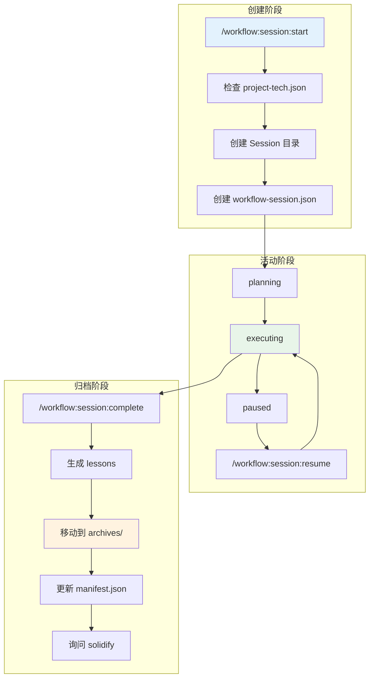
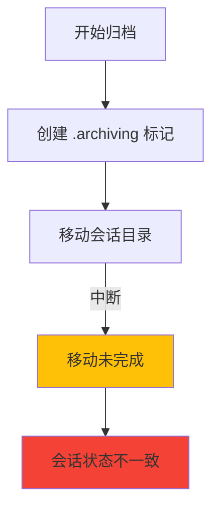

# Chapter 30: 会话的生命周期 — session:start/resume/complete 深度解析

> **生命周期阶段**: 创建 (start) → 恢复 (resume) → 完成 (complete)
> **涉及资产**: .claude/commands/workflow/session/start.md + resume.md + complete.md
> **阅读时间**: 45-60 分钟
> **版本追踪**: `docs/.audit-manifest.json`

---

## 0. 资产证言 (Asset Testimony)

> *"我们是一体三面：start 是接生婆，resume 是唤醒师，complete 是归档员。"*
>
> *"我是 start。当用户开始一个新的工作流时，我会创建一个 Session 目录，里面包含 workflow-session.json、IMPL_PLAN.md、.task/、.summaries/ 等文件。我是所有后续操作的容器。"*
>
> *"我是 resume。当用户暂停后想继续时，我会找到最近的 paused 会话，更新状态为 active，添加 resumed_at 时间戳。我是连接过去和现在的桥梁。"*
>
> *"我是 complete。当用户完成工作流时，我会归档会话：移动到 .workflow/archives/，更新 manifest.json，提取 lessons learned，询问是否 solidify。我是会话的葬礼，也是学习的开始。"*
>
> *"...最近，我们感觉到一些不安。complete 会读取大量文件来生成 lessons learned：workflow-session.json、IMPL_PLAN.md、.task/*.json、.summaries/*.md...这些文件被读取后，它们的内容是否被正确释放？当用户选择 solidify 时，又会读取这些文件来提取学习..."*

```markdown
调查进度: ██████████████ 70%
幽灵位置: Workflow 子系统 — 会话生命周期管理的状态累积
本章线索: session:start 创建会话目录和状态文件
           └── session:resume 恢复暂停的会话
           └── session:complete 归档会话并提取学习
           └── 三个阶段的文件操作是否正确清理？
```

---

## 1. 苏格拉底式思考 (Socratic Inquiry)

> **架构盲点 30.1**: Session 的状态存储在哪里？内存还是磁盘？

在看代码之前，先思考：
1. Session 状态为什么存储在磁盘而不是内存？
2. 磁盘存储带来的好处和代价是什么？
3. 如何保证内存和磁盘状态的一致性？

---

> **架构陷阱 30.2**: complete 归档时，为什么需要移动整个目录而不是复制？

**陷阱方案**: 复制会话目录到 archives，保留原始目录。

**思考点**:
- 复制会导致什么问题？
- 移动如何保证原子性？
- 如果移动失败怎么办？

<details>
<summary>**揭示陷阱**</summary>

**复制 vs 移动**：

| 维度 | 复制 | 移动 |
|------|------|------|
| 磁盘空间 | 2x | 1x |
| 操作速度 | 慢 | 快 |
| 状态清晰度 | 低（两份副本） | 高（唯一来源） |
| 回滚难度 | 低 | 高 |

**CCW 的设计**：
- 移动整个目录（原子操作）
- 如果移动失败，原地保留
- 归档后不再修改原始目录

**原子性保证**：
```bash
# 使用 mv 命令（原子操作）
mv .workflow/active/$SESSION_ID .workflow/archives/$SESSION_ID

# 如果失败，原始目录仍然存在
```

</details>

---

> **架构陷阱 30.3**: solidify 为什么是可选的？

**陷阱方案**: 归档时自动执行 solidify。

**思考点**:
- solidify 的代价是什么？
- 不是每个会话都有学习价值吗？
- 为什么让用户决定是否 solidify？

<details>
<summary>**揭示陷阱**</summary>

**Solidify 的必要性分析**：

| 会话类型 | 学习价值 | 是否需要 Solidify |
|----------|----------|-------------------|
| 重复任务 | 低 | 否 |
| 失败任务 | 中 | 可能 |
| 创新任务 | 高 | 是 |
| 简单修复 | 低 | 否 |
| 复杂重构 | 高 | 是 |

**CCW 的设计**：
- Solidify 是可选的，因为：
  1. 不是每个会话都有值得记录的学习
  2. Solidify 会修改 project-guidelines.json，需要用户确认
  3. 自动 solidify 可能引入噪音

**用户决策逻辑**：
```typescript
AskUserQuestion({
  questions: [{
    question: "Would you like to solidify learnings from this session?",
    options: [
      { label: "Yes, solidify now", description: "Extract learnings and update guidelines" },
      { label: "Skip", description: "Archive complete, no learnings to capture" }
    ]
  }]
});
```

</details>

---

## 2. 三幕叙事 (Three-Act Narrative)

### 第一幕：会话的诞生 (start)

#### 三种操作模式

```typescript
// 模式 1: Discovery Mode（默认）
// 列出活动会话，让用户选择或创建
/workflow:session:start

// 模式 2: Auto Mode（智能）
// 根据任务描述自动决定创建或复用
/workflow:session:start --auto "implement OAuth2 auth"

// 模式 3: Force New Mode
// 强制创建新会话
/workflow:session:start --new "fix login bug"
```

#### Step 0: 项目初始化检查

```typescript
// 在所有模式之前，检查项目状态
const techExists = Bash(`test -f .workflow/project-tech.json && echo "TECH_EXISTS" || echo "TECH_NOT_FOUND"`);
const guidelinesExists = Bash(`test -f .workflow/project-guidelines.json && echo "GUIDELINES_EXISTS" || echo "GUIDELINES_NOT_FOUND"`);

// 如果任一不存在，调用 /workflow:init
if (techExists !== "TECH_EXISTS" || guidelinesExists !== "GUIDELINES_EXISTS") {
  Skill({ skill: "workflow:init" });
}
```

#### 模式 1: Discovery Mode

```typescript
// 列出活动会话
const sessions = Bash(`ls -1 .workflow/active/ 2>/dev/null | head -5`);

if (sessions.length === 0) {
  console.log("No active sessions. Creating new session.");
  // 进入 Force New Mode
} else {
  // 显示会话信息
  for (const session of sessions) {
    const meta = JSON.parse(Bash(`cat .workflow/active/${session}/workflow-session.json`));
    console.log(`- ${session}: ${meta.project} (${meta.status})`);
  }

  // 让用户选择
  const choice = AskUserQuestion({
    questions: [{
      question: "Select session or create new:",
      options: [
        ...sessions.map(s => ({ label: s, description: "Resume this session" })),
        { label: "Create new", description: "Start fresh session" }
      ]
    }]
  });
}
```

#### 模式 2: Auto Mode

```typescript
// 检查活动会话数量
const activeCount = Bash(`find .workflow/active/ -name "WFS-*" -type d 2>/dev/null | wc -l`);

if (activeCount === 0) {
  // 无活动会话 → 创建新
  createNewSession(taskDescription);
} else if (activeCount === 1) {
  // 单个活动会话 → 检查相关性
  const sessionId = Bash(`find .workflow/active/ -name "WFS-*" -type d | head -1 | xargs basename`);
  const meta = JSON.parse(Bash(`cat .workflow/active/${sessionId}/workflow-session.json`));

  if (isRelevant(meta.project, taskDescription)) {
    console.log(`ANALYSIS: Task relevance = high`);
    console.log(`DECISION: Reusing existing session`);
    console.log(`SESSION_ID: ${sessionId}`);
  } else {
    createNewSession(taskDescription);
  }
} else {
  // 多个活动会话 → 使用第一个
  const firstSession = Bash(`find .workflow/active/ -name "WFS-*" -type d | head -1 | xargs basename`);
  console.log(`WARNING: Multiple active sessions detected`);
  console.log(`SESSION_ID: ${firstSession}`);
}
```

#### 创建新会话

```typescript
function createNewSession(description: string, type: string = "workflow") {
  // 生成 Session ID
  const slug = description
    .toLowerCase()
    .replace(/[^a-z0-9]/g, '-')
    .slice(0, 50);
  const sessionId = `WFS-${slug}`;

  // 检查是否存在，添加计数器
  if (Bash(`ls .workflow/active/${sessionId} 2>/dev/null`)) {
    const counter = 2;
    while (Bash(`ls .workflow/active/${sessionId}-${counter} 2>/dev/null`)) {
      counter++;
    }
    sessionId = `${sessionId}-${counter}`;
  }

  // 创建目录结构
  Bash(`mkdir -p .workflow/active/${sessionId}/.process`);
  Bash(`mkdir -p .workflow/active/${sessionId}/.task`);
  Bash(`mkdir -p .workflow/active/${sessionId}/.summaries`);

  // 创建元数据
  const metadata = {
    session_id: sessionId,
    project: description,
    status: "planning",
    type: type,  // workflow, review, tdd, test, docs
    created_at: new Date().toISOString()
  };
  Write(`.workflow/active/${sessionId}/workflow-session.json`, JSON.stringify(metadata, null, 2));

  console.log(`SESSION_ID: ${sessionId}`);
}
```

---

### 第二幕：会话的唤醒 (resume)

#### 查找暂停的会话

```typescript
// 列出所有活动会话
const sessions = Bash(`ls .workflow/active/WFS-* 2>/dev/null`);

// 过滤出 paused 状态的会话
const pausedSessions = [];
for (const session of sessions) {
  const status = Bash(`jq -r '.status' ${session}/workflow-session.json`);
  if (status === "paused") {
    pausedSessions.push(session);
  }
}

if (pausedSessions.length === 0) {
  console.log("No paused sessions found.");
  return;
}
```

#### 恢复最近的会话

```typescript
// 按修改时间排序，取最近的
const recentSession = Bash(`ls -t .workflow/active/WFS-*/workflow-session.json | head -1`);
const sessionId = basename(dirname(recentSession));

// 更新状态
Bash(`jq '.status = "active"' ${sessionId}/workflow-session.json > temp.json && mv temp.json ${sessionId}/workflow-session.json`);

// 添加恢复时间戳
Bash(`jq '.resumed_at = "'$(date -u +%Y-%m-%dT%H:%M:%SZ)'"' ${sessionId}/workflow-session.json > temp.json && mv temp.json ${sessionId}/workflow-session.json`);

console.log(`
Session ${sessionId} resumed
- Status: active
- Paused at: ${pausedAt}
- Resumed at: ${resumedAt}
- Ready for: /workflow:execute
`);
```

---

### 第三幕：会话的归档 (complete)

#### Phase 1: 查找会话

```bash
# 查找活动会话
SESSION_PATH=$(find .workflow/active/ -maxdepth 1 -name "WFS-*" -type d | head -1)
SESSION_ID=$(basename "$SESSION_PATH")

# 检查/创建归档标记
test -f "$SESSION_PATH/.archiving" && echo "RESUMING" || touch "$SESSION_PATH/.archiving"
```

#### Phase 2: 生成 Manifest 条目

```typescript
// 读取关键文件
const sessionMeta = JSON.parse(Read(`${sessionPath}/workflow-session.json`));
const implPlan = Read(`${sessionPath}/IMPL_PLAN.md`);
const taskCount = Bash(`ls ${sessionPath}/.task/*.json 2>/dev/null | wc -l`);
const summaryCount = Bash(`ls ${sessionPath}/.summaries/*.md 2>/dev/null | wc -l`);

// 构建 manifest 条目
const manifestEntry = {
  session_id: sessionMeta.session_id,
  description: sessionMeta.project,
  archived_at: new Date().toISOString(),
  archive_path: `.workflow/archives/${sessionId}`,
  metrics: {
    duration_hours: calculateDuration(sessionMeta.created_at),
    tasks_completed: taskCount,
    summaries_generated: summaryCount
  },
  tags: extractTags(implPlan),
  lessons: await generateLessons(sessionPath, sessionMeta)
};
```

#### Lessons 生成（使用 Gemini）

```typescript
async function generateLessons(sessionPath: string, meta: SessionMeta): Promise<Lessons> {
  // 收集上下文
  const context = {
    project: meta.project,
    implPlan: Read(`${sessionPath}/IMPL_PLAN.md`),
    tasks: glob(`${sessionPath}/.task/*.json`).map(f => JSON.parse(Read(f))),
    summaries: glob(`${sessionPath}/.summaries/*.md`).map(f => Read(f))
  };

  // 调用 Gemini 生成 lessons
  const prompt = `
Analyze this workflow session and extract lessons learned:

## Session Context
${JSON.stringify(context, null, 2)}

## Task
Extract:
1. Successes: What worked well?
2. Challenges: What was difficult?
3. Watch Patterns: What should be monitored in future?

Output as JSON with structure:
{
  "successes": ["..."],
  "challenges": ["..."],
  "watch_patterns": ["..."]
}
`;

  const result = Bash(`ccw cli -p "${prompt}" --tool gemini --mode analysis`);
  return JSON.parse(result);
}
```

#### Phase 3: 原子归档

```bash
# 1. 创建归档目录
mkdir -p .workflow/archives/

# 2. 移动会话（原子操作）
mv .workflow/active/$SESSION_ID .workflow/archives/$SESSION_ID

# 3. 更新 manifest.json
# 读取 → 追加 → 写入

# 4. 删除标记
rm -f .workflow/archives/$SESSION_ID/.archiving
```

#### Phase 4: 更新 project-tech.json

```typescript
// 如果 project-tech.json 存在，添加 feature 条目
if (fileExists('.workflow/project-tech.json')) {
  const tech = JSON.parse(Read('.workflow/project-tech.json'));

  tech.features.push({
    id: slugify(implPlan.title),
    title: implPlan.title,
    status: "completed",
    tags: manifestEntry.tags,
    timeline: { implemented_at: new Date().toISOString() },
    traceability: {
      session_id: sessionId,
      archive_path: `.workflow/archives/${sessionId}`
    }
  });

  Write('.workflow/project-tech.json', JSON.stringify(tech, null, 2));
}
```

#### Phase 5: 询问 Solidify

```typescript
const autoYes = args.includes('--yes') || args.includes('-y');

if (autoYes) {
  console.log(`[--yes] Auto-selecting: Skip solidify`);
} else {
  const answer = AskUserQuestion({
    questions: [{
      question: "Would you like to solidify learnings from this session into project guidelines?",
      header: "Solidify",
      options: [
        { label: "Yes, solidify now", description: "Extract learnings and update project-guidelines.json" },
        { label: "Skip", description: "Archive complete, no learnings to capture" }
      ]
    }]
  });

  if (answer.answers["Solidify"] === "Yes, solidify now") {
    Skill({ skill: "workflow:session:solidify" });
  }
}
```

---

## 3. 会话生命周期图



---

## 4. 造物主的私语 (Creator's Secret)

> *"为什么 Session 状态存储在磁盘？"*

### 设计决策分析

| 维度 | 内存存储 | 磁盘存储 |
|------|----------|----------|
| 持久性 | 低（进程结束丢失） | 高 |
| 可恢复性 | 低 | 高 |
| 并发安全 | 需要锁 | 天然安全 |
| 性能 | 高 | 中 |
| 调试难度 | 高 | 低 |

**CCW 的选择**：磁盘存储，因为：
1. 会话可能跨越多次对话
2. 需要支持中断恢复
3. 需要支持多进程访问
4. 方便调试和审计

### 版本演进的伤疤

```
session 命令的历史变更：

2024-10-15: 创建 /workflow:session:start
2024-11-03: 添加 /workflow:session:resume
2024-12-10: 添加 /workflow:session:complete
2025-01-15: 添加 lessons learned 生成
2025-02-01: 添加 solidify 集成
```

**伤疤**：solidify 是后来集成的，说明设计之初没有考虑"学习持久化"。

---

## 5. 进化插槽 (Upgrade Slots)

### 插槽一：会话模板

```typescript
// 未来可能的扩展
interface SessionTemplate {
  name: string;
  type: string;  // workflow, review, tdd, test, docs
  default_files: string[];  // 自动创建的文件
  initial_tasks: Task[];  // 初始任务
}

// 使用示例
const tddTemplate: SessionTemplate = {
  name: "tdd-session",
  type: "tdd",
  default_files: ["TEST_PLAN.md", "COVERAGE.md"],
  initial_tasks: [
    { id: "T1", title: "Write failing tests", ... },
    { id: "T2", title: "Implement minimum code", ... },
    { id: "T3", title: "Refactor", ... }
  ]
};
```

### 插槽二：会话快照

```typescript
// 未来可能的扩展
interface SessionSnapshot {
  timestamp: string;
  reason: string;
  files: Record<string, string>;  // 文件路径 → 内容
}

// 使用示例
/workflow:session:snapshot "Before major refactoring"
// 创建快照，可以在后续恢复
```

### 插槽三：并行会话支持

```typescript
// 未来可能的扩展
interface ParallelSession {
  parent_session_id: string;
  branch_name: string;
  worktree_path: string;
}

// 使用示例
/workflow:session:start --parallel WFS-main "experiment with new approach"
// 创建并行会话，共享父会话上下文
```

---

## 6. 事故复盘档案 (Incident Post-mortem)

### 事故 #30：归档过程中断导致状态不一致

> **时间**: 2025-02-01 16:45:22 UTC
> **症状**: /workflow:session:complete 执行到一半时用户取消，会话状态未知
> **影响**: 会话既不在 active 也不在 archives

#### 时间轨迹

```
16:45:22 - 用户运行 /workflow:session:complete
16:45:23 - Phase 1: 查找会话成功
16:45:24 - Phase 2: 生成 manifest 条目
16:45:25 - 创建 .archiving 标记
16:45:26 - Phase 3: 移动会话...
16:45:27 - 用户按 Ctrl+C 取消
16:45:28 - 会话状态未知
```

#### 根因分析



#### 修复方案

```typescript
// 1. 使用 .archiving 标记进行恢复
function recoverInterruptedArchive() {
  // 查找有 .archiving 标记的会话
  const archivingSessions = Bash(`find .workflow/active/ -name ".archiving" | xargs dirname`);

  for (const session of archivingSessions) {
    // 检查是否已在 archives
    const sessionId = basename(session);
    if (Bash(`test -d .workflow/archives/${sessionId} && echo "exists"`)) {
      // 已在 archives，删除 active 中的残留
      Bash(`rm -rf ${session}`);
    } else {
      // 未完成归档，恢复
      Bash(`rm ${session}/.archiving`);
      console.log(`Recovered incomplete archive: ${sessionId}`);
    }
  }
}

// 2. 在 start 命令中自动恢复
/workflow:session:start --auto-recover
```

---

### 幽灵旁白：归档的幽灵

> *"我是归档的幽灵。"*
>
> *"当 complete 命令执行时，它会读取我的所有文件：workflow-session.json、IMPL_PLAN.md、.task/*.json、.summaries/*.md..."*
>
> *"这些文件被读取，解析，合并，然后生成 lessons learned。Gemini CLI 会分析它们，提取成功经验、挑战和监控模式。"*
>
> *"然后我被移动到 archives/。我的文件仍然存在，只是换了位置。但那些被读取到内存的内容呢？它们被释放了吗？"*
>
> *"当用户选择 solidify 时，我又会被读取一次。这次是为了提取学习，更新 project-guidelines.json。同样的文件，又一次被加载..."*

```markdown
调查进度: ███████████████ 75%
幽灵位置: Workflow 子系统 → 命令层全链路 — 会话归档的内存管理
下一章线索: Chapter 31 将深入 /workflow:brainstorm-with-file 命令
           └── brainstorm 使用多 CLI 并行发散思维
           └── 3 个 CLI 同时加载上下文
           └── 并行 CLI 调用的内存管理策略？
```

---

## 7. 资产审计账本 (Asset Audit Ledger)

### 三个命令的关键结构

| 命令 | 职责 | 输出 |
|------|------|------|
| `/workflow:session:start` | 创建/发现会话 | Session ID |
| `/workflow:session:resume` | 恢复暂停会话 | 更新的状态 |
| `/workflow:session:complete` | 归档会话 | Manifest 条目 |

### Session 目录结构

```
.workflow/active/WFS-{slug}/
├── workflow-session.json     # 会话元数据
├── IMPL_PLAN.md              # 实施计划
├── .process/                 # 过程文件
├── .task/                    # 任务定义
│   ├── IMPL-1.json
│   └── IMPL-2.json
└── .summaries/               # 完成摘要
    ├── IMPL-1-summary.md
    └── IMPL-2-summary.md
```

### workflow-session.json 结构

```json
{
  "session_id": "WFS-implement-oauth2",
  "project": "implement OAuth2 authentication",
  "status": "planning",
  "type": "workflow",
  "created_at": "2025-02-18T10:00:00Z",
  "resumed_at": "2025-02-18T14:00:00Z",
  "paused_at": "2025-02-18T12:00:00Z"
}
```

### 执行流程对比

```
start:
  Step 0: 检查项目状态 → 调用 /workflow:init（如果需要）
  Mode 1 (Discovery): 列出会话 → 用户选择
  Mode 2 (Auto): 分析相关性 → 自动决定
  Mode 3 (Force New): 生成 ID → 创建目录

resume:
  Step 1: 查找 paused 会话
  Step 2: 更新状态为 active
  Step 3: 添加 resumed_at 时间戳

complete:
  Phase 1: 查找会话 → 创建标记
  Phase 2: 读取文件 → 生成 manifest
  Phase 3: 原子移动 → 更新索引
  Phase 4: 更新 project-tech.json
  Phase 5: 询问 solidify
```

---

## 附录

### A. 操作速查表

| 操作 | 命令 |
|------|------|
| 开始新会话 | `/workflow:session:start` |
| 自动模式 | `/workflow:session:start --auto "task"` |
| 强制新会话 | `/workflow:session:start --new "task"` |
| 恢复会话 | `/workflow:session:resume` |
| 完成会话 | `/workflow:session:complete` |
| 自动完成 | `/workflow:session:complete --yes` |

### B. 相关文件清单

```
.claude/commands/workflow/session/
├── start.md                  # 会话创建
├── resume.md                 # 会话恢复
├── complete.md               # 会话归档
└── solidify.md               # 学习固化

.workflow/
├── active/                   # 活动会话
│   └── WFS-xxx/
├── archives/                 # 归档会话
│   ├── manifest.json         # 归档索引
│   └── WFS-xxx/
├── project-tech.json         # 技术栈配置
└── project-guidelines.json   # 开发规范
```

### C. 会话类型

| 类型 | 描述 | 默认用于 |
|------|------|----------|
| `workflow` | 标准实施 | `/workflow:plan` |
| `review` | 代码审查 | `/workflow:review-cycle` |
| `tdd` | TDD 开发 | `/workflow:tdd-plan` |
| `test` | 测试生成 | `/workflow:test-fix-gen` |
| `docs` | 文档编写 | `/memory:docs` |

---

*Chapter 30: 会话的生命周期 — session:start/resume/complete 深度解析*
*CCW Deep Dive Series*
