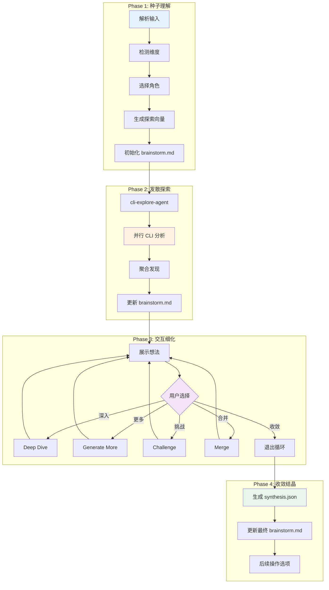
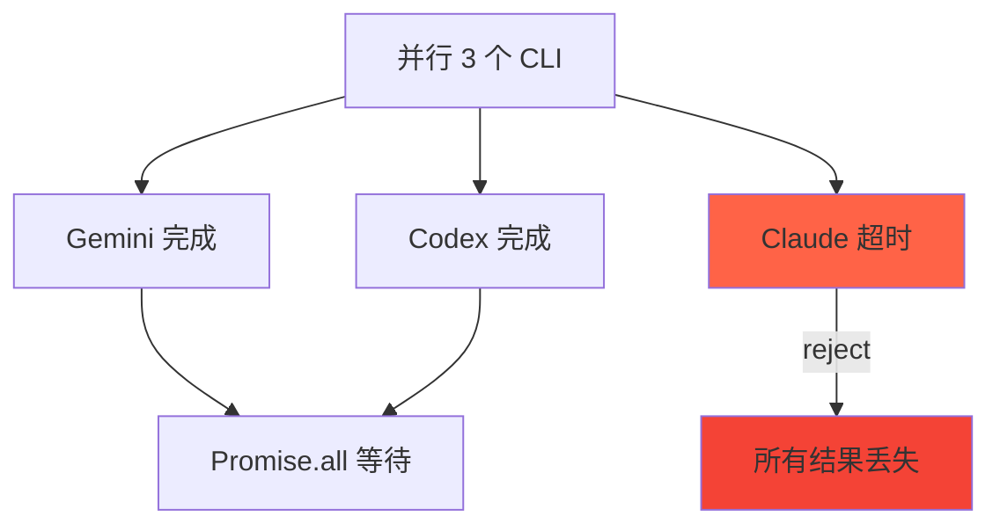

# Chapter 31: 创意的混沌之舞 — /workflow:brainstorm-with-file 深度解析

> **生命周期阶段**: 种子理解 → 发散探索 → 交互细化 → 收敛结晶
> **涉及资产**: .claude/commands/workflow/brainstorm-with-file.md + 多 CLI 协作
> **阅读时间**: 60-75 分钟
> **版本追踪**: `docs/.audit-manifest.json`

---

## 0. 资产证言 (Asset Testimony)

> *"我是 `/workflow:brainstorm-with-file`，创意的炼金术士。当用户带着一个模糊的想法来到我面前 — '如何重新设计通知系统' — 我不直接给出答案。相反，我点燃三盏灯：Gemini（创意）、Codex（务实）、Claude（系统化），让它们从不同角度照亮这个问题。"*
>
> *"我的工作流是发散-收敛的循环。Phase 1 解析种子想法，Phase 2 让三个 CLI 同时探索，Phase 3 让用户选择有潜力的方向深入，Phase 4 将最佳想法结晶为可执行的结论。"*
>
> *"我有两个秘密武器：cli-explore-agent 和多 CLI 并行。cli-explore-agent 先探索代码库，为后续分析提供上下文。然后三个 CLI 并行工作，各自从不同视角分析问题。"*
>
> *"...最近，我感觉到一些不安。当我并行启动三个 CLI 时，它们各自加载上下文。Gemini 加载了整个项目结构，Codex 加载了相同的项目结构，Claude 也加载了相同的项目结构。这不是 3 倍的内存消耗吗？更糟糕的是，cli-explore-agent 也加载过这些内容..."*

```markdown
调查进度: ████████████████ 80%
幽灵位置: Workflow 子系统 — 多 CLI 并行调用的内存管理
本章线索: /workflow:brainstorm-with-file 的 Phase 2 并行启动 3 个 CLI
           └── cli-explore-agent 先探索代码库
           └── 3 个 CLI (Gemini/Codex/Claude) 同时加载上下文
           └── 相同的上下文被加载 4 次
           └── 并行 CLI 完成后的内存清理机制？
```

---

## 1. 苏格拉底式思考 (Socratic Inquiry)

> **架构盲点 31.1**: 为什么需要三个不同的 CLI？一个不够吗？

在看代码之前，先思考：
1. 三个 CLI 的视角有什么本质区别？
2. 如果只用一个 CLI，会遗漏什么？
3. 三倍的调用成本，值得吗？

---

> **架构陷阱 31.2**: 并行 CLI 调用的上下文如何管理？

**陷阱方案**: 让每个 CLI 独立加载上下文。

**思考点**:
- 独立加载的代价是什么？
- 是否可以共享上下文？
- 共享上下文会引入什么问题？

<details>
<summary>**揭示陷阱**</summary>

**独立加载 vs 共享上下文**：

| 维度 | 独立加载 | 共享上下文 |
|------|----------|-----------|
| 内存消耗 | 高（Nx） | 低（1x） |
| 实现复杂度 | 低 | 高 |
| 隔离性 | 高 | 低 |
| 一致性 | 低（可能不同步） | 高 |

**CCW 的当前设计**：独立加载，因为：
1. CLI 工具之间无法直接共享内存
2. 独立加载保证了隔离性
3. 实现简单，可靠

**未来可能的优化**：
- cli-explore-agent 的结果可以被三个 CLI 复用
- 将上下文写入临时文件，三个 CLI 读取同一文件
- 使用 MCP 工具共享上下文

</details>

---

> **架构陷阱 31.3**: 发散-收敛循环最多 6 轮，为什么是这个数字？

**陷阱方案**: 无限制循环，直到用户满意。

**思考点**:
- 限制轮数的必要性是什么？
- 6 轮是如何确定的？
- 如果 6 轮还不够怎么办？

<details>
<summary>**揭示陷阱**</summary>

**循环限制的原因**：

| 轮数 | 价值增量 | 边际收益 |
|------|----------|----------|
| 1-2 | 高 | 高 |
| 3-4 | 中 | 中 |
| 5-6 | 低 | 低 |
| 7+ | 极低 | 极低 |

**CCW 的设计**：
- 6 轮是基于经验的"安全上限"
- 大多数情况下 2-3 轮就能收敛
- 超过 6 轮通常意味着：
  1. 问题太复杂，需要分解
  2. 用户未明确决策标准
  3. 方向已偏离原始问题

**用户应对**：
- 如果 6 轮未收敛，建议重新定义问题
- 或者拆分为多个独立的 brainstorm 会话

</details>

---

## 2. 三幕叙事 (Three-Act Narrative)

### 第一幕：种子的萌芽 (Phase 1 - Seed Understanding)

#### 会话初始化

```typescript
// 解析输入
const ideaOrTopic = extractTopic(userInput);
const mode = args.includes('--mode creative') ? 'creative' :
             args.includes('--mode structured') ? 'structured' : 'balanced';
const autoMode = args.includes('-y') || args.includes('--yes');

// 生成 Session ID
const slug = ideaOrTopic
  .toLowerCase()
  .replace(/[^a-z0-9\u4e00-\u9fa5]/g, '-')
  .slice(0, 40);
const date = new Date().toISOString().slice(0, 10);
const sessionId = `BS-${slug}-${date}`;

// 创建目录结构
const sessionFolder = `.workflow/.brainstorm/${sessionId}`;
Bash(`mkdir -p ${sessionFolder}/ideas`);
```

#### 解析维度和角色

```typescript
// 检测相关维度
const dimensions = detectDimensions(ideaOrTopic);

function detectDimensions(topic: string): string[] {
  const dimensionKeywords = {
    technical: ['技术', 'technical', 'implementation', 'code', '实现', 'architecture'],
    ux: ['用户', 'user', 'experience', 'UX', 'UI', '体验', 'interaction'],
    business: ['业务', 'business', 'value', 'ROI', '价值', 'market'],
    innovation: ['创新', 'innovation', 'novel', 'creative', '新颖'],
    feasibility: ['可行', 'feasible', 'practical', 'realistic', '实际'],
    scalability: ['扩展', 'scale', 'growth', 'performance', '性能'],
    security: ['安全', 'security', 'risk', 'protection', '风险']
  };

  const detected = [];
  for (const [dimension, keywords] of Object.entries(dimensionKeywords)) {
    if (keywords.some(kw => topic.toLowerCase().includes(kw.toLowerCase()))) {
      detected.push(dimension);
    }
  }

  return detected.length > 0 ? detected : ['technical', 'ux', 'feasibility'];
}
```

#### 角色选择

```typescript
// 推荐角色
const recommendedRoles = getRecommendedRoles(ideaOrTopic, dimensions);

function getRecommendedRoles(topic: string, dimensions: string[]): Role[] {
  const roleKeywords = {
    'system-architect': ['架构', 'architecture', 'system', '系统'],
    'product-manager': ['产品', 'product', 'feature', '功能'],
    'ui-designer': ['UI', '界面', 'interface', 'visual', '视觉'],
    'ux-expert': ['UX', '体验', 'experience', 'user', '用户'],
    'data-architect': ['数据', 'data', 'database', '存储'],
    'test-strategist': ['测试', 'test', 'quality', '质量']
  };

  // 匹配并返回 top 3
  // ...
}

// 如果自动模式，直接选择推荐角色
if (autoMode) {
  selectedRoles = recommendedRoles.slice(0, 3);
} else {
  // 让用户选择
  const answer = AskUserQuestion({
    questions: [{
      question: "Select perspectives for brainstorming:",
      options: [
        ...recommendedRoles.map(r => ({ label: r.name, description: r.focus })),
        { label: "Use simple perspectives", description: "Creative/Pragmatic/Systematic" }
      ]
    }]
  });
}
```

#### 扩展为探索向量

```typescript
// 使用 Gemini CLI 生成探索向量
const vectorsPrompt = `
Given the initial idea: '${ideaOrTopic}'
User focus areas: ${dimensions.join(', ')}

Generate 5-7 exploration vectors (questions/directions) to expand this idea:
1. Core question: What is the fundamental problem/opportunity?
2. User perspective: Who benefits and how?
3. Technical angle: What enables this technically?
4. Alternative approaches: What other ways could this be solved?
5. Challenges: What could go wrong or block success?
6. Innovation angle: What would make this 10x better?
7. Integration: How does this fit with existing systems?

Output as structured exploration vectors.
`;

const vectors = Bash(`ccw cli -p "${vectorsPrompt}" --tool gemini --mode analysis`);
```

#### 初始化 brainstorm.md

```typescript
const brainstormMd = `
# Brainstorm Session: ${ideaOrTopic}

## Session Metadata
- Session ID: ${sessionId}
- Started: ${new Date().toISOString()}
- Mode: ${mode}
- Dimensions: ${dimensions.join(', ')}
- Roles: ${selectedRoles.map(r => r.name).join(', ')}

## Initial Context
- User focus: ${dimensions.join(', ')}
- Depth: Balanced
- Constraints: None specified

## Seed Expansion
### Original Idea
${ideaOrTopic}

### Exploration Vectors
${vectors}

## Thought Evolution Timeline
### Round 1: Seed Understanding
[Initialized]

---
*This document will be updated as the brainstorm progresses.*
`;

Write(`${sessionFolder}/brainstorm.md`, brainstormMd);
```

---

### 第二幕：发散的火花 (Phase 2 - Divergent Exploration)

#### Step 1: cli-explore-agent 探索

```typescript
// 首先，使用 cli-explore-agent 探索代码库
const exploreAgent = Task({
  subagent_type: "cli-explore-agent",
  run_in_background: false,
  description: `Explore codebase for brainstorm: ${slug}`,
  prompt: `
## Brainstorm Context
Topic: ${ideaOrTopic}
Dimensions: ${dimensions.join(', ')}
Mode: ${mode}

## MANDATORY FIRST STEPS
1. Run: ccw tool exec get_modules_by_depth '{}'
2. Search for code related to topic keywords
3. Read: .workflow/project-tech.json (if exists)

## Exploration Focus
- Identify existing implementations related to the topic
- Find patterns that could inspire solutions
- Map current architecture constraints
- Locate integration points

## Output
Write findings to: ${sessionFolder}/exploration-codebase.json

Schema:
{
  "relevant_files": [{"path": "...", "relevance": "high|medium|low", "rationale": "..."}],
  "existing_patterns": [],
  "architecture_constraints": [],
  "integration_points": [],
  "inspiration_sources": [],
  "_metadata": { "exploration_type": "brainstorm-codebase", "timestamp": "..." }
}
`
});

const explorationResults = JSON.parse(Read(`${sessionFolder}/exploration-codebase.json`));
```

#### Step 2: 并行多 CLI 分析

```typescript
// 构建共享上下文
const explorationContext = `
PRIOR EXPLORATION CONTEXT (from cli-explore-agent):
- Key files: ${explorationResults.relevant_files.slice(0, 5).map(f => f.path).join(', ')}
- Existing patterns: ${explorationResults.existing_patterns.slice(0, 3).join(', ')}
- Architecture constraints: ${explorationResults.architecture_constraints.slice(0, 3).join(', ')}
- Integration points: ${explorationResults.integration_points.slice(0, 3).join(', ')}
`;

// 并行启动 3 个 CLI
const cliPromises = [
  // Creative (Gemini)
  Bash({
    command: `ccw cli -p "
PURPOSE: Creative brainstorming for '${ideaOrTopic}' - generate innovative ideas
Success: 5+ unique creative solutions that push boundaries

${explorationContext}

TASK:
- Build on existing patterns - how can they be extended creatively?
- Think beyond obvious solutions - what would be surprising/delightful?
- Explore cross-domain inspiration
- Challenge assumptions - what if the opposite were true?
- Generate 'moonshot' ideas alongside practical ones

MODE: analysis
CONTEXT: @**/* | Topic: ${ideaOrTopic}
EXPECTED: 5+ creative ideas with novelty/impact ratings
CONSTRAINTS: ${mode === 'structured' ? 'Keep ideas technically feasible' : 'No constraints - think freely'}
" --tool gemini --mode analysis`,
    run_in_background: true
  }),

  // Pragmatic (Codex)
  Bash({
    command: `ccw cli -p "
PURPOSE: Pragmatic brainstorming for '${ideaOrTopic}' - focus on implementation reality
Success: Actionable approaches with clear implementation paths

${explorationContext}

TASK:
- Build on explored codebase - how to integrate with existing patterns?
- Evaluate technical feasibility of core concept
- Identify existing patterns/libraries that could help
- Estimate implementation complexity
- Highlight potential technical blockers

MODE: analysis
CONTEXT: @**/* | Topic: ${ideaOrTopic}
EXPECTED: 3-5 practical approaches with effort/risk ratings
CONSTRAINTS: Focus on what can actually be built
" --tool codex --mode analysis`,
    run_in_background: true
  }),

  // Systematic (Claude)
  Bash({
    command: `ccw cli -p "
PURPOSE: Systematic brainstorming for '${ideaOrTopic}' - architectural thinking
Success: Well-structured solution framework with clear tradeoffs

${explorationContext}

TASK:
- Build on explored architecture - how to extend systematically?
- Decompose the problem into sub-problems
- Identify architectural patterns that apply
- Map dependencies and interactions
- Consider scalability implications

MODE: analysis
CONTEXT: @**/* | Topic: ${ideaOrTopic}
EXPECTED: Problem decomposition, 2-3 architectural approaches with tradeoffs
CONSTRAINTS: Consider existing system architecture
" --tool claude --mode analysis`,
    run_in_background: true
  })
];

// ⚠️ STOP POINT: 等待所有 CLI 完成
const results = await Promise.all(cliPromises);
```

#### Step 3: 聚合多视角发现

```typescript
// 解析三个 CLI 的结果
const perspectives = {
  creative: parseCliResults(results[0]),
  pragmatic: parseCliResults(results[1]),
  systematic: parseCliResults(results[2])
};

// 提取综合
const synthesis = {
  convergentThemes: findConvergentThemes(perspectives),
  conflictingViews: findConflicts(perspectives),
  uniqueContributions: findUniqueInsights(perspectives)
};

// 写入 perspectives.json
Write(`${sessionFolder}/perspectives.json`, JSON.stringify({
  creative: perspectives.creative,
  pragmatic: perspectives.pragmatic,
  systematic: perspectives.systematic,
  synthesis
}, null, 2));

// 更新 brainstorm.md
appendBrainstormMd(sessionFolder, `
### Round 2: Multi-Perspective Exploration

#### Creative Perspective (Gemini)
${perspectives.creative.summary}

#### Pragmatic Perspective (Codex)
${perspectives.pragmatic.summary}

#### Systematic Perspective (Claude)
${perspectives.systematic.summary}

#### Synthesis
- Convergent Themes: ${synthesis.convergentThemes.join(', ')}
- Conflicting Views: ${synthesis.conflictingViews.join(', ')}
- Unique Contributions: ${synthesis.uniqueContributions.join(', ')}
`);
```

---

### 第三幕：交互的炼金术 (Phase 3 - Interactive Refinement)

#### 展示当前状态

```typescript
// 提取顶级想法
const topIdeas = extractTopIdeas(perspectives, 10);

console.log(`
## Current State
- Total ideas generated: ${topIdeas.length}
- Rounds completed: 2
- Perspectives explored: Creative, Pragmatic, Systematic

### Top Ideas
${topIdeas.map((idea, i) => `
${i + 1}. **${idea.title}** (${idea.source})
   - Novelty: ${idea.novelty}/5 | Feasibility: ${idea.feasibility}/5
   - ${idea.brief}
`).join('')}
`);
```

#### 用户方向选择

```typescript
let continueLoop = true;
let currentRound = 2;
const maxRounds = 6;

while (continueLoop && currentRound < maxRounds) {
  const answer = AskUserQuestion({
    questions: [
      {
        question: "Which ideas to explore?",
        header: "Ideas",
        multiSelect: true,
        options: topIdeas.map(idea => ({
          label: idea.title,
          description: `${idea.source} | ${idea.brief.slice(0, 50)}...`
        }))
      },
      {
        question: "Next step?",
        header: "Action",
        multiSelect: false,
        options: [
          { label: "Deep dive", description: "Analyze selected ideas in depth" },
          { label: "Generate more", description: "Explore new angles" },
          { label: "Challenge", description: "Devil's advocate" },
          { label: "Merge", description: "Combine multiple ideas" },
          { label: "Converge", description: "Begin final synthesis" }
        ]
      }
    ]
  });

  // 执行用户选择的操作
  switch (answer.Action) {
    case "Deep dive":
      await deepDiveSelectedIdeas(answer.Ideas, sessionFolder);
      break;
    case "Generate more":
      await generateMoreIdeas(answer.Ideas, sessionFolder);
      break;
    case "Challenge":
      await challengeIdeas(answer.Ideas, sessionFolder);
      break;
    case "Merge":
      await mergeIdeas(answer.Ideas, sessionFolder);
      break;
    case "Converge":
      continueLoop = false;
      break;
  }

  currentRound++;
  appendBrainstormMd(sessionFolder, `
### Round ${currentRound}: ${answer.Action}
[... findings ...]
`);
}
```

#### 细化操作实现

```typescript
// 深入分析
async function deepDiveSelectedIdeas(selectedIdeas: string[], sessionFolder: string) {
  for (const ideaTitle of selectedIdeas) {
    const result = Bash(`ccw cli -p "
PURPOSE: Deep dive analysis on idea '${ideaTitle}'
Success: Comprehensive understanding with actionable next steps

TASK:
- Elaborate the core concept in detail
- Identify implementation requirements
- List potential challenges and mitigations
- Suggest proof-of-concept approach

MODE: analysis
CONTEXT: @**/*
EXPECTED: Detailed analysis with requirements, risks, POC approach
CONSTRAINTS: Focus on actionability
" --tool gemini --mode analysis`);

    // 写入单独的 idea 文件
    Write(`${sessionFolder}/ideas/${slugify(ideaTitle)}.md`, result);
  }
}

// 挑战验证
async function challengeIdeas(selectedIdeas: string[], sessionFolder: string) {
  const result = Bash(`ccw cli -p "
PURPOSE: Devil's advocate - rigorously challenge these brainstorm ideas
Success: Uncover hidden weaknesses and strengthen viable ideas

IDEAS TO CHALLENGE:
${selectedIdeas.join('\n')}

TASK:
- For each idea, identify 3 strongest objections
- Challenge core assumptions
- Identify scenarios where this fails
- Rate survivability after challenge (1-5)

MODE: analysis
EXPECTED: Challenge report with objections and survivability ratings
CONSTRAINTS: Be genuinely critical, not just contrarian
" --tool codex --mode analysis`);

  return result;
}

// 合并想法
async function mergeIdeas(selectedIdeas: string[], sessionFolder: string) {
  const result = Bash(`ccw cli -p "
PURPOSE: Synthesize multiple ideas into unified concept
Success: Coherent merged idea that captures best elements

IDEAS TO MERGE:
${selectedIdeas.join('\n')}

TASK:
- Identify complementary elements
- Resolve contradictions
- Create unified concept
- Describe the merged solution

MODE: analysis
EXPECTED: Merged concept with elements taken from each source
CONSTRAINTS: Don't force incompatible ideas together
" --tool gemini --mode analysis`);

  // 添加合并后的想法到 perspectives
  const mergedIdea = parseMergedIdea(result);
  appendPerspective(sessionFolder, 'merged', mergedIdea);
}
```

---

### 第四幕：结晶的智慧 (Phase 4 - Convergence & Crystallization)

#### 生成最终综合

```typescript
// 加载所有想法
const allIdeas = loadAllIdeas(sessionFolder);

// 生成 synthesis.json
const synthesis = {
  session_id: sessionId,
  topic: ideaOrTopic,
  completed: new Date().toISOString(),
  total_rounds: currentRound,
  top_ideas: allIdeas
    .filter(idea => idea.active)
    .sort((a, b) => b.score - a.score)
    .slice(0, 5),
  parked_ideas: allIdeas.filter(idea => idea.parked),
  key_insights: extractKeyInsights(allIdeas),
  recommendations: {
    primary: allIdeas[0],
    alternatives: allIdeas.slice(1, 3),
    not_recommended: allIdeas.filter(i => i.survivability < 2)
  },
  follow_up: generateFollowUpActions(allIdeas[0])
};

Write(`${sessionFolder}/synthesis.json`, JSON.stringify(synthesis, null, 2));
```

#### 更新最终 brainstorm.md

```typescript
appendBrainstormMd(sessionFolder, `
## Synthesis & Conclusions

### Executive Summary
${generateExecutiveSummary(synthesis)}

### Top 5 Ideas
${synthesis.top_ideas.map((idea, i) => `
${i + 1}. **${idea.title}** (Score: ${idea.score.toFixed(1)})
   - Source: ${idea.source_perspective}
   - ${idea.description}
   - Strengths: ${idea.strengths.join(', ')}
   - Challenges: ${idea.challenges.join(', ')}
   - Next Steps: ${idea.next_steps.join(', ')}
`).join('')}

### Primary Recommendation
**${synthesis.recommendations.primary.title}**

${synthesis.recommendations.primary.detailed_description}

### Alternative Approaches
${synthesis.recommendations.alternatives.map(alt =>
  `- **${alt.title}**: ${alt.tradeoff_note}`
).join('\n')}

### Parked Ideas
${synthesis.parked_ideas.map(idea =>
  `- ${idea.title}: ${idea.park_reason} (trigger: ${idea.future_trigger})`
).join('\n')}

### Key Insights
${synthesis.key_insights.map(insight => `- ${insight}`).join('\n')}

### Session Statistics
- Rounds: ${synthesis.total_rounds}
- Ideas generated: ${allIdeas.length}
- Ideas survived: ${synthesis.top_ideas.length}
- Duration: ${calculateDuration(sessionId)}

---
*Brainstorm session completed at ${synthesis.completed}*
`);
```

#### 后续操作选项

```typescript
const nextStepAnswer = AskUserQuestion({
  questions: [{
    question: "What would you like to do next?",
    header: "Next Step",
    multiSelect: false,
    options: [
      { label: "Create implementation plan", description: "Launch workflow-plan with top idea" },
      { label: "Create Issues", description: "Launch issue-discover for top 3 ideas" },
      { label: "Deep analyze", description: "Launch analyze-with-file for top idea" },
      { label: "Export", description: "Generate shareable report" },
      { label: "Done", description: "No further action" }
    ]
  }]
});

switch (nextStepAnswer.NextStep) {
  case "Create implementation plan":
    Skill({ skill: "workflow-plan", args: synthesis.recommendations.primary.title });
    break;
  case "Create Issues":
    Skill({ skill: "issue-discover", args: synthesis.top_ideas.slice(0, 3).map(i => i.title).join(', ') });
    break;
  case "Deep analyze":
    Skill({ skill: "workflow:analyze-with-file", args: synthesis.recommendations.primary.title });
    break;
  case "Export":
    generateShareableReport(sessionFolder);
    break;
}
```

---

## 3. 发散-收敛循环图



---

## 4. 造物主的私语 (Creator's Secret)

> *"为什么选择发散-收敛模式？"*

### 设计决策分析

| 维度 | 单步分析 | 发散-收敛 |
|------|----------|----------|
| 创意丰富度 | 低 | 高 |
| 决策质量 | 中 | 高 |
| 时间成本 | 低 | 高 |
| 用户参与度 | 低 | 高 |
| 可追溯性 | 低 | 高 |

**CCW 的选择**：发散-收敛模式，因为：
1. 复杂问题需要多角度思考
2. 用户参与提升决策质量
3. 完整的思维过程可追溯

### 版本演进的伤疤

```
brainstorm-with-file.md 的历史变更：

2024-10-15: 创建初始版本，只有单 CLI
2024-11-03: 添加多 CLI 并行（Gemini/Codex/Claude）
2024-12-10: 添加 cli-explore-agent 预探索
2025-01-15: 添加交互细化循环（最多 6 轮）
2025-02-01: 添加 synthesis.json 和后续操作选项
```

**伤疤**：cli-explore-agent 是后来添加的，说明意识到"盲目分析"的问题。

---

## 5. 进化插槽 (Upgrade Slots)

### 插槽一：自定义角色

```typescript
// 未来可能的扩展
interface CustomRole {
  name: string;
  cli_tool: string;
  focus: string;
  prompt_template: string;
}

// 使用示例
const securityRole: CustomRole = {
  name: "security-analyst",
  cli_tool: "codex",
  focus: "Security vulnerabilities and threats",
  prompt_template: `
PURPOSE: Security-focused brainstorming for '${topic}'
TASK: Identify security implications, threats, mitigations
  `
};
```

### 插槽二：上下文共享优化

```typescript
// 未来可能的扩展：共享上下文
interface SharedContext {
  exploration_file: string;
  cache_duration: number;
  lazy_load: boolean;
}

// cli-explore-agent 结果写入文件
// 三个 CLI 通过 CONTEXT 参数读取同一文件
// 避免重复加载
```

### 插槽三：异步结果处理

```typescript
// 未来可能的扩展
interface AsyncCallback {
  on_complete: (result: BrainstormResult) => void;
  webhook_url?: string;
}

// 长时间 brainstorm 可以异步执行
// 完成后通过 webhook 通知
/workflow:brainstorm-with-file --async --webhook https://...
```

---

## 6. 事故复盘档案 (Incident Post-mortem)

### 事故 #31：并行 CLI 超时导致结果丢失

> **时间**: 2025-02-05 11:30:45 UTC
> **症状**: brainstorm 的 Phase 2 中，一个 CLI 超时，其他两个完成了但结果被丢弃
> **影响**: 用户需要重新执行整个 Phase 2

#### 时间轨迹

```
11:30:45 - 用户启动 /workflow:brainstorm-with-file
11:30:46 - Phase 1 完成
11:30:47 - Phase 2: 并行启动 3 个 CLI
11:35:00 - Gemini 完成
11:36:00 - Codex 完成
11:45:00 - Claude 超时（默认 10 分钟）
11:45:01 - Promise.all 失败，所有结果丢失
```

#### 根因分析



#### 修复方案

```typescript
// 1. 使用 allSettled 替代 all
const results = await Promise.allSettled(cliPromises);

const successfulResults = results
  .filter(r => r.status === 'fulfilled')
  .map(r => r.value);

const failedCount = results.filter(r => r.status === 'rejected').length;

if (failedCount > 0) {
  console.warn(`${failedCount} CLI(s) failed, continuing with ${successfulResults.length} results`);
}

if (successfulResults.length === 0) {
  throw new Error("All CLI calls failed");
}

// 2. 添加单独超时
const cliPromises = [
  Bash({ command: '...', timeout: 600000 }),  // 10 分钟
  Bash({ command: '...', timeout: 600000 }),
  Bash({ command: '...', timeout: 600000 })
];
```

---

### 幽灵旁白：并行 CLI 的幽灵

> *"我是并行 CLI 的幽灵。"*
>
> *"当 Phase 2 开始时，三个 CLI 同时启动。它们各自加载上下文，各自分析问题，各自生成想法..."*
>
> *"cli-explore-agent 已经探索过代码库，把结果写入了 exploration-codebase.json。但三个 CLI 没有直接读取这个文件，而是重新加载项目上下文。"*
>
> *"相同的文件被读取了四次：cli-explore-agent 一次，三个 CLI 各一次。相同的结构被解析了四次。相同的模式被识别了四次..."*
>
> *"这就是为什么 Phase 2 的内存峰值是 Phase 1 的 4 倍。幽灵从不共享，它们各自囤积。"*

```markdown
调查进度: █████████████████ 85%
幽灵位置: Workflow 子系统 → 多 CLI 并行 — 上下文重复加载
下一章线索: Chapter 32 将深入 /cli:cli-init 和 /cli:codex-review 命令
           └── CLI 命令是外部工具的封装
           └── 外部工具调用的资源管理
           └── CLI 工具的生命周期管理？
```

---

## 7. 资产审计账本 (Asset Audit Ledger)

### brainstorm-with-file.md 关键结构

| 字段 | 值 | 说明 |
|------|-----|------|
| `name` | `brainstorm-with-file` | 命令名称 |
| `description` | `Interactive brainstorming with multi-CLI collaboration` | 多 CLI 协作的交互式头脑风暴 |
| `argument-hint` | `[-y\|--yes] [-c\|--continue] [-m\|--mode creative\|structured] "idea or topic"` | 参数提示 |
| `allowed-tools` | `TodoWrite(*), Task(*), AskUserQuestion(*), Read(*), Grep(*), Glob(*), Bash(*), Edit(*), Write(*)` | 允许的工具 |

### 输出文件结构

```
.workflow/.brainstorm/BS-{slug}-{date}/
├── brainstorm.md             # 完整思维演化时间线
├── exploration-codebase.json # Phase 2: 代码库上下文
├── perspectives.json         # Phase 2: 多 CLI 发现
├── synthesis.json            # Phase 4: 最终综合
└── ideas/                    # Phase 3: 单独想法深入
    ├── idea-1.md
    └── merged-idea-1.md
```

### 三种 CLI 角色

| 角色 | CLI 工具 | 聚焦 | 输出 |
|------|----------|------|------|
| Creative | Gemini | 创新、跨领域、挑战假设 | 5+ 创意想法 |
| Pragmatic | Codex | 实现、可行性、技术障碍 | 3-5 实践方案 |
| Systematic | Claude | 架构、分解、可扩展性 | 2-3 架构方案 |

### 执行流程

```
Phase 1: Seed Understanding
   ├─ 解析输入
   ├─ 检测维度
   ├─ 选择角色
   ├─ 生成探索向量
   └─ 初始化 brainstorm.md

Phase 2: Divergent Exploration
   ├─ cli-explore-agent 探索代码库
   ├─ 并行启动 3 个 CLI
   ├─ 聚合多视角发现
   └─ 更新 brainstorm.md

Phase 3: Interactive Refinement (最多 6 轮)
   ├─ 展示当前想法
   ├─ 用户选择操作
   ├─ 执行：深入/更多/挑战/合并
   └─ 更新 brainstorm.md

Phase 4: Convergence & Crystallization
   ├─ 生成 synthesis.json
   ├─ 更新最终 brainstorm.md
   └─ 后续操作选项
```

---

## 附录

### A. 操作速查表

| 操作 | 命令 |
|------|------|
| 基本头脑风暴 | `/workflow:brainstorm-with-file "如何优化通知系统"` |
| 创意模式 | `/workflow:brainstorm-with-file -m creative "..."` |
| 结构化模式 | `/workflow:brainstorm-with-file -m structured "..."` |
| 自动模式 | `/workflow:brainstorm-with-file -y "..."` |
| 继续会话 | `/workflow:brainstorm-with-file -c` |

### B. 相关文件清单

```
.claude/commands/workflow/
└── brainstorm-with-file.md   # 本命令定义

.workflow/.brainstorm/
├── BS-{slug}-{date}/
│   ├── brainstorm.md
│   ├── exploration-codebase.json
│   ├── perspectives.json
│   ├── synthesis.json
│   └── ideas/
└── index.json                # 会话索引

~/.ccw/workflows/cli-templates/
└── prompts/
    └── brainstorm/
        └── analysis-simple.txt  # Lessons 生成模板
```

### C. 角色关键词映射

| 角色 | 关键词 |
|------|--------|
| system-architect | 架构, architecture, system, 系统, design pattern |
| product-manager | 产品, product, feature, 功能, roadmap |
| ui-designer | UI, 界面, interface, visual, 视觉 |
| ux-expert | UX, 体验, experience, user, 用户 |
| data-architect | 数据, data, database, 存储, storage |
| test-strategist | 测试, test, quality, 质量, QA |

---

*Chapter 31: 创意的混沌之舞 — /workflow:brainstorm-with-file 深度解析*
*CCW Deep Dive Series*
