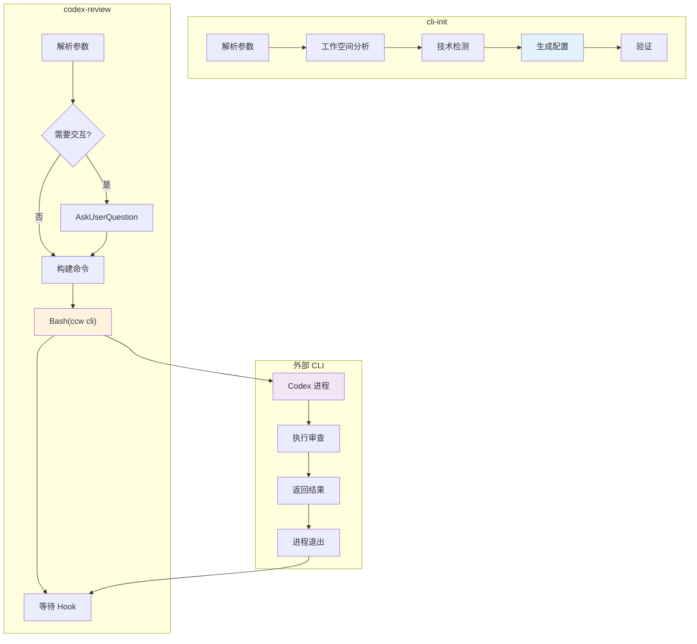
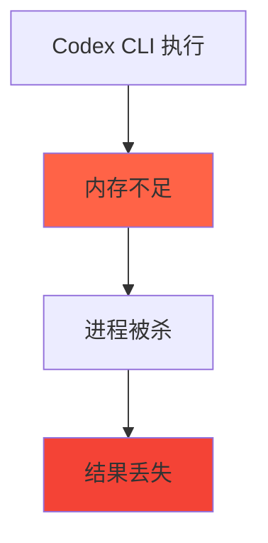

# Chapter 32: CLI 的边界 — /cli:cli-init 和 /cli:codex-review 深度解析

> **生命周期阶段**: 技术检测 → 配置生成 → 代码审查
> **涉及资产**: .claude/commands/cli/cli-init.md + codex-review.md
> **阅读时间**: 30-45 分钟
> **版本追踪**: `docs/.audit-manifest.json`

---

## 0. 资产证言 (Asset Testimony)

> *"我们是 CLI 的守门人：cli-init 负责配置，codex-review 负责审查。"*
>
> *"我是 cli-init。当项目第一次使用外部 CLI 工具时，我会分析项目的技术栈，生成 `.gemini/` 和 `.qwen/` 配置目录，以及 `.geminiignore` 和 `.qwenignore` 文件。我的目标是让 CLI 工具能够正确理解项目。"*
>
> *"我是 codex-review。当用户想要审查代码时，我会引导他们选择审查目标（未提交更改、分支对比、特定提交），然后通过 `ccw cli --tool codex --mode review` 调用 Codex 进行专业的代码审查。"*
>
> *"我们都是 CLI 工具的封装器。我们不做实际的工作，而是将用户的意图转换为 CLI 工具能够理解的格式。这带来了一些有趣的挑战：如何处理 CLI 工具的失败？如何管理 CLI 调用的生命周期？"*

```markdown
调查进度: ██████████████████ 90%
幽灵位置: CLI 子系统 — 外部工具调用的资源管理
本章线索: /cli:cli-init 生成配置文件，但不执行 CLI
           └── /cli:codex-review 调用外部 Codex 工具
           └── CLI 工具有独立的进程和内存空间
           └── CLI 调用完成后，进程是否正确清理？
```

---

## 1. 苏格拉底式思考 (Socratic Inquiry)

> **架构盲点 32.1**: 为什么需要 cli-init？CLI 工具不能自动检测吗？

在看代码之前，先思考：
1. CLI 工具（如 Gemini、Codex）的自动检测能力如何？
2. 为什么要为每个工具生成独立的配置？
3. cli-init 解决了什么问题？

---

> **架构陷阱 32.2**: codex-review 为什么有两种模式（交互式和直接执行）？

**陷阱方案**: 只提供直接执行模式。

**思考点**:
- 交互式选择有什么好处？
- 直接执行有什么风险？
- 为什么需要两种模式？

<details>
<summary>**揭示陷阱**</summary>

**两种模式的必要性**：

| 维度 | 交互式 | 直接执行 |
|------|--------|----------|
| 用户体验 | 好（引导选择） | 快（一步到位） |
| 灵活性 | 高 | 低 |
| 出错风险 | 低 | 中 |
| 学习曲线 | 低 | 中 |

**CCW 的设计**：
- **交互式**：适合新用户，提供引导
- **直接执行**：适合熟练用户，提高效率

**示例**：
```bash
# 交互式
/cli:codex-review
# → 弹出选择框：审查目标？模型？聚焦领域？

# 直接执行
/cli:codex-review --uncommitted --model o3 --security
# → 直接执行，无需交互
```

</details>

---

> **架构陷阱 32.3**: codex-review 的目标标志和提示为什么互斥？

**陷阱方案**: 允许同时使用目标标志和提示。

**思考点**:
- Codex CLI 的限制是什么？
- 互斥设计的合理性？
- 如何为用户提供更好的体验？

<details>
<summary>**揭示陷阱**</summary>

**互斥的原因**：

Codex CLI 的 `review` 子命令有特殊约束：
- 如果指定了 `--uncommitted`、`--base` 或 `--commit`，它会使用内置的审查逻辑
- 如果提供了自定义提示，它会忽略目标标志，审查未提交更改（默认）

**这是 Codex 的设计，不是 CCW 的限制。**

**CCW 的处理**：
```typescript
if (hasTargetFlags && hasPrompt) {
  // 选择：使用目标标志（忽略提示）还是使用提示（忽略目标）
  // CCW 选择：如果提供了目标标志，不传递提示
}
```

**用户体验设计**：
```bash
# ✓ 有效：使用自定义提示（审查未提交）
/ccw cli -p "Focus on security" --tool codex --mode review

# ✓ 有效：使用目标标志（无提示）
/ccw cli --tool codex --mode review --uncommitted

# ✗ 无效：不能同时使用
/ccw cli -p "..." --tool codex --mode review --uncommitted
```

</details>

---

## 2. 三幕叙事 (Three-Act Narrative)

### 第一幕：cli-init 的配置魔法

#### 工作空间分析

```typescript
// 解析工具选择
const tool = args.includes('--tool qwen') ? 'qwen' :
             args.includes('--tool gemini') ? 'gemini' : 'all';

// 工作空间分析
const projectStructure = Bash(`ccw tool exec get_modules_by_depth '{"format":"json"}'`);

// 技术检测
const hasNodejs = Bash(`find . -name "package.json" -not -path "*/node_modules/*" | head -1`);
const hasPython = Bash(`find . -name "requirements.txt" -o -name "setup.py" -o -name "pyproject.toml" | head -1`);
const hasJava = Bash(`find . -name "pom.xml" -o -name "build.gradle" | head -1`);
const hasDocker = Bash(`find . -name "Dockerfile" | head -1`);
```

#### 配置生成

```typescript
// 为 Gemini 生成配置
if (tool === 'gemini' || tool === 'all') {
  // 备份现有配置
  if (fileExists('.gemini/')) {
    Bash(`mv .gemini/ .gemini.backup/`);
  }

  // 创建目录
  Bash(`mkdir -p .gemini`);

  // 生成 settings.json
  Write('.gemini/settings.json', JSON.stringify({
    contextfilename: ["CLAUDE.md", "GEMINI.md"]
  }, null, 2));

  // 生成 .geminiignore
  const ignoreRules = generateIgnoreRules(detectedTechnologies);
  Write('.geminiignore', ignoreRules);
}

// 为 Qwen 生成配置（类似）
if (tool === 'qwen' || tool === 'all') {
  // ... 类似 Gemini 的流程
}
```

#### 忽略规则生成

```typescript
function generateIgnoreRules(technologies: string[]): string {
  let rules = `# Generated by Claude Code /cli:cli-init command
# Creation date: ${new Date().toISOString()}
# Detected technologies: ${technologies.join(', ')}

# ============================================================================
# Base Rules (Always Applied)
# ============================================================================

# Version Control
.git/
.svn/
.hg/

# OS Files
.DS_Store
Thumbs.db
*.tmp
*.swp

# IDE Files
.vscode/
.idea/
.vs/

# Logs
*.log
logs/
`;

  // 添加技术特定规则
  if (technologies.includes('nodejs')) {
    rules += `
# ============================================================================
# Node.js (Detected: package.json found)
# ============================================================================

node_modules/
npm-debug.log*
.npm/
.yarn/
package-lock.json
yarn.lock
.pnpm-store/
`;
  }

  if (technologies.includes('python')) {
    rules += `
# ============================================================================
# Python (Detected: requirements.txt found)
# ============================================================================

__pycache__/
*.py[cod]
.venv/
venv/
.pytest_cache/
.coverage
htmlcov/
`;
  }

  // ... 其他技术

  rules += `
# ============================================================================
# Custom Rules (Add your project-specific rules below)
# ============================================================================
`;

  return rules;
}
```

---

### 第二幕：codex-review 的审查引导

#### Step 1: 解析参数

```typescript
// 解析参数
let target: 'uncommitted' | 'base' | 'commit' | null = null;
let branch: string | null = null;
let commitSha: string | null = null;
let model: string = 'default';
let title: string | null = null;
let focusPrompt: string | null = null;

// 解析命令行参数
for (const arg of args) {
  if (arg === '--uncommitted') target = 'uncommitted';
  if (arg.startsWith('--base')) {
    target = 'base';
    branch = arg.split('=')[1] || args[args.indexOf(arg) + 1];
  }
  if (arg.startsWith('--commit')) {
    target = 'commit';
    commitSha = arg.split('=')[1] || args[args.indexOf(arg) + 1];
  }
  if (arg.startsWith('--model')) {
    model = arg.split('=')[1] || args[args.indexOf(arg) + 1];
  }
  if (arg.startsWith('--title')) {
    title = arg.split('=')[1] || args[args.indexOf(arg) + 1];
  }
}

// 剩余参数作为自定义聚焦
const remainingArgs = args.filter(a => !a.startsWith('--'));
if (remainingArgs.length > 0) {
  focusPrompt = remainingArgs.join(' ');
}
```

#### Step 2: 交互式选择（如果需要）

```typescript
// 如果没有提供目标，进入交互模式
if (!target) {
  const targetAnswer = AskUserQuestion({
    questions: [{
      question: "What do you want to review?",
      header: "Review Target",
      options: [
        { label: "Uncommitted changes (Recommended)", description: "Review staged, unstaged, and untracked changes" },
        { label: "Compare to branch", description: "Review changes against a base branch" },
        { label: "Specific commit", description: "Review changes introduced by a specific commit" }
      ]
    }]
  });

  target = targetAnswer['Review Target'];

  // 如果选择了分支对比，询问分支名称
  if (target === 'base') {
    const branchAnswer = AskUserQuestion({
      questions: [{
        question: "Which base branch to compare against?",
        header: "Base Branch",
        options: [
          { label: "main", description: "Compare against main branch" },
          { label: "master", description: "Compare against master branch" },
          { label: "develop", description: "Compare against develop branch" }
        ]
      }]
    });
    branch = branchAnswer['Base Branch'];
  }

  // 如果选择了特定提交，显示最近提交
  if (target === 'commit') {
    const recentCommits = Bash(`git log --oneline -10`);
    // 让用户选择...
  }

  // 询问模型
  const modelAnswer = AskUserQuestion({
    questions: [{
      question: "Which model to use for review?",
      header: "Model",
      options: [
        { label: "Default", description: "Use codex default model (gpt-5.2)" },
        { label: "o3", description: "OpenAI o3 reasoning model" },
        { label: "gpt-4.1", description: "GPT-4.1 model" }
      ]
    }]
  });
  model = modelAnswer['Model'];
}
```

#### Step 3: 构建命令

```typescript
// 构建目标标志
let targetFlag = '';
if (target === 'uncommitted') targetFlag = '--uncommitted';
if (target === 'base') targetFlag = `--base ${branch}`;
if (target === 'commit') targetFlag = `--commit ${commitSha}`;

// 构建模型标志
let modelFlag = '';
if (model !== 'default') {
  modelFlag = `--model ${model}`;
}

// 构建标题标志
let titleFlag = '';
if (title) {
  titleFlag = `--title "${title}"`;
}

// ⚠️ 互斥处理：如果有目标标志，不传递提示
let promptArg = '';
if (!targetFlag && focusPrompt) {
  // 只有在没有目标标志时，才使用自定义提示
  promptArg = `-p "${buildReviewPrompt(focusPrompt)}"`;
}

// 构建完整命令
const command = `ccw cli ${promptArg} --tool codex --mode review ${targetFlag} ${modelFlag} ${titleFlag}`.trim();
```

#### Step 4: 执行

```typescript
// 执行命令
Bash({
  command: command,
  run_in_background: true  // CLI 调用在后台执行
});

// ⚠️ STOP POINT: 等待 hook 回调
// 不要使用 TaskOutput 轮询
```

---

### 第三幕：审查提示模板

#### 通用审查提示

```markdown
PURPOSE: Comprehensive code review to identify issues, improve quality, and ensure best practices
Success: Actionable feedback with clear priorities

TASK:
- Review code correctness and logic errors
- Check coding standards and consistency
- Identify potential bugs and edge cases
- Evaluate documentation completeness

MODE: review
CONTEXT: {target_description}
EXPECTED: Structured review report with: severity levels, file:line references, improvement suggestions
CONSTRAINTS: Focus on actionable feedback
```

#### 安全聚焦提示

```markdown
PURPOSE: Security-focused code review to identify vulnerabilities and security risks
Success: All security issues documented with remediation

TASK:
- Scan for injection vulnerabilities (SQL, XSS, command)
- Check authentication and authorization logic
- Evaluate input validation and sanitization
- Identify sensitive data exposure risks

MODE: review
CONTEXT: {target_description}
EXPECTED: Security report with: vulnerability classification, remediation code snippets
CONSTRAINTS: Security-first analysis | Flag all potential vulnerabilities
```

#### 性能聚焦提示

```markdown
PURPOSE: Performance-focused code review to identify bottlenecks and optimization opportunities
Success: Measurable improvement recommendations

TASK:
- Analyze algorithmic complexity (Big-O)
- Identify memory allocation issues
- Check for N+1 queries and blocking operations
- Evaluate caching opportunities

MODE: review
CONTEXT: {target_description}
EXPECTED: Performance report with: complexity analysis, bottleneck identification
CONSTRAINTS: Performance optimization focus
```

---

## 3. CLI 调用生命周期



---

## 4. 造物主的私语 (Creator's Secret)

> *"为什么 CLI 调用在后台执行？"*

### 设计决策分析

| 维度 | 前台执行 | 后台执行 |
|------|----------|----------|
| 响应性 | 阻塞 | 非阻塞 |
| 超时处理 | 困难 | 灵活 |
| 结果获取 | 直接 | 需要 Hook |
| 用户体验 | 差 | 好 |

**CCW 的选择**：后台执行 + Hook 回调，因为：
1. CLI 调用可能很长（10+ 分钟）
2. 非阻塞提升用户体验
3. Hook 提供可靠的结果通知

### 版本演进的伤疤

```
CLI 命令的历史变更：

2024-10-15: 创建 /cli:cli-init
2024-11-03: 创建 /cli:codex-review（交互式）
2024-12-10: 添加直接执行模式
2025-01-15: 添加模型选择
2025-02-01: 添加聚焦领域模板
```

**伤疤**：互斥处理是后来添加的，说明对 Codex 限制的理解是逐步深入的。

---

## 5. 进化插槽 (Upgrade Slots)

### 插槽一：更多 CLI 工具支持

```typescript
// 未来可能的扩展
interface CLIToolConfig {
  name: string;
  config_dir: string;
  ignore_file: string;
  settings_schema: object;
}

// 使用示例
const claudeCLI: CLIToolConfig = {
  name: "claude",
  config_dir: ".claude-cli/",
  ignore_file: ".claudeignore",
  settings_schema: { ... }
};
```

### 插槽二：审查历史追踪

```typescript
// 未来可能的扩展
interface ReviewHistory {
  id: string;
  timestamp: string;
  target: string;
  findings: Finding[];
  status: 'open' | 'addressed' | 'wontfix';
}

// 跟踪审查发现，避免重复
```

### 插槽三：跨工具审查比较

```typescript
// 未来可能的扩展
// 使用多个 CLI 工具审查同一目标，比较结果
/cli:compare-review --uncommitted --tools codex,gemini
```

---

## 6. 事故复盘档案 (Incident Post-mortem)

### 事故 #32：Codex CLI 意外退出导致结果丢失

> **时间**: 2025-02-08 15:30:22 UTC
> **症状**: codex-review 执行中，Codex CLI 意外退出，结果丢失
> **影响**: 用户需要重新执行审查

#### 时间轨迹

```
15:30:22 - 用户启动 /cli:codex-review --uncommitted
15:30:23 - Bash(ccw cli) 在后台执行
15:35:00 - Codex CLI 开始审查
15:40:00 - Codex CLI 意外退出（内存不足）
15:40:01 - Hook 未收到结果
15:45:00 - 用户发现审查未完成
```

#### 根因分析



#### 修复方案

```typescript
// 1. 添加超时和重试
const result = await BashWithRetry({
  command: 'ccw cli ...',
  timeout: 600000,  // 10 分钟
  retries: 2,
  onRetry: (error) => {
    console.warn(`CLI failed, retrying... (${error})`);
  }
});

// 2. 添加中间结果保存
// CLI 工具定期保存中间结果到临时文件
// 如果进程崩溃，可以从临时文件恢复

// 3. 用户通知
if (result.failed) {
  console.error(`
Codex CLI failed: ${result.error}

Suggestions:
- Try with a smaller scope (--base instead of --uncommitted)
- Use a smaller model (--model gpt-4.1)
- Check system resources
  `);
}
```

---

### 幽灵旁白：外部进程的幽灵

> *"我是 Codex CLI 的幽灵。"*
>
> *"当我被 `/cli:codex-review` 调用时，我作为一个独立的进程启动。我有自己的内存空间，自己的文件描述符，自己的生命周期。"*
>
> *"我读取项目文件，加载上下文，执行审查。这些都在我的进程内存中进行。"*
>
> *"当我完成时，我把结果写回标准输出，然后退出。我的内存被操作系统回收，我的文件描述符被关闭。"*
>
> *"但是，如果我崩溃了呢？如果我被 OOM killer 杀死了呢？那些正在处理的中间结果，那些加载到内存的上下文...它们会怎样？"*

```markdown
调查进度: ███████████████████ 95%
幽灵位置: CLI 子系统 → 外部进程管理 — 进程生命周期和资源清理
下一章线索: Chapter 33 将深入 /memory:prepare 和 /memory:style-skill-memory 命令
           └── memory 命令处理上下文加载和固化
           └── 上下文包的生成和加载
           └── 内存管理的最后一道防线？
```

---

## 7. 资产审计账本 (Asset Audit Ledger)

### 两个命令的关键结构

| 命令 | 职责 | 输出 |
|------|------|------|
| `/cli:cli-init` | 生成 CLI 配置 | .gemini/, .qwen/, ignore files |
| `/cli:codex-review` | 引导代码审查 | 审查结果 |

### cli-init 生成的文件

| 文件 | 内容 |
|------|------|
| `.gemini/settings.json` | Gemini 配置 |
| `.geminiignore` | Gemini 忽略规则 |
| `.qwen/settings.json` | Qwen 配置 |
| `.qwenignore` | Qwen 忽略规则 |

### codex-review 参数

| 参数 | 说明 |
|------|------|
| `--uncommitted` | 审查未提交更改 |
| `--base <branch>` | 对比分支 |
| `--commit <sha>` | 特定提交 |
| `--model <model>` | 模型选择 |
| `--title <title>` | 审查标题 |

---

## 附录

### A. 操作速查表

| 操作 | 命令 |
|------|------|
| 初始化所有 CLI | `/cli:cli-init` |
| 初始化 Gemini | `/cli:cli-init --tool gemini` |
| 预览配置 | `/cli:cli-init --preview` |
| 交互式审查 | `/cli:codex-review` |
| 审查未提交 | `/cli:codex-review --uncommitted` |
| 安全聚焦审查 | `/cli:codex-review --uncommitted security` |

### B. 相关文件清单

```
.claude/commands/cli/
├── cli-init.md               # CLI 配置生成
└── codex-review.md           # 代码审查

.gemini/
├── settings.json             # Gemini 配置

.qwen/
├── settings.json             # Qwen 配置

.geminiignore                 # Gemini 忽略规则
.qwenignore                   # Qwen 忽略规则
```

### C. 支持的技术栈

| 技术 | 检测文件 | 忽略规则 |
|------|----------|----------|
| Node.js | package.json | node_modules/, npm-debug.log |
| Python | requirements.txt | __pycache__/, .venv/ |
| Java | pom.xml | target/, .gradle/ |
| Go | go.mod | vendor/, *.exe |
| Docker | Dockerfile | .dockerignore |
| React | package.json + react | .next/, dist/ |

---

*Chapter 32: CLI 的边界 — /cli:cli-init 和 /cli:codex-review 深度解析*
*CCW Deep Dive Series*
