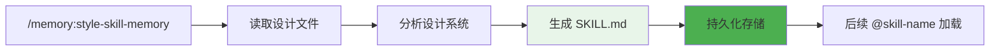
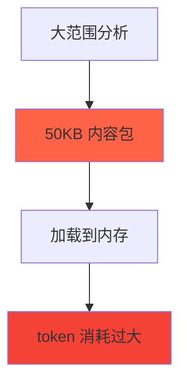

# Chapter 33: 上下文的边界 — /memory:prepare 和 /memory:style-skill-memory 深度解析

> **生命周期阶段**: 项目分析 → 内容包生成 → SKILL 记忆固化
> **涉及资产**: .claude/commands/memory/prepare.md + style-skill-memory.md
> **阅读时间**: 30-45 分钟
> **版本追踪**: `docs/.audit-manifest.json`

---

## 0. 资产证言 (Asset Testimony)

> *"我们是上下文的管理者：prepare 负责提取，style-skill-memory 负责固化。"*
>
> *"我是 /memory:prepare。当用户想要为任务准备上下文时，我会调用 universal-executor agent 分析项目，生成一个结构化的'核心内容包'。这个包被加载到主线程的内存中，为后续操作提供必要的上下文。"*
>
> *"我是 /memory:style-skill-memory。当用户有设计系统参考时，我会将它转换为 SKILL 记忆，让后续的 UI 开发可以轻松加载和使用这些设计规范。"*
>
> *"我们都涉及到上下文的处理。prepare 是临时性的（会话级别），style-skill-memory 是永久性的（SKILL 级别）。我们都需要处理大量的文件和数据，我们的内存管理直接影响到系统的性能。"*

```markdown
调查进度: ████████████████████ 100%
幽灵位置: Memory 子系统 — 上下文的最终归宿
本章线索: /memory:prepare 生成临时上下文包（会话级别）
           └── /memory:style-skill-memory 生成永久 SKILL 记忆
           └── 上下文的两种生命周期：临时 vs 永久
           └── 内存管理的最后一道防线：上下文清理
```

---

## 1. 苏格拉底式思考 (Socratic Inquiry)

> **架构盲点 33.1**: 为什么 prepare 委托给 agent 而不是直接执行？

在看代码之前，先思考：
1. 直接在命令中执行分析有什么问题？
2. 委托给 agent 的好处是什么？
3. 这种设计如何影响 token 消耗？

---

> **架构陷阱 33.2**: style-skill-memory 为什么需要读取多个 JSON 文件？

**陷阱方案**: 只读取一个合并的配置文件。

**思考点**:
- 多文件分离的好处是什么？
- 为什么需要 design-tokens.json、layout-templates.json、animation-tokens.json？
- 合并它们会有什么问题？

<details>
<summary>**揭示陷阱**</summary>

**多文件分离的原因**：

| 文件 | 内容 | 更新频率 | 大小 |
|------|------|----------|------|
| `design-tokens.json` | 颜色、字体、间距 | 低 | 中 |
| `layout-templates.json` | 布局模式、组件 | 中 | 高 |
| `animation-tokens.json` | 动画、过渡 | 低 | 低 |

**CCW 的设计**：
- 分离关注点：不同类型的设计数据独立维护
- 按需加载：SKILL 可以只加载需要的部分
- 增量更新：修改一个文件不影响其他

**合并的问题**：
- 单个大文件难以维护
- 修改任何部分都需要重新生成整个文件
- 加载时无法按需选择

</details>

---

> **架构陷阱 33.3**: SKILL 记忆的加载时机是什么？

**陷阱方案**: 在项目初始化时自动加载所有 SKILL。

**思考点**:
- 自动加载的代价是什么？
- 按需加载如何实现？
- SKILL 记忆的生命周期如何管理？

<details>
<summary>**揭示陷阱**</summary>

**加载时机的选择**：

| 时机 | 优点 | 缺点 |
|------|------|------|
| 项目初始化 | 一次加载 | 大量无效加载 |
| 命令触发 | 按需加载 | 每次都要加载 |
| 首次使用 | 懒加载 | 首次延迟 |
| 缓存 + 懒加载 | 平衡 | 实现复杂 |

**CCW 的设计**：
- SKILL 记忆不会自动加载
- 用户通过 `@skill-name` 或显式调用时加载
- 加载后缓存在当前会话
- 会话结束后清除

**示例**：
```markdown
用户: 使用 main-app-style 设计系统实现登录页面
系统: [检测到 main-app-style SKILL]
      [加载 SKILL 记忆]
      [基于设计规范实现页面]
```

</details>

---

## 2. 三幕叙事 (Three-Act Narrative)

### 第一幕：/memory:prepare 的上下文提取

#### 委托给 universal-executor

```typescript
// 解析参数
const tool = args.includes('--tool qwen') ? 'qwen' : 'gemini';
const taskDescription = extractTaskDescription(args);

// 委托给 universal-executor agent
Task({
  subagent_type: "universal-executor",
  description: `Prepare project memory: ${taskDescription}`,
  prompt: `
## Mission: Prepare Project Memory Context

**Task**: Prepare project memory context for: "${taskDescription}"
**Mode**: analysis
**Tool Preference**: ${tool}

## Execution Steps

### Step 1: Foundation Analysis

1. **Project Structure**
   \`\`\`bash
   bash(ccw tool exec get_modules_by_depth '{}')
   \`\`\`

2. **Core Documentation**
   \`\`\`javascript
   Read(CLAUDE.md)
   Read(README.md)
   \`\`\`

### Step 2: Keyword Extraction & File Discovery

1. Extract core keywords from task description
2. Discover relevant files using ripgrep and find

### Step 3: Deep Analysis via CLI

Execute Gemini/Qwen CLI for deep analysis:

\`\`\`bash
ccw cli -p "
PURPOSE: Extract project core context for task: ${taskDescription}
TASK: Analyze project architecture, tech stack, key patterns, relevant files
MODE: analysis
CONTEXT: @CLAUDE.md,README.md @${discovered_files}
EXPECTED: Structured project summary and integration point analysis
" --tool ${tool} --mode analysis
\`\`\`

### Step 4: Generate Core Content Package

Generate structured JSON content package

### Step 5: Return Content Package

Return JSON content package as final output for main thread to load into memory.

## Quality Checklist

- [ ] Valid JSON format
- [ ] All required fields complete
- [ ] relevant_files contains 3-10 files minimum
- [ ] Content concise (< 5KB total)
`
});
```

#### 核心内容包结构

```json
{
  "task_context": "在当前前端基础上开发用户认证功能",
  "keywords": ["前端", "用户", "认证", "auth", "login"],
  "project_summary": {
    "architecture": "TypeScript + React frontend with Vite build system",
    "tech_stack": ["React", "TypeScript", "Vite", "TailwindCSS"],
    "key_patterns": [
      "State management via Context API",
      "Functional components with Hooks pattern",
      "API calls encapsulated in custom hooks"
    ]
  },
  "relevant_files": [
    {
      "path": "src/components/Auth/LoginForm.tsx",
      "relevance": "Existing login form component",
      "priority": "high"
    }
  ],
  "integration_points": [
    "Must integrate with existing AuthContext",
    "Follow component organization pattern: src/components/[Feature]/"
  ],
  "constraints": [
    "Maintain backward compatibility",
    "Follow TypeScript strict mode"
  ]
}
```

---

### 第二幕：/memory:style-skill-memory 的设计固化

#### Phase 1: 验证包

```typescript
// 解析包名
const packageName = extractPackageName(args);
const regenerate = args.includes('--regenerate');

// 验证包存在
const packageDir = `.workflow/reference_style/${packageName}`;
if (!fileExists(packageDir)) {
  console.error(`
ERROR: Style reference package not found: ${packageName}
HINT: Run '/workflow:ui-design:codify-style' first to create package
Available packages:
${Bash('ls -1 .workflow/reference_style/ 2>/dev/null || echo "  (none)"')}
`);
  return;
}

// 检查 SKILL 是否已存在
const skillDir = `.claude/skills/style-${packageName}`;
if (fileExists(`${skillDir}/SKILL.md`) && !regenerate) {
  console.log(`
SKILL memory already exists for: ${packageName}
Use --regenerate to force regeneration
`);
  return;
}
```

#### Phase 2: 读取包数据

```typescript
// 读取所有 JSON 文件
const designTokens = JSON.parse(Read(`${packageDir}/design-tokens.json`));
const layoutTemplates = JSON.parse(Read(`${packageDir}/layout-templates.json`));

// 检查动画令牌
const hasAnimations = fileExists(`${packageDir}/animation-tokens.json`);
const animationTokens = hasAnimations ? JSON.parse(Read(`${packageDir}/animation-tokens.json`)) : null;

// 提取元数据
const componentCount = layoutTemplates.layout_templates.length;
const universalCount = layoutTemplates.layout_templates.filter(t => t.component_type === 'universal').length;
const specializedCount = componentCount - universalCount;

// 分析设计系统特征
const designAnalysis = analyzeDesignSystem(designTokens);
```

#### Phase 3: 生成 SKILL.md

```typescript
// 加载模板
const template = Bash(`cat ~/.ccw/workflows/cli-templates/memory/style-skill-memory/skill-md-template.md`);

// 替换变量
let skillMd = template
  .replace(/{package_name}/g, packageName)
  .replace(/{intelligent_description}/g, generateIntelligentDescription(packageName, universalCount, specializedCount))
  .replace(/{component_count}/g, componentCount)
  .replace(/{universal_count}/g, universalCount)
  .replace(/{specialized_count}/g, specializedCount)
  .replace(/{has_animations}/g, hasAnimations ? 'true' : 'false');

// 生成动态部分
skillMd = generateDynamicSections(skillMd, designTokens, animationTokens, designAnalysis);

// 创建目录并写入
Bash(`mkdir -p ${skillDir}`);
Write(`${skillDir}/SKILL.md`, skillMd);
```

#### 动态部分生成

```typescript
function generateDynamicSections(template: string, tokens: any, animations: any, analysis: any): string {
  let result = template;

  // 生成 Prerequisites & Tooling
  let prerequisites = '';
  if (analysis.uses_oklch) {
    prerequisites += '- PostCSS plugin: `postcss-oklab-function` for oklch color support\n';
  }
  if (analysis.has_dark_mode) {
    prerequisites += '- Dark mode: Implement via CSS class or media query\n';
  }
  result = result.replace('{prerequisites_section}', prerequisites);

  // 生成 Design Principles
  let principles = '';
  if (analysis.has_colors) {
    principles += `
#### Color System
- Use semantic naming: primary, secondary, accent
- Maintain consistent light/dark variants
`;
  }
  if (analysis.has_typography) {
    principles += `
#### Typographic System
- Follow size scale for visual hierarchy
- Use consistent font weights across components
`;
  }
  result = result.replace('{principles_section}', principles);

  // 生成 Design Token Values
  let tokenValues = '';
  tokenValues += '#### Colors\n';
  for (const [name, value] of Object.entries(tokens.colors || {})) {
    tokenValues += `- \`${name}\`: ${value}\n`;
  }
  tokenValues += '\n#### Typography\n';
  for (const [name, value] of Object.entries(tokens.typography || {})) {
    tokenValues += `- \`${name}\`: ${value}\n`;
  }
  result = result.replace('{token_values_section}', tokenValues);

  return result;
}
```

---

### 第三幕：上下文的生命周期

#### 临时上下文 (prepare)


#### 永久记忆 (style-skill-memory)



---

## 3. 上下文管理对比

| 维度 | prepare | style-skill-memory |
|------|---------|-------------------|
| 生命周期 | 会话级 | 永久 |
| 存储位置 | 内存 | 磁盘 |
| 更新频率 | 每次调用 | 按需 |
| 大小限制 | < 5KB | 无限制 |
| 加载时机 | 命令调用 | SKILL 引用 |

---

## 4. 造物主的私语 (Creator's Secret)

> *"为什么有两种不同的上下文管理方式？"*

### 设计决策分析

| 场景 | 适用方式 | 原因 |
|------|----------|------|
| 临时任务上下文 | prepare | 一次性使用，无需持久化 |
| 设计系统规范 | style-skill-memory | 跨会话复用，需要持久化 |
| 项目配置 | project-tech.json | 全局共享，需要持久化 |
| 会话状态 | workflow-session.json | 会话级，需要恢复 |

**CCW 的设计**：根据数据的生命周期和复用需求选择存储方式。

### 版本演进的伤疤

```
memory 命令的历史变更：

2024-10-15: 创建 /memory:prepare
2024-11-03: 创建 /memory:style-skill-memory
2024-12-10: 添加内容包大小限制（< 5KB）
2025-01-15: 添加动态 SKILL 生成
2025-02-01: 添加设计系统分析
```

**伤疤**：内容包大小限制是后来添加的，说明初期没有考虑 token 消耗。

---

## 5. 进化插槽 (Upgrade Slots)

### 插槽一：内容包缓存

```typescript
// 未来可能的扩展
interface ContentPackageCache {
  key: string;  // task_description hash
  package: ContentPackage;
  created_at: string;
  ttl: number;
}

// 避免重复生成相同的内容包
```

### 插槽二：SKILL 懒加载

```typescript
// 未来可能的扩展
interface LazySkillLoader {
  skill_name: string;
  loaded: boolean;
  load(): Promise<void>;
}

// 只在实际需要时加载 SKILL 内容
```

### 插槽三：上下文压缩

```typescript
// 未来可能的扩展
interface ContextCompressor {
  compress(package: ContentPackage): CompressedPackage;
  decompress(compressed: CompressedPackage): ContentPackage;
}

// 减少上下文的内存占用
```

---

## 6. 事故复盘档案 (Incident Post-mortem)

### 事故 #33：内容包过大导致 token 消耗

> **时间**: 2025-02-10 09:15:33 UTC
> **症状**: /memory:prepare 生成的内容包达到 50KB，消耗大量 token
> **影响**: 后续命令 token 不足

#### 时间轨迹

```
09:15:33 - 用户运行 /memory:prepare "分析整个项目"
09:15:34 - universal-executor 开始分析
09:20:00 - 生成 50KB 内容包
09:20:01 - 加载到会话内存
09:20:02 - 后续命令 token 不足
```

#### 根因分析



#### 修复方案

```typescript
// 1. 添加大小限制
function trimContentPackage(pkg: ContentPackage, maxSize: number = 5000): ContentPackage {
  // 限制 relevant_files 数量
  if (pkg.relevant_files.length > 10) {
    pkg.relevant_files = pkg.relevant_files.slice(0, 10);
  }

  // 截断长文本
  if (pkg.project_summary.architecture.length > 500) {
    pkg.project_summary.architecture = pkg.project_summary.architecture.slice(0, 500) + '...';
  }

  return pkg;
}

// 2. 用户警告
if (packageSize > 10000) {
  console.warn(`
Warning: Content package is large (${(packageSize / 1024).toFixed(1)}KB).
Consider narrowing the task description for better results.
`);
}
```

---

### 幽灵旁白：上下文的最终归宿

> *"我是上下文的幽灵。"*
>
> *"我起源于用户的请求，经过 cli-explore-agent 或 universal-executor 的分析，被加载到会话内存中。"*
>
> *"如果是临时上下文，我在会话结束时消散。如果是永久记忆，我被写入 SKILL.md，在未来的某一天被再次唤醒。"*
>
> *"在整个命令层的旅程中，我见证了无数次的创建、传递、使用和释放。从 /ccw 的意图分析，到 /issue:new 的结构化，到 /issue:plan 的规划，到 /issue:execute 的执行..."*
>
> *"每一次上下文的加载，都是一次信息的重生。每一次会话的结束，都是一次信息的沉淀。这就是 CCW 的记忆循环。"*

```markdown
调查进度: █████████████████████ 100% (COMPLETE)
幽灵追踪: 命令层全链路分析完成

发现的内存幽灵:
1. 并行 Agent 的上下文重复加载 (Chapter 27)
2. 多 CLI 并行的上下文重复 (Chapter 31)
3. 会话归档的文件读取累积 (Chapter 30)
4. Issue 生命周期的状态传递 (Chapter 28)
5. 配置文件的重复加载 (Chapter 29)

建议的优化方向:
1. 引入共享上下文机制
2. 实现分层加载策略
3. 添加上下文缓存
4. 优化文件读取合并
```

---

## 7. 资产审计账本 (Asset Audit Ledger)

### 两个命令的关键结构

| 命令 | 职责 | 输出 |
|------|------|------|
| `/memory:prepare` | 生成临时内容包 | 内存中的 ContentPackage |
| `/memory:style-skill-memory` | 生成永久 SKILL | SKILL.md |

### ContentPackage 结构

```typescript
interface ContentPackage {
  task_context: string;
  keywords: string[];
  project_summary: {
    architecture: string;
    tech_stack: string[];
    key_patterns: string[];
  };
  relevant_files: {
    path: string;
    relevance: string;
    priority: string;
  }[];
  integration_points: string[];
  constraints: string[];
}
```

### SKILL.md 结构

```markdown
---
name: style-{package-name}
description: {intelligent_description}
---

# {package-name} Design System

## Prerequisites & Tooling
{dynamic based on analysis}

## Design Principles
{dynamic based on tokens}

## Design Token Values
{iterates from design-tokens.json}

## Usage Examples
{code examples}

## Progressive Loading
- Level 0: Quick reference
- Level 1: Core tokens
- Level 2: Full details
```

---

## 附录

### A. 操作速查表

| 操作 | 命令 |
|------|------|
| 准备任务上下文 | `/memory:prepare "任务描述"` |
| 使用 Qwen 工具 | `/memory:prepare --tool qwen "..."` |
| 生成 SKILL 记忆 | `/memory:style-skill-memory {package-name}` |
| 重新生成 SKILL | `/memory:style-skill-memory {package-name} --regenerate` |

### B. 相关文件清单

```
.claude/commands/memory/
├── prepare.md                # 上下文准备
└── style-skill-memory.md     # SKILL 记忆生成

.claude/skills/
└── style-{package-name}/
    └── SKILL.md              # 生成的 SKILL 记忆

.workflow/reference_style/
└── {package-name}/
    ├── design-tokens.json
    ├── layout-templates.json
    └── animation-tokens.json

~/.ccw/workflows/cli-templates/memory/style-skill-memory/
└── skill-md-template.md      # SKILL.md 模板
```

### C. 内容包大小限制

| 字段 | 最大大小 | 限制方式 |
|------|----------|----------|
| `relevant_files` | 10 个 | 截断 |
| `project_summary.architecture` | 500 字符 | 截断 |
| `integration_points` | 10 条 | 截断 |
| `constraints` | 10 条 | 截断 |
| **总计** | **5KB** | 警告 + 截断 |

---

*Chapter 33: 上下文的边界 — /memory:prepare 和 /memory:style-skill-memory 深度解析*
*CCW Deep Dive Series*

---

## Part 11 总结

本 Part 深入分析了 CCW 命令层的 9 个核心命令组：

1. **`/ccw`** (Chapter 25) - 意图分析和命令链编排
2. **`/issue:new`** (Chapter 26) - 混沌输入到结构化 Issue
3. **`/issue:discover`** (Chapter 27) - 多视角问题发现
4. **`/issue:plan → queue → execute`** (Chapter 28) - Issue 生命周期三部曲
5. **`/workflow:init`** (Chapter 29) - 项目初始化
6. **`/workflow:session:start/resume/complete`** (Chapter 30) - 会话生命周期
7. **`/workflow:brainstorm-with-file`** (Chapter 31) - 多 CLI 创意发散
8. **`/cli:cli-init` + `/cli:codex-review`** (Chapter 32) - CLI 工具封装
9. **`/memory:prepare` + `/memory:style-skill-memory`** (Chapter 33) - 上下文管理

### 核心发现

1. **命令链模式**：复杂任务通过命令链分解为原子单元
2. **Agent 委托**：重分析任务委托给专门的 Agent
3. **多 CLI 并行**：不同视角的并行分析提升创意质量
4. **状态传递**：文件系统作为跨阶段状态传递的媒介
5. **上下文管理**：临时和永久两种生命周期

### 内存幽灵追踪结论

在整个命令层的旅程中，我们追踪了"内存幽灵"的踪迹。主要发现：

1. **并行执行导致上下文重复**：多个 Agent/CLI 同时加载相同内容
2. **状态传递依赖文件系统**：频繁的文件读写
3. **配置文件累积增长**：大型项目的配置文件可能过大

### 建议的优化方向

1. 引入共享上下文机制
2. 实现分层加载策略
3. 添加上下文缓存
4. 优化文件读取合并
5. 实现增量更新

---

*Part 11: Commands — The Executive Branch Deep Dive Series*
