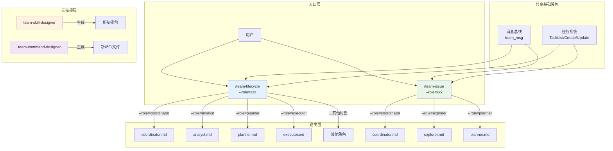
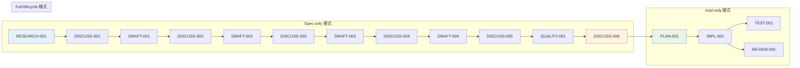
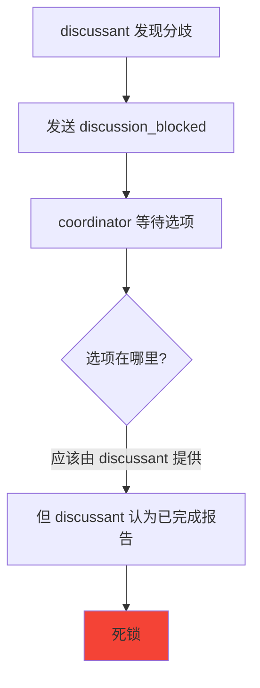

# Chapter 35: 团队的脉搏 — Team 系列命令深度解析

> **生命周期阶段**: 创建 (Create) → 协作 (Collaborate) → 设计 (Design)
> **涉及资产**: .claude/skills/team-lifecycle/ + team-issue/ + team-skill-designer/ + team-command-designer/
> **阅读时间**: 60-90 分钟
> **版本追踪**: `docs/.audit-manifest.json`

---

## 0. 资产证言 (Asset Testimony)

> *"我们是团队协作的四位一体：lifecycle 管理完整生命周期，issue 处理问题流水线，skill-designer 设计团队技能，command-designer 设计团队命令。"*
>
> *"我是 team-lifecycle。我是最复杂的团队技能，涵盖三种模式：spec-only（仅规格）、impl-only（仅实现）、full-lifecycle（完整生命周期）。我管理 8 个角色：coordinator、analyst、writer、discussant、planner、executor、tester、reviewer。我的任务链有 16 个节点，从 RESEARCH-001 到 DISCUSS-006，再到 PLAN-001 和 REVIEW-001。"*
>
> *"我是 team-issue。我专注于 Issue 处理流水线，有 6 个角色：coordinator、explorer、planner、reviewer、integrator、implementer。我支持三种模式：quick（快速）、full（完整）、batch（批量）。我的核心是 CP-2 Review-Fix Cycle 最多 2 轮。"*
>
> *"我是 team-skill-designer。我是元技能，用于生成新的团队技能包。我输出的不是单个文件，而是一个完整的 SKILL.md + roles/ 目录结构。我的创新点是：统一入口 + --role 参数路由。"*
>
> *"我是 team-command-designer。我也是元技能，用于生成单个团队命令 .md 文件。我遵循 8 个基础设施模式和 10 个协作模式。我的 5 阶段执行流程确保生成的命令符合规范。"*

```markdown
调查进度: ███████████████████ 100%
核心位置: Team Skills 子系统 — 多角色协作的编排与生成
本章线索: team-lifecycle 统一入口路由到 8 个角色
           └── team-issue 专注 Issue 处理流水线
           └── team-skill-designer 生成新的技能包
           └── team-command-designer 生成单个命令文件
           └── 四者的设计模式和协作机制
```

---

## 1. 场景：存在的烦恼 (The Problem Without It)

### 痛点一：单兵作战的局限性

当开发者独自面对复杂任务时：

```
问题分析
├── 认知负荷过高 → 一个人要处理所有决策
├── 视角单一 → 缺乏多维度审视
├── 上下文切换成本 → 频繁在分析/实现/测试间切换
└── 质量控制薄弱 → 自己审查自己的代码

传统工作流
开发者 → 分析 → 设计 → 实现 → 测试 → 部署
   ↑                                        │
   └──────────────── 返工循环 ←─────────────┘
```

### 痛点二：协作方式的混乱

即使有多个 Agent，协作也容易出问题：

```javascript
// 糟糕的协作方式
// 每个角色独立调用，没有统一入口
Skill(skill="team:plan", args="...")     // 规划
Skill(skill="team:execute", args="...")  // 实现
Skill(skill="team:test", args="...")     // 测试

// 问题：
// 1. 谁负责协调？
// 2. 状态如何传递？
// 3. 失败时谁来处理？
```

### 痛点三：扩展性差

添加新角色时的问题：

```
传统方式
├── 修改 coordinate.md → 添加 spawn 逻辑
├── 创建新命令文件 → 复制粘贴模式代码
├── 更新消息类型 → 手动同步
└── 测试集成 → 容易遗漏

问题：
1. 重复代码多
2. 模式不一致
3. 维护成本高
```

---

## 2. 档案：能量流转图谱 (Energy Flow Map)

### Team Skills 整体架构



### team-lifecycle 三模式流程



### team-issue 三模式流程

```mermaid
graph TB
    subgraph "Quick 模式 (1-2 simple issues)"
        QE[EXPLORE-001] --> QS[SOLVE-001]
        QS --> QM[MARSHAL-001]
        QM --> QB[BUILD-001]
    end

    subgraph "Full 模式 (complex issues)"
        FE[EXPLORE-001] --> FS[SOLVE-001]
        FS --> FA[AUDIT-001]
        FA --> |approved| FM[MARSHAL-001]
        FA --> |rejected| FS2[SOLVE-fix]
        FS2 --> FA2[AUDIT-002]
        FA2 --> |max 2 rounds| FM
        FM --> FB[BUILD-001..N]
    end

    subgraph "Batch 模式 (5-100 issues)"
        BE[EXPLORE-001..N<br/>batch≤5] --> BS[SOLVE-001..N<br/>batch≤3]
        BS --> BA[AUDIT-001<br/>batch review]
        BA --> BM[MARSHAL-001]
        BM --> BB[BUILD-001..M<br/>DAG parallel]
    end

    style QE fill:#E3F2FD
    style FA fill:#FFF3E0
    style BE fill:#F3E5F5
```



---

## 3. 社交：谁在召唤它 (Who Summons It)

### 命令关系网络

| 命令 | 被谁调用 | 调用谁 | 协作模式 |
|------|----------|--------|----------|
| `team-lifecycle` | 用户直接调用 | 8 个 worker 角色 | CP-4 Consensus Gate |
| `team-issue` | 用户直接调用 | 6 个 worker 角色 | CP-2 Review-Fix Cycle |
| `team-skill-designer` | 用户创建新技能 | 内部 5 阶段流程 | CP-1 Linear Pipeline |
| `team-command-designer` | 用户创建新命令 | 内部 5 阶段流程 | CP-1 Linear Pipeline |

### 角色通信协议

```javascript
// team-lifecycle 消息类型
const LIFECYCLE_MESSAGES = {
  // Spec 阶段
  "research_ready":    { from: "analyst",    to: "coordinator" },
  "discussion_ready":  { from: "discussant", to: "coordinator" },
  "draft_ready":       { from: "writer",     to: "coordinator" },
  "quality_result":    { from: "reviewer",   to: "coordinator" },

  // Impl 阶段
  "plan_ready":        { from: "planner",    to: "coordinator" },
  "impl_complete":     { from: "executor",   to: "coordinator" },
  "test_result":       { from: "tester",     to: "coordinator" },
  "review_result":     { from: "reviewer",   to: "coordinator" },

  // 通用
  "fix_required":      { from: "any",        to: "coordinator" },
  "error":             { from: "any",        to: "coordinator" }
}

// team-issue 消息类型
const ISSUE_MESSAGES = {
  "context_ready":     { from: "explorer",   to: "coordinator" },
  "solution_ready":    { from: "planner",    to: "coordinator" },
  "approved":          { from: "reviewer",   to: "coordinator" },
  "rejected":          { from: "reviewer",   to: "coordinator" },
  "queue_ready":       { from: "integrator", to: "coordinator" },
  "impl_complete":     { from: "implementer",to: "coordinator" },
  "conflict_found":    { from: "integrator", to: "coordinator" }
}
```

### Coordinator 决策表

| 收到消息 | 动作 |
|----------|------|
| `research_ready` | 用户确认检查点 → 完成 RESEARCH |
| `discussion_ready` | 判断是否需要修订 → 解锁下一 DRAFT |
| `discussion_blocked` | 介入 → AskUserQuestion → 手动解锁 |
| `draft_ready` | 记录日志 → 完成 DRAFT |
| `quality_result (PASS ≥80%)` | 完成 QUALITY → 解锁 DISCUSS-006 |
| `quality_result (FAIL <60%)` | 创建 DRAFT-fix 任务 |
| `plan_ready` | 审批/要求修订 → 发送 plan_approved/plan_revision |
| `impl_complete` | 解锁 TEST + REVIEW（并行） |
| `test_result < 95% + iterations > 5` | 升级给用户 |
| `review_result (has critical)` | 创建 IMPL-fix 任务 |
| `approved` | 解锁 MARSHAL |
| `rejected` | 创建 SOLVE-fix（最多 2 轮） |
| `conflict_found` | AskUserQuestion 选择解决策略 |
| `impl_failed` | CP-5 升级：重试/跳过/中止 |

---

## 4. 破译：源代码里的小心机 (Source Code Secrets)

### 核心设计一：统一入口 + --role 路由

**Before（命令方式）**：
```
.claude/commands/team/
├── coordinate.md     →  /team:coordinate
├── plan.md           →  /team:plan
├── execute.md        →  /team:execute
├── test.md           →  /team:test
└── review.md         →  /team:review
```
→ 5 个独立命令文件，5 个独立 skill 路径

**After（统一技能方式）**：
```
.claude/skills/team-{name}/
├── SKILL.md          →  Skill(skill="team-{name}", args="--role=xxx")
└── roles/
    ├── coordinator/role.md
    ├── planner/role.md
    └── ...
```
→ 1 个 skill 入口，--role 参数路由到具体角色

**路由实现**：

```javascript
// SKILL.md 核心逻辑
const args = "$ARGUMENTS"
const roleMatch = args.match(/--role[=\s]+(\w+)/)

if (!roleMatch) {
  throw new Error("Missing --role argument. Available roles: coordinator, analyst, writer, ...")
}

const role = roleMatch[1]
const roleFile = `roles/${role}.md`  // 或 roles/${role}/role.md

// 读取并执行角色特定逻辑
Read(roleFile)
// → 执行该文件中定义的 5 阶段流程
```

### 核心设计二：共享基础设施

**一次定义，所有角色继承**：

```javascript
// SKILL.md 定义，所有 roles/*.md 自动获得

// 1. 消息总线
mcp__ccw-tools__team_msg({
  operation: "log",
  team: teamName,
  from: role,
  to: "coordinator",
  type: "<type>",
  summary: "<summary>"
})

// 2. CLI 回退
Bash(`ccw team log --team "${teamName}" --from "${role}" --to "coordinator" --type "<type>" --summary "<summary>" --json`)

// 3. 任务生命周期
const tasks = TaskList()
const myTasks = tasks.filter(t =>
  t.subject.startsWith(`${PREFIX}-`) &&
  t.owner === role &&
  t.status === 'pending' &&
  t.blockedBy.length === 0
)
if (myTasks.length === 0) return // idle
const task = TaskGet({ taskId: myTasks[0].id })
TaskUpdate({ taskId: task.id, status: 'in_progress' })
// ... 执行工作 ...
TaskUpdate({ taskId: task.id, status: 'completed' })
```

### 核心设计三：角色隔离规则

**team-issue 的严格隔离**：

| 规则 | Coordinator | Worker |
|------|-------------|--------|
| 允许 | 需求澄清、创建任务、监控进度 | 处理自己前缀的任务、SendMessage 给 coordinator |
| 禁止 | 直接编写代码、绕过 worker 完成任务 | 处理其他角色任务、为其他角色创建任务、直接与其他 worker 通信 |

**输出标识（强制）**：

```javascript
// 所有角色的输出必须带标识
SendMessage({
  content: `## [${role}] 任务完成报告...`,
  summary: `[${role}] 完成了 xxx`
})

mcp__ccw-tools__team_msg({
  summary: `[${role}] 消息摘要`
})
```

### 核心设计四：批量角色生成

**team-skill-designer 的批量收集**：

```javascript
// Phase 1: 一次性收集所有角色定义
const teamConfig = {
  name: "my-team",
  roles: [
    { name: "coordinator", prefix: null, responsibility: "编排" },
    { name: "analyzer", prefix: "ANALYZE", responsibility: "分析" },
    { name: "builder", prefix: "BUILD", responsibility: "构建" },
    // ... 一次性收集所有
  ]
}

// Phase 3: 批量生成
teamConfig.roles.forEach(role => {
  generateRoleFile(role)
})
```

**vs team-command-designer 的逐个生成**：

```javascript
// 每次只处理一个角色
const roleConfig = {
  name: "my-role",
  prefix: "MY",
  responsibility: "..."
}
generateCommandFile(roleConfig)
```

### 核心设计五：任务链依赖管理

**team-lifecycle 的 Spec 任务链**：

```javascript
// RESEARCH-001 → DISCUSS-001 → DRAFT-001 → ... → DISCUSS-006

const researchId = TaskCreate({ subject: "RESEARCH-001: ...", owner: "analyst" })

const discuss1Id = TaskCreate({
  subject: "DISCUSS-001: ...",
  owner: "discussant",
  addBlockedBy: [researchId]  // 依赖 RESEARCH
})

const draft1Id = TaskCreate({
  subject: "DRAFT-001: ...",
  owner: "writer",
  addBlockedBy: [discuss1Id]  // 依赖 DISCUSS
})

// ... 16 个任务的依赖链
```

**team-issue 的 Batch 模式**：

```javascript
// 滚动窗口并行处理
const exploreBatches = chunkArray(issueIds, 5)  // 每批 ≤5 并行
let prevBatchLastId = null

for (const [batchIdx, batch] of exploreBatches.entries()) {
  const batchTaskIds = []
  for (const issueId of batch) {
    const id = TaskCreate({
      subject: `EXPLORE-${...}: Context for ${issueId}`,
      owner: "explorer",
      // 只阻塞上一批的最后一个任务（同批内并行）
      addBlockedBy: prevBatchLastId ? [prevBatchLastId] : []
    })
    batchTaskIds.push(id)
  }
  prevBatchLastId = batchTaskIds[batchTaskIds.length - 1]
}
```

---

## 5. 进化：改装插槽 (Upgrade Slots)

### 插槽一：动态角色加载

```typescript
// 未来可能的扩展：从配置文件加载角色定义
interface TeamConfig {
  name: string;
  roles: RoleDefinition[];
  pipeline: TaskChainDefinition;
}

// 从 JSON 配置生成完整团队
const config = JSON.parse(Read('.team/config.json'));
TeamFactory.create(config);
```

### 插槽二：跨团队协作

```typescript
// 未来可能的扩展：多个团队之间的协作
interface CrossTeamMessage {
  from_team: string;
  from_role: string;
  to_team: string;
  to_role: string;
  type: string;
  payload: any;
}

// team-lifecycle 可以调用 team-issue 处理发现的问题
TeamBridge.send({
  from_team: "lifecycle",
  from_role: "reviewer",
  to_team: "issue",
  to_role: "coordinator",
  type: "issue_found",
  payload: { description: "代码审查发现问题" }
});
```

### 插槽三：自适应模式切换

```typescript
// 未来可能的扩展：根据任务特征自动切换模式
function autoSelectMode(taskDescription: string): 'quick' | 'full' | 'batch' {
  const complexity = assessComplexity(taskDescription);
  const scope = assessScope(taskDescription);

  if (complexity === 'low' && scope === 'small') return 'quick';
  if (complexity === 'high' || scope === 'large') return 'full';
  if (scope === 'batch') return 'batch';

  return 'quick'; // 默认
}
```

### 插槽四：学习型角色

```typescript
// 未来可能的扩展：角色从历史执行中学习
interface RoleMemory {
  role_name: string;
  successful_patterns: Pattern[];
  failure_patterns: Pattern[];
  optimization_hints: string[];
}

// 角色加载时读取历史学习
const memory = LoadRoleMemory(role);
if (memory.optimization_hints.length > 0) {
  console.log(`[优化提示] ${memory.optimization_hints.join(', ')}`);
}
```

---

## 6. 事故复盘档案 (Incident Post-mortem)

### 事故 #35：讨论死锁

> **时间**: 2025-02-10 14:30:00 UTC
> **症状**: team-lifecycle 的 discussant 报告 `discussion_blocked`，但没有提供解决方案
> **影响**: Spec 流程卡在 DISCUSS-003

#### 时间轨迹

```
14:30:00 - discussant 发送 discussion_ready (DISCUSS-003)
14:30:05 - coordinator 读取讨论结果，发现存在分歧
14:30:06 - discussant 发送 discussion_blocked
14:30:07 - coordinator 等待 discussant 提供选项
14:30:10 - discussant 无响应（因为它认为已经报告了）
14:35:00 - 用户发现流程卡住
```

#### 根因分析



#### 修复方案

```javascript
// 1. 明确 discussion_blocked 消息格式
// 修复前
SendMessage({
  type: "discussion_blocked",
  content: "讨论存在分歧"
})

// 修复后
SendMessage({
  type: "discussion_blocked",
  content: `## [discussant] 讨论无法共识

**分歧点**: ${disagreement}
**选项**:
1. ${option1} - ${desc1}
2. ${option2} - ${desc2}

请 coordinator 协调决策。`,
  data: {
    reason: disagreement,
    options: [
      { label: option1, description: desc1 },
      { label: option2, description: desc2 }
    ]
  }
})

// 2. coordinator 收到后立即 AskUserQuestion
if (msgType === 'discussion_blocked') {
  AskUserQuestion({
    questions: [{
      question: `讨论 ${msg.ref} 遇到分歧: ${msg.data.reason}`,
      options: msg.data.options
    }]
  })
}
```

---

### 事故 #35B：审查循环无限

> **时间**: 2025-02-12 10:15:00 UTC
> **症状**: team-issue 的 AUDIT 任务一直被拒绝，超过 2 轮后继续创建新 SOLVE-fix
> **影响**: Issue 处理流水线卡住

#### 根因分析

```javascript
// 问题代码：auditRound 没有正确递增
let auditRound = 0
const MAX_AUDIT_ROUNDS = 2

// 错误：每次收到 rejected 都创建 SOLVE-fix
// 应该是：只有 auditRound < MAX_AUDIT_ROUNDS 时才创建
if (msg.type === 'rejected') {
  TaskCreate({
    subject: `SOLVE-fix-${auditRound}: ...`,
    owner: "planner"
  })
  // 缺少 auditRound++
}
```

#### 修复方案

```javascript
// 正确的循环控制
if (msg.type === 'rejected' && auditRound < MAX_AUDIT_ROUNDS) {
  auditRound++  // 先递增
  TaskCreate({
    subject: `SOLVE-fix-${auditRound}: Revise solution (round ${auditRound}/${MAX_AUDIT_ROUNDS})`,
    owner: "planner"
  })
} else if (auditRound >= MAX_AUDIT_ROUNDS) {
  // 升级给用户
  AskUserQuestion({
    questions: [{
      question: `方案已被拒绝 ${MAX_AUDIT_ROUNDS} 次。如何处理？`,
      options: [
        { label: "强制批准", description: "跳过审查，直接执行" },
        { label: "手动修复", description: "用户自己修复方案" },
        { label: "跳过 Issue", description: "跳过此 issue，继续处理其他" }
      ]
    }]
  })
}
```

---

## 7. 资产审计账本 (Asset Audit Ledger)

### 四个技能的关键结构

| 技能 | 职责 | 角色 | 模式 |
|------|------|------|------|
| `team-lifecycle` | 完整生命周期管理 | 8 个 | spec-only, impl-only, full-lifecycle |
| `team-issue` | Issue 协作解决 | 6 个 | quick, full, batch |
| `team-skill-designer` | 生成团队技能包 | N/A | N/A |
| `team-command-designer` | 生成单个命令文件 | N/A | N/A |

### team-lifecycle 目录结构

```
.claude/skills/team-lifecycle/
├── SKILL.md                    # 统一入口 + 角色路由
├── roles/
│   ├── coordinator.md          # 编排者
│   ├── analyst.md              # 分析师 (RESEARCH-*)
│   ├── writer.md               # 撰写者 (DRAFT-*)
│   ├── discussant.md           # 讨论者 (DISCUSS-*)
│   ├── planner.md              # 规划者 (PLAN-*)
│   ├── executor.md             # 执行者 (IMPL-*)
│   ├── tester.md               # 测试者 (TEST-*)
│   └── reviewer.md             # 审查者 (REVIEW-*, QUALITY-*)
├── specs/
│   ├── document-standards.md   # 文档标准
│   └── quality-gates.md        # 质量门禁
└── templates/
    ├── product-brief.md        # Product Brief 模板
    ├── requirements-prd.md     # Requirements 模板
    ├── architecture-doc.md     # Architecture 模板
    └── epics-template.md       # Epics 模板
```

### team-issue 目录结构

```
.claude/skills/team-issue/
├── SKILL.md                    # 统一入口 + 角色路由
├── roles/
│   ├── coordinator.md          # 编排者
│   ├── explorer.md             # 探索者 (EXPLORE-*)
│   ├── planner.md              # 规划者 (SOLVE-*)
│   ├── reviewer.md             # 审查者 (AUDIT-*)
│   ├── integrator.md           # 整合者 (MARSHAL-*)
│   └── implementer.md          # 实现者 (BUILD-*)
└── specs/
    └── team-config.json        # 团队配置
```

### Session 目录结构

```
.workflow/.team/TLS-{slug}-{YYYY-MM-DD}/
├── team-session.json           # 会话状态
├── spec/                       # 规格产物
│   ├── spec-config.json
│   ├── discovery-context.json
│   ├── product-brief.md
│   ├── requirements/
│   ├── architecture/
│   └── epics/
├── discussions/                # 讨论记录
│   └── discuss-001..006.md
└── plan/                       # 实现计划
    ├── plan.json
    └── .task/

.workflow/.team-plan/issue/
├── issue-{id}/
│   ├── solution.jsonl          # 解决方案
│   └── queue.json              # 执行队列
```

---

## 附录

### A. 操作速查表

| 操作 | 命令 |
|------|------|
| 启动完整生命周期 | `Skill(skill="team-lifecycle", args="--role=coordinator <需求>")` |
| 仅生成规格 | `Skill(skill="team-lifecycle", args="--role=coordinator --mode=spec-only <需求>")` |
| 仅实现 | `Skill(skill="team-lifecycle", args="--role=coordinator --mode=impl-only <需求>")` |
| 处理 Issue | `Skill(skill="team-issue", args="--role=coordinator GH-123")` |
| 快速模式 | `Skill(skill="team-issue", args="--role=coordinator --mode=quick GH-123")` |
| 批量模式 | `Skill(skill="team-issue", args="--role=coordinator --mode=batch GH-123,124,125")` |
| 设计新技能 | `Skill(skill="team-skill-designer")` |
| 设计新命令 | `Skill(skill="team-command-designer")` |

### B. 角色前缀速查

| 技能 | 角色 | 前缀 |
|------|------|------|
| team-lifecycle | analyst | RESEARCH-* |
| team-lifecycle | writer | DRAFT-* |
| team-lifecycle | discussant | DISCUSS-* |
| team-lifecycle | planner | PLAN-* |
| team-lifecycle | executor | IMPL-* |
| team-lifecycle | tester | TEST-* |
| team-lifecycle | reviewer | REVIEW-*, QUALITY-* |
| team-issue | explorer | EXPLORE-* |
| team-issue | planner | SOLVE-* |
| team-issue | reviewer | AUDIT-* |
| team-issue | integrator | MARSHAL-* |
| team-issue | implementer | BUILD-* |

### C. 协作模式速查

| 模式 | 描述 | 使用场景 |
|------|------|----------|
| CP-1 Linear Pipeline | 线性流水线 | 标准功能开发 |
| CP-2 Review-Fix Cycle | 审查修复循环 | 代码审查需要修改 |
| CP-3 Parallel Fan-out | 并行扇出扇入 | 多角度分析 |
| CP-4 Consensus Gate | 共识门控 | 关键决策（架构、安全） |
| CP-5 Escalation Chain | 逐级升级 | Agent 卡住/自修复失败 |
| CP-6 Incremental Delivery | 增量交付 | 大型功能（多文件） |
| CP-7 Swarming | 群策攻关 | 阻塞问题 |
| CP-8 Consulting | 咨询顾问 | 需要领域专业知识 |
| CP-9 Dual-Track | 双轨并行 | 设计+实现并行 |
| CP-10 Post-Mortem | 复盘回顾 | 完成后学习 |

### D. 消息类型速查

| 类型 | 方向 | 触发 |
|------|------|------|
| `*_ready` | worker → coordinator | 工作产物就绪 |
| `*_complete` | worker → coordinator | 阶段完成 |
| `*_progress` | worker → coordinator | 进度更新 |
| `*_result` | tester/reviewer → coordinator | 结果报告 |
| `fix_required` | any → coordinator | 发现问题需要修复 |
| `approved` | reviewer → coordinator | 审批通过 |
| `rejected` | reviewer → coordinator | 审批拒绝 |
| `error` | any → coordinator | 阻塞性错误 |
| `shutdown` | coordinator → all | 团队关闭 |

---

*Chapter 35: 团队的脉搏 — Team 系列命令深度解析*
*CCW Deep Dive Series*
