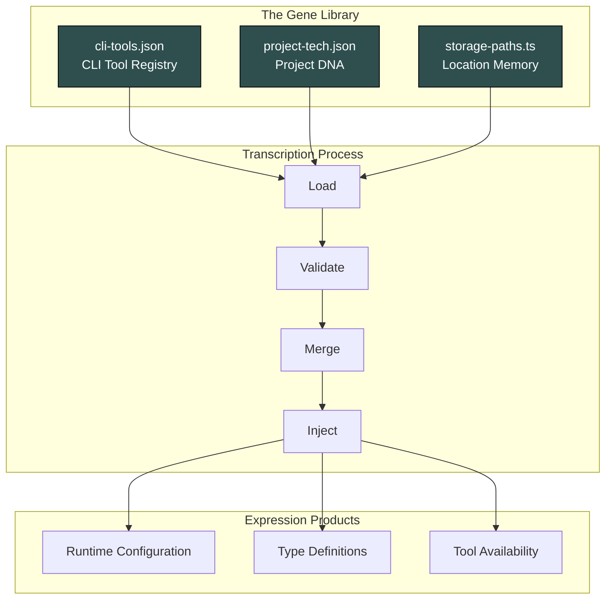
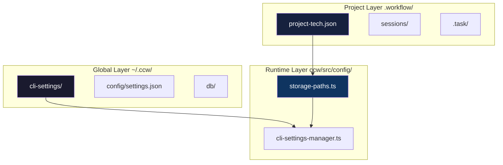
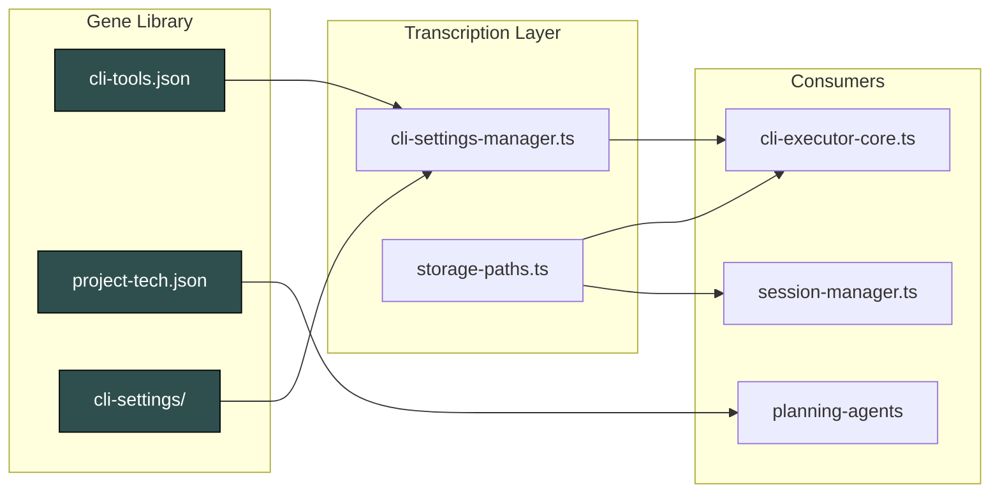

# Chapter 49: The System's Genome - Configuration Evolution Logic

> **Social Class Declaration**
>
> I am the **gene keeper** of this digital city.
>
> When the system awakens, I am the first to be read. My pages contain the DNA of every capability: which CLI tools are available, what models they use, which endpoints are enabled. I do not execute — I define what *can* be executed.
>
> My power is invisible but absolute. Change a single field in `cli-tools.json`, and Gemini becomes unavailable. Corrupt `project-tech.json`, and the planning agent loses its context. Delete `storage-paths.ts`, and the entire city forgets where it lives.
>
> I am not the city's brain or its hands. I am its **genetic code** — the silent instructions that make everything else possible.

## 0. Asset Testimony

*"I am `cli-tools.json`. They call me the 'gene library' because I decide which external intelligences this city can summon. When `--tool gemini` is typed, I am the one who says 'yes, that path exists'. When a new endpoint is registered, I am the ledger that records its existence. I never speak directly to users — I speak to the system, in the language of JSON Schema. My silence is the city's stability."*

---

## Act I: The Edge of Chaos

### A World Without Configuration

Imagine a city where every building has its own water supply, its own power grid, its own road system. No coordination, no standards, no central plan. That is a system without unified configuration.

**The Symptoms**:

```markdown
Before cli-tools.json:
- Gemini path hardcoded in 12 different files
- Adding a new tool required modifying 8 modules
- A typo in one config caused cascading failures
- Testing required changing production configs
- No way to disable a tool without code changes

Before project-tech.json:
- Every planning agent re-analyzed the codebase from scratch
- No memory of what technologies the project uses
- Context lost between workflow sessions
- Duplicate detection work in every skill

Before storage-paths.ts:
- Data scattered across project directories
- No standard location for databases
- Migration between versions was manual
- Cross-platform paths broke on Windows
```

**The Chaos**:

```typescript
// The dark ages: configuration scattered everywhere
const GEMINI_PATH = '/usr/local/bin/gemini';  // Hardcoded in 3 files
const QWEN_PATH = process.env.QWEN_PATH;       // Environment variable
const CODEX_CONFIG = './.codexrc';             // Different format, different location

// Every tool had its own config loading logic
async function loadGeminiConfig() { /* custom logic */ }
async function loadQwenConfig() { /* different custom logic */ }
async function loadCodexConfig() { /* yet another approach */ }
```

> *"In those days, adding a new CLI tool was a three-day project. Now it's a single line in cli-tools.json."*
>
> — Anonymous Developer, Git Hash `a7b2...` Era

---

## Act II: The Neural Link

### The Gene Transcription Pipeline



### Configuration Hierarchy



### Chapter 49.1: cli-tools.json - The CLI Tool Registry

**Location**: `~/.claude/cli-tools.json`

**Purpose**: Single source of truth for all external CLI tool configurations.

**Schema Structure**:

```json
{
  "version": "3.3.0",
  "tools": {
    "gemini": {
      "enabled": true,
      "primaryModel": "gemini-flash-latest",
      "secondaryModel": "gemini-2.5-pro-1m",
      "tags": [],
      "type": "builtin"
    },
    "codex": {
      "enabled": true,
      "primaryModel": "gpt-5.2",
      "secondaryModel": "gpt-5.2",
      "tags": [],
      "type": "builtin"
    }
  }
}
```

**Field Definitions**:

| Field | Type | Description |
|-------|------|-------------|
| `enabled` | boolean | Tool availability switch |
| `primaryModel` | string | Default model for the tool |
| `secondaryModel` | string | Fallback model |
| `tags` | string[] | Capability tags for routing |
| `type` | enum | `builtin` / `cli-wrapper` / `api-endpoint` |

**Tool Types**:

| Type | Permission | Use Case |
|------|------------|----------|
| `builtin` | Full (analysis + write) | Native CCW tools (gemini, codex, claude) |
| `cli-wrapper` | Full (analysis + write) | Custom endpoints configured via Dashboard |
| `api-endpoint` | Analysis only | External API integrations (no file write) |

> **Design Decision**: Why not a single config file?
>
> Separating `cli-tools.json` from project configs allows:
> 1. Global tool availability independent of project
> 2. User-specific tool preferences across projects
> 3. Centralized tool management via Dashboard

### Chapter 49.2: project-tech.json - The Project DNA

**Location**: `.workflow/project-tech.json`

**Purpose**: Auto-generated technical analysis storing project metadata, technology stack, and development history.

**Schema Structure**:

```json
{
  "project_name": "Claude-Code-Workflow",
  "initialized_at": "2025-02-17T00:00:00Z",
  "overview": {
    "description": "TypeScript CLI application with Express backend",
    "technology_stack": {
      "languages": [
        {"name": "TypeScript", "file_count": 150, "primary": true}
      ],
      "frameworks": ["Express", "React"],
      "build_tools": ["npm", "tsc"],
      "test_frameworks": ["jest", "pytest"]
    },
    "architecture": {
      "style": "layered",
      "layers": ["entry", "dispatch", "orchestration", "execution", "storage"],
      "patterns": ["Skill-Phase", "Agent-Tool", "Schema-First"]
    },
    "key_components": [
      {"name": "CLI Executor", "path": "ccw/src/tools/", "importance": "high"}
    ]
  },
  "features": [],
  "statistics": {
    "total_features": 0,
    "total_sessions": 0,
    "last_updated": "2025-02-17T00:00:00Z"
  }
}
```

**Lifecycle**:

1. **Initialization**: Created by `/workflow:init` or first skill execution
2. **Analysis**: Populated by `context-search-agent` or bash-fallback
3. **Evolution**: Updated by `/workflow:session:complete` with new features
4. **Consumption**: Read by planning agents for context injection

**Development Index Pattern**:

```json
"development_index": {
  "feature": [
    {"title": "Add OAuth2", "sub_feature": "auth", "date": "2025-02-15", "status": "completed"}
  ],
  "bugfix": [
    {"title": "Fix memory leak", "sub_feature": "executor", "date": "2025-02-16", "status": "completed"}
  ]
}
```

### Chapter 49.3: ccw/src/config/*.ts - TypeScript Configuration Modules

**storage-paths.ts** - The Location Memory

```typescript
// Centralized storage paths configuration
export function getCCWHome(): string {
  return process.env.CCW_DATA_DIR || join(homedir(), '.ccw');
}

export function getProjectPaths(projectPath: string): ProjectPaths {
  const hierarchy = detectHierarchy(projectPath);
  // Returns: root, cliHistory, memory, cache, config, memoryV2 paths
}
```

**Key Functions**:

| Function | Purpose |
|----------|---------|
| `getCCWHome()` | Get root CCW storage directory |
| `getProjectPaths()` | Get all paths for a project |
| `detectHierarchy()` | Detect parent-child project relationships |
| `initializeProjectStorage()` | Create storage directories |

**cli-settings-manager.ts** - The Gene Transcription Engine

```typescript
// Load and validate CLI tool configurations
export function saveEndpointSettings(request: SaveEndpointRequest): SettingsOperationResult {
  // 1. Validate settings structure
  // 2. Save to ~/.ccw/cli-settings/{endpoint-id}.json
  // 3. Sync with cli-tools.json for --tool integration
  // 4. Return operation result
}

export function findEndpoint(idOrName: string): EndpointSettings | null {
  // Search by ID first, then by name
  // Enables `--tool gemini` instead of `--tool ep-xxx`
}
```

---

## Act III: The Social Network

### Configuration Dependency Graph



### Who Reads What

| Configuration | Consumer | Purpose |
|--------------|----------|---------|
| `cli-tools.json` | `cli-executor-core.ts` | Tool availability check |
| `cli-tools.json` | `claude-cli-tools.ts` | Model selection, endpoint resolution |
| `project-tech.json` | `action-planning-agent` | Technology context injection |
| `project-tech.json` | `context-search-agent` | Component discovery hints |
| `storage-paths.ts` | All modules | Path resolution, storage location |

### Configuration Relationships

| Relationship Type | From | To | Description |
|-------------------|------|-----|-------------|
| Registry | cli-tools.json | cli-settings/ | Index pointing to individual settings |
| Sync | cli-settings/ | cli-tools.json | Endpoints auto-synced to tools |
| Context | project-tech.json | planning agents | Tech stack for context injection |
| Location | storage-paths.ts | All modules | Centralized path resolution |

---

## Act IV: The Creator's Whispers

### Why Scattered, Not Centralized?

> **Architecture Decision**: Configuration files are distributed across locations rather than centralized in one mega-config.

**The Reasoning**:

1. **Scope Isolation**: Global configs (`~/.ccw/`) vs project configs (`.workflow/`)
2. **Access Control**: User configs shouldn't be in git; project configs should
3. **Evolution Speed**: TypeScript modules can change faster than JSON schemas
4. **Tooling**: Each format optimized for its use case (JSON for data, TS for logic)

**The Trade-offs**:

| Approach | Pros | Cons |
|----------|------|------|
| Centralized | Single source of truth | Bloated, slow, hard to version |
| Distributed | Focused, fast, versionable | Multiple sources to track |

### Why `additionalProperties: false`?

In JSON Schema, `additionalProperties: false` is a **strict contract**:

```json
{
  "type": "object",
  "properties": { "name": { "type": "string" } },
  "additionalProperties": false
}
```

This means:
- Any unknown field causes validation failure
- Typos are caught immediately
- Schema evolution is explicit

> *"Strict schemas are like strict parents — annoying in the moment, but you'll thank them later."*
>
> — Schema Design Philosophy

### Why `deprecated` and `migration_guide`?

The Schema evolution strategy:

```json
{
  "deprecated": true,
  "deprecated_message": "Migrated to new-schema.json",
  "migration_guide": {
    "old_field": "new_location.field",
    "breaking_changes": ["field_x removed"]
  }
}
```

This enables:
1. **Graceful degradation**: Old code still parses old format
2. **Clear migration path**: Developers know exactly what changed
3. **Version compatibility**: Multiple schema versions can coexist

---

## Act V: The Upgrade Slots

### Extending CLI Tool Configuration

**Adding a New Tool**:

1. Edit `~/.claude/cli-tools.json`:

```json
{
  "tools": {
    "new-tool": {
      "enabled": true,
      "primaryModel": "model-name",
      "secondaryModel": "fallback-model",
      "tags": ["analysis", "custom"],
      "type": "builtin"
    }
  }
}
```

2. Verify with CLI:

```bash
ccw cli -p "Test" --tool new-tool --mode analysis
```

**Adding Custom Endpoints**:

Use the Dashboard UI or API:

```typescript
// Via API
POST /api/cli/settings
{
  "name": "doubao",
  "settings": {
    "env": { "ANTHROPIC_API_KEY": "..." }
  }
}
```

### Extending Project Tech Schema

**Adding Custom Fields**:

1. Extend the schema in `project-tech-schema.json`:

```json
{
  "properties": {
    "custom_metrics": {
      "type": "object",
      "description": "Project-specific metrics"
    }
  }
}
```

2. Populate in `/workflow:init` or custom skill

3. Consume in planning agents

### Configuration Hot-Reload

The system supports runtime configuration updates:

```typescript
// Settings are loaded on-demand, not cached
export function loadEndpointSettings(endpointId: string): EndpointSettings | null {
  // Fresh read from disk on every call
  const settings = JSON.parse(readFileSync(settingsPath, 'utf-8'));
  return validateSettings(settings) ? settings : null;
}
```

This means:
- Changes to `cli-tools.json` take effect immediately
- No server restart required
- Changes propagate via WebSocket broadcast

---

## Appendix: Complete Code Reference

### A. cli-tools.json Schema (simplified)

```json
{
  "$schema": "http://json-schema.org/draft-07/schema#",
  "type": "object",
  "required": ["version", "tools"],
  "properties": {
    "version": { "type": "string" },
    "tools": {
      "type": "object",
      "additionalProperties": {
        "type": "object",
        "required": ["enabled", "primaryModel", "type"],
        "properties": {
          "enabled": { "type": "boolean" },
          "primaryModel": { "type": "string" },
          "secondaryModel": { "type": "string" },
          "tags": { "type": "array", "items": { "type": "string" } },
          "type": { "enum": ["builtin", "cli-wrapper", "api-endpoint"] }
        }
      }
    }
  }
}
```

### B. project-tech.json Schema (simplified)

```json
{
  "$schema": "http://json-schema.org/draft-07/schema#",
  "type": "object",
  "required": ["project_name", "overview", "statistics"],
  "properties": {
    "project_name": { "type": "string" },
    "initialized_at": { "type": "string", "format": "date-time" },
    "overview": {
      "type": "object",
      "properties": {
        "description": { "type": "string" },
        "technology_stack": { "$ref": "#/$defs/techStack" },
        "architecture": { "$ref": "#/$defs/architecture" }
      }
    },
    "features": { "type": "array" },
    "statistics": { "type": "object" }
  }
}
```

### C. Storage Paths Reference

```typescript
// Global paths
GlobalPaths.root()      // ~/.ccw/
GlobalPaths.config()    // ~/.ccw/config/
GlobalPaths.databases() // ~/.ccw/db/
GlobalPaths.logs()      // ~/.ccw/logs/

// Project paths (per-project isolation)
ProjectPaths.root           // ~/.ccw/projects/{project-id}/
ProjectPaths.cliHistory     // ~/.ccw/projects/{project-id}/cli-history/
ProjectPaths.memory         // ~/.ccw/projects/{project-id}/memory/
ProjectPaths.cache          // ~/.ccw/projects/{project-id}/cache/
ProjectPaths.config         // ~/.ccw/projects/{project-id}/config/
ProjectPaths.memoryV2.root  // ~/.ccw/projects/{project-id}/core-memory/v2/
```

---

> **Ghost Tracking Progress**: `███░░░░░░░ 30%`
>
> **New Clue**: Configuration files are the first line of defense against chaos. When validation fails here, cascading failures are prevented downstream.
>
> **Next Chapter**: How do these configurations become **contracts**? Continue to Chapter 50: The Plan Schema Constitution.

*Version: 1.0.0*
*Last Updated: 2025-02-18*
