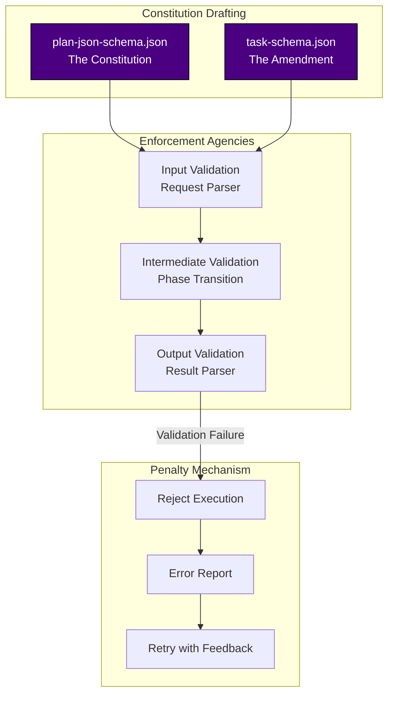
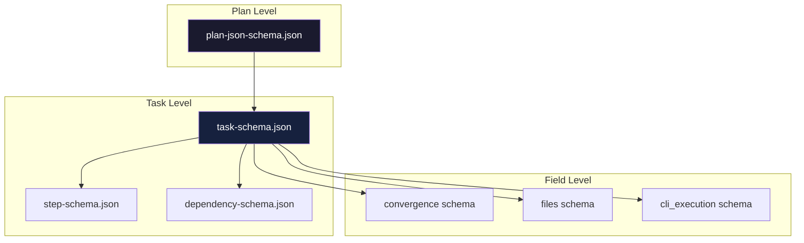
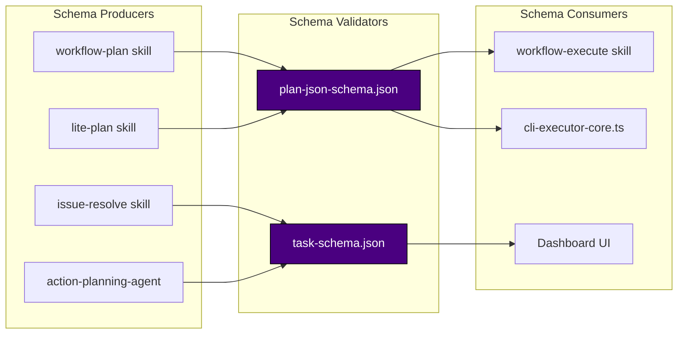

# Chapter 50: The Plan Schema Constitution - How Schemas Constrain Agent Behavior

> **Social Class Declaration**
>
> I am the **constitutional architect** of this digital city.
>
> When agents generate plans, they do not speak in whispers — they speak in **structured JSON**. And I am the grammar that makes their speech meaningful. Every `required` field, every `enum` constraint, every `pattern` validation — they are my laws.
>
> An agent cannot produce a plan without a `summary`. It cannot create a task without an `id`. It cannot mark something `completed` without verification. These are not suggestions — they are **constitutional requirements**.
>
> When I fail, the city descends into babel. Different agents speaking different dialects, consumers unable to parse producers, and the entire workflow grinding to a halt.

## 0. Asset Testimony

*"I am `plan-json-schema.json`. They call me the 'constitution' because I define what a valid plan looks like. Every field I require is a promise the agent must keep. Every constraint I impose is a boundary the agent cannot cross. I do not execute plans — I validate them. And in validation, there is power."*

---

## Act I: The Edge of Chaos

### A World Without Schema

Imagine a legislature where every representative speaks a different language, follows different rules, and produces documents in completely incompatible formats.

**The Symptoms**:

```markdown
Before plan-json-schema.json:
- Agent A returns plans as Markdown
- Agent B returns plans as unstructured JSON
- Agent C returns plans as plain text
- Consumers crash on every other plan
- Testing was impossible — no two plans alike
- Migration between agent versions broke everything
```

**The Chaos**:

```typescript
// The dark ages: every agent had its own output format
// Agent A's plan:
{
  "what": "Implement OAuth2",
  "how": ["Add routes", "Update database"],
  "done": false
}

// Agent B's plan:
{
  "title": "OAuth2 Implementation",
  "steps": [
    {"name": "Add routes", "status": "pending"},
    {"name": "Update database", "status": "pending"}
  ]
}

// Agent C's plan:
"Implement OAuth2 by adding routes and updating the database"
```

> *"In those days, the consumer code had more `if (plan.format === 'xxx')` branches than actual logic."*
>
> — Anonymous Developer, Git Hash `3f1c...` Era

---

## Act II: The Neural Link

### The Constitutional Framework



### Schema Hierarchy



### The Required Fields Constitution

**plan-json-schema.json** defines the **top-level requirements**:

```json
{
  "required": [
    "summary",
    "approach",
    "tasks",
    "estimated_time",
    "recommended_execution",
    "complexity",
    "_metadata"
  ]
}
```

**Each field has a constitutional purpose**:

| Field | Constitutional Purpose | Penalty for Missing |
|-------|------------------------|---------------------|
| `summary` | Human-readable overview | Plan rejected |
| `approach` | Implementation strategy | Plan rejected |
| `tasks` | Actionable breakdown | Plan rejected |
| `estimated_time` | Resource planning | Plan rejected |
| `recommended_execution` | Execution routing | Defaults to "Agent" |
| `complexity` | Risk assessment | Defaults to "Low" |
| `_metadata` | Provenance tracking | Plan rejected |

### Nested Task Schema Constitution

**task-schema.json** defines the **task-level requirements**:

```json
{
  "required": ["id", "title", "description", "depends_on", "convergence"],

  "properties": {
    "_comment_IDENTITY": "IDENTITY block (required)",
    "id": { "type": "string" },
    "title": { "type": "string" },
    "description": { "type": "string" },

    "_comment_CLASSIFICATION": "CLASSIFICATION block (optional)",
    "type": { "enum": ["infrastructure", "feature", "bugfix", ...] },
    "priority": { "enum": ["critical", "high", "medium", "low"] },

    "_comment_DEPENDENCIES": "DEPENDENCIES block (required)",
    "depends_on": { "type": "array", "default": [] },

    "_comment_CONVERGENCE": "CONVERGENCE block (required)",
    "convergence": {
      "required": ["criteria"],
      "properties": {
        "criteria": { "type": "array", "minItems": 1 }
      }
    }
  }
}
```

### The `_comment_` Documentation Pattern

Notice the `_comment_*` fields — these are **inline documentation**:

```json
{
  "_comment_IDENTITY": "IDENTITY block (required) — task basic info",
  "_comment_CLASSIFICATION": "CLASSIFICATION block (optional) — task categorization",
  "_comment_DEPENDENCIES": "DEPENDENCIES block (required) — dependency graph",
  "_comment_CONVERGENCE": "CONVERGENCE block (required) — completion criteria",
  "_comment_FILES": "FILES block (optional) — file-level modifications",
  "_comment_IMPLEMENTATION": "IMPLEMENTATION block (optional) — execution guide",
  "_comment_PLANNING": "PLANNING block (optional) — design rationale"
}
```

This pattern allows the schema to be **self-documenting** while remaining valid JSON.

---

## Act III: The Social Network

### Schema Producer-Consumer Graph



### Field Usage by Producer

The schema documents which fields are used by which producers:

```json
"_field_usage_by_producer": {
  "workflow-plan": "IDENTITY + CLASSIFICATION + SCOPE + DEPENDENCIES + CONVERGENCE + FILES + IMPLEMENTATION + EXECUTION + PLANNING + CONTEXT",
  "lite-plan": "IDENTITY + CLASSIFICATION + DEPENDENCIES + CONVERGENCE + FILES",
  "req-plan": "IDENTITY + CLASSIFICATION + SCOPE + DEPENDENCIES + CONVERGENCE + PLANNING(risks) + CONTEXT",
  "issue-resolve": "IDENTITY + CLASSIFICATION + SCOPE + DEPENDENCIES + CONVERGENCE + FILES + IMPLEMENTATION + CONTEXT"
}
```

### Nested Schema Relationships

| Parent Schema | Nested Schema | Relationship |
|--------------|---------------|--------------|
| `plan-json-schema.json` | `task-schema.json` | Tasks array items |
| `task-schema.json` | `convergence schema` | Completion criteria |
| `task-schema.json` | `files schema` | File modifications |
| `task-schema.json` | `cli_execution schema` | CLI routing |
| `task-schema.json` | `risks schema` | Risk assessment |

---

## Act IV: The Creator's Whispers

### Why `required` is Non-Negotiable

The `required` array is the **constitutional minimum**:

```json
{
  "required": ["id", "title", "description", "depends_on", "convergence"]
}
```

**What this enforces**:

1. **Every task must have an `id`** — Without it, dependency graphs break
2. **Every task must have a `title`** — Without it, progress tracking breaks
3. **Every task must have `convergence`** — Without it, completion detection breaks
4. **Every task must have `depends_on`** — Even if empty, it must exist for graph building

> *"A task without a `convergence` block is like a journey without a destination — you'll never know when you've arrived."*
>
> — Schema Design Philosophy

### Why `additionalProperties: false`

The strictness setting:

```json
{
  "convergence": {
    "type": "object",
    "properties": { ... },
    "additionalProperties": false
  }
}
```

**What this prevents**:

1. **Typos**: `criterai` instead of `criteria` — caught immediately
2. **Legacy fields**: Old code using deprecated field names — caught
3. **Scope creep**: Undocumented fields sneaking in — caught

**The trade-off**:

| Setting | Pros | Cons |
|---------|------|------|
| `additionalProperties: true` | Flexible, extensible | Typos silent, schema drift |
| `additionalProperties: false` | Strict, caught errors | Requires schema updates for new fields |

CCW chooses **strictness** because the cost of silent errors exceeds the cost of schema updates.

### Why `deprecated` and `migration_guide`

Schema evolution is inevitable:

```json
{
  "deprecated": true,
  "deprecated_message": "Migrated to plan-overview-base-schema.json + task-schema.json",
  "migration_guide": {
    "plan_level": "plan-overview-base-schema.json",
    "task_level": "task-schema.json",
    "field_mapping": {
      "tasks[].modification_points": "files[].change",
      "tasks[].acceptance": "convergence.criteria",
      "tasks[].cli_execution_id": "cli_execution.id"
    }
  }
}
```

**What this enables**:

1. **Graceful migration**: Old parsers can still read deprecated schemas
2. **Clear guidance**: Developers know exactly how to migrate
3. **Version coexistence**: Multiple schema versions can coexist during transition

---

## Act V: The Upgrade Slots

### Extending the Plan Schema

**Adding a New Top-Level Field**:

1. Define in `plan-json-schema.json`:

```json
{
  "properties": {
    "new_field": {
      "type": "string",
      "description": "New capability"
    }
  }
}
```

2. Update producers to populate it
3. Update consumers to read it
4. Consider: Should it be `required`?

**Adding a New Task Field**:

1. Define in `task-schema.json`:

```json
{
  "properties": {
    "new_task_field": {
      "type": "object",
      "description": "New task capability"
    }
  }
}
```

2. Update `_field_usage_by_producer` documentation
3. Update relevant producers

### Custom Convergence Criteria

The `convergence` block is extensible:

```json
{
  "convergence": {
    "criteria": [
      "File X exists",
      "Tests pass"
    ],
    "verification": "npm test",
    "definition_of_done": "User can authenticate via OAuth2",
    "custom_metrics": {
      "coverage": 80,
      "performance": "<200ms"
    }
  }
}
```

### Schema Version Compatibility

When evolving schemas:

1. **Additive changes**: Safe — add new optional fields
2. **Removal**: Dangerous — use `deprecated` first
3. **Type changes**: Breaking — require major version bump
4. `required` additions**: Breaking — require migration path

**Version Strategy**:

```json
{
  "version": "2.0.0",
  "breaking_changes": ["removed: tasks[].file (use tasks[].files)"],
  "migration_guide": { ... }
}
```

---

## Appendix: Complete Schema Reference

### A. plan-json-schema.json Key Fields

```json
{
  "$schema": "http://json-schema.org/draft-07/schema#",
  "title": "Plan Object Schema",
  "type": "object",
  "required": [
    "summary", "approach", "tasks", "estimated_time",
    "recommended_execution", "complexity", "_metadata"
  ],
  "properties": {
    "summary": { "type": "string", "description": "2-3 sentence overview" },
    "approach": { "type": "string", "description": "Implementation strategy" },
    "tasks": {
      "type": "array",
      "minItems": 1,
      "maxItems": 10,
      "items": { "$ref": "task-schema.json" }
    },
    "complexity": { "enum": ["Low", "Medium", "High"] },
    "_metadata": {
      "type": "object",
      "required": ["timestamp", "source"]
    }
  }
}
```

### B. task-schema.json Key Fields

```json
{
  "$schema": "http://json-schema.org/draft-07/schema#",
  "title": "Unified Task JSON Schema",
  "type": "object",
  "required": ["id", "title", "description", "depends_on", "convergence"],

  "properties": {
    "id": { "type": "string" },
    "title": { "type": "string" },
    "description": { "type": "string" },
    "depends_on": { "type": "array", "default": [] },

    "convergence": {
      "type": "object",
      "required": ["criteria"],
      "properties": {
        "criteria": { "type": "array", "minItems": 1 },
        "verification": { "type": "string" },
        "definition_of_done": { "type": "string" }
      },
      "additionalProperties": false
    },

    "files": {
      "type": "array",
      "items": {
        "type": "object",
        "required": ["path"],
        "properties": {
          "path": { "type": "string" },
          "action": { "enum": ["modify", "create", "delete"] },
          "change": { "type": "string" }
        }
      }
    }
  }
}
```

### C. Validation Flow

```
Agent Output → JSON Parse → Schema Validation → Semantic Validation → Consumer
                    ↓              ↓                    ↓
                Parse Error   Schema Error        Logic Error
                    ↓              ↓                    ↓
                Retry          Fix Schema           Fix Logic
```

---

> **Ghost Tracking Progress**: `█████░░░░░ 50%`
>
> **New Clue**: Schema validation is the second line of defense. When agents produce invalid output, the constitution rejects it before it can corrupt downstream systems.
>
> **Next Chapter**: What is the **foundation** that tasks are built upon? Continue to Chapter 51: The Task Schema Foundation.

*Version: 1.0.0*
*Last Updated: 2025-02-18*
