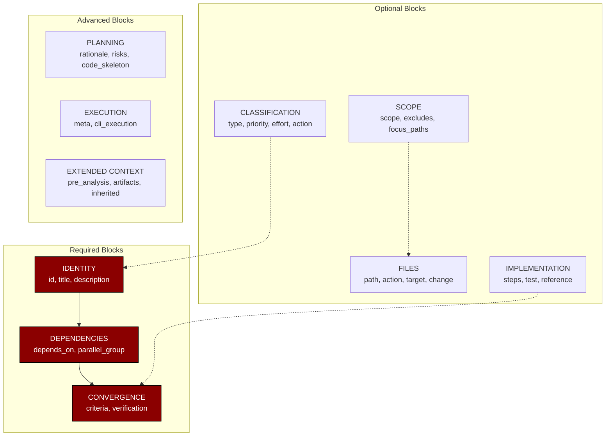
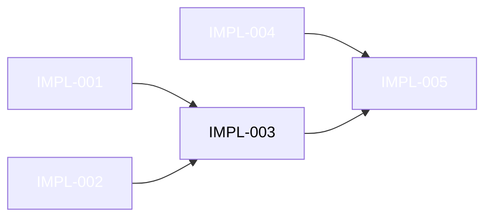
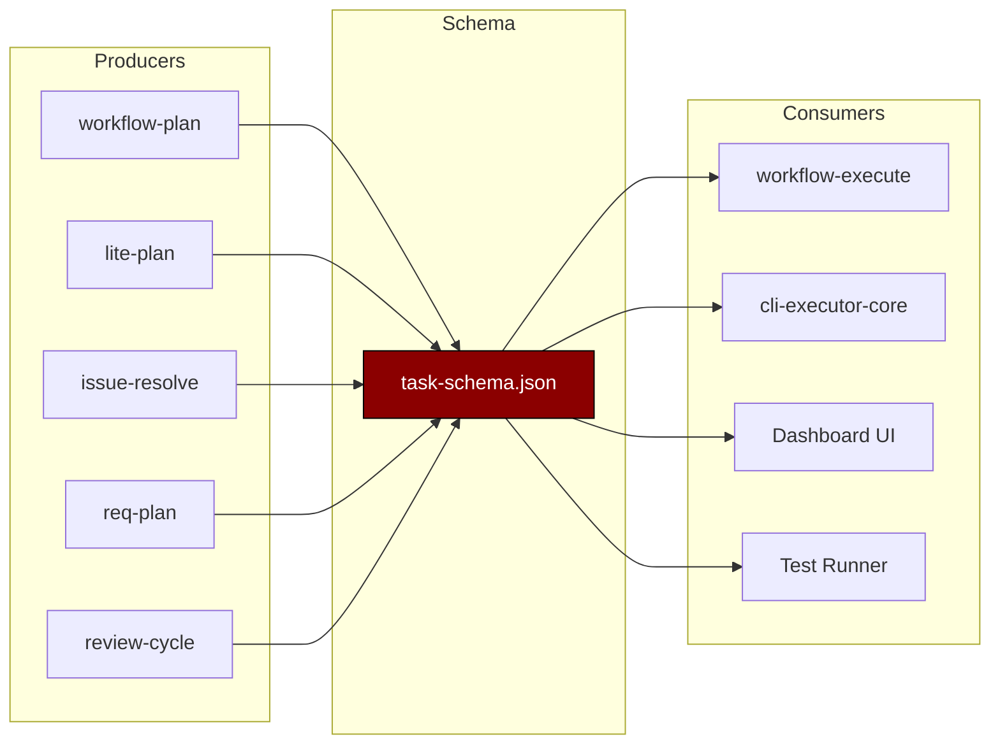

# Chapter 51: The Task Schema Foundation - The Building Blocks of Execution

> **Social Class Declaration**
>
> I am the **foundation stone** of this digital city.
>
> While the Plan Schema is the constitution, I am the **brick** — the atomic unit of work. Every feature, every bugfix, every refactor begins its life as a task JSON file conforming to my structure.
>
> My blocks are not arbitrary. `IDENTITY` defines who the task is. `CLASSIFICATION` defines what kind it is. `DEPENDENCIES` defines what must come before. `CONVERGENCE` defines when it's done. `FILES` defines what it touches.
>
> A task that skips a block is a house built on sand. The walls may stand today, but when the storm comes — when dependencies change, when files move, when verification fails — it will collapse.

## 0. Asset Testimony

*"I am `task-schema.json`. They call me the 'foundation' because every task file is built upon my structure. I define the 7 blocks that make a task complete: IDENTITY, CLASSIFICATION, SCOPE, DEPENDENCIES, CONVERGENCE, FILES, and IMPLEMENTATION. When a producer creates a task, it must speak my language. When a consumer executes a task, it must understand my structure. I am the contract between planners and executors."*

---

## Act I: The Edge of Chaos

### A World Without Unified Task Definition

Imagine a construction site where every worker has a different blueprint format. Some list materials, some list steps, some list goals — none of them compatible.

**The Symptoms**:

```markdown
Before task-schema.json:
- workflow-plan created tasks as { id, title, steps }
- lite-plan created tasks as { name, description, files }
- issue-resolve created tasks as { issue_id, actions }
- Executors had to handle 5+ different formats
- Task dependencies were inconsistent
- Completion detection was guesswork
```

**The Chaos**:

```typescript
// The dark ages: task format explosion
// Format A (workflow-plan):
{
  "id": "T1",
  "title": "Add OAuth2",
  "steps": ["Create routes", "Add middleware"],
  "done_when": "User can login"
}

// Format B (lite-plan):
{
  "name": "oauth2-feature",
  "description": "Implement OAuth2 authentication",
  "target_files": ["src/auth/", "src/routes/"],
  "tests": ["auth.test.ts"]
}

// Format C (issue-resolve):
{
  "issue_id": "ISS-001",
  "actions": [
    { "type": "create", "path": "src/auth/oauth.ts" }
  ],
  "verification": "npm test"
}
```

> *"Every skill had its own task format. Cross-skill dependencies were impossible."*
>
> — Anonymous Developer, Git Hash `8e4d...` Era

---

## Act II: The Neural Link

### The Seven Blocks of Task Definition



### Block Structure Overview

| Block | Required | Fields | Purpose |
|-------|----------|--------|---------|
| **IDENTITY** | Yes | `id`, `title`, `description` | Unique identification |
| **CLASSIFICATION** | No | `type`, `priority`, `effort`, `action` | Categorization |
| **SCOPE** | No | `scope`, `excludes`, `focus_paths` | Coverage definition |
| **DEPENDENCIES** | Yes | `depends_on`, `parallel_group` | Execution order |
| **CONVERGENCE** | Yes | `criteria`, `verification`, `definition_of_done` | Completion detection |
| **FILES** | No | `path`, `action`, `target`, `changes` | Modification targets |
| **IMPLEMENTATION** | No | `implementation`, `test`, `regression` | Execution guide |

### Block 1: IDENTITY (Required)

```json
{
  "id": "IMPL-001",
  "title": "Create unified task schema",
  "description": "Design and implement a unified task JSON schema that consolidates all task formats used by different planning skills."
}
```

**Field Definitions**:

| Field | Type | Constraint | Purpose |
|-------|------|------------|---------|
| `id` | string | Any format | Unique identifier (TASK-001, IMPL-001, T1, etc.) |
| `title` | string | Verb + target | Human-readable title |
| `description` | string | 1-3 sentences | What and why |

### Block 2: CLASSIFICATION (Optional)

```json
{
  "type": "feature",
  "priority": "high",
  "effort": "medium",
  "action": "Create"
}
```

**Enum Values**:

| Field | Values | Use Case |
|-------|--------|----------|
| `type` | `infrastructure`, `feature`, `enhancement`, `fix`, `refactor`, `testing`, `docs`, `chore` | Task category |
| `priority` | `critical`, `high`, `medium`, `low` | Execution priority |
| `effort` | `small`, `medium`, `large` | Work estimate |
| `action` | `Create`, `Update`, `Implement`, `Refactor`, `Add`, `Delete`, `Configure`, `Test`, `Fix` | Operation type |

### Block 3: SCOPE (Optional)

```json
{
  "scope": "ccw/src/config/",
  "excludes": ["*.test.ts", "*.spec.ts"],
  "focus_paths": ["ccw/src/config/storage-paths.ts"]
}
```

**Scope Hierarchy**:

```
scope (module/feature level)
  └── focus_paths (specific files)
        └── excludes (files to skip)
```

### Block 4: DEPENDENCIES (Required)

```json
{
  "depends_on": ["IMPL-001", "IMPL-002"],
  "parallel_group": 1
}
```

**Dependency Graph**:



### Block 5: CONVERGENCE (Required)

```json
{
  "convergence": {
    "criteria": [
      "task-schema.json file exists",
      "Schema validates against JSON Schema draft-07",
      "All 7 blocks are defined"
    ],
    "verification": "cat .ccw/workflows/cli-templates/schemas/task-schema.json | jq '.required'",
    "definition_of_done": "All planning skills produce tasks conforming to the schema"
  }
}
```

**Convergence Hierarchy**:

```
definition_of_done (business language)
  └── criteria (technical tests)
        └── verification (executable command)
```

### Block 6: FILES (Optional)

```json
{
  "files": [
    {
      "path": ".ccw/workflows/cli-templates/schemas/task-schema.json",
      "action": "create",
      "target": "root",
      "change": "Create unified task schema definition",
      "conflict_risk": "low"
    }
  ]
}
```

**File Action Types**:

| Action | Description | Risk |
|--------|-------------|------|
| `create` | New file | Low |
| `modify` | Edit existing | Medium |
| `delete` | Remove file | High |

### Block 7: IMPLEMENTATION (Optional)

```json
{
  "implementation": [
    "1. Analyze existing task formats (workflow-plan, lite-plan, issue-resolve)",
    "2. Extract common fields and identify unique requirements",
    "3. Design unified schema with required and optional blocks",
    "4. Add _comment_ fields for inline documentation"
  ],
  "test": {
    "commands": ["npm run test:schema"],
    "unit": ["validate task-schema.json"],
    "coverage_target": 80
  },
  "regression": ["Existing task files still parse correctly"]
}
```

---

## Act III: The Social Network

### Task Schema Producer-Consumer Graph



### Field Usage by Producer

```json
"_field_usage_by_producer": {
  "workflow-plan": "IDENTITY + CLASSIFICATION + SCOPE + DEPENDENCIES + CONVERGENCE + FILES + IMPLEMENTATION + EXECUTION + PLANNING + CONTEXT",
  "lite-plan": "IDENTITY + CLASSIFICATION + DEPENDENCIES + CONVERGENCE + FILES",
  "lite-plan (v2)": "IDENTITY + CLASSIFICATION + SCOPE + DEPENDENCIES + CONVERGENCE + FILES + IMPLEMENTATION + PLANNING",
  "req-plan": "IDENTITY + CLASSIFICATION + SCOPE + DEPENDENCIES + CONVERGENCE + PLANNING(risks) + CONTEXT",
  "collaborative-plan": "IDENTITY + CLASSIFICATION + SCOPE + DEPENDENCIES + CONVERGENCE + FILES + CONTEXT",
  "issue-resolve": "IDENTITY + CLASSIFICATION + SCOPE + DEPENDENCIES + CONVERGENCE + FILES + IMPLEMENTATION + CONTEXT",
  "review-cycle": "IDENTITY + CLASSIFICATION + FILES + CONVERGENCE + IMPLEMENTATION + CONTEXT",
  "tdd-plan": "IDENTITY + CLASSIFICATION + DEPENDENCIES + CONVERGENCE + EXECUTION + IMPLEMENTATION(test focused)",
  "analyze-brainstorm": "IDENTITY + CLASSIFICATION + DEPENDENCIES + CONVERGENCE + CONTEXT"
}
```

### Directory Convention

```json
"_directory_convention": {
  "standard_path": "{session_folder}/.task/",
  "file_naming": "TASK-{id}.json (or preserve original prefix: IMPL-, L0-, T1-, FIX-)",
  "examples": {
    "workflow-plan": ".workflow/active/WFS-xxx/.task/IMPL-001.json",
    "lite-plan": ".workflow/.lite-plan/{id}/.task/TASK-001.json",
    "req-plan": ".workflow/.req-plan/RPLAN-{id}/.task/TASK-001.json",
    "review-cycle": ".workflow/active/WFS-{id}/.review/.task/FIX-001.json",
    "issue-resolve": ".workflow/issues/{issue-id}/.task/TASK-001.json"
  }
}
```

---

## Act IV: The Creator's Whispers

### Why `_comment_` Fields?

The `_comment_*` pattern serves as **inline documentation**:

```json
{
  "_comment_IDENTITY": "IDENTITY block (required) — task basic info",
  "_comment_CLASSIFICATION": "CLASSIFICATION block (optional) — task categorization",
  "_comment_DEPENDENCIES": "DEPENDENCIES block (required) — dependency graph",
  "_comment_CONVERGENCE": "CONVERGENCE block (required) — completion criteria"
}
```

**Benefits**:

1. **Self-documenting schema**: No external docs needed
2. **IDE support**: Hover shows description
3. **Validation safe**: Underscore prefix ignored by most validators
4. **Human-readable**: Developers can understand schema at a glance

### Why `_field_usage_by_producer`?

This metadata documents **which producers use which fields**:

```json
"_field_usage_by_producer": {
  "workflow-plan": "IDENTITY + CLASSIFICATION + SCOPE + ...",
  "lite-plan": "IDENTITY + CLASSIFICATION + DEPENDENCIES + ..."
}
```

**Benefits**:

1. **Producer compatibility**: Know which fields each producer populates
2. **Consumer expectations**: Know which fields are guaranteed per producer
3. **Migration planning**: See impact of field changes
4. **Testing scope**: Know which combinations to test

### Why `additionalProperties: true` at Root?

The task schema allows **extra fields** at the root level:

```json
{
  "additionalProperties": true
}
```

**Reasoning**:

- Different producers may add custom fields
- Extended context blocks can be added without schema changes
- Runtime fields (status, result) are added during execution
- Backward compatibility with existing task files

**But inner blocks use `additionalProperties: false`**:

```json
{
  "convergence": {
    "additionalProperties": false
  }
}
```

This balances **flexibility at the root** with **strictness in defined blocks**.

---

## Act V: The Upgrade Slots

### Adding a New Block

**Steps to add a new block**:

1. Define the block in `task-schema.json`:

```json
{
  "properties": {
    "new_block": {
      "type": "object",
      "description": "New capability block",
      "properties": { ... }
    }
  }
}
```

2. Add `_comment_NEW_BLOCK` documentation
3. Update `_field_usage_by_producer` for relevant producers
4. Update consumers to handle the new block
5. Update tests

### Extending an Existing Block

**Adding fields to CONVERGENCE**:

```json
{
  "convergence": {
    "properties": {
      "new_field": {
        "type": "string",
        "description": "New convergence option"
      }
    }
  }
}
```

**Considerations**:

1. Should it be required or optional?
2. What's the default value?
3. How do existing tasks without this field behave?

### Multi-Producer Support

The schema supports **different producers with different capabilities**:

```
Producer A: IDENTITY + CONVERGENCE (minimal)
Producer B: IDENTITY + CLASSIFICATION + CONVERGENCE (standard)
Producer C: IDENTITY + CLASSIFICATION + SCOPE + CONVERGENCE + FILES + PLANNING (full)
```

**Consumer strategy**:

```typescript
function executeTask(task: Task) {
  // Required fields - always available
  const id = task.id;
  const criteria = task.convergence.criteria;

  // Optional fields - check existence
  const type = task.type; // may be undefined
  const files = task.files || []; // default to empty
  const risks = task.risks || []; // default to empty
}
```

---

## Appendix: Complete Schema Reference

### A. Full Task Schema Structure

```json
{
  "$schema": "http://json-schema.org/draft-07/schema#",
  "$id": "task-schema.json",
  "title": "Unified Task JSON Schema",
  "type": "object",
  "required": ["id", "title", "description", "depends_on", "convergence"],

  "properties": {
    "_comment_IDENTITY": "IDENTITY block (required)",
    "id": { "type": "string" },
    "title": { "type": "string" },
    "description": { "type": "string" },

    "_comment_CLASSIFICATION": "CLASSIFICATION block (optional)",
    "type": { "enum": ["infrastructure", "feature", "enhancement", "fix", "refactor", "testing", "docs", "chore"] },
    "priority": { "enum": ["critical", "high", "medium", "low"] },
    "effort": { "enum": ["small", "medium", "large"] },
    "action": { "enum": ["Create", "Update", "Implement", "Refactor", "Add", "Delete", "Configure", "Test", "Fix"] },

    "_comment_SCOPE": "SCOPE block (optional)",
    "scope": { "oneOf": [{ "type": "string" }, { "type": "array" }] },
    "excludes": { "type": "array", "items": { "type": "string" } },
    "focus_paths": { "type": "array", "items": { "type": "string" } },

    "_comment_DEPENDENCIES": "DEPENDENCIES block (required)",
    "depends_on": { "type": "array", "items": { "type": "string" }, "default": [] },
    "parallel_group": { "type": "number" },

    "_comment_CONVERGENCE": "CONVERGENCE block (required)",
    "convergence": {
      "type": "object",
      "required": ["criteria"],
      "properties": {
        "criteria": { "type": "array", "items": { "type": "string" }, "minItems": 1 },
        "verification": { "type": "string" },
        "definition_of_done": { "type": "string" }
      },
      "additionalProperties": false
    },

    "_comment_FILES": "FILES block (optional)",
    "files": {
      "type": "array",
      "items": {
        "type": "object",
        "required": ["path"],
        "properties": {
          "path": { "type": "string" },
          "action": { "enum": ["modify", "create", "delete"] },
          "target": { "type": "string" },
          "changes": { "type": "array", "items": { "type": "string" } },
          "change": { "type": "string" },
          "conflict_risk": { "enum": ["low", "medium", "high"] }
        }
      }
    },

    "_comment_IMPLEMENTATION": "IMPLEMENTATION block (optional)",
    "implementation": { "type": "array" },
    "test": {
      "type": "object",
      "properties": {
        "commands": { "type": "array" },
        "unit": { "type": "array" },
        "integration": { "type": "array" },
        "coverage_target": { "type": "number" }
      }
    },

    "_comment_PLANNING": "PLANNING block (optional)",
    "reference": { "type": "object" },
    "rationale": { "type": "object" },
    "risks": { "type": "array" },
    "code_skeleton": { "type": "object" },

    "_comment_RUNTIME": "RUNTIME block (execution-time)",
    "status": { "enum": ["pending", "in_progress", "completed", "failed", "skipped", "blocked"] },
    "result": { "type": "object" }
  },

  "additionalProperties": true
}
```

### B. Minimal Task Example

```json
{
  "id": "T1",
  "title": "Add logging",
  "description": "Add structured logging to the executor module.",
  "depends_on": [],
  "convergence": {
    "criteria": ["Logs appear in output"]
  }
}
```

### C. Full Task Example

```json
{
  "id": "IMPL-001",
  "title": "Create unified task schema",
  "description": "Design and implement a unified task JSON schema.",
  "type": "infrastructure",
  "priority": "high",
  "effort": "medium",
  "action": "Create",
  "scope": ".ccw/workflows/cli-templates/schemas/",
  "depends_on": [],
  "convergence": {
    "criteria": [
      "task-schema.json exists",
      "Schema validates",
      "All 7 blocks defined"
    ],
    "verification": "jq '.' task-schema.json",
    "definition_of_done": "All skills produce conforming tasks"
  },
  "files": [
    {
      "path": ".ccw/workflows/cli-templates/schemas/task-schema.json",
      "action": "create",
      "change": "Create unified task schema"
    }
  ],
  "implementation": [
    "1. Analyze existing formats",
    "2. Extract common fields",
    "3. Design unified schema"
  ],
  "test": {
    "commands": ["npm run test:schema"],
    "coverage_target": 80
  },
  "status": "pending"
}
```

---

> **Ghost Tracking Progress**: `███████░░░ 70%`
>
> **New Clue**: Task schema is the atomic unit of work. When tasks are well-structured, execution becomes deterministic. When tasks are malformed, cascading failures follow.
>
> **Next Chapter**: How do we **extend** these schemas safely? Continue to Chapter 52: Custom Schema Extension Guide.

*Version: 1.0.0*
*Last Updated: 2025-02-18*
