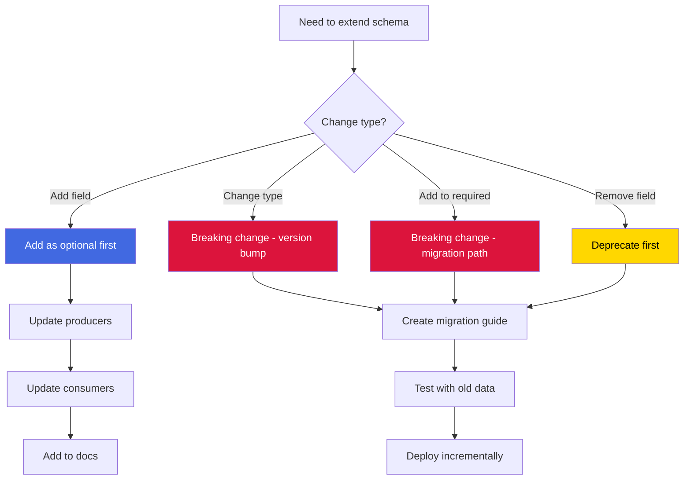
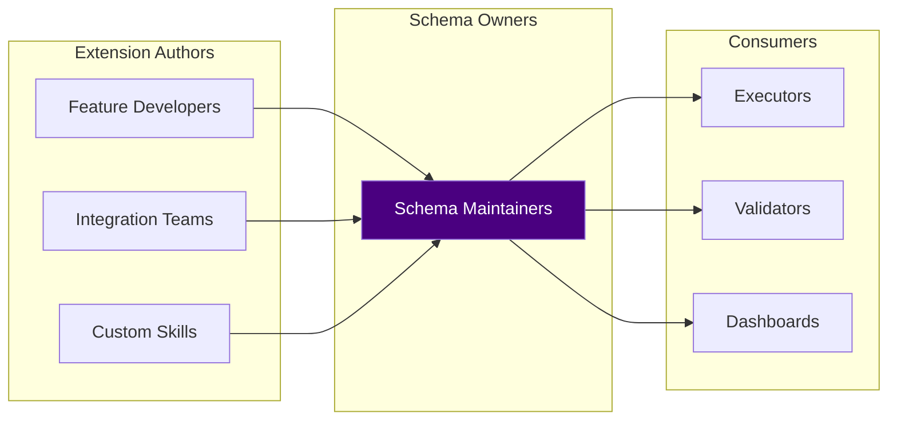

# Chapter 52: Custom Schema Extension Guide - Extending the Constitution

> **Social Class Declaration**
>
> I am the **amendment process** of this digital city.
>
> Constitutions are not written in stone — they evolve. But evolution without rules is chaos. I am the guide that ensures extensions are **compatible**, **documented**, and **reversible**.
>
> When you add a new field, ask yourself: Will old consumers crash? Will new producers omit it? Will validators reject it? My checklists and patterns are the guardrails that keep extensions from becoming fragmentation.
>
> A well-designed extension is invisible to those who don't need it, but powerful for those who do. A poorly-designed extension is a time bomb that detonates during the next migration.

## 0. Asset Testimony

*"I am the extension guide. I don't define schemas — I teach you how to modify them safely. When you need to add a new field, change a constraint, or introduce a new block, I am the checklist you follow. My purpose is to ensure that today's extension doesn't become tomorrow's breaking change."*

---

## Act I: The Edge of Chaos

### Blind Extension Disasters

Imagine a city where anyone can add new roads, change traffic rules, or redefine addresses — without coordination, without documentation, without backward compatibility.

**The Symptoms**:

```markdown
Symptoms of blind extension:
- Added field broke all old consumers
- Changed enum values invalidated existing data
- New required field made old tasks unparseable
- Undocumented extension became undocumented debt
- Extension in one project broke another project's tools
```

**The Chaos**:

```typescript
// The dark ages: uncoordinated schema extension
// Developer A adds a field:
{
  "tasks": {
    "items": {
      "properties": {
        "my_custom_field": { "type": "string" }  // Added without planning
      }
    }
  }
}

// Developer B's consumer crashes:
function processTask(task) {
  // Assumes 'my_custom_field' exists
  console.log(task.my_custom_field.toUpperCase());  // TypeError: undefined
}

// Developer C's producer omits it:
{
  "id": "T1",
  "title": "Task",
  // 'my_custom_field' is missing
  // Consumer B crashes again
}
```

> *"We added 12 custom fields across 3 projects. By month 2, no two schemas were compatible."*
>
> — Anonymous Developer, Git Hash `1a2b...` Era

---

## Act II: The Neural Link

### Schema Extension Checklist



### Extension Decision Tree

```
Need to add a field?
├── Is it required for all tasks?
│   ├── Yes → Breaking change. Create migration guide. Bump major version.
│   └── No → Safe. Add as optional. Document usage.
│
├── Is it producer-specific?
│   ├── Yes → Add to _field_usage_by_producer. Optional.
│   └── No → Consider adding to main schema.
│
└── Does it affect existing consumers?
    ├── Yes → Test with existing data. Provide fallback.
    └── No → Safe. Proceed.
```

### Extension Pattern Categories

| Pattern | Risk | When to Use |
|---------|------|-------------|
| **Add Optional Field** | Low | New capability, non-essential |
| **Add to Enum** | Medium | New valid value (consumers may not handle) |
| **Add Nested Object** | Low | New structured data |
| **Add Required Field** | High | Essential data (requires migration) |
| **Change Type** | Critical | Breaking change (major version) |
| **Remove Field** | High | Deprecated field (use `deprecated` first) |

---

## Act III: The Social Network

### Schema Extension Stakeholders



### Field Mapping: Solution to Task

When extending schemas, maintain field consistency:

```json
// solution-schema.json
{
  "tasks[].modification_points": {
    "file": "...",
    "target": "...",
    "change": "..."
  }
}

// task-schema.json (mapped)
{
  "files[]": {
    "path": "...",           // <- maps from file
    "target": "...",         // <- same name
    "change": "..."          // <- same name
  }
}
```

**Field Mapping Table**:

| Solution Field | Task Field | Transformation |
|----------------|------------|----------------|
| `modification_points[].file` | `files[].path` | Direct rename |
| `modification_points[].target` | `files[].target` | Direct copy |
| `modification_points[].change` | `files[].change` | Direct copy |
| `tasks[].acceptance` | `convergence.criteria` | Array to object |
| `tasks[].cli_execution_id` | `cli_execution.id` | Flatten |
| `tasks[].reference` | `reference` | Direct copy |
| `tasks[].rationale` | `rationale` | Direct copy |
| `tasks[].risks` | `risks` | Direct copy |

---

## Act IV: The Creator's Whispers

### Why `additionalProperties: false` is Strict

The strictness prevents silent failures:

```json
{
  "convergence": {
    "type": "object",
    "properties": {
      "criteria": { "type": "array" }
    },
    "additionalProperties": false
  }
}
```

**What this catches**:

```json
// Typo caught immediately:
{ "convergence": { "criterai": ["..."] } }  // Error: unknown property

// Deprecated field caught:
{ "convergence": { "acceptance": ["..."] } }  // Error: use criteria

// Scope creep caught:
{ "convergence": { "custom_thing": "..." } }  // Error: extend schema first
```

**When to relax**:

Only at the **root level** where extensions are expected:

```json
{
  "additionalProperties": true,  // Allow extension fields
  "properties": {
    "id": { ... },
    "title": { ... }
  }
}
```

### JSON Schema Draft-07 Compatibility

CCW schemas use **JSON Schema draft-07**:

```json
{
  "$schema": "http://json-schema.org/draft-07/schema#"
}
```

**Key draft-07 features used**:

| Feature | Usage | Example |
|---------|-------|---------|
| `$ref` | Reuse definitions | `{ "$ref": "#/$defs/devIndexEntry" }` |
| `$defs` | Shared definitions | `"$defs": { "devIndexEntry": { ... } }` |
| `if/then/else` | Conditional validation | Not currently used (future) |
| `oneOf` | Alternative types | `{ "oneOf": [{ "type": "string" }, { "type": "array" }] }` |
| `enum` | Fixed values | `{ "enum": ["low", "medium", "high"] }` |
| `pattern` | Regex validation | `{ "pattern": "^T[0-9]+$" }` |

**Compatibility considerations**:

- Most validators support draft-07
- Some older tools may need updates
- Newer drafts (2019-09, 2020-12) have breaking changes

### Extension Documentation Requirements

Every extension must document:

```json
{
  "new_field": {
    "type": "string",
    "description": "Purpose and usage",
    "_introduced_in": "v2.1.0",
    "_producer_usage": ["workflow-plan", "lite-plan"],
    "_consumer_requirement": "optional",
    "_default_value": null,
    "_migration_note": "Populated from existing X field"
  }
}
```

---

## Act V: The Upgrade Slots

### Extension Pattern: Add Optional Field

**Safest extension pattern**:

1. Add field to schema as optional:

```json
{
  "properties": {
    "new_capability": {
      "type": "object",
      "description": "New capability block",
      "properties": { ... }
    }
  }
  // NOT added to "required"
}
```

2. Update producers to populate it:

```typescript
// producer.ts
task.new_capability = {
  // populate new field
};
```

3. Update consumers to handle absence:

```typescript
// consumer.ts
const capability = task.new_capability || getDefaultCapability();
```

4. Document in `_field_usage_by_producer`

### Extension Pattern: Add Enum Value

**Medium risk extension**:

1. Add value to enum:

```json
{
  "priority": {
    "enum": ["critical", "high", "medium", "low", "urgent"]  // Added "urgent"
  }
}
```

2. Update consumers to handle new value:

```typescript
// consumer.ts
function getPriorityWeight(priority: string): number {
  const weights = {
    critical: 4,
    urgent: 4,    // Handle new value
    high: 3,
    medium: 2,
    low: 1
  };
  return weights[priority] ?? 2;  // Fallback for unknown
}
```

3. Update tests

### Extension Pattern: Deprecate Field

**Safe removal pattern**:

1. Mark field as deprecated:

```json
{
  "old_field": {
    "type": "string",
    "description": "DEPRECATED: Use new_field instead",
    "deprecated": true,
    "_deprecation_note": "Will be removed in v3.0.0"
  }
}
```

2. Add `deprecated_message` and `migration_guide`:

```json
{
  "deprecated": true,
  "deprecated_message": "Use new_field instead",
  "migration_guide": {
    "old_field": "new_field.nested_property"
  }
}
```

3. Update producers to use new field

4. Update consumers to support both (transition period)

5. Remove in next major version

### Migration Checklist

**Before adding a breaking change**:

- [ ] All existing tasks pass validation with old schema
- [ ] Migration script tested on sample data
- [ ] Rollback plan documented
- [ ] Consumer code handles both old and new formats
- [ ] Documentation updated
- [ ] Tests cover migration scenarios
- [ ] Deployment is incremental (not big bang)

---

## Appendix: Complete Extension Examples

### A. Adding a New Block: Custom Metrics

```json
// task-schema.json extension
{
  "properties": {
    "_comment_METRICS": "METRICS block (optional) — custom performance tracking",
    "metrics": {
      "type": "object",
      "description": "Custom performance and quality metrics",
      "properties": {
        "estimated_complexity": {
          "type": "number",
          "minimum": 1,
          "maximum": 10,
          "description": "Complexity score (1-10)"
        },
        "quality_gates": {
          "type": "array",
          "items": { "type": "string" },
          "description": "Quality checkpoints"
        },
        "performance_target": {
          "type": "string",
          "description": "Performance requirement (e.g., '<200ms')"
        }
      },
      "additionalProperties": true
    }
  }
}

// Producer update
task.metrics = {
  estimated_complexity: 7,
  quality_gates: ["lint passes", "tests pass"],
  performance_target: "<500ms"
};

// Consumer update
const complexity = task.metrics?.estimated_complexity ?? 5;
const qualityGates = task.metrics?.quality_gates ?? [];
```

### B. Adding Enum Value: Task Status

```json
// Current enum
{
  "status": {
    "enum": ["pending", "in_progress", "completed", "failed"]
  }
}

// Extended enum
{
  "status": {
    "enum": [
      "pending", "in_progress", "completed", "failed",
      "skipped",      // NEW: Task was intentionally skipped
      "blocked"       // NEW: Task cannot proceed (dependency issue)
    ]
  }
}

// Consumer handling
function handleStatus(status: string): StatusHandler {
  switch (status) {
    case "pending": return pendingHandler;
    case "in_progress": return activeHandler;
    case "completed": return completeHandler;
    case "failed": return failureHandler;
    case "skipped": return skipHandler;      // NEW
    case "blocked": return blockedHandler;   // NEW
    default: return defaultHandler;          // Fallback
  }
}
```

### C. Full Migration Guide Template

```json
{
  "version": "3.0.0",
  "breaking_changes": [
    "Removed: tasks[].file (use tasks[].files[].path)",
    "Changed: tasks[].acceptance renamed to convergence.criteria"
  ],
  "migration_guide": {
    "plan_level": "plan-overview-base-schema.json",
    "task_level": "task-schema.json",
    "field_mapping": {
      "tasks[].file": {
        "new_path": "tasks[].files[].path",
        "transformation": "Wrap in files array"
      },
      "tasks[].acceptance": {
        "new_path": "tasks[].convergence.criteria",
        "transformation": "Move to convergence object"
      },
      "tasks[].cli_execution_id": {
        "new_path": "tasks[].cli_execution.id",
        "transformation": "Nest in cli_execution object"
      }
    },
    "automated_migration": "npm run migrate:v3",
    "manual_steps": [
      "Update custom consumers to use new field paths",
      "Verify convergence.criteria is populated",
      "Test with sample tasks"
    ]
  }
}
```

---

> **Ghost Tracking Progress**: `████████░░ 80%`
>
> **New Clue**: Schema extension is where architecture meets evolution. A well-designed extension system allows growth without breaking backward compatibility.
>
> **Next**: See all chapters in context. Continue to Section D Index: The Social Class Declaration.

*Version: 1.0.0*
*Last Updated: 2025-02-18*
