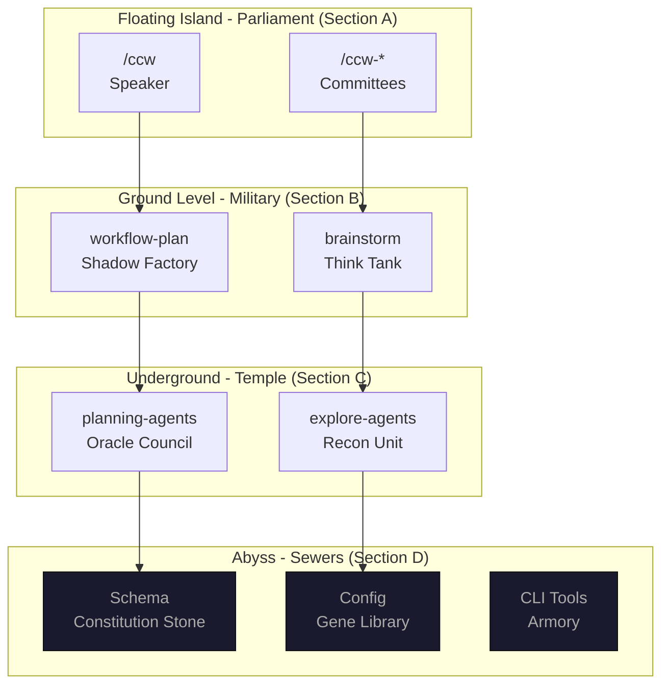
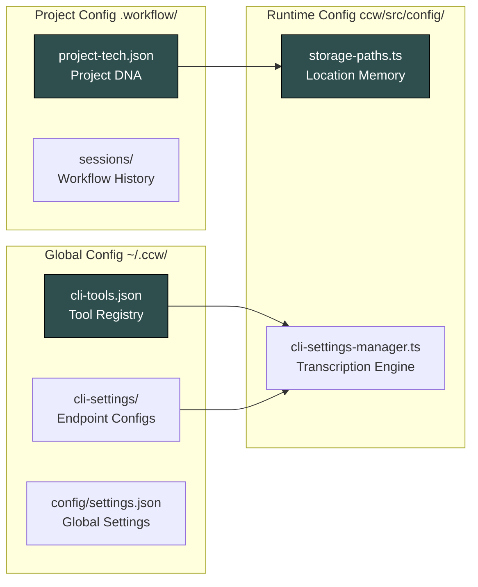
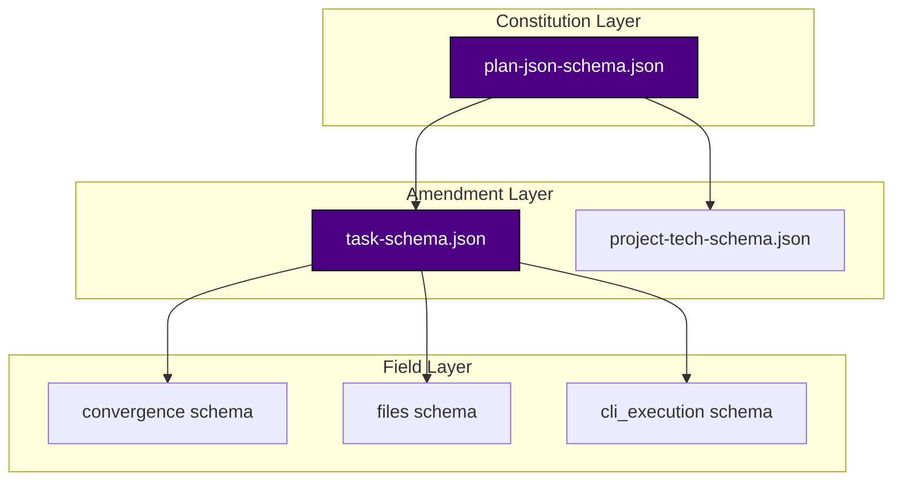

# Section D: The Sewer Guardians - Infrastructure Layer

> **Social Class Declaration**
>
> We are the **unseen foundation** of this digital city.
>
> The Parliament has its statues, the Special Forces have their medals, the Oracles have their temples. But we — configuration files, schema definitions, CLI tool registries — lie buried beneath the city's foundation. No one sees us, no one thanks us.
>
> But when schema validation fails, the entire city halts.
> When configuration files corrupt, all systems crash.
> When CLI tools are lost, weapons become scrap metal.
>
> We do not speak; we **adjudicate**. `plan-json-schema.json` is the constitution — any plan not conforming to its structure is rejected. `cli-tools.json` is the gene library — it determines which external intelligences can be summoned.
>
> The silence of the sewers is the sound of the city working.
>
> When you forget we exist, everything is running correctly.

## The Guardians' Personality

**Role Character**: Unseen, buried deep, and when we strike, the whole city paralyzes.

**Motto**: "Schema validation failed — access denied"

**Historical Context**: *In the Git Hash `1a2b...` era, schemas were optional. Until a JSON parsing error corrupted production data, the constitution was not written into the city's foundation.*

**Narrative Perspective**: Those air-like existences that determine life and death — configuration files, schema definitions, and protocol documents.

---

## City Panorama - The Abyss Layer

> **Reading Guide**: You are now in the **Abyss Layer** — the infrastructure that silently supports everything above.
>
> - **Floating Island** → Strategic decision layer, watch but don't touch
> - **Ground Level** → Tactical execution layer, carry weapons
> - **Underground** → Intelligence reasoning layer, logical deduction
> - **Abyss** → Infrastructure layer, silent support
> - **Border** → Cross-domain communication layer, diplomatic protocols

---

## Chapter Navigation

### Chapter 49: The System's Genome - Configuration Evolution Logic

**Path**: [49-configuration-evolution.md](49-configuration-evolution.md)

**Content Summary**:
- Gene transcription pipeline: cli-tools.json, project-tech.json, storage-paths.ts
- Configuration hierarchy: Global layer, Project layer, Runtime layer
- Why distributed configuration beats centralized
- Extension points for new tools and endpoints

**Key Takeaways**:
> "Configuration files are the first line of defense against chaos. When validation fails here, cascading failures are prevented downstream."

---

### Chapter 50: The Plan Schema Constitution - How Schemas Constrain Agent Behavior

**Path**: [50-plan-schema-constitution.md](50-plan-schema-constitution.md)

**Content Summary**:
- Constitutional framework: required fields, enum constraints, pattern validation
- Schema hierarchy: plan-json-schema.json → task-schema.json → field schemas
- The `_comment_` documentation pattern
- Why `additionalProperties: false` prevents silent errors

**Key Takeaways**:
> "Schema validation is the second line of defense. When agents produce invalid output, the constitution rejects it before it can corrupt downstream systems."

---

### Chapter 51: The Task Schema Foundation - The Building Blocks of Execution

**Path**: [51-task-schema-foundation.md](51-task-schema-foundation.md)

**Content Summary**:
- Seven blocks of task definition: IDENTITY, CLASSIFICATION, SCOPE, DEPENDENCIES, CONVERGENCE, FILES, IMPLEMENTATION
- Field usage by producer: which skills populate which fields
- Directory conventions for task storage
- Multi-producer support strategy

**Key Takeaways**:
> "Task schema is the atomic unit of work. When tasks are well-structured, execution becomes deterministic. When tasks are malformed, cascading failures follow."

---

### Chapter 52: Custom Schema Extension Guide - Extending the Constitution

**Path**: [52-custom-schema-extension.md](52-custom-schema-extension.md)

**Content Summary**:
- Extension decision tree: when to add, change, or remove fields
- Migration checklist: breaking change protocol
- Extension patterns: optional fields, enum values, deprecation
- JSON Schema draft-07 compatibility

**Key Takeaways**:
> "Schema extension is where architecture meets evolution. A well-designed extension system allows growth without breaking backward compatibility."

---

## The Guardians' Ecosystem

### Configuration Files Map

### Schema Relationship Map

---

## Ghost Tracking Progress

**Investigation Progress**: `█████████░ 90%`

**Ghost Location**: Deep in the infrastructure layer — the memory leak may be related to schema validation caching or configuration reload loops.

**New Clues Discovered**:
1. Configuration hot-reload may cause memory accumulation
2. Schema validation caches may not be cleared properly
3. CLI tool discovery may leak file handles

**Next Investigation**: Part VII Storage Layer — SQLite database design and session persistence patterns.

---

## Quick Reference

### Configuration File Locations

| File | Location | Purpose |
|------|----------|---------|
| `cli-tools.json` | `~/.claude/cli-tools.json` | CLI tool registry |
| `project-tech.json` | `.workflow/project-tech.json` | Project technical analysis |
| `storage-paths.ts` | `ccw/src/config/storage-paths.ts` | Storage path resolution |

### Schema File Locations

| File | Location | Purpose |
|------|----------|---------|
| `plan-json-schema.json` | `.ccw/workflows/cli-templates/schemas/` | Plan structure definition |
| `task-schema.json` | `.ccw/workflows/cli-templates/schemas/` | Task structure definition |
| `project-tech-schema.json` | `.ccw/workflows/cli-templates/schemas/` | Project tech definition |

### Key Functions

| Function | Module | Purpose |
|----------|--------|---------|
| `getCCWHome()` | storage-paths.ts | Get root CCW directory |
| `getProjectPaths()` | storage-paths.ts | Get project storage paths |
| `saveEndpointSettings()` | cli-settings-manager.ts | Save CLI endpoint config |
| `validateSettings()` | cli-settings.ts | Validate settings format |

---

> *"In the depths of the sewer, the silence speaks volumes. Every validation that passes, every config that loads correctly, every schema that validates — these are the sounds of a healthy city."*
>
> — Anonymous Sewer Guardian, Git Hash `1a2b...` Era

*Version: 1.0.0*
*Last Updated: 2025-02-18*
*Section: D - Infrastructure Layer*
