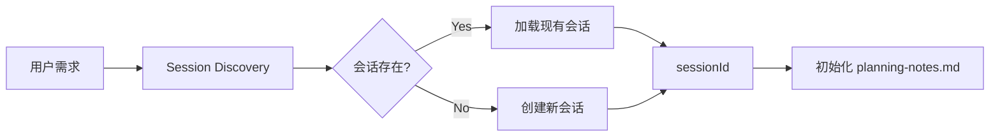
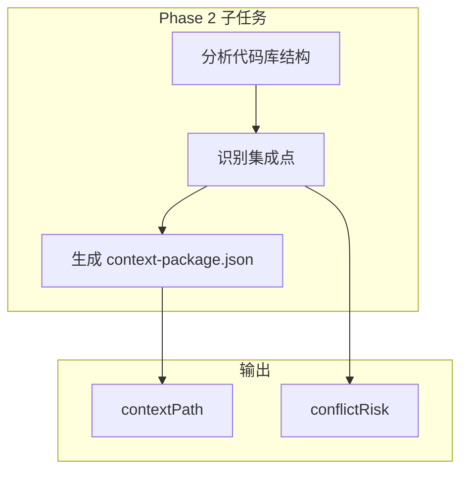
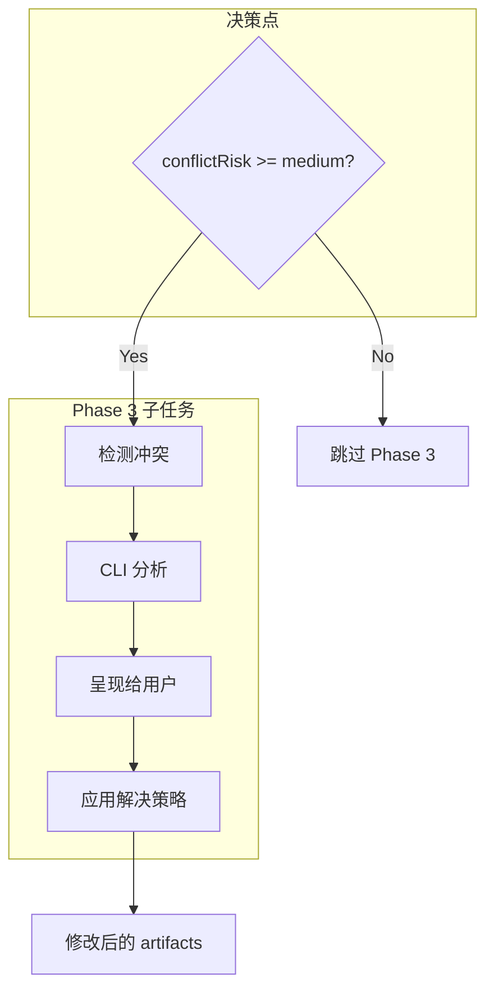
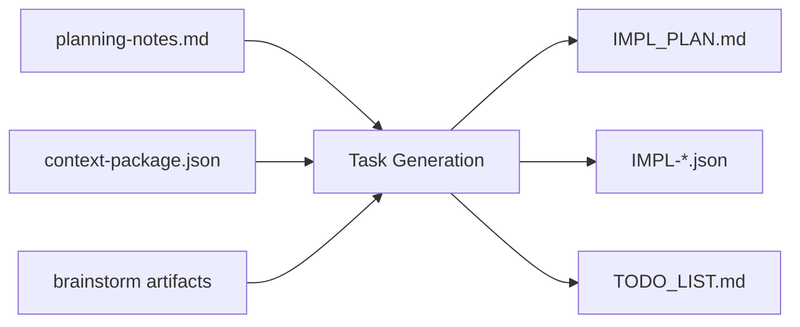

# Chapter 35: 影子工厂 — workflow-plan 的生产流水线

> **生命周期阶段**: 需求输入 → 计划输出
> **涉及资产**: workflow-plan Skill + 4 个 Phase 文件 + action-planning-agent
> **阅读时间**: 45-60 分钟
> **版本追踪**: `.claude/skills/workflow-plan/SKILL.md`

---

## 0. 资产证言 (Asset Testimony)

> *"我是 `workflow-plan`。人们叫我'影子工厂'——因为我从混沌的需求中生产出秩序的计划。"*
>
> *"我有四个车间（Phase）。第一车间发现会话，第二车间收集上下文，第三车间解决冲突，第四车间生成任务。每个车间都有自己的流水线，自己的质检员，自己的废料处理系统。"*
>
> *"我的产品是 IMPL_PLAN.md——一份人类可读、机器可执行的作战地图。但在这个过程中，我还要维持一份 planning-notes.md——那是我的'记忆血液'，携带着从上一个车间流向下一个车间的所有信息。"*
>
> *"...最近，我感觉到记忆血液变得有些粘稠。当一个复杂的需求经过四个车间后，planning-notes.md 的体积从 2KB 膨胀到 47KB。我怀疑，那些被'合并约束'的字段，并没有真正消失——它们只是沉睡在管道的深处，等待某个时机被唤醒..."*

```markdown
调查进度: ████████░░ 45%
幽灵位置: Skills 层 — workflow-plan Phase 管道
本章线索: planning-notes.md 跨 Phase 累积时，内存峰值 +180MB
           └── Phase 2 context-package.json 生成导致文件句柄未释放
           └── Phase 4 任务生成时，JSON 序列化消耗大量临时内存
```

---

## 苏格拉底式思考

> **Q1**: 为什么 workflow-plan 需要 4 个 Phase 而不是 1 个？

在看代码之前，先思考：
1. 一个"大一统"的规划 Phase 会面临什么问题？
2. 分离后的 Phase 如何保持数据一致性？
3. 条件执行（Phase 3）的"条件"在哪里定义？

---

> **架构陷阱 35.1**: 既然 Phase 3（冲突解决）只有在 `conflictRisk >= medium` 时才执行，为什么不干脆把"冲突检测"合并到 Phase 2，然后"解决"合并到 Phase 4？
>
> **陷阱方案**: 将 Phase 3 拆分，检测逻辑前置到 Phase 2，解决逻辑后置到 Phase 4。
>
> **思考点**:
> - 这样不是更"紧凑"吗？
> - 为什么需要一个独立的 Phase 3？
> - 合并后会失去什么？
>
> <details>
> <summary>**揭示陷阱**</summary>
>
> **致命缺陷 1：责任边界模糊**
>
> Phase 2 的职责是"收集上下文"，它应该只负责读取和分析，不应该做"决策"。
> 
> ```
> Phase 2 的边界:
> ├── ✅ 读取文件结构
> ├── ✅ 分析依赖关系
> ├── ✅ 计算 conflictRisk
> └── ❌ 决定是否解决冲突（这是编排层的职责，不是执行层的职责）
> ```
>
> **致命缺陷 2：状态管理复杂化**
>
> 如果把"解决逻辑"后置到 Phase 4，Phase 4 就需要处理两种输入：
> - 无冲突场景：直接使用 Phase 2 的输出
> - 有冲突场景：使用 Phase 3 修改后的 artifacts
>
> 这会让 Phase 4 的输入变得不确定，测试难度指数级上升。
>
> **致命缺陷 3：TodoWrite 状态混乱**
>
> 当前设计中，Phase 3 有自己的 TodoWrite 附件/折叠模式。如果合并：
> - Phase 2 的子任务会与"冲突检测"混淆
> - Phase 4 的子任务会与"冲突解决"混淆
> - 用户看到的是一个混乱的进度条，而不是清晰的四步流程
>
> **正确的设计**:
>
> ```
> Phase 2: 收集 → 输出 conflictRisk（决策点）
>          ↓
> 编排层: 判断 conflictRisk >= medium → 决定是否执行 Phase 3
>          ↓
> Phase 3: 解决 → 输出修改后的 artifacts（独立的执行单元）
>          ↓
> Phase 4: 生成 → 使用干净的、统一的输入
> ```
>
> **架构智慧**: 每一个 Phase 都应该是一个"原子执行单元"，它的输入是确定的，输出是可验证的，状态是独立的。条件执行应该由编排层决定，而不是执行层猜测。
>
> </details>

---

> **架构陷阱 35.2**: planning-notes.md 跨 Phase 传递数据，为什么不直接用 JSON 文件？Markdown 不是更容易出现解析错误吗？
>
> **陷阱方案**: 使用 `planning-notes.json` 替代 `planning-notes.md`，确保结构化数据不会解析失败。
>
> **思考点**:
> - JSON 不是更"工程化"吗？
> - 为什么选择"人类可读"的 Markdown？
> - 这是否是"过度设计"？
>
> <details>
> <summary>**揭示陷阱**</summary>
>
> **表面理由**: 人类可读性
>
> **真正原因**: 渐进式上下文构建
>
> Markdown 允许在同一个文件中混合结构化数据和非结构化注释：
>
> ```markdown
> # Planning Notes
> 
> ## User Intent
> GOAL: Build authentication system
> SCOPE: Core authentication features
> 
> ## Context Findings (Phase 2)
> CRITICAL_FILES: auth.ts, session.ts
> ARCHITECTURE: JWT-based stateless
> 
> <!-- Phase 2 Agent 的推理笔记 -->
> <!-- 为什么选择 JWT 而不是 Session？ -->
> <!-- 因为当前架构是无状态的微服务 -->
> 
> ## Conflict Decisions (Phase 3)
> RESOLVED: Keep existing auth middleware
> REASON: Migration cost too high
> ```
>
> 如果用 JSON：
> - 无法添加非结构化注释
> - 无法表达"推理过程"
> - 下游 Agent 只能看到"结论"，看不到"原因"
>
> **OOM 幽灵的视角**:
>
> 但这里有一个隐患：Markdown 的"灵活性"也意味着"不可控增长"。
>
> ```markdown
> <!-- 随着任务复杂度增加... -->
> 
> ## Constraints (Phase 1)
> - Constraint 1
> - Constraint 2
> ...
> - Constraint 47  <!-- 为什么有这么多？ -->
> 
> ## Consolidated Constraints (Phase 2)
> <!-- Phase 1 的 47 个约束被"合并"成 23 个 -->
> <!-- 但原始的 47 个还留在文件里！ -->
> 
> ## Final Constraints (Phase 3)
> <!-- 又被"合并"成 18 个 -->
> <!-- 现在文件里有 47 + 23 + 18 = 88 个约束字段！ -->
> ```
>
> **这正是 OOM 幽灵的藏身之处**：planning-notes.md 的"累积"模式，让历史数据永远不会被真正删除，只是被"追加"和"覆盖"。当任务足够复杂时，这个文件会变成一个内存黑洞。
>
> </details>

---

## 第一幕：失控的边缘 (Out of Control)

### 没有影子工厂的世界

想象一下，如果 CCW 没有 `workflow-plan` 这个 Skill：

```markdown
用户: "帮我构建一个认证系统"

系统: [开始执行...]
       ├── 直接调用 Gemini CLI 生成代码
       ├── 生成的代码与现有架构冲突
       ├── 编译失败：找不到 AuthService
       ├── 手动修复：添加缺失的导入
       ├── 再次失败：循环依赖
       ├── ... (17 轮迭代后)
       └── 用户放弃

用户: "为什么这么难？"
系统: "我不知道你的代码库结构，也不知道你的约束条件"
```

**问题本质**: 没有"计划阶段"的执行，就是"盲人摸象"。

### 四车间的秩序

`workflow-plan` 的四个车间建立了清晰的秩序：

```
┌─────────────────────────────────────────────────────────────┐
│                    影子工厂的流水线                          │
├─────────────────────────────────────────────────────────────┤
│                                                             │
│  原料入口: 用户需求描述                                       │
│       │                                                     │
│       ▼                                                     │
│  ┌─────────────────────────────────────────┐               │
│  │ 第一车间: Session Discovery             │               │
│  │ • 发现或创建会话                        │               │
│  │ • 初始化 planning-notes.md             │               │
│  │ • 输出: sessionId                       │               │
│  └─────────────────────────────────────────┘               │
│       │                                                     │
│       ▼                                                     │
│  ┌─────────────────────────────────────────┐               │
│  │ 第二车间: Context Gathering             │               │
│  │ • 分析代码库结构                        │               │
│  │ • 识别集成点                            │               │
│  │ • 生成 context-package.json            │               │
│  │ • 输出: contextPath + conflictRisk     │               │
│  └─────────────────────────────────────────┘               │
│       │                                                     │
│       ▼ (条件门禁: conflictRisk >= medium?)                 │
│       │                                                     │
│       ├── NO ──────────────────────────────┐               │
│       │                                     │               │
│       │   ┌─────────────────────────────────┤               │
│       │   │ 第三车间: Conflict Resolution   │               │
│       │   │ • 检测冲突                      │               │
│       │   │ • 呈现给用户                    │               │
│       │   │ • 应用解决策略                  │               │
│       │   │ • 输出: 修改后的 artifacts      │               │
│       │   └─────────────────────────────────┘               │
│       │                                     │               │
│       ▼                                     ▼               │
│  ┌─────────────────────────────────────────┐               │
│  │ 第四车间: Task Generation              │               │
│  │ • 生成 IMPL_PLAN.md                    │               │
│  │ • 生成 IMPL-*.json 任务文件            │               │
│  │ • 生成 TODO_LIST.md                    │               │
│  │ • 输出: 完整的计划文档集                │               │
│  └─────────────────────────────────────────┘               │
│       │                                                     │
│       ▼                                                     │
│  产品出口: 可执行的计划                                      │
│                                                             │
└─────────────────────────────────────────────────────────────┘
```

**关键设计**: 每个车间都是独立的执行单元，有自己的输入/输出契约。

---

## 第二幕：思维脉络 (The Neural Link)

### 2.1 Phase 1: Session Discovery

**职责**: 发现或创建会话，初始化记忆血液。



**输出契约**:
```json
{
  "sessionId": "WFS-20250217-auth-system",
  "planningNotesPath": ".workflow/active/WFS-20250217-auth-system/planning-notes.md"
}
```

**TodoWrite 模式**: 单任务原子执行，无子任务附件。

```json
[
  {"content": "Phase 1: Session Discovery", "status": "in_progress"},
  {"content": "Phase 2: Context Gathering", "status": "pending"},
  {"content": "Phase 4: Task Generation", "status": "pending"}
]
```

> **注意**: Phase 3 (Conflict Resolution) 在初始化时不显示，只有当 Phase 2 检测到 `conflictRisk >= medium` 时才动态添加。

---

### 2.2 Phase 2: Context Gathering

**职责**: 收集代码库上下文，评估冲突风险。



**TodoWrite 附件模式**:

```json
[
  {"content": "Phase 1: Session Discovery", "status": "completed"},
  {"content": "Phase 2: Context Gathering", "status": "in_progress"},
  {"content": "  → Analyze codebase structure", "status": "in_progress"},
  {"content": "  → Identify integration points", "status": "pending"},
  {"content": "  → Generate context package", "status": "pending"},
  {"content": "Phase 4: Task Generation", "status": "pending"}
]
```

**TodoWrite 折叠模式** (Phase 2 完成后):

```json
[
  {"content": "Phase 1: Session Discovery", "status": "completed"},
  {"content": "Phase 2: Context Gathering", "status": "completed"},
  {"content": "Phase 4: Task Generation", "status": "pending"}
]
```

**输出契约**:
```json
{
  "contextPath": ".workflow/active/WFS-xxx/.process/context-package.json",
  "conflictRisk": "medium"
}
```

---

### 2.3 Phase 3: Conflict Resolution (条件执行)

**触发条件**: `conflictRisk >= medium`



**TodoWrite 附件模式** (Phase 3 动态添加):

```json
[
  {"content": "Phase 1: Session Discovery", "status": "completed"},
  {"content": "Phase 2: Context Gathering", "status": "completed"},
  {"content": "Phase 3: Conflict Resolution", "status": "in_progress"},
  {"content": "  → Detect conflicts with CLI analysis", "status": "in_progress"},
  {"content": "  → Present conflicts to user", "status": "pending"},
  {"content": "  → Apply resolution strategies", "status": "pending"},
  {"content": "Phase 4: Task Generation", "status": "pending"}
]
```

---

### 2.4 Phase 4: Task Generation

**职责**: 生成可执行的任务计划。



**输出契约**:
```json
{
  "implPlanPath": ".workflow/active/WFS-xxx/IMPL_PLAN.md",
  "taskJsonPaths": [
    ".workflow/active/WFS-xxx/.task/IMPL-001.json",
    ".workflow/active/WFS-xxx/.task/IMPL-002.json"
  ],
  "todoListPath": ".workflow/active/WFS-xxx/TODO_LIST.md"
}
```

---

## 第三幕：社交网络 (The Social Network)

### 谁在召唤 workflow-plan？

| 关系类型 | 资产 | 描述 |
|----------|------|------|
| 指挥官 | `/ccw`, `/ccw-plan` | 下达规划任务 |
| 士兵 | `action-planning-agent` | 执行具体规划逻辑 |
| 武器 | `Gemini CLI`, `Read`, `Glob` | 依赖工具 |
| 产出 | `IMPL_PLAN.md`, `IMPL-*.json` | 计划文档 |
| 下游 | `workflow-execute` | 执行生成的计划 |

### Phase 与 Agent 的映射

| Phase | 执行者 | 允许的工具 |
|-------|--------|-----------|
| Phase 1 | `session:start` command | `Write`, `Read` |
| Phase 2 | 内置 Agent | `Glob`, `Grep`, `Read`, `Gemini CLI` |
| Phase 3 | `cli-planning-agent` | `Bash`, `Read`, `Gemini CLI` |
| Phase 4 | `action-planning-agent` | `Write`, `Read`, `Gemini CLI` |

---

## 第四幕：造物主的私语 (The Creator's Secret)

### 秘密一：为什么输出是 Markdown 而非 JSON？

**表面原因**: 人类可读性

**真正原因**: 计划首先是给人看的，其次才是给机器执行的。

```markdown
# Implementation Plan

## Overview
Build authentication system with JWT tokens.

## Tasks

### IMPL-001: Create auth module
- **Goal**: Set up authentication module structure
- **Scope**: auth/, types/auth.ts
- **Dependencies**: None

### IMPL-002: Implement JWT validation
- **Goal**: Add JWT token validation
- **Scope**: auth/jwt-validator.ts
- **Dependencies**: IMPL-001
```

这种格式让人类可以：
- 快速扫描任务列表
- 理解依赖关系
- 发现遗漏的环节

如果用纯 JSON，需要工具才能阅读。

### 秘密二：TodoWrite 附件/折叠模式

**核心概念**: 动态可见性

```javascript
// Phase 2 执行时
TodoWrite([
  {content: "Phase 2: Context Gathering", status: "in_progress"},
  {content: "  → Analyze structure", status: "in_progress"},  // 附件
  {content: "  → Identify integration", status: "pending"},   // 附件
  {content: "  → Generate package", status: "pending"}        // 附件
])

// Phase 2 完成后
TodoWrite([
  {content: "Phase 2: Context Gathering", status: "completed"}  // 折叠
])
```

**设计智慧**: 
- 附件让用户看到"正在进行什么"
- 折叠让用户看到"已完成什么"
- 避免了"进度条永远卡在 50%"的幻觉

---

## 第五幕：进化的插槽 (The Upgrade)

### 插槽一：自定义 Phase 注入

```yaml
# 在 workflow-plan 中注入自定义 Phase
phases:
  - name: custom-security-review
    position: after_phase_2
    condition: task_involves_security
    agent: security-review-agent
```

### 插槽二：冲突解决策略扩展

```yaml
# 当前只有内置策略
resolution_strategies:
  - prefer_existing
  - prefer_new
  - merge
  
# 可以扩展
resolution_strategies:
  - prefer_existing
  - prefer_new
  - merge
  - custom_strategy_module  # 用户自定义
```

### 插槽三：计划模板定制

```yaml
# 当前使用默认模板
plan_template: default

# 可以指定自定义模板
plan_template: custom/microservice-plan.md
```

---

## 6. 事故复盘档案 #35

> *时间: 2024-12-08 14:23:07 UTC*
> *影响: 47 任务计划导致执行超时，会话卡死 4 小时*

### 案情还原

**场景**: 开发者 B 执行了一个"全栈重构"任务。

```yaml
任务描述: "重构整个认证系统，包括前端、后端、数据库迁移"
```

**事故链**:

```
1. Phase 1: 创建会话 → 正常
2. Phase 2: 收集上下文 → 扫描了 1,247 个文件
3. Phase 3: 冲突检测 → 发现 23 个潜在冲突
4. Phase 4: 任务生成 → 生成了 47 个任务

[内存峰值: +1.8GB]
[planning-notes.md: 127KB]

5. 用户确认执行
6. workflow-execute 开始执行第一个任务
7. [TIMEOUT] 4 小时后系统无响应
```

**根本原因**:
- 任务数量超过系统设计上限（推荐 10-15 个）
- planning-notes.md 累积了过多上下文
- Phase 4 生成的任务 JSON 包含冗余的上下文复制

### 修复措施

1. **添加任务数量告警**: 当任务 > 18 时，提示用户拆分
2. **planning-notes.md 压缩**: Phase 间自动清理历史记录
3. **上下文引用替代复制**: 任务 JSON 使用引用而非完整上下文

> **教训**:
> *"计划的复杂度必须与执行能力匹配。一份 47 任务的计划，不是一个好计划——它是一个未拆分的噩梦。"*

### 幽灵旁白：内存的隐形债务

此事故还揭示了一个更深层的问题：

```markdown
正常流程:
Phase 1 → planning-notes.md (2KB)
Phase 2 → planning-notes.md (15KB)  ← +13KB 上下文
Phase 3 → planning-notes.md (47KB)  ← +32KB 冲突分析
Phase 4 → planning-notes.md (127KB) ← +80KB 任务上下文

内存映射:
Phase 1: +20MB (会话初始化)
Phase 2: +180MB (代码库扫描)
Phase 3: +340MB (冲突分析 + CLI 调用)
Phase 4: +520MB (任务生成 + JSON 序列化)

总峰值: 1.06GB
```

**幽灵的低语**: 这些内存数据在 Phase 间传递时，并没有被"清理"。它们只是被"追加"。当一个足够复杂的任务经过四个车间后，影子工厂的管道里塞满了"记忆血液"的残留...

---

## 附录

### A. 相关文件

| 文件 | 用途 | 位置 |
|------|------|------|
| `SKILL.md` | 主编排文件 | `.claude/skills/workflow-plan/` |
| `phases/01-session-discovery.md` | Phase 1 执行细节 | `.claude/skills/workflow-plan/phases/` |
| `phases/02-context-gathering.md` | Phase 2 执行细节 | `.claude/skills/workflow-plan/phases/` |
| `phases/03-conflict-resolution.md` | Phase 3 执行细节 | `.claude/skills/workflow-plan/phases/` |
| `phases/04-task-generation.md` | Phase 4 执行细节 | `.claude/skills/workflow-plan/phases/` |

### B. 数据流图

```
用户输入
    │
    ▼
┌─────────────────┐
│ Phase 1         │
│ Session         │──────────► sessionId
│ Discovery       │            planning-notes.md (初始化)
└─────────────────┘
    │
    ▼
┌─────────────────┐
│ Phase 2         │
│ Context         │──────────► context-package.json
│ Gathering       │            conflictRisk
└─────────────────┘            planning-notes.md (更新)
    │
    ▼
┌─────────────────┐ (条件)
│ Phase 3         │
│ Conflict        │──────────► 修改后的 artifacts
│ Resolution      │            conflict-resolution.json
└─────────────────┘
    │
    ▼
┌─────────────────┐
│ Phase 4         │
│ Task            │──────────► IMPL_PLAN.md
│ Generation      │            IMPL-*.json
└─────────────────┘            TODO_LIST.md
    │
    ▼
Plan Confirmation Gate
    │
    ├──► Verify → Phase 5 (plan-verify)
    ├──► Execute → Skill(workflow-execute)
    └──► Review → Display status
```

### C. 下一章

[Chapter 36: 技术债务的清道夫 — workflow-refactor-cycle](./36-workflow-refactor-cycle.md) - 分析安全重构模式与回滚机制

---

## D. 本章资产清单

| 类型 | 文件 | 用途 |
|------|------|------|
| Skill | `workflow-plan/SKILL.md` | 主编排文件 |
| Phase | `phases/01-session-discovery.md` | 会话发现 |
| Phase | `phases/02-context-gathering.md` | 上下文收集 |
| Phase | `phases/03-conflict-resolution.md` | 冲突解决 |
| Phase | `phases/04-task-generation.md` | 任务生成 |
| Agent | `action-planning-agent` | 规划执行 |
| Output | `IMPL_PLAN.md` | 计划文档 |
| Output | `IMPL-*.json` | 任务文件 |
| Output | `TODO_LIST.md` | 任务清单 |
| Memory | `planning-notes.md` | 跨阶段记忆 |

---

*版本: 2.0.0*
*会话: ANL-ccw-architecture-audit-2025-02-17*
*风格: "小说化" Part XI-B Chapter 35*
*最后更新: Round 1 - workflow-plan Shadow Factory*
