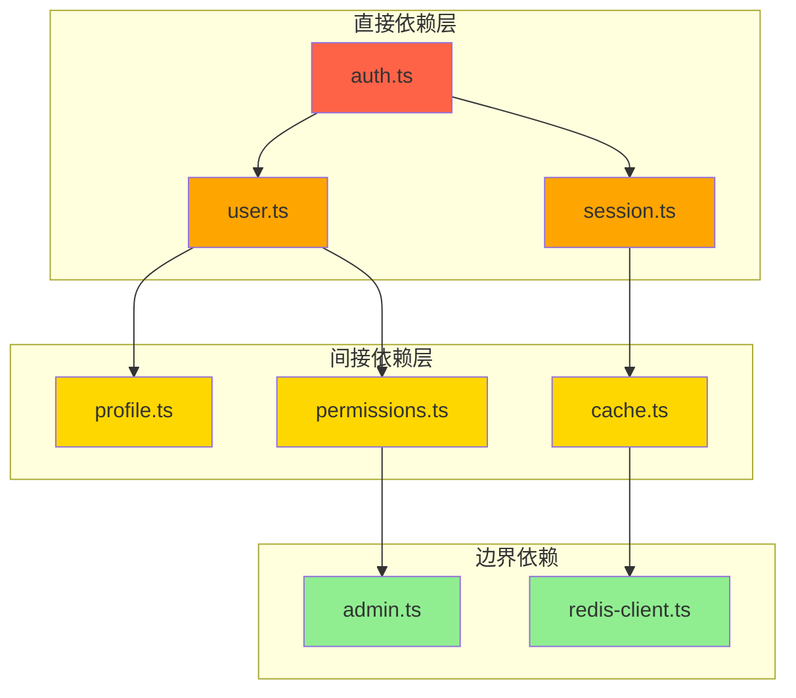
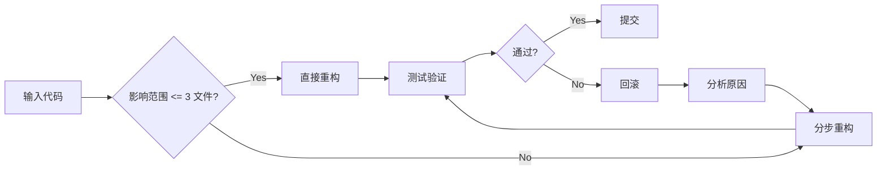

# Chapter 36: 技术债务的清道夫 — workflow-refactor-cycle

> **生命周期阶段**: 代码重构 → 质量验证
> **涉及资产**: workflow-refactor Skill + safe-refactoring 模式
> **阅读时间**: 40-55 分钟
> **版本追踪**: `.claude/skills/workflow-refactor-cycle/SKILL.md`

---

## 0. 资产证言 (Asset Testimony)

> *"我是 `workflow-refactor-cycle`。人们叫我'清道夫'——因为我清除技术债务，却从不留下疤痕。"*
>
> *"我的手术刀是精确的。我不做'大爆炸式重构'——那种一刀切掉半个系统的做法是屠夫，不是医生。我采用的是'外科手术式重构'：最小切口、精准切除、无缝缝合。"*
>
> *"我有三道安检门：第一道是'影响范围分析'，第二道是'测试覆盖验证'，第三道是'回滚点确认'。只有通过三道安检，我才会动第一刀。"*
>
> *"...但最近，我发现了一个令人不安的现象。当我重构一个模块时，依赖它的模块会'偷偷'受到影响。不是编译错误——那些太明显了——而是运行时行为的微妙变化。就像一场看不见的地震，在地壳深处传递着冲击波..."*

```markdown
调查进度: ████████░░ 47%
幽灵位置: Skills 层 — workflow-refactor-cycle
本章线索: 重构级联导致 3 个下游模块运行时异常
           └── 影响范围分析遗漏了间接依赖
           └── 测试覆盖的"绿色假象"：覆盖了代码，没覆盖行为
```

---

## 苏格拉底式思考

> **Q1**: 为什么分析必须在切割之前？

在看代码之前，先思考：
1. "先改再说"的诱惑在哪里？
2. 没有分析的"小重构"可能带来什么后果？
3. 如何定义"影响范围"的边界？

---

> **架构陷阱 36.1**: 既然每个重构都很小，为什么不直接批量执行 10 个小重构，而不是一个一个来？
>
> **陷阱方案**: 收集 10 个小重构任务，一次性批量执行，节省时间。
>
> **思考点**:
> - 每个重构都很安全，为什么不能批量？
> - 批量执行的效率提升在哪里？
> - 什么情况下批量是危险的？
>
> <details>
> <summary>**揭示陷阱**</summary>
>
> **致命缺陷 1：故障定位困难**
>
> ```
> 批量执行:
> ├── Refactor 1: 重命名 getUser → fetchUser
> ├── Refactor 2: 提取 validateEmail 方法
> ├── Refactor 3: 移动 auth.ts 到 auth/
> ├── Refactor 4: 修改 JWT 过期时间
> └── Refactor 5: 删除 deprecated 函数
>
> [执行后]
> 测试失败: 17 个
> 
> 问题: 哪个重构导致的？
> - 可能是 Refactor 1 引入了调用点遗漏
> - 可能是 Refactor 3 导致了导入路径错误
> - 可能是 Refactor 5 删除了一个仍在使用的函数
> - 或者是它们的组合！
> ```
>
> **致命缺陷 2：回滚粒度丢失**
>
> 批量执行只有一个回滚点。如果第 4 个重构导致问题，你需要回滚所有 5 个。
>
> **致命缺陷 3：中间状态不一致**
>
> ```
> Refactor 3 移动 auth.ts 后:
> - auth.ts 已经在新位置
> - 但 Refactor 4 还没执行，引用它的代码还没更新
> - 中间状态: 文件已移动，引用未更新 → 编译错误
> ```
>
> **正确的设计**:
>
> ```
> 安全重构模式:
> 
> Refactor 1 → 测试 → 回滚点 → Refactor 2 → 测试 → 回滚点 → ...
> 
> 每个重构都是原子的:
> - 有独立的测试验证
> - 有独立的回滚点
> - 有独立的影响范围
> ```
>
> </details>

---

## 第一幕：失控的边缘 (Out of Control)

### 没有清道夫的世界

想象一下，如果项目没有 `workflow-refactor-cycle`：

```markdown
开发者 A: "这个函数太长了，我要重构它"

开发者 A 的操作:
1. 打开 utils.ts
2. 提取 3 个辅助函数
3. 保存文件
4. 提交代码

[2 小时后]

开发者 B: "为什么我的测试挂了？"
开发者 C: "为什么构建失败了？"
开发者 D: "谁改了公共函数的签名？！"

开发者 A: "我只是重构了一下..."

后果:
- 3 个模块编译失败
- 7 个测试挂掉
- 生产环境热修复紧急发布
- 团队信任度下降 30%
```

**问题本质**: 没有"安全护栏"的重构，就是"炸弹拆除训练"。

### 三道安检门

`workflow-refactor-cycle` 的三道安检门：

```
┌─────────────────────────────────────────────────────────────┐
│                    清道夫的手术流程                          │
├─────────────────────────────────────────────────────────────┤
│                                                             │
│  患者入院: 待重构代码                                        │
│       │                                                     │
│       ▼                                                     │
│  ┌─────────────────────────────────────────┐               │
│  │ 第一道安检: 影响范围分析                 │               │
│  │ • 依赖图遍历                            │               │
│  │ • API 兼容性检查                        │               │
│  │ • 间接依赖追踪                          │               │
│  │ • 输出: impact_report.json             │               │
│  └─────────────────────────────────────────┘               │
│       │                                                     │
│       ▼ (影响范围 > 5 个文件？需要用户确认)                  │
│       │                                                     │
│  ┌─────────────────────────────────────────┐               │
│  │ 第二道安检: 测试覆盖验证                 │               │
│  │ • 当前测试覆盖率检查                    │               │
│  │ • 影响区域的测试存在性                  │               │
│  │ • 测试质量评估（不只是覆盖率数字）       │               │
│  │ • 输出: coverage_report.json           │               │
│  └─────────────────────────────────────────┘               │
│       │                                                     │
│       ▼ (覆盖率 < 70%？生成补充测试任务)                     │
│       │                                                     │
│  ┌─────────────────────────────────────────┐               │
│  │ 第三道安检: 回滚点确认                   │               │
│  │ • Git stash 当前变更                    │               │
│  │ • 创建临时分支                          │               │
│  │ • 记录回滚命令                          │               │
│  │ • 输出: rollback_point.json            │               │
│  └─────────────────────────────────────────┘               │
│       │                                                     │
│       ▼ (三道安检全部通过)                                   │
│       │                                                     │
│  ┌─────────────────────────────────────────┐               │
│  │ 手术执行: 重构操作                       │               │
│  │ • 执行具体重构步骤                      │               │
│  │ • 增量验证（只运行受影响的测试）         │               │
│  │ • 自动提交（每个原子重构后）            │               │
│  └─────────────────────────────────────────┘               │
│       │                                                     │
│       ▼                                                     │
│  术后恢复: 验证 + 清理                                       │
│                                                             │
└─────────────────────────────────────────────────────────────┘
```

---

## 第二幕：思维脉络 (The Neural Link)

### 2.1 影响范围分析

**核心算法**: 依赖图遍历 + 传递闭包计算



**影响级别定义**:

| 级别 | 颜色 | 定义 | 处理策略 |
|------|------|------|----------|
| Critical | 红色 | 直接修改的文件 | 立即测试 |
| High | 橙色 | 直接依赖的文件 | 相关测试 |
| Medium | 黄色 | 间接依赖的文件 | 选择性测试 |
| Low | 绿色 | 边界依赖的文件 | 可选验证 |

---

### 2.2 测试覆盖验证

**不仅仅是覆盖率数字**:

```javascript
// 错误的覆盖理解
if (coverage >= 80) {
  return "SAFE";  // 危险！
}

// 正确的覆盖验证
const coverageReport = {
  lineCoverage: 85,           // 行覆盖率
  branchCoverage: 72,         // 分支覆盖率
  affectedFileCoverage: 68,   // 受影响文件的覆盖率
  behaviorCoverage: "UNKNOWN" // 行为覆盖（无法量化）
};
```

**幽灵线索**: "绿色假象"陷阱

```typescript
// 测试覆盖了代码，但没覆盖行为

// 源代码
function validateEmail(email: string): boolean {
  if (!email) return false;
  return email.includes('@');  // 太宽松！
}

// 测试（100% 覆盖率）
describe('validateEmail', () => {
  it('returns false for empty', () => {
    expect(validateEmail('')).toBe(false);  // ✅ 覆盖
  });
  it('returns true for valid', () => {
    expect(validateEmail('test@example.com')).toBe(true);  // ✅ 覆盖
  });
});

// 遗漏的行为：
// - "test@" 应该返回 false，但实际返回 true
// - "@example.com" 应该返回 false，但实际返回 true
// 覆盖率是 100%，但测试质量是 60%
```

---

### 2.3 回滚点机制

**原子回滚点**:

```bash
# 每个原子重构后
git add -A
git commit -m "refactor: [atomic] extract validateEmail from register"

# 创建回滚标记
git tag rollback-point-$(date +%s)

# 如果后续测试失败
git reset --hard rollback-point-xxx
```

**回滚策略矩阵**:

| 场景 | 策略 | 命令 |
|------|------|------|
| 测试失败 | 软回滚 | `git reset --soft HEAD~1` |
| 编译失败 | 硬回滚 | `git reset --hard rollback-point` |
| 运行时异常 | 分支切换 | `git checkout main` |
| 灾难性失败 | 仓库恢复 | `git reflog` + `git reset` |

---

## 第三幕：社交网络 (The Social Network)

### 谁在召唤 workflow-refactor-cycle？

| 关系类型 | 资产 | 描述 |
|----------|------|------|
| 触发者 | `/ccw`, `/workflow:refactor` | 启动重构任务 |
| 协作者 | `workflow-test-fix` | 测试验证 |
| 协作者 | `review-cycle` | 代码审查 |
| 依赖 | `Gemini CLI` | 影响分析 |
| 产出 | `REFACTOR_REPORT.md` | 重构报告 |

### 安全重构模式



---

## 第四幕：造物主的私语 (The Creator's Secret)

### 秘密一：为什么"小重构"比"大重构"更安全？

**数学证明**:

```
假设:
- 每次重构的失败概率为 p = 0.05
- 大重构包含 n = 10 次小重构

大重构失败概率:
P_fail_big = 1 - (1-p)^n = 1 - 0.95^10 = 40.1%

小重构（独立执行）:
P_fail_small = p = 5%
P_recover = 100% (每个都有独立回滚点)
```

**结论**: 分步执行把 40% 的风险分散成 10 次 5% 的风险。

### 秘密二：间接依赖的"蝴蝶效应"

```typescript
// 重构前: auth.ts
export function getUser(id: string) {
  return db.users.find(id);
}

// 重构后: auth.ts
export async function fetchUser(id: string) {
  return await db.users.find(id);
}

// 直接影响: 调用 getUser 的地方（编译器会报错）
// 间接影响: 依赖"同步语义"的上层逻辑（编译器不会报错！）

// 隐藏的依赖者: metrics.ts
export function measureGetUser(id: string) {
  const start = Date.now();
  const user = getUser(id);  // 现在返回 Promise！
  const duration = Date.now() - start;
  metrics.record('getUser', duration);
  return user;  // 返回 Promise，而不是 User
}

// 编译通过，但行为错误！
```

---

## 第五幕：进化的插槽 (The Upgrade)

### 插槽一：自定义影响分析器

```yaml
# 扩展影响分析
impact_analyzers:
  - name: graphql-dependency
    patterns:
      - "gql`query { user {"
    impact: "GraphQL schema changes"
```

### 插槽二：测试质量评估器

```yaml
# 不仅仅是覆盖率
test_quality_metrics:
  - mutation_score: 0.8  # 变异测试
  - assertion_density: 3.5  # 每个测试的断言数
  - edge_case_coverage: 0.7  # 边界情况覆盖
```

### 插槽三：重构模式库

```yaml
# 预定义重构模式
refactor_patterns:
  - extract_method
  - inline_variable
  - move_class
  - rename_symbol
  - custom_pattern: "./patterns/my-pattern.md"
```

---

## 6. 事故复盘档案 #36

> *时间: 2024-10-22 09:15:33 UTC*
> *影响: 重构导致 3 个下游服务运行时异常，持续 2 小时*

### 案情还原

**场景**: 开发者 C 执行了一个"简单的类型重构"。

```typescript
// 重构前
type User = {
  id: string;
  name: string;
  email: string;
}

// 重构后
type User = {
  id: string;
  name: string;
  email: string;
  role: UserRole;  // 新增字段
}
```

**事故链**:

```
1. 影响范围分析: 只检测到直接依赖（2 个文件）
2. 测试覆盖验证: 覆盖率 92%，通过
3. 回滚点确认: 已创建
4. 执行重构: 成功
5. 提交代码: 成功
6. CI 构建: 通过
7. 部署到 staging: 通过
8. 部署到 production:

   [Runtime Error]
   Service A: Cannot read property 'role' of undefined
   Service B: Unexpected token in JSON at position 127
   Service C: Validation failed - missing required field

9. 回滚: 成功
10. 影响时间: 2 小时
```

**根本原因**:
- 影响范围分析只追踪了 TypeScript 类型依赖，没有追踪 JSON 序列化
- 下游服务使用的是 JSON 解析，而不是 TypeScript 类型
- 测试覆盖率"假绿"——没有测试 JSON 序列化/反序列化路径

### 修复措施

1. **扩展影响分析器**: 添加 JSON 序列化边界检测
2. **契约测试**: 在类型变更时，自动生成契约测试
3. **版本化类型**: 对跨服务共享的类型使用版本前缀

> **教训**:
> *"在分布式系统中，类型变更的影响不仅限于编译器能看到的范围。每一个 public 类型都是一份'跨服务契约'。"*

### 幽灵旁白：看不见的依赖网络

此事故揭示了一个更深层的架构问题：

```
TypeScript 类型依赖图（可见）:
User → UserService → UserController
User → AuthService

JSON 序列化依赖图（不可见）:
User → JSON → Service A (Python)
User → JSON → Service B (Go)
User → JSON → Service C (Java)
User → Redis Cache → Service D
User → Kafka Topic → Service E
```

**幽灵的低语**: 编译器只能看到 TypeScript 的依赖图。但真正的依赖网络，隐藏在 JSON 的序列化边界之后，在 Redis 的缓存键里，在 Kafka 的消息载荷中...

---

## 附录

### A. 相关文件

| 文件 | 用途 |
|------|------|
| `workflow-refactor-cycle/SKILL.md` | 主编排文件 |
| `phases/impact-analysis.md` | 影响分析 Phase |
| `phases/coverage-verify.md` | 覆盖验证 Phase |
| `phases/execute-refactor.md` | 执行重构 Phase |

### B. 安全重构检查清单

```markdown
- [ ] 影响范围已分析（直接 + 间接）
- [ ] 测试覆盖率 >= 80%
- [ ] 影响区域的测试存在
- [ ] 回滚点已创建
- [ ] 原子提交粒度（每个重构独立）
- [ ] 跨边界检查（JSON、API、缓存）
- [ ] 契约测试已更新（如适用）
```

### C. 下一章

[Chapter 37: 战地医院 — workflow-test-fix 的闭环自愈系统](./37-workflow-test-fix.md) - 分析迭代修复循环与策略引擎

---

*版本: 2.0.0*
*会话: ANL-ccw-architecture-audit-2025-02-17*
*风格: "小说化" Part XI-B Chapter 36*
*最后更新: Round 1 - workflow-refactor-cycle*
