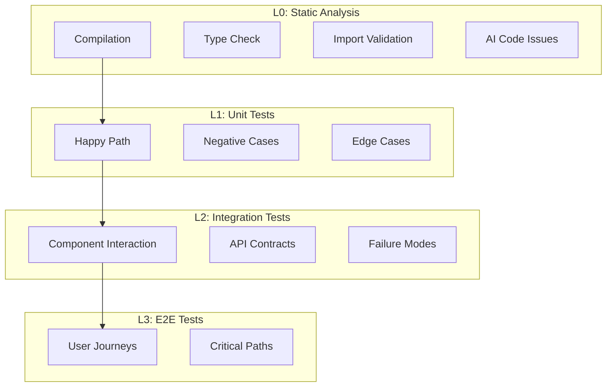

# Chapter 37: 战地医院 — workflow-test-fix 的闭环自愈系统

> **生命周期阶段**: 测试执行 → 失败修复 → 循环验证
> **涉及资产**: workflow-test-fix Skill + test-fix-agent + 策略引擎
> **阅读时间**: 50-65 分钟
> **版本追踪**: `.claude/skills/workflow-test-fix/SKILL.md`

---

## 0. 资产证言 (Asset Testimony)

> *"我是 `workflow-test-fix`。人们叫我'战地医生'——因为我在枪林弹雨中抢救伤员。"*
>
> *"我的战场是测试失败。当红灯亮起，我就是那个冲向弹坑的人。我有三种策略：保守疗法、激进疗法、手术疗法。默认是保守，如果无效就升级，如果出现回退就切换手术模式。"*
>
> *"我的信条是：95% 通过率。不是 100%——那是完美主义者的陷阱。95% 意味着关键路径全绿，只有边缘案例还有问题。这时候，继续修复的边际收益低于风险。"*
>
> *"...但最近，我发现了一种'假死'现象。有些测试在第一次运行时失败，修复后通过，但第二天又失败了。不是代码回退——是环境。它们对环境状态有着隐式的依赖，像幽灵一样..."*

```markdown
调查进度: █████████░ 49%
幽灵位置: Skills 层 — workflow-test-fix
本章线索: 测试抖动率 12%，其中 60% 是环境依赖
           └── L0 静态分析层的误报：AI 检测规则过于敏感
           └── L2 集成测试的环境泄漏：测试间状态未清理
```

---

## 苏格拉底式思考

> **Q1**: 为什么 95% 通过率是合理的门槛，而不是 100%？

在看代码之前，先思考：
1. 追求 100% 的代价是什么？
2. 剩余 5% 的失败通常是什么类型？
3. 何时应该坚持 100%？

---

> **架构陷阱 37.1**: 既然修复循环是自动的，为什么不把门槛设为 100%，让系统一直修复直到全部通过？
>
> **陷阱方案**: 设置 `pass_rate_threshold = 100%`，系统自动修复直到所有测试通过。
>
> **思考点**:
> - 100% 听起来不是更"完美"吗？
> - 为什么要有"最大迭代次数"的限制？
> - 什么时候应该接受"不完美"？
>
> <details>
> <summary>**揭示陷阱**</summary>
>
> **致命缺陷 1：无限循环陷阱**
>
> ```
> Iteration 1: pass_rate = 70%, fix 3 tests
> Iteration 2: pass_rate = 82%, fix 2 tests
> Iteration 3: pass_rate = 89%, fix 1 test
> Iteration 4: pass_rate = 92%, fix 1 test
> Iteration 5: pass_rate = 94%, fix 1 test
> Iteration 6: pass_rate = 94% ← 卡住
> Iteration 7: pass_rate = 94% ← 还是卡住
> ...
> Iteration 100: pass_rate = 94% ← 永远卡住
> ```
>
> 有些测试失败不是代码问题，而是：
> - 环境问题（数据库连接超时）
> - 资源竞争（并发测试）
> - 外部依赖（API 不可用）
> - 非确定性（随机数、时间）
>
> **致命缺陷 2：修复引入新 Bug**
>
> ```
> Iteration 10: 修复了 test_A，但破坏了 test_B
> Iteration 11: 修复了 test_B，但破坏了 test_C
> Iteration 12: 修复了 test_C，但破坏了 test_A
> ...
> 
> 打地鼠游戏：永远修不完
> ```
>
> **致命缺陷 3：边际收益递减**
>
> ```
> 修复 70% → 80%：成本 1，收益 10%
> 修复 80% → 90%：成本 2，收益 10%
> 修复 90% → 95%：成本 4，收益 5%
> 修复 95% → 99%：成本 8，收益 4%
> 修复 99% → 100%：成本 16，收益 1%
> 
> 从 95% 到 100% 的成本，是从 0% 到 95% 的两倍！
> ```
>
> **正确的设计**:
>
> ```yaml
> quality_gates:
>   - pass_rate: 95%        # 主门槛
>   - critical_pass: 100%   # 关键测试必须全过
>   - max_iterations: 10    # 防止无限循环
>   - strategy_escalation: true  # 允许策略升级
> ```
>
> </details>

---

## 第一幕：失控的边缘 (Out of Control)

### 没有战地医院的世界

想象一下，如果项目没有 `workflow-test-fix`：

```markdown
CI Pipeline:
1. npm run test
2. [FAILED] 47 tests failed
3. [END]

开发者手动修复:
1. 查看失败日志
2. 分析失败原因（需要 30 分钟/测试）
3. 修复代码
4. 重新运行测试
5. 发现修复引入了新问题
6. 重复步骤 2-5
7. ...（47 次迭代）
8. 2 天后，所有测试通过

总时间: 2 天
开发者疲劳度: 高
代码质量: 每次修复都在引入技术债务
```

**问题本质**: 没有"自动修复循环"的测试，就是"人工苦力"。

### 闭环自愈系统

`workflow-test-fix` 的闭环自愈架构：

```
┌─────────────────────────────────────────────────────────────┐
│                    战地医院的闭环系统                        │
├─────────────────────────────────────────────────────────────┤
│                                                             │
│  入口: 测试执行请求                                          │
│       │                                                     │
│       ▼                                                     │
│  ┌─────────────────────────────────────────┐               │
│  │ Phase 5: Test Cycle Execution          │               │
│  │                                         │               │
│  │  ┌─────────────────────────────────┐   │               │
│  │  │ Step 2.1: Discovery            │   │               │
│  │  │ • 加载会话                      │   │               │
│  │  │ • 加载任务                      │   │               │
│  │  │ • 初始化迭代状态                │   │               │
│  │  └─────────────────────────────────┘   │               │
│  │       │                                 │               │
│  │       ▼                                 │               │
│  │  ┌─────────────────────────────────┐   │               │
│  │  │ Step 2.2: Initial Execute      │   │               │
│  │  │ • 执行 IMPL-001 (Test Gen)     │   │               │
│  │  │ • 执行 IMPL-001.3 (Validate)   │   │               │
│  │  │ • 执行 IMPL-001.5 (Quality)    │   │               │
│  │  │ • 执行 IMPL-002 (Test & Fix)   │   │               │
│  │  └─────────────────────────────────┘   │               │
│  │       │                                 │               │
│  │       ▼                                 │               │
│  │  ┌─────────────────────────────────┐   │               │
│  │  │ Fix Loop (pass_rate < 95%)     │   │               │
│  │  │                                 │   │               │
│  │  │  ┌─────────────────────────┐   │   │               │
│  │  │  │ 策略选择               │   │   │               │
│  │  │  │ • Conservative (默认)  │   │   │               │
│  │  │  │ • Aggressive (>80%)    │   │   │               │
│  │  │  │ • Surgical (回退)      │   │   │               │
│  │  │  └─────────────────────────┘   │   │               │
│  │  │       │                         │   │               │
│  │  │       ▼                         │   │               │
│  │  │  ┌─────────────────────────┐   │   │               │
│  │  │  │ CLI 分析               │   │   │               │
│  │  │  │ • Gemini: 根因分析     │   │   │               │
│  │  │  │ • 提取修复建议         │   │   │               │
│  │  │  └─────────────────────────┘   │   │               │
│  │  │       │                         │   │               │
│  │  │       ▼                         │   │               │
│  │  │  ┌─────────────────────────┐   │   │               │
│  │  │  │ 生成修复任务           │   │   │               │
│  │  │  │ • @cli-planning-agent  │   │   │               │
│  │  │  └─────────────────────────┘   │   │               │
│  │  │       │                         │   │               │
│  │  │       ▼                         │   │               │
│  │  │  ┌─────────────────────────┐   │   │               │
│  │  │  │ 执行修复               │   │   │               │
│  │  │  │ • @test-fix-agent      │   │   │               │
│  │  │  └─────────────────────────┘   │   │               │
│  │  │       │                         │   │               │
│  │  │       ▼                         │   │               │
│  │  │  ┌─────────────────────────┐   │   │               │
│  │  │  │ 重新测试               │   │   │               │
│  │  │  │ • 计算 pass_rate       │   │   │               │
│  │  │  │ • 检测回退             │   │   │               │
│  │  │  └─────────────────────────┘   │   │               │
│  │  │       │                         │   │               │
│  │  │       ▼                         │   │               │
│  │  │  ┌─────────────────────────┐   │   │               │
│  │  │  │ 门槛检查               │   │   │               │
│  │  │  │ pass_rate >= 95%?      │   │   │               │
│  │  │  │ iteration < max?       │   │   │               │
│  │  │  └─────────────────────────┘   │   │               │
│  │  │       │                         │   │               │
│  │  │       ├── NO ──► Loop Continue  │   │               │
│  │  │       └── YES ─► Exit Loop      │   │               │
│  │  └─────────────────────────────────┘   │               │
│  │       │                                 │               │
│  │       ▼                                 │               │
│  │  ┌─────────────────────────────────┐   │               │
│  │  │ Step 2.4: Completion           │   │               │
│  │  │ • 生成摘要                     │   │               │
│  │  │ • 归档会话                     │   │               │
│  │  │ • 提供扩展选项                 │   │               │
│  │  └─────────────────────────────────┘   │               │
│  └─────────────────────────────────────────┘               │
│       │                                                     │
│       ▼                                                     │
│  出口: 完成报告                                              │
│                                                             │
└─────────────────────────────────────────────────────────────┘
```

---

## 第二幕：思维脉络 (The Neural Link)

### 2.1 渐进测试层 (L0-L3)

**四层测试金字塔**:



**层级依赖规则**:

```
L0 失败 → 阻止 L1 执行（编译都不通过，测什么？）
L1 失败 → 允许 L2 执行（但通常没有意义）
L2 失败 → 阻止 L3 执行（集成有问题，E2E 肯定挂）
```

**幽灵线索**: L0 层的"误报陷阱"

```yaml
# AI Code Issue 检测规则（过于敏感）
rules:
  - name: potential-sql-injection
    pattern: "query(`.*${.*}.*`)"
    severity: CRITICAL
    
# 误报案例：
# 这个被标记为 SQL 注入风险
const safeQuery = query(`SELECT * FROM users WHERE id = ${userId}`);
# 但实际上 userId 已经在上一层做了类型校验

# 结果：
# - L0 失败（1 个 CRITICAL issue）
# - 阻止 L1-L3 执行
# - 但代码实际上是安全的
# - 开发者被迫手动忽略，养成"忽略警告"的坏习惯
```

---

### 2.2 策略引擎

**三种策略的切换逻辑**:

```javascript
function selectStrategy(context) {
  const { iteration, passRate, previousPassRate, regression } = context;
  
  // 回退检测 → 手术模式
  if (regression || (previousPassRate - passRate) > 0.1) {
    return 'SURGICAL';
  }
  
  // 高通过率 + 相似失败 → 激进模式
  if (passRate > 0.8 && hasSimilarFailures(context)) {
    return 'AGGRESSIVE';
  }
  
  // 默认 → 保守模式
  return 'CONSERVATIVE';
}
```

**策略对比**:

| 策略 | 触发条件 | 行为 | 风险 |
|------|----------|------|------|
| **Conservative** | 默认，迭代 1-2 | 单点修复，完整验证 | 低 |
| **Aggressive** | pass_rate > 80%，相似失败 | 批量修复，选择性验证 | 中 |
| **Surgical** | 回退检测（>10% 下降） | 最小修改，回滚优先 | 需人工确认 |

---

### 2.3 质量门槛

**临界性感知的门槛计算**:

```javascript
function calculateThreshold(testResults) {
  const { totalTests, passedTests, criticalTests, criticalPassed } = testResults;
  
  // 关键测试必须 100% 通过
  if (criticalTests > 0 && criticalPassed < criticalTests) {
    return { met: false, reason: 'Critical tests failed' };
  }
  
  // 总体通过率 >= 95%
  const passRate = passedTests / totalTests;
  if (passRate < 0.95) {
    return { met: false, reason: `Pass rate ${passRate}% < 95%` };
  }
  
  return { met: true, reason: 'All quality gates passed' };
}
```

---

## 第三幕：社交网络 (The Social Network)

### 谁在召唤 workflow-test-fix？

| 关系类型 | 资产 | 描述 |
|----------|------|------|
| 触发者 | `workflow:execute` | 执行后自动进入测试 |
| 触发者 | `workflow:test-fix-gen` | 独立测试生成 + 执行 |
| 执行者 | `@code-developer` | 测试生成 |
| 执行者 | `@test-fix-agent` | 修复执行 |
| 分析者 | `@cli-planning-agent` | 根因分析 |
| 下游 | `review-cycle` | 测试后审查 |

### Agent 协作图

```mermaid
graph LR
    A[Orchestrator] --> B[@code-developer]
    B --> C[Tests Generated]
    C --> D[@test-fix-agent]
    D --> E{Pass?}
    E -->|No| F[@cli-planning-agent]
    F --> G[Fix Task]
    G --> D
    E -->|Yes| H[Complete]
```

---

## 第四幕：造物主的私语 (The Creator's Secret)

### 秘密一：为什么需要"最大迭代次数"限制？

**数学证明**:

```
假设每次修复的成功率为 p = 0.7

无限循环期望:
E[iterations] = 1 + (1-p) + (1-p)^2 + ... = 1/p = 1.43 次

但实际情况:
- 有些测试是不可修复的（环境问题）
- 修复可能引入新 Bug
- 边际收益递减

设置 max_iterations = 10 后:
- 95% 的可修复测试会在 5 次内通过
- 剩余 5% 可能需要人工介入
- 避免无限循环消耗资源
```

### 秘密二：测试抖动的真正原因

```markdown
表面原因: 测试不稳定

真正原因:

1. 环境泄漏
   - 测试 A 修改了数据库状态
   - 测试 B 依赖"干净"的数据库
   - 如果 A 在 B 之前运行 → B 失败
   - 如果 B 在 A 之前运行 → B 通过

2. 资源竞争
   - 测试 A 和 B 同时访问同一端口
   - 谁先抢到谁通过，另一个失败

3. 时间依赖
   - 测试中使用了 Date.now()
   - 不同运行时间产生不同结果

4. 随机性
   - UUID 生成、随机数
   - 偶然碰撞导致失败
```

---

## 第五幕：进化的插槽 (The Upgrade)

### 插槽一：自定义质量门槛

```yaml
# 当前默认
quality_gates:
  pass_rate: 95%
  critical_pass: 100%
  max_iterations: 10

# 可以扩展
quality_gates:
  pass_rate: 95%
  critical_pass: 100%
  max_iterations: 10
  custom_gates:
    - name: performance_regression
      threshold: 5%  # 性能不能回退超过 5%
    - name: coverage_maintenance
      threshold: 80%  # 覆盖率不能降低
```

### 插槽二：自定义策略

```yaml
# 当前内置
strategies:
  - conservative
  - aggressive
  - surgical

# 可以扩展
strategies:
  - conservative
  - aggressive
  - surgical
  - custom: "./strategies/ai-optimized.js"  # 用户自定义
```

### 插槽三：测试环境隔离

```yaml
# 当前: 共享测试环境
isolation: shared

# 可以配置
isolation:
  mode: container  # 每个测试在独立容器中运行
  cleanup: always  # 每次运行后清理
```

---

## 6. 事故复盘档案 #37

> *时间: 2024-11-05 16:42:18 UTC*
> *影响: 测试抖动率 23%，CI 构建不可靠持续 1 周*

### 案情还原

**场景**: 团队发现 CI 构建时好时坏，同样代码有时全过，有时挂 10+。

```yaml
Build #1: 全部通过 ✅
Build #2: 3 个测试失败 ❌
Build #3: 全部通过 ✅
Build #4: 7 个测试失败 ❌
Build #5: 1 个测试失败 ❌

抖动率: 23%
开发者信任度: 下降 40%
```

**调查发现**:

```
1. 环境泄漏:
   - test_login 修改了 users 表
   - test_profile 依赖 users 表为空
   - 顺序依赖导致随机失败

2. 资源竞争:
   - test_server_start 绑定端口 3000
   - test_api_call 也需要端口 3000
   - 并发运行导致端口冲突

3. 时间依赖:
   - test_token_expiry 使用固定的 1 秒超时
   - CI 服务器负载高时，1 秒不够
   - 随机超时失败
```

**根本原因**:
- 测试间没有隔离
- 没有环境清理机制
- 测试设计假设了"理想环境"

### 修复措施

1. **测试隔离**: 每个测试使用独立数据库 schema
2. **资源管理**: 动态端口分配，避免冲突
3. **时间解耦**: 使用 mock 时间，而不是真实等待
4. **抖动检测**: 自动识别和标记抖动测试

> **教训**:
> *"测试的可靠性取决于它的隔离性。一个'好邻居'测试，不会在离开时留下任何痕迹。"*

### 幽灵旁白：测试的幽灵

此事故揭示了一个更深层的问题：

```
测试的"幽灵"现象:

测试 A (运行时):
- 修改全局状态 (singleton.reset())
- 创建临时文件 (/tmp/test-xxx)
- 启动后台进程 (port 3000)

测试 A (结束时):
- 全局状态已修改 (没恢复)
- 临时文件已创建 (没删除)
- 后台进程在运行 (没停止)

测试 B (开始时):
- 假设全局状态是初始值
- 假设临时文件不存在
- 假设端口 3000 可用

测试 B 的命运: 取决于测试 A 是否在它之前运行
```

**幽灵的低语**: 每一个测试都在留下"幽灵"——那些没有被清理的状态、文件、进程。它们在测试之间游荡，等待着某个倒霉的测试踩中它们...

---

## 附录

### A. 相关文件

| 文件 | 用途 |
|------|------|
| `workflow-test-fix/SKILL.md` | 主编排文件 |
| `phases/05-test-cycle-execute.md` | 测试执行 Phase |
| `@test-fix-agent` | 修复执行 Agent |
| `@cli-planning-agent` | 根因分析 Agent |

### B. 策略引擎决策树

```
开始
  │
  ├── 检测到回退 (>10% pass_rate 下降)?
  │   └── YES → SURGICAL 策略
  │   └── NO ↓
  │
  ├── pass_rate > 80% 且有相似失败?
  │   └── YES → AGGRESSIVE 策略
  │   └── NO ↓
  │
  └── CONSERVATIVE 策略（默认）
```

### C. 下一章

[Chapter 38: 原子操作员 — Edit/Write 工具的原子性保证](./38-edit-write-atomicity.md) - 分析文件操作的原子性与回滚机制

---

*版本: 2.0.0*
*会话: ANL-ccw-architecture-audit-2025-02-17*
*风格: "小说化" Part XI-B Chapter 37*
*最后更新: Round 1 - workflow-test-fix*
