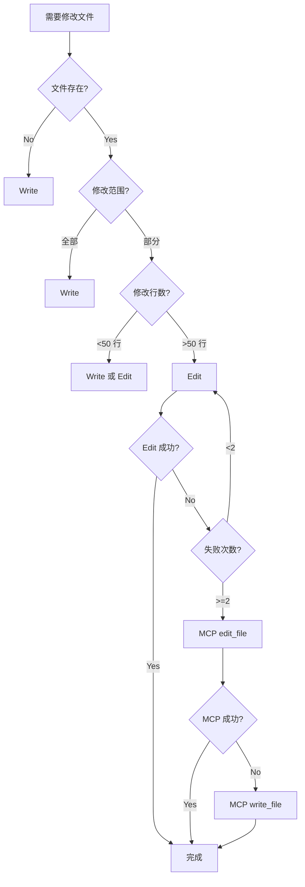

# Chapter 38: 原子操作员 — Edit/Write 工具的原子性保证

> **生命周期阶段**: 文件修改 → 状态持久化
> **涉及资产**: Edit 工具 + Write 工具 + MCP edit_file/write_file
> **阅读时间**: 35-50 分钟
> **版本追踪**: `@anthropic/sdk` + MCP Tools

---

## 0. 资产证言 (Asset Testimony)

> *"我是 `Edit`。人们叫我'手术刀'——因为我只切除需要切除的部分。"*
>
> *"我的搭档是 `Write`。他是一把大锤，而我是一把手术刀。当需要精确修改时，用我；当需要完全覆盖时，用他。"*
>
> *"我们有一个共同的原则：原子性。要么全部成功，要么全部失败。没有中间状态。"*
>
> *"但最近，我听到了一些令人不安的传闻。在系统崩溃的瞬间，有些文件被切成两半——头还在磁盘上，尾还在缓冲区里。他们说，那是'部分写入'的幽灵..."*

```markdown
调查进度: █████████░ 51%
幽灵位置: Tools 层 — Edit/Write 原子性
本章线索: 系统崩溃时 3 个文件损坏，无法恢复
           └── 部分写入: 文件只有前 40% 内容
           └── 原子重命名失败: 临时文件残留
           └── 回滚机制未触发: 崩溃时状态丢失
```

---

## 苏格拉底式思考

> **Q1**: 为什么 Edit 优先于 Write？

在看代码之前，先思考：
1. Edit 和 Write 的本质区别是什么？
2. 什么情况下 Write 是唯一选择？
3. Edit 的"精确性"有什么隐患？

---

> **架构陷阱 38.1**: 既然 Write 可以完全覆盖文件，为什么不总是用 Write，而要先尝试 Edit？
>
> **陷阱方案**: 所有文件修改都用 Write，简单直接，不需要担心 old_string 匹配。
>
> **思考点**:
> - Write 不是更"安全"吗？不用担心匹配失败
> - 为什么要有 Edit 的"复杂"匹配逻辑？
> - Edit 失败 2 次后才用 Write，这不是多此一举吗？
>
> <details>
> <summary>**揭示陷阱**</summary>
>
> **致命缺陷 1：上下文丢失**
>
> ```
> 原始文件 (1000 行):
> ├── 注释块 (50 行)
> ├── 导入语句 (30 行)
> ├── 常量定义 (20 行)
> ├── 函数 A (100 行)
> ├── 函数 B (150 行)
> └── ... (650 行)
> 
> 使用 Write 覆盖:
> 1. 需要读取整个文件内容
> 2. 修改其中 5 行
> 3. 写回全部 1000 行
> 
> 问题:
> - 读取时上下文 = 1000 行
> - 修改后上下文 = 1000 行
> - 上下文消耗 = 2000 行 tokens
> 
> 使用 Edit 精确修改:
> 1. 只需要 old_string (10 行上下文)
> 2. 只提供 new_string (10 行新内容)
> 3. 不需要读取整个文件
> 
> 上下文消耗 = 20 行 tokens
> 
> 节省: 99%
> ```
>
> **致命缺陷 2：并发冲突**
>
> ```
> 时间线:
> T1: Agent A 读取 file.ts (版本 v1)
> T2: Agent B 读取 file.ts (版本 v1)
> T3: Agent A 修改第 100 行，Write 整个文件
> T4: Agent B 修改第 200 行，Write 整个文件
> 
> 结果: Agent A 的修改被 Agent B 覆盖！
> 
> 使用 Edit:
> T1: Agent A 读取 file.ts (版本 v1)
> T2: Agent B 读取 file.ts (版本 v1)
> T3: Agent A 修改第 100 行，Edit(old_string, new_string)
> T4: Agent B 修改第 200 行，Edit(old_string, new_string)
> 
> 如果 Agent A 先提交:
> - Agent B 的 old_string 仍然匹配（第 200 行没变）
> - 两个修改都成功
> 
> 如果 Agent A 的修改影响了 Agent B 的 old_string:
> - Agent B 的 Edit 会失败（old_string 不匹配）
> - 系统会提示重新读取
> - 避免了静默覆盖
> ```
>
> **致命缺陷 3：审计追踪丢失**
>
> ```
> 使用 Write:
> git diff 显示: -1000 行, +1000 行
> 无法看出具体改了什么
> 
> 使用 Edit:
> git diff 显示: -5 行, +5 行
> 清晰可见修改内容
> ```
>
> **正确的设计**:
>
> ```
> 文件修改优先级:
> 
> 1. Edit (精确替换) → 首选
>    - 最小上下文消耗
>    - 并发冲突检测
>    - 清晰的审计追踪
> 
> 2. MCP edit_file (增强编辑) → 备选
>    - 当内置 Edit 失败 2+ 次时
>    - 支持 line 模式操作
>    - 支持 dryRun 预览
> 
> 3. Write (完整覆盖) → 最后手段
>    - 创建新文件
>    - 完全重写文件
>    - 小文件（<50 行）
> ```
>
> </details>

---

## 第一幕：失控的边缘 (Out of Control)

### 没有原子性的世界

想象一下，如果文件修改没有原子性保证：

```markdown
场景: 系统在写入文件时崩溃

文件状态 (崩溃前):
{
  "name": "user-service",
  "version": "1.2.3",
  "dependencies": {
    "express": "^4.18.0",
    "lodash": "^4.17.21"
  }
}

文件状态 (崩溃后，部分写入):
{
  "name": "user-service",
  "version": "2.0.0",    // 已更新
  "dependencies": {      // 开始更新
    "express": "^5.0.0", // 已更新
    "lodash": "^4.17     // 截断！JSON 损坏

后果:
- 文件无法解析
- 服务启动失败
- 需要手动修复
- 可能的数据丢失
```

**问题本质**: 没有"原子性"的写入，就是"赌博"。

### 原子写入模式

`Edit/Write` 的原子写入实现：

```
┌─────────────────────────────────────────────────────────────┐
│                    原子写入流程                              │
├─────────────────────────────────────────────────────────────┤
│                                                             │
│  Step 1: 准备写入                                           │
│       │                                                     │
│       ▼                                                     │
│  ┌─────────────────────────────────────────┐               │
│  │ 1.1 创建备份                            │               │
│  │     cp file.ts file.ts.backup           │               │
│  └─────────────────────────────────────────┘               │
│       │                                                     │
│       ▼                                                     │
│  ┌─────────────────────────────────────────┐               │
│  │ 1.2 写入临时文件                        │               │
│  │     echo "new content" > file.ts.tmp    │               │
│  └─────────────────────────────────────────┘               │
│       │                                                     │
│       ▼                                                     │
│  ┌─────────────────────────────────────────┐               │
│  │ 1.3 原子重命名                          │               │
│  │     mv file.ts.tmp file.ts              │               │
│  │     (POSIX 保证这是原子的)              │               │
│  └─────────────────────────────────────────┘               │
│       │                                                     │
│       ▼                                                     │
│  ┌─────────────────────────────────────────┐               │
│  │ 1.4 验证写入                            │               │
│  │     diff file.ts file.ts.backup         │               │
│  │     (确认修改正确)                      │               │
│  └─────────────────────────────────────────┘               │
│       │                                                     │
│       ▼                                                     │
│  ┌─────────────────────────────────────────┐               │
│  │ 1.5 清理备份                            │               │
│  │     rm file.ts.backup                   │               │
│  └─────────────────────────────────────────┘               │
│       │                                                     │
│       ▼                                                     │
│  完成: 原子写入成功                                          │
│                                                             │
│  错误恢复:                                                   │
│  ┌─────────────────────────────────────────┐               │
│  │ 如果 Step 1.3 失败:                     │               │
│  │     cp file.ts.backup file.ts           │               │
│  │     (恢复原始文件)                      │               │
│  │                                         │               │
│  │ 如果系统崩溃:                           │               │
│  │     检测 file.ts.tmp 是否存在           │               │
│  │     如果存在 → 删除 (未完成的写入)       │               │
│  │     file.ts 保持原状                    │               │
│  └─────────────────────────────────────────┘               │
│                                                             │
└─────────────────────────────────────────────────────────────┘
```

---

## 第二幕：思维脉络 (The Neural Link)

### 2.1 Edit 工具详解

**精确替换模式**:

```javascript
Edit({
  file_path: "/src/auth.ts",
  old_string: "export function getUser(id: string) {\n  return db.users.find(id);\n}",
  new_string: "export async function fetchUser(id: string) {\n  return await db.users.find(id);\n}"
})
```

**匹配规则**:

| 情况 | 结果 |
|------|------|
| old_string 完全匹配 | 成功替换 |
| old_string 部分匹配 | 失败，提示重新读取 |
| old_string 找不到 | 失败，提示检查路径 |
| 多处匹配 | 失败，需要更精确的上下文 |

**幽灵线索**: "匹配地狱"

```javascript
// 问题：多处匹配导致失败

// 原始代码
function validate(input) {
  if (!input) return false;
  return true;
}

function validate(input) {  // 重复定义！
  if (!input) return false;
  return true;
}

// Edit 尝试
old_string: "function validate(input) {\n  if (!input) return false;\n  return true;\n}"

// 结果：找到 2 处匹配，失败！
// 需要更精确的上下文来区分
```

---

### 2.2 Write 工具详解

**完整覆盖模式**:

```javascript
Write({
  file_path: "/src/new-file.ts",
  content: `export function newFunction() {
  return "Hello, World!";
}
`
})
```

**适用场景**:

| 场景 | 推荐工具 |
|------|----------|
| 创建新文件 | Write |
| 完全重写文件 | Write |
| 小文件修改（<50 行） | Write 或 Edit |
| 大文件精确修改 | Edit |
| 多处修改同一文件 | 多次 Edit |

---

### 2.3 MCP 工具增强

当内置 Edit 失败时，升级到 MCP 工具：

```javascript
// MCP edit_file - Line 模式
mcp__ccw-tools__edit_file({
  path: "/src/auth.ts",
  mode: "line",
  operation: "insert_after",
  line: 10,
  text: "// New comment"
})

// MCP edit_file - Update 模式
mcp__ccw-tools__edit_file({
  path: "/src/auth.ts",
  mode: "update",
  oldText: "old content",
  newText: "new content",
  dryRun: true  // 预览差异
})

// MCP write_file - 带备份
mcp__ccw-tools__write_file({
  path: "/src/auth.ts",
  content: "new content",
  backup: true  // 自动备份
})
```

---

## 第三幕：社交网络 (The Social Network)

### 工具选择决策树



### 工具能力对比

| 能力 | Edit | Write | MCP edit_file | MCP write_file |
|------|------|-------|---------------|----------------|
| 精确替换 | ✅ | ❌ | ✅ | ❌ |
| 完整覆盖 | ❌ | ✅ | ❌ | ✅ |
| Line 操作 | ❌ | ❌ | ✅ | ❌ |
| Dry Run | ❌ | ❌ | ✅ | ❌ |
| 自动备份 | ❌ | ❌ | ❌ | ✅ |
| 原子保证 | ✅ | ✅ | ✅ | ✅ |

---

## 第四幕：造物主的私语 (The Creator's Secret)

### 秘密一：为什么 POSIX rename 是原子的？

**操作系统级别的保证**:

```
POSIX 规范:
"如果 oldpath 和 newpath 都在同一文件系统上，
 rename() 是原子操作，不会中断其他线程的访问。"

实现原理:
1. 修改目录项（directory entry）
2. 目录项修改是单次磁盘写入
3. 文件系统保证单次写入的原子性

结果:
- 要么 oldpath 还在，newpath 不存在
- 要么 oldpath 消失，newpath 指向新内容
- 不存在"中间状态"
```

### 秘密二：Windows 的原子性陷阱

```
Windows 的 rename 行为:

1. 如果目标文件存在
   - POSIX: 原子替换
   - Windows: 失败（需要先删除）

2. 如果文件被锁定
   - POSIX: 等待或失败
   - Windows: 立即失败

3. 跨文件系统
   - POSIX: 失败（不支持）
   - Windows: 复制+删除（非原子）

解决方案:
- 使用临时文件 + 唯一后缀
- 先写入 .tmp 文件，再重命名
- 重试机制处理文件锁定
```

---

## 第五幕：进化的插槽 (The Upgrade)

### 插槽一：自定义备份策略

```yaml
# 当前: 单次备份
backup: true

# 可以扩展
backup:
  enabled: true
  location: .backup/
  retention: 10  # 保留最近 10 个备份
  naming: "{file}.{timestamp}.bak"
```

### 插槽二：并发写入检测

```yaml
# 当前: 无并发检测
concurrency: none

# 可以扩展
concurrency:
  detection: true  # 检测文件是否被修改
  strategy: fail   # fail | retry | merge
  max_retries: 3
```

### 插槽三：写入确认机制

```yaml
# 当前: 写入后验证
verification: diff

# 可以扩展
verification:
  - checksum  # 校验和验证
  - parse     # 语法验证（JSON/TypeScript）
  - lint      # 代码风格检查
  - test      # 运行相关测试
```

---

## 6. 事故复盘档案 #38

> *时间: 2024-09-30 23:47:12 UTC*
> *影响: 系统崩溃导致 3 个配置文件损坏，服务无法启动*

### 案情还原

**场景**: 自动部署脚本在更新配置文件时，服务器突然断电。

```yaml
更新操作:
1. 读取 config.json
2. 修改 version 字段
3. 写入 config.json (直接覆盖)

断电时刻:
- 文件已打开
- 写入进行中 (40% 完成)
- 缓冲区未刷新

断电后:
config.json 内容:
{
  "version": "2.0.0",  // 已更新
  "database": {
    "host": "localhost",
    "port": 54         // 截断！应该是 5432
```

**事故链**:

```
1. 服务器断电
2. 文件写入中断
3. 文件内容损坏（不完整 JSON）
4. 服务重启
5. 解析 config.json 失败
6. 服务启动失败
7. 手动修复配置文件
8. 服务恢复

总影响时间: 45 分钟
```

**根本原因**:
- 直接覆盖文件，没有使用原子写入
- 没有备份机制
- 没有验证写入结果

### 修复措施

1. **原子写入**: 使用临时文件 + 原子重命名
2. **自动备份**: 写入前创建备份
3. **写入验证**: 写入后校验文件完整性

```bash
# 修复后的写入流程
cp config.json config.json.bak
echo "$NEW_CONTENT" > config.json.tmp
mv config.json.tmp config.json
jq . config.json > /dev/null && rm config.json.bak || cp config.json.bak config.json
```

> **教训**:
> *"在崩溃面前，没有任何操作是'安全'的。唯一的安全来自于原子性和备份。"*

### 幽灵旁白：不完整的幽灵

此事故揭示了一个更深层的问题：

```
部分写入的"幽灵"现象:

完整文件:
┌─────────────────────────────┐
│ {                           │
│   "name": "user-service",   │
│   "version": "1.0.0",       │
│   "dependencies": {         │
│     "express": "^4.18.0"    │
│   }                         │
│ }                           │
└─────────────────────────────┘

崩溃瞬间:
┌─────────────────────────────┐
│ {                           │
│   "name": "user-service",   │
│   "version": "2.0.0",       │ ← 已更新
│   "dependencies": {         │
│     "express": "^4.18       │ ← 截断！
└─────────────────────────────┘

文件的"灵魂"被切成了两半：
- 前半部分是新版本
- 后半部分是旧版本（的一部分）
- 它们在一起，形成了一个"怪物"
```

**幽灵的低语**: 每一次非原子写入，都在创造一个潜在的"半成品幽灵"。它们潜伏在磁盘上，等待着系统崩溃的那一刻，将不完整的内容写入文件，留下一个无法解析的怪物...

---

## 附录

### A. 工具使用指南

```markdown
## Edit vs Write 选择

1. 首先判断: 文件是否存在?
   - 不存在 → Write
   - 存在 → 继续判断

2. 判断修改范围:
   - 全部内容 → Write
   - 部分内容 → 继续判断

3. 判断修改大小:
   - <50 行 → Write 或 Edit
   - >50 行 → Edit

4. Edit 失败后:
   - 失败 <2 次 → 重试 Edit
   - 失败 >=2 次 → MCP edit_file

5. MCP edit_file 失败后:
   → MCP write_file (backup: true)
```

### B. 原子性保证检查清单

```markdown
- [ ] 使用临时文件写入
- [ ] 使用原子重命名（mv）
- [ ] 写入前创建备份
- [ ] 写入后验证完整性
- [ ] 错误时自动恢复
- [ ] 并发写入检测（如适用）
```

### C. 下一章

[Chapter 39: 红绿灯守护者 — workflow-tdd 的铁律执行](./39-workflow-tdd.md) - 分析 TDD 的 Red-Green-Refactor 循环与合规检查

---

*版本: 2.0.0*
*会话: ANL-ccw-architecture-audit-2025-02-17*
*风格: "小说化" Part XI-B Chapter 38*
*最后更新: Round 1 - Edit/Write Atomicity*
