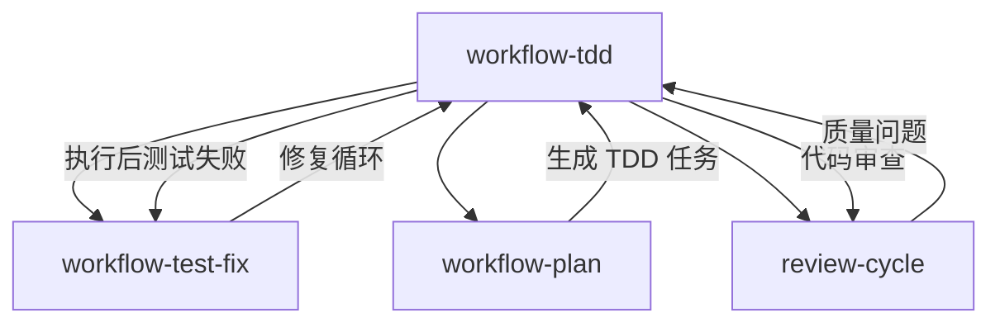

# Chapter 39: 红绿灯守护者 — workflow-tdd 的铁律执行

> **生命周期阶段**: 测试先行 → 代码实现 → 重构优化
> **涉及资产**: workflow-tdd Skill + TDD Iron Law + Red-Green-Refactor
> **阅读时间**: 55-70 分钟
> **版本追踪**: `.claude/skills/workflow-tdd/SKILL.md`

---

## 0. 资产证言 (Asset Testimony)

> *"我是 `workflow-tdd`。人们叫我'红绿灯守护者'——因为我守护着最神圣的法则。"*
>
> *"铁律是刻在我基因里的：NO PRODUCTION CODE WITHOUT A FAILING TEST FIRST。"*
>
> *"我有三个阶段：红灯（测试失败）、绿灯（测试通过）、重构（优化代码）。这三个阶段必须按顺序执行，不能跳过，不能乱序。红灯是起点，绿灯是终点，重构是升华。"*
>
> *"...但最近，我发现了一种'假红灯'现象。有些开发者在写测试时，故意让测试失败——不是因为代码不存在，而是因为他们在测试里写了 `expect(true).toBe(false)`。他们以为这样就能通过我的检查..."*

```markdown
调查进度: █████████░ 53%
幽灵位置: Skills 层 — workflow-tdd
本章线索: 测试立即通过（未见证 Red 阶段）
           └── 开发者绕过铁律：先写代码后补测试
           └── 假红灯：测试故意失败，代码已存在
           └── 隐藏假设 Bug：测试覆盖了代码，没覆盖意图
```

---

## 苏格拉底式思考

> **Q1**: 为什么测试必须在代码之前？

在看代码之前，先思考：
1. "先写代码后补测试"有什么问题？
2. 测试失败的意义是什么？
3. 如果测试立即通过，意味着什么？

---

> **架构陷阱 39.1**: 既然测试和代码都写了，顺序重要吗？只要最终测试通过，结果不都一样吗？
>
> **陷阱方案**: 允许"先写代码后补测试"，只要测试通过就行。
>
> **思考点**:
> - 最终结果都是"测试通过"，为什么过程重要？
> - 测试失败真的有那么重要吗？
> - TDD 的核心价值是什么？
>
> <details>
> <summary>**揭示陷阱**</summary>
>
> **致命缺陷 1：测试价值丧失**
>
> ```
> 场景 A: TDD（先写测试）
> 1. 写测试: expect(add(1, 2)).toBe(3)
> 2. 运行测试: FAIL (add is not defined)
> 3. 写代码: function add(a, b) { return a + b; }
> 4. 运行测试: PASS
> 
> 测试价值: 验证了 add 函数符合预期
> 
> 场景 B: 先写代码后补测试
> 1. 写代码: function add(a, b) { return a + b; }
> 2. 补测试: expect(add(1, 2)).toBe(3)
> 3. 运行测试: PASS
> 
> 问题: 如果代码有 Bug 呢？
> 1. 写代码: function add(a, b) { return a - b; }  // Bug!
> 2. 补测试: expect(add(1, 2)).toBe(-1)  // 错误的预期！
> 3. 运行测试: PASS  // 测试通过，但代码是错的！
> 
> 测试价值: 验证了 Bug 的存在，而不是验证功能的正确
> ```
>
> **致命缺陷 2：边缘案例遗漏**
>
> ```
> TDD 模式:
> 1. 想测试: add(1, 2) = 3
> 2. 想测试: add(-1, 1) = 0
> 3. 想测试: add(0, 0) = 0
> 4. 想测试: add(1.5, 2.5) = 4
> 5. 开始写代码，确保所有场景都覆盖
> 
> 先写代码后补测试模式:
> 1. 写代码: function add(a, b) { return a + b; }
> 2. 看代码: "这个函数看起来没问题"
> 3. 补测试: expect(add(1, 2)).toBe(3)  // 只测一个场景
> 4. 遗漏: 负数、零、浮点数...
> 
> 为什么会遗漏？
> 因为"看代码写测试"会受限于作者的想象
> 而"写测试驱动代码"会强迫思考所有可能的输入
> ```
>
> **致命缺陷 3：设计反馈丢失**
>
> ```
> TDD 模式:
> 1. 写测试: expect(user.login("password")).toBe(true)
> 2. 意识到: "等等，密码不应该是明文"
> 3. 修改测试: expect(user.login(hash("password"))).toBe(true)
> 4. 写代码: 实现哈希验证
> 
> 先写代码后补测试模式:
> 1. 写代码: 明文密码验证
> 2. 补测试: expect(user.login("password")).toBe(true)
> 3. 测试通过
> 4. 安全问题被"遗忘"
> 
> 测试先行的价值: 在写代码前发现设计问题
> 测试后补的问题: 代码已经写好，改起来有心理阻力
> ```
>
> **正确的设计**:
>
> ```
> TDD Iron Law:
> 
> NO PRODUCTION CODE WITHOUT A FAILING TEST FIRST
> 
> 含义:
> 1. 必须先写测试
> 2. 测试必须失败（证明测试有效）
> 3. 只写能让测试通过的最少代码
> 4. 通过后再重构
> 
> 这不是"教条"，而是"保护机制"
> ```
>
> </details>

---

## 第一幕：失控的边缘 (Out of Control)

### 没有 TDD 的世界

想象一下，如果项目没有 `workflow-tdd`：

```markdown
开发者 A: "我要实现一个排序功能"

开发者 A 的操作:
1. 写代码: function sort(arr) { return arr.sort(); }
2. 手动测试: sort([3, 1, 2]) → [1, 2, 3] ✓
3. 提交代码

[一周后]

开发者 B: "排序功能有 Bug"
开发者 A: "什么 Bug？"
开发者 B: "sort([10, 2, 1]) → [1, 10, 2]"

原因: JavaScript 的 sort() 默认是字符串排序
问题: 没有测试覆盖数字排序场景

[一个月后]

开发者 C: "排序又有 Bug 了"
开发者 A: "这次是什么？"
开发者 C: "sort([]) → 崩溃"

原因: 空数组没有特殊处理
问题: 没有测试覆盖边界情况

[三个月后]

代码库中积累了 17 个"临时修复"，排序函数变得不可读
```

**问题本质**: 没有"测试先行"的开发，就是"盲人骑瞎马"。

### Red-Green-Refactor 循环

`workflow-tdd` 的三阶段循环：

```
┌─────────────────────────────────────────────────────────────┐
│                    红绿灯守护者的循环                        │
├─────────────────────────────────────────────────────────────┤
│                                                             │
│  ┌─────────────────────────────────────────┐               │
│  │ 🔴 RED Phase (红灯阶段)                 │               │
│  │                                         │               │
│  │ 1. 写一个失败的测试                     │               │
│  │    - 测试描述预期行为                   │               │
│  │    - 运行测试 → FAIL                   │               │
│  │                                         │               │
│  │ 目的: 证明测试有效                      │               │
│  │       定义"完成"的标准                  │               │
│  └─────────────────────────────────────────┘               │
│       │                                                     │
│       ▼                                                     │
│  ┌─────────────────────────────────────────┐               │
│  │ 🟢 GREEN Phase (绿灯阶段)               │               │
│  │                                         │               │
│  │ 2. 写最少代码让测试通过                 │               │
│  │    - 不追求完美                         │               │
│  │    - 只求通过                           │               │
│  │    - 运行测试 → PASS                   │               │
│  │                                         │               │
│  │ 目的: 让功能工作                        │               │
│  │       建立信心                          │               │
│  └─────────────────────────────────────────┘               │
│       │                                                     │
│       ▼                                                     │
│  ┌─────────────────────────────────────────┐               │
│  │ 🔵 REFACTOR Phase (重构阶段)            │               │
│  │                                         │               │
│  │ 3. 优化代码结构                         │               │
│  │    - 消除重复                           │               │
│  │    - 改善命名                           │               │
│  │    - 简化逻辑                           │               │
│  │    - 运行测试 → PASS (保持绿灯)        │               │
│  │                                         │               │
│  │ 目的: 提高代码质量                      │               │
│  │       技术债务清理                      │               │
│  └─────────────────────────────────────────┘               │
│       │                                                     │
│       ▼                                                     │
│  循环: 回到 RED Phase，写下一个测试                          │
│                                                             │
└─────────────────────────────────────────────────────────────┘
```

---

## 第二幕：思维脉络 (The Neural Link)

### 2.1 TDD Iron Law 执行

**铁律定义**:

```yaml
TDD Iron Law:
  rule: NO PRODUCTION CODE WITHOUT A FAILING TEST FIRST
  
  enforcement:
    - phase_5: implementation 必须包含 Red-Green-Refactor 三步
    - phase_6: 验证 Red 阶段存在（测试失败日志）
    - violation: 标记为 TDD_NON_COMPLIANT，需要人工确认
```

**合规检查点**:

| Checkpoint | Validation Phase | Evidence Required |
|------------|------------------|-------------------|
| Test-first structure | Phase 5 | `implementation` has 3 steps |
| Red phase exists | Phase 6 | Step 1: `tdd_phase: "red"` + FAIL log |
| Green phase with test-fix | Phase 6 | Step 2: `tdd_phase: "green"` + PASS log |
| Refactor phase exists | Phase 6 | Step 3: `tdd_phase: "refactor"` + no regression |

### 2.2 任务结构模板

**TDD 任务的内部结构**:

```json
{
  "id": "IMPL-001",
  "title": "Implement user authentication",
  "implementation": [
    {
      "step": 1,
      "tdd_phase": "red",
      "description": "Write failing test for login",
      "commands": [
        "Write test file: tests/auth/login.test.ts",
        "Run test: npm test -- login.test.ts",
        "Verify: FAIL (function not implemented)"
      ]
    },
    {
      "step": 2,
      "tdd_phase": "green",
      "description": "Implement login to pass test",
      "commands": [
        "Write code: src/auth/login.ts",
        "Run test: npm test -- login.test.ts",
        "Verify: PASS"
      ],
      "test_fix_cycle": {
        "max_iterations": 3,
        "on_failure": "auto_revert"
      }
    },
    {
      "step": 3,
      "tdd_phase": "refactor",
      "description": "Optimize login implementation",
      "commands": [
        "Refactor: extract validation logic",
        "Run test: npm test -- login.test.ts",
        "Verify: PASS (no regression)"
      ]
    }
  ]
}
```

### 2.3 自动回退机制

**Green Phase 的自动回退**:

```javascript
// Phase 5 - Green Phase 执行
async function executeGreenPhase(task) {
  const maxIterations = task.test_fix_cycle.max_iterations || 3;
  
  for (let i = 0; i < maxIterations; i++) {
    // 执行代码修改
    await executeImplementation(task);
    
    // 运行测试
    const result = await runTests(task.test_file);
    
    if (result.passed) {
      return { success: true, iterations: i + 1 };
    }
    
    // 测试失败，尝试修复
    if (i < maxIterations - 1) {
      await analyzeAndFix(result.failures);
    }
  }
  
  // 达到最大迭代次数，自动回退
  if (task.test_fix_cycle.on_failure === 'auto_revert') {
    await revertToLastWorkingState();
    return { success: false, reason: 'Max iterations reached, auto-reverted' };
  }
}
```

---

## 第三幕：社交网络 (The Social Network)

### TDD 与其他 Skills 的关系



### Agent 角色

| Agent | TDD Phase | Responsibility |
|-------|-----------|----------------|
| `@code-developer` | Red, Green, Refactor | 测试与代码编写 |
| `@test-fix-agent` | Green (fix cycle) | 测试失败修复 |
| `@cli-planning-agent` | Refactor (analysis) | 重构分析 |

---

## 第四幕：造物主的私语 (The Creator's Secret)

### 秘密一：为什么"假红灯"是危险的？

```markdown
假红灯: 测试故意失败，但代码已存在

// 测试文件
it('should add numbers', () => {
  expect(true).toBe(false);  // 故意失败
});

// 运行结果
FAIL: expected true to be false

// 开发者认为: "红灯了，可以写代码了"

// 然后修改测试
it('should add numbers', () => {
  expect(add(1, 2)).toBe(3);  // 现在才真正测试
});

// 运行结果
PASS

问题:
1. 第一个红灯不是"真红灯"
2. 它没有验证测试的有效性
3. add(1, 2) === 3 可能已经是正确的
4. 没有经历过"测试驱动"的过程

真正的红灯:
- 测试失败是因为代码不存在或行为不正确
- 不是因为测试本身故意写错
```

### 秘密二：隐藏假设 Bug

```markdown
测试覆盖了代码，但没覆盖意图

// 代码
function validateEmail(email) {
  return email.includes('@');
}

// 测试
it('validates email', () => {
  expect(validateEmail('test@example.com')).toBe(true);
  expect(validateEmail('invalid')).toBe(false);
});

// 测试通过，覆盖率 100%

// 隐藏的问题:
// - 'test@' 会返回 true，但不是有效邮箱
// - '@example.com' 会返回 true，但不是有效邮箱
// - 测试覆盖了"代码的行为"，没覆盖"邮箱的有效性"

TDD 的保护:
- 如果先写测试，会先思考"什么是有效邮箱"
- 会写出更多的边界测试
- 会发现 includes('@') 不够严格
```

---

## 第五幕：进化的插槽 (The Upgrade)

### 插槽一：自定义 TDD 模板

```yaml
# 当前: 标准 Red-Green-Refactor
tdd_template: standard

# 可以扩展
tdd_template: custom
custom_phases:
  - name: red
    timeout: 60s
  - name: green
    timeout: 120s
    max_iterations: 5
  - name: integration
    required: true
  - name: refactor
    timeout: 180s
```

### 插槽二：质量门槛扩展

```yaml
# 当前: 测试通过
quality_gate: test_pass

# 可以扩展
quality_gates:
  - test_pass: true
  - coverage: 80%
  - mutation_score: 70%
  - performance: no_regression
```

### 插槽三：自动生成测试

```yaml
# 当前: 手动写测试
test_generation: manual

# 可以扩展
test_generation:
  mode: assisted
  ai_suggestions: true
  edge_case_detection: true
```

---

## 6. 事故复盘档案 #39

> *时间: 2024-08-14 11:23:45 UTC*
> *影响: 生产环境 Bug，用户数据泄露*

### 案情还原

**场景**: 团队跳过 TDD，直接实现了一个"紧急"功能。

```markdown
紧急需求: 用户密码重置功能

开发过程:
1. 直接写代码: 实现 password_reset.ts
2. 手动测试: 在浏览器里点了几个按钮
3. 提交代码: "功能已完成"
4. 部署: 生产环境

[2 小时后]

Bug 报告: 用户 A 收到了用户 B 的密码重置邮件

调查发现:
- password_reset 函数没有验证 email 归属
- 测试没有覆盖"邮箱归属验证"场景
- 手动测试用的是自己的账号，没有发现这个问题
```

**根本原因**:
- 跳过了 TDD 的 Red Phase
- 没有先思考"什么情况下会出错"
- 测试后补，只测了"正常流程"

### 修复措施

1. **强制 TDD**: 安全相关功能必须通过 TDD
2. **安全测试清单**: 添加"数据归属验证"检查
3. **代码审查重点**: 安全相关代码必须有边界测试

> **教训**:
> *"紧急不是跳过质量的借口。TDD 是'安全网'，跳过它就是走钢丝。"*

### 幽灵旁白：测试的假象

此事故揭示了一个更深层的问题：

```
测试的"假绿"现象:

场景: 先写代码后补测试

1. 写代码: 实现 password_reset(email)
2. 补测试: 
   it('sends reset email', () => {
     password_reset('user@example.com');
     expect(emailSent).toBe(true);
   });
3. 测试通过: PASS

问题: 测试只验证了"发送成功"，没有验证"发给谁"

如果先写测试（TDD）:
1. 想测试: "给 user A 发重置邮件"
2. 想测试: "不应该给 user B 发 user A 的邮件"  ← 这个测试会先失败
3. 意识到: 需要验证邮箱归属
4. 写代码: 添加邮箱验证逻辑
```

**幽灵的低语**: 当你先写代码后补测试时，测试只是在"确认"你已经写好的代码。它不会帮你发现你没考虑到的问题。因为你的测试受限于你已经写好的代码...

---

## 附录

### A. TDD 红旗警告

```markdown
**Red Flags - STOP and Reassess**:

- 代码写在了测试之前
- 测试立即通过（没有见证 Red 阶段）
- 不能解释为什么测试应该失败
- "Just this once"（就这一次）的借口
- "Tests after achieve same goals"（后补测试一样）的想法
```

### B. TDD 检查清单

```markdown
- [ ] 测试在代码之前编写
- [ ] 测试运行后失败（真红灯）
- [ ] 代码只为了让测试通过而写
- [ ] 绿灯后进行了重构
- [ ] 重构后测试仍然通过
- [ ] 覆盖了正常、异常、边界情况
```

### C. 下一章

[Chapter 40: 多维过滤器 — review-cycle 的七维审查](./40-review-cycle.md) - 分析多维度代码审查与深度调查机制

---

*版本: 2.0.0*
*会话: ANL-ccw-architecture-audit-2025-02-17*
*风格: "小说化" Part XI-B Chapter 39*
*最后更新: Round 1 - workflow-tdd Iron Law*
