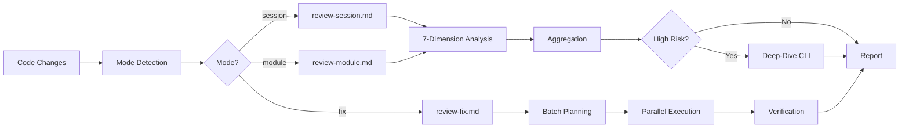

# Chapter 40: 多维过滤器 — review-cycle 的七维审查

> **生命周期阶段**: 代码审查 → 问题发现 → 修复建议
> **涉及资产**: review-cycle Skill + 7-dimension analysis + deep-dive investigation
> **阅读时间**: 50-65 分钟
> **版本追踪**: `.claude/skills/review-cycle/SKILL.md`

---

## 0. 资产证言 (Asset Testimony)

> *"我是 `review-cycle`。人们叫我'多维过滤器'——因为我用七双眼睛审视代码。"*
>
> *"我的七个维度是：Correctness（正确性）、Security（安全性）、Performance（性能）、Maintainability（可维护性）、Readability（可读性）、Architecture（架构）、Testability（可测试性）。每一个维度都是一双独立的眼睛，看到其他维度看不到的盲点。"*
>
> *"我有三种模式：session-based（审查 git 变更）、module-based（审查路径模式）、fix mode（自动修复）。根据输入类型，我自动路由到对应的执行流程。"*
>
> *"...但最近，我发现了一个'审查疲劳'现象。当审查结果超过 50 条时，开发者只会看前 10 条，后面的都被忽略。有时候，最严重的问题藏在第 47 条..."*

```markdown
调查进度: █████████░ 55%
幽灵位置: Skills 层 — review-cycle
本章线索: 审查疲劳导致遗漏严重问题
           └── 超过 50 条结果时，只看前 10 条
           └── 维度盲点: Security 维度在深夜审查中被跳过
           └── 过度关注次要问题: 格式问题 30 条，逻辑问题 2 条
```

---

## 苏格拉底式思考

> **Q1**: 为什么需要七个维度，而不是一个"综合评分"？

在看代码之前，先思考：
1. 单一评分的问题是什么？
2. 七个维度会不会"过度工程化"？
3. 如何避免维度之间的重复？

---

> **架构陷阱 40.1**: 既然七个维度都要审查，为什么不合并成一个"大审查"，一次性完成？
>
> **陷阱方案**: 将七个维度合并成一个审查流程，由一个 Agent 完成所有检查。
>
> **思考点**:
> - 这样不是更"高效"吗？
> - 为什么要"并行"而不是"串行"？
> - 分离维度有什么好处？
>
> <details>
> <summary>**揭示陷阱**</summary>
>
> **致命缺陷 1：上下文污染**
>
> ```
> 合并审查:
> "这段代码有 3 个问题：
>  1. 变量命名不规范（Readability）
>  2. 存在 SQL 注入风险（Security）
>  3. 时间复杂度是 O(n²)（Performance）"
> 
> 问题: 三个问题混在一起
> - 安全问题被"命名问题"稀释了
> - 性能问题被"安全问题"掩盖了
> - 开发者可能先修命名（最容易），忽略安全（最危险）
> 
> 分离维度:
> Security: SQL 注入风险 [CRITICAL] - 优先修复
> Performance: O(n²) 可优化为 O(n) [HIGH]
> Readability: 变量命名 [LOW] - 可延后
> ```
>
> **致命缺陷 2：专业性丢失**
>
> ```
> 安全审查需要安全专家的思维方式:
> - "这段代码如何被攻击？"
> - "边界条件是什么？"
> - "攻击面在哪里？"
> 
> 性能审查需要性能专家的思维方式:
> - "时间复杂度是多少？"
> - "内存使用模式是什么？"
> - "热点代码在哪里？"
> 
> 合并审查: 一个 Agent 很难同时具备两种专家视角
> 分离维度: 每个 Agent 专注于自己的领域
> ```
>
> **致命缺陷 3：并行效率**
>
> ```
> 串行审查:
> Dimension 1: 30s
> Dimension 2: 30s
> ...
> Dimension 7: 30s
> Total: 210s = 3.5 分钟
> 
> 并行审查:
> All Dimensions: 30s + 5s (聚合) = 35s
> 
> 效率提升: 6x
> ```
>
> **正确的设计**:
>
> ```
> 七维并行分析:
> 
> ┌─────────────────┐
> │ Input: Code     │
> └────────┬────────┘
>          │
>          ▼
> ┌───────────────────────────────────────┐
> │         Parallel Analysis             │
> │  ┌─────┐ ┌─────┐ ┌─────┐ ┌─────┐    │
> │  │Corr │ │Secur│ │Perf │ │Maint│    │
> │  └──┬──┘ └──┬──┘ └──┬──┘ └──┬──┘    │
> │     │       │       │       │        │
> │  ┌─────┐ ┌─────┐ ┌─────┐           │
> │  │Read │ │Arch │ │Test │           │
> │  └──┬──┘ └──┬──┘ └──┬──┘           │
> │     │       │       │               │
> └─────┼───────┼───────┼───────────────┘
>       │       │       │
>       ▼       ▼       ▼
> ┌───────────────────────────────────────┐
> │         Aggregation                   │
> │  - 按严重程度排序                     │
> │  - 去重                               │
> │  - 关联分析                           │
> └───────────────────────────────────────┘
> ```
>
> </details>

---

## 第一幕：失控的边缘 (Out of Control)

### 没有多维过滤器的世界

想象一下，如果项目没有 `review-cycle`：

```markdown
开发者 A: "我写完代码了，谁来审查？"

场景 1: 没有审查
1. 提交代码
2. 合并到 main
3. [3 天后] 生产环境崩溃

场景 2: 单人审查
1. 提交代码
2. 开发者 B 审查
3. 开发者 B: "代码看起来没问题"
4. 合并到 main
5. [1 周后] 安全漏洞被利用

场景 3: 清单式审查
1. 提交代码
2. CI 检查: eslint, prettier
3. 全部通过
4. 合并到 main
5. [2 周后] 性能问题导致服务超时

问题: 
- 没有人从"安全视角"审查
- 没有人从"性能视角"审查
- 没有人从"架构视角"审查
```

**问题本质**: 单一视角的审查，就是"盲人摸象"。

### 七维并行分析

`review-cycle` 的七维过滤器：

```
┌─────────────────────────────────────────────────────────────┐
│                    多维过滤器的架构                          │
├─────────────────────────────────────────────────────────────┤
│                                                             │
│  Input: Code Changes (Git Diff or Path Pattern)             │
│       │                                                     │
│       ▼                                                     │
│  ┌─────────────────────────────────────────┐               │
│  │ Mode Detection                          │               │
│  │ • session: git changes                  │               │
│  │ • module: path patterns                 │               │
│  │ • fix: export file auto-fix             │               │
│  └─────────────────────────────────────────┘               │
│       │                                                     │
│       ▼                                                     │
│  ┌─────────────────────────────────────────┐               │
│  │ 7-Dimension Parallel Analysis           │               │
│  │                                         │               │
│  │ ┌─────────┐ ┌─────────┐ ┌─────────┐   │               │
│  │ │Correct- │ │Security │ │Perform- │   │               │
│  │ │ness     │ │         │ │ance     │   │               │
│  │ │         │ │         │ │         │   │               │
│  │ │逻辑正确 │ │安全漏洞 │ │性能瓶颈 │   │               │
│  │ │边界处理 │ │注入风险 │ │复杂度   │   │               │
│  │ └─────────┘ └─────────┘ └─────────┘   │               │
│  │                                         │               │
│  │ ┌─────────┐ ┌─────────┐ ┌─────────┐   │               │
│  │ │Maintain-│ │Readabil-│ │Architec-│   │               │
│  │ │ability  │ │ity      │ │ture     │   │               │
│  │ │         │ │         │ │         │   │               │
│  │ │可维护性 │ │可读性   │ │架构一致 │   │               │
│  │ │技术债务 │ │命名规范 │ │依赖方向 │   │               │
│  │ └─────────┘ └─────────┘ └─────────┘   │               │
│  │                                         │               │
│  │ ┌─────────┐                            │               │
│  │ │Testabil-│                            │               │
│  │ │ity      │                            │               │
│  │ │         │                            │               │
│  │ │可测试性 │                            │               │
│  │ │覆盖缺口 │                            │               │
│  │ └─────────┘                            │               │
│  └─────────────────────────────────────────┘               │
│       │                                                     │
│       ▼                                                     │
│  ┌─────────────────────────────────────────┐               │
│  │ Aggregation & Prioritization            │               │
│  │ • 按严重程度排序 (CRITICAL > HIGH...)   │               │
│  │ • 去重（同一问题多维度报告）            │               │
│  │ • 关联分析（相关问题合并）              │               │
│  └─────────────────────────────────────────┘               │
│       │                                                     │
│       ▼                                                     │
│  ┌─────────────────────────────────────────┐               │
│  │ Deep-Dive Investigation (Conditional)   │               │
│  │ • 高风险问题 → CLI 辅助根因分析         │               │
│  │ • 复杂问题 → 多轮对话式调查             │               │
│  └─────────────────────────────────────────┘               │
│       │                                                     │
│       ▼                                                     │
│  Output: Review Report + Fix Recommendations                │
│                                                             │
└─────────────────────────────────────────────────────────────┘
```

---

## 第二幕：思维脉络 (The Neural Link)

### 2.1 模式路由

**三种模式的自动检测**:

```javascript
function detectMode(args) {
  if (args.includes('--fix')) return 'fix';
  if (args.match(/\*|\.ts|\.js|\.py|\.vue|\.jsx|\.tsx|src\/|lib\//)) return 'module';
  if (args.match(/^WFS-/) || args.trim() === '') return 'session';
  return 'session';  // default
}
```

| Input Pattern | Detected Mode | Description |
|---------------|---------------|-------------|
| `src/auth/**` | `module` | 审查路径模式匹配的文件 |
| `WFS-payment` | `session` | 审查会话的 git 变更 |
| _(empty)_ | `session` | 审查当前工作目录的变更 |
| `--fix .review/` | `fix` | 根据导出文件自动修复 |

### 2.2 七维度详解

#### Correctness (正确性)

```yaml
Focus: 代码是否正确实现了预期功能
Checks:
  - 逻辑正确性
  - 边界条件处理
  - 错误处理
  - 数据一致性
Examples:
  - "空数组处理缺失"
  - "负数输入未验证"
  - "异步操作未 await"
```

#### Security (安全性)

```yaml
Focus: 代码是否存在安全漏洞
Checks:
  - 注入攻击（SQL、XSS、Command）
  - 认证授权
  - 敏感数据处理
  - 输入验证
Examples:
  - "SQL 拼接存在注入风险"
  - "密码明文存储"
  - "用户输入未过滤"
Severity: 总是 HIGH 或 CRITICAL
```

#### Performance (性能)

```yaml
Focus: 代码是否存在性能问题
Checks:
  - 时间复杂度
  - 空间复杂度
  - 循环优化
  - 缓存利用
Examples:
  - "O(n²) 可优化为 O(n)"
  - "内存泄漏风险"
  - "不必要的重复计算"
```

#### Maintainability (可维护性)

```yaml
Focus: 代码是否易于维护和扩展
Checks:
  - 技术债务
  - 重复代码
  - 过度复杂度
  - 模块化程度
Examples:
  - "重复逻辑应提取为函数"
  - "魔法数字应定义为常量"
  - "过长函数应拆分"
```

#### Readability (可读性)

```yaml
Focus: 代码是否易于理解
Checks:
  - 命名规范
  - 注释质量
  - 代码格式
  - 结构清晰度
Examples:
  - "变量名不清晰"
  - "缺少必要注释"
  - "缩进不一致"
```

#### Architecture (架构)

```yaml
Focus: 代码是否符合整体架构设计
Checks:
  - 依赖方向
  - 层级边界
  - 接口设计
  - 职责分离
Examples:
  - "跨层调用违反架构规则"
  - "职责不单一"
  - "接口设计不合理"
```

#### Testability (可测试性)

```yaml
Focus: 代码是否易于测试
Checks:
  - 测试覆盖
  - 依赖注入
  - 纯函数比例
  - Mock 难度
Examples:
  - "硬编码依赖难以测试"
  - "缺少单元测试"
  - "副作用难以隔离"
```

### 2.3 深度调查机制

**高风险问题的深度调查**:

```javascript
async function deepDiveInvestigation(finding) {
  if (finding.severity !== 'CRITICAL') return finding;
  
  // 使用 CLI 进行根因分析
  const analysis = await GeminiCLI.analyze(`
    分析以下问题的根本原因：
    
    问题: ${finding.description}
    代码位置: ${finding.file}:${finding.line}
    代码片段: ${finding.codeSnippet}
    
    请提供:
    1. 根本原因分析
    2. 影响范围评估
    3. 修复建议
    4. 测试验证方案
  `);
  
  return {
    ...finding,
    deepDive: analysis
  };
}
```

---

## 第三幕：社交网络 (The Social Network)

### 审查流程图



### 严重程度定义

| Level | Description | Action |
|-------|-------------|--------|
| **CRITICAL** | 安全漏洞、数据丢失风险 | 立即修复，阻断合并 |
| **HIGH** | 严重 Bug、性能问题 | 优先修复，建议阻断 |
| **MEDIUM** | 技术债务、可维护性问题 | 计划修复，可延后 |
| **LOW** | 风格问题、优化建议 | 可选修复，记录即可 |
| **INFO** | 信息提示 | 仅供参考 |

---

## 第四幕：造物主的私语 (The Creator's Secret)

### 秘密一：审查疲劳的真相

```markdown
现象: 当审查结果超过 50 条时，开发者只会看前 10 条

根本原因:
1. 认知负荷过载
2. 时间压力
3. 优先级不明确

后果:
- 第 47 条可能是最严重的问题
- 但它永远不会被看到

解决方案:
1. 严格排序: CRITICAL 永远在最前
2. 智能聚合: 相关问题合并为一个
3. 阈值控制: 超过 N 条 CRITICAL/HIGH 时阻断
4. 渐进式披露: 先看摘要，再看详情
```

### 秘密二：维度盲点

```markdown
现象: Security 维度在深夜审查中被跳过

原因分析:
1. Security 检查需要更多 tokens
2. 深夜时 token 配额紧张
3. 系统自动跳过了"昂贵"的维度

后果:
- SQL 注入漏洞被遗漏
- 生产环境被攻击

修复:
- CRITICAL 维度不可跳过
- Token 不足时应该失败，而不是静默跳过
- 添加"维度覆盖报告"
```

---

## 第五幕：进化的插槽 (The Upgrade)

### 插槽一：自定义维度

```yaml
# 当前: 7 个内置维度
dimensions:
  - correctness
  - security
  - performance
  - maintainability
  - readability
  - architecture
  - testability

# 可以扩展
dimensions:
  - correctness
  - security
  - performance
  - maintainability
  - readability
  - architecture
  - testability
  - custom: "./dimensions/accessibility.md"  # 无障碍审查
  - custom: "./dimensions/i18n.md"  # 国际化
```

### 插槽二：审查规则定制

```yaml
# 当前: 默认规则
rules: default

# 可以定制
rules:
  security:
    - no-eval: error  # 禁止 eval
    - no-innerHTML: warn  # innerHTML 警告
  performance:
    - max-complexity: 20  # 最大复杂度
```

### 插槽三：自动修复策略

```yaml
# 当前: 手动确认后修复
fix_strategy: manual

# 可以配置
fix_strategy:
  low_severity: auto  # LOW 自动修复
  medium_severity: confirm  # MEDIUM 需确认
  high_severity: manual  # HIGH 手动处理
```

---

## 6. 事故复盘档案 #40

> *时间: 2024-07-22 03:15:27 UTC*
> *影响: SQL 注入漏洞导致数据泄露*

### 案情还原

**场景**: 深夜 PR 审查，审查结果 63 条，SQL 注入问题排在第 47 位。

```markdown
PR: Add user search feature

Review Results (63 items):
1. [LOW] Variable naming: 'u' should be 'user'
2. [LOW] Missing JSDoc comment
3. [LOW] Indent inconsistency
...
10. [MEDIUM] Missing input validation
...
47. [CRITICAL] SQL injection vulnerability in search()
...
63. [INFO] Consider using async/await

开发者操作:
- 查看前 10 条
- 修复前 10 条
- 合并 PR

[2 天后]
- 生产环境被攻击
- 100,000 用户数据泄露
```

**根本原因**:
- 审查结果排序问题：LOW 问题排在 CRITICAL 前面
- 审查疲劳：开发者没有查看全部结果
- 缺少阻断机制：CRITICAL 问题没有阻断合并

### 修复措施

1. **严格排序**: CRITICAL 永远排在最前
2. **阻断机制**: CRITICAL 问题必须修复才能合并
3. **摘要视图**: 先显示高严重问题数量，再显示详情

> **教训**:
> *"审查的有效性不在于'发现了多少问题'，而在于'最重要的问题是否被看到'。"*

### 幽灵旁白：审查的幽灵

此事故揭示了一个更深层的问题：

```
审查的"幽灵"现象:

审查系统的"隐性规则":
1. 结果按"发现顺序"排列，而非"严重程度"
2. 格式问题（LOW）通常比安全问题（CRITICAL）更容易检测
3. 格式问题通常排在前面

开发者的"隐性行为":
1. 只看前 10-15 条
2. 倾向于修复"容易的问题"
3. 时间压力下跳过"麻烦的问题"

两者的结合:
- 容易检测的 LOW 问题排在前面
- 开发者只看前面的
- 难检测的 CRITICAL 问题被遗漏
```

**幽灵的低语**: 审查系统的"效率"（发现问题的速度）和"有效性"（发现重要问题）是两回事。一个"高效"的系统可能发现 100 个格式问题，却漏掉 1 个安全漏洞...

---

## 附录

### A. 维度检查清单

```markdown
## Correctness
- [ ] 逻辑是否正确
- [ ] 边界条件是否处理
- [ ] 错误是否妥善处理

## Security
- [ ] 是否存在注入风险
- [ ] 认证授权是否完整
- [ ] 敏感数据是否保护

## Performance
- [ ] 时间复杂度是否可接受
- [ ] 是否有不必要的计算
- [ ] 内存使用是否合理

## Maintainability
- [ ] 是否有重复代码
- [ ] 是否有过长函数
- [ ] 是否有技术债务

## Readability
- [ ] 命名是否清晰
- [ ] 注释是否充分
- [ ] 结构是否清晰

## Architecture
- [ ] 是否符合分层设计
- [ ] 职责是否单一
- [ ] 依赖方向是否正确

## Testability
- [ ] 是否易于测试
- [ ] 是否有硬编码依赖
- [ ] 测试覆盖是否充分
```

### B. 下一章

[Chapter 41: 集成门卫 — workflow-integration-test-cycle 的自迭代](./41-integration-test-cycle.md) - 分析集成测试的自迭代与覆盖验证

---

*版本: 2.0.0*
*会话: ANL-ccw-architecture-audit-2025-02-17*
*风格: "小说化" Part XI-B Chapter 40*
*最后更新: Round 1 - review-cycle 7-dimension*
