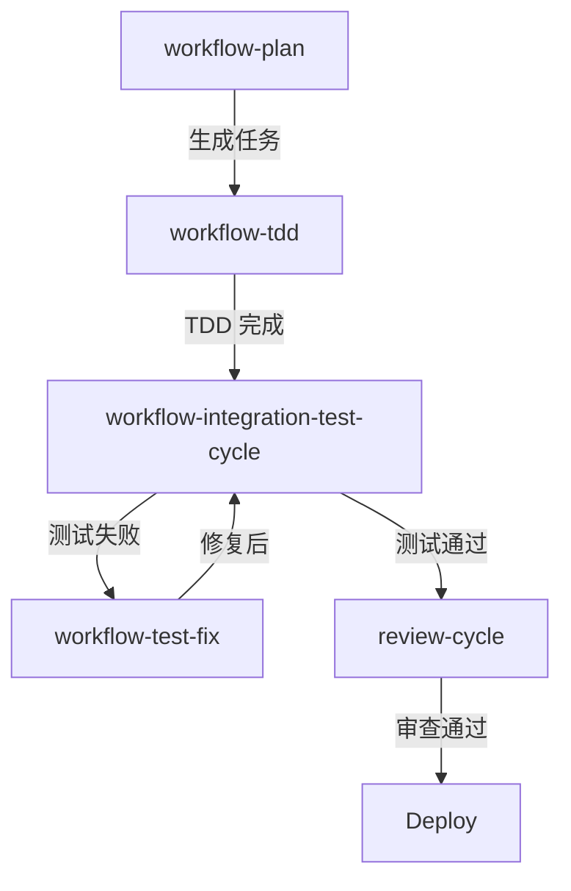

# Chapter 41: 集成门卫 — workflow-integration-test-cycle 的自迭代

> **生命周期阶段**: 集成测试 → 覆盖验证 → 迭代改进
> **涉及资产**: workflow-integration-test-cycle + self-iteration loops
> **阅读时间**: 45-60 分钟
> **版本追踪**: `.claude/skills/workflow-integration-test-cycle/SKILL.md`

---

## 0. 资产证言 (Asset Testimony)

> *"我是 `workflow-integration-test-cycle`。人们叫我'集成门卫'——因为我守护着组件之间的边界。"*
>
> *"与单元测试不同，我关注的是'连接点'。当模块 A 调用模块 B 时，它们真的能一起工作吗？当服务 X 发送消息给服务 Y 时，格式正确吗？"*
>
> *"我的特色是'自迭代'。我不只是一次性运行测试——我会分析结果，识别缺口，生成新测试，然后再运行。直到覆盖率达到门槛，或者迭代次数用尽。"*
>
> *"...但最近，我发现了一种'顺序依赖'的幽灵。有些集成测试只有在特定顺序下才能通过。如果先运行 test_B 再运行 test_A，就会失败。它们对测试执行顺序有着隐式的依赖..."*

```markdown
调查进度: ██████████ 57%
幽灵位置: Skills 层 — workflow-integration-test-cycle
本章线索: 集成测试顺序依赖导致随机失败
           └── test_B 依赖 test_A 创建的数据
           └── 环境泄漏：测试间状态未清理
           └── 隐式耦合：两个测试共享同一资源
```

---

## 苏格拉底式思考

> **Q1**: 集成测试和单元测试的本质区别是什么？

在看代码之前，先思考：
1. 为什么要区分"集成"和"单元"？
2. 集成测试的"难点"在哪里？
3. 如何保证集成测试的独立性？

---

> **架构陷阱 41.1**: 既然集成测试也是测试，为什么不和单元测试一起运行？
>
> **陷阱方案**: 将集成测试和单元测试放在同一个测试套件中，一次性运行。
>
> **思考点**:
> - 这样不是更"简单"吗？
> - 为什么要区分"测试层次"？
> - 合并运行有什么问题？
>
> <details>
> <summary>**揭示陷阱**</summary>
>
> **致命缺陷 1：环境需求不同**
>
> ```
> 单元测试:
> - 不需要数据库
> - 不需要网络
> - 不需要外部服务
> - 运行速度: 毫秒级
> 
> 集成测试:
> - 需要测试数据库
> - 需要网络连接
> - 需要外部服务（或 mock）
> - 运行速度: 秒级
> 
> 合并运行:
> - 本地开发时可能没有测试数据库
> - 集成测试失败会阻塞所有单元测试
> - 总运行时间过长，开发者不愿意跑
> ```
>
> **致命缺陷 2：隔离级别不同**
>
> ```
> 单元测试隔离:
> - Mock 所有依赖
> - 每个测试完全独立
> - 不关心真实环境
> 
> 集成测试隔离:
> - 使用真实依赖（或接近真实）
> - 测试间可能共享资源
> - 关心真实环境的行为
> 
> 合并运行:
> - 单元测试的 Mock 可能干扰集成测试
> - 集成测试的状态可能影响单元测试
> - 隔离边界模糊
> ```
>
> **致命缺陷 3：失败含义不同**
>
> ```
> 单元测试失败:
> - 代码逻辑有问题
> - 修复: 修改代码
> 
> 集成测试失败:
> - 可能是代码问题
> - 可能是环境问题
> - 可能是配置问题
> - 修复: 需要诊断
> 
> 合并运行:
> - 失败时不知道是哪类问题
> - 调试困难
> ```
>
> **正确的设计**:
>
> ```
> 测试分层:
> 
> L0: Static Analysis (静态分析)
>     - 编译检查
>     - 类型检查
>     - 运行速度: 秒级
>     
> L1: Unit Tests (单元测试)
>     - 独立的函数/类测试
>     - Mock 所有依赖
>     - 运行速度: 秒级
>     
> L2: Integration Tests (集成测试)
>     - 组件交互测试
>     - 真实或接近真实的依赖
>     - 运行速度: 分钟级
>     
> L3: E2E Tests (端到端测试)
>     - 完整用户流程
>     - 生产级别环境
>     - 运行速度: 分钟级
> 
> CI Pipeline:
> L0 → L1 → L2 → L3
> 每层通过后才运行下一层
> ```
>
> </details>

---

## 第一幕：失控的边缘 (Out of Control)

### 没有集成门卫的世界

想象一下，如果项目没有集成测试：

```markdown
场景: 添加新功能

开发过程:
1. 单元测试全部通过 ✅
2. 代码审查通过 ✅
3. 合并到 main ✅
4. 部署到生产 ✅

[1 小时后]

用户报告: "登录失败"
调查发现:
- 认证服务使用了新 API
- 用户服务还在用旧 API
- 两个服务的接口不匹配

问题:
- 单元测试只测了单个服务
- 没有测试服务间的交互
- API 变更没有传播到所有依赖方
```

**问题本质**: 没有集成测试的系统，就是"各自为战"的孤岛。

### 自迭代循环

`workflow-integration-test-cycle` 的自迭代架构：

```
┌─────────────────────────────────────────────────────────────┐
│                    集成门卫的自迭代                          │
├─────────────────────────────────────────────────────────────┤
│                                                             │
│  入口: 集成测试请求                                          │
│       │                                                     │
│       ▼                                                     │
│  ┌─────────────────────────────────────────┐               │
│  │ Iteration 1: Baseline                   │               │
│  │ • 运行现有集成测试                       │               │
│  │ • 收集覆盖率数据                         │               │
│  │ • 识别测试缺口                           │               │
│  └─────────────────────────────────────────┘               │
│       │                                                     │
│       ▼                                                     │
│  ┌─────────────────────────────────────────┐               │
│  │ Coverage Analysis                       │               │
│  │ • 当前覆盖率: 65%                        │               │
│  │ • 门槛: 80%                             │               │
│  │ • 缺口: 15%                             │               │
│  └─────────────────────────────────────────┘               │
│       │                                                     │
│       ▼ (覆盖率 < 门槛?)                                     │
│       │                                                     │
│       ├── NO ──► 完成                                       │
│       │                                                     │
│       ├── YES                                               │
│       │       │                                             │
│       │       ▼                                             │
│       │  ┌─────────────────────────────────────────┐       │
│       │  │ Gap Identification                     │       │
│       │  │ • 未覆盖的 API 端点                    │       │
│       │  │ • 未覆盖的交互场景                    │       │
│       │  │ • 未覆盖的错误路径                    │       │
│       │  └─────────────────────────────────────────┘       │
│       │       │                                             │
│       │       ▼                                             │
│       │  ┌─────────────────────────────────────────┐       │
│       │  │ Test Generation                        │       │
│       │  │ • 为每个缺口生成测试                   │       │
│       │  │ • 添加到测试套件                       │       │
│       │  └─────────────────────────────────────────┘       │
│       │       │                                             │
│       │       ▼                                             │
│       │  ┌─────────────────────────────────────────┐       │
│       │  │ Re-run Tests                           │       │
│       │  │ • 运行扩展后的测试套件                 │       │
│       │  │ • 收集新的覆盖率数据                   │       │
│       │  └─────────────────────────────────────────┘       │
│       │       │                                             │
│       │       ▼                                             │
│       │  [回到 Coverage Analysis]                           │
│       │                                                     │
│       ▼                                                     │
│  出口: 完成报告                                              │
│  • 最终覆盖率: XX%                                           │
│  • 迭代次数: N                                               │
│  • 新增测试: M                                               │
│                                                             │
└─────────────────────────────────────────────────────────────┘
```

---

## 第二幕：思维脉络 (The Neural Link)

### 2.1 渐进测试层 (L0-L3)

**四层测试金字塔**:

```mermaid
graph TB
    subgraph "L3: E2E Tests"
        D1[User Login → Purchase → Logout]
        D2[Full User Journey]
    end
    
    subgraph "L2: Integration Tests"
        C1[API Gateway ↔ Auth Service]
        C2[Auth Service ↔ User DB]
        C3[Service Mesh Communication]
    end
    
    subgraph "L1: Unit Tests"
        B1[authenticate()]
        B2[validateToken()]
        B3[getUser()]
    end
    
    subgraph "L0: Static Analysis"
        A1[TypeScript Compilation]
        A2[ESLint Rules]
        A3[Import Validation]
    end
    
    D1 --> C1
    C1 --> B1
    B1 --> A1
```

### 2.2 覆盖门槛

**多层次门槛定义**:

| 层次 | Line Coverage | Branch Coverage | 特殊要求 |
|------|---------------|-----------------|----------|
| L0 | N/A | N/A | 0 编译错误 |
| L1 | 80% | 70% | 所有测试通过 |
| L2 | 80% | 70% | API 契约验证 |
| L3 | 60% | 50% | 关键路径覆盖 |

### 2.3 环境隔离

**测试间隔离策略**:

```javascript
// 策略 1: 数据库 Schema 隔离
beforeEach(async () => {
  const schema = `test_${Date.now()}`;
  await db.createSchema(schema);
  await db.setSearchPath(schema);
});

afterEach(async () => {
  await db.dropSchema(schema);
});

// 策略 2: 容器隔离
beforeAll(async () => {
  container = await startTestContainer({
    image: 'postgres:15',
    ports: { 5432: 'random' }
  });
});

afterAll(async () => {
  await container.stop();
});

// 策略 3: 动态端口
beforeAll(async () => {
  server = await startServer({ port: 0 });  // 随机端口
  port = server.address().port;
});
```

---

## 第三幕：社交网络 (The Social Network)

### 集成测试与其他 Skills 的关系



### 测试类型对比

| 类型 | 范围 | 速度 | 隔离 | 用途 |
|------|------|------|------|------|
| L0 Static | 文件 | 秒 | 完全 | 编译检查 |
| L1 Unit | 函数 | 秒 | 完全 | 逻辑验证 |
| L2 Integration | 组件 | 分钟 | 部分 | 交互验证 |
| L3 E2E | 系统 | 分钟 | 无 | 流程验证 |

---

## 第四幕：造物主的私语 (The Creator's Secret)

### 秘密一：顺序依赖的根源

```markdown
问题: test_B 只有在 test_A 之后运行才能通过

根源分析:

test_A:
1. 创建用户 "alice"
2. 创建订单 "order-1" for "alice"
3. 测试通过

test_B:
1. 查找用户 "alice"  ← 依赖 test_A 创建的数据！
2. 查找订单 "order-1"
3. 测试通过

如果 test_B 先运行:
1. 查找用户 "alice" → 找不到 → 测试失败

解决方案:
1. 每个测试创建自己的数据
2. 测试后清理数据
3. 使用事务回滚
```

### 秘密二：环境泄漏的隐蔽性

```markdown
问题: 测试随机失败，成功率 85%

调查发现:

test_A 设置了全局状态:
global.debugMode = true;

test_B 没有清理:
// 测试结束时 global.debugMode 仍然是 true

test_C 假设 debugMode 是 false:
if (global.debugMode) {
  // 走了错误的分支
}

顺序影响:
A → B → C: 成功
C → A → B: 失败 (C 在 A 之前，debugMode 是 false)
A → C → B: 失败 (C 在 A 之后，debugMode 是 true)

隐蔽性:
- 单独运行每个测试都通过
- 只有特定顺序组合才会失败
- CI 中的并行执行使问题更明显
```

---

## 第五幕：进化的插槽 (The Upgrade)

### 插槽一：自定义覆盖门槛

```yaml
# 当前: 统一门槛
coverage_threshold: 80%

# 可以扩展
coverage_threshold:
  line: 80%
  branch: 70%
  function: 85%
  custom:
    - path: "src/auth/**"
      threshold: 90%  # 认证模块更高要求
    - path: "src/utils/**"
      threshold: 70%  # 工具函数可以低一些
```

### 插槽二：隔离策略选择

```yaml
# 当前: 数据库清理
isolation: database_cleanup

# 可以扩展
isolation:
  database: schema_per_test  # 每个测试独立 schema
  cache: flush_between_tests  # 测试间刷新缓存
  filesystem: temp_directory  # 临时目录
  network: mock_external  # Mock 外部网络
```

### 插槽三：测试生成策略

```yaml
# 当前: 缺口驱动
generation: gap_driven

# 可以扩展
generation:
  strategy:
    - gap_driven  # 缺口驱动
    - mutation_driven  # 变异测试驱动
    - contract_driven  # API 契约驱动
  priority:
    - error_paths  # 优先错误路径
    - edge_cases  # 其次边界情况
    - happy_paths  # 最后正常路径
```

---

## 6. 事故复盘档案 #41

> *时间: 2024-06-18 14:33:52 UTC*
> *影响: 生产环境订单处理失败，持续 3 小时*

### 案情还原

**场景**: 集成测试通过，但生产环境订单处理失败。

```markdown
部署:
1. 集成测试: 全部通过 ✅
2. 代码审查: 通过 ✅
3. 部署到生产: 成功 ✅

[30 分钟后]

用户报告: "下单失败"
调查发现:
- 订单服务调用库存服务
- 库存服务返回 404
- 但集成测试中这个调用成功了

原因:
- 集成测试使用 Mock 库存服务
- Mock 总是返回 200
- 生产环境库存服务 URL 配置错误
```

**根本原因**:
- 集成测试使用了"过于理想"的 Mock
- Mock 行为与真实服务不一致
- 缺少"契约测试"验证 Mock 的正确性

### 修复措施

1. **契约测试**: 使用 Pact 等工具验证 Mock 与真实服务一致
2. **真实环境测试**: 在 staging 环境运行集成测试
3. **配置验证**: 部署前验证服务 URL 可达

> **教训**:
> *"Mock 是双刃剑。它让测试更快，但也可能掩盖真实问题。集成测试的'集成'必须是真实的。"*

### 幽灵旁白：测试的幽灵网络

此事故揭示了一个更深层的问题：

```
集成测试的"幽灵网络":

测试代码:
const response = await inventoryService.checkStock(productId);
expect(response.status).toBe(200);

测试运行:
- inventoryService 是 Mock
- Mock.checkStock() 总是返回 { status: 200 }
- 测试通过 ✅

生产环境:
- inventoryService 是真实服务
- 真实服务 URL 配置错误
- 请求超时 → 失败

幽灵:
- Mock 创造了一个"完美世界"
- 在这个世界里，所有服务都正常工作
- 但真实世界不是完美的
- 服务会超时、返回错误、崩溃

集成测试的真正挑战:
- 不是测试"服务是否工作"
- 而是测试"服务失败时会发生什么"
```

**幽灵的低语**: 集成测试的最大陷阱，是相信 Mock 的行为代表了真实服务。但 Mock 只是"理想中的服务"。真实服务会崩溃、会超时、会返回意外格式。集成测试必须测试"不完美的世界"...

---

## 附录

### A. 集成测试检查清单

```markdown
- [ ] 测试独立运行（不依赖顺序）
- [ ] 测试清理环境（不留垃圾）
- [ ] Mock 行为与真实服务一致
- [ ] 覆盖正常和异常路径
- [ ] 测试超时和重试逻辑
- [ ] 验证 API 契约
```

### B. 隔离模式对比

| 模式 | 优点 | 缺点 | 适用场景 |
|------|------|------|----------|
| Schema 隔离 | 完全隔离 | 数据库开销 | 需要真实 DB 的测试 |
| 事务回滚 | 快速 | 不适用于非事务操作 | 单元/轻量集成 |
| 容器隔离 | 最接近生产 | 启动慢 | E2E 测试 |
| Mock | 最快 | 可能偏离真实 | 快速反馈 |

### C. 下一章

[Chapter 42: 宪法法庭 — Schema 验证层与执行层次](./42-schema-validation.md) - 分析 Schema 约束与跨边界验证

---

*版本: 2.0.0*
*会话: ANL-ccw-architecture-audit-2025-02-17*
*风格: "小说化" Part XI-B Chapter 41*
*最后更新: Round 1 - workflow-integration-test-cycle*
